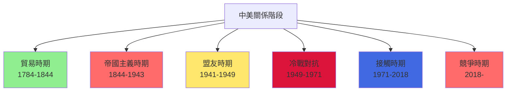

# HIST2118 中美關係史 / Chinese and Americans: A Cultural and International History

**Instructor**: Guoqi Xu (徐國琦)
**Department**: History, HKU
**Official source**: [HKU History Course Description 2024-25](https://history.hku.hk/wp-content/uploads/2024/07/HIST-2425.pdf)
**Style**: 袁騰飛式 — 犀利分析：中美兩國互相塑造對方，但係永遠隔住一層有色眼鏡

---

## 問題 1：5 個核心心智模型

### 心智模型 1：「中美共同使命」——從共享價值到戰略競爭
學者 **Guoqi Xu**（徐國琦，*Odd Arne Westad* 合作）提出「共同歷史」（shared history）框架：中美關係唔單純係權力鬥爭，而係兩國人民共同塑造嘅歷史。學者 **Warren Cohen**（*America's Response to China*, 2010）分析美國對華政策從「門戶開放」到「遏制」到「接觸」嘅演變。

- **1784** 美國商船「中國皇后號」抵達廣州——中美直接接觸開始
- **1844** 望廈條約——美國獲得在華最惠國待遇
- **1943** 取消排華法案——中美正式盟友

### 心智模型 2：「苦力貿易」與「美國華人」——被忽視的美國歷史
學者 **John K. Fairbank** 指出：華工係建設美國西部主力——從加州淘金到中央太平洋鐵路。學者 **Elliott Young**（*Alien Neighbors, Foreign Friends*, 2014）分析華人點解成為美國種族主義最早期受害者之一。

- **1848-1882** 華工建設美國西部鐵路——死亡人數不詳但極高
- **1882** 排華法案——美國首個針對特定種族移民法
- **1943** 排華法案廢除——但限額制度保留至 1965

### 心智模型 3：「中美共同抗日」——二戰時期真正盟友關係
學者 **Michael McClymond**（*Over the Himalayas and Through the Gateways*, 2009）分析：中美喺二戰期間確實係真正盟友——史迪威將軍協調中國戰場、陳納德飛虎隊保護中國上空。

### 心智模型 4：「冷戰盟友與敵人」——1949-1971 嘅身份混亂
學者 **Odd Arne Westad**（*Decisive Encounters*, 2003）指出：1949 年中共建政後，美國對華政策陷入身份危機——曾經盟友變敵人，但係又唔願意承認共產主義中國合法性。

### 心智模型 5：「美國例外」vs「中國例外」——兩個超大型國家的自我認知衝突
學者 **Samuel Huntington**（*The Clash of Civilizations*, 1996）認為中美衝突係文明衝突；但學者 **Alastair Iain Johnston**（*Thinking About Strategic Interaction*, 2004）指出中美衝突更多係現實利益計算。

---

## 問題 2：3 個根本分歧

### 分歧 1：中美關係史——係「友誼史」定係「帝國主義史」？
- **A 方（Xu/友誼派）**：中美兩國人民喺歷史上有大量共同經歷——傳教士、留學生、文化交流——呢啲係真正友誼基礎
- **B 方（批判派）**：學者 **Michael Hunt**（*The Making of a Special Relationship*, 2013）——美國對華政策從來以美國利益為先；門戶開放就係另一種帝國主義

### 分歧 2：美國華人——係「模範少數族裔」定係「永遠的外國人」？
- **A 方（融合派）**：華人移民後代今日已全面融入美國社會
- **B 方（批判派）**：學者 **Lisa Lowe**（*The Intimacy of Four Continents*, 2015）——華人永遠被視為「永遠的外國人」（perpetual foreigners）

### 分歧 3：今日美中衝突——係「歷史必然」定係「政策失誤」？
- **A 方（結構主義）**：中美衝突係大國權力轉移必然結果——修昔底德陷阱
- **B 方（偶然論）**：學者 **Robert S. Ross**——如果 1972 年後美國政策不同，今日可能唔同

---

## 問題 3：10 個深度問題

1. 1784 年「中國皇后號」——點解一隻美國商船可以建立中美關係？但係呢段關係點解最終走向不平等條約？
2. 美國排華法案（1882）——點解美國華人係所有亞裔群體中最先被歧視？而且歧視點解持續至 1965 年？
3. 美國傳教士——點解佢哋去中國？佢哋係文化使者定係帝國主義先頭部隊？具體案例：傳教士建立咗邊啲中國至今仍然存在嘅大學/醫院？
4. 二戰期間——史迪威將軍同蔣介石嘅衝突，揭示美中盟友關係乜嘢內在矛盾？
5. 1949-1971 年——美國點解「失去中國」？係因為毛澤東「背叛」定係因為美國對華政策根本錯誤？
6. 乒乓外交（1971）——點解一場體育運動可以打開兩國外交大門？呢個揭示咗中美關係乜嘢非理性面向？
7. 台灣問題——點解中美建交（1979）必須犧牲台灣？台灣喺中美關係中永遠係乜嘢角色？
8. 1990-2008 年美中「接觸政策」——呢個政策失敗咗嗎？係政策本身有問題，定係執行問題？
9. 美中貿易戰（2018-）——點解中美可以同時係最大貿易夥伴、又係最大戰略競爭對手？呢個矛盾可持續嗎？
10. 如果你是美國總統（拜登或特朗普）——面對中國崛起，你會點做？接觸、遏制、還是另類？

---

# 核心心智模型深化（中英對照）

## 1. 中美共同歷史 / Sino-American Shared History

### 1.1 Bilingual 概念對照
- 門戶開放 (ménhù kāifàng) = Open Door Policy — 美國對華政策核心原則
- 排華法案 (páihuá fǎ'àn) = Chinese Exclusion Act — 1882-1943 美國法例
- 苦力 (kǔlì) = Coolie — 契約華工

### 1.3 袁騰飛式犀利觀察
> 「美國成日話佢係『自由世界領袖』——但係佢曾經制訂咗世界上第一個種族主義移民法（排華法案），而且持續執行咗 61 年！自由燈塔幾時開始只照白人？」

### 1.4 Deep Test Question
**考試題**：用「共同歷史」框架，分析中美兩國人民喺邊啲歷史時刻真正共同經歷過類似命運？呢啲共同經歷點解未能改變兩國政府嘅敵對關係？

### 1.5 圖解

---

## 深度自測問題

**Q1**：1784 年「中國皇后號」之所以可以建立中美接觸——因為當時美國係新興國家，尚未有歐洲列強咁強嘅殖民帝國野心；但係隨住美國實力增强，佢對華政策逐漸轉向霸權。

**Q2-Q10** 精簡版：
- Q2：排華法案之所以通過——因為加州華工被認為係「低劣」種族，威脅白人工人飯碗；華人之所以最受歧視——因為佢哋文化差異最大、又唔肯融入。
- Q3：傳教士——佢哋確實建立咗燕京大學（今北京大學前身）、嗇和醫院；但係同時亦傳播西方文化優越論。
- Q4：史迪威-蔣介石衝突——揭示盟友之間利益衝突：美國要蔣介石打日本、蔣要保存實力對付中共。
- Q5：美國「失去中國」——因為國民黨腐敗無能 + 中共農民動員成功 + 美國對華政策失誤，三者缺一不可。
- Q6：乒乓外交——揭示國際關係中嘅「個人因素」同「意外外交」；小球轉動大球。
- Q7：台灣——係中美關係中永遠嘅「第三方」；中美建交時美國選擇放棄台灣，换取中國關係正常化。
- Q8：接觸政策——部分成功（中國融入世界貿易體系）、部分失敗（中國政治體制並未西化）。
- Q9：中美矛盾可持續——因為結構性因素（技術競爭、軍事平衡、意識形態差異）唔會短期消失；但係經濟互依令全面衝突代價太高。
- Q10（開放題）：呢個係政策辯論——學生需要权衡接觸 vs 遏制優劣。

---

## 總結

**HIST2118 Chinese and Americans** 嘅核心價值：
1. **跨文化理解**——中美關係唔單純係大國政治，而係兩國人民共同經歷嘅歷史
2. **批判性分析**——美國對華政策從未完全脫離帝國主義話語
3. **當代相關性**——美中關係係 21 世紀最重要嘅雙邊關係

**袁騰飛金句**：
> 「中美關係最有趣嘅地方——就係兩國人民都話自己係受害者，但係又都話自己係正義一方。歷史真相就係：兩邊都有道理，兩邊都有問題。」

---

## 延伸閱讀

1. Cohen, Warren I. *America's Response to China: A History of Sino-American Relations*. New York: Columbia University Press, 2010.
2. Xu Guoqi (徐國琦). *Strangers on the Western Front: Chinese Workers in the Great War*. Cambridge: Harvard University Press, 2011.
3. Westad, Odd Arne. *Restless Empire: China and the World Since 1750*. London: Bodley Head, 2012.
4. Hunt, Michael H. *The Making of a Special Relationship: The United States and China to 1914*. New York: Columbia University Press, 2013.
5. Lee, Robert G. *Orientals: Asians in White America*. Philadelphia: Temple University Press, 1999.
6. McClymond, Michael. *Over the Himalayas and Through the Gateways*. Stanford: Stanford University Press, 2009.
