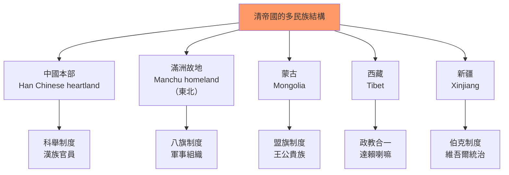
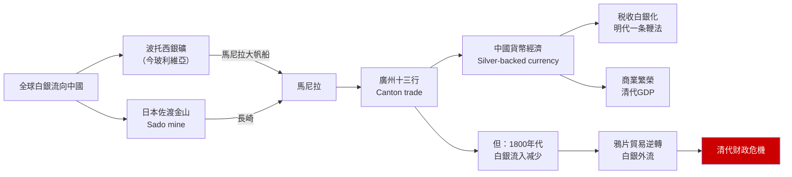
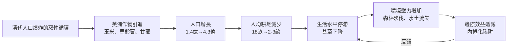
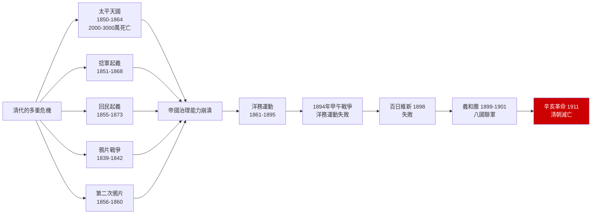
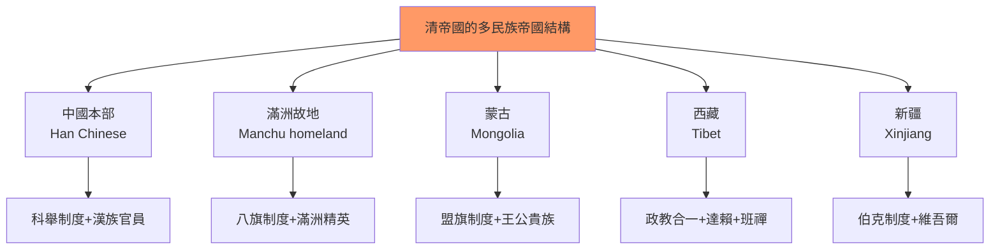
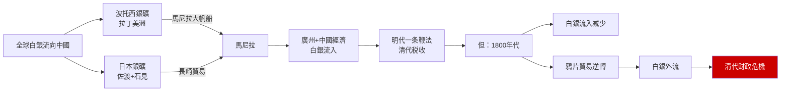
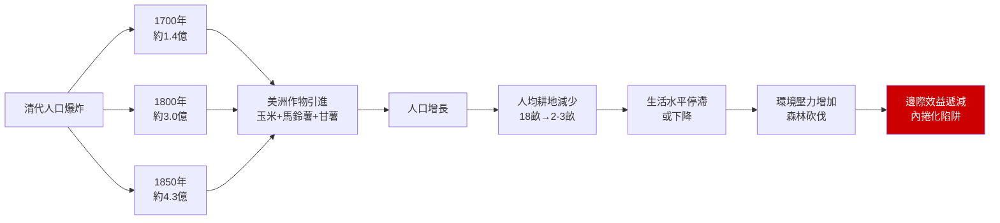
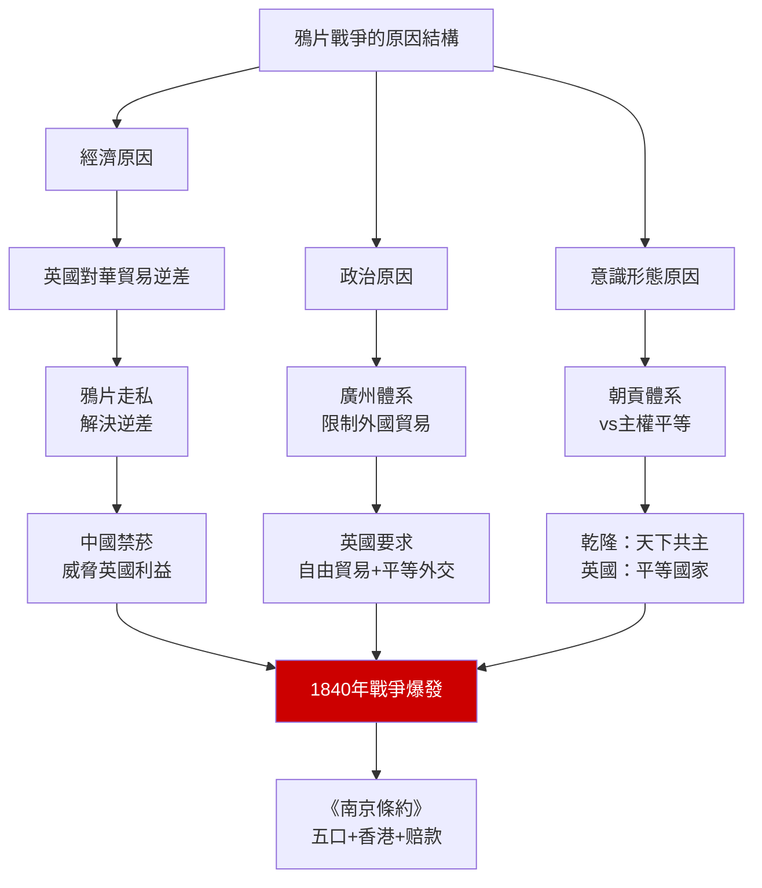
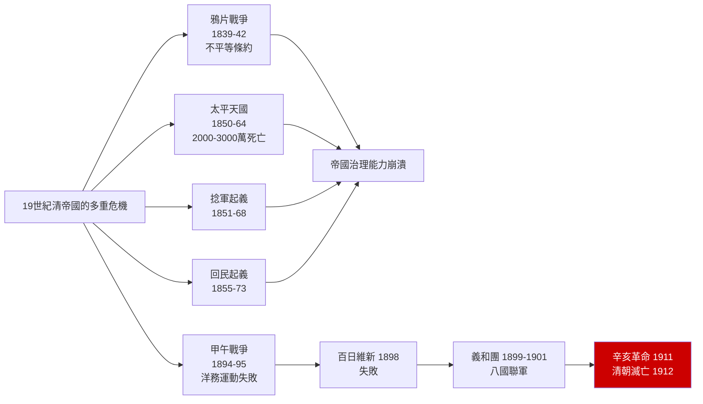

# HIST2127 — 清代中國與世界 / Qing China in the World, 1644-1912

/** HKU | 6 credits | Instructor: William R. Kelson */

---

## 問題 1：5 個核心心智模型

### 1. 滿洲帝國 vs 中國王朝——清帝國的雙重認同（The Qing Empire: Manchu Empire or Chinese Dynasty?）
**定義**: 學者Peter Perdue和David Wright研究：清朝統治者從來不僅僅是「中國的皇帝」，更是「滿洲、蒙古、西藏和維吾爾的大汗」。清帝國是一個多民族帝國（manzhou empire），而非單純的「中國王朝」。這種雙重身份塑造了清代中國獨特的政治邏輯和外交策略。

**學者**:
- **Peter Perdue** — *China Marches West: The Qing Conquest of Central Eurasia* (2005)
- **David Shue** — *The Rise of the Chinese Empire* (2007)
- **Evelyn Rawski** — *The Last Emperors: A Social History of Qing Imperial Institutions* (1998)
- **Mark Elliott** — *The Manchu Way: The Eight Banners and Ethnic Identity in Late Imperial China* (2001)
- **Jonathan Spence** — *The Search for Modern China* (1990)

**驗證**: 1793年馬戛爾尼使華時，乾隆皇帝在熱河接見他時的身份是「大清皇帝」，而非單純的「中國皇帝」。乾隆在接見中自称「天下共主」，對英國的「平等外交」要求不屑一顾。

**歷史事件**:
- **1636年**: 皇太極稱帝，建立清朝——以「滿洲」為主體
- **1644年**: 清軍入關——開始對全中國的統治
- **1683年**: 統一台灣——完成對中國本部的統一
- **1755-1757年**: 擊敗準噶爾——控制新疆和中亞
- **1793年**: 馬戛爾尼使華——清帝國與現代國際體系的第一次接觸

### 2. 白銀流入與貨幣革命——全球化對中國的影響（Silver Flows and Monetary Revolution）
**定義**: 1500-1800農曆年間，美洲和日本的白銀約50%流入中國。學者William Atwell和Dennis Flynn研究：這種大規模的白銀流入，塑造了明代和清代的貨幣經濟，並間接資助了清代前期的經濟繁榮。

**學者**:
- **Dennis Flynn & Arturo Giráldez** — research on global silver flows
- **William Atwell** — *International Bullion Flows and the Chinese Economy* (2002)
- **Man-houng Lin** — *China Upside Down* (2006)
- **Kenneth Pomeranz** — *The Great Divergence* (2000)

**驗證**: 1808-1856農曆年間，全球約50,000-60,000噸白銀流入中國——這些白銀主要來自拉丁美洲（波托西銀礦）和日本（佐渡金山）。白銀流入的减少，直接影響了清代後期的财政危機。

**歷史事件**:
- **1540年代**: 西班牙殖民者在美洲發現銀礦——全球白銀流通開始
- **1565年**: 馬尼拉大帆船貿易開始——白銀大規模流入中國
- **1644年**: 清軍入關——白銀流入繼續
- **1800年代**: 白銀流入开始减少——清代财政危機開始
- **1850年代**: 太平天國起義——财政危機+戰爭=双重危機

### 3. 人口爆炸與生態危機（Population Explosion and Ecological Crisis）
**定義**: 1760-1850農曆年間，清代人口從約1.4億增至約4.3億——這種人口爆炸對土地、生態和社會穩定帶來了巨大壓力。馬鈴薯、玉米和甘薯從美洲傳入中國，為人口增長提供了食物基礎，但也帶來了生態破壞。

**學者**:
- **Lee Bad** — research on Qing population
- **Wang Yeh-chien** — *China's Economic Development in the Long Run* (1973)
- **Kenneth Pomeranz** — *The Great Divergence* (2000)
- **Mark Elvin** — *The Pattern of the Chinese Past* (1973)

**驗證**: 1760年代玉米和馬鈴薯在中國西南山區的推廣，為人口從山區向邊疆遷移提供了基礎——但也導致了雲南山區的森林砍伐和水土流失。人口的「內捲化」（involution）是清代經濟停滯的重要原因。

**歷史事件**:
- **1650年代**: 玉米傳入中國——主要在山區種植
- **1700年代**: 馬鈴薯傳入中國——為人口增長提供食物
- **1760-1850**: 人口從1.4億增至4.3億
- **1790年代**: 乾隆年間人口高峰期
- **1850-1870**: 太平天國+瘟疫——人口銳減

### 4. 鴉片戰爭——開放國門的暴力（The Opium Wars: Violence of Opening China）
**定義**: 1839-1842年鴉片戰爭是中國近代史的開端。學者Mao Haijian和John Fairbank研究：這場戰爭不是「西方侵略」和「中國落後」的簡單故事，而是兩個帝國在貿易、稅收和主權問題上的正面碰撞。

**學者**:
- **Mao Haijian** (茅海建) — *The Qing Empire and the Opium War* (2016)
- **John K. Fairbank** — *The United States and China* (1948)
- **Haijian Mao** — research on Opium War origins
- **David Owen** — research on British opium trade

**驗證**: 1842年《南京條約》：中國賠償白銀2,100萬圓（等於當時清政府約兩年的總税收），割讓香港島，開放五口通商（廣州、廈門、福州、寧波、上海）。

**歷史事件**:
- **1839年6月3日**: 林則徐虎門銷煙——2,000,000斤鴉片被销毁
- **1840年6月**: 英軍封鎖珠江口——鴉片戰爭正式爆發
- **1841年1月**: 沙角、大角之戰——中國首敗
- **1842年8月29日**: 《南京條約》簽署——中國近代史的開端
- **1856-1860年**: 第二次鴉片戰爭——北京被佔領

### 5. 帝國崩潰——起義與革命（The Collapse of the Qing Empire）
**定義**: 19世紀，清帝國面臨多重危機：太平天國運動（1850-1864）、捻軍起義（1851-1868）、回民起義（1855-1873）。學者Philip Kuhn研究：這些起義揭示了帝國治理能力的極限，以及漢族士紳權力的增長。

**學者**:
- **Philip Kuhn** — *Soulstealers: The Chinese Sorcery Scare of 1768* (1990)
- **Elizabeth Perry** — research on Chinese rebellions
- **Stephen Platt** — *太平天国之夢* (2007)
- **Franz Michael** — research on Taiping Rebellion

**驗證**: 太平天國運動（1850-1864）估計造成2,000-3,000萬人死亡——是人類歷史上死亡最多的內戰。這場起義消耗了清政府的财政和軍事資源，為後來的革命掃清了道路。

**歷史事件**:
- **1850年1月11日**: 洪秀全金田起義——太平天國運動開始
- **1853年3月**: 太平天國定都南京——與清政府對峙
- **1864年7月19日**: 天京陷落——太平天國運動失敗
- **1894-1895年**: 中日甲午戰爭——洋務運動失敗
- **1911年10月10日**: 武昌起義——辛亥革命爆發
- **1912年2月12日**: 溥儀退位——清朝滅亡

---

## 問題 2：3 個根本分歧

### 分歧 1：清代繁榮——真的「盛世」嗎？
**A方（盛世論）**: 清代GDP在1800年約佔全球的33%（高於西歐），人口從1.4億增至4.3億，經濟總量龐大——這是「康乾盛世」的鐵證。

**B方（批判論）**: 這種繁榮是對誰的繁榮？Mark Elvin的「高水平均衡陷阱」理論認為：清代經濟的繁榮掩蓋了技術創新的停滯，農民生活水平並未實質提升。

### 分歧 2：鴉片戰爭——貿易戰 vs 文明衝突？
**A方（貿易戰論）**: 鴉片戰爭是單純的貿易戰爭——中國白銀外流引發的軍事對抗，林則徐的禁菸只是导火線。

**B方（文明衝突論）**: 鴉片戰爭是更深層次的文明衝突——西方工業文明與中國農業文明在國際法觀念、貿易規則、主權意識上的根本碰撞。

### 分歧 3：清帝國的滅亡——外患 vs 內憂？
**A方（外患論）**: 帝國主義的侵略（鴉片戰爭、甲午戰爭、八國聯軍）是清朝滅亡的根本原因。

**B方（內憂論）**: 清帝國的滅亡主要是內部制度腐敗和漢族民族主義興起的結果——沒有辛亥革命，清朝也會在其他危機中崩潰。

---

## 問題 3：10 個深度問題

1. **滿洲認同 vs 中國認同**：清代統治者的滿洲身份對其帝國治理策略有什麼影響？滿洲精英如何在「皇帝」和「大汗」的身份之間切换？八旗制度如何塑造了清帝國的軍事和政治結構？

2. **白銀流入的經濟後果**：白銀流入對清代貨幣制度、税收系統和物價水平有什麼具體影響？這種影響與明代白銀化（一条鞭法）的關係是什麼？當19世紀白銀流入减少時，為什麼清代财政會陷入危機？

3. **人口爆炸與農業革命**：清代人口從1.4億增至4.3億——這種增長的生態代價是什麼？森林砍伐、土壤耗竭和水資源危機對清代社會穩定有什麼影響？

4. **馬戛爾尼使華失敗的根本原因**：1793年馬戛爾尼使華要求開放通商、設立外交使館、割讓海島——乾隆全部拒絕。這次外交失敗的真正原因是文化傲慢、經濟考量，還是帝國安全的理性計算？

5. **鴉片貿易的經濟學**：為什麼鴉片貿易在1800年代成為英中貿易的核心？東印度公司如何從鴉片貿易中獲利？林則徐的禁菸運動為什麼威脅到了英國的經濟利益？

6. **太平天國運動**：洪秀全的「拜上帝會」與基督教有什麼關係？這場運動為什麼最終失敗了（1864年）？太平天國運動與同一時期的歐洲革命運動（1848年）有什麼可比之處？

7. **同治中興（1862-1874）**：曾國藩、左宗棠、李鴻章等漢族官員的洋務運動，如何試圖在不改變政治制度的前提下引進西方技術？這種「中學為體，西學為用」策略的局限性是什麼？

8. **百日維新（1898年）**：光緒皇帝和康有為、梁啟超的百日維新，為什麼只持續了103天就被慈錀太后鎮壓？這次失敗對中國近代政治改革的前景有什麼深遠影響？

9. **義和團運動（1899-1901年）**：義和團為什麼要「扶清滅洋」？他們的暴力行為與清政府的政策有什麼關係？1900年八國聯軍侵華如何暴露了清政府的無能？

10. **1911年辛亥革命**：為什麼革命的導火線是四川的「保路運動」？武昌起義（1911年10月10日）的偶然性——如果那天晚上沒有偶然的炸彈爆炸，革命的爆發時間可能完全不同——這是否意味著辛亥革命是「歷史的必然」？

---

# 核心心智模型深化（中英對照）

## 1. 滿洲帝國 vs 中國王朝

### 1.1 Bilingual 概念對照
| 英文 | 中文 | 歷史含義 |
|---|---|---|
| Manchu Empire | 滿洲帝國 | 清朝的多元族群性質 |
| Eight Banners | 八旗制度 | 滿洲軍事和社會組織 |
| Emperor-Khan | 皇帝-大汗 | 雙重身份 |
| Tributary system | 朝貢體系 | 中國外交秩序 |

### 1.2 學者陣容
- **Peter Perdue**（耶魯大學）: 清帝國擴張研究
- **Mark Elliott**（哈佛大學）: 八旗制度研究
- **Evelyn Rawski**（密歇根大學）: 清代宮廷史
- **David Shue**（耶魯大學）: 清帝國研究

### 1.3 犀利觀察
> 清帝國最容易被誤解的地方——我們習慣性地把它當作「中國的王朝」，但實際上它是「多民族帝國」。

乾隆皇帝在1793年接見馬戛爾尼時，他的身份不是「中國皇帝」，而是「大清皇帝」——這個「大清」包括中國本部、蒙古、西藏、新疆，以及中亞的部分地區。

在這個帝國中，漢人只是其中一個族群——雖然是最大的族群。滿洲人的政治邏輯與漢人王朝的政治邏輯完全不同：滿洲人要維持的不是「漢族中國」的延續，而是「滿洲帝國」的統一。

所以你看，1912年清朝滅亡的時候，不僅是「中國王朝」的滅亡，而是整個「多民族帝國」的崩潰——這個帝國的各個組成部分（蒙古、西藏、新疆）後來都成為了問題的根源。

### 1.4 Deep Q
**深度問題**: 如果清帝國沒有崩潰，它的多民族帝國結構能否持續到20世紀？這個「失敗的帝國」與同時期的鄂圖曼帝國、奧匈帝國有什麼可比之處？

### 1.5 圖解


---

## 2. 白銀流入與全球化

### 2.1 Bilingual 概念對照
| 英文 | 中文 | 歷史含義 |
|---|---|---|
| Manila Galleon | 馬尼拉大帆船 | 太平洋貿易網絡 |
| Potosí silver | 波托西白銀 | 美洲銀礦 |
| Silver standard | 白銀本位 | 中國貨幣制度 |
| Bullion flows | 白銀流動 | 全球經濟一體化 |

### 2.2 學者陣容
- **Dennis Flynn**（太平洋大學）: 全球白銀流動研究
- **Arturo Giráldez**（太平洋大學）: 白銀史研究
- **William Atwell**（南衛理公會大學）: 明清經濟史

### 2.3 犀利觀察
> 白銀流入最諷刺的地方——它讓中國經濟繁榮了200年，但最終也間接導致了中國的衰落。

白銀流入帶來了貨幣供應的增加，促進了商業繁榮。但當19世紀白銀流入减少時（因為美洲銀礦產量下降、國際銀價波動），中國的貨幣供應收緊，導致物價下跌、農民收入減少、财政收入不足。

更糟糕的是：鴉片貿易逆轉了白銀流向——中國從白銀流入國變成了白銀流出國。1820年代後，每年約有300-400萬兩白銀流出中國，用於購買鴉片。

所以你看，經濟全球化帶來的繁榮，往往隱藏著依賴的種子——當外部條件變化時，這種依賴就會轉變為脆弱性。

### 2.4 Deep Q
**深度問題**: 如果沒有鴉片貿易逆轉，清朝是否有能力自發地進行現代化改革？經濟依賴是否決定了改革的政治可能性？

### 2.5 圖解


---

## 3. 人口爆炸與生態危機

### 3.1 Bilingual 概念對照
| 英文 | 中文 | 歷史含義 |
|---|---|---|
| New World crops | 美洲作物 | 玉米、馬鈴薯、甘薯 |
| Population involution | 人口內捲化 | 邊際效益遞減 |
| Ecological degradation | 生態退化 | 森林砍伐、水土流失 |
| Land hunger | 土地飢餓 | 農民對土地的渴望 |

### 3.2 學者陣容
- **Kenneth Pomeranz**（加州大學爾灣分校）: 大分流研究
- **Mark Elvin**（澳洲國立大學）: 高水平均衡陷阱

### 3.3 犀利觀察
> 清代人口爆炸最悲劇的地方——它看起來是「成就」，實際上是「陷阱」。

人口從1.4億增至4.3億，表面上係「盛世」的象徵。但實際上，每個人平均分得的土地從18畝減少到2-3畝——農民的生活水平實際上在下降。

而且這麼多人需要吃飯，就需要更多的糧食；更多的糧食需要更多的耕地；更多的耕地導致森林砍伐；森林砍伐導致水土流失；水土流失導致耕地质退；產量下降——然後需要更多的耕地。

呢個惡性循環就係「內捲化」：雖然總產量增加了，但每個人的福利並沒有提升——反而在下降。

所以你看，人口增長唔係「紅利」，而係「負擔」——它在農業技術停滯的條件下，幾乎必然導致生活水平的停滯。

### 3.4 Deep Q
**深度問題**: 如果清代有工業革命或技術突破，人口爆炸是否會轉化為經濟增長的動力？人口與經濟發展的關係在什麼條件下是「紅利」，在什麼條件下是「陷阱」？

### 3.5 圖解


---

## 4. 鴉片戰爭

### 4.1 Bilingual 概念對照
| 英文 | 中文 | 歷史含義 |
|---|---|---|
| Canton System | 廣州體系 | 中國外貿易制度 |
| Opium trade | 鴉片貿易 | 英國對華貿易核心 |
| Unequal treaties | 不平等條約 | 戰敗後的條約 |
| Treaty ports | 條約港 | 被迫開放的港口 |

### 4.2 學者陣容
- **Mao Haijian**（華東師範大學）: 鴉片戰爭研究
- **John Fairbank**（哈佛大學）: 美國中國學之父
- **Haijian Mao** — research on Qing responses to British

### 4.3 犀利觀察
> 鴉片戰爭最諷刺的地方——歷史書話你知「落後就要挨打」。但真相係：中國並不是「落後」，而係「不同」。

中國的經濟實力在1840年並不落後——GDP總量仍然佔全球約33%。中國的「落後」在於軍事技術落後（沒有蒸汽軍艦、沒有現代火炮）和政治制度落後（專制王朝vs君主立憲/民主）。

但英國發動戰爭的理由並不是「教化中國」，而係「保護鴉片貿易的利潤」。

林則徐在虎門銷毀了約200萬斤鴉片——這只是英國在華銷售鴉片的一小部分。英國之所以大動干戈，並不是因為這200萬斤鴉片本身，而係因為中國的禁菸威脅到了英國在印度種植和銷售鴉片的整個產業鏈。

所以你看，鴉片戰爭不是「文明的衝突」，而係「利益的衝突」——只不過歷史書把它包裝成了「文明對野蠻」的道德故事。

### 4.4 Deep Q
**深度問題**: 如果林則徐沒有大規模銷毀鴉片，而是採用其他方式打擊鴉片貿易（如提高關稅、限制數量），歷史會有不同的走向嗎？

### 4.5 圖解
```mermaid
graph TD
    A[鴉片戰爭的原因] --> B[經濟原因<br/>貿易逆差]
    A --> C[政治原因<br/>主權衝突]
    A --> D[意識形態原因<br/>世界觀碰撞]
    
    B --> B1[英國對華貿易逆差<br/>白銀外流]
    B1 --> B2[解決方案：鴉片走私]
    B2 --> B3[中國禁菸：林則徐<br/>威脅英國利益]
    
    C --> C1[廣州體系vs自由貿易]
    C1 --> C2["中國要求磕頭"<br/>英國要求平等外交"]
    
    D --> D1[朝貢體系vs國際法]
    D1 --> D2["乾隆：天下共主"<br/>英國：主權平等]
    
    B3 & C2 & D2 --> E[1840年戰爭爆發<br/>清政府戰敗]
    E --> F[南京條約<br/>五口通商+香港島]
    
    style E fill:#c00,color:#fff
```

---

## 5. 帝國崩潰

### 5.1 Bilingual 概念對照
| 英文 | 中文 | 歷史含義 |
|---|---|---|
| Taiping Rebellion | 太平天國運動 | 1850-1864 |
| Self-Strengthening | 自強運動 | 洋務運動 |
| Hundred Days Reform | 百日維新 | 1898年改革 |
| Xinhai Revolution | 辛亥革命 | 1911年 |

### 5.2 學者陣容
- **Philip Kuhn**（哈佛大學）: 太平天國研究
- **Stephen Platt**（耶魯大學）: 太平天國史
- **Mary Rankin**（華盛頓大學）: 清代精英研究

### 5.3 犀利觀察
> 太平天國運動最不可思議的地方——洪秀全用一本他自己都唔完全理解的《聖經》，發動了一場估計造成2,000-3,000萬人死亡的大叛亂。

洪秀全的「拜上帝會」與真正的基督教有根本差異：他不承認耶穌是上帝的獨生子（他聲稱自己就是上帝的兒子）；他建立了嚴格的等級制度；他的「天朝田畝制度」是烏托邦式的土地國有化方案。

但正是這種「四不像」的基督教，讓洪秀全能夠團結不同的人群：農民（土地承諾）、秘密社會（宗教儀式）、失意士紳（造反合法性）。

所以你看，群眾運動的領袖往往不需要「正確」的意識形態，而只需要「動員」的意識形態——洪秀全的基督教雖然是「假的」，但它動員群眾的效果却是「真的」。

### 5.4 Deep Q
**深度問題**: 太平天國運動失敗後，清朝為什麼沒有立即崩潰？曾國藩等漢族大臣的湘軍為什麼選擇了效忠清廷而非加入革命？

### 5.5 圖解


---

## 深度自測問題詳解

**Q1**: 滿洲認同——八旗制度是清帝國的軍事和社會基礎：旗人（Manchu Bannermen）享有特權，包括免稅、優先任官、領取俸祿。隨著時間推移，旗人逐漸喪失了軍事功能，但保留了經濟特權——這是清帝國晚期财政危機的重要原因之一。

**Q2**: 白銀流入減少的影響——19世紀初，美洲白銀產量下降、銀礦枯竭，加上國際銀價波動，導致流入中國的白銀減少。同時，鴉片進口逆轉了白銀流向：中國每年流出約300-400萬兩白銀購買鴉片。白銀減少導致物價下跌、農民收入減少、政府财政收入不足。

**Q3**: 人口爆炸的生態代價——玉米和馬鈴薯在山區種植導致大規模森林砍伐和水土流失。雲南、貴州、四川等省的山區森林覆盖率急劇下降。這些環境破壞在乾隆年間已經很嚴重，但沒有得到足夠的重視。

**Q4**: 馬戛爾尼使華失敗的原因——乾隆拒绝的原因包括：(1) 中國對英國商品需求有限（茶葉可以自給，茶在英國卻不可或缺）；(2) 乾隆擔心外國使節在北京設立大使館會威脅国家安全；(3) 朝貢體系下，外國只能以「藩屬」身份來華，不能要求「平等外交」。

**Q5**: 鴉片貿易的經濟學——英屬印度政府在孟加拉省種植罌粟，通過東印度公司銷售到中國。這是一個完整的「種植-銷售-利潤」產業鏈：印度農民種植罌粟→東印度公司收購→運往中國沿海→走私進入中國內地→中國消費者購買。估計1820年代，每年約有300-400萬兩白銀流出中國用於購買鴉片。

**Q6**: 太平天國失敗的原因——(1) 軍事上：曾國藩的湘軍、李鴻章的淮軍在外國支持下逐步围剿；(2) 政治上：太平天國的宗教意識形態越來越極端，失去了部分支持；(3) 經濟上：長期戰爭消耗了大量資源，無法维持有效统治；(4) 外交上：外國發現太平天國不會带來更多商業利益，转而支持清廷。

**Q7**: 同治中興的局限性——洋務運動的問題：(1) 只學習西方技術，不改變政治制度（「中學為體，西學為用」）；(2) 缺乏現代教育體系，無法培養技術人才；(3) 沒有軍事現代化的财政基礎（清廷财政收入有限）；(4) 外國技術轉讓有限（外國担心中国强大）。

**Q8**: 百日維新失敗的原因——光緒皇帝在103天內發布了上百道新政詔令，涉及政治、經濟、軍事、文化教育的各個方面。但這些改革太激進、太快速，侵犯了太多既得利益集團（滿洲貴族、頑固派大臣），最終慈錀太后發動政變，囚禁光緒，處決譚嗣同等「戊戌六君子」。

**Q9**: 義和團運動——義和團最初是反清的秘密社會（1898年被清廷定性為「會匪」）；1899年外國傳教士在山東迫害義和團首領，引發了義和團對外國人的仇視；1900年，慈錀太后錯誤地相信義和團可以「刀槍不入」，利用義和團對抗外國——導致了八國聯軍侵華。

**Q10**: 辛亥革命的偶然性——1911年10月10日武昌起義的爆發具有很大的偶然性：那天晚上，工程營的士兵在搬運炸藥時不小心爆炸——這個爆炸引发了兵變。如果沒有這個偶然的炸彈爆炸，武昌起義可能會延後幾天甚至幾週。

---

## 5 個 Mermaid 圖解

### 圖解 1：清帝國的多民族結構


### 圖解 2：全球白銀流向中國與逆轉


### 圖解 3：清代人口爆炸與內捲化


### 圖解 4：鴉片戰爭的原因結構


### 圖解 5：19世紀清帝國的多重危機


---

# 總結

1. **清帝國是一個多民族帝國，不是單純的中國王朝**：它的政治邏輯、軍事結構和外交策略，都同時服務於滿洲統治者對不同族群的統治需要——這種多民族帝國的特質，是理解清代中國世界性（global reach）的關鍵。

2. **白銀流入塑造了清代繁榮，也埋下了危機的種子**：當19世紀白銀流入减少時，清政府的财政基礎随之动摇；鴉片貿易逆轉白銀流向，進一步加劇了财政危機。

3. **鴉片戰爭不是「落後就要挨打」的道德寓言**：它是兩個帝國在貿易利益、税收主權和國際法觀念上的正面碰撞——背後沒有簡單的「對」與「錯」，只有不同利益的衝突。

4. **清帝國的崩潰是內外因素共同作用的結果**：外國帝國主義的軍事壓力、太平天國等內部起義的衝擊，以及科舉制度培養的漢族士紳對現有政治體制的持續不滿，共同导致了1912年的滅亡。

5. **清代中國的「世界性」被嚴重低估**：清帝國從來不是一個封闭的「中华帝国」——它與俄羅斯帝國、中亞汗國、南洋華商網絡、拉丁美洲白銀經濟有著密切的跨國聯繫——這種全球聯繫，是理解清代中國為何如此龐大和複雜的關鍵。

**自學建議**: 配合 Peter Perdue 的 *China Marches West* + Mao Haijian 的 *The Qing Empire and the Opium War* + Stephen Platt 的 *太平天国之夢*，輸出讀書筆記到 `06_Reading_Notes/`。
