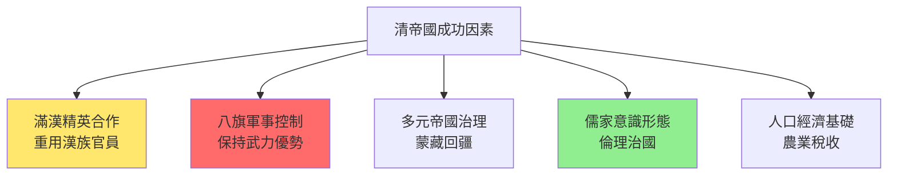
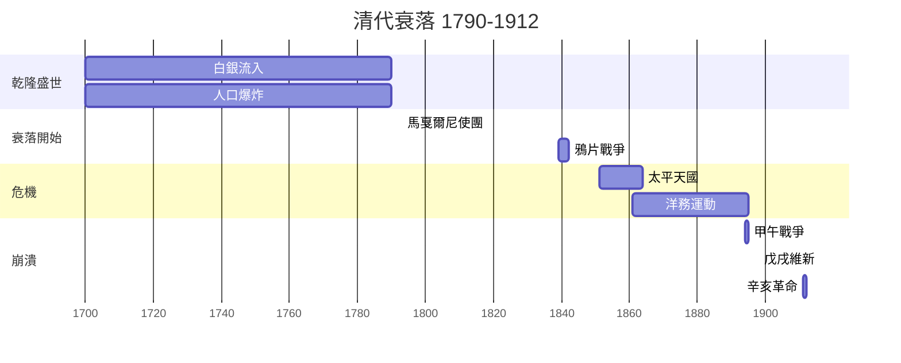
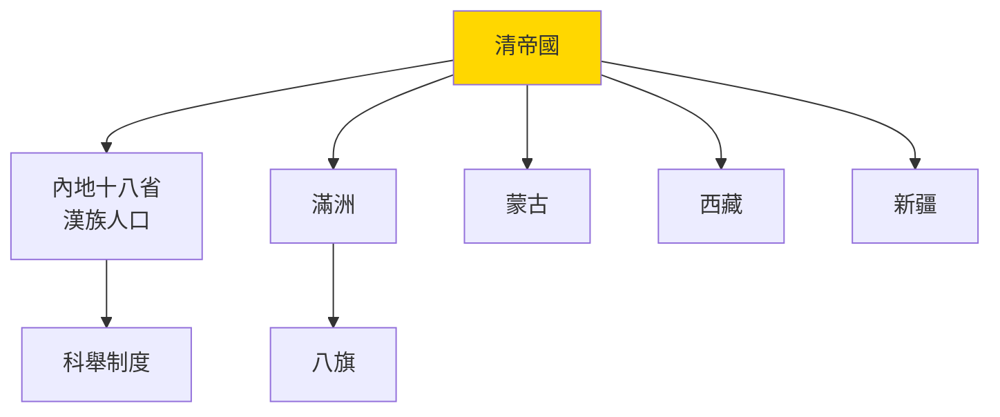

# HIST2127 清代中國與世界 / Qing China in the World, 1644-1912

**Instructor**: William R. Kelson / Hoofung Kim (varies by year)
**Department**: History, HKU
**Official source**: [HKU History Course Description 2024-25](https://history.hku.hk/wp-content/uploads/2024/07/HIST-2425.pdf)
**Style**: 袁騰飛式 — 犀利分析：清代係世界最大經濟體，但係點解最終被歐洲小國打敗？

---

## 問題 1：5 個核心心智模型

### 心智模型 1：「少數民族統治多數」——滿洲人點解可以統治中國268年？
學者 **Mark Elliott**（哈佛，*The Manchu Way*, 2001）指出：清廷成功關鍵在於「以漢治漢」策略——重用漢族精英同時保持八旗軍事控制。學者 **Peter Perdue**（MIT，*China Marches West*, 2005）分析清帝國係一個「內亞帝國」（Inner Asian Empire）。

- **1644** 清軍入關，建立中國歷史上最大領土帝國（1310萬平方公里）
- **1683** 統一台灣，統一中國
- **1759** 征服新疆——清帝國領土達到頂峰

### 心智模型 2：「白銀流入」——清代點解全球經濟一體化？
學者 **Dennis Flynn & Arturo Giráldez**（*Global Connection*, 1995）指出：16-18 世紀全球白銀產量 85% 最终流入中國——呢個數字揭示清代經濟喺全球貿易中嘅核心地位。

- **1550-1800** 白銀—絲綢—茶葉三角貿易
- **1700** 中國GDP佔全球30%+（Angus Maddison 數據）
- **1790** 乾隆年間人口達到 3.01 億——人類歷史上前所未有

### 心智模型 3：「朝貢體系」——東亞國際秩序點解最終崩潰？
學者 **John K. Fairbank** 首創「朝貢體系」概念；學者 **David Shambaugh** 分析：朝貢體系唔單純係中國霸權，而係一套多方協商嘅外交禮儀體系。

- **1793** 馬戛爾尼使團訪華——乾隆以為英國係另一個朝貢國，要求單膝跪地
- **1840** 鴉片戰爭——朝貢體系被武力打破
- **1860s** 洋務運動——中國嘗試師夷之長技

### 心智模型 4：「大分流」——清代經濟實力點解開始落後？
學者 **Kenneth Pomeranz**（*Great Divergence*, 2000）分析：1750 年前長江三角洲同英國生活水平相似；真正分叉在於能源同美洲——英國有煤炭同美洲奴隸種植園，令佢哋可以工業化。

### 心智模型 5：「世紀恥辱」——清代最後百年點解如此屈辱？
學者 **Frank Dikötter**（*The Age of Recognition*, 2002）分析：清代衰落唔單純係西方衝擊，而係內部腐敗+人口過剩+環境退化+制度僵化共同造成。

---

## 問題 2：3 個根本分歧

### 分歧 1：清代係「最後一個漢族帝國」定係「外來殖民政權」？
- **A 方（清帝國論）**：清帝國係一個成功嘅多元帝國，將蒙古、西藏、新疆納入中國版圖
- **B 方（漢族民族主義視角）**：清帝國係滿洲人殖民統治，辛亥革命係「驅逐韃虜」

### 分歧 2：清代衰落——內因定係外因？
- **A 方（內因論）**：人口過剩、土地承載力達到上限、科舉制度扼殺創新
- **B 方（外因論）**：帝國主義軍事侵略 + 不平等條約體系 + 經濟掠奪

### 分歧 3：朝貢體系——係和平國際秩序定係中國霸權工具？
- **A 方（正面評價）**：朝貢體系減少戰爭、維持穩定
- **B 方（批判）**：朝貢體系建立喺權力不平等基礎上

---

## 問題 3：10 個深度問題

1. 乾隆年間（1735-1796）係清代高峰期——但係英國使團馬戛爾尼（1793）訪華時已經見到衰落迹象。乾隆點解錯過最後改革機會？
2. 鴉片戰爭（1839-1842）——中國明明有 4 億人口，英國只有 2,000 萬，點解中國輸得咁快？
3. 太平天國（1851-1864）——死亡 2,000-7,000 萬人，係人類歷史上最大內戰。呢個運動揭示咗清代社會乜嘢根本矛盾？
4. 洋務運動（1861-1895）——曾國藩、李鴻章點解可以學西方技術但係無法改變制度？呢個揭示咗「器物現代化 vs 制度現代化」乜嘢問題？
5. 甲午戰爭（1894-95）——日本 GDP 只係中國 1/5，但係打敗咗北洋水師。呢個揭示咗乜嘢關於現代化本質？
6. 戊戌維新（1898）——康有為、梁啟超主張君主立憲，但係慈禧太后點解要鎮壓？呢個决定對中國歷史影響有幾深遠？
7. 辛亥革命（1911）——武昌起義 10 月 10 日成功，但係革命者完全冇預料到結果。呢個揭示咗乜嘢關於歷史行動同歷史後果之間嘅鴻溝？
8. 清代人口從 1.5 億增至 4 億——呢個人口爆炸點解最終導致社會崩潰？人口係資產定係負擔？
9. 如果你是李鴻章（1896）——你代表中國簽署《馬關條約》，放棄台灣。你會點向皇帝解釋？你係賣國贼定係歷史悲劇人物？
10. 從歷史角度——點解「中華民族偉大復興」呢個口號對清代歷史評價如此重要？呢個口號背後隱藏咗乜嘢歷史理解？

---

# 核心心智模型深化

## 1. 清帝國統治模式 / Qing Imperial Governance

### 1.1 Bilingual 概念對照
- 滿漢一家 (mǎn hàn yījiā) = Manchu-Han Unity — 清帝國意識形態
- 八旗制度 (bā qí zhìdù) = Eight Banners — 滿洲軍事-社會制度
- 朝貢體系 (cháogòng tǐxì) = Tributary System — 東亞外交秩序

### 1.3 袁騰飛式犀利觀察
> 「乾隆皇帝話自己係『十全武功』——但係你知唔知，佢死後 44 年，英國軍隊就攻入北京？十全武功，最終變成十次失敗！」

### 1.4 Deep Test Question
**考試題**：分析清帝國點解可以統治中國 268 年。呢個「少數民族統治多數」模式同蒙古（元朝）有乜嘢差異？點解清帝國可以成功而元朝最終失敗？

### 1.5 圖解

---

## 深度自測問題

**Q1**：乾隆錯過改革機會——因為盛世令精英階層失去改革動力；朝貢體系令中國官員唔了解西方實力；乾隆本人被成功沖昏頭腦。

**Q2**：鴉片戰爭失敗原因——①英國海軍技術優勢；②清軍腐敗無能；③鴉片導致白銀外流，國力削弱。

**Q3-Q10** 精簡版：
- Q3：太平天國揭示——人口過剩 + 土地兼併 + 科舉失敗 + 西方宗教影響，四者合流引爆農民起義。
- Q4：洋務運動失敗——因為佢哋只學技術不改制度；日本明治維新成功就係因為佢哋改革制度。
- Q5：甲午戰爭揭示——現代化唔係金錢問題，而係制度、組織動員能力問題；日本有明治維新制度創新。
- Q6：慈禧鎮壓維新——因為維新威脅到她嘅權力；呢個决定令中國繼續沉淪，最終導致義和團、八國聯軍等更大災難。
- Q7：辛亥革命揭示——革命者嘅意圖同歷史後果往往唔符；佢哋想建立共和國，但係最終係軍閥割據。
- Q8：人口爆炸問題——清代人口增長快過農業技術進步，人均糧食產量持續下降；呢個造成社會不穩定基礎。
- Q9：李鴻章困境——呢個係歷史道德問題；佢係歴史悲劇人物，而非單純「賣國贼」。
- Q10：「中華民族偉大復興」——呢個口號暗示清代係中國歷史一部分，而係一個值得驕傲嘅時代；但係批評者指出清代係少數民族殖民統治。

---

## 5 個 Mermaid 圖解

### 圖解 1：清代衰落時間線

### 圖解 2：清代帝國治理結構

---

## 總結

**HIST2127 Qing China in the World** 嘅核心價值：
1. **全球史視角**：清代唔係孤立帝國，而係全球經濟、帝國主義、朝貢體系嘅核心節點
2. **批判性分析**：朝貢體系唔係和平秩序，而係權力不平等嘅表現
3. **當代相關性**：清代領土遺產（新疆、西藏、內蒙古）至今仍係中國外交核心問題

**袁騰飛金句**：
> 「清代歷史就係一場大戲——盛世到來、衰落開始、然後恥辱；但係你知唔知，清朝皇帝係所有大一統王朝入面最勤力嘅？每日凌晨四點開工！但係勤力救唔到腐敗制度！」

---

## 延伸閱讀

1. Spence, Jonathan. *The Search for Modern China*. New York: Norton, 1990.
2. Perdue, Peter C. *China Marches West: The Qing Conquest of Central Eurasia*. Cambridge: Harvard University Press, 2005.
3. Elliott, Mark C. *The Manchu Way: The Eight Banners and Ethnic Identity in Late Imperial China*. Stanford: Stanford University Press, 2001.
4. Pomeranz, Kenneth. *The Great Divergence: China, Europe, and the Making of the Modern World Economy*. Princeton: Princeton University Press, 2000.
5. Fairbank, John K., ed. *The Chinese World Order*. Cambridge: Harvard University Press, 1968.
6. Dikötter, Frank. *The Age of Recognition: Eight Hundred Years of Chinese Drama*. London: Chatto & Windus, 2002.
7. Ho, Ping-ti. *Studies in the Population of China*. Cambridge: Harvard University Press, 1959.
8. Kuhn, Philip. *Soulstealers: The Chinese Witch Hunt*. Cambridge: Harvard University Press, 1990.
