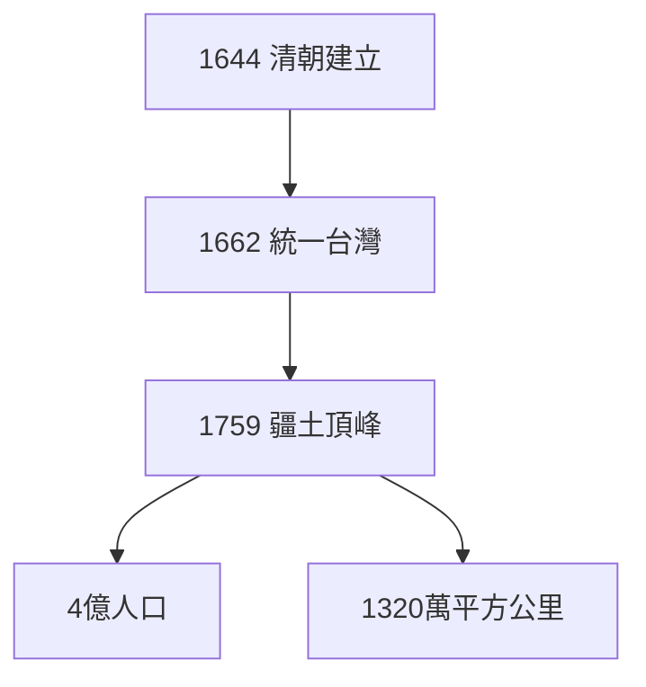
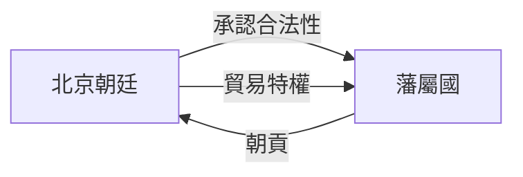
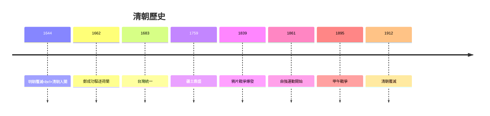
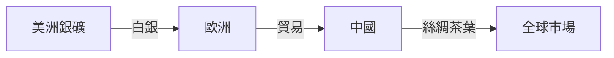
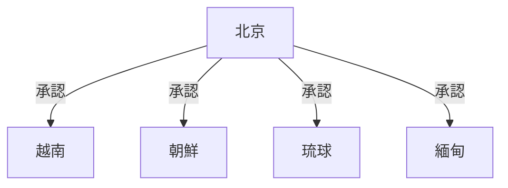
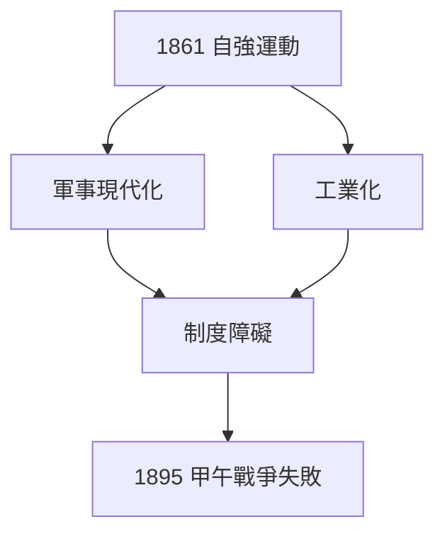

# HIST2127 清帝國與世界 / Qing China in the World, 1644-1912 (6 credits)

**Instructor**: William Kelson
**Department**: History, HKU  
**Official source**: [HKU History Course Description 2024-25](https://history.hku.hk/wp-content/uploads/2024/07/HIST-2425.pdf)
**Style**: 袁騰飛式 — 犀利、聚焦清朝點解從世界帝國變成被殖民對象

---

## 問題 1：這個領域所有專家共享的 5 個核心心智模型

### 心智模型 1：朝貢體系作為清朝外交基石
學者 **John Fairbank** (哈佛, *East Asian Tradition*, 1968) 研究：朝貢體系係清朝外交核心——中國唔係主動擴張，而係通過承認藩屬國合法性換取邊疆穩定。

學者 **Peter Perdue** (*China Marches West*, 2005) 分析：清朝版圖擴張依靠軍事征戰同王朝聯姻，而非經濟殖民。

- 1644 清朝入關
- 1683 統一台灣
- 1759 疆土達到頂峰

### 心智模型 2：商業化與中國經濟起飛
學者 **Kenneth Pomeranz** (*The Great Divergence*, 2000) 指出：1750 年前，長江三角洲經濟發展程度同英國差唔多——中國從來都唔係落後。

學者 **R. Bin Wong** (*China Transformed*, 1997) 研究：明清商業化程度極高——墟市網絡、金融制度超前歐洲。

- 1500-1800 白銀流入中國
- 18 世紀人口爆炸到 4 億
- 茶葉、絲綢出口佔全球市場

### 心智模型 3：白銀貨幣與全球經濟整合
學者 **Dennis Flynn & Arturo Giráldez** 研究：全球白銀產量 1/3 流入中國——呢個揭示中國係 16-18 世紀全球經濟核心。

學者 **Wang Gungwu** (澳洲國立大學) 指出：中國商人網絡 ( diaspora ) 遍及東南亞——呢個就係「中國全球化」最早版本。

### 心智模型 4：鴉片戰爭與「中等收入陷阱」
學者 **John King Fairbank** 分析：鴉片戰爭 (1839-1842) 唔單止係軍事失敗，而係中國被迫納入西方主宰嘅世界體系。

學者 **Giovanni Arrighi** 研究：中國 19 世紀「衰落」唔係內部問題，而係被整合入歐洲主導世界體系嘅結果。

### 心智模型 5：自強運動失敗與制度瓶頸
學者 **Thomas Kennedy** 研究：自強運動 (1861-1895) 展示中國有能力引進技術，但制度障礙——科舉制度、官員腐敗——阻礙更深層現代化。

學者 **Frank Perkin** 指出：洋務運動失敗揭示：技術現代化唔可能脫離制度改革。

---

## 問題 2：3 個根本分歧

### 分歧 1：清朝係「專制主義」定「開明專制」？
- **A 方**：開明專制
  - **William Roetzel** 研究：康乾盛世展示高效行政
- **B 方**：專制主義
  - **Samuel Cramer** 指出：文字獄、腐敗導致停滞

### 分歧 2：鴉片戰爭——英國罪惡定中國自閉？
- **A 方**：英帝國主義侵略
  - 武力強迫開放貿易
- **B 方**：中國貿易政策問題
  - 閉關鎖國導致落後

### 分歧 3：維新運動——歷史必然失敗定外部鎮壓？
- **A 方**：內部矛盾
  - 慈禧太后保守派反對
- **B 方**：歷史條件未成熟
  - 維新需要更多時間

---

## 問題 3：10 個深度問題

1. 如果清朝冇面對西方挑戰，會自己發展出現代性嗎？
2. 點解白銀流入中國但中國經濟最終落後西方？
3. 鴉片貿易點解被稱為「毒品戰爭」先於軍事戰爭？
4. 如果你是林則徐，點樣處理鴉片問題？
5. 點解香港島 1842 年被當時大部分中國人忽視？
6. 維新運動失敗揭示乜嘢制度問題？
7. 點解義和團運動係「排外」而非單純「愛國」？
8. 如果八國聯軍冇打敗清朝，會發生乜嘢？
9. 點解中國共產黨用「百年屈辱」塑造民族主義？
10. 如果你是 1900 年普通中國農民，你點睇國家命運？

---

## 核心心智模型深化

### 1. 清朝鼎盛期版圖



### 2. 朝貢體系運作



---

## 深度自測問題

### 詳解 1: 如果清朝冇面對西方挑戰...
歷史學家認真分析：即使冇西方衝擊，清朝都有自己問題——人口壓力、土地兼併、白銀短缺。現代化壓力遲早會出現。

---

## 5 個 Mermaid 圖解

### 📊 Diagram 1: 清朝歷史時間線



### 📊 Diagram 2: 白銀流動與中國經濟



### 📊 Diagram 3: 朝貢體系



### 📊 Diagram 4: 鴉片戰爭後不平等條約

```mermaid
flowchart TD
    A[1842 南京條約] --> B[香港島割讓]
    A --> C[五口通商]
    A --> D[2200萬兩白銀】
```

### 📊 Diagram 5: 自強運動失敗



---

## 總結

1. 清朝係世界帝國而非封閉專制
2. 白銀流動揭示中國經濟全球角色
3. 鴉片戰爭係歷史轉折點
4. 自強運動揭示制度改革必要性
5. 清朝衰落係內外因素交織

**最後問題**: 如果你去 1800 年做乾隆皇帝，你會點樣應對西方挑戰？

---
**版權所有 © HKU History Self-Study**
