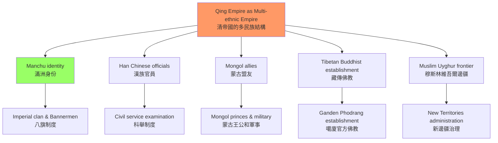
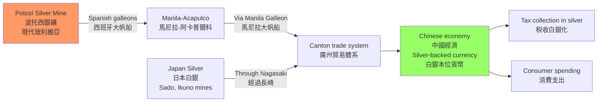
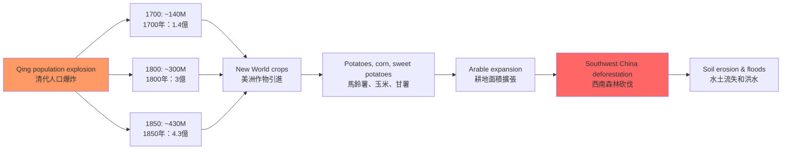
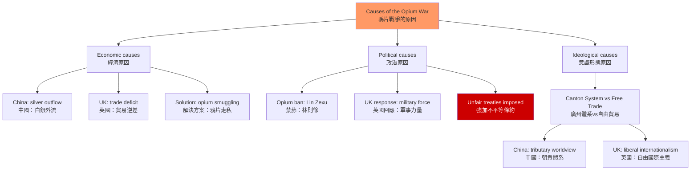
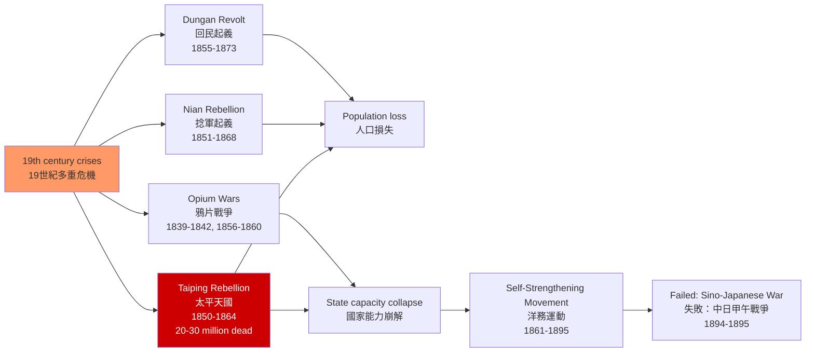

# HIST2127 清代中國與世界 / Qing China in the World: 1644-1912

**Instructor**: HKU History Staff
**Department**: History, HKU
**Official source**: [HKU History Course Description](https://history.hku.hk/ug_cd/)
**Style**: 袁騰飛式 — 犀利、聚焦清代中國的世界性——從康乾盛世到鴉片戰爭，清帝國如何應對全球化的第一波衝擊

---

## 問題 1：5 個核心心智模型

### 1. 滿洲帝國 vs 中國王朝——清帝國的雙重認同
學者 **Peter Perdue** 和 **David Wright** 研究：清朝統治者從來不僅僅是「中國的皇帝」，更是「滿洲、蒙古、 Tibet 和維吾爾的大汗」——清帝國是一個多民族帝國（manzhou empire），而非單純的「中國王朝」。

- **典型學者**: **Peter Perdue** — *China Marches West* (2005); **David Wright** — research on Qing empire
- **驗證案例**: 1793 年馬戛爾尼使華時，乾隆皇帝在熱河接見他時的身份是「大清皇帝」，而非單純的「中國皇帝」——這反映了清帝國作為多民族帝國的自我認知

### 2. 白銀流入與貨幣革命——全球化對中國的影響
1500-1800 年間，美洲和日本的白銀約 50% 流入中國。學者 **William Atwell** 和 **Dennis Flynn** 研究：這種大規模的白銀流入，塑造了明代和清代的貨幣經濟，並間接資助了清代前期的經濟繁榮。

- **典型學者**: **Dennis Flynn & Arturo Giráldez** — research on silver flow; **William Atwell** — *International Bullion Flows and the Chinese Economy* (2002)
- **驗證案例**: 1808-1856 年間，全球約 50,000-60,000 噸白銀流入中國——這些白銀主要來自拉丁美洲（波托西銀礦）和日本（佐渡金山）

### 3. 人口爆炸與生態危機
1760-1850 年間，清代人口從約 1.4 億增至約 4.3 億——這種人口爆炸對土地、生態和社會穩定帶來了巨大壓力。學者 **Lee Bad** 和 **Wang Yeh-chien** 研究：馬鈴薯、玉米和甘薯從美洲傳入中國，為人口增長提供了食物基礎。

- **驗證案例**: 1760 年代玉米和馬鈴薯在中國西南山區的推廣，為人口從山區向邊疆遷移提供了基礎——但也導致了雲南山區的森林砍伐和水土流失

### 4. 鴉片戰爭——開放國門的暴力
1839-1842 年鴉片戰爭是中國近代史的開端。學者 **Mao Haijian** 和 **John K. Fairbank** 研究：這場戰爭不是「西方侵略」和「中國落後」的簡單故事，而是兩個帝國在貿易、稅收和主權問題上的正面碰撞。

- **典型學者**: **Mao Haijian** — *The Qing Empire and the Opium War* (2016); **John K. Fairbank** — *The United States and China* (1948)
- **驗證案例**: 1842 年《南京條約》：中國賠償白銀 2,100 萬圓（等於當時清政府約兩年的總税收），割讓香港島，開放五口通商（廣州、廈門、福州、寧波、上海）

### 5. 帝國崩潰——起義與革命
19 世紀，清帝國面臨多重危機：太平天國運動（1850-1864）、捻軍起義（1851-1868）、回民起義（1855-1873）。學者 **Philip Kuhn** 研究：這些起義揭示了帝國治理能力的極限，以及漢族士紳權力的增長。

---

## 問題 2：3 個根本分歧

### 分歧 1：清代繁榮——真的「盛世」嗎？
清代的 GDP 在 1800 年約佔全球的約 33%（高於西歐）。但這種繁榮是對誰的繁榮？學者 **Mark Elvin** 的「高水平均衡陷阱」（high-level equilibrium trap）理論認為清代經濟的繁榮掩蓋了技術創新的停滯。

### 分歧 2：鴉片戰爭——貿易戰 vs 文明衝突？
鴉片戰爭是單純的貿易戰爭（中國白銀外流引發的軍事對抗），還是更深層次的文明衝突（西方工業文明 vs 中國農業文明）？

### 分歧 3：清帝國的滅亡——外患 vs 內憂？
清帝國的滅亡（1912）是因為外國帝國主義的侵略，還是因為內部的制度腐敗和漢族民族主義的興起？

---

## 問題 3：10 個深度問題

1. **滿洲認同 vs 中國認同**：清代統治者的滿洲身份對其帝國治理策略有什麼影響？滿洲精英如何在「皇帝」和「大汗」的身份之間切换？
2. **白銀流入的經濟後果**：白銀流入對清代貨幣制度、税收系統和物價水平有什麼具體影響？這種影響與明代白銀化（一条鞭法）的關係是什麼？
3. **人口爆炸與農業革命**：清代人口從 1.4 億增至 4.3 億——這種增長的生態代價是什麼？森林砍伐、土壤耗竭和水資源危機對清代社會穩定有什麼影響？
4. **馬戛爾尼使華失敗的根本原因**：1793 年馬戛爾尼使華要求開放通商、設立外交使館、割讓海島——乾隆全部拒絕。這次外交失敗的真正原因是文化傲慢、經濟考量，還是帝國安全的理性計算？
5. **鴉片貿易的經濟學**：為什麼鴉片貿易在 1800 年代成為英中貿易的核心？東印度公司如何從鴉片貿易中獲利？林則徐的禁菸運動為什麼威脅到了英國的經濟利益？
6. **太平天國運動**：洪秀全的「拜上帝會」與基督教有什麼關係？這場運動為什麼最終失敗了（1864 年）？太平天國運動與同一時期的歐洲革命運動（1848 年）有什麼可比之處？
7. **同治中興（1862-1874）**：曾國藩、左宗棠、李鴻章等漢族官員的洋務運動，如何試圖在不改變政治制度的前提下引進西方技術？這種「中學為體，西學為用」策略的局限性是什麼？
8. **百日維新（1898）**：光緒皇帝和康有為、梁啟超的百日維新，為什麼只持續了 103 天就被慈錀太后鎮壓？這次失敗對中國近代政治改革的前景有什麼深遠影響？
9. **義和團運動（1899-1901）**：義和團為什麼要「扶清滅洋」？他們的暴力行為（包括殺死外國傳教士和中國基督教徒）與清政府的政策有什麼關係？1900 年八國聯軍侵華（兵力約 20,000 人）如何暴露了清政府的無能？
10. **1911 年辛亥革命**：為什麼革命的導火線是四川的「保路運動」？武昌起義（1911 年 10 月 10 日）的偶然性——如果那天晚上沒有偶然的炸彈爆炸，革命的爆發時間可能完全不同——這是否意味着辛亥革命是「歷史的必然」？

---

# 核心心智模型深化（中英對照）

## 1. 滿洲帝國 vs 中國王朝

### 1.1 圖解：清帝國的多民族結構

---

## 2. 白銀流入與全球化

### 2.1 圖解：全球白銀流向中國

---

## 3. 人口爆炸與生態危機

### 3.1 圖解：清代人口爆炸與農業變遷

---

## 4. 鴉片戰爭

### 4.1 圖解：鴉片戰爭的原因結構

---

## 5. 帝國崩潰

### 5.1 圖解：19世紀清帝國的多重危機

---

# 總結

1. **清帝國是一個多民族帝國，不是單純的中國王朝**：它的政治邏輯、軍事結構和外交策略，都同時服務於滿洲統治者對不同族群的統治需要。

2. **白銀流入塑造了清代繁榮，也埋下了危機的種子**：當 19 世紀白銀流入减少時，清政府的财政基礎随之动摇。

3. **鴉片戰爭不是「落後就要挨打」的道德寓言**：它是兩個帝國在貿易利益、稅收主權和國際法觀念上的正面碰撞，背後沒有簡單的「對」與「錯」。

4. **清帝國的崩潰是內外因素共同作用的結果**：外國帝國主義的軍事壓力、太平天國等內部起義的衝擊，以及科舉制度培養的漢族士紳對現有政治體制的持續不满，共同导致了1912年的滅亡。

5. **清代中國的「世界性」被嚴重低估**：清帝國從來不是一個封闭的「中华帝国」——它與俄羅斯帝國、中亞汗國、南洋華商網絡、拉丁美洲白銀經濟有著密切的跨國聯繫。

**自學建議**: 配合 Peter Perdue 的 *China Marches West* + Mao Haijian 的 *The Qing Empire and the Opium War*，輸出讀書筆記到 `06_Reading_Notes/`。
