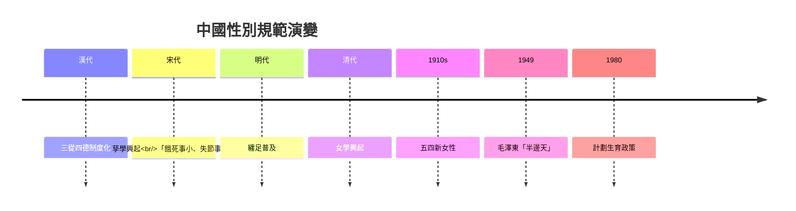
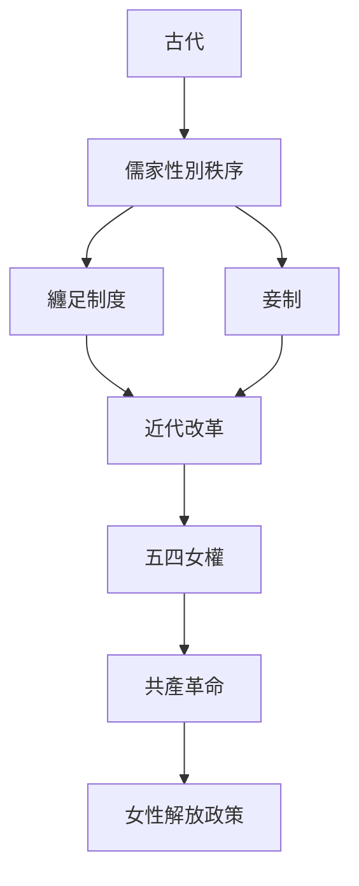
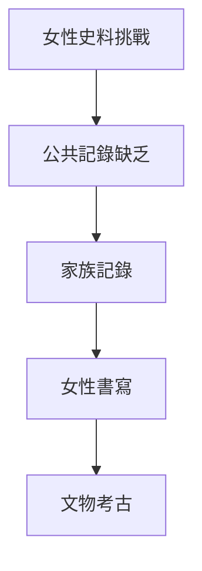
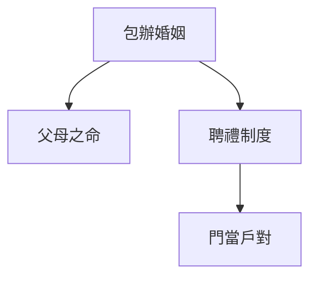
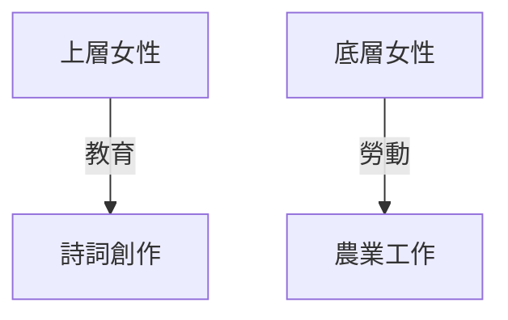
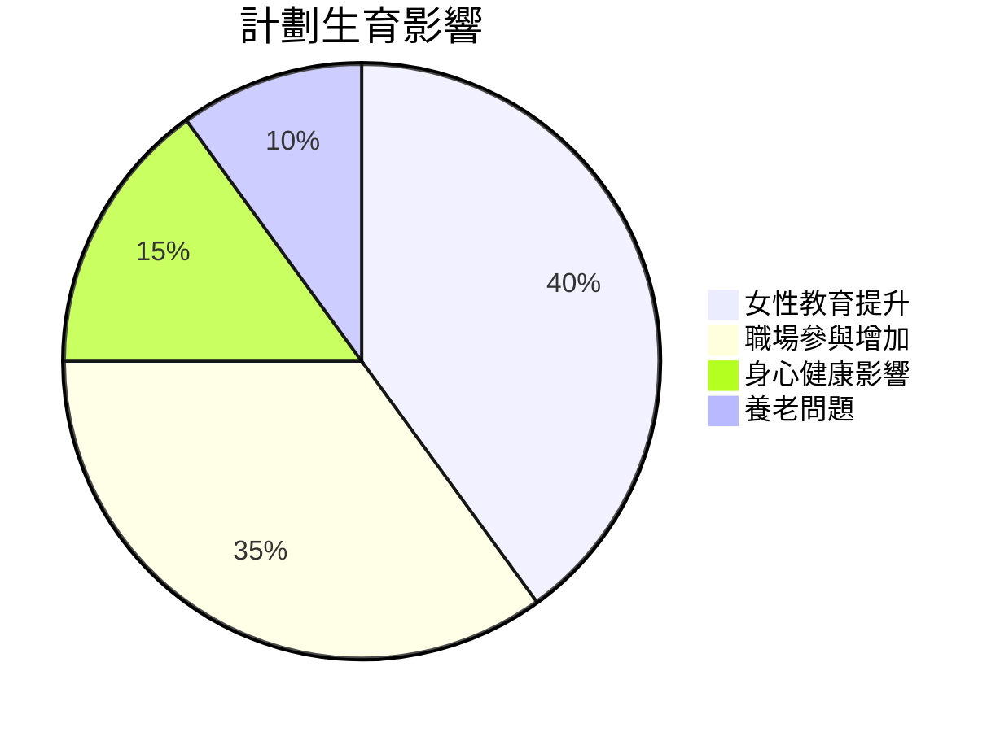
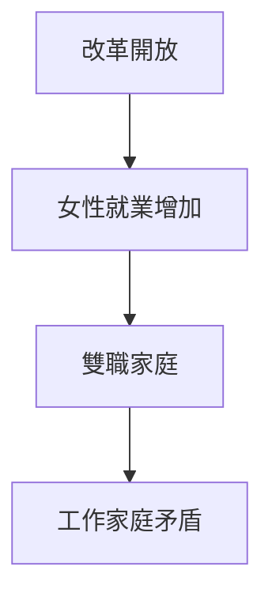

# HIST2143 愛與忠誠 / Love and Loyalty: Women and Gender in Chinese History (6 credits)

**Instructor**: Li Ji
**Department**: History, HKU  
**Official source**: [HKU History Course Description 2024-25](https://history.hku.hk/wp-content/uploads/2024/07/HIST-2425.pdf)
**Style**: 袁騰飛式 — 犀利、聚焦中國女性點解被建構

---

## 問題 1：這個領域所有專家共享的 5 個核心心智模型

### 心智模型 1：儒家性別秩序建構
學者 **Patricia Ebrey** (*The Inner Quarters*, 1993) 研究：儒家「三從四德」唔係中國歷史自有，而係漢代 (206 BC-220 AD) 先至制度化。

學者 **Mick Dunne** 分析：儒家性別理論係政治權力工具——為父權制提供意識形態基礎。

- 三從：在家從父、出嫁從夫、夫死從子
- 四德：婦德、婦言、婦容、婦功
- 宋代理學：「餓死事小、失節事大」

### 心智模型 2：女性作爲歷史行動者
學者 **Dorothy Ko** (*Teachers of the Inner Chambers*, 1994) 指出：女性從來都唔係歷史被動受害者——清代女性作家、藝術家活躍。

學者 **Mann & Cheng** (*Under Confucian Eyes*, 2001) 收集女性史料——展示女性歷史主體性。

### 心智模型 3：帝國主義與中國性別政治
學者 **Helen Siu** 研究：殖民現代性如何改造中國性別關係——女權運動、西方一夫一妻制引進。

學者 **Gail Heta** 分析：五四運動 (1919) 塑造「新女性」話語——西方模式被視為現代化標誌。

### 心智模型 4：婚姻作爲政治經濟契約
學者 **William Goode** 研究：婚姻從來都唔係純粹愛情，而係家族、階級、經濟聯盟。

學者 **Rubie Watson** 研究：童養媳、妾制度——中國婚姻制度靈活性揭示性別壓迫階級差異。

### 心智模型 5：身體政治與計劃生育
學者 **Susan Greenhalgh** 研究：毛澤東時代計劃生育政策——人口控制與女性身體國家化。

學者 **Tyne Kevern** 分析：改革開放後女性就業與家庭責任矛盾加劇。

---

## 問題 2：3 個根本分歧

### 分歧 1：儒家對女性壓迫——文化本質定歷史建構？
- **A 方**：歷史建構派
  - Dorothy Ko, James Watson
  - 儒家性別規範係特定歷史條件產物
- **B 方**：文化本質派
  - David Nee
  - 儒家倫理反映中國文化價值觀

### 分離 2：五四女權——進步定西化？
- **A 方**：進步運動
  - 女性教育、就業機會增加
- **B 方**：西方化話語
  - 西方女性模式被塑造為現代化標準

### 分歧 3：計劃生育政策——女性解放定壓迫？
- **A 方**：女性解放
  - 強制避孕節育，女性獲得身體控制權
- **B 方**：身體壓迫
  - 強制墮胎、計劃生育性別選擇

---

## 問題 3：10 個深度問題

1. 如果你去 1800 年做中國女性，你會點樣反抗性別壓迫？
2. 點解纏足持續 1000 年？——女性身體作爲政治符號
3. 童養媳制度——點解農民接受女嬰送養？
4. 如果儒家係壓迫女性嘅意識形態，點解女性都係支持儒家？
5. 點解毛澤東話「女人能頂半邊天」但同時維持計劃生育？
6. 如果你是歷史學家，點樣研究被壓迫群體歷史？
7. 現代中國女性地位——提高定倒退？
8. 點解「女德」話語今日中國重新興起？
9. 如果你去清代做田野考察，點樣接觸女性歷史？
10. 中國女性主義——西方影響定本土傳統？

---

## 核心心智模型深化

### 1. 儒家性別規範演變

### 2. 中國女性歷史年表

---

## 深度自測問題

### 詳解 2: 纏足點解持續 1000 年？
學者研究顯示：纏足係多重因素造成——男性對女性身體控制、階級標誌、儒家美學標準。呢個揭示性別壓迫制度化過程。

---

## 5 個 Mermaid 圖解

### 📊 Diagram 1: 中國女性歷史證據來源

### 📊 Diagram 2: 婚姻制度演變

### 📊 Diagram 3: 性別與階級

### 📊 Diagram 4: 計劃生育影響

### 📊 Diagram 5: 現代中國女性

---

## 總結

1. 儒家性別規範係歷史建構，非文化本質
2. 女性從來都係歷史行動者非被動受害者
3. 性別壓迫與階級、帝國主義交織
4. 身體政治係中國女性史核心主題
5. 現代中國女性地位提升但仍面對挑戰

**最後問題**: 如果你去 1900 年做中國女性，你最關心乜嘢？

---
**版權所有 © HKU History Self-Study**
