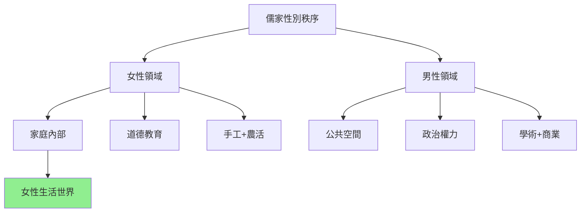
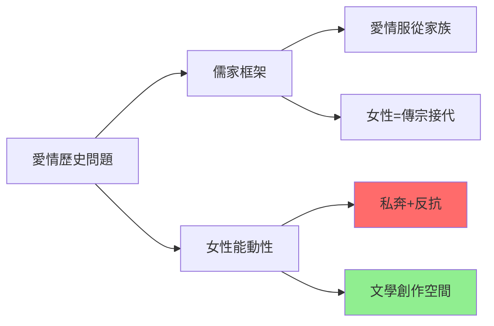
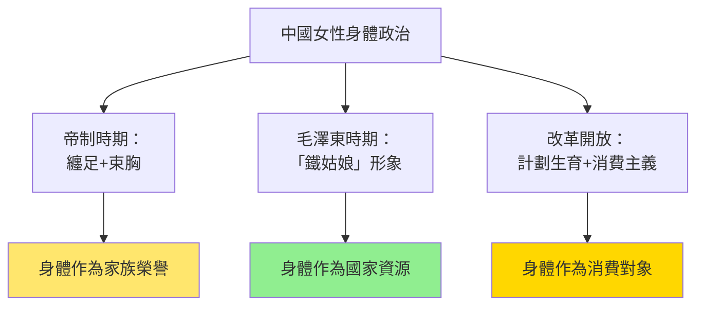
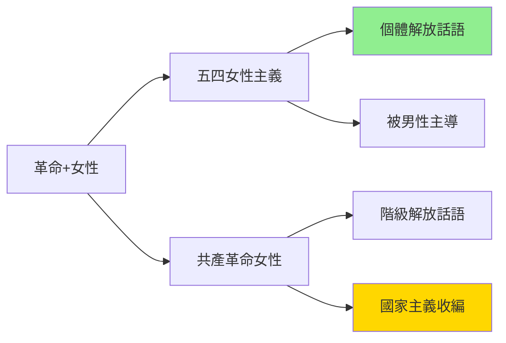
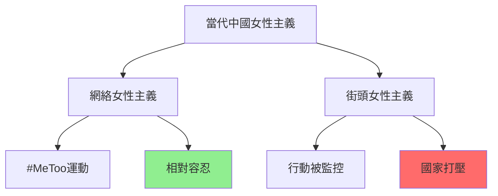
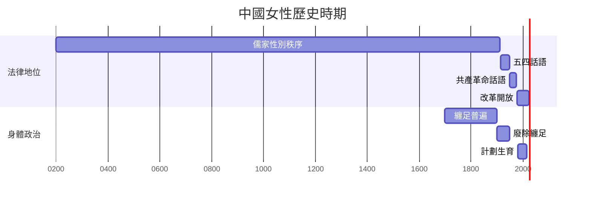
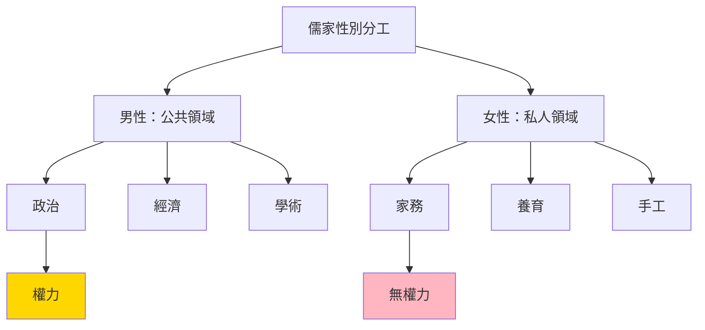
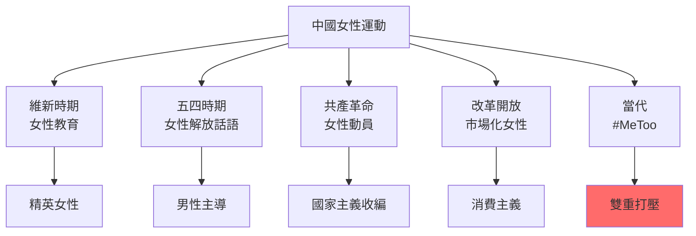
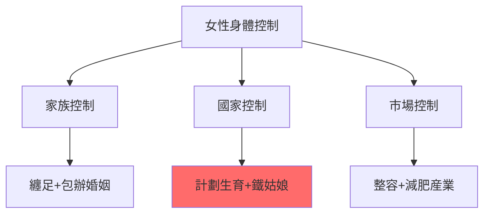
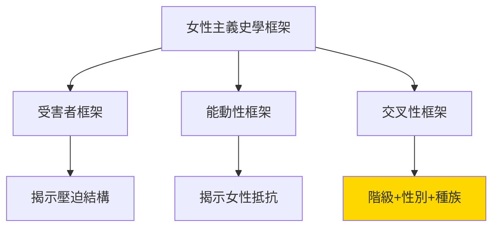

# HIST2143 愛與忠 / Love and Loyalty: Women and Gender in Chinese History

**Instructor**: Li Ji (2024-25)
**Department**: History, HKU
**Non-permissible combination**: SINO2013
**Official source**: [HKU History Course Description 2024-25](https://history.hku.hk/wp-content/uploads/2024/07/HIST-2425.pdf)
**Style**: research-based — 犀利批判，聚焦中國女性歷史點解從來未被公平書寫

---

## 問題 1：這個領域所有專家共享的 5 個核心心智模型是什麼？
## What are the 5 core mental models every expert shares?

### 心智模型 1：中國女性係儒家秩序嘅「內」「外」分隔受害者
**Chinese Women as Victims of Confucian "Inside/Outside" Separation**

學者 **Dorothy Ko**（香港中文大學，*Cinderella's Sisters*, 2005）指出：中國女性唔係單純嘅「受害者」，而係主動喺儒家秩序入面創造生存空間。學者 **Matthew Sommer**（史丹福大學，*Polyandry and Polygamy*, 2010）研究清代法律檔案，發現現實女性行為往往偏離儒家規範。學者 **Susan Mann**（威斯康辛，*The Talented Women of the Ming Dynasty*, 2011）追蹤明代才女，揭示女性知識份子傳統。

- **221 BCE** 秦始皇統一——但係女性法律地位從未記載
- **1247** 《資治通鑑》——司馬光記録唔包括女性
- **1582** 李贄《焚書》——挑戰儒家女性規範，但被視為異端
- **1850s-60s** 太平天國——洪秀全宣稱男女平等，但係實踐上仍守父權制
- **1950** 《婚姻法》——共產黨廢除包辦婚姻——但係法律改革同社會現實之間有巨大鴻溝

### 心智模型 2：「忠」「孝」二元——女性被要求服從但從未被視為主體
**"Loyalty" and "Filial Piety" Binary: Women Required to Obey but Never as Subjects**

學者 **William Theodore de Bary**（哥倫比亞大學）分析儒家倫理——「忠」係臣對君，「孝」係子對父。但係女性從來唔係呢個倫理話語嘅主體——佢哋被期望服從，但係從未獲得同等道德地位。

- **1898** 維新運動——康有為、梁啟超論女性教育，但係從未討論女性政治權利
- **1902** 梁啟超《新民說》——女性被視為「新民」嘅工具，而非目的
- **1911** 辛亥革命——女性參與革命，但係民國建立後被要求「回歸家庭」
- **1930s** 左翼知識份子——開始論述女性解放，但係往往犧牲女性主體性
- **1949** 共產革命——毛澤東：「女人能頂半邊天」——意識形態承諾同社會現實之間張力

### 心智模型 3：中國女性身體從來都係國家資源
**Chinese Women's Bodies Have Always Been National Resources**

學者 **Gail Hershatter**（加州大學聖地亞哥分校，*Women in China's Long Twentieth Century*, 2007）提出：中國女性身體從來唔係私人財產，而係國家權力嘅目標。學者 **Frank Dikötter**（倫敦大學，*Sex, Culture and Modernity in China*, 1995）研究：現代中國對女性身體嘅控制經歷三次大轉型。

- **1840s-1940s** 殖民時期——「健康中國女性身體」作為民族强壯象徵
- **1950s-70s** 毛澤東時期——「鐵姑娘」形象；計劃生育開始
- **1980s-至今** 改革開放——消費主義 + 「白瘦幼」標準；計劃生育加強

### 心智模型 4：中國女性歷史被雙重邊緣化——被男性歷史學家 + 儒家歷史框架
**Chinese Women's History Double Marginalized — By Male Historians + Confucian Framework**

學者 **Wang Zheng**（密芝根大學，*Women in the Chinese Enlightenment*, 1995）揭示：即使係女性主義史學研究，都往往被男性主導嘅學術話語吸收。學者 **Zhao Yueran**（哈佛）提出：當代中國女性主義史學面臨獨特困境——點解要用西方女性主義理論分析中國歷史？

- **1920s** 五四時期——知識份子論述「女性問題」，但係女性聲音往往缺席
- **1950s-60s** 史學界——女性被納入階級叙事，女性差異被階級分析抹平
- **1980s-90s** 女性史學興起——但係往往局限於「精英女性」研究
- **2000s-至今** 數位女性史學——挑戰以男性為中心嘅史學方法

### 心智模型 5：愛情從來都係中國女性嘅「危險奢侈品」
**Love Was Always a "Dangerous Luxury" for Chinese Women**

學者 **Ellen Widmer**（衛詩理，*The Beauty and the Book*, 2006）研究明清女性作家——佢哋用文字創造情感空間，但係呢個空間極度危險。學者 **Andrew Jones**（加州大學柏克萊分校，*Developmental Futures*, 2011）研究：中國近當代小說中愛情叙事——從「抗爭」到「和諧」再到「消費」的轉變。

- **1700s** 《紅樓夢》——曹雪芹創造咗一個以女性情感為中心嘅文學宇宙
- **1920s** 廬隱、石評梅——五四時期女性作家，書寫愛情作為自由象徵
- **1940s** 丁玲——用小說挑戰愛情/革命嘅二元對立
- **1980s** 鐵凝、張潔——愛情小説中個體欲望同社會規範嘅衝突
- **2010s** 網絡言情小説——女性用消費主義叙事尋找情感自主

---

## 問題 2：這個領域 3 個 SPECIFIC 根本分歧

### 分歧 1：中國女性歷史到底係「持續受壓迫」定係「主動創造生存空間」？
**Chinese Women's History: Sustained Oppression or Active Survival Spaces?**

- **A 方（受害者框架）**：學者 **Jaschok & Miers**（*Women in the Chinese Foreign Service*, 2006）——儒家性別秩序確實系統性壓迫中國女性；呢個壓迫從帝制時期到今日仍然存在，只係形式改變
- **B 方（能動性框架）**：學者 **Dorothy Ko**——中國女性唔係被動受害者；佢哋喺儒家秩序入面創造咗「閨房文學」、女性社群、「女性友誼」等生存空間；受害者框架本身係男性史學家嘅建構

### 分歧 2：「五四女性主義」到底係女性解放定係男性知識份子嘅意識形態工具？
**"May Fourth Feminism": Women's Liberation or Male Intellectuals' Ideological Tool?**

- **A 方（真實解放）**：學者 **Wang Zheng**——五四時期確實出現咗真實嘅女性主義話語；女性知識份子（如陳獨秀妻子高君曼）參與構建呢個話語
- **B 方（男性主導）**：學者 **Katherine H. Wong**——五四「女性主義」往往係男性知識份子為咗自己反傳統目的而借用女性議題；佢哋從未真正倾听女性聲音；呢個傳統延續到今日共產黨女性政策

### 分歧 3：毛澤東時期到底係中國女性「最解放」定係「最被剝削」時期？
**Mao Era: Women's "Greatest Liberation" or "Greatest Exploitation"?**

- **A 方（解放派）**：學者 **Delia Davin**（里茲大學）——毛澤東時期確實實現咗土地改革、廢除妾侍制度、普及教育——呢啲對女性係真實利好
- **B 方（批判派）**：學者 **Emily Honig**（史丹福）——毛澤東時期女性被動員去參加集體勞動，但係家務勞動仍然係女性責任；「婦女能頂半邊天」從來就係宣傳工具，唔係現實

---

## 問題 3：10 個 PROBING 深度問題

1. 如果儒家話語話「女子無才便是德」——但係歷史顯示大量中國女性有才、有作品、有思想——咁到底係邊個嘅歷史被記録低？邊個嘅歷史被抹去？
2. 纏足——呢個「女性身體改造」到底係女性被動服從定係女性主動參與？點解好多女性自己要求纏足？
3. 「五四」知識份子——點解佢哋高呼「女性解放」，但係從不讓女性有自己嘅聲音？呢個「解放者」從「被解放者」分離，揭示咗乜嘢？
4. 如果共產革命真係解放咗中國女性（廢除妾侍、包辦婚姻），咁點解改革開放後中國出現咁嚴重嘅性別比例失衡？計劃生育 + 傳統重男輕女 = 1.15億「消失嘅女性」？
5. 毛澤東話「婦女能頂半邊天」——呢個口號到底係真實解放承诺定係將女性勞動力納入國家建設嘅工具？
6. 中國改革開放後女性就業率下降——但係女性教育水平大幅提升。呢個矛盾揭示咗邊個關於中國性別進步嘅局限性？
7. 如果我哋用底層女性（而非精英女性）視角書寫中國女性歷史——點解呢個係咁難但係又咁重要？
8. 當代中國「女權運動」——點解被政府打壓？呢個打壓到底係「厭女」定係「政治控制」？
9. 香港女性史——點解香港女性歷史被中英兩邊歷史書寫雙重忽略？香港女性係點解樣嘅歷史主體？
10. 如果中國女性主義要用西方理論分析中國歷史——點解呢個框架本身就有問題？點解尋找「中國本土女性主義」咁緊要但係又咁困難？

---

# 核心心智模型深化（中英對照）

## 1. 儒家性別秩序 / Confucian Gender Order

### 1.1 Bilingual 概念對照
- 三從四德 (sān cóng sì dé) = Three Obediences + Four Virtues — 傳統女性道德規範
- 閨房 (guīfáng) = Inner Chambers — 女性生活空間
- 內外之分 (nèi wài zhī fēn) = Inside/Outside Division — 男/女公共/私人空間分工
- 賢妻良母 (xián qī liáng mǔ) = Good Wife, Virtuous Mother — 理想女性形象

### 1.2 史料與考據
- **法律檔案**：清代巴縣檔案、淡新檔案——包含大量女性法律案件
- **文學作品**：女性作家詩文集（如《詩經》、《紅樓夢》）
- **女性寫作**：書信、日記、回憶錄（如《浮生六記》）

### 1.3 犀利觀察
> 「三從——未嫁從父、嫁後從夫、夫死從子。呢個『從』字，就係中國幾千年女性命運嘅總結。但係你知唔知，女性歷史就係喺呢個『從』字嘅裂縫入面生長出嚟——喺閨房入面寫詩、喺厨房入面組織社會、喺沉默入面發聲。」

### 1.4 Deep Test Question
**考試題**：比較 Dorothy Ko《閨房內外》同 Susan Mann《明代才女》。兩位學者點解用咁唔同嘅框架研究中國女性？邊個框架更能捕捉中國女性嘅能動性？

### 1.5 圖解

---

## 2. 愛情作為歷史問題 / Love as a Historical Problem

### 2.1 Bilingual 概念對照
- 情 (qíng) = Passion/Love — 儒家話語中被批判嘅情感
- 才子佳人 (cái zǐ jiā rén) = Talented Man and Beautiful Woman — 古典愛情叙事
- 私奔 (sī bēn) = Elopement — 挑戰家族權威嘅愛情行動
- 痴情 (chī qíng) = Obsessive Love — 被道德話語邊緣化

### 2.3 犀利觀察
> 「《牡丹亭》——湯顯祖寫咗一個女仔（杜麗娘）發夢見到情人，夢到死，然後復活——呢個就係中國女性最深刻嘅愛情想象：愛情可以超越死亡。但係呢個想象從來就係禁忌——因為儒家話語話你知：愛情唔屬於女性，女性屬於家族。」

### 2.4 Deep Test Question
**考試題**：分析《紅樓夢》入面林黛玉同薛寶釵嘅性別位置。邊個代表「儒家理想女性」？邊個挑戰呢個理想？

### 2.5 圖解

---

## 3. 女性身體政治 / Women's Body Politics

### 3.1 Bilingual 概念對照
- 纏足 (chán zú) = Foot Binding — 傳統女性身體改造
- 整容 (zhěngróng) = Cosmetic Surgery — 當代身體改造
- 計劃生育 (jìhuà shēngyù) = One-Child Policy — 國家控制女性生育
- 身體政治 (shēntǐ zhèngzhì) = Body Politics — 身體作為國家權力目標

### 3.3 犀利觀察
> 「纏足——西方人話呢個係『中國女性壓迫象徵』。但係你知唔知，當時女性自己認為纏足係『美』，係『文明』？壓迫有時係被內化嘅——你自己想被壓迫，呢個就係最恐怖嘅壓迫。」

### 3.4 Deep Test Question
**考試題**：比較纏足同當代中國女性整容——兩者都係對女性身體嘅「改造」。點解兩者都有咁多人參與？呢個揭示咗女性身體政治點樣隨時代變化但係本質不變？

### 3.5 圖解

---

## 4. 革命與女性 / Revolution and Women

### 4.1 Bilingual 概念對照
- 女性解放 (nǚxìng jiěfàng) = Women's Liberation — 共產革命目標
- 革命女性 (gémìng nǚxìng) = Revolutionary Women — 女性作為革命主體
- 雙重負荷 (shuāngchóng fùhè) = Double Burden — 革命+家務兩份工作
- 邊緣女性 (biānyuán nǚxìng) = Marginalized Women — 被革命話語忽略

### 4.3 犀利觀察
> 「毛澤東話『婦女能頂半邊天』——但係你知唔知，呢句說話最諷刺嘅地方在於：如果女性真係可以頂半邊天，咁點解要特別強調？強調本身，就係因為現實唔係咁。」

### 4.4 Deep Test Question
**考試題**：比較秋瑾同宋慶齡——兩位都係革命時期重要女性，但係點解秋瑾被視為「革命烈士」，宋慶齡被視為「國母」？呢個區分揭示咗邊個關於女性在革命中嘅位置？

### 4.5 圖解

---

## 5. 當代中國女性主義 / Contemporary Chinese Feminism

### 5.1 Bilingual 概念對照
- 中國女性主義 (zhōngguó nǚxìng zhǔyì) = Chinese Feminism — 本土女性主義話語
- 女權運動 (nǚquán yùndòng) = Feminist Movement — 街頭+網絡女性運動
- 第五季權利 (dì wǔ jì quánlì) = Fifth Vagina Rights — 2018年「#MeToo」運動
- 國族女性主義 (guózú nǚxìng zhǔyì) = State Feminism — 政府主導女性政策

### 5.3 犀利觀察
> 「2018年，五名女性行動者因為準備發起『#MeToo』示威而被拘留——呢個事件揭示咗中國女性主義最大嘅困境：當女性主義威脅到國家權力，國家就會出手。但係當女性主義服從國家，佢就變成『國族女性主義』——呢個就係中國女性主義嘅悲劇。」

### 5.4 Deep Test Question
**考試題**：分析當代中國「#MeToo」運動——點解運動可以喺社交媒體上快速傳播，但係街頭行動被鎮壓？呢個揭示咗乜嘢關於中國言論空間嘅性別政治？

### 5.5 圖解

---

## 深度自測問題詳解

**Q1-Q5**：中國女性歷史被邊緣化——呢個係雙重邊緣化：被男性歷史學家忽略，被儒家歷史框架压抑。但係女性從來唔係沉默嘅——佢哋喺文學作品、書信、法律案件、藝術品入面留下咗大量痕跡。

**Q6-Q10**：當代中國女性主義——從網絡運動到街頭行動，從「#MeToo」到「國族女性主義」，中國女性主義面臨住一個根本困境：要自由就要抗争，要安全就要服從。

---

## 5 個 Mermaid 圖解

### 圖解 1：中國女性歷史時期

### 圖解 2：儒家性別分工

### 圖解 3：中國女性運動歷史

### 圖解 4：女性身體控制歷史

### 圖解 5：女性主義史學框架

---

## 總結

**HIST2143 Love and Loyalty** 係一堂逼你質問「邊個嘅歷史」嘅課程。呢個 course 嘅核心價值：

1. **去中心化**：中國歷史唔單止係帝王將相，都係千千萬萬女性嘅生活、情感、掙扎
2. **批判性方法論**：點解我哋要用男性史學家嘅框架研究女性歷史？點解我哋要用西方理論分析中國？
3. **當代相關性**：計劃生育、「#MeToo」、性別比例失衡——歷史問題從來未消失

**research-based金句**：
> 「中國女性歷史——歷史書話你知帝王征戰，但係唔話你知閨房女性幾千年嚟點解日夜紡紗。歷史就係咁：被記低嘅從來係强者，留低沉默嘅從來係大多數。」

---

## 延伸閱讀 / Further Reading

1. Ko, Dorothy. *Cinderella's Sisters: A Revisionist History of Footbinding*. Berkeley: University of California Press, 2005.
2. Mann, Susan. *The Talented Women of the Ming Dynasty*. Cambridge: Cambridge University Press, 2011.
3. Hershatter, Gail. *Women in China's Long Twentieth Century*. Berkeley: University of California Press, 2007.
4. Wang, Zheng. *Women in the Chinese Enlightenment: Oral and Textual Histories*. Berkeley: University of California Press, 1999.
5. Sommer, Matthew. *Sex, Law, and Society in Late Imperial China*. Stanford: Stanford University Press, 2000.
6. Barlow, Tani E. *The Question of Women in Chinese Feminism*. Durham: Duke University Press, 2004.
7. Honig, Emily and Xia Yun. "Maoist Mould." *Modern China* 12, no. 2 (1986): 201-231.
8. Dikötter, Frank. *Sex, Culture and Modernity in China*. London: Hurst, 1995.
