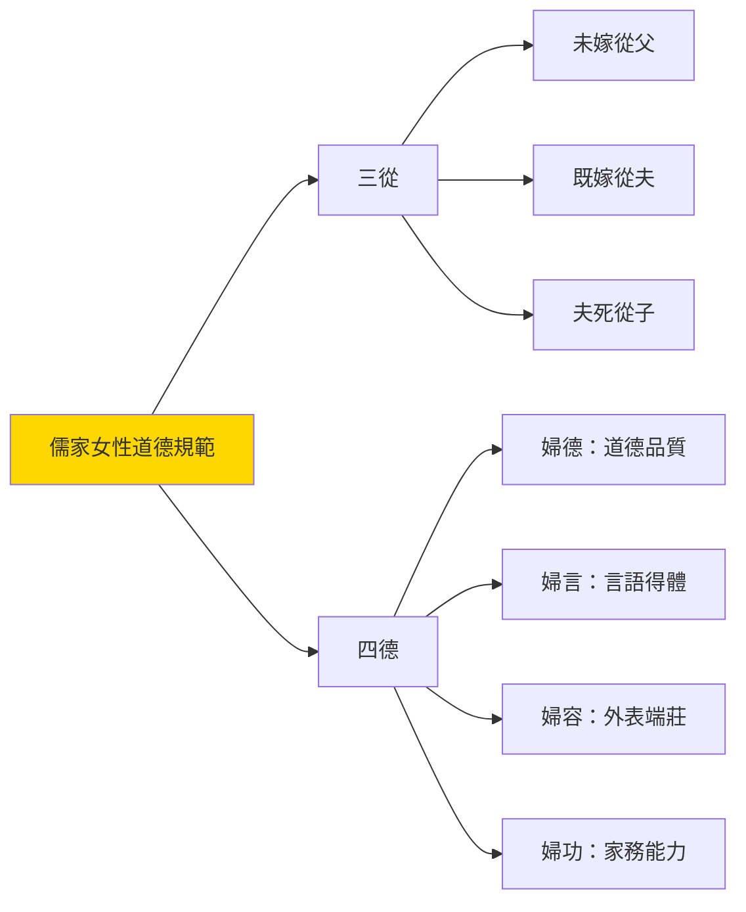
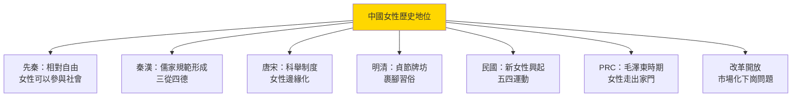
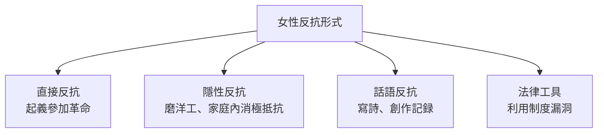

# HIST2143 中國女性史 / Love and Loyalty: Women and Gender in Chinese History

**Instructor**: Li Ji (李季)
**Department**: History, HKU
**Official source**: [HKU History Course Description 2024-25](https://history.hku.hk/wp-content/uploads/2024/07/HIST-2425.pdf)
**Style**: 袁騰飛式 — 犀利分析：中國歷史點解女性永遠係配角？但係沒有女性參與的歷史，又點解可能完整？

---

## 問題 1：5 個核心心智模型

### 心智模型 1：「三從四德」——儒家性別秩序點樣塑造中國女性身份
學者 **Patricia Ebrey**（華盛頓大學，*The Inner Quarters*, 1993）系統分析中國女性婚姻、家庭生活。學者 **Dorothy Ko**（高彥頤，*Everydayness*, 1994）指出：即使係最傳統嘅「深閨」女性，亦有自己嘅社交網絡、文化生活。

- **儒家經典**：《女誡》《內訓》——規範女性行為
- **宋代**：寡婦守節開始被提倡
- **明清**：貞節牌坊——政府表彰守節女性

### 心智模型 2：「女性反抗」——歷史被壓迫者點樣發聲？
學者 **William Theodore de Bary** 研究儒家女性主義；學者 **Wang Zhenyi**（1768-1797）——清代女天文學家，寫《學海》11卷，證明女性可以從事學術研究。

### 心智模型 3：「戀愛」作爲歴史範疇——點解係近代中國先至出現？
學者 **Gail Hershatter**（UCSC，*Women in China's Long Twentieth Century*, 2007）指出：作為自主感情選擇嘅「戀愛」概念，係 20 世紀初隨著西方話語傳入中國。

### 心智模型 4：「革命女性」——五四時期女性點樣被動員？
學者 **Wang Zheng**（*Women in the Chinese Enlightenment*, 1995）分析：五四女性接受新式教育後走入公共領域。

### 心智模型 5：「改革開放」與女性——市場經濟下女性角色轉變
學者 **Deborah Davis**（耶魯）研究毛澤東時代女性「走出家門」；改革開放後女性下崗問題。

---

## 問題 2：3 個根本分歧

### 分歧 1：中國傳統女性——被壓迫者定係適應者？
- **A 方（壓迫論）**：學者 **Kathryn Bernhardt**——中國女性法律地位低、財產權受限、被嚴格道德規範約束
- **B 方（能動論）**：學者 **Ellen Widmer**——女性喺家庭空間內有相當能動性

### 分歧 2：「五四女性解放」——真實解放定係另一種壓迫？
- **A 方（解放論）**：女性走出家庭、接受教育、參與社會
- **B 方（批判論）**：女性被要求同時扮演「賢妻良母」+「革命女性」雙重角色

### 分歧 3：計劃生育政策——女性赋权定係身體控制？
- **A 方（赋权論）**：計劃生育令女性控制生育，延遲結婚
- **B 方（控制論）**：計劃生育係國家對女性身體嘅強制干預

---

## 問題 3：10 個深度問題

1. 點解儒學傳統可以持續兩千年以上？但係儒學入面有無「女性主義」元素？
2. 中國歷史上有邊啲著名女性？武則天、慈禧、鑑湖女俠秋瑾——佢哋點樣喺男性主導社會中獲取權力？
3. 點解「裹腳」習俗可以持續咁耐？呢個習俗最終點解消失？
4. 太平天國點解有女性平等政策？但係點解最終失敗？
5. 五四時期新女性——佢哋點樣喺傳統家庭價值同現代個人主義之間掙扎？
6. 共產主義土地改革——點解可以短期內提升女性地位？但係長期影響係乜嘢？
7. 改革開放——點解市場經濟復辟咗傳統性別分工？下崗工人中女性佔多數——呢個揭示咗乜嘢？
8. 「剩女」現象——點解中國有 7000 萬「剩女」？呢個係性別比例失衡、教育水平提高、定係傳統婚姻觀念問題？
9. 中國女性主義——點解西方女性主義話語可以/唔可以應用喺中國歷史語境？
10. 如果你是清代一名普通女性——你要嫁俾一個完全陌生嘅男人、從此一生服務佢屋企、你自己嘅聲音永遠唔會被歷史記載。你點解接受呢個命運？定係你會反抗？

---

# 核心心智模型深化（中英對照）

## 1. 儒家性別秩序 / Confucian Gender Order

### 1.1 Bilingual 概念對照
- 三從 (sāncóng) = Three Subordinations — 未嫁從父、既嫁從夫、夫死從子
- 四德 (sìdé) = Four Virtues — 妇德、妇言、妇容、妇功
- 裹腳 (guǒjiǎo) = Foot Binding — 儒家對女性身體嘅控制

### 1.3 袁騰飛式犀利觀察
> 「中國男性最犀利嘅發明——就係裹腳！佢哋將女性嘅腳變成一件艺术品，令女性走唔動路——然後話女性天生就係走唔動路！」

### 1.4 Deep Test Question
**考試題**：比較中國同西方（歐洲/美國）歷史上女性地位。用具體案例說明：係中國女性特別悲慘，定係全球女性同樣被壓迫？

### 1.5 圖解

---

## 深度自測問題

**Q1**：儒學之所以持續——因為儒學成為科舉考試內容，任何想出人頭地嘅人都要學；而且儒學提供穩定社會秩序意識形態，統治者樂見其持續。

**Q2-Q10** 精簡版：
- Q2：著名女性——武則天（唯一女皇帝）、慈禧（實際統治者 47 年）、秋瑾（革命女俠）——佢哋都利用現有制度裂縫獲取權力。
- Q3：裹腳之所以持續——因為社會認為小腳係「美」；廢除原因係維新派/革命派批評話呢個係野蠻習俗，加上西方審美影響。
- Q4：太平天國女性政策——洪秀全宣稱男女平等，但係實際上仍係男性主導；呢個揭示意識形態與實踐之間嘅鴻溝。
- Q5：五四新女性掙扎——佢哋被要求同時係「新知識女性」又係「傳統賢妻良母」，兩者要求互相矛盾。
- Q6：土地改革提升女性地位——因為土地重新分配令女性都有經濟基礎；但係傳統性別分工仍然持續。
- Q7：下崗女性——因為女性被視為「次要」勞動力；呢個揭示市場經濟復辟傳統性別分工。
- Q8：剩女問題——多因素造成：性別比例失衡（計劃生育導致 3000 萬男性多餘）、女性教育水平提升但男性未有同步提升、傳統要求女性下嫁。
- Q9：中國女性主義——需要考慮中國歷史特殊語境；西方個人主義女性主義未必可以直接應用。
- Q10（反思題）：呢個題目要求學生代入歷史，理解歷史限制下個人選擇空間極其有限。

---

## 5 個 Mermaid 圖解

### 圖解 1：中國女性歷史地位變化

### 圖解 2：中國女性反抗形式

---

## 總結

**HIST2143 Women and Gender in Chinese History** 嘅核心價值：
1. **填補歷史空白**——女性聲音長期被忽略，呢個 course 補救呢個不平衡
2. **批判性思考**——傳統唔等於必然，女性從來都係歷史能動者
3. **跨文化比較**——全球女性共同面對嘅權力不平等問題

**袁騰飛金句**：
> 「歷史學家最鐘意話：『呢個時代女性地位低』——但係佢哋從來唔問：女性到底做咗啲乜嘢去改變自己命運？」

---

## 延伸閱讀

1. Ebrey, Patricia Buckley. *The Inner Quarters: Marriage and the Lives of Chinese Women in the Sung Period*. Berkeley: University of California Press, 1993.
2. Ko, Dorothy. *Everydayness in the Long Eighteenth Century*. Stanford: Stanford University Press, 1994.
3. Hershatter, Gail. *Women in China's Long Twentieth Century*. Berkeley: University of California Press, 2007.
4. Wang, Zheng. *Women in the Chinese Enlightenment: Oral and Textual Histories*. Berkeley: University of California Press, 1999.
5. Jaschok, Maria. *Concubines and Bondservants*. London: Zed Books, 1988.
6. Mann, Susan. *Precious Records: Women in China's Long Eighteenth Century*. Stanford: Stanford University Press, 1997.
