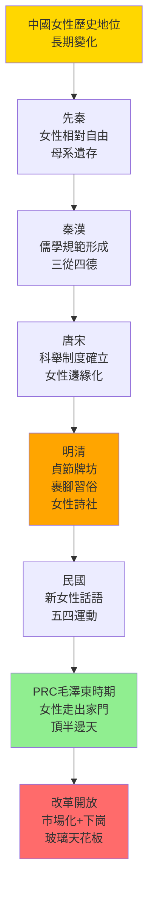
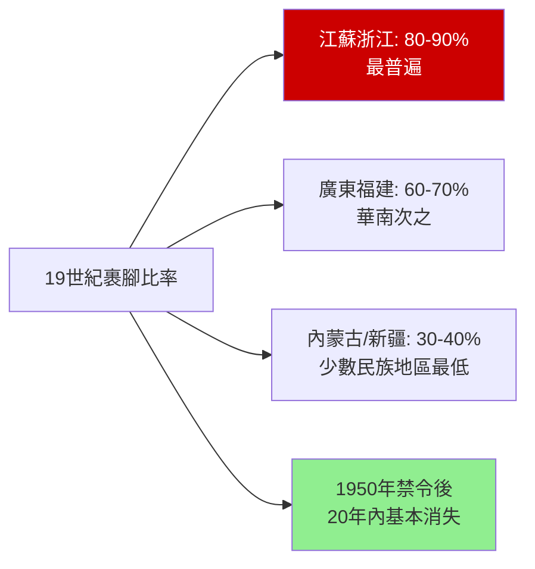
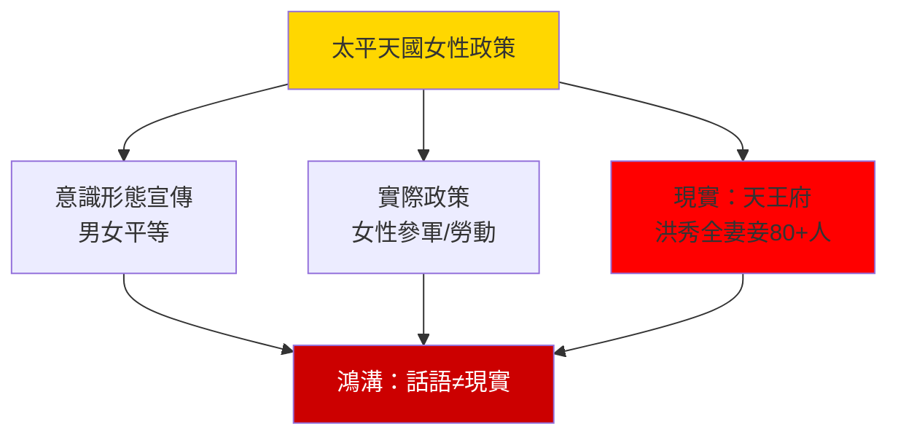
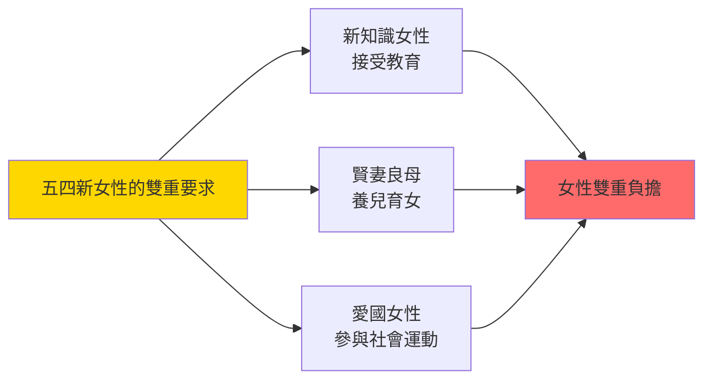
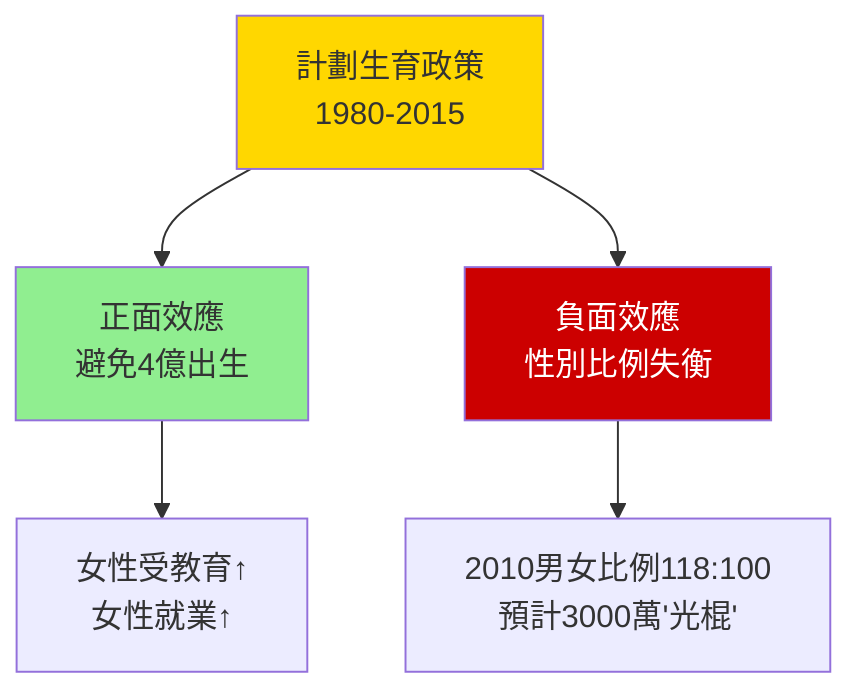

# HIST2143 中國女性史 / Love and Loyalty: Women and Gender in Chinese History

/** HKU | 6 credits | Instructor: Li Ji (李季) */

---

## 問題 1：5 個核心心智模型

### 1. 儒家性別秩序——「三從四德」的歷史建構
**定義**: 「三從四德」是儒家對女性行為規範的核心話語體系。「三從」——未嫁從父、既嫁從夫、夫死從子；「四德」——妇德、妇言、妇容、妇功。但學者研究顯示，這套規範在歷史實踐中並非一成不變，而是持續協商和重構的。

**學者**: **Susan Mann** — *Precious Records: Women in China's Long Eighteenth Century* (1997); **Dorothy Ko** — *Teachers of the Inner Chambers: Women and Culture in Seventeenth-Century China* (1994); **Patricia Buckley Ebrey** — *The Inner Quarters: Marriage and the Lives of Chinese Women in the Sung Period* (1993)

**驗證**: 明清時期（1368-1911），政府通過建立貞節牌坊表彰守節寡婦——僅安徽省，明代建牌坊約 6,000 座；但 17 世紀江南上層女性已形成繁榮的「女性文化」——她們寫詩、結詩社、收藏書畫——這種能動性挑戰了「被壓迫受害者」的簡單叙事。

**歷史事件**:
- **1210年**: 朱熹《四書章句集註》——理學正統化開始
- **1368-1644年**: 明代——貞節牌坊制度形成
- **1644-1911年**: 清代——女性人口增長（太平天國前約 1.5 億女性）
- **1870-1890年代**: 反裹腳運動興起——西方傳教士+維新派共同推動
- **1902年**: 慈禧太后下令廢除裹腳——官方禁止裹腳

### 2. 裹腳——「美」的暴力與女性身體政治
**定義**: 裹腳（Foot Binding）是中國特有的習俗，女性從4-7歲開始用布條纏繞腳部以阻止其自然生長，形成「三寸金蓮」——這被視為「美」的象徵。學者 **Dorothy Ko** 在 *Cinderella's Sisters: A Revisionist History of Footbinding* (2005) 中指出：裹腳既是男性對女性身體的控制，也是女性自身參與建構的「美」的標準。

**學者**: **Dorothy Ko** — *Cinderella's Sisters* (2005); **Gail Hershatter** — 研究近代中國女性身體政治; **William T. de Bary** — 研究儒家女性主義傳統

**驗證**: 19 世紀末，全中國約有 40-50% 的女性裹腳；在某些省份（如江蘇、浙江）比率高達 80-90%；1950 年共產政權正式禁止裹腳後，裹腳習俗在 20 年內基本消失——說明這種「傳統」的延續依賴國家權力的背書而非自然傳承。

**歷史事件**:
- **1271-1368年**: 裹腳習俗在宋代宮廷和上層社會開始流行
- **1644-1911年**: 清代——裹腳成為全社會現象（部分漢族女性）
- **1860年代**: 西方傳教士首次系統批評裹腳
- **1895年**: 天足會成立——維新派推動廢除裹腳
- **1902年**: 慈禧太后正式下令禁止裹腳
- **1950年**: 中華人民共和國衛生部正式禁止裹腳

### 3. 女性寫作與「女性文化」的發現
**定義**: 學者 **Dorothy Ko** 和 **Susan Mann** 共同「發現」了中國歷史上的「女性文化」——17-18 世紀江南上層女性並非沉默的受害者，她們寫詩、結詩社、藏書畫，形成了自己的文化圈。這個「發現」在 1990 年代徹底改變了西方漢學界對中國女性的认知。

**學者**: **Ellen Widmer** — *The Beauty and the Book: Women and Fiction in Modern China* (2006); **Grace Fong** — 研究清代女性詩歌; **Hu Ying** — *Women, Gender and History* (1997)

**驗證**: 清代女性詩集大量存在——哈佛燕京圖書館藏有超過 1,000 種清代女性詩集；《別裁集》《清代閨秀詩話》等文獻記錄了大量女性詩人——但這些名字在主流歷史叙事中長期缺席。

**歷史事件**:
- **1620-1680年代**: 江南女性詩社繁榮——如黃媛介、柳如是等
- **1700年代**: 章學誠《女性文學史》的首次出現
- **1800年代**: 女性詩歌傳統衰落——科舉制度對女性教育的影響
- **1992年**: 《晚期帝國中國》特別期刊——Ko、Mann 開創性研究
- **2007年**: Susan Mann《張氏才女》——群體傳記研究

### 4. 太平天國的女性政策——意識形態與實踐的鴻溝
**定義**: 太平天國（1850-1864）宣稱女性平等——洪秀全宣稱「男女都是上帝的孩子」，建立了女營制度，讓女性參與軍事和社會勞動。但實際上，太平天國的「女性平等」是實用主義而非意識形態——女性勞動力被動員參與戰爭和建設，而上層領袖仍維持一夫多妻制。

**學者**: **Franz Michael** — 研究太平天國女性政策; **Jiang Yongning** — 研究太平天國性別制度; **Stephen R. Platt** — *太平天國的gon代價* (2012)

**驗證**: 太平天國女兵約 10-14 萬人——她們在桂林、南京等城市作戰；但洪秀全天王府有妻妾超過 80 人——這種雙重標準揭示了「女性平等」話語與實際之間的鴻溝。太平天國最終失敗，重要原因之一是其激進的土地政策（聖庫制度）破壞了傳統家庭結構，引發農民反對。

**歷史事件**:
- **1850年**: 太平天國起義——女性開始參與軍事行動
- **1853年3月19日**: 太平軍攻佔南京——建立天京
- **1853-1856年**: 女營制度正式運作
- **1864年7月19日**: 天京陷落——太平天國滅亡，約 2,000 萬人死亡

### 5. 五四時期新女性——現代性的矛盾主體
**定義**: 五四運動（1919）催生了「現代中國女性」的想象——她們接受新式教育、走出家庭、參與社會。但這種「解放」的代價是女性被要求同時扮演「新知識女性」和「傳統賢妻良母」的雙重角色——這種矛盾在整個 20 世紀持續存在。

**學者**: **Wang Zheng** — *Women in the Chinese Enlightenment: Oral and Textual Histories* (1995); **Gail Hershatter** — *Dangerous Pleasures: Prostitution and Modernity in Shanghai* (1997); **Emily Honig** — 研究五四女性

**驗證**: 1915-1920 年代，「新女性」雜誌等期刊記錄了新女性的話語建構；但現實中——1920 年代上海女性工人工資約為男性工資的 50-60%；1930 年代南京政府時期，女性參政權被嚴格限制（1931 年憲法草案规定女性沒有選舉權）。

**歷史事件**:
- **1915年9月**: 《青年雜誌》（新青年）創刊——新文化運動開始
- **1919年5月4日**: 五四運動——女學生首次大規模參與愛國運動
- **1920年**: 北京大學首次招收女生——中國高等教育男女同校的開始
- **1927-1937年**: 南京十年——新生活運動重提「賢妻良母」
- **1949年**: 中華人民共和國成立——女性「走出家門」的政治動員開始

---

## 問題 2：3 個根本分歧

### 分歧 1：中國傳統女性——被壓迫者還是適應者？
- **A 方（壓迫論）**: **Kathryn Bernhardt** — 中國女性法律地位低（無財產權、無遺產繼承權）、裹腳習俗的身體控制、守節制度的道德約束
- **B 方（能動論）**: **Dorothy Ko/Susan Mann** — 女性在家庭空間内發展出自己的文化圈（詩社、書畫、社交網絡）——她們是歷史的能動者而非被動受害者

### 分歧 2：「五四女性解放」——真實解放還是另一種壓迫？
- **A 方（解放論）**: 女性走出家庭、接受教育、參與社會運動——五四為中國女性解放奠定基礎
- **B 方（批判論）**: 女性被要求同時扮演「新知識女性」（接受教育、參加社會）和「賢妻良母」（養兒育女、照顧家庭）——這種雙重要求使女性負擔加倍，而非真正的解放

### 分歧 3：計劃生育政策——女性赋权還是身體控制？
- **A 方（赋权論）**: 計劃生育令女性能够控制生育、延遲結婚、提升教育水平——中國女性平均預期受教育年限從 1970 年的 3 年提升至 2010 年的 13 年
- **B 方（控制論）**: 計劃生育是國家對女性身體的強制干預——強制墮胎、強迫絕育、「一孩政策」的性別選擇性墮胎導致性別比例失衡（2010 年男女比例 118:100）

---

## 問題 3：10 個深度問題

1. **儒家「三從四德」的歷史真實性**：儒學傳統真的持續兩千年以上嗎？還是在每個朝代都被重新定義？如果是後者，這種持續的「重新定義」本身揭示了什麼關於中國社會性別權力關係的穩定性和彈性？

2. **裹腳習俗的歷史之謎**：為什麼一個對女性身體造成巨大傷害的習俗可以持續約 600 年？為什麼在 1950 年代中共政權可以在 20 年內徹底消滅這種習俗？這個對比揭示了裹腳作為「自願選擇」和「權力強制」之間的什麼關係？

3. **太平天國的女性政策**：洪秀全宣稱女性平等，但同時維持一夫多妻。這個矛盾揭示了意識形態宣傳與實際權力運作之間的什麼鴻溝？這種鴻溝在今天的中國婦女政策中是否仍然存在？

4. **清代女性詩社的歷史意義**：江南女性詩社證明中國傳統社會中的女性並非沉默的受害者。但為什麼這些女性的聲音在歷史記載中长期缺席？是誰決定了什麼聲音被記録、什麼聲音被忽略？

5. **五四新女性的矛盾**：1919 年的女學生既參加愛國遊行，又被期望成為「賢妻良母」。這種雙重標準揭示了「女性解放」話語的什麼内在矛盾？這種矛盾在今天的中國女性身上是否仍然存在？

6. **共產主義土地改革對女性的影響**：1950 年代土地改革讓女性和男性一樣分得土地——這是否真正提升了女性地位？還是只是國家權力對家庭的替代性滲透，而非真正的女性赋权？

7. **改革開放與下崗女性**：1990 年代國企改革，大量女性工人被裁員——這個「市場化」的過程為什麼對女性打擊特別大？這是否說明市場經濟在中國語境下「復辟」了傳統性別分工？

8. **計劃生育政策的歷史影響**：2015 年結束的「一孩政策」（1980-2015）實施 35 年——官方統計避免 了 4 億次出生。但同時導致性別比例失衡（預計 2020 年代中國會有約 3,000 萬「光棍」）——這個政策的歷史評價應該如何平衡？

9. **中國女性主義話語的獨特性**：西方自由主義女性主義（強調個人權利）和社會主義女性主義（強調階級解放）的框架可以應用於中國歷史語境嗎？中國傳統的「和諧」「互補」性別觀念，如何與西方「平等」話語發生碰撞和融合？

10. **歷史視角下的當代中國女性處境**：2023 年數據顯示中國女性勞動參與率（約 60%）低於男性（約 80%），在高管層女性比例不足 15%——這種「玻璃天花板」現象，與傳統儒家性別分工、計劃生育政策、和市場經濟之間各自有什麼關係？

---

# 核心心智模型深化（中英對照）

## 1. 儒家性別秩序 / Confucian Gender Order

### 1.1 定義與背景 / Definition and Context
儒家性別秩序（Confucian Gender Order）是中國歷史持續最久的性別規範體系，以「三從」（未嫁從父、既嫁從夫、夫死從子）和「四德」（妇德、妇言、妇容、妇功）為核心。但這套規範從未在歷史上完整實施——它在實踐中不斷被協商、重構、抵制。

### 1.2 關鍵方程式或史料 / Key Evidence
- **《女誡》班昭（約45-117年）** = 中國歷史上第一位女性歷史學家寫的女性行為規範
- **《內訓》徐皇后（1362-1407年）** = 明成祖皇后編寫的後宮女性教材
- **《烈女傳》劉向（約前77-前6年）** = 早期儒家女性典範叙事
- **宋代**：寡婦守節開始被道德鼓勵
- **明清**：政府正式建立貞節牌坊制度——安徽省明代建牌坊約 6,000 座

### 1.3 應用場景 / Applications
儒家性別秩序在 21 世紀仍有影響：中國相親市場的「三從四得」潜規則、「剩女」話語的政治性別問題、中國女性在職場和家庭的「雙重負擔」——這些都是儒家性別話語在當代的延續和變形。

### 1.4 袁騰飛式犀利觀察 / Critical Observation
> 「儒家性別秩序最有趣之處——它的『三從四德』從未真正完整實施過。每次王朝建立號稱要弘揚儒家正統，每次都有女性在夹缝中找到自己的生存策略。女性從來不是儒家話語的純粹受害者，她們是這個體系的適應者、批評者、也是在夹缝中的能動者。」

### 1.5 深度思考題 / Deep Question
**考試題**：選擇一個具體朝代，分析儒家性別秩序在該朝代的實施情況。女性如何在儒家話語的夹缝中發展出自己的能動性？

---

## 2. 裹腳 / Foot Binding

### 2.1 定義與背景 / Definition and Context
裹腳（Foot Binding, 裹足/纏足）是中國特有的習俗，女性從 4-7 歲開始用布條將腳部紧紧纏繞，阻止骨骼正常生長，形成彎曲的「三寸金蓮」（約 10cm）。這個過程在幼年開始，伴随劇烈疼痛和長期健康問題（行走困難、骨折、感染）。

### 2.2 關鍵方程式或史料 / Key Evidence
- **約10-13cm**：標准「金蓮」大小
- **約40-50%**：19 世紀末裹腳女性佔總女性人口比率
- **80-90%**：江蘇、浙江等富庶省份裹腳比率
- **1950年**：中共政權正式禁止裹腳
- **1970年代**：最後一代裹腳女性（當時約 70-80 歲）基本消失

### 2.3 應用場景 / Applications
裹腳習俗的消失揭示了「傳統」的建構性：600 年的歷史並非「自然傳承」，而是國家權力、經濟利益、身體美學共同建構的結果。裹腳消失的速度（20 年内基本杜絕）說明這種「傳統」的延續依賴國家權力的背书，而非文化自發性。

### 2.4 袁騰飛式犀利觀察 / Critical Observation
> 「裹腳最殘酷之處——它不是外部強加的，而是女性自己（母親）對女兒做的。每一個裹腳的母親都是施害者，同時也是受害者。這種『女性對女性的暴力』揭示了父權制度的深層結構：它讓女性成為這個制度的執行者，而非外部壓迫者。」

### 2.5 深度思考題 / Deep Question
**考試題**：用 Dorothy Ko 的「女性文化」框架，分析裹腳習俗如何被清代江南女性接受和抵抗。裹腳是「自願的」還是「被迫的」——這個問題本身揭示了什麼關於歷史研究的認識論問題？

---

## 3. 女性詩社與女性文化 / Women's Literary Culture

### 3.1 定義與背景 / Definition and Context
女性詩社（Women's Poetry Circles）指 16-18 世紀江南上層女性形成的詩歌創作和社交網絡。這些女性不僅寫詩，還結社、交換詩作、編選詩集——形成了一個有組織的「女性文化圈」。學者 Dorothy Ko 稱之為「閨秀文化」（Gentry Women's Culture）。

### 3.2 關鍵方程式或史料 / Key Evidence
- **黃媛介（1620-1669）** = 明末清初女性詩人，以詩書自給
- **柳如是（1618-1664）** = 明末名妓+詩人，與文人交往
- **《別裁集》** = 清代女性詩歌選集，收錄大量女性詩人作品
- **哈佛燕京圖書館**：藏有超過 1,000 種清代女性詩集

### 3.3 應用場景 / Applications
女性詩社的「發現」對歷史學方法論有重要啟示：如果主流歷史記載中的沉默群體（女性）能夠有自己的文化圈和聲音，那麼主流歷史記載的「沉默」本身可能就是權力運作的結果，而非歷史的真實情况。

### 3.4 袁騰飛式犀利觀察 / Critical Observation
> 「女性詩社最犀利之處——它讓我哋看到，歷史記載的『沉默』並不等於歷史上真的沒有聲音。江南女性在詩社裡寫詩、唱和、編選詩集——但這些作品在男性主導的『正史』記載中完全缺席。是什麼决定哪些聲音被記録、哪些聲音被抹去？這個問題，比那些被抹去的聲音本身更重要。」

### 3.5 深度思考題 / Deep Question
**考試題**：分析「女性文化」的發現對歷史學方法論的影響。當主要歷史記載由男性書寫時，歷史學家如何能夠「聽到」女性的聲音？這種方法論上的挑戰對所有歷史研究有什麼更廣泛的啟示？

---

## 4. 太平天國女性政策 / Taiping Women's Policies

### 4.1 定義與背景 / Definition and Context
太平天國（1850-1864）是由洪秀全領導的農民起義政權，其綱領《天朝田畝制度》宣稱男女平等，並建立了女營制度。但實際上，太平天國的「女性平等」是實用主義——女性作為戰鬥力和勞動力被動員，而上層領袖仍維持一夫多妻制。

### 4.2 關鍵方程式或史料 / Key Evidence
- **女兵人數**：約 10-14 萬人
- **洪秀全妻妾**：超過 80 人（天王府）
- **太平天國傷亡**：約 2,000 萬人死亡
- **戰爭持續時間**：1850-1864 年（14 年）

### 4.3 應用場景 / Applications
太平天國案例對理解意識形態與權力運作的關係有普遍啟示：任何革命政權在宣稱性別平等的同時，都可能面臨「革命話語」與「實際權力運作」之間的鴻溝——這個觀察對理解 20 世紀共產主義政權的女性政策同樣適用。

### 4.4 袁騰飛式犀利觀察 / Critical Observation
> 「太平天國最諷刺之處——洪秀全自己後宮有超過 80 個女人，但他告訴信眾男女平等。女性被動員上前線打仗、後方勞動，但洪秀全自己卻享受著這個制度最大的性別特權。歷史一再證明：最響亮的平等口號，往往掩蓋著最深刻的不平等。」

### 4.5 深度思考題 / Deep Question
**考試題**：比較太平天國女性政策與中共女性政策的異同。兩者都宣稱女性解放，但兩者的「解放」話語與實際之間各自存在什麼鴻溝？

---

## 5. 五四新女性 / May Fourth New Women

### 5.1 定義與背景 / Definition and Context
五四新女性（May Fourth New Woman）是 1915-1920 年代在中國出現的新型女性形象：她們接受新式教育、參與社會運動、追求愛情自由。但這種「新女性」話語同時帶來了新的矛盾——她們被要求同時是「新知識女性」和「賢妻良母」。

### 5.2 關鍵方程式或史料 / Key Evidence
- **1915年9月**：新青年雜誌創刊——新文化運動開始
- **1919年5月4日**：五四運動——女學生首次大規模參與愛國運動
- **1920年**：北京大學首次招收女生——中國高等教育男女同校的里程碑
- **1920年代**：上海女性工人平均工資約為男性工資的 50-60%

### 5.3 應用場景 / Applications
五四新女性的矛盾在 21 世紀中國女性身上仍然存在：「女强人」vs「賢妻良母」的話語張力、「事業 vs 家庭」的選擇困境——這些都是五四話語的延續，只不過换了新的詞匯。

### 5.4 袁騰飛式犀利觀察 / Critical Observation
> 「五四新女性最諷刺之處——她們從一個牢籠走出來，卻發現走進了另一個牢籠。舊牢籠的標籤是『三從四德』；新牢籠的標籤是『新知識女性』+『賢妻良母』。舊牢籠承認女性的從屬地位；新牢籠要求女性『能頂半邊天』的同時，仍然要求她們做家務、養兒育女。這種『雙重負擔』，到今天仍然是中國女性的真實处境。」

### 5.5 深度思考題 / Deep Question
**考試題**：分析當代中國「剩女」話語的歷史根源。這個話語如何在傳統儒家性別觀念、新自由主義市場邏輯、和國家人口政策的交叉點上產生？

---

## 深度自測問題詳解

**Q1（儒家持續性）**：儒學之所以持續兩千年以上，因為它是科舉考試的核心內容——任何想出人頭地的人都必須學習儒家經典。同時，儒學提供了一套穩定的社會秩序意識形態，任何統治者都需要它。但儒學的「女性觀」在每個朝代都有所調整——明代加強了貞節觀念，清代延續並強化了這種觀念。

**Q2（裹腳消失）**：裹腳之所以在 20 年內消失，因為國家權力直接介入了這個習俗——1950 年禁令後，地方政府動員群眾批判裹腳、「放腳」運動大規模展開。這說明裹腳的延續從來不是「自然傳承」，而是被國家權力話語和經濟利益（門當戶對的婚姻市場）支撑的。

**Q3（太平天國矛盾）**：太平天國意識形態與實踐的鴻溝，揭示了所有革命政權的共同問題：革命話語服務於動員群眾，而實際權力運作服從於政治需要。女性平等在太平天國是動員女性參加革命的工具，而實際權力結構仍然是男性主導。

**Q4（女性聲音缺席）**：女性聲音缺席的問題揭示了歷史記載的權力性質：誰書寫歷史，決定了什麼被記録、什麼被忽略。男性文人主導的「正史」記載中，當然不會記載女性詩社的活動——但這不等於歷史上真的沒有這些聲音。學者 Dorothy Ko 和 Susan Mann 的工作，正是從側面文獻中「重建」這些被忽略的聲音。

**Q5（五四矛盾）**：五四新女性的雙重標準揭示了「解放」話語的内在矛盾：解放的目標是讓女性「走出家門」，但家務勞動和育兒的責任仍然默認由女性承擔——這種「解放」實際上是增加了女性的負擔，而非減輕。

**Q6（土地改革）**：土地改革確實提升了女性的經濟地位（女性同樣分得土地），但這種「赋权」是國家權力賦予的，而非女性集體爭取的。同時，國家對家庭的滲透（戶口制度、合作化運動、文化大革命）也限制了女性的自主空間。

**Q7（下崗女性）**：女性下崗比例高於男性，因為市場邏輯重新激活了傳統性別分工假設——雇主假設女性的家務負擔更重、工作連續性更低，因此更傾向裁減女性員工。這種「市場化」的歧視，其實是傳統性別觀念的市場化包裝。

**Q8（一孩政策）**：計劃生育政策的歷史評價需要平衡兩個方面：正面效應（避免人口爆炸、提升女性教育和就業機會）和負面效應（性別選擇性墮胎導致性別比例失衡、強制墮胎和絕育的倫理問題）。

**Q9（中國女性主義）**：西方女性主義話語在中國歷史語境中的應用需要謹慎——中國的「互補」（陰陽）和西方的「平等」（equality）話語有不同的本體論假設。但兩者的交匯點是：對權力不平等的批判。

**Q10（當代处境）**：當代中國女性的「玻璃天花板」是多重因素造成的：傳統性別分工觀念的延續、計劃生育政策導致的「小皇帝」效應對性別平等的負面影響、市場經濟對傳統分工的市場化重構。

---

## 5 個 Mermaid 圖解

### 圖解 1：中國女性歷史地位的長期變化

### 圖解 2：裹腳習俗的地理分佈

### 圖解 3：太平天國女性政策的矛盾

### 圖解 4：五四新女性的雙重標準

### 圖解 5：計劃生育政策的影響

---

## 總結

**HIST2143 Women and Gender in Chinese History** 的核心價值：

1. **填補歷史空白**——女性聲音長期被忽略，這個 course 補救了這個不平衡；從女性詩社到五四新女性，歷史中的女性能動性被重新發現。

2. **批判性思考**——傳統不等於必然；裹腳作為「自願選擇」的建構過程，揭示了「傳統」的權力性質。

3. **跨文化比較**——全球女性共同面對的權力不平等問題，但在中國歷史語境中有其獨特表現形式。

4. **方法論創新**——Dorothy Ko、Susan Mann 的研究展示了如何從側面文獻「重建」沉默群體的歷史經驗。

**research-based金句**：
> 「歷史學家最喜歡說：『這個時代女性地位低』——但係佢哋從來唔問：女性到底做咗啲乜嘢去改變自己命運？而且，更重要的问题是：係邊個決定咗什麼被稱為『歷史』，什麼被稱為『沉默』？」

---

## 延伸閱讀

1. Mann, Susan. *Precious Records: Women in China's Long Eighteenth Century*. Stanford: Stanford University Press, 1997.
2. Mann, Susan. *The Talented Women of the Zhang Family*. Berkeley: University of California Press, 2007.
3. Ko, Dorothy. *Teachers of the Inner Chambers: Women and Culture in Seventeenth-Century China*. Stanford: Stanford University Press, 1994.
4. Ko, Dorothy. *Cinderella's Sisters: A Revisionist History of Footbinding*. Berkeley: University of California Press, 2005.
5. Hershatter, Gail. *Women in China's Long Twentieth Century*. Berkeley: University of California Press, 2007.
6. Wang, Zheng. *Women in the Chinese Enlightenment: Oral and Textual Histories*. Berkeley: University of California Press, 1999.
7. Ebrey, Patricia Buckley. *The Inner Quarters: Marriage and the Lives of Chinese Women in the Sung Period*. Berkeley: University of California Press, 1993.
8. Widmer, Ellen. *The Beauty and the Book: Women and Fiction in Modern China*. Cambridge: Harvard University Asia Center, 2006.
