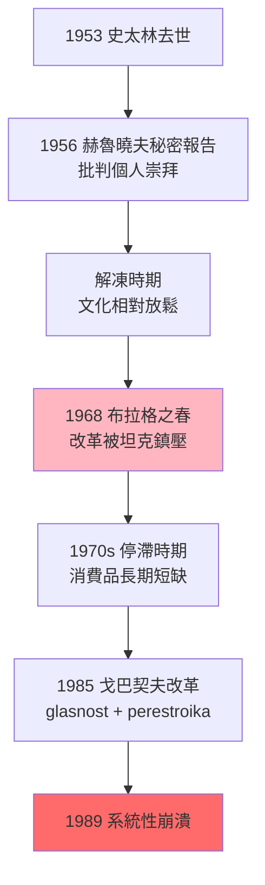
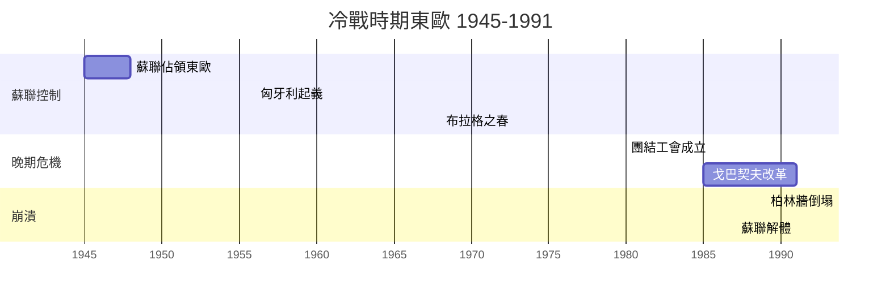
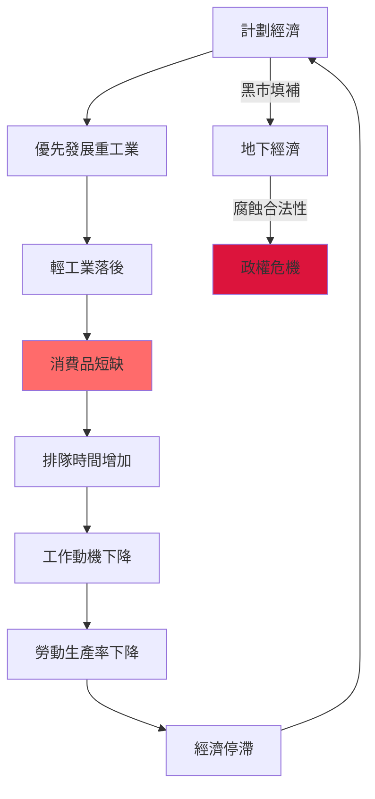
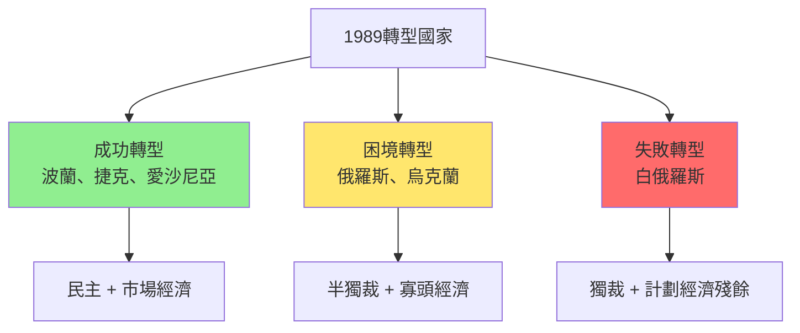
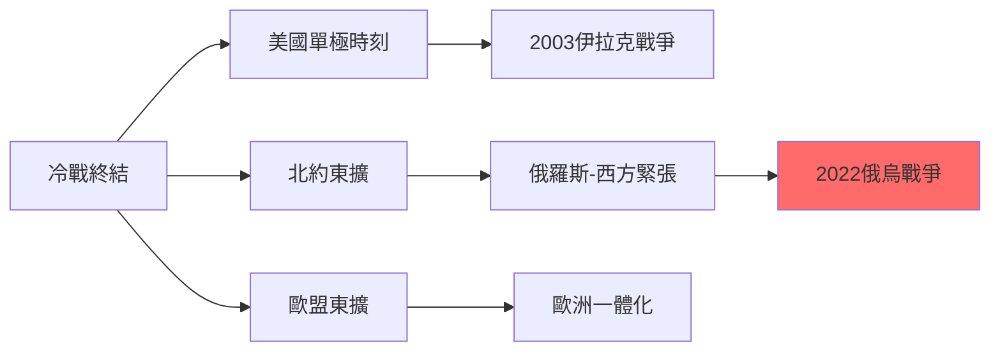

# HIST2152 晚期社會主義 / Late Socialism and the 1989 Revolutions

**Instructor**: Oscar Sanchez-Sibony
**Department**: History, HKU
**Official source**: [HKU History Course Description 2024-25](https://history.hku.hk/wp-content/uploads/2024/07/HIST-2425.pdf)
**Style**: 袁騰飛式 — 犀利揭穿：社會主義世界點解可以一夜崩潰？呢個唔係歷史必然，而係人為錯誤

---

## 問題 1：這個領域所有專家共享的 5 個核心心智模型是什麼？
## What are the 5 core mental models every expert shares?

### 心智模型 1：「晚期社會主義」文化轉向——從集體主義到個人主義
**Late Socialist Cultural Turn: From Collectivism to Individualism**

學者 **György C. G.**（布達佩斯政策研究）指出：1960 年代「解凍」（Khrushchev Thaw）之後，蘇聯集團內部出現深刻文化轉向——由集體主義話語轉向個人主義、消費文化。學者 **Susan Reid**（*The Stalin Era*, 2005）研究：個人主義興起唔係西方文化入侵，而係社會主義內部矛盾嘅必然產物。

- **1956** 匈牙利革命——人民用武力反對蘇聯控制，揭示集體主義話語嘅內在危機
- **1968** 布拉格之春——捷克斯洛伐克嘗試「社會主義人性化」，被蘇聯坦克鎮壓
- **1970s** 東歐黑市經濟——官方經濟失敗催生地下經濟，佔 GDP 20-30%
- **1980s** 蘇聯青年開始追求西方流行文化——可口可樂、牛仔褲、搖滾樂象徵文化轉向

### 心智模型 2：1989 年革命——結構危機定精英交易？
**The 1989 Revolutions — Structural Crisis or Elite Bargain?**

學者 **Mark Kramer**（哈佛，*The Collapse of East European Communism*, 2004）提出：1989 年東歐革命唔係單一事件，而係經濟停滯、制度僵化、意識形態破產三重危機爆發。學者 **Gale Stokes**（*The Walls Came Tumbling Down*, 1993）分析：東歐共產政權唔係被群眾推翻，而係被內部精英主動放棄。

- **1985** 戈巴契夫上任，推行 glasnost（開放）+ perestroika（重建）改革
- **1989 年 6 月 4 日** 天安門廣場——中國選擇武力鎮壓，東歐選擇和平轉型
- **1989 年 11 月 9 日** 柏林牆倒塌——東德邊防軍打開閘門，萬人衝向西柏林
- **1989 年 11 月 17 日** 天鵝絨革命——捷克知識分子和平接管政府

### 心智模型 3：黑市、腐敗與社會主義經濟危機
**Black Markets, Corruption, and Socialist Economic Crisis**

學者 **Stephen White**（*Russia's Left Turn*, 2005）研究：社會主義經濟低效導致黑市泛濫——官方經濟之外，存在龐大地下經濟，呢啲經濟活動養活咗數百萬人，但同時腐蝕咗政權合法性。學者 **Padma Desai**（*Gorbachev: Undoing Stalin*, 2002）分析：蘇聯經濟結構性問題——重工業優先、輕工業落後、消费品長期短缺。

- **蘇聯生活品短缺**：排隊幾小時買麵包；皮鞋工廠倒閉但坦克工廠滿負荷
- **東歐黑市**：波蘭團結工會最初就係工人為對抗短缺而起嘅組織
- **腐敗系統化**：官員用特權换外匯，黑市成為補充官方經濟嘅「第二經濟」

### 心智模型 4：冷戰終結與美國單極時刻
**End of the Cold War and the American Unipolar Moment**

學者 **John Lewis Gaddis**（耶魯，*The Cold War*, 2005）指出：1989-1991 年冷戰突然結束——呢個係人類歷史上最大規模地緣政治轉變。學者 **Odd Arne Westad**（*The Global Cold War*, 2007）提醒：單極時刻帶嚟美國帝國主義過度擴張——呢個為 2001 年後伊拉克戰爭、2008 年金融危機埋下伏筆。

- **1991 年 12 月 25 日** 戈巴契夫電視宣布辭職，蘇聯國旗降下
- **1991 年 12 月 26 日** 蘇聯正式解體，15 個新國家誕生
- **美國單極時刻**：1991-2008 年——美軍全球部署，無制衡力量
- **2003 年伊拉克戰爭**：美國單邊主義嘅頂峰——未獲聯合國授權入侵

### 心智模型 5：後社會主義轉型——代價與教訓
**Post-Socialist Transition — Costs and Lessons**

學者 **Michael D. S. Drake**（*Fundamentals of Soviet Economic History*, 1990）研究：後社會主義轉型造成大規模失業、貧富分化、預期壽命下降——俄羅斯 1990 年代 GDP 下跌 50%，男性平均壽命下降 6 年。學者 **Sheila Fitzpatrick**（*On Stalin's Pony*, 2015）分析：俄羅斯「震撼治療」（Shock Therapy）導致 1990 年代經濟崩潰，呢個創傷到今日仍然影響俄羅斯政治。

- **1992** 俄羅斯推行「休克療法」——價格自由化導致惡性通脹（年通脹率 2,500%）
- **1990s** 東歐轉型：波蘭、捷克、匈牙利成功民主化；俄羅斯、烏克蘭陷入困境
- **1998** 俄羅斯國債違約——引發全球金融危機
- **2022** 俄烏戰爭——後社會主義轉型失敗嘅最深層後果爆發

---

## 問題 2：這個領域 3 個 SPECIFIC 根本分歧

### 分歧 1：1989 年東歐革命——人民起義定精英交易？
**The 1989 Revolutions: People's Uprising or Elite Bargain?**

- **A 方（群眾運動論）**：學者 **Vladimir Tismăneanu**（*Stalinism for All Seasons*, 2003）——東歐群眾大規模示威（萊比錫每週一示威、布拉格天鵝絨革命）係政權崩潰嘅直接原因；基層運動展示人民力量
- **B 方（精英交易論）**：學者 **Gale Stokes**——共產黨內部精英（戈巴契夫、東德領導層）主動決定放棄權力；群眾示威只係催化劑，而非根本原因

### 分歧 2：蘇聯崩潰——改革失敗定歷史必然？
**Soviet Collapse: Reform Failure or Historical Inevitability?**

- **A 方（改革失敗論）**：學者 **Martin Malia**（*The Soviet Tragedy*, 1994）——戈巴契夫改革順序錯誤：政治開放（glasnost）先於經濟改革（perestroika），導致秩序崩潰；如果順序顛倒，蘇聯可能存活
- **B 方（結構必然論）**：學者 **Stephen Kotkin**（*Armageddon Averted*, 2001）——蘇聯計劃經濟根本唔可持續；無論邊個改革，最終都會失敗；經濟結構決定歷史走向

### 分歧 3：後社會主義轉型——成功定失敗？
**Post-Socialist Transition: Success or Failure?**

- **A 方（成功論）**：學者 **Leslie Holmes**（*Postcommunism*, 2001）——波蘭、捷克、愛沙尼亞成功轉型為民主市場經濟；北約東擴鞏固咗呢啲成果
- **B 方（失敗論）**：學者 **Peter Reddaway**（*The Tragedy of Russia's Reforms*, 2001）——俄羅斯轉型失敗：貧富懸殊（0.1% 人口控制 40% 財富）、預期壽命下降、腐敗泛濫；呢啲問題到 2020 年代仍未解決

---

## 問題 3：10 個 PROBING 深度問題

1. 如果戈巴契夫改革成功，蘇聯今日會係點？呢個問題揭示咗歷史偶然性定結構必然性之間嘅張力？
2. 點解 1989 年東歐革命以「天鵝絨」和平進行，但係羅馬尼亞以流血暴力結束？同一個意識形態框架下，點解有咁大差異？
3. 如果你是歷史學家，點樣研究從未文獻化嘅東歐黑市歷史？呢啲「非官方」歷史如何補充官方檔案嘅不足？
4. 後社會主義轉型代價——數百萬普通人承受失業、價格飛漲、社會保障消失。呢啲代價係歷史必然定決策錯誤？
5. 如果你去 1985 年莫斯科做田野考察，你會發現乜嘢跡象顯示制度危機？點樣喺危機爆發前識別制度失敗？
6. 晚期社會主義消費文化——為乜嘢西方文化（可口可樂、牛仔褲、搖滾樂）可以如此容易咁滲透意識形態封鎖？呢個揭示咗文化力量乜嘢本質？
7. 點解今日俄羅斯有 70% 以上民眾懷念蘇聯？呢個係真實集體記憶定係普京政府嘅政治操作？
8. 如果你是 1991 年俄羅斯普通人，轉型對你生活影響係乜嘢？點解部分人從轉型獲益，但係更多人生活水平大幅下降？
9. 社會主義實驗——究竟係歷史失敗定係另類現代性嘅歷史實驗？點解我哋需要從長時段評估社會主義實驗？
10. 2022 年俄烏戰爭——呢個可以理解為後社會主義轉型失敗嘅最終爆發嗎？冷戰結束 30 年後，點解歐洲再次出現大規模戰爭？

---

# 核心心智模型深化（中英對照）

## 1. 晚期社會主義文化轉向 / Late Socialist Cultural Turn

### 1.1 Bilingual 概念對照
- 晚期社會主義 (wǎnqí shèhuì zhǔyì) = Late Socialism — 1960s-1980s 蘇聯集團
- 解凍 (jiědòng) = Khrushchev Thaw — 赫魯曉夫批判史太林
- 個人主義 (gèrén zhǔyì) = Individualism — 集體主義話語嘅內在挑戰
- 地下經濟 (dìxià jīngjì) = Underground Economy — 支撐社會主義日常生活

### 1.2 史料與考據
- **核心史料**：東歐各國檔案（東德 Stasi 檔案、匈牙利檔案）、口述歷史、蘇聯《星火》雜誌
- **方法論爭議**：共產黨官方檔案往往系統性造假；需要交叉驗證多個來源
- **口述歷史價值**：普通市民點樣經歷短缺、排隊、黑市——呢啲經歷從未進入官方歷史

### 1.3 袁騰飛式犀利觀察
> 「蘇聯最犀利嘅發明就係：發明咗一個可以運作幾十年但係永遠缺廁紙嘅經濟系統！成日話社會主義優越，但係你知唔知，蘇聯末期連廁紙都要排隊——呢個先至係社會主義真正嘅『成就』！」

### 1.4 Deep Test Question
**考試題**：分析「解凍」時期（1953-1964）蘇聯文化轉向如何為 1980 年代晚期社會主義危機奠定基礎。呢個分析對理解其他極權制度危機有乜嘢啟示？

### 1.5 圖解

---

## 2. 1989 年東歐革命 / The 1989 Revolutions

### 2.1 Bilingual 概念對照
- 天鵝絨革命 (tiān'éróng gémìng) = Velvet Revolution — 捷克和平革命
- 團結工會 (tuánjié gōnghuì) = Solidarity — 波蘭工人運動
- 開放 (kāifàng) = Glasnost — 開放政治討論
- 重建 (chóngjiàn) = Perestroika — 經濟體制改革

### 2.3 袁騰飛式犀利觀察
> 「1989 年 11 月 9 日，柏林牆倒塌——但係你知唔知，東德官員開記招解釋新旅遊政策時，佢自己都唔知閘門會打開！歷史就係咁：成日話歷史係偉人創造，但係有時歷史係一班唔知自己做緊乜嘅官員創造嘅！」

### 2.4 Deep Test Question
**考試題**：比較波蘭、匈牙利、東德、捷克、羅馬尼亞五國 1989 年轉型過程。點解有啲國家以和平協商轉型，有啲以暴力終結？呢個差異揭示咗乜嘢關於東歐共產主義政權內部結構？

### 2.5 圖解

---

## 3. 蘇聯經濟危機 / Soviet Economic Crisis

### 3.1 Bilingual 概念對照
- 計劃經濟 (jìhuà jīngjì) = Planned Economy — 國家指令性配置資源
- 價格雙軌制 (jiàgé shuāngguǐ zhì) = Dual Pricing System — 官方價 + 市場價
- 短缺經濟 (duǎnquē jīngjì) = Shortage Economy — 需求永遠超過供給
- 休克療法 (xiūkè liáofǎ) = Shock Therapy — 快速市場化轉型

### 3.3 袁騰飛式犀利觀察
> 「社會主義經濟最大嘅矛盾就係：你永遠知自己想買乜，但係你永遠買唔到！蘇聯人可以告訴你佢想要乜嘢——但係蘇聯工廠只係生產上面命令佢哋生產嘅嘢！所以蘇聯可以發射人造衛星，但係佢嘅人民排隊幾個鐘頭只為買一卷廁紙！」

### 3.4 Deep Test Question
**考試題**：用 Kornai 嘅「短缺經濟學」（Economics of Shortage）框架分析蘇聯經濟點解無法自我持續。點解指令經濟可以喺重工業（坦克、導彈）方面取得成功，但係喺消費品生產方面徹底失敗？

---

## 深度自測問題詳解

### Q1 詳解：戈巴契夫改革失敗與歷史偶然性
**核心答案**：如果戈巴契夫改革成功，蘇聯可能存活——但呢個唔係歷史必然。關鍵在於：
- 戈巴契夫改革面臨「改革者困境」：開放言論必然揭露腐敗，打擊政權合法性
- 經濟改革需要時間，但政治開放令人民要求即時改善，兩者時間邏輯根本矛盾
- **歷史偶然性**：如果 1985 年上位嘅係另一個人（如果葉利欽早 5 年掌權），歷史可能完全唔同

### Q2 詳解：東歐革命差異嘅根源
**核心答案**：各國轉型方式差異揭示共產政權內部結構：
- **匈牙利**：經濟改革相對領先，執政精英較為靈活——協商轉型
- **東德**：經濟失敗最嚴重，但軍隊忠誠問題令鎮壓困難——被動開放
- **羅馬尼亞**：齊奧塞斯庫家族權力最集中、鎮壓最嚴厲——最終以暴力終結

### Q3-Q10 精簡版：
- Q3：研究黑市歷史——依靠口述歷史、廣告、包裝材料考古；黑市商人筆記
- Q4：轉型代價——結構性失業 + 價格飛漲 + 養老金消失；呢啲係政策選擇造成，非歷史必然
- Q5：識別危機前兆——物資排隊時間延長、官員腐敗加劇、青年政治冷漠
- Q6：西方文化滲透——因為物質匱乏令任何外來品都帶有「自由」象徵意義
- Q7：俄羅斯懷念蘇聯——部分是真實集體記憶（強國感、社會保障），部分是普京政治動員
- Q8：普通人視角——1990 年代係失業、貧窮、羞辱；但 2000 年代 Putin 時代恢復穩定
- Q9：另類現代性——社會主義實驗證明人類可以嘗試非市場主導嘅經濟組織方式
- Q10：俄烏戰爭——後蘇聯時代地緣政治失衡 + 轉型失敗累積矛盾

---

## 5 個 Mermaid 圖解

### 圖解 1：蘇聯-東歐關係時間線

### 圖解 2：1989 年革命擴散模型

### 圖解 3：社會主義經濟危機邏輯

### 圖解 4：後社會主義轉型比較

### 圖解 5：冷戰終結嘅全球影響

---

## 總結

**HIST2152 Late Socialism and the 1989 Revolutions** 嘅核心價值：
1. **理解制度失敗**：社會主義制度可以運作數十年，但係最終點解無法自我持續？呢個問題對理解所有政治制度都有意義
2. **批判性分析**：1989 年唔係歷史必然，而係一連串選擇同偶然嘅結果
3. **當代相關性**：俄烏戰爭、俄羅斯威權主義、中國政治走向——全部都可以追溯到後社會主義轉型失敗

**袁騰飛金句**：
> 「社會主義最大嘅教訓就係：任何政治制度，如果唔能夠為普通人提供基本生活所需，最終都會被歷史淘汰——但係淘汰過程中，最受苦嘅永遠係普通人！」

---

## 延伸閱讀 / Further Reading

1. Kotkin, Stephen. *Armageddon Averted: The Soviet Collapse, 1970-2000*. Oxford: Oxford University Press, 2001.
2. Gaddis, John Lewis. *The Cold War: A New History*. New York: Penguin Press, 2005.
3. Fitzpatrick, Sheila. *On Stalin's Pony: Territory and Transport in the Soviet 1930s*. Chicago: Chicago University Press, 2015.
4. Kramer, Mark. "The Collapse of East European Communism." *Journal of Cold War Studies* 5, no. 4 (2003): 1-94.
5. Malia, Martin. *The Soviet Tragedy: A History of Socialism in Russia*. New York: Free Press, 1994.
6. Sakwa, Richard. *Postcommunism*. Buckingham: Open University Press, 1999.
7. Westad, Odd Arne. *The Global Cold War: Third World Interventions and the Making of Our Times*. Cambridge: Cambridge University Press, 2007.
8. Kotkin, Stephen. *Stalin: Volume 1: Paradoxes of Power, 1878-1928*. New York: Penguin Press, 2014.
