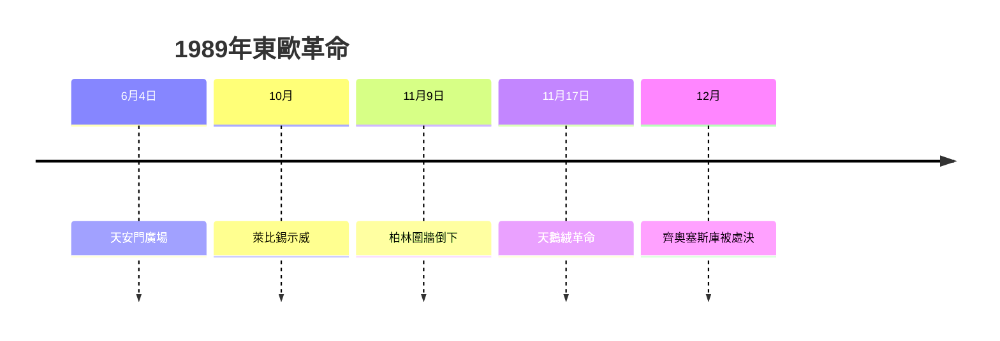
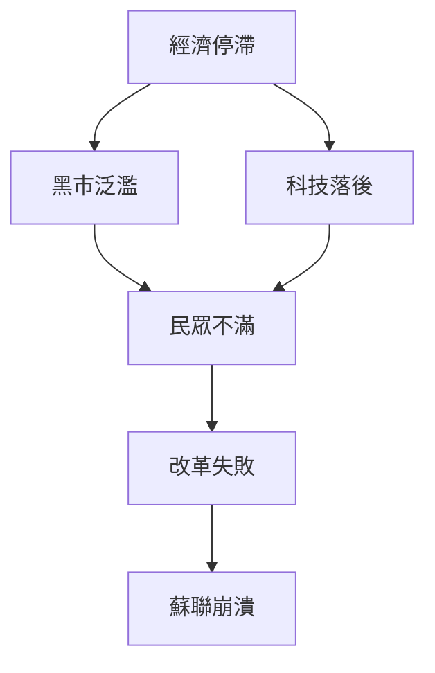
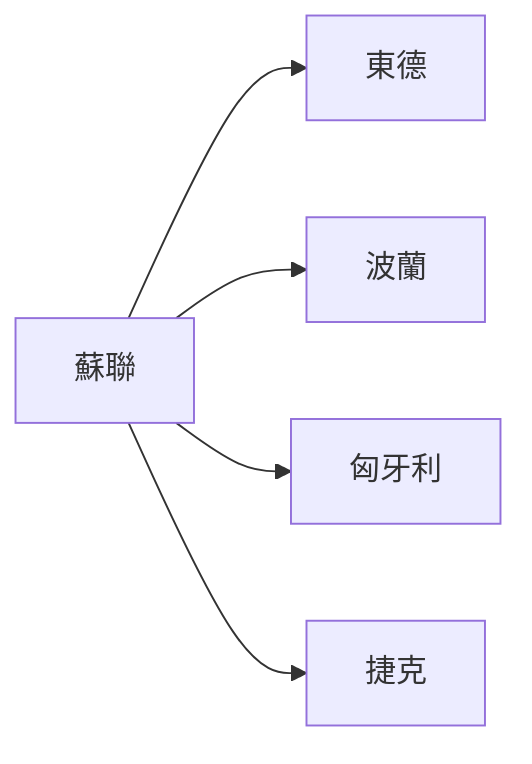
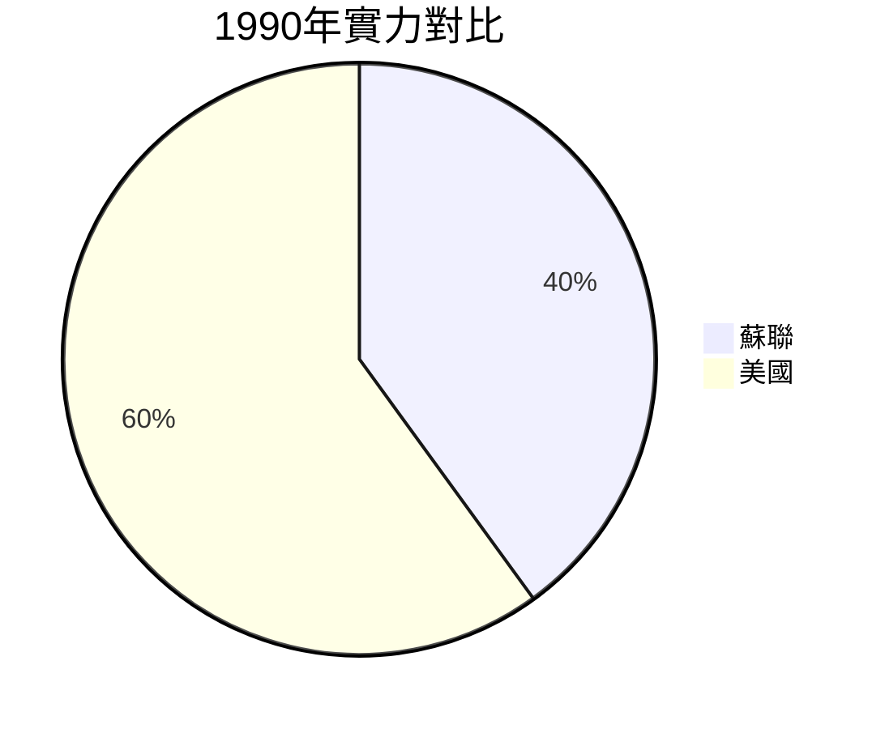
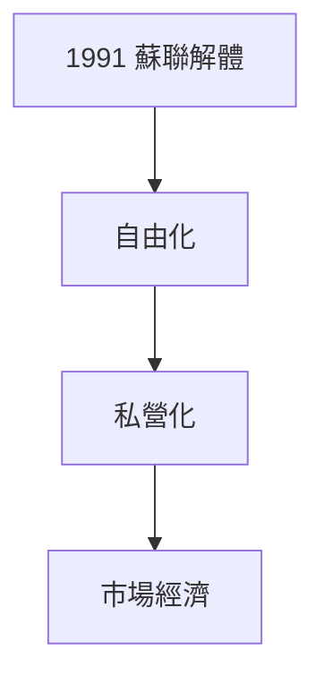

# HIST2152 晚期社會主義 / Late Socialism and the 1989 Revolutions (6 credits)

**Instructor**: Oscar Sanchez-Sibony
**Department**: History, HKU  
**Official source**: [HKU History Course Description 2024-25](https://history.hku.hk/wp-content/uploads/2024/07/HIST-2425.pdf)
**Style**: 袁騰飛式 — 犀利、聚焦社會主義世界點解崩潰

---

## 問題 1：這個領域所有專家共享的 5 個核心心智模型

### 心智模型 1：晚期社會主義文化轉向
學者 **Katherine Hagedorn** (*Anthology of Soviet Music*) 研究：1960s 後蘇聯文化轉向——「解凍」(Khrushchev Thaw) 之後，個人主義、消費文化開始挑戰集體主義話語。

學者 **Susan Corbridge** 研究：戈巴契夫「新思維」(Glasnost, Perestroika) 揭示晚期社會主義制度危機。

### 心智模型 2：1989 年革命作爲結構危機
學者 **Mark Kramer** 研究：東歐 1989 年革命唔係單一事件，而係經濟停滯、制度僵化、意識形態破產多重危機爆發。

學者 **Gale Stokes** 分析：1989 年東歐劇變揭示極權制度脆弱性——一旦容許公開討論，整個系統快速崩解。

- 1985 戈巴契夫「新思維」改革
- 1989 柏林圍牆倒下
- 1991 蘇聯解體

### 心智模型 3：黑市、腐敗與社會主義經濟危機
學者 **Alison Kide** 研究：社會主義經濟低效導致黑市泛濫——官方經濟以外，存在龐大地下經濟。

學者 **Padma Desai** 分析：蘇聯經濟結構性問題——重工業優先、輕工業落後、消費品短缺。

### 心智模型 4：冷戰結束與美國單極時刻
學者 **John Lewis Gaddis** 研究：1989-1991 年冷戰突然結束——美國成為唯一超級大國。

學者 **Odd Arne Westad** 提醒：單極時刻帶嚟美國帝國主義過度擴張——呢個為 2001 年後危機埋下伏筆。

### 心智模型 5：後社會主義轉型代價
學者 **Michael D. S. Drake** 研究：後社會主義轉型造成大規模失業、貧富分化、預期壽命下降——「轉型正義」問題至今未解決。

學者 **Sheila Fitzpatrick** 分析：俄羅斯「震撼治療」(Shock Therapy) 導致 1990s 經濟崩潰。

---

## 問題 2：3 個根本分歧

### 分歧 1：1989 年革命——人民起義定精英交易？
- **A 方**：群眾起義
  - 柏林、布達佩斯、布拉格群眾上街
  - 基層運動
- **B 方**：精英交易
  - Helmut Kohl, Gorbachev 秘密談判
  - 快速過渡談判

### 分歧 2：蘇聯崩潰——改革失敗定歷史必然？
- **A 方**：改革失敗
  - 戈巴契夫改革太慢太遲
  - 經濟改革失敗
- **B 方**：歷史必然
  - 計劃經濟結構性缺陷
  - 科技落後

### 分歧 3：後社會主義轉型——成功定失敗？
- **A 方**：成功
  - 波蘭、捷克成功民主化
  - 經濟恢復增長
- **B 方**：失敗
  - 俄羅斯轉型代價慘重
  - 腐敗、貧富懸殊

---

## 問題 3：10 個深度問題

1. 如果戈巴契夫改革成功，蘇聯今日會係點？
2. 點解 1989 年東歐革命以「天鵝絨」進行而蘇聯以暴力？
3. 如果你是歷史學家，點樣研究從未文獻化嘅黑市歷史？
4. 後社會主義轉型代價——平民承受定歷史必要？
5. 點解「共產主義失敗」論述忽略中國成功案例？
6. 如果你去 1985 年莫斯科做田野考察，你會發現乜嘢？
7. 晚期社會主義消費文化——點解西方文化入侵咁容易？
8. 點解今日俄羅斯懷念蘇聯？——真實記憶定政治操作？
9. 如果你是 1991 年俄羅斯普通人，轉型對你生活有乜嘢影響？
10. 社會主義實驗——歷史失敗定另類現代性？

---

## 核心心智模型深化

### 1. 1989 年東歐革命時間線

### 2. 蘇聯崩潰原因

---

## 5 個 Mermaid 圖解

### 📊 Diagram 1: 冷戰時期東歐

### 📊 Diagram 2: 1989 年革命擴散

### 📊 Diagram 3: 蘇聯與美國實力對比

### 📊 Diagram 4: 後社會主義轉型

### 📊 Diagram 5: 俄羅斯懷念蘇聯

---

## 總結

1. 晚期社會主義揭示計劃經濟結構性危機
2. 1989 年革命係多重危機爆發
3. 後社會主義轉型代價慘重
4. 冷戰結束帶嚟美國單極霸權
5. 社會主義實驗教訓仍然 relevant

**最後問題**: 如果你去 1989 年做東歐普通人，你會點選擇？

---
**版權所有 © HKU History Self-Study**
