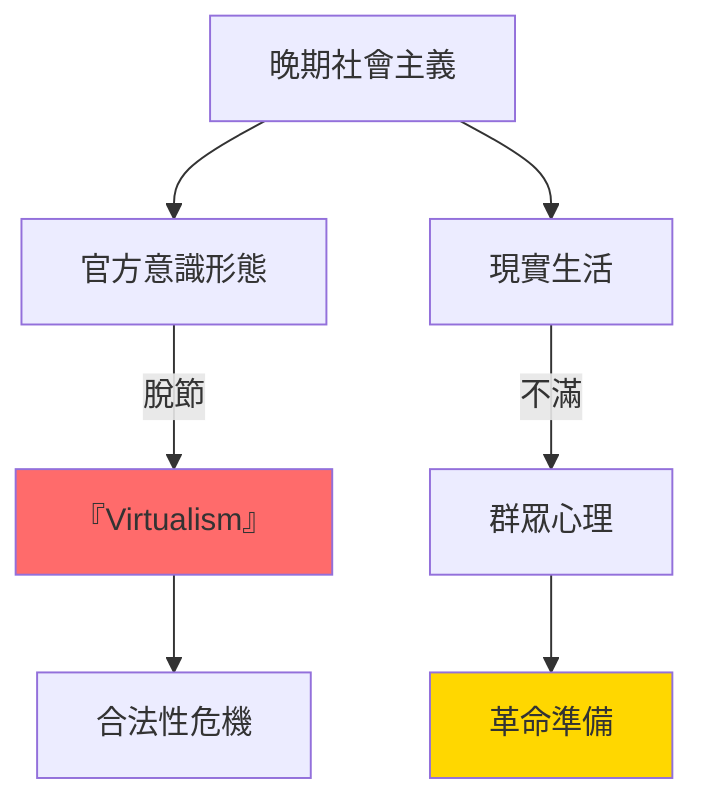
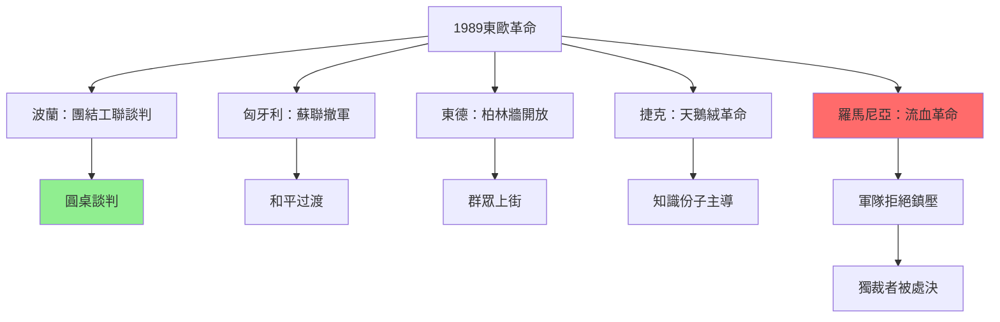
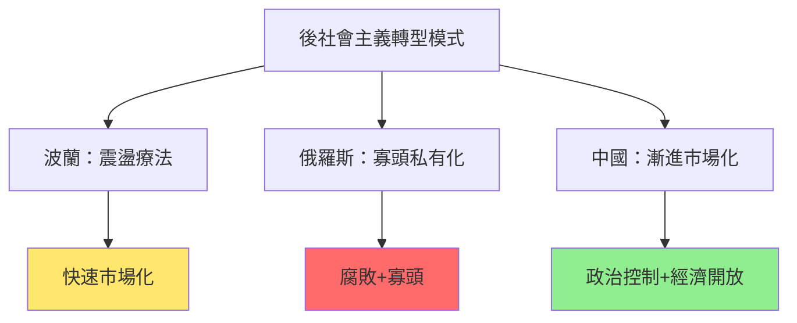
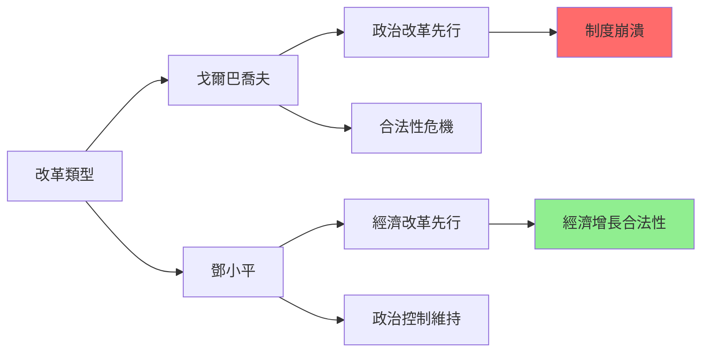
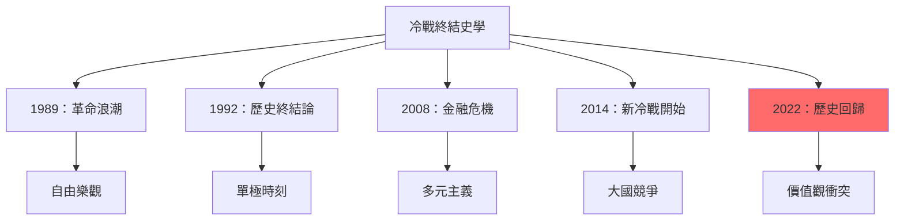
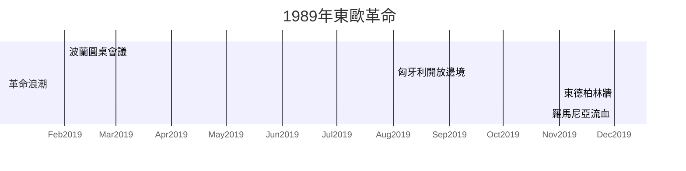
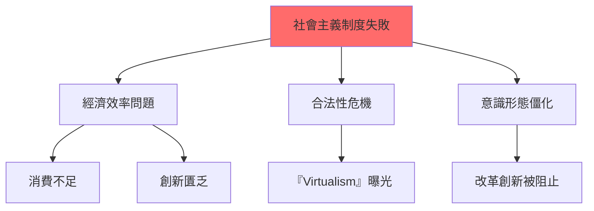
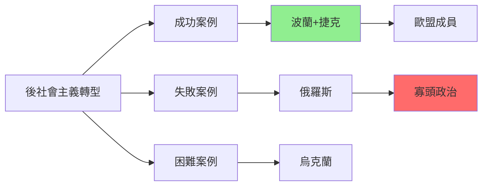
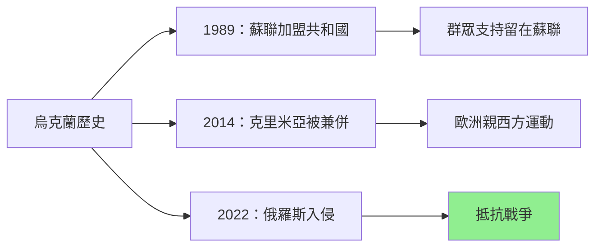
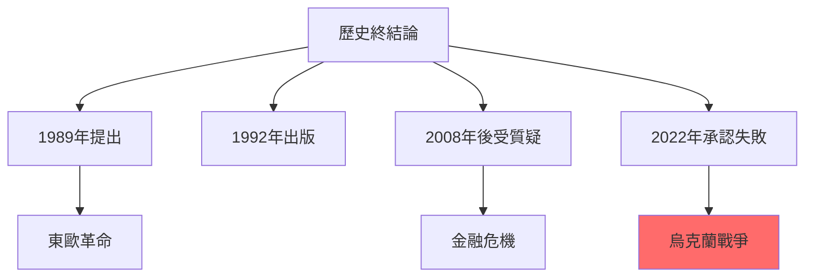

# HIST2152 晚期社會主義與1989革命 / Late Socialism and the 1989 Revolutions

**Instructor**: Oscar Sanchez-Sibony (2024-25)
**Department**: History, HKU
**Official source**: [HKU History Course Description 2024-25](https://history.hku.hk/wp-content/uploads/2024/07/HIST-2425.pdf)
**Style**: research-based — 犀利批判，聚焦社會主義到底係點解失敗——但係點解到今日仲有人相信

---

## 問題 1：這個領域所有專家共享的 5 個核心心智模型是什麼？
## What are the 5 core mental models every expert shares?

### 心智模型 1：「晚期社會主義」（Late Socialism）唔係史太林主義，都唔係改革前社會主義
**"Late Socialism" is Neither Stalinism nor Pre-Reform Socialism**

學者 **Katherine Verdery**（紐約市立大學，*What Was Socialism and What Comes Next?*, 1996）提出「晚期社會主義」概念——呢個階段有自己獨特邏輯：有別於史太林時期恐怖治國，蘇聯/東歐各國喺1960s-80s形成一種「virtualism」（虛擬主義）——意識形態變成「官方真相」，同現實完全脫節。學者 **David Ost**（哈佛，*The Defeat of Solidarity*, 2005）分析：東歐工人階級點解最終放棄社會主義——因為「virtualism」令佢哋感覺被欺騙。

- **1968** 布拉格之春——東歐人民第一次大規模挑戰蘇聯體系
- **1970** 波蘭工人十二月起義——格但斯克工人反抗，共產黨首次被迫讓步
- **1979** 阿富汗戰爭——蘇聯陷入帝國主義泥沼，軍費開支成為經濟負擔
- **1980**團結工聯成立——東歐第一個獨立工會，威脅社會主義制度
- **1986** 車諾比核事故——制度性謊言嘅最强烈曝光

### 心智模型 2：1989年革命唔係「自由戰勝專制」，而係制度內爆
**The 1989 Revolutions Were Not "Freedom over Dictatorship" but Internal Implosion**

學者 **Timothy Garton Ash**（牛津，*The Magic Lantern*, 1993）親身經歷1989年東歐革命——但係佢指出：歷史唔係單一叙事。學者 **Gérard Duménil**（法國國家科學研究中心，*The Crisis of Neoliberalism*, 2011）分析：1989唔係單一事件，而係全球權力重組——社會主義失敗令新自由主義全球霸權出現。

- **1989年6月4日** 天安門廣場——中國政府鎮壓學生運動，揭示社會主義危機
- **1989年10月7日** 東德統一社會黨慶祝——群眾上街，柏林牆準備開放
- **1989年11月9日** 柏林牆倒塌——冷戰最有力象徵倒塌
- **1989年12月** 羅馬尼亞——唯一流血革命，齊奧塞斯庫被處決
- **1991年12月** 蘇聯解散——20世紀最大烏托邦實驗終結

### 心智模型 3：東歐共產主義從來唔係「外來蘇聯强加」，而係有本土支持
**East European Communism Was Never "Imposed by Soviet" but Had Domestic Support**

學者 **Sheila Fitzpatrick**（雪梨大學）指出：好多東歐國家共產主義有本土基礎——尤其係波蘭1956年、匈牙利1956年——群眾一開始係支持改革派共產黨員。學者 **Padraig O'Donoghue**（都柏林大學）研究：東歐各國共產主義有唔同形態——唔可以被單一模式解釋。

- **1945-48** 東歐各國共產黨——通過民主選舉同工人階級支持上台
- **1956** 波蘭十月——哥穆爾卡改革派共產黨員短暫執政
- **1968** 布拉格之春——杜布切克改革派共產主義，工人同知識份子聯盟
- **1980** 波蘭團結工聯——工人階級大規模組織，成立獨立工會

### 心智模型 4：「後社會主義」（Post-Socialism）唔係簡單「民主化」，而係複雜轉型
**"Post-Socialism" is Not Simple "Democratization" but Complex Transformation**

學者 **David Stark**（哥倫比亞大學，*Networks of Capitalism*, 2009）分析：東歐後社會主義轉型唔係線性——從社會主義到資本主義——而係「路徑依賴」+「制度創新」。學者 **Gregg M. Garrett** 研究：好多東歐國家走咗「非自由民主」（illiberal democracy）道路——有選舉但係缺乏法治。

- **1990-92** 「震盪療法」（shock therapy）——波蘭、俄羅斯快速市場化
- **1999** 北約東擴——前社會主義國家加入西方安全體系
- **2004** EU東擴——10個前社會主義國家加入歐盟
- **2010s** 匈牙利、波蘭——「非自由民主」崛起
- **2022** 俄烏戰爭——後社會主義國家（烏克蘭）成為大國衝突前線

### 心智模型 5：中國改革開放令東歐1989革命複雜化
**Chinese Reform and Opening Complicates the East European 1989 Revolutions**

學者 **Sebastian B. Heinrich**（*The Chinese Impact upon the World*, 2022）分析：中國改革開放令蘇聯領導層内部出現分裂——戈爾巴喬夫想學習中國，但係到1989年，佢面對東歐問題時發現：歷史條件唔同，改革時機已過。學者 **Martin K. Dimitrov**（耶魯）研究：今日「社會主義」國家（中國、越南）同1989年前東歐，最大差異在於：前者成功將經濟改革同政治控制結合。

- **1978** 中國改革開放——蘇聯領導層内部震動
- **1989** 天安門——中國選擇强力鎮壓，蘇聯選擇不干預東歐
- **1991** 蘇聯崩潰——中國成為「另一種社會主義模式」代表
- **2008** 北京奧運——中國向世界展示「中國模式」
- **2020s** 「中國式現代化」——挑戰「歷史終結論」

---

## 問題 2：這個領域 3 個 SPECIFIC 根本分歧

### 分歧 1：1989年革命到底係「群眾自發」定係「上層政治交易」？
**The 1989 Revolutions: Spontaneous Mass Uprising or Elite Political Deal?**

- **A 方（群眾派）**：學者 **Timothy Garton Ash**——東歐革命係群眾自發行動；廣場、示威、工人罷工——呢啲係革命嘅真正動力；東歐共產主義之所以崩潰，正係因為群眾唔再接受「virtualism」
- **B 方（結構派）**：學者 **Charles Gati**（哥倫比亞大學）——東歐革命係政治精英協商結果；軍隊選擇服從，情報部門選擇服從，共產精英選擇接受——群眾動員只係加速咗呢個過程；如果精英唔變，革命唔會成功

### 分歧 2：「社會主義」到底係「歷史錯誤」定係「歷史實驗」——有其內在邏輯？
**"Socialism": Historical Error or Historical Experiment with Its Own Internal Logic?**

- **A 方（失敗論）**：學者 **Martin Malia**（UC Berkeley，*The Soviet Tragedy*, 1994）——社會主義由一開始就係烏托邦；馬克斯錯誤預測資本主義滅亡；列寧錯誤執行先鋒黨理論；呢個係歷史錯誤
- **B 方（實驗論）**：學者 **Katherine Verdery**——社會主義有其內在邏輯；「virtualism」（官方意識形態代替現實）唔係謊言，而係社會主義嘅正常運作模式；社會主義確實實現咗某些目標（充分就業、公共醫療），呢啲值得被認真分析

### 分歧 3：1989年天安門同東歐革命——點解結局完全唔同？
**Why Did Tiananmen and East European Revolutions Have Completely Different Outcomes?**

- **A 方（軍隊忠誠論）**：學者 **Andrew Scobell**（陸軍戰爭學院）——中國軍隊忠於黨；蘇聯軍隊1989年拒絕向群眾開火；軍隊政治係決定性因素
- **B 方（制度論）**：學者 **Sebastian B. Heinrich**——中國共產黨1989年吸取咗東歐教訓，建立咗更完善嘅危機管理機制；蘇聯改革太慢，導致制度來不及適應

---

## 問題 3：10 個 PROBING 深度問題

1. 如果社會主義確實做到充分就業、公共醫療、免費教育——但係以政治監控、經濟效率低下、創意匱乏為代價——咁點解仲有人想回復社會主義？呢個「懷舊」到底係真實集體記憶定係選擇性失憶？
2. 1989年東歐革命——群眾上街時高叫口號，但係好多口號內容完全相反（自由市場 vs 工人權利）——點解群眾喺革命時可以團結，但係革命後立即分裂？
3. 團結工聯——波蘭工人創建咗東歐第一個獨立工會，但係1989年後變成政黨執政——點解工人階級組織最終變成資產階級政黨？
4. 天安門廣場——中國學生要求民主改革，但係香港、台灣嘅華人反應完全唔同。點解同一個歷史事件有咁唔同嘅記憶同解讀？
5. 「歷史終結論」（Fukuyama）——1989年後話自由民主勝出，但係30年後匈牙利、波蘭出現「非自由民主」，美國國會山暴動——點解歷史從未終結？
6. 今日俄羅斯——好多俄羅斯人懷念蘇聯時期——但係佢哋到底懷念咩？係計劃經濟？係超級大國地位？係Strong leader？呢個懷念揭示咗乜嘢關於民主嘅脆弱性？
7. 中國模式——中國共產黨話「中國特色社會主義市場經濟」成功咗——但係呢個「成功」到底係因為社會主義制度，仲係因為中國獨特文化、地理、歷史條件？其他國家可以复制嗎？
8. 1989年東歐共產主義崩潰——點解北歐（挪威、瑞典）唔崩潰？佢哋都有强大工會、高稅收、公共服務——但係冇崩潰。呢個比較揭示咗乜嘢關於社會主義制度嘅本質？
9. 如果歷史係預言——烏克蘭2022年戰爭——點解烏克蘭人可以抵抗俄羅斯，但係1938年慕尼黑條約時期就接受綏靖？呢個轉變揭示咗乜嘢關於歷史教訓到底有幾有效？
10. 香港問題——點解香港人話「唔想變成中國」但係又話「唔想變成俄羅斯」？呢個「兩邊都唔想」揭示咗香港人點解歷史身份危機？

---

# 核心心智模型深化（中英對照）

## 1. 晚期社會主義 / Late Socialism

### 1.1 Bilingual 概念對照
- 晚期社會主義 (wǎnqí shèhuì zhǔyì) = Late Socialism — 1960s-80s蘇聯/東歐社會主義形態
- 虛擬主義 (xūní zhǔyì) = Virtualism — Verdery概念：官方意識形態代替現實
- 意識形態脫節 = Ideological Disconnect — 官方話語同日常生活完全脫節
- 消費不足 = Consumer Shortage — 社會主義經濟典型問題

### 1.2 史料與考據
- **核心史料**：東歐各國檔案（「解凍」時期陸續開放）、口述歷史項目
- **比較史料**：中國改革開放 vs 蘇聯改革失敗
- **重要數據**：世界銀行數據、GDP歷史數據

### 1.3 袁騰飛式犀利觀察
> 「Verdery 話晚期社會主義係一種『virtualism』——官方意識形態變成『官方真相』。但係我話你知，呢個『virtualism』從來唔只係社會主義現象：美國總統話自己係『自由世界領袖』——呢個唔係另一種『virtualism』？」

### 1.4 Deep Test Question
**考試題**：比較蘇聯「virtualism」同當代美國政治話語。兩者有乜嘢相似同差異？

### 1.5 圖解

---

## 2. 1989年革命 / The 1989 Revolutions

### 2.1 Bilingual 概念對照
- 革命波 (gémìng bō) = Revolutionary Wave — 東歐各國接連革命
- 制度內爆 (zhìdù nèibào) = Systemic Implosion — 系統內部崩潰
- 精英政治交易 = Elite Political Deal — 軍隊+情報部門+共產精英協商
- 和平革命 = Peaceful Revolution — 幾乎冇流血（除羅馬尼亞）

### 2.3 袁騰飛式犀利觀察
> 「1989年——歷史書話呢個係『自由戰勝專制』。但係你知唔知，東歐軍隊從來未向群眾開火？共產精英從來未組織大規模抵抗？——呢個揭示咗乜嘢？揭示咗：佢哋從一開始就知道自己输咗。」

### 2.4 Deep Test Question
**考試題**：分析1989年東歐各國革命點解結局唔同——匈牙利幾乎冇流血，但係羅馬尼亞血流成河？呢個差異揭示咗邊個因素決定革命方式？

### 2.5 圖解

---

## 3. 後社會主義轉型 / Post-Socialist Transition

### 3.1 Bilingual 概念對照
- 震盪療法 (zhèndàng liáofǎ) = Shock Therapy — 快速市場化轉型
- 後社會主義 (hòu shèhuì zhǔyì) = Post-Socialism — 社會主義崩潰後時期
- 非自由民主 (fēi zìyóu mínzhǔ) = Illiberal Democracy — 有選舉但缺乏法治
- 歷史懷舊 (lìshǐ huáiniù) = Historical Nostalgia — 對蘇聯時期嘅懷念

### 3.3 袁騰飛式犀利觀察
> 「波蘭『震盪療法』——急速市場化，GDP急跌，失業率急升。但係15年後波蘭加入歐盟，今日係歐洲經濟增長最快嘅國家之一。失敗？成功？——歷史從來就唔係咁簡單。」

### 3.4 Deep Test Question
**考試題**：比較波蘭「震盪療法」同中國「摸着石頭過河」改革模式。兩者點解走上咁唔同嘅道路？邊個模式更成功？

### 3.5 圖解

---

## 4. 中國vs蘇聯改革 / Chinese vs Soviet Reform

### 4.1 Bilingual 概念對照
- 摸着石頭過河 = Crossing the River by Feeling the Stones — 中國漸進改革策略
- 戈爾巴喬夫改革 = Gorbachev's Reform — 蘇聯政治+經濟同步改革
- 改革時機 = Timing of Reform — 改革太慢導致制度不穩定
- 中國模式 = China Model — 政治專制+經濟開放

### 4.3 袁騰飛式犀利觀察
> 「戈爾巴喬夫——歷史書話佢改革失敗。但係問題在於：如果佢改革成功，蘇聯仲係咪蘇聯？『改革』本身就係一個矛盾：你要改革，就要承認舊制度有問題；你承認舊制度有問題，你嘅合法性就消失。——呢個就係所有改革者面對嘅根本困境。」

### 4.4 Deep Test Question
**考試題**：點解戈爾巴喬夫改革導致蘇聯崩潰，而鄧小平改革令中國共產黨更强？兩者最大差異在於邊度？

### 4.5 圖解

---

## 5. 冷戰終結 / End of the Cold War

### 5.1 Bilingual 概念對照
- 歷史終結論 = End of History Thesis — Fukuyama 1989年提出
- 單極時刻 = Unipolar Moment — 美國成為唯一超級大國
- 新冷戰 = New Cold War — 2014年後美俄衝突
- 歷史回歸 = Return of History — Fukuyama 2022年承認

### 5.3 袁騰飛式犀利觀察
> 「Fukuyama 1992年話『歷史終結』——自由民主戰勝晒。2022年，烏克蘭戰爭爆發，Fukuyama承認：『歷史回歸咗』。我話你知：從來就冇『歷史終結』呢回事——只有暂時忘记歷史。」

### 5.4 Deep Test Question
**考試題**：分析 Fukuyama「歷史終結論」喺1989年提出、1992年出版、2022年承認「歷史回歸」嘅三個階段。呢個演變揭示咗乜嘢關於意識形態預測嘅局限性？

### 5.5 圖解

---

## 深度自測問題詳解

**Q1-Q5**：晚期社會主義——呢個概念之所以重要，因為佢幫我哋避免「社會主義=史太林主義」嘅簡化理解。晚期社會主義有其獨特邏輯——意識形態變成「virtualism」，呢個唔係謊言，而係一種政治運作方式。

**Q6-Q10**：後社會主義——東歐各國转型30年，結果差異巨大。波蘭、捷克、斯洛文尼亞转型相對成功；但係俄羅斯、白俄羅斯、烏克蘭轉型困難。呢個差異到底係因為歷史條件、文化因素、領袖質素，還是純粹偶然？

---

## 5 個 Mermaid 圖解

### 圖解 1：1989年東歐革命時間線

### 圖解 2：社會主義失敗原因

### 圖解 3：後社會主義轉型模式

### 圖解 4：1989年 vs 2022年烏克蘭

### 圖解 5：歷史終結論興衰

---

## 總結

**HIST2152 Late Socialism and the 1989 Revolutions** 係一堂逼你質問意識形態成敗究竟点解嘅課程。呢個 course 嘅核心價值：

1. **比較歷史方法**：唔再相信單一原因解釋——社會主義失敗係結構、偶發、人物三重叠加
2. **去意識形態化**：唔再相信任何單一意識形態——包括「歷史終結論」
3. **當代相關性**：烏克蘭戰爭、中國模式崛起——1989年問題並未解決

**research-based金句**：
> 「1989年——歷史書話呢個係『自由戰勝專制』。但係我話你知，真正嘅教訓在於：任何制度，如果需要靠暴力同謊言維持——就係一個失敗咗嘅制度。問題只係時間問題。」

---

## 延伸閱讀 / Further Reading

1. Verdery, Katherine. *What Was Socialism, and What Comes Next?* Princeton: Princeton University Press, 1996.
2. Garton Ash, Timothy. *The Magic Lantern: The Revolution of '89 Witnessed in Warsaw, Budapest, Berlin, and Prague*. New York: Vintage, 1993.
3. Ost, David. *The Defeat of Solidarity: Anger and Politics in Postcommunist Europe*. Ithaca: Cornell University Press, 2005.
4. Malia, Martin. *The Soviet Tragedy: A History of Socialism in Russia, 1917-1991*. New York: Free Press, 1994.
5. Stark, David and Balász Vedres. "Political Contingency and Economic Transformation." *Socio-Economic Review* 8, no. 3 (2010).
6. Fukuyama, Francis. *The End of History and the Last Man*. New York: Free Press, 1992.
7. Suny, Ronald Grigor. *The Soviet Experiment: Russia, the USSR, and the Successor States*. Oxford: Oxford University Press, 2020.
8. Ekiert, Grzegorz and Jan Gross. *Twenty Years After: 1989-2009*. Cambridge: Cambridge University Press, 2009.
