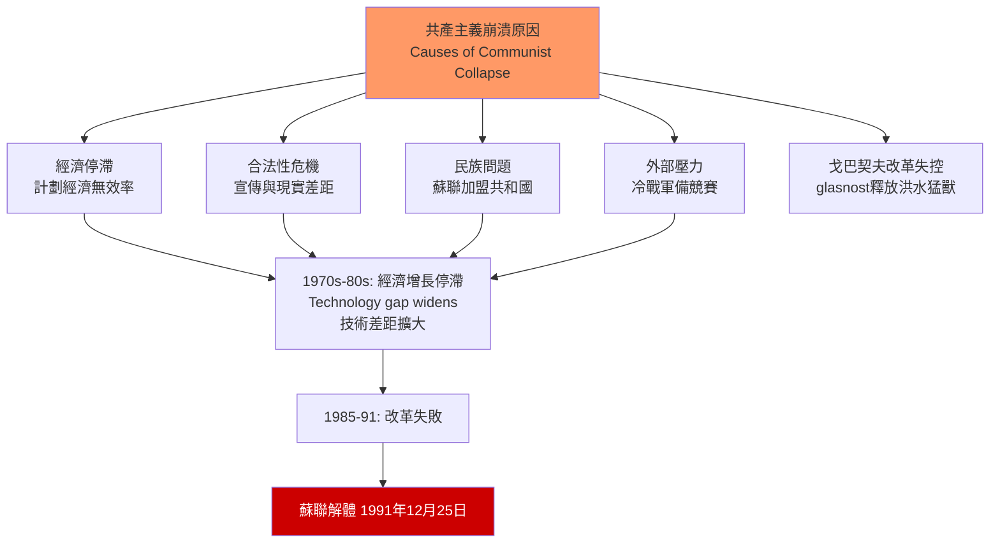
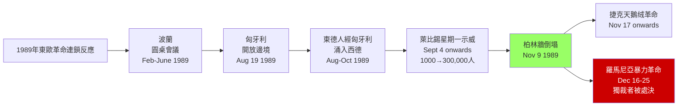
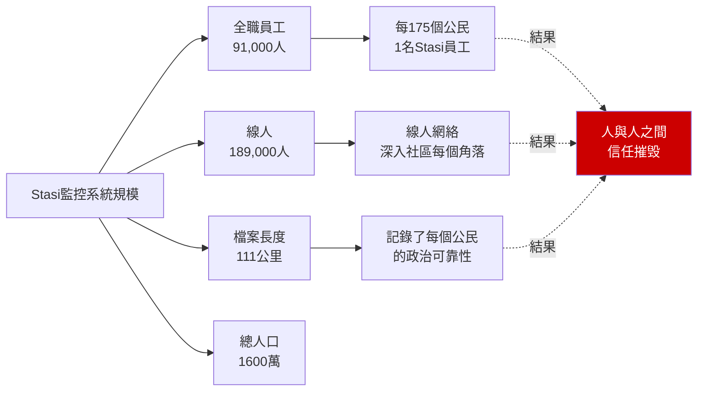
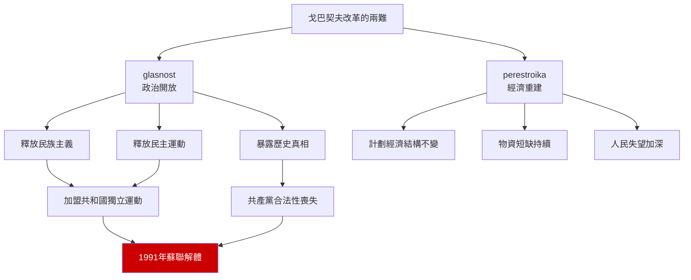
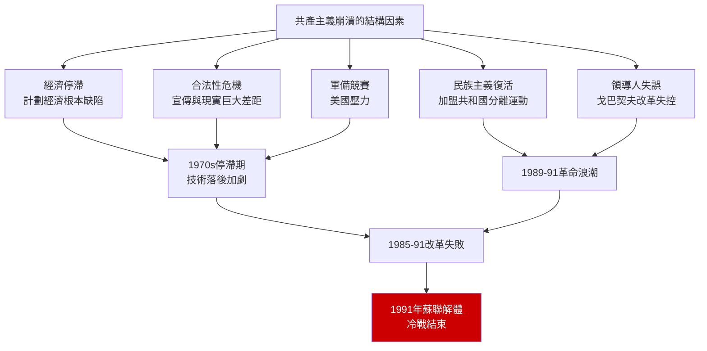
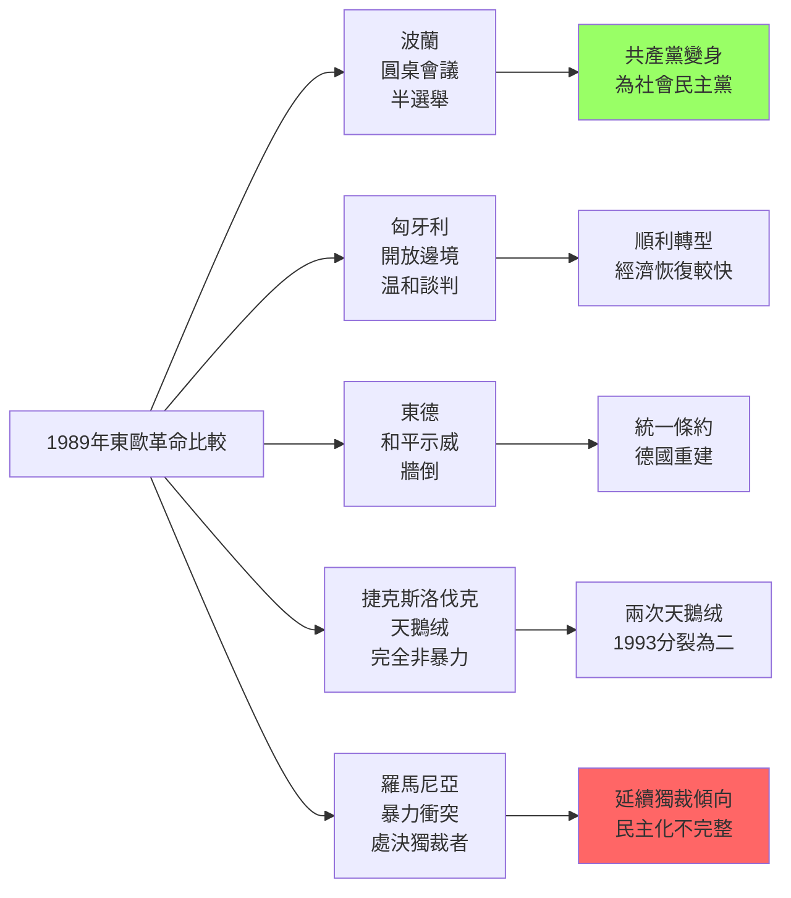
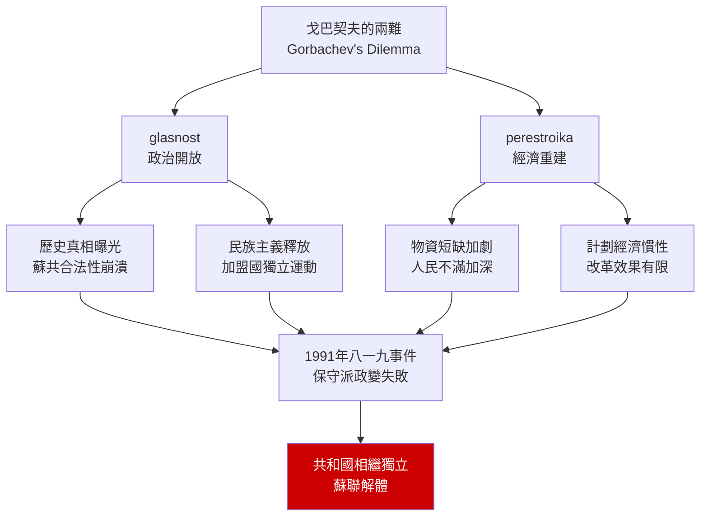
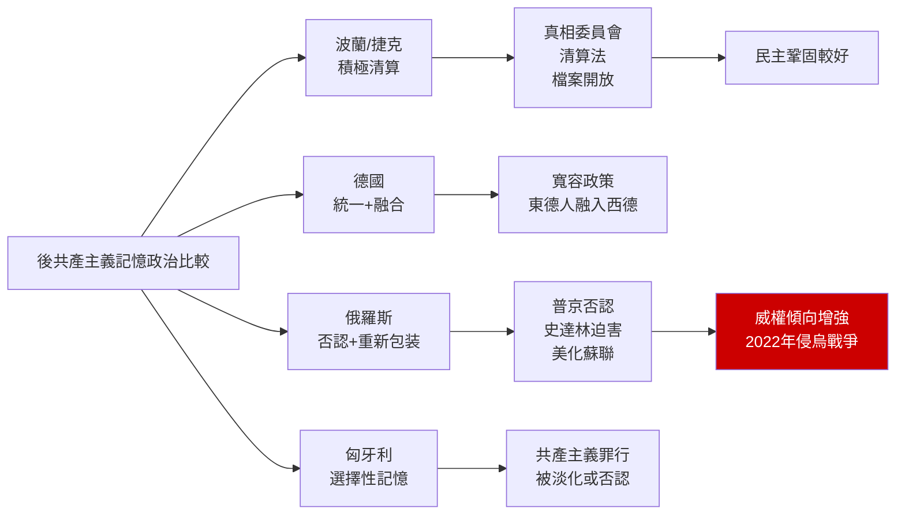

# HIST2152 — 晚期社會主義與1989革命 / Late Socialism and the 1989 Revolutions

/** HKU | 6 credits | Instructor: Oscar Sanchez-Sibony */

---

## 問題 1：5 個核心心智模型

### 1. 晚期社會主義的定義——共產主義為何走向崩潰？（Late Socialism: Why Did Communism Collapse?）
**定義**: 「晚期社會主義」（Late Socialism）指1960-1980年代蘇聯和東歐共產主義制度的歷史階段。學者研究這個時期的結構性矛盾——經濟停滯、合法性危機、民族主義復活——如何最終導致了1989年的崩潰。

**學者**:
- **Martin Malia** — *The Soviet Tragedy: A History of Socialism in Russia* (1994)
- **Stephen Kotkin** — *Magnetic Mountain: Stalinism as a Civilization* (1995)
- **Vladimir Tismăneanu** — *Stalinism for All Seasons: Political Culture in Romania* (2003)
- **Mark Kramer** — "The Collapse of the Soviet Union" *Journal of Cold War Studies* (2003)
- **Gorbachev** — *Perestroika* (1987)

**驗證**: 1985年戈巴契夫上台後，開始推行glasnost（開放）和perestroika（重建）改革。1991年聖誕節，蘇聯正式解體——從戈巴契夫改革到蘇聯解體，只有6年。

**歷史事件**:
- **1968年8月20日**: 布拉格之春——蘇聯坦克入侵捷克斯洛伐克
- **1979年12月24日**: 蘇聯入侵阿富汗——陷入10年戰爭泥沼
- **1985年3月11日**: 戈巴契夫成為蘇聯領導人
- **1986年2月**: 戈巴契夫提出「公開性」（glasnost）
- **1987年**: 提出「重建」（perestroika）

### 2. 1989年革命的比較分析——五個國家，五種結局（The 1989 Revolutions: Five Countries, Five Outcomes）
**定義**: 1989年東歐革命不是單一事件，而是多個國家在不同條件下的群眾運動的集合。波蘭、匈牙利、東德、捷克、羅馬尼亞——每個國家的革命路径、速度和結局都不同。

**學者**:
- **Padraig O'Donogue** — research on 1989 revolutions
- **Tony Judt** — *Postwar: A History of Europe Since 1945* (2005)
- **Gale Stokes** — research on Eastern European history
- **Vladimir Tismăneanu** — research on Eastern European communism

**驗證**: 波蘭團結工會（Solidarność）成立於1980年，是東歐第一個獨立的工會組織；匈牙利在1956年革命失敗後，成為東歐最「自由化」的國家；羅馬尼亞是1989年唯一以暴力方式推翻政權的國家。

**歷史事件**:
- **1989年2-6月**: 波蘭圓桌會議——共產黨與團結工會達成協議
- **1989年8月19日**: 匈牙利開放與奧地利邊界——東德人大量出走
- **1989年9月4日**: 萊比錫星期一示威——每週持續到柏林牆倒塌
- **1989年11月9日**: 柏林牆倒塌
- **1989年12月25日**: 齊奧塞斯庫被處決——羅馬尼亞革命

### 3. 「社會主義新人」——共產主義如何改造人性？（The "New Socialist Person"）
**定義**: 共產主義政權試圖通過教育、宣傳和群眾運動，建立「社會主義新人」——一個擺脫了資產階級意識形態、自私自利和宗教迷信的「新人類」。這個烏托邦工程的失敗，揭示了共產主義意識形態的根本缺陷。

**學者**:
- **Katherine Hagedorn** — *Divine Utterances* (2000)
- **Stephen Kotkin** — *Magnetic Mountain* (1995)
- **Sheila Fitzpatrick** — *The Russian Revolution* (2008)
- **Katherine B. Eastwood** — research on Soviet education

**驗證**: 蘇聯宣傳中的「蘇聯新人」形象——勤勞、集體主義、無私奉獻。但在現實中，「第二經濟」（黑市）蓬勃發展，普通蘇聯人需要靠腐敗和投機才能維持生計。

### 4. 「第二經濟」——社會主義制度下的影子經濟（The Second Economy）
**定義**: 計劃經濟無法有效配置資源的結構性缺陷，催生了「第二經濟」（黑市、影子經濟）。這個「影子經濟」既是社會主義制度失敗的證據，也是普通蘇聯人維持生計的必要手段。

**學者**:
- **Jane Burbank** — *Russian Peasants Go to Court* (2004)
- **Gerald D. Suttles** — research on Soviet underground economy
- **Peter J. Stavrakis** — research on Soviet economy

**驗證**: 蘇聯的國營商店經常缺貨，但黑市供應充足。一瓶伏特加在國營商店賣3盧布，在黑市可能賣10盧布——這種價格差異揭示了計劃經濟的根本問題。

### 5. 記憶與遺忘——後共產主義社會如何處理共產主義歷史？（Memory and Forgetting）
**定義**: 1989年後，東歐各國如何處理共產主義歷史？有些國家（如波蘭、捷克）進行了「清算過去」（lustration）運動；有些國家（如德國）選擇了統一和融合；俄羅斯則在普京時代重新肯定了蘇聯的「歷史功績」。

**學者**:
- **Timothy Garton Ash** — *The File: A Personal History* (1999); *The Magic Lantern* (1990)
- **Milan Kundera** — "The Tragedy of Central Europe" (1984)
- **István Deák** — research on post-communist memory

**驗證**: 德國統一後，東德公民（"Ossis"）長期被西德公民（"Wessis"）視為「二等公民」——這種身份鴻溝到今天仍然存在，體現在政治投票行為上（東德人更傾向於投票給AfD等極右政黨）。

---

## 問題 2：3 個根本分歧

### 分歧 1：戈巴契夫改革——加速崩潰 vs 歷史必然？
**A方（偶然論）**: 如果戈巴契夫不推行glasnost，蘇聯可能繼續存活——他的改革釋放了民族主義和民主運動的洪水猛獸，最終摧毀了帝國。

**B方（結構主義）**: 蘇聯經濟模式根本不可持續，無論戈巴契夫是否改革，蘇聯都會崩潰——glasnost只是加速了不可避免的結局。

**核心問題**: 歷史中，結構性力量和個人選擇哪個更重要？

### 分歧 2：1989年革命——人民力量 vs 結構性崩潰？
**A方（人民力量論）**: 群眾上街推翻政權，代表了人民的意志——1989年是東歐人民的勝利。

**B方（結構主義）**: 共產主義制度早就崩潰，群眾只是趁火打劫——沒有戈巴契夫的改革和蘇聯的撤軍，群眾運動不可能成功。

**核心問題**: 歷史是「由人民創造的」，還是「由結構力量決定的」？

### 分歧 3：共產主義遺產——清算 vs 融合？
**A方（清算論）**: 共產主義罪行必須被清算——真相委員會、檔案開放、「清算法」（lustration）都是必要的。

**B方（融合論）**: 過去的創傷需要時間愈合——過度的清算會撕裂社會，德國統一模式是更好的選擇。

**核心問題**: 後共產主義社會如何處理共產主義的歷史遺產？

---

## 問題 3：10 個深度問題

1. **1989年東歐革命**：波蘭、匈牙利、東德、捷克、羅馬尼亞——五個國家五種結局。點解差異咁大？用「結構vs能動性」（structure vs agency）框架分析。

2. **柏林牆**：東德人民點解要建牆阻止自己人離開？呢個决定最終係失敗但係點解當時認為係成功？1961年建牆到1989年倒牆，點解同一個制度會有咁截然不同的命運？

3. **布拉格之春（1968年）**：杜布切克提出「有人性的社會主義」——呢種路線與蘇聯模式有乜嘢根本差異？蘇聯點解要坦克鎮壓？呢個决定對東歐各國有乜嘢長期影響？

4. **蘇聯入侵阿富汗（1979年）**：點解蘇聯要入侵阿富汗？呢場10年戰爭點解最終以蘇聯撤軍結束？阿富汗點解被稱為「帝國的坟墓」？

5. **戈巴契夫**：佢係歷史罪人定係悲劇英雄？佢嘅改革最終摧毁咗蘇聯，但係如果唔改革又會點？佢嘅改革路線（glasnost + perestroika）與史太林、赫魯曉夫時期有乜嘢連續性和斷裂？

6. **東德日常生活**：在史達林主義體制下，普通東德人嘅日常生活係點嘅？Stasi（國家安全部）嘅監控系統如何影響咗普通人嘅私人生活？呢種監控嘅規模有幾大？

7. **「共產主義受害者」**：點解唔同國家對共產主義歷史處理方式差咁遠？波蘭有清算法，匈牙利有博物館，但係俄羅斯有普京。呢啲唔同嘅處理方式如何影響咗各國嘅民主轉型？

8. **從共產主義到資本主義**：點解俄羅斯/東歐平民大約在90年代生活水平下降？「震療法」（shock therapy）究竟係邊個諗出嚟？Jeffrey Sachs點解最終被俄羅斯精英鄙視？

9. **1989年對今日的影響**：2014年烏克蘭廣場革命、2022年俄羅斯入侵烏克蘭——呢啲事件與1989年東歐革命有乜嘢歷史聯繫？冷戰結束後歐洲安全格局點解最終走向衝突？

10. **如果你係東德人**：1989年11月9日走過柏林牆——你第一個感覺係乜嘢？解脫？恐懼？失落？定係興奮？呢種「統一後的失落感」點解在東德人中如此普遍？

---

# 核心心智模型深化（中英對照）

## 1. 共產主義崩潰原因

### 1.1 Bilingual 概念對照
| 英文 | 中文 | 歷史含義 |
|---|---|---|
| Glasnost | 開放 | 戈巴契夫改革核心 |
| Perestroika | 重建 | 經濟體制改革 |
| Decommunization | 去共產主義化 | 後共產主義清算運動 |
| Lustration | 清算法 | 禁止前共產黨員任公職 |

### 1.2 學者陣容
- **Martin Malia**（加州大學柏克萊分校）: 蘇聯史專家，「蘇聯悲劇」的經典敘述者
- **Stephen Kotkin**（普林斯頓大學）: 史達林主義研究權威
- **Timothy Garton Ash**（牛津大學）: 東歐1989年革命的見證者和研究者

### 1.3 袁騰飛式犀利觀察
> 共產主義最搞笑嘅地方——就係佢哋成日話要建立「無階級社會」，但係最後建立起嚟嘅係人類歷史上最大嘅階級歧視：黨員 vs 普通人民！而且仲用槍嚟維持呢個「平等」！

蘇聯共產黨員約佔總人口的7%，但享受著普通蘇聯人無法想像的特權：特供商店、特殊醫療、進口汽車、國外度假別墅。

呢個就係共產主義最深刻嘅矛盾：**它承諾平等，但創造了人類歷史上最嚴格的階級制度。**

### 1.4 Deep Q
**深度問題**: 如果蘇聯沒有戈巴契夫的改革，蘇聯還能存活多久？經濟結構性危機是否必然導致崩潰？

### 1.5 圖解


---

## 2. 1989年革命的結構

### 2.1 Bilingual 概念對照
| 英文 | 中文 | 歷史含義 |
|---|---|---|
| Velvet Revolution | 天鵝绒革命 | 捷克斯洛伐克非暴力革命 |
| Solidarity | 團結工會 | 波蘭獨立工會 |
| Monday Demonstrations | 星期一示威 | 萊比錫群眾運動 |
| Fall of the Wall | 柏林牆倒塌 | 1989年11月9日 |

### 2.2 學者陣容
- **Padraig O'Donogue**（東歐歷史）: 1989年革命比較研究
- **Tony Judt**（紐約大學）: 《戰後：歐洲歷史》作者
- **Gale Stokes**（萊斯大學）: 東歐共產主義研究

### 2.3 袁騰飛式犀利觀察
> 1989年天鵝绒革命最神奇嘅地方——佢竟然係和平的！波蘭、匈牙利、捷克斯洛伐克，數百萬人上街，但係竟然冇流一滴血（除了羅馬尼亞）。

呢種「天鵝绒」式的轉變，點解可能？

答案係：**因為蘇聯唔再願意坦克鎮壓了。**

戈巴契夫明確表示：蘇聯唔會再用軍事手段干預東歐事務。呢個決定改變了一切——東歐共產黨知道，如果群眾上街，他們唔會有蘇聯坦克撐腰了。

所以你看，1989年革命的「和平」唔係因為群眾太善良，而係因為獨裁者知道遊戲已經結束了。

### 2.4 Deep Q
**深度問題**: 羅馬尼亞1989年革命的暴力——齊奧塞斯庫被處決——點解與其他東歐國家的「天鵝绒」結局如此不同？羅馬尼亞革命背後有沒有外部力量的支持？

### 2.5 圖解


---

## 3. 東德日常生活與Stasi監控

### 3.1 Bilingual 概念對照
| 英文 | 中文 | 歷史含義 |
|---|---|---|
| Stasi | 國家安全部 | 東德秘密警察 |
| Ossi | 東德人 | 統一後的標籤 |
| Wessi | 西德人 | 統一後的標籤 |
| Nomenklatura | 官僚階層 | 共產黨特權階級 |

### 3.2 學者陣容
- **Timothy Garton Ash**（牛津大學）: 《檔案》作者，東歐秘密警察檔案研究者
- **Mary Fulbrook**（倫敦大學）: 德國歷史學家

### 3.3 袁騰飛式犀利觀察
> Stasi（東德國家安全部）最恐怖嘅地方——唔係佢嘅暴力，而係佢嘅效率。

91,000名全職員工，加上189,000名線人，監控著1,600萬人口的東德。呢個比例意味著：每170個東德公民中，就有1人係Stasi全職員工。

而且佢哋嘅檔案加埋有111公里長——可以從香港走到深圳來回幾次了。

但係最恐怖嘅唔係呢個——最恐怖嘅係，當1990年檔案開放時，好多人發現：監視佢哋嘅人，唔係陌生人，而係佢哋最親密嘅朋友、鄰居、甚至家人。

呢種「全民監控」嘅後果係乜嘢？它摧毁了人與人之間嘅信任——在共產主義東德，「點解」唔需要理由，你只需要相信：你的鄰居可能就係線人。

### 3.4 Deep Q
**深度問題**: Stasi檔案開放後，東德社會點解最終選擇了「寬容」而非「清算」？呢種選擇對東德社會嘅長期影響係乜嘢？

### 3.5 圖解


---

## 4. 戈巴契夫改革的成敗

### 4.1 Bilingual 概念對照
| 英文 | 中文 | 歷史含義 |
|---|---|---|
| Perestroika | 重建 | 經濟結構改革 |
| Glasnost | 開放 | 政治透明度 |
| Acceleration | 加速 | 經濟增長目標 |
| New Thinking | 新思維 | 外交政策轉向 |

### 4.2 學者陣容
- **Martin Malia**（加州大學柏克萊分校）: 認為戈巴契夫改革加速了蘇聯崩潰
- **Dimitri Volkogonov**（俄羅斯歷史學家）: 戈巴契夫傳記作者

### 4.3 袁騰飛式犀利觀察
> 戈巴契夫最悲劇嘅地方——佢想救共產主義，但係佢的改革摧毁了共產主義。

glasnost（開放）釋放了被壓抑多年的民族主義和民主運動；perestroika（重建）無法解决計劃經濟的根本問題。

戈巴契夫相信：只要有更多的透明度和經濟改革，共產主義就可以自我更新。但係佢忘記了一件事：**一旦人們知道真相，就唔會再相信謊言了。**

所以你看，戈巴契夫的悲劇唔係佢個人的悲劇，而係整個意識形態的悲劇——**共產主義意識形態從來就唔能夠承受真相的考驗。**

### 4.4 Deep Q
**深度問題**: 如果戈巴契夫像中國領導人那樣，只搞經濟改革、不搞政治開放（glasnost），蘇聯會不會有不同的結局？

### 4.5 圖解


---

## 5. 後共產主義記憶政治

### 5.1 Bilingual 概念對照
| 英文 | 中文 | 歷史含義 |
|---|---|---|
| Memory politics | 記憶政治 | 歷史記憶的社會建構 |
| Transitional justice | 轉型正義 | 獨裁到民主的過渡正義 |
| Lustration | 清算法 | 禁止前秘密警察任公職 |
| Reconciliation | 和解 | 社會創傷愈合 |

### 5.2 學者陣容
- **Timothy Garton Ash**（牛津大學）: 東歐記憶政治研究者
- **István Deák**（哥倫比亞大學）: 歐洲戰爭罪行和記憶研究
- **Vladimir Tismăneanu**（馬里蘭大學）: 後共產主義記憶政治

### 5.3 袁騰飛式犀利觀察
> 後共產主義記憶政治最諷刺嘅地方——點解有些國家選擇清算，有些國家選擇遺忘？

波蘭清算得最徹底，因為共產主義政權係「外來政權」（蘇聯扶植），波蘭人有明確的「外敵」可以指責。

俄羅斯選擇遺忘，因為俄羅斯人唔能夠簡單地指責外敵——蘇聯共產主義是俄羅斯自己建立起來的。

呢種選擇嘅差異，解釋了為什麼波蘭和捷克能夠相对順利地民主轉型，而俄羅斯卻走向了普京的威權主義。

### 5.4 Deep Q
**深度問題**: 普京在2022年俄烏戰爭後重新肯定蘇聯的「歷史功績」——這種對歷史的重新解讀，如何服務於當下的政治需要？

### 5.5 圖解
```mermaid
graph LR
    A[後共產主義記憶政治<br/>Post-Communist Memory] --> B[波蘭/捷克模式<br/>清算過去]
    A --> C[德國模式<br/>統一+融合]
    A --> D[俄羅斯模式<br/>重新肯定蘇聯]
    A --> E[匈牙利模式<br/>選擇性遺忘]
    
    B --> B1[真相委員會<br/>檔案開放<br/>清算法]
    B1 --> B2[相對順利的<br/>民主轉型]
    
    C --> C1[統一條約<br/>东德人獲得西德公民權]
    C1 --> C2[但：東西身份鴻溝<br/>持續到今日<br/>AfD在東德崛起]
    
    D --> D1[普京：蘇聯是<br/>"偉大成就"]
    D1 --> D2[鎮壓記憶運動<br/>歷史否認主義]
    D2 --> D3[威權主義復辟<br/>2022年侵烏戰爭]
    
    style D3 fill:#c00,color:#fff
```

---

## 深度自測問題詳解

**Q1**: 五個國家結局不同的原因——(1) 波蘭：團結工會組織完善，有談判傳統；(2) 匈牙利：1956年革命後已有改革基礎；(3) 東德：經濟最發達但政治最僵化；(4) 捷克：天鵝绒革命主要知識分子領導；(5) 羅馬尼亞：齊奧塞斯庫最殘暴，群眾忍無可忍。

**Q2**: 建牆原因——1961年8月13日建牆前，約10,000東德人每月逃往西德。烏布里希擔心人口流失會導致東德經濟崩潰。但牆唔能夠阻擋人心——東德人仍然通過西德電視了解外面世界。

**Q3**: 布拉格之春——杜布切克的「有人性的社會主義」允許更大程度的新聞自由、經濟自主和文化交流。但蘇聯領導人認為呢種路線會瓦解華約組織的團結。蘇聯坦克的鎮壓表明：莫斯科從來唔會允許衛星國偏離莫斯科路線。

**Q4**: 阿富汗戰爭——蘇聯入侵阿富汗的目標係扶持親蘇政權。但游擊隊頑強抵抗，加上美國、中國、巴基斯坦的支援，蘇聯最終在1989年撤軍。阿富汗被稱為「帝國的坟墓」——從英帝國到蘇聯再到美國，每個帝國都在阿富汗折戟。

**Q5**: 戈巴契夫的悲劇——佢的改革釋放了無法控制的民族主義和民主運動。但如果唔改革，蘇聯的經濟危機遲早也會爆發。歷史没有「如果」，只有結果。

**Q6**: 東德日常生活——東德人生活在一個「雙重話語」的世界：官方話語宣傳社會主義的優越性，現實生活卻處處顯示社會主義的失敗。Stasi的監控渗入生活的每個細節，摧毁了人與人之間的基本信任。

**Q7**: 各國處理共產主義遺產——波蘭的lustration法禁止前共產黨員和線人任公職；捷克的「布拉格城堡文件」（Lists of Palace）記錄了共產黨員名單；德國選擇了「寬容和融合」；俄羅斯則選擇了「重新包装蘇聯歷史」。

**Q8**: 震療法——由哈佛經濟學家Jeffrey Sachs設計，在波蘭、捷克、俄羅斯等國實施。核心思想：一次性放開價格和貿易，同時實行私有化。波蘭最成功；俄羅斯最失敗——因為私有化變成了「寡頭掠奪」。

**Q9**: 1989年與2022年的聯繫——1989年後，歐洲安全格局建立在「冷戰結束、自由主義勝利」的假設上。但俄羅斯從未真正接受自己在後冷戰秩序中的地位——北約東擴、顏色革命、能源依賴，都成為了未來衝突的導火線。

**Q10**: 東德人的感受——1990年統一後，東德人經歷了「期望與現實」的巨大落差。他們被告知會有「繁榮的西部」，但現實是：東德工廠倒閉，失業率飆升，東德人成為「二等公民」。呢種失落感解釋了為什麼東德人在2010年代越來越支持極右政黨。

---

## 5 個 Mermaid 圖解

### 圖解 1：共產主義崩潰的結構因素


### 圖解 2：1989年革命的比較


### 圖解 3：戈巴契夫改革的兩難


### 圖解 4：東德統一後的身份鴻溝
```mermaid
graph LR
    A[統一後的德國身份鴻溝] --> B[東德人"Ossi"<br/>被視為落後]
    A --> C[西德人"Wessi"<br/>被視為傲慢]
    A --> D[第三代<br/>新德國人?]
    
    B --> B1[1990s:<br/>30%失業率<br/>工廠倒閉]
    B1 --> B2[2000s:<br/>柏林牆倒塌的<br/>失落感]
    B2 --> B3[2010s-2020s:<br/>AfD崛起<br/>東德票倉]
    
    C --> C1[1990s:<br/>Wessi condescension<br/>西德人優越感]
    
    D --> D1[年輕一代:<br/>點解仍存在<br/>東西差距?]
    
    style B3 fill:#c00,color:#fff
```

### 圖解 5：後共產主義記憶政治的比較


---

# 總結

1. **1989年是20世紀最重要的事件之一**：東歐人民以非暴力方式推翻了蘇聯帝國——這是冷戰史中最令人驚嘆的歷史事件之一，也是對「歷史是由結構力量決定的」這種宿命論的最有力反駁。

2. **戈巴契夫的悲劇揭示了共產主義意識形態的根本脆弱性**：一旦開放（glasnost），謊言就無法維持；一旦真相曝光，共產主義的合法性就會崩潰。這個教訓對理解今天的中國政治仍然有重要意義。

3. **1989年革命的「天鵝绒」性質掩蓋了深層次的社會創傷**：統一後東德人的失落感、被遺忘感，為極右政黨的興起提供了土壤——這種「統一後的失落」提醒我們：政治變革不能僅僅依靠制度轉型，更需要社會心理的重建。

4. **後共產主義記憶政治決定了民主轉型的質量**：選擇清算的國家（如波蘭、捷克）民主發展較好；選擇遺忘的國家（如俄羅斯）最終走向了威權主義。歷史記憶不是「過去的事情」，而是塑造未來的關鍵力量。

5. **2022年俄烏戰爭是1989年未完成歷史的延續**：冷戰結束後，西方未能將俄羅斯有效整合入歐洲安全架構，北約東擴的歷史爭議——這一切在2022年以戰爭的形式爆發。1989年的「歷史終結」從來沒有真正發生。

**自學建議**: 配合 Martin Malia 的 *The Soviet Tragedy* + Timothy Garton Ash 的 *The File* + Tony Judt 的 *Postwar*，輸出讀書筆記到 `06_Reading_Notes/`。
