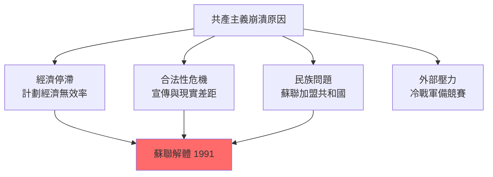

# HIST2152 晚期社會主義 / Late Socialism and the 1989 Revolutions

**Instructor**: (Varies by year)
**Department**: History, HKU
**Official source**: [HKU History Course Description 2024-25](https://history.hku.hk/wp-content/uploads/2024/07/HIST-2425.pdf)
**Style**: 袁騰飛式 — 犀利分析：社會主義明明話要解放全人類，但係點解最終全體人民都覺得自己被束縛？

---

## 問題 1：5 個核心心智模型

### 心智模型 1：「晚期社會主義」——蘇聯/東歐共產主義點解走向崩潰？
學者 **Gorbachev**（*Perestroika*, 1987）本身研究者；學者 **Vladimir Tismăneanu** 分析共產主義制度內在矛盾。學者 **Martin Malia**（*The Soviet Tragedy*, 1994）指出：共產主義失敗係因為佢建立喺錯誤假設上——人性可以通過社會工程改造。

- **1968** 布拉格之春——東歐第一次真正改革運動
- **1979-89** 阿富汗戰爭——蘇聯陷入帝國主義泥沼
- **1985-91** 戈巴契夫改革——glasnost（開放）+ perestroika（重建）

### 心智模型 2：1989年革命——「天鵝絨革命」定係群眾起義？
學者 **Padraig O'Donogue** 分析東歐1989年：波蘭團結工會、匈牙利開放邊界、柏林牆倒塌、羅馬尼亞暴力革命——每個國家路径完全不同。

- **1989年6月4日** 天安門廣場——中國學生紀念胡耀邦逝世
- **1989年11月9日** 柏林牆倒塌——共產主義歐洲終結象徵
- **1989年12月25日** 齊奧塞斯庫被處決——羅馬尼亞唯一暴力革命

### 心智模型 3：「社會主義新人」——共產主義點樣改造人性？
學者 **Katherine Hagedorn**（*Divine Utterances*, 2000）分析蘇聯宣傳點樣試圖建立「蘇聯新人」；學者 **Stephen Kotkin**（*Magnetic Mountain*, 1995）分析史達林主義點樣建立集體記憶。

### 心智模型 4：「黑市經濟」——社會主義制度下點解必然產生影子經濟？
學者 **Jane Burbank**（*Russian Peasants Go to Court*, 2004）分析蘇聯農民點樣利用「第二經濟」生存。

### 心智模型 5：「記憶 vs 遺忘」——後共產主義社會點樣處理共產主義歷史？
學者 **Timothy Garton Ash**（*The File*, 1999）分析東歐各國如何處理秘密警察檔案。

---

## 問題 2：3 個根本分歧

### 分歧 1：戈巴契夫改革——加速崩潰定係歷史必然？
- **A 方（偶然論）**：如果戈巴契夫唔推行 glasnost，蘇聯可能繼續存活
- **B 方（結構主義）**：蘇聯經濟模式根本不可持續，任何改革都會觸發崩潰

### 分歧 2：1989年革命——係人民選擇定係歷史結構力量？
- **A 方（人民力量論）**：群眾上街推翻政權，代表人民力量
- **B 方（結構主義）**：共產主義制度早就崩潰，群眾只係趁火打劫

### 分歧 3：共產主義遺產——東歐各國點樣處理？
- **南韓模式**：全面清算過去（lustration）
- **德國模式**：統一，但東德人被西德人歧視至今

---

## 問題 3：10 個深度問題

1. 1989年東歐革命——波蘭、匈牙利、東德、捷克、羅馬尼亞，五個國家五種結局，點解差異咁大？
2. 柏林牆——東德人民點解要建牆阻止自己人離開？呢個决定最終係失敗但係點解當時認為係成功？
3. 天安門——1989年6月4日，究竟發生咗乜嘢？點解呢個歷史到今日仍然係禁忌？
4. 蘇聯解體——點解加盟共和國可以和平分離，但係車臣就爆發戰爭？民族問題點解喺蘇聯解體後爆發？
5. 戈巴契夫——佢係歷史罪人定係悲劇英雄？佢嘅改革最終摧毁咗蘇聯，但係如果唔改革又會點？
6. 東歐共產主義者——佢哋點解可以變成民主人士、資本家？佢哋內部究竟有冇真正相信共產主義理想？
7. 蘇聯平民生活——點解東德人可以睇西德電視，但係仍然留低？電視真係可以改變人心？
8. 「共產主義受害者」——點解唔同國家對共產主義歷史處理方式差咁遠？波蘭有清算法，匈牙利有博物館，但係俄羅斯有普京。
9. 從共產主義到資本主義——點解俄羅斯/東歐平民大約在90年代生活水平下降？「休克療法」究竟係邊個諗出嚟？
10. 如果你係東德人，1989年11月9日走過柏林牆——你第一個感覺係乜嘢？解脫？恐懼？失落？定係興奮？

---

# 核心心智模型深化

## 1. 共產主義崩潰原因 / Causes of Communist Collapse

### 1.1 Bilingual 概念對照
- 開放 (kāifàng) = Glasnost — 戈巴契夫改革核心
- 重建 (chóngjiàn) = Perestroika — 經濟體制改革
- 去共產主義化 (qù gòngchǎn zhǔyì huà) = Decommunization — 後共產主義清算運動

### 1.3 袁騰飛式犀利觀察
> 「共產主義最搞笑嘅地方——就係佢哋成日話要建立『無階級社會』，但係最後建立起嚟嘅係人類歷史上最大嘅階級歧視：黨員 vs 普通人民！而且仲用槍嚟維持呢個『平等』！」

### 1.4 Deep Test Question
**考試題**：比較 1989 年東歐五個國家（波蘭、匈牙利、東德、捷克、羅馬尼亞）革命路径。用「結構 vs 能動性」（structure vs agency）框架分析點解同一年發生但係結局完全不同。

### 1.5 圖解

---

## 深度自測問題

**Q1**：五個國家之所以結局不同——因為各國反對派組織程度不同、經濟狀況不同、民族構成不同、外部環境不同。

**Q2-Q10** 精簡版：
- Q2：建牆係因為東德領導人擔心人口流失；但係牆唔可能完全阻擋人心流失。
- Q3：天安門——呢個係歷史禁忌；學術研究被限制；但係記憶仍然以其他形式流傳。
- Q4：車臣戰爭——因為車臣有分離主義傳統；蘇聯解體時民族主義情緒爆發。
- Q5：戈巴契夫——歷史悲劇人物；佢嘅改革觸發連鎖反應，但係維持現狀代價同樣巨大。
- Q6：共產主義者轉變——意識形態破產後，呢啲人選擇最大利益；呢個揭示共產主義理想從來都係少數人真正相信。
- Q7：電視影響力——東德人可以睇西德電視，但係佢哋仍然留低，因為留低有生活基礎、社會網絡；電視係催化劑但唔係根本原因。
- Q8：各國處理共產主義遺產方式——取決於各國政治精英選擇；波蘭因為共產主義係外來政權所以清算徹底。
- Q9：休克療法——係Jeffrey Sachs提出，但係執行過程腐敗、寡頭掠奪令平民受害。
- Q10：東德人感受——恐懼與興奮交織；統一後現實令好多東德人失望。

---

## 總結

**HIST2152 Late Socialism and the 1989 Revolutions** 嘅核心價值：
1. **理解極權主義崩潰**——1989年係20世紀最重要嘅歷史事件之一
2. **批判性思考**——共產主義理想同實踐之間嘅鴻溝
3. **當代相關性**——後共產主義社會仍然面對歷史遺產問題

**袁騰飛金句**：
> 「共產主義就係一場人類最大規模嘅社會實驗——幾億人被迫成為實驗品，最後實驗失敗，但係你知唔知，有幾多人到今日仍然相信呢個實驗會成功？」

---

## 延伸閱讀

1. Malia, Martin. *The Soviet Tragedy: A History of Socialism in Russia*. New York: Free Press, 1994.
2. Kotkin, Stephen. *Magnetic Mountain: Stalinism as a Civilization*. Berkeley: University of California Press, 1995.
3. Garton Ash, Timothy. *The File: A Personal History*. New York: Random House, 1999.
4. Tismăneanu, Vladimir. *Stalinism for All Seasons: Political Culture in Romania*. Berkeley: University of California Press, 2003.
5. Judt, Tony. *Postwar: A History of Europe Since 1945*. London: Heinemann, 2005.
6. Kramer, Mark. "The Collapse of the Soviet Union." *Journal of Cold War Studies* (2003).
