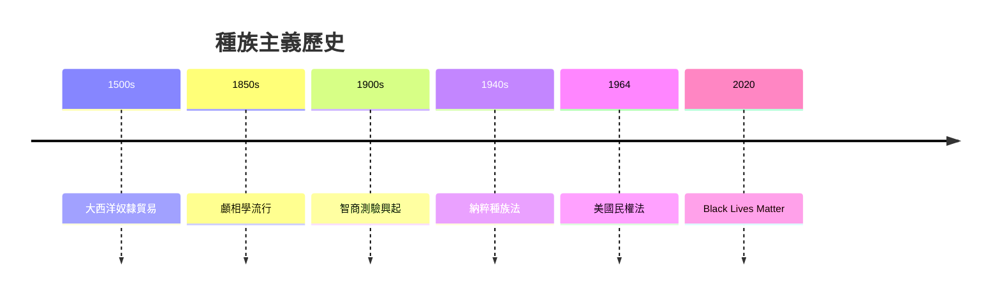
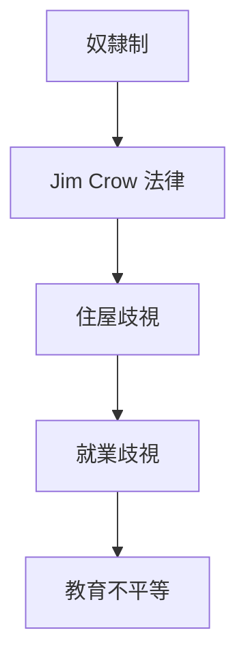

# HIST2161 種族建構 / Making Race (6 credits)

**Instructor**: Theara Thun
**Department**: History, HKU  
**Official source**: [HKU History Course Description 2024-25](https://history.hku.hk/wp-content/uploads/2024/07/HIST-2425.pdf)
**Style**: 袁騰飛式 — 犀利、聚焦種族點解被發明嚟统治

---

## 問題 1：這個領域所有專家共享的 5 個核心心智模型

### 心智模型 1：種族係社會建構非生物本質
學者 **Michael Omi & Howard Winant** (*Racial Formation in the United States*, 1986) 指出：種族唔係固定生物類別，而係社會、歷史、政治建構過程。呢個「建構」(formation) 過程永遠處於爭議中。

學者 **Kwame Ture** (原 Kwame Nkrumah) 研究：種族主義制度化——種族分類為權力服務。

- 「種族」詞彙 16 世紀歐洲發明
- 生物學研究：人類基因差異 99.9% 相同
- 種族分類因時因地變化

### 心智模型 2：科學種族主義歷史
學者 **Stephen Jay Gould** (*The Mismeasure of Man*, 1981) 研究：19 世紀「科學」種族主義——顱相學、智商測驗——為種族歧視提供偽科學理據。

學者 **Hannah Arendt** 研究：納粹種族主義意識形態建立喺歐洲科學傳統上。

- 1850s 顱相學流行
- 1900s 智商測驗
- 1940s 種族隔離「科學」理據

### 心智模型 3：殖民主義與種族等級
學者 **Edward Said** (*Orientalism*, 1978) 研究：東方主義——西方通過學術話語將「東方」建構為落後、需要被管理嘅對象。

學者 **Frantz Fanon** (*The Wretched of the Earth*, 1961) 指出：殖民者通過種族化過程合理化征服。

### 心智模型 4：美國種族化歷史
學者 **David Roediger** (*The Wages of Whiteness*, 1991) 研究：「白人」身份係 19 世紀美國白人勞工階級建構——為咗同黑人勞工區分。

學者 **Cheryl Harris** 研究：「白人」作爲財產形式——歷史性特權。

### 心智模型 5：全球種族化比較
學者 **George Frederickson** (*Racism: A Short History*, 2002) 研究：種族主義唔係單一現象——有南美版、納粹版、美國版、亞洲版。

學者 **Howard Winant** 研究：當代種族化仍然活潑——全球化與本土主義張力。

---

## 問題 2：3 個根本分歧

### 分歧 1：種族平等——後種族時代來臨？
- **A 方**：後種族論
  - Obama 當選證明進步
- **B 方**：結構性種族主義
  - Black Lives Matter 運動揭示持續不平等

### 分歧 2：平權行動——逆向歧視？
- **A 方**：必要補償
  - 歷史歧視需要積極補救
- **B 方**：不公平
  - 忽視個人努力

### 分歧 3：種族本質——存在定虛構？
- **A 方**：生物學角度
  - 基因研究顯示群體差異
- **B 方**：社會建構角度
  - 種族分類係歷史文化產物

---

## 問題 3：10 個深度問題

1. 如果「種族」詞彙從未發明，種族歧視會消失嗎？
2. 點解智商測驗爭議持續到今日？
3. 「亞洲人數學好」——點解被視為種族本質而非文化因素？
4. 如果你去 1850 年做田野考察，點樣研究種族主義？
5. 點解 DNA 測試不能解決種族爭議？
6. 「種族」同「族群」——語義學差異有乜嘢政治後果？
7. 如果你是政策制定者，點樣設計真正平等嘅政策？
8. 點解反猶太主義同種族歧視有相似邏輯？
9. 「模型少數族裔」(Model Minority) 話語點解有問題？
10. 如果你去 1960 年代做民權運動田野，你會點樣記錄歷史？

---

## 核心心智模型深化

### 1. 種族化過程


---

## 深度自測問題

### 詳解 1: 如果「種族」詞彙從未發明...
呢個問題揭示語言建構現實——即使冇「種族」呢個詞，歧視仍然會存在，因為歧視根植於經濟利益、權力關係。

---

## 5 個 Mermaid 圖解

### 📊 Diagram 1: 種族主義歷史



### 📊 Diagram 2: 美國種族化制度



### 📊 Diagram 3: 全球種族主義比較

```mermaid
graph LR
    A[美國奴隸制] --> B[拉丁美洲」
    B --> C[南非種族隔離]
    C --> D[納粹大屠殺]
```

### 📊 Diagram 4: 智商測驗爭議


### 📊 Diagram 5: 種族化過程


---

## 總結

1. 種族係社會建構非生物本質
2. 科學話語為歧視提供理據
3. 種族化過程與權力關係交織
4. 全球種族主義有唔同歷史形態
5. 當代種族正義仍係未竟事業

**最後問題**: 如果你去未來，種族主義仲會存在嗎？

---
**版權所有 © HKU History Self-Study**
