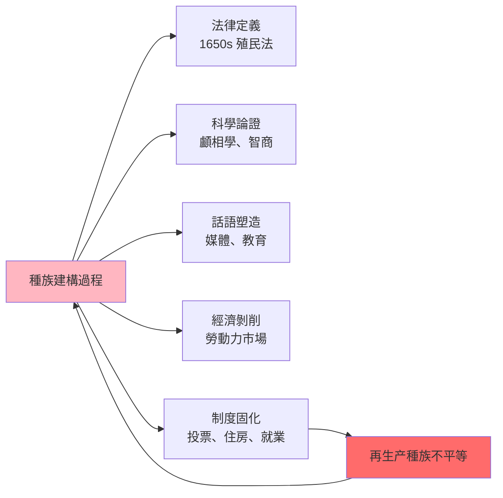
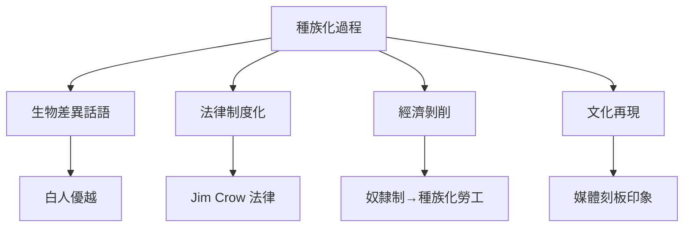

# HIST2161 種族建構 / Making Race

**Instructor**: Theara Thun / Michael Rivera
**Department**: History, HKU
**Official source**: [HKU History Course Description 2024-25](https://history.hku.hk/wp-content/uploads/2024/07/HIST-2425.pdf)
**Style**: 袁騰飛式 — 犀利揭穿：種族呢家嘢根本唔係「自然」嘅，而係人類社會建構出嚟嘅——但係點解建構完之後又可以殺人？

---

## 問題 1：5 個核心心智模型

### 心智模型 1：「種族係社會建構」——點解「種族」唔係自然類別
學者 **Michael Omi & Howard Winant**（*Racial Formation in the United States*, 1986）提出「種族建構」（racial formation）理論：種族唔係固定生物類別，而係社會權力關係不斷塑造嘅結果。學者 **Stuart Hall**（*New Ethnicities*, 1988）指出：種族身份永遠係「話語建構」，唔係自然本質。

- **1650s** 英國北美殖民地通過《種族法》——首次法律定義「白種人」
- **1790** 美國移民法——只有「自由白人」先至可以申請入籍
- **2023** 美國最高法院推翻大學種族平權——種族法律地位再次改變

### 心智模型 2：「科學種族主義」——科學點樣為種族主義提供偽裝
學者 **Stephen Jay Gould**（*The Mismeasure of Man*, 1981）揭露19世紀科學家點樣用顱相學、智商測驗支持種族歧視。學者 **W.E.B. Du Bois** 早就批判「科學種族主義」。

- **1850s** 顱相學——聲稱可以通過測量頭骨確定智力
- **1903** 達爾文表弟 Francis Galton ——優生學之父
- **1972** 神經心理學研究開始挑戰智商測驗文化偏見

### 心智模型 3：「殖民種族主義」——點解歐洲人可以合理化殖民剝削
學者 **Edward Said**（*Orientalism*, 1978）開創後殖民主義研究——「東方主義」話語將「東方」構建成落後、落後、需要歐洲「文明化」。學者 **Gayatri Spivak** 指出：被殖民者話語往往被忽略。

### 心智模型 4：「種族同資本主義」——種族歧視點樣服務經濟剝削
學者 **Cedric Robinson**（*Black Marxism*, 1983）指出：種族主義唔係落後現象，而係資本主義現代性嘅核心組成部分。學者 **Robin D.G. Kelley**（*Race Rebels*, 1994）分析工人階級點樣拒絕被種族化。

### 心智模型 5：「後種族時代」——種族歧視係咪可以消除？
學者 **Eduardo Bonilla-Silva**（*Racism without Racists*, 2006）指出：現代種族歧視已經「隱形化」——唔再係明確嘅「黑人次等」，而係結構性種族主義。

---

## 問題 2：3 個根本分歧

### 分歧 1：種族歧視——「個人偏見」定係「結構性問題」？
- **A 方（個人主義）**：種族歧視係個人態度問題，可以通過教育改變
- **B 方（結構主義）**：學者 **Bonilla-Silva**——種族歧視已經內化為結構性不平等，唔係教育可以解決

### 分歧 2：平權行動——補救過去定係製造新不平等？
- **A 方（補救論）**：平權行動補償歷史不公義
- **B 方（逆向歧視論）**：平權行動本身係歧視

### 分歧 3：「後種族」論——種族歧視是否已經結束？
- **A 方（後種族派）**：Obama 當選代表美國進入後種族時代
- **B 方（批判派）**：George Floyd 事件（2020）顯示結構性種族主義仍然存在

---

## 問題 3：10 個深度問題

1. 點解「白人」呢個概念係到17世紀先至出現？之前歐洲人點解唔認為自己係同一「種族」？
2. 奴隸貿易——點解係非洲人之間進行？係非洲人自己搞出嚟，定係歐洲人利用非洲內部衝突？
3. 納粹種族主義——點解一個文化咁高水平嘅國家（歌德、貝多芬、黑格爾）會搞大屠殺？
4. 「黃種人」呢個概念——點解係19世紀由歐洲人發明？之前中國人、日本人點解唔認為自己係同一「種族」？
5. 「模範少數族裔」話語（猶太人、華人）——點解呢個話語有問題？呢個話語點解被用嚟分裂少數族裔團結？
6. 拉丁裔/亞裔——點解呢啲類別係咁寬泛？波多黎各人同墨西哥人文化差異咁大，但係被稱為同一「種族」？
7. 點解黑人天生跑步快、猶太人天生有商業頭腦、華人天生擅長數學——呢啲「常識」有乜嘢問題？點解統計數據會呃人？
8. 如果種族係建構嘅，咁點解佢可以殺人？建構出嚟嘅嘢點解可以造成咁大嘅實際傷害？
9. 「逆向歧視」——點解部分白人工人階級覺得自己係歧視受害者？呢個感覺有乜嘢歷史根源？
10. 香港/中國嘅種族問題——香港有乜嘢「種族」問題？移工（菲傭、印傭）點解受到歧視？呢個同西方種族主義有乜嘢本質差異？

---

# 核心心智模型深化（中英對照）

## 1. 種族建構理論 / Racial Formation Theory

### 1.1 Bilingual 概念對照
- 種族建構 (zhǒngzú jiàngoò) = Racial Formation — Omi & Winant 理論
- 科學種族主義 (kēxué zhǒngzú zhǔyì) = Scientific Racism — 以科學為名嘅種族歧視
- 東方主義 (dōngfāng zhǔyì) = Orientalism — Said 理論

### 1.3 袁騰飛式犀利觀察
> 「有一個笑話：如果你去種族歧視最嚴重嘅地方，問當地人：『你係乜嘢種族？』佢哋會話：『我係人！』——所以種族歧視最犀利嘅地方，就係嗰啲強調自己『唔係種族歧視者』嘅地方！」

### 1.4 Deep Test Question
**考試題**：用具體歷史案例說明「種族」點樣從 17 世紀開始被法律、科學、文化話語不斷建構。呢個建構過程揭示咗乜嘢關於權力同知識嘅關係？

### 1.5 圖解

---

## 深度自測問題

**Q1**：「白人」之所以 17 世紀先至出現——因為歐洲人需要建立一個身份認同去區分自己同奴隸（黑人）；之前歐洲人更多以宗教、階級、語言定義身份。

**Q2-Q10** 精簡版：
- Q2：奴隸貿易之所以在非洲人之間進行——因為非洲各王國間有戰爭、俘虜成為奴隸；歐洲人只係提供市場，但係非洲領導人主動參與。
- Q3：納粹種族主義之所以可能——因為歐洲文化入面早有科學種族主義話語；納粹只係將呢啲話語推到極致。
- Q4：「黃種人」之所以發明——因為歐洲人需要將亞洲人定義為「落後」來合理化殖民。
- Q5：「模範少數族裔」問題——呢個話語係白人種族主義者用嚟分裂少數族裔團結；而且暗示少數族裔需要「成功」先至值得尊重。
- Q6：拉丁裔/亞裔之所以係寬泛類別——因為呢啲係美國人口普查嘅行政類別，而非自然/文化群體。
- Q7：統計數據之所以呃人——因為種族分類本身係建構；智商/運動成就等於種族掛鈎從方法論上就有問題。
- Q8：建構之所以有殺傷力——因為當社會大多數人相信某個建構，呢個建構就會自我實現。
- Q9：白人工人階級之所以感到受害——因為去工業化令佢哋失業；佢哋錯誤地將失業歸咎於少數族裔，而非全球化/自動化。
- Q10：香港移工歧視——呢個係殖民遺產問題；殖民主義話語令有色人種內部亦有歧視鏈。

---

## 5 個 Mermaid 圖解

### 圖解 1：種族化過程

---

## 總結

**HIST2161 Making Race** 嘅核心價值：
1. **去自然化**——種族唔係自然事實，而係歷史建構
2. **批判性思考**——所有關於「種族差異」嘅言論都需要批判
3. **當代相關性**——種族主義今日仍然係全球最大人權問題之一

**袁騰飛金句**：
> 「種族歧視最恐怖嘅地方——就係歧視者往往相信自己做緊啱！佢哋真心認為自己係『正常』，而對方係『不正常』——呢個就係意識形態嘅魔法！」

---

## 延伸閱讀

1. Omi, Michael, and Howard Winant. *Racial Formation in the United States*. New York: Routledge, 1986.
2. Said, Edward. *Orientalism*. New York: Pantheon Books, 1978.
3. Gould, Stephen Jay. *The Mismeasure of Man*. New York: Norton, 1981.
4. Bonilla-Silva, Eduardo. *Racism without Racists: Color-Blind Racism*. Lanham: Rowman & Littlefield, 2006.
5. Robinson, Cedric J. *Black Marxism: The Making of the Black Radical Tradition*. London: Zed Books, 1983.
6. Hall, Stuart. "New Ethnicities." In *Stuart Hall: Critical Dialogues*, edited by Kuan-Hsing Chen and David Morley. London: Routledge, 1996.
