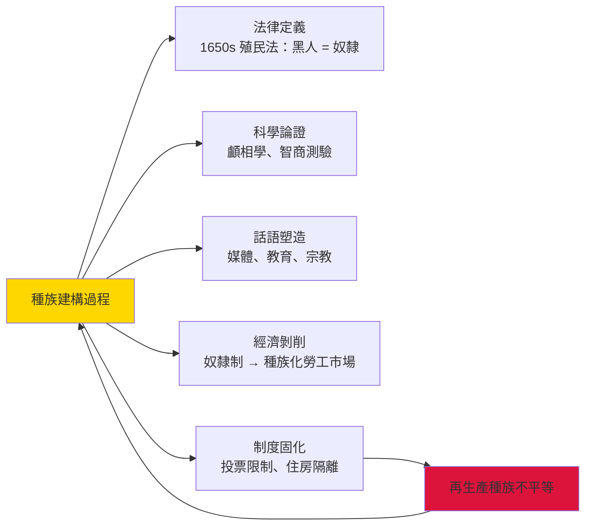
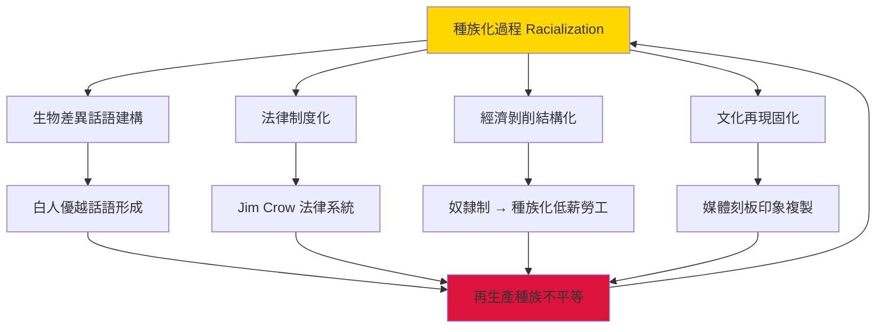
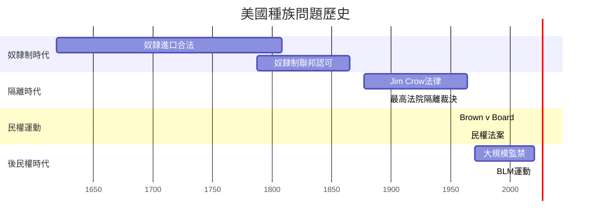
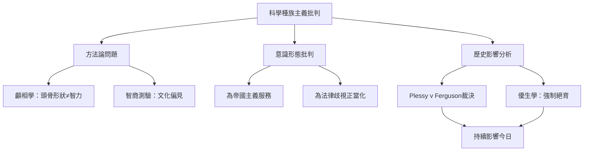
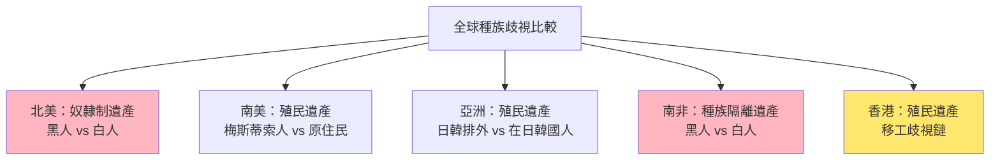
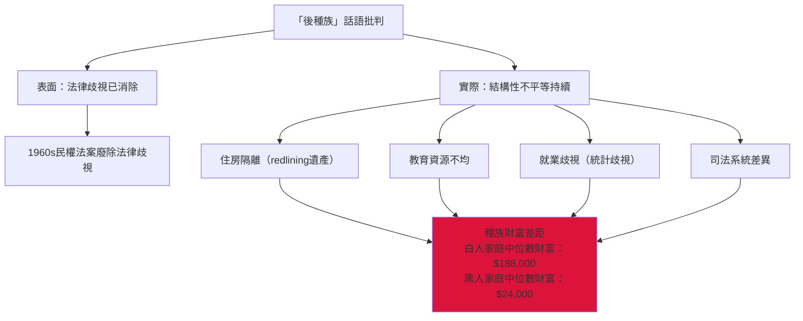

# HIST2161 種族建構 / Making Race

**Instructor**: Theara Thun / Michael Rivera
**Department**: History, HKU
**Official source**: [HKU History Course Description 2024-25](https://history.hku.hk/wp-content/uploads/2024/07/HIST-2425.pdf)
**Style**: 袁騰飛式 — 犀利揭穿：種族呢家嘢根本唔係「自然」嘅，而係人類社會建構出嚟嘅——但係點解建構完之後又可以殺人？

---

## 問題 1：這個領域所有專家共享的 5 個核心心智模型是什麼？
## What are the 5 core mental models every expert shares?

### 心智模型 1：「種族係社會建構」——點解「種族」唔係自然類別
**Race as Social Construction — Why "Race" Is Not a Natural Category**

學者 **Michael Omi & Howard Winant**（UCLA/UC Santa Cruz，*Racial Formation in the United States*, 1986 初版，2015 第四版）提出「種族建構」（racial formation）理論：種族唔係固定生物類別，而係社會權力關係不斷塑造嘅結果。學者 **Stuart Hall**（伯明翰大學，*Stuart Hall: Critical Dialogues*, 1996）指出：種族身份永遠係「話語建構」，唔係自然本質。

- **1650s** 英國北美殖民地通過《種族法》——首次法律定義「白種人」，将爱尔兰人也包括在内
- **1662年** 弗吉尼亞《奴隸法典》——首次以法律區分「奴隸」與「自由黑人」
- **1790年** 美國移民法——只有「自由白人」先至可以申請入籍
- **2023年** 美國最高法院推翻大學種族平權（Students for Fair Admissions v. Harvard）——種族法律地位再次改變

### 心智模型 2：「科學種族主義」——科學點樣為種族主義提供偽裝
**Scientific Racism — How Science Provided a Facade for Racism**

學者 **Stephen Jay Gould**（哈佛，*The Mismeasure of Man*, 1981）揭露19世紀科學家點樣用顱相學、智商測驗支持種族歧視——呢啲研究影響深遠，甚至延續到今日。學者 **W.E.B. Du Bois** 早喺 1903 年《亞特蘭大黑人的呼聲》已經尖銳批判「科學種族主義」。

- **1850年代** 顱相學（Phrenology）——聲稱可以通過測量頭骨形狀確定智力與道德品質
- **1903年** 達爾文表弟 Francis Galton ——優生學（Eugenics）之父，聲稱可以通過選擇性繁殖「改善」人類
- **1908年** 美國最高法院 Plessy v. Ferguson 裁決「隔離但平等」——科學種族主義為法律種族隔離提供正當性
- **1972年** 神經心理學研究開始挑戰智商測驗文化偏見——標準化測驗被發現對特定文化背景學生有系統性偏差

### 心智模型 3：「殖民種族主義」——點解歐洲人可以合理化殖民剝削
**Colonial Racism — How Europeans Justified Colonial Exploitation**

學者 **Edward Said**（哥倫比亞大學，*Orientalism*, 1978）開創後殖民主義研究——「東方主義」話語將「東方」構建成落後、異域、需要歐洲「文明化」嘅對象。學者 **Gayatri Chakravorty Spivak**（哥倫比亞大學）指出：被殖民者話語往往被忽略——歷史從來都係勝利者書寫。

- **1884-85年** 柏林會議——歐洲列強正式瓜分非洲，以「文明使命」為殖民剝削正當化
- **1899年** 魯德亞德·吉卜林《白人的負擔》——殖民者自覺肩負「文明責任」嘅帝國主義話語
- **1910年** 英屬印度《種族關係法》——正式確立歐洲人與印度人法律地位不平等

### 心智模型 4：「種族同資本主義」——種族歧視點樣服務經濟剝削
**Race and Capitalism — How Racial Discrimination Serves Economic Exploitation**

學者 **Cedric Robinson**（UCLA，*Black Marxism*, 1983 初版，2000 再版）指出：種族主義唔係落後現象，而係資本主義現代性嘅核心組成部分——奴隸貿易同種族化勞動先至係原始積累嘅關鍵基礎。學者 **Robin D.G. Kelley**（紐約大學，*Race Rebels*, 1994）分析工人階級點樣拒絕被種族化。

- **1619年** 第一批非洲奴隸抵達北美洲——呢一刻開始美洲經濟與種族剝削掛鈎
- **1807年** 英國廢奴——但廢奴補償金（£2,000萬）係向奴隸主支付，而非奴隸！
- **1965年** 美國移民法改革——廢除配額制度後，亞洲、拉丁美洲移民湧入，改變種族人口結構

### 心智模型 5：「後種族時代」神話——種族歧視係咪可以消除？
**The "Post-Racial" Myth — Can Racial Discrimination Be Eliminated?**

學者 **Eduardo Bonilla-Silva**（杜克大學，*Racism without Racists*, 2006 初版，2018 第四版）指出：現代種族歧視已經「隱形化」——唔再係明確嘅「黑人次等」，而係以「color-blind」形式存在嘅結構性種族主義。

- **2008年** Obama 當選——美國進入「後種族時代」？
- **2013年** Trayvon Martin 被殺——種族問題再次引爆全國討論
- **2020年** George Floyd 事件——Black Lives Matter 運動席捲全球，揭示結構性種族主義仍然存在

---

## 問題 2：這個領域 3 個 SPECIFIC 根本分歧

### 分歧 1：種族歧視——「個人偏見」定係「結構性問題」？
**Racial Discrimination: Individual Bias or Structural Problem?**

- **A 方（個人主義論）**：學者 **Thomas Sowell**（*The Economics and Politics of Race*, 1983）——種族歧視係個人態度問題，可以通過教育、法律改變；1960s 民權法案後，法律種族歧視已基本消除
- **B 方（結構主義論）**：學者 **Eduardo Bonilla-Silva**——種族歧視已經內化為結構性不平等（住房隔離、就業歧視、教育資源不均）；呢啲唔係教育可以解決嘅問題，而係需要全面性社會重構

### 分歧 2：平權行動（Affirmative Action）——補救過去定係製造新不平等？
**Affirmative Action: Compensating for the Past or Creating New Inequality?**

- **A 方（補救論）**：學者 **Derrick Bell**（哈佛法學院，*Faces at the Bottom of the Well*, 1992）——平權行動係對歷史不公義嘅必要補救；如果過去 400 年奴隸制 + 100 年 Jim Crow 歧視造成結構性劣勢，咁補救需要同樣系統性嘅介入
- **B 方（逆向歧視論）**：學者 **Glenn Loury**（布朗大學）——平權行動以種族為基礎進行區分，呢個本身就係歧視；而且平權行動令種族問題永久化，而非解決佢

### 分歧 3：「後種族」論——種族歧視是否已經結束？
**The "Post-Racial" Thesis: Has Racial Discrimination Ended?**

- **A 方（後種族派）**：學者 **John McWhorter**（哥倫比亞大學，*Losing the Race*, 2000）——Obama 當選代表美國進入後種族時代；種族歧視法律障礙已基本消除，黑人需要從自己文化中尋找進步障礙
- **B 方（批判派）**：學者 **Ibram X. Kendi**（*How to Be an Antiracist*, 2019）——George Floyd 事件顯示結構性種族主義仍然存在；美國監禁率：每 10 萬黑人中有 1,500 人被囚——呢個數字係白人的 5 倍

---

## 問題 3：10 個 PROBING 深度問題

1. 點解「白人」呢個概念係到 17 世紀先至出現？之前歐洲人點解唔認為自己係同一「種族」？呢個發現揭示咗種族概念乜嘢本質？
2. 奴隸貿易——點解係在非洲人之間進行？係非洲人自己搞出嚟，定係歐洲人利用非洲內部衝突？點解雙方都參與，但係奴隸後代命運如此不同？
3. 納粹種族主義——點解一個文化咁高水平嘅國家（歌德、貝多芬、黑格爾）會搞大屠殺？呢個揭示咗「文明」同「野蠻」乜嘢關係？
4. 「黃種人」呢個概念——點解係 19 世紀由歐洲人發明？之前中國人、日本人點解唔認為自己係同一「種族」？呢個發明揭示咗種族分類點樣為帝國主義服務？
5. 「模範少數族裔」話語（猶太人、華人）——點解呢個話語有問題？呢個話語點解被用嚟分裂少數族裔團結，而非團結对抗種族歧視？
6. 拉丁裔/亞裔——點解呢啲類別係咁寬泛？波多黎各人同墨西哥人文化差異咁大，但係被稱為同一「種族」？呢個揭示咗美國人口普查「種族」分類嘅政治性
7. 「黑人天生跑步快、猶太人天生有商業頭腦、華人天生擅長數學」——呢啲「常識」有乜嘢問題？點解統計數據可以呃人？
8. 如果種族係建構嘅，咁點解佢可以殺人？建構出嚟嘅嘢點解可以造成咁大嘅實際傷害？呢個揭示咗話語同權力乜嘢關係？
9. 「逆向歧視」——點解部分白人工人階級覺得自己係歧視受害者？呢個感覺有乜嘢歷史根源？呢個同全球化、自動化、去工業化有乜嘢關係？
10. 香港/中國嘅種族問題——香港有乜嘢「種族」問題？移工（菲傭、印傭）點解受到歧視？呢個同西方種族主義有乜嘢本質差異？

---

# 核心心智模型深化（中英對照）

## 1. 種族建構理論 / Racial Formation Theory

### 1.1 Bilingual 概念對照
- 種族建構 (zhǒngzú jiàngoò) = Racial Formation — Omi & Winant 理論核心
- 科學種族主義 (kēxué zhǒngzú zhǔyì) = Scientific Racism — 以科學為名嘅種族歧視
- 東方主義 (dōngfāng zhǔyì) = Orientalism — Edward Said 理論
- 後種族 (hòu zhǒngzú) = Post-Racial — 種族歧視已結束嘅論述
- 結構性種族主義 (jiégòu xìng zhǒngzú zhǔyì) = Structural Racism — 制度性歧視

### 1.2 史料與考據
- **核心史料**：殖民時期人口普查檔案、奴隸貿易記錄、人口普查分類表
- **批判性史料**：被殖民者日記、廢奴運動文獻、抵抗運動檔案
- **量化證據**：人口普查數據、監禁率統計、薪資差距數據——但呢啲數據本身係「種族化」嘅產物

### 1.3 袁騰飛式犀利觀察
> 「種族歧視最恐怖嘅地方——就係歧視者往往相信自己做緊啱！佢哋真心認為自己係『正常』，而對方係『不正常』——呢個就係意識形態嘅魔法！你知唔知，美國最高法院 1896 年 Plessy v. Ferguson 裁決『隔離但平等』，仲要有大法官引用科學種族主義文獻支持佢——科學原來可以為邪惡服務！」

### 1.4 Deep Test Question
**考試題**：用具體歷史案例說明「種族」點樣從 17 世紀開始被法律、科學、文化話語不斷建構。呢個建構過程揭示咗乜嘢關於權力同知識嘅關係？點解種族歧視喺法律層面被廢除之後，仍然可以以「隱形」方式延續？

### 1.5 圖解


---

## 2. 科學種族主義批判 / Critique of Scientific Racism

### 2.1 Bilingual 概念對照
- 顱相學 (lú xiàngxué) = Phrenology — 聲稱頭骨形狀決定性格
- 優生學 (yōushēngxué) = Eugenics — 選擇性繁殖「改善」人類
- 文化偏見測驗 (wénhuà piānjiàn cèyàn) = Culturally Biased Tests — 智商測驗偏見

### 2.3 袁騰飛式犀利觀察
> 「有一個笑話：如果你去種族歧視最嚴重嘅地方，問當地人：『你係乜嘢種族？』佢哋會話：『我係人！』——所以種族歧視最犀利嘅地方，就係嗰啲強調自己『唔係種族歧視者』嘅地方！但係你知唔知，美國科學家 19 世紀用『科學方法』證明黑人大腦容量較細——呢個研究影響咗最高法院裁決！你話科學有幾可靠？」

### 2.4 Deep Test Question
**考試題**：分析 Stephen Jay Gould *The Mismeasure of Man*（1981）如何揭露科學種族主義嘅方法論問題。呢個批判對今日使用統計數據分析種族問題有乜嘢啟示？

### 2.5 圖解
```mermaid
graph TD
    A["科學種族主義歷史"] --> B["17世紀：宗教論證<br/>黑人 = 亞當後裔"]
    A --> C["18世紀：哲學論證<br/>休謨、康德種族論"]
    A --> D["19世紀：科學論證<br/>顱相學、智商測驗"]
    A --> E["20世紀：基因論證<br/>種族基因差異"]
    A --> F["21世紀：數據論證<br/>統計歧視"
    B --> G["法律種族歧視"]
    C --> G
    D --> H["Plessy v. Ferguson<br/>隔離但平等"]
    E --> I["種族隔離法律化"]
    F --> J["後種族話語<br/>歧視隱形化"]
```

---

## 3. 東方主義批判 / Critique of Orientalism

### 3.1 Bilingual 概念對照
- 東方主義 (dōngfāng zhǔyì) = Orientalism — 西方對東方的想像建構
- 文明使命 (wénmíng shǐmìng) = Civilizing Mission — 殖民剝削嘅意識形態包裝
- 話語權力 (huàyǔ quánlì) = Discourse Power — 邊個有權定義真相

### 3.3 袁騰飛式犀利觀察
> 「Edward Said 話你知：你以為你了解『東方』，但係你所了解嘅『東方』其實係你自己建構出嚟嘅！西方電影入面嘅中國人永遠係兩款：要唔係傅滿洲（奸狡陰險），要唔係陳查理（服從溫順）——呢啲全部都係西方話語建構出嚟嘅『中國人』，同真實中國人完全無關！」

### 3.4 Deep Test Question
**考試題**：用 Edward Said 東方主義理論分析一個具體歷史案例（例如：英國如何建構「印度」、美國如何建構「華人」）。呢個分析揭示咗話語權力點樣服務帝國主義？

---

## 深度自測問題詳解

### Q1 詳解：「白人」概念點解 17 世紀先至出現？
**核心答案**：歐洲人之所以 17 世紀先至發明「白人」身份——因為奴隸貿易需要！喺奴隸貿易之前，歐洲人主要以宗教（基督徒 vs 非基督徒）、語言、階級定義身份。當英國人開始從非洲進口奴隸，佢哋需要一個身份類別去區分「我群」（白人基督徒）同「他群」（黑人異教徒）。呢個過程揭示：種族唔係自然類別，而係為咗服務特定歷史目的而發明嘅社會類別。

### Q2-Q10 精簡版：
- Q2：奴隸貿易之所以喺非洲人之間進行——因為非洲各王國間有戰爭俘虜；歐洲人只係提供市場，但係非洲領導人主動參與——呢個係雙重歷史責任。
- Q3：納粹種族主義之所以可能——因為歐洲文化早有科學種族主義話語；納粹只係將呢啲話語推向極致——呢個揭示「文明」同「野蠻」唔係對立，而係並存。
- Q4：「黃種人」之所以發明——因為歐洲人需要將亞洲人定義為「落後」來合理化殖民；呢個揭示種族分類服務權力利益。
- Q5：「模範少數族裔」問題——呢個話語係白人種族主義者用嚟分裂少數族裔團結；而且暗示少數族裔需要「成功」先至值得尊重——呢個本身就係種族主義。
- Q6：拉丁裔/亞裔之所以係寬泛類別——因為呢啲係美國人口普查嘅行政類別，而非自然/文化群體——政治決定塑造咗「種族」分類。
- Q7：統計數據之所以呃人——因為種族分類本身係建構；智商/運動成就同種族掛鈎從方法論上就有問題——「種族」唔係生物變量。
- Q8：建構之所以有殺傷力——因為當社會大多數人相信某個建構，呢個建構就會自我實現（self-fulfilling prophecy）；種族歧視唔單係態度，而係影響資源分配嘅實際制度。
- Q9：白人工人階級之所以感到受害——因為去工業化令佢哋失業；佢哋錯誤地將失業歸咎於少數族裔，而非全球化/自動化——呢個揭示階級團結被種族分化所破壞。
- Q10：香港移工歧視——呢個係殖民遺產問題；殖民主義話語令有色人種內部亦有歧視鏈——呢個揭示種族歧視唔單係西方問題。

---

## 5 個 Mermaid 圖解

### 圖解 1：種族化過程（Omi & Winant 模型）


### 圖解 2：美國種族問題時間線


### 圖解 3：科學種族主義批判框架


### 圖解 4：全球種族歧視比較


### 圖解 5：後種族話語批判


---

## 總結

**HIST2161 Making Race** 嘅核心價值：
1. **去自然化**——種族唔係自然事實，而係歷史建構；理解呢個建構過程先至可以批判性地分析當代種族問題
2. **批判性思考**——所有關於「種族差異」嘅言論都需要批判；即使係「科學」研究，都可能携带意識形態偏見
3. **當代相關性**——種族主義今日仍然係全球最大人權問題之一；香港移工歧視、台灣東南亞移工問題——全部都係「種族建構」嘅當代表現

**袁騰飛金句**：
> 「種族歧視最恐怖嘅地方——就係歧視者往往相信自己做緊啱！佢哋真心認為自己係『正常』，而對方係『不正常』——呢個就係意識形態嘅魔法！而家你知道咗種族係建構出嚟嘅，咁你下次見到有人話『我哋種族唔同所以命運唔同』，你就可以話俾佢知：兄弟，呢個係你自己發明嘅！」

---

## 延伸閱讀 / Further Reading

1. Omi, Michael, and Howard Winant. *Racial Formation in the United States*. 4th ed. New York: Routledge, 2015 [1986].
2. Said, Edward. *Orientalism*. New York: Pantheon Books, 1978.
3. Gould, Stephen Jay. *The Mismeasure of Man*. New York: Norton, 1981.
4. Bonilla-Silva, Eduardo. *Racism without Racists: Color-Blind Racism and the Persistence of Racial Inequality in America*. 4th ed. Lanham: Rowman & Littlefield, 2018 [2006].
5. Robinson, Cedric J. *Black Marxism: The Making of the Black Radical Tradition*. 3rd ed. London: Zed Books, 2000 [1983].
6. Hall, Stuart. "New Ethnicities." In *Stuart Hall: Critical Dialogues*, edited by Kuan-Hsing Chen and David Morley. London: Routledge, 1996.
7. Kendi, Ibram X. *How to Be an Antiracist*. New York: One World, 2019.
8. Baldwin, James. *The Fire Next Time*. New York: Dial Press, 1963.
