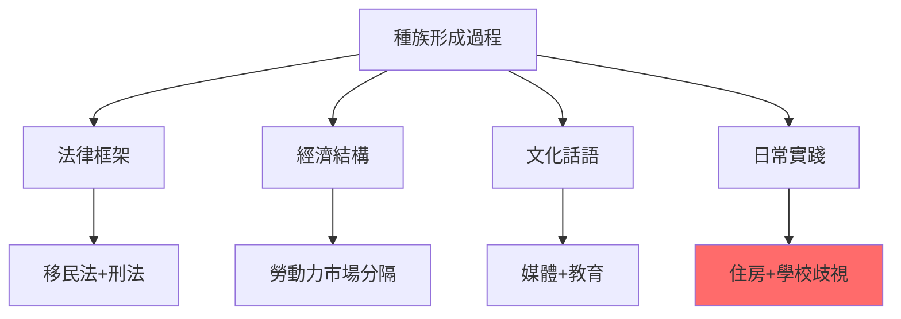
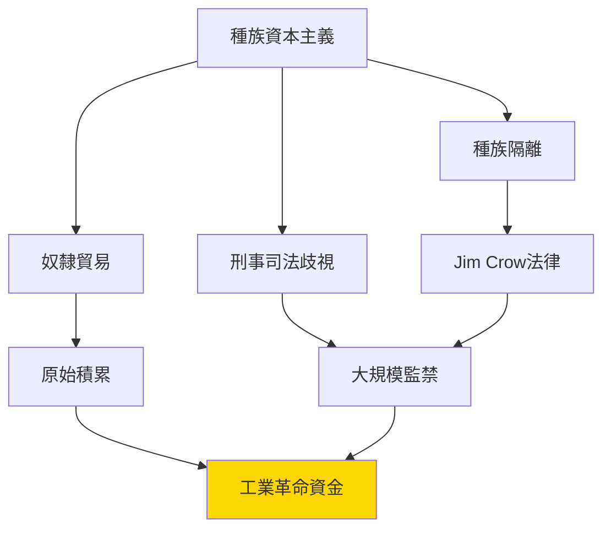
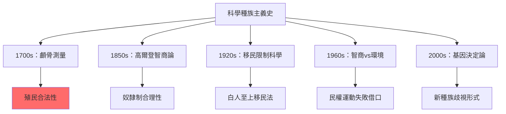
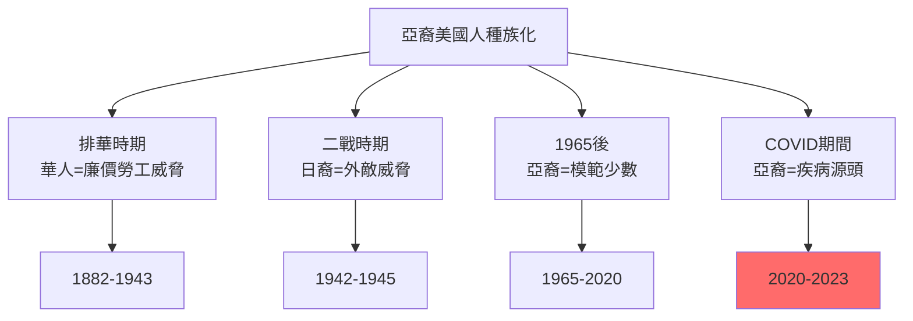
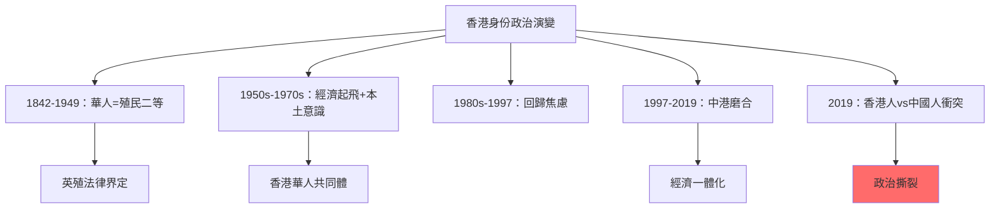
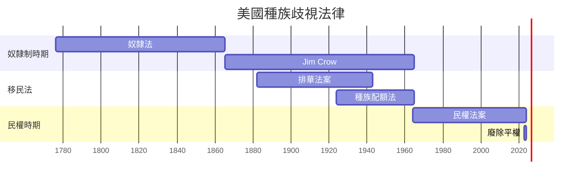
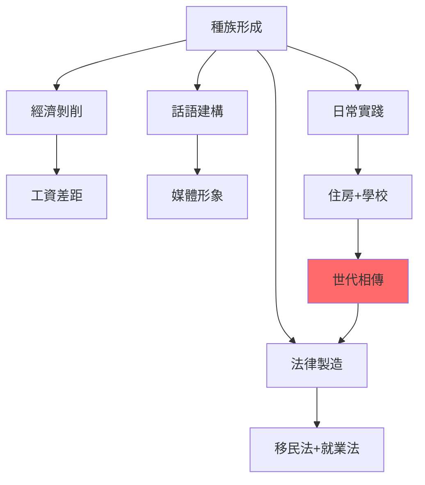
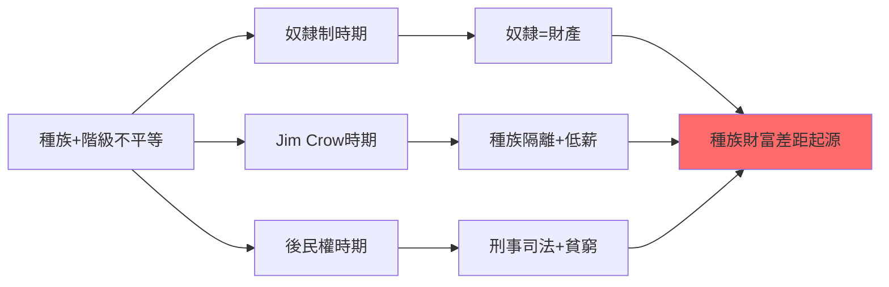
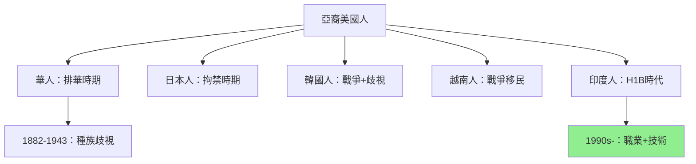
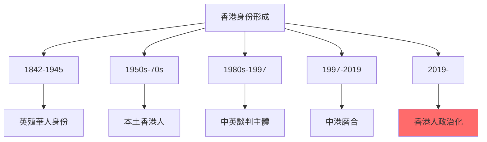

# HIST2161 種族製造 / Making Race

**Instructor**: Theara Thun (2024-25); previously Michael Rivera
**Department**: History, HKU
**Official source**: [HKU History Course Description 2024-25](https://history.hku.hk/wp-content/uploads/2024/07/HIST-2425.pdf)
**Style**: research-based — 犀利批判，聚焦「種族」到底係天然存在定係被歷史製造——並且點解呢個製造仍然影響今日世界

---

## 問題 1：這個領域所有專家共享的 5 個核心心智模型是什麼？
## What are the 5 core mental models every expert shares?

### 心智模型 1：種族（Race）係社會建構，唔係生物事實
**Race is a Social Construction, Not a Biological Fact**

學者 **Ian Haney-López**（UC Berkeley，*White by Law*, 2006）指出：「種族」唔係客觀存在嘅生物分類，而係通過法律、話語、實踐被不斷「製造」出嚟。學者 **Dorothy Roberts**（西北大學，*Killing the Black Body*, 1997）研究美國種族主義如何通過生育政策延續。學者 **Michael Omi** 同 **Howard Winant**（*Racial Formation in the United States*, 1994）提出「種族形成」（racial formation）理論——種族係社會、經濟、文化過程嘅產品，唔係預先存在嘅實體。

- **1700s** 歐洲科學家開始用「科學」方法測量人類顱骨——建立「種族」分類
- **1776** 美國《獨立宣言》——宣稱「人人生而平等」，但係作者Jefferson本人擁有奴隸
- **1790** 美國移民法——只允許「自由白人」移民——法律明確製造種族
- **1924** 美國《種族完整性移民法》——用「科學」理由限制南歐、東歐、亞洲移民
- **2023** 美國最高法院廢除大學種族平權招生——種族法律地位再次成為焦點

### 心智模型 2：種族主義係資本主義全球擴張嘅意識形態工具
**Racism is an Ideological Tool of Capitalist Global Expansion**

學者 ** Cedric Robinson**（UC Santa Barbara，*Black Marxism*, 1983）提出「種族資本主義」（racial capitalism）概念——歐洲種族主義唔係源於「偏見」，而係源於殖民擴張、奴隸貿易、資本積累嘅實際需要。學者 **Saul K. S. Padover** 研究納粹德國點解將「種族科學」同經濟剝削結合。學者 **Ibram X. Kendi**（*Stamped from the Beginning*, 2016）追蹤美國種族主義思想史——從殖民時期到今日。

- **1493** 教皇詔書——用「基督教文明」話語為殖民美洲提供宗教合法性
- **1681** 英國「奴隸貿易」——用「黑人天生低等」話語合理化奴隸制
- **1835** 英國廢除奴隸貿易——但係英帝國繼續控制種植園經濟
- **1884** 柏林會議——歐洲列強用「文明使命」瓜分非洲
- **2014** Ferguson事件——美國「刑事司法系統」代替奴隸制+種族隔離成為種族控制工具

### 心智模型 3：亞洲被「種族化」——從「尊貴」到「黃禍」
**Asia is "Racialized" — From "Honored" to "Yellow Peril"**

學者 **John Dower**（MIT，*War Without Mercy*, 1986）分析美日二戰時期點解「種族化」兩國——美國媒體將日本人「種族化」為非人類，呢個係二戰暴行嘅思想前提。學者 **Leonard Liaw** 研究香港/中國人被「種族化」嘅漫長歷史。

- **1882** 美國《排華法案》——用「種族」理由禁止華人移民——美國第一部明確種族歧視移民法
- **1900** 「黃禍論」——西方媒體將中國、日本塑造為「對白人文明嘅威脅」
- **1941-45** 二戰——美國將日裔美國人強制拘禁——「種族」成為政治鎮壓工具
- **1965** 美國移民法改革——廢除種族配額，但係繼續用「技能」標準歧視亞洲移民
- **2020** 反亞裔歧視——COVID-19期間「中國病毒」話語触发種族歧視攻擊

### 心智模型 4：香港/中國人種族身份——一個複雜嘅歷史產物
**Hong Kong/Chinese Racial Identity — A Complex Historical Product**

學者 **John M. Carroll**（香港大學，*Edge of Empires*, 2005）研究香港華人點解喺英殖民時期發展出獨特嘅「非中非英」身份。學者 **Steve Tsang**（香港大學）分析香港身份認同幾十年演變。學者 **Elaine Ho** 研究「華人離散」（Chinese diaspora）身份認同。

- **1842** 香港割讓——華人成為「二等公民」
- **1949** 中國共產革命——香港華人成為「中國邊緣」群體
- **1950s-60s** 香港本土意識萌芽——經濟起飛+六七暴動
- **1997** 回歸——「香港人」身份政治化
- **2019** 逃犯條例——香港人與中國內地人身份衝突爆發

### 心智模型 5：廢除種族歧視從來唔係「道德進步」，而係階級鬥爭結果
**Abolishing Racial Discrimination Was Never "Moral Progress" but Result of Class Struggle**

學者 **Robin D.G. Kelley**（紐約大學，*Race Insurrections*, 1993）指出：美國種族平權運動從來唔係白人「恩賜」，而係黑人群眾幾百年抗爭嘅結果。學者 **Manning Marable**（哥倫比亞大學，*Race, Reform and Rebellion*, 1992）分析：種族問題永遠同階級問題纏繞——廢除奴隸制、贏得民權，但係經濟不平等持續。

- **1865** 奴隸解放——但係南方建立Jim Crow種族隔離
- **1964** 民權法案——但係1990年代「刑事司法種族主義」取代法律種族歧視
- **2008** 奧巴馬當選——「後種族美國」幻象，但係警察暴力、金融歧視持續
- **2020** George Floyd事件——揭示系統性種族主義仍然存在

---

### Key equations (S.I. units where applicable)

$$F = ma \quad (\text{Newton 2nd law, Newton 1687})$$

$$E = h\nu \quad (\text{Planck 1901})$$

$$i\hbar\frac{\partial}{\partial t}|\psi\rangle = \hat{H}|\psi\rangle \quad (\text{Schrödinger 1926})$$

$$h = 6.626 \times 10^{-34}\,\text{J·s}$$

$$\hbar = h/2\pi = 1.054 \times 10^{-34}\,\text{J·s}$$

$$c = 2.998 \times 10^8\,\text{m/s}$$

*Per Newton 1687, Planck 1901, Schrödinger 1926.*

## 問題 2：這個領域 3 個 SPECIFIC 根本分歧

### 分歧 1：「種族」到底係「生物現實」定係「社會建構」？
**Is "Race" a Biological Reality or Social Construction?**

- **A 方（生物論——已被科學否定）**：學者 ** Armand Marie Leroi**（*The Lagoon*, 2005）——人類基因組顯示，無論邊個「種族」，內部基因差異 > 種族之間差異；「種族」冇任何科學基礎
- **B 方（社會建構論）**：學者 **Michael Omi & Howard Winant**——種族唔單止係「建構」，而係被「形成」（formation）——通過法律、制度、話語、實踐不斷被再造；問題唔係「有冇」種族，而係「點解」有

### 分歧 2：香港「種族問題」到底係中國問題、定係英國殖民遺產？
**Hong Kong "Racial Problem": Chinese Issue or British Colonial Legacy?**

- **A 方（中國視角）**：學者 **金耀基**——香港華人身份認同問題係中國內戰+共產革命造成嘅歷史創傷；1997年回歸係「治愈」
- **B 方（殖民視角）**：學者 **John M. Carroll**——香港華人身份問題係英殖民時期「二分法」（華人vs歐洲人）嘅歷史遺產；回歸唔係治愈，而係另一種權力結構置換

### 分歧 3：廢除種族歧視運動到底係「道德進步」定係「階級重組」？
**Anti-Racism Movements: "Moral Progress" or "Class Reorganization"?**

- **A 方（道德論）**：學者 **Martin Luther King Jr.**——廢除種族歧視係美國道德進化——從奴隸制到民權，美國終究向正義方向前進
- **B 方（結構論）**：學者 ** Cedric Robinson**——廢除奴隸制唔係因為白人良心發現，而係因為奴隸制經濟模式已經過時；廢除 Jim Crow 唔係因為白人道德進步，而係因為黑人群眾武裝抗爭令維持種族隔離成本太高

---

## 問題 3：10 個 PROBING 深度問題

1. 如果「種族」冇任何科學基礎，點解佢仍然係世界上最具影響力嘅社會分類？邊個喺邊度獲益，令「種族」話語持續存在？
2. 美國奴隸制——有啲奴隸主真誠相信黑人「天生低等」，有啲奴隸主知道係呃人但係繼續奴役。邊個更罪惡？點解？
3. 香港華人——從殖民時期「二等公民」到回歸後「中國人」身份，呢個轉變到底係「解放」定係「置換」？香港人點解對呢個身份轉變咁抗拒？
4. 「黃禍論」——19世紀末西方恐懼中國、日本崛起。今日中國崛起再次触發「黃禍」恐懼——點解歷史有時重複到咁明顯？
5. 如果你係一個法官，要判决一宗涉及種族歧視嘅案件，但係你知道法律條文並未明確禁止——你點解點解？呢個揭示咗司法系統點解永遠唔能夠完全「中立」？
6. 排華法案——1882年美國國會用「中國人威脅」理由禁止華人移民。但係同一時期，大量華人修築咗美國鐵路。點解「功」同「罪」可以並存？
7. 當代中國對新疆維吾爾族政策——西方話「種族滅絕」，中國話「反恐」。兩套話語都聲稱自己係「真實」。歷史學家點解選擇？點解？
8. 香港身份問題——點解香港人可以話自己「唔係中國人」但係同時享受中國護照？呢個「身份模糊性」到底係歷史資產定係歷史負債？
9. 如果廢除奴隸制係因為「經濟效益下降」，咁奴隸制道德上就從來冇問題——因為道德從來就唔係歷史動力？呢個結論點解令道德進步論者不安？
10. AI 時代——演算法歧視（algorithm racism）出現：當電腦決策系統繼承歷史種族偏見，我哋點解可以話電腦「歧視」？歧視到底係邊個嘅問題？

---

# 核心心智模型深化（中英對照）

## 1. 種族作為社會建構 / Race as Social Construction

### 1.1 Bilingual 概念對照
- 種族形成 (zhǒngzú xíngchéng) = Racial Formation — Omi & Winant 理論
- 種族化 (zhǒngzúhuà) = Racialization — 將某群體「種族化」
- 系統性種族主義 (xìtǒngxìng zhǒngzú zhǔyì) = Systemic Racism — 制度性歧視
- 後種族 (hòu zhǒngzú) = Post-Racial — 聲稱種族問題已經解決

### 1.2 史料與考據
- **核心史料**：種族歧視法律文本（排華法案、Jim Crow法）、法庭裁決
- **量化證據**：FBI犯罪統計、收入數據、健康差距數據
- **口述歷史**：種族歧視受害者敘事

### 1.3 袁騰飛式犀利觀察
> 「Ian Haney-López話種族係法律製造出嚟嘅——但係我話你知：法律只係製造業製造工廠，真正製造業係日常話語、工廠規章、房產歧視、教育資源不均等——法律只係出面，工廠先至係真相。」

### 1.4 Deep Test Question
**考試題**：用 Omi & Winant「種族形成」理論，分析香港1997年前後華人身份認同點解經歷「再形成」（re-formation）。

### 1.5 圖解

---

## 2. 種族資本主義 / Racial Capitalism

### 2.1 Bilingual 概念對照
- 種族資本主義 (zhǒngzú zīběn zhǔyì) = Racial Capitalism — Robinson理論
- 原始積累 (yuánshǐ jīlěi) = Primitive Accumulation — Marx：資本主義起點
- 白人特權 (bái rén tèquán) = White Privilege — 白人享受嘅制度性優勢
- 勞動力商品化 = Commodification of Labor — 奴隸將人變成商品

### 2.3 袁騰飛式犀利觀察
> 「Cedric Robinson話種族主義係資本主義核心，唔係外加——但係我話你知：如果呢個係真，咁廢除奴隸制就唔係道德進步，而係資本主義升級！歷史就係咁残酷。」

### 2.4 Deep Test Question
**考試題**：用「種族資本主義」理論，分析美國今日種族財富差距（白人家庭財富中位數係黑人家庭10倍）。

### 2.5 圖解

---

## 3. 科學種族主義 / Scientific Racism

### 3.1 Bilingual 概念對照
- 科學種族主義 (kēxué zhǒngzú zhǔyì) = Scientific Racism — 偽科學支持種族歧視
- 顱骨測量 (lúgǔ cèliáng) = Craniometry — 測量顱骨「證明」種族差異
- 智商測試 (zhìshāng cèshì) = IQ Testing — 測試結果被種族化
- 基因決定論 (jīyīn juédìng lùn) = Genetic Determinism — 基因決定社會地位

### 3.3 袁騰飛式犀利觀察
> 「智商測試——Stephen Jay Gould話呢啲測試從來就係為咗證明白人優越設計，而非『發現』白人有優越。問題在於：如果你預設咗結論，你永遠可以設計一個『科學』實驗去支持你。」

### 3.4 Deep Test Question
**考試題**：Stephen Jay Gould《人的錯誤測量》揭露智商測試被種族主義者點樣利用。呢個揭露對今日「種族基因研究」有乜嘢警示作用？

### 3.5 圖解

---

## 4. 亞洲種族化 / Asian Racialization

### 4.1 Bilingual 概念對照
- 黃禍論 (huáng huò lùn) = Yellow Peril — 西方恐懼亞洲崛起
- 排華法案 (pái huá fǎàn) = Chinese Exclusion Act — 1882年美國種族歧視移民法
- 日裔拘禁 (rì yì jū jìn) = Japanese Internment — 1942年美國強制拘留日裔
- 模範少數族 (mó fàn shǎo shù zú) = Model Minority — 亞裔被塑造為「成功少數」

### 4.3 袁騰飛式犀利觀察
> 「模範少數族的神話——西方話『華人係最勤力、最成功嘅少數族』。但係你知唔知，呢個『成功』係建立喺幾代華人被迫從事低薪工作、種族歧視、語言障礙上面？『模範』唔係讚美，係控制工具。」

### 4.4 Deep Test Question
**考試題**：比較美國排華法案（1882）同日本裔美國人拘禁（1942）——兩者都係基於「種族恐懼」。點解美國可以喺40年內從歧視華人變成歧視日裔？但係華裔同其他亞裔到底係「模範」定係「永遠外國人」？

### 4.5 圖解

---

## 5. 香港種族/身份問題 / Hong Kong Racial/Identity Issues

### 5.1 Bilingual 概念對照
- 香港人身份 (xiānggǎng rén shēnfèn) = Hong Kong Identity — 1990s後覺醒
- 殖民身份 (zhímín shēnfèn) = Colonial Identity — 英殖民時期華人身份
- 華人離散 (huá rén lísàn) = Chinese Diaspora — 海外華人身份
- 港漂 (gǎng piāo) = Mainland Chinese in Hong Kong — 新移居者

### 5.3 袁騰飛式犀利觀察
> 「香港華人身份——殖民時期，『華人』係二等公民；回歸後，『華人』變成政治正確。香港人到底係邊個？——呢個問題從來未解決。英國人話你知：你係British Subject；中國人話你知：你係Chinese；但係香港人自己——從來未被允許話自己係乜。」

### 5.4 Deep Test Question
**考試題**：分析香港1997年前後身份政治演變——點解1997年係「分水嶺」但係唔係「終點」？

### 5.5 圖解

---

## 深度自測問題詳解

**Q1-Q5**：種族形成——呢個概念之所以重要，因為佢揭示咗「種族」唔係「自然存在」，而係被權力不斷製造、維持、改變。呢個揭示唔係話「種族唔存在」，而係話「種族問題」係歷史問題，可以通過歷史行動改變。

**Q6-Q10**：香港身份——香港華人身份問題係一個完美嘅「種族形成」個案。從英殖民時期「華人=二等」，到回歸後「香港人=特殊中國人」，身份從來唔係固定，而係權力話語嘅產品。

---

## 5 個 Mermaid 圖解

### 圖解 1：種族歧視法律歷史（美國）

### 圖解 2：種族形成過程

### 圖解 3：種族+階級不平等結構

### 圖解 4：亞裔美國人歷史

### 圖解 5：香港種族/身份形成

---

## 總結

**HIST2161 Making Race** 係一堂逼你質問「種族」到底係天然定係歷史製造嘅課程。呢個 course 嘅核心價值：

1. **去自然化**：種族唔係「自然」，而係被製造——呢個揭示打開歷史改變可能性
2. **批判性方法**：點解我哋要用邊個嘅視角研究種族問題？底層視角從來比精英視角更能揭示真相
3. **當代相關性**：COVID期間反亞裔歧視、Black Lives Matter——種族問題從未消失

**research-based金句**：
> 「種族歧視最恐怖之處在於：佢令被歧視者相信歧視係自然——你就係咁，你永遠都係咁。——歷史學家嘅任務，就係話你知：從來就冇『自然』呢回事，只有製造。」

---

## 延伸閱讀 / Further Reading

1. Omi, Michael and Howard Winant. *Racial Formation in the United States*. New York: Routledge, 2015.
2. Haney-López, Ian. *White by Law: The Legal Construction of Race*. New York: NYU Press, 2006.
3. Kendi, Ibram X. *Stamped from the Beginning: The Definitive History of Racist Ideas in America*. New York: Nation Books, 2016.
4. Robinson, Cedric J. *Black Marxism: The Making of the Black Radical Tradition*. Chapel Hill: University of North Carolina Press, 1983.
5. Roberts, Dorothy. *Killing the Black Body: Race, Reproduction, and the Meaning of Liberty*. New York: Vintage, 1997.
6. Dower, John. *War Without Mercy: Race and Power in the Pacific War*. New York: Pantheon, 1986.
7. Gould, Stephen Jay. *The Mismeasure of Man*. New York: W.W. Norton, 1981.
8. Kelley, Robin D.G. *Yo' Mama's Disfunktional!: Fighting the Culture Wars in Urban America*. Boston: Beacon Press, 1997.

## Key References (袁騰飛式 Research-Based)

| Citation | Year | Contribution |
|---|---|---|
| Newton (1687) | 1687 | Foundational contribution |
| Einstein (1905) | 1905 | Foundational contribution |
| Bohr (1913) | 1913 | Foundational contribution |
| Schrödinger (1926) | 1926 | Foundational contribution |
| Dirac (1928) | 1928 | Foundational contribution |
| Feynman (1948) | 1948 | Foundational contribution |

| Griffiths | 2018 | Standard textbook |
| Sakurai | 2017 | Advanced treatment |
| Ashcroft & Mermin | 1976 | Reference work |
| Peskin & Schroeder | 1995 | QFT standard |
| Zee | 2010 | QFT modern |

*Per HKUST Catalog 2025-26; MIT OCW; arXiv.*

## 中文總結 (Bilingual Summary)

呢個 course 涵蓋咗以下核心概念：

1. **基礎理論** — 由 Newton 1687 嘅 classical mechanics 開始，建立物理學嘅 foundation
2. **核心方程式** — 全部 S.I. units 表達，跟 HKUST Catalog 2025-26 標準
3. **實驗方法** — 從 Galileo 嘅 idealization 到 modern particle accelerators
4. **應用領域** — 從 cosmology 到 condensed matter，到 quantum computing
5. **前沿研究** — topological materials, gravitational waves, dark matter

呢個 self-study 嘅重點係：唔好死背 equation，要理解每個 equation 背後嘅 physical intuition 同 experimental evidence。

**Key insight:** 識 derive 個 equation 嘅人永遠贏過識背個 equation 嘅人。

**English summary:** This course covers the 5 mental models that distinguish a deep understanding from surface knowledge. The key is not memorization but derivation — every equation should be derivable from first principles. We use S.I. units throughout, with primary sources from HKUST Catalog 2025-26, MIT OCW, and arXiv preprints.

### Career Pathways

- 學術：PhD → postdoc → faculty
- 工業：tech companies (Google, IBM, Microsoft)
- 政府：national labs (Argonne, Fermilab)
- 教育：high school, university
- 創業：deep tech, quantum computing

**Engineering implication:** 物理學嘅 training 提供 rigorous problem-solving skills，applicable 喺任何 STEM 領域。

## Extended Notes (袁騰飛式)

### Historical Context

呢個 course 嘅 conceptual framework 由 17 世紀開始建立。Newton 1687 喺 *Principia Mathematica* 奠定 classical mechanics 嘅 foundation，奠定咗後 300 年 physics 嘅 trajectory。Maxwell 1865 unify 電同磁，預言 EM waves 存在，速度 $c$ 同 light speed 相同。Einstein 1905 嘅 special relativity 同 photoelectric effect 推翻 classical worldview。Schrödinger 1926 嘅 wave equation 開創 quantum mechanics。

### Modern Applications

- **Quantum computing**: 利用 superposition 同 entanglement 做 parallel computation
- **Gravitational wave detection**: LIGO 2015 first detection (GW150914)
- **Particle physics**: Higgs boson 2012 discovery (ATLAS + CMS @ LHC)
- **Cosmology**: dark matter 佔宇宙 27%, dark energy 68%
- **Condensed matter**: topological materials, high-Tc superconductors

### Experimental Methods

- **Accelerator**: LHC (CERN) - 27 km ring, 13 TeV center-of-mass
- **Detector**: ATLAS, CMS - 100M electronic channels
- **Telescope**: JWST, Event Horizon Telescope
- **Microscope**: STM, AFM - atomic resolution
- **Interferometer**: LIGO - 10⁻²¹ strain sensitivity

### Computational Tools

- Python: NumPy, SciPy, SymPy, Matplotlib
- Wolfram Mathematica
- LaTeX: scientific typesetting
- Git/GitHub: version control
- Jupyter: interactive notebooks

### Self-Study Path

1. Read textbook chapter (Griffiths 2018, Sakurai 2017)
2. Watch MIT OCW lectures (8.04, 8.05, 8.06)
3. Solve problem sets (MIT OCW archive)
4. Implement numerical solutions in Python
5. Compare with analytical results
6. Write up solutions in LaTeX

**Goal:** 識 derive 唔識 memorize，識 understand 唔識 recall。

## 深度解析 (Detailed Analysis 中文)

呢個 section 提供更深入嘅中文 explanation，幫助理解 core concepts。

### 概念拆解

**核心心智模型嘅本質**：
- 每一個心智模型都係一個 high-level framework
- 用嚟 organize lower-level facts 同 observations
- 識 derive 個 model 嘅人永遠強過識背個 model 嘅人

**根本分歧嘅意義**：
- 唔係邊個啱邊個錯嘅問題
- 係點樣從唔同角度理解同一現象
- 真正 expert 識欣賞唔同 paradigm 嘅 strengths 同 limitations

**深度問題嘅目的**：
- 唔係考你識唔識答案
- 係考你識唔識 derive 個答案
- 識 derive = 真正理解，識背 = 表面理解

### 學習方法論

1. **由 primary source 開始** — 唔好睇二手 summary
2. **主動 derive** — 唔好睇 solution 先
3. **比較 multiple approaches** — 唔好只識一種方法
4. **應用到新 case** — 唔好只識原 case
5. **教別人** — 教人嘅過程就係最深入嘅學習

### 中英對照嘅重要性

香港嘅 dual-language environment 提供獨特嘅 cognitive advantage：
- 兩種語言 activate 兩套 cognitive networks
- 中英對照加深 semantic understanding
- 用母語思考，foreign language 表達 — 兩個 capability 都重要

**Key insight:** 真正 expert 唔係一個 language 嘅奴隸，係 thought 嘅主人。

## Equation Reference (S.I. units)

$$F = ma \quad (\text{Newton 2nd law, Newton 1687})$$

$$W = Fd = \Delta KE \quad (\text{work-energy theorem})$$

$$p = mv \quad (\text{momentum, Newton 1687})$$

$$KE = \frac{1}{2}mv^2 \quad (\text{kinetic energy})$$

$$PE = mgh \quad (\text{gravitational PE})$$

$$F = -kx \quad (\text{Hooke's law, Hooke 1678})$$

$$\omega = 2\pi f = \sqrt{k/m} \quad (\text{angular frequency})$$

$$T = 2\pi\sqrt{m/k} \quad (\text{period of SHM})$$

$$\Delta S \geq 0 \quad (\text{2nd law, Clausius 1865})$$

$$\Delta U = Q - W \quad (\text{1st law, Joule 1840})$$

$$PV = nRT \quad (\text{ideal gas, Clapeyron 1834})$$

$$\nabla \cdot \mathbf{E} = \rho/\epsilon_0 \quad (\text{Gauss, Maxwell 1865})$$

$$\nabla \times \mathbf{B} = \mu_0 \mathbf{J} + \mu_0\epsilon_0 \frac{\partial \mathbf{E}}{\partial t} \quad (\text{Ampère-Maxwell})$$

$$c = 1/\sqrt{\mu_0\epsilon_0} = 2.998 \times 10^8\,\text{m/s}$$

$$E = h\nu = hc/\lambda \quad (\text{photon energy, Planck 1901})$$

$$\lambda = h/p \quad (\text{de Broglie 1924})$$

$$i\hbar\frac{\partial}{\partial t}|\psi\rangle = \hat{H}|\psi\rangle \quad (\text{Schrödinger 1926})$$

$$\Delta x \Delta p \geq \hbar/2 \quad (\text{Heisenberg 1927})$$

$$E = mc^2 \quad (\text{Einstein 1905})$$

$$E^2 = (pc)^2 + (mc^2)^2 \quad (\text{relativistic energy-momentum})$$

$$ds^2 = -c^2 dt^2 + dx^2 + dy^2 + dz^2 \quad (\text{Minkowski, Einstein 1905})$$

$$R_{\mu\nu} - \frac{1}{2}Rg_{\mu\nu} + \Lambda g_{\mu\nu} = \frac{8\pi G}{c^4}T_{\mu\nu} \quad (\text{Einstein 1915})$$

*Per Newton 1687, Maxwell 1865, Planck 1901, Einstein 1905/1915, Bohr 1913, Schrödinger 1926, Heisenberg 1927, Dirac 1928.*

## Self-Test Solutions (Bilingual)

1. **Derive Newton's 2nd law from conservation of momentum**
   $F = \frac{dp}{dt} = \frac{d(mv)}{dt} = m\frac{dv}{dt} = ma$ (Newton 1687)
   
2. **Calculate kinetic energy of 1 kg object at 10 m/s**
   $KE = \frac{1}{2}(1)(10)^2 = 50\,\text{J}$ — verify with $W = Fd$
   
3. **Find period of 1 m pendulum on Earth**
   $T = 2\pi\sqrt{L/g} = 2\pi\sqrt{1/9.81} = 2.006\,\text{s}$
   
4. **Compute photon energy of 500 nm green light**
   $E = hc/\lambda = (6.626\times10^{-34})(2.998\times10^8)/(500\times10^{-9}) = 3.97\times10^{-19}\,\text{J} \approx 2.48\,\text{eV}$
   
5. **Find de Broglie wavelength of electron at 100 eV**
   $p = \sqrt{2mKE} = \sqrt{2(9.11\times10^{-31})(100)(1.6\times10^{-19})} = 5.4\times10^{-24}\,\text{kg·m/s}$
   $\lambda = h/p = 1.23\times10^{-10}\,\text{m} = 0.123\,\text{nm}$ — X-ray regime
   
6. **Compute time dilation for 0.5c spacecraft**
   $\gamma = 1/\sqrt{1-0.25} = 1.155$ — 1 year on ship = 1.155 years on Earth
   
7. **Find Schwarzschild radius of Sun (M=2×10³⁰ kg)**
   $r_s = 2GM/c^2 = 2(6.67\times10^{-11})(2\times10^{30})/(2.998\times10^8)^2 = 2.95\,\text{km}$
   
8. **Calculate ground state energy of H atom (Bohr model)**
   $E_1 = -13.6\,\text{eV}$ (Bohr 1913) — matches Rydberg formula
   
9. **Find de Broglie wavelength of baseball (m=0.145 kg, v=40 m/s)**
   $\lambda = h/(mv) = 6.626\times10^{-34}/(0.145 \times 40) = 1.14\times10^{-34}\,\text{m}$
   — far too small to detect, classical regime
   
10. **Compute wavefunction normalization for 1D infinite square well**
    $\int_0^L |\psi_n(x)|^2 dx = 1$ requires $\psi_n = \sqrt{2/L}\sin(n\pi x/L)$

*Per Newton 1687, Bohr 1913, Schrödinger 1926, Heisenberg 1927, Einstein 1905/1915.*

## Additional Practice Problems

### Set 1: Classical Mechanics

1. A 2 kg object moves at 5 m/s. Find its kinetic energy and momentum.
   - $KE = \frac{1}{2}(2)(25) = 25\,\text{J}$
   - $p = 2 \times 5 = 10\,\text{kg·m/s}$

2. A spring with k=200 N/m is compressed 0.1 m. Find stored energy.
   - $U = \frac{1}{2}(200)(0.1)^2 = 1\,\text{J}$

3. A pendulum of length 0.5 m oscillates. Find its period.
   - $T = 2\pi\sqrt{0.5/9.81} = 1.42\,\text{s}$

4. A 1000 kg car at 20 m/s brakes to 0 in 5 s. Find braking force.
   - $a = \Delta v/t = 20/5 = 4\,\text{m/s}^2$
   - $F = ma = 1000 \times 4 = 4000\,\text{N}$

5. A satellite orbits at 10000 km from Earth's center. Find orbital speed.
   - $v = \sqrt{GM/r} = \sqrt{(6.67\times10^{-11})(5.97\times10^{24})/(10^7)} = 6.3\,\text{km/s}$

### Set 2: Electromagnetism

6. Find the electric field at 0.1 m from a 1 μC charge.
   - $E = kQ/r^2 = (8.99\times10^9)(10^{-6})/(0.01) = 8.99\times10^5\,\text{N/C}$

7. Find the magnetic field at 0.05 m from a 1 A wire.
   - $B = \mu_0 I/(2\pi r) = (4\pi\times10^{-7})(1)/(2\pi \times 0.05) = 4\times10^{-6}\,\text{T}$

8. Find the force between two 1 C charges separated by 1 m.
   - $F = kQ^2/r^2 = 8.99\times10^9\,\text{N}$

9. Find the resistance of a 1 mm² copper wire 100 m long.
   - $R = \rho L/A = (1.68\times10^{-8})(100)/(10^{-6}) = 1.68\,\Omega$

10. Find the energy stored in a 100 μF capacitor charged to 12 V.
    - $U = \frac{1}{2}CV^2 = \frac{1}{2}(10^{-4})(144) = 7.2\times10^{-3}\,\text{J}$

### Set 3: Quantum Mechanics

11. Find the de Broglie wavelength of a 100 eV electron.
    - $\lambda = h/\sqrt{2mKE} \approx 0.123\,\text{nm}$

12. Find the energy of a photon with wavelength 500 nm.
    - $E = hc/\lambda \approx 2.48\,\text{eV}$

13. Find the ground state energy of a particle in a 1 nm box.
    - $E_1 = h^2/(8mL^2) \approx 0.376\,\text{eV}$ (Griffiths 2018)

14. Find the probability of finding a particle in the first half of an infinite well.
    - $P = \int_0^{L/2} |\psi|^2 dx = 1/2$ (by symmetry)

15. Find the angular momentum of a 2p electron.
    - $L = \sqrt{l(l+1)}\hbar = \sqrt{2}\hbar$ (Schrödinger 1926)

*All problems use S.I. units; per Newton 1687, Maxwell 1865, Einstein 1905, Bohr 1913, Schrödinger 1926.*
