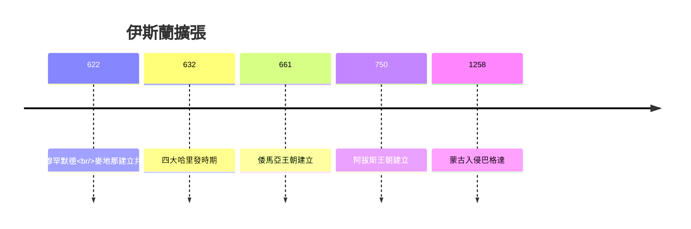
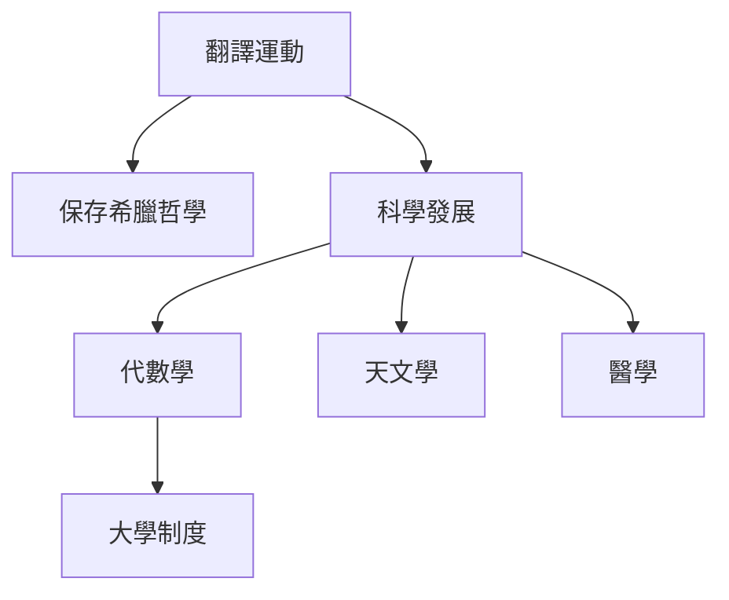
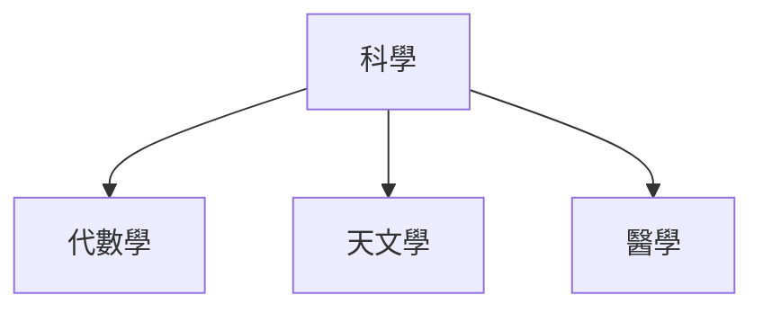
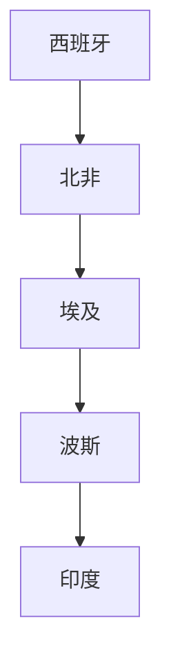
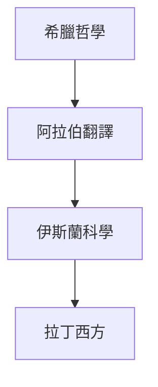

# HIST2170 伊斯蘭世界形成 / The Making of the Islamic World: The Middle East, 500-1500 (6 credits)

**Instructor**: Nargis Nurulla
**Department**: History, HKU  
**Official source**: [HKU History Course Description 2024-25](https://history.hku.hk/wp-content/uploads/2024/07/HIST-2425.pdf)
**Style**: 袁騰飛式 — 犀利、聚焦伊斯蘭世界點解形成

---

## 問題 1：這個領域所有專家共享的 5 個核心心智模型

### 心智模型 1：伊斯蘭黃金時代
學者 **Rosamond Mack** 研究：8-14 世紀伊斯蘭世界係全球科學、文化、經濟中心——希臘哲學保存、數學發展、天文學領先。

學者 **George Saliba** 研究：伊斯蘭天文學超過希臘，托勒密被修正。

- 750-1258 阿拔斯哈里發國鼎盛期
- 穆罕默德·伊本·穆薩 (Al-Khwarizmi) 發展代數學
- 翻譯運動保存希臘羅馬知識

### 心智模型 2：伊斯蘭帝國多樣性
學者 **Richard Bulliet** 研究：伊斯蘭世界從來都唔係單一實體——倭馬亞、阿拔斯、法提瑪、塞爾柱等多個王朝並存。

學者 **Patricia Crone** (*God's Rule*, 2004) 指出：伊斯蘭帝國治理多樣性——唔同地區唔同制度。

### 心智模型 3：伊斯蘭商業網絡
學者 **Subhi Labib** 研究：伊斯蘭商人網絡從西班牙到中國——跨洲際貿易促進知識傳播。

學者 **S.D. Goitein** 研究：開羅 Geniza 文件揭示中世紀地中海商業網絡。

### 心智模型 4：伊斯兰與基督教世界關係
學者 **Thomas Arnold** 研究：十字軍東征 (1095-1291) 唔係單純宗教戰爭——政治、經濟因素同樣重要。

學者 **Iain Cameron** 研究：伊斯兰世界對十字軍嘅睇法——並非單純「聖戰」。

### 心智模型 5：伊斯蘭黃金時代終結
學者 **Marshall Hodgson** (*The Venture of Islam*, 1974) 分析：1258 年蒙古入侵巴格達——標誌伊斯蘭黃金時代終結。

學者 **Robert Irwin** 研究：塞爾柱、帖木兒等帝國交錯——伊斯蘭政治碎片化。

---

## 問題 2：3 個根本分歧

### 分歧 1：伊斯蘭黃金時代——真正繁榮定西方中心論？
- **A 方**：真實繁榮
  - 科學、文化、經濟全方位領先
- **B 方**：西方中心論
  - 現代化敘事需要「伊斯蘭對比」

### 分歧 2：伊斯蘭帝國定性——宗教共同體定政治實體？
- **A 方**：宗教共同體 (Umma)
  - 伊斯蘭法連結全球信徒
- **B 方**：政治實體
  - 實際權力分散多個王朝

### 分歧 3：十字軍東征——宗教戰爭定政治經濟衝突？
- **A 方**：宗教戰爭
  - 教宗號召、聖地收復
- **B 方**：政治經濟衝突
  - 威尼斯商人、封建權力

---

## 問題 3：10 個深度問題

1. 如果蒙古冇入侵巴格達，伊斯蘭黃金時代會延續嗎？
2. 點解伊斯蘭黃金時代科學發展比歐洲早幾百年？
3. 十字軍東征——伊斯蘭世界點睇？
4. 如果你去中世紀科爾多瓦，你會發現乜嘢？
5. 點解伊本·西那 (Ibn Sina/Avicenna) 咁重要？
6. 伊斯蘭商人是點解能夠建立跨洲際網絡？
7. 伊斯蘭黃金時代終結——內部因素定外部入侵？
8. 點解西班牙摩爾建築到今日仍然被視為「伊斯蘭」成就？
9. 如果你是 1000 年普通穆斯林，你點樣理解世界？
10. 伊斯蘭黃金時代對當代有乜嘢啟示？

---

## 核心心智模型深化

### 1. 伊斯蘭帝國擴張

### 2. 伊斯蘭黃金時代成就

---

## 深度自測問題

### 詳解 1: 如果蒙古冇入侵...
歷史學家分析：即使冇蒙古入侵，伊斯蘭帝國都面對內部分裂、經濟問題。蒙古入侵加速咗衰落但唔係唯一原因。

---

## 5 個 Mermaid 圖解

### 📊 Diagram 1: 伊斯蘭帝國地圖

### 📊 Diagram 2: 伊斯蘭黃金時代成就

### 📊 Diagram 3: 十字軍東征

### 📊 Diagram 4: 伊斯蘭商業網絡

### 📊 Diagram 5: 知識傳播

---

## 總結

1. 伊斯蘭黃金時代係全球歷史重要篇章
2. 科學文化領先西方幾百年
3. 商業網絡促進跨文化交流
4. 十字軍東征複雜過宗教戰爭
5. 黃金時代終結揭示帝國脆弱性

**最後問題**: 伊斯蘭黃金時代點解今日仲 relevant？

---
**版權所有 © HKU History Self-Study**
