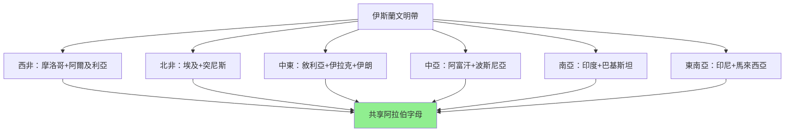
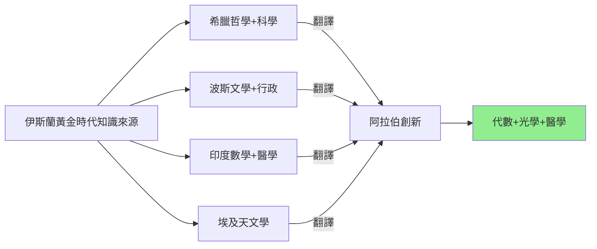
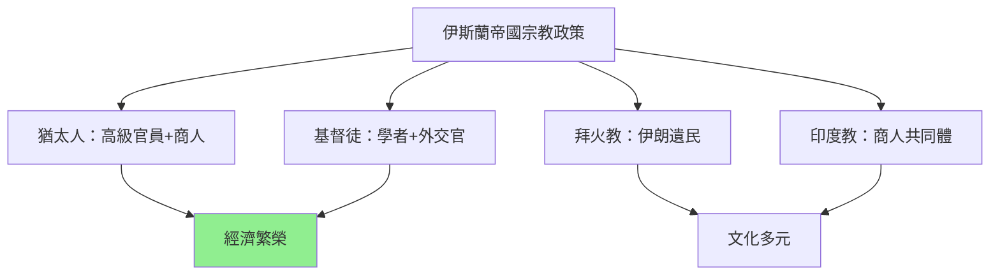
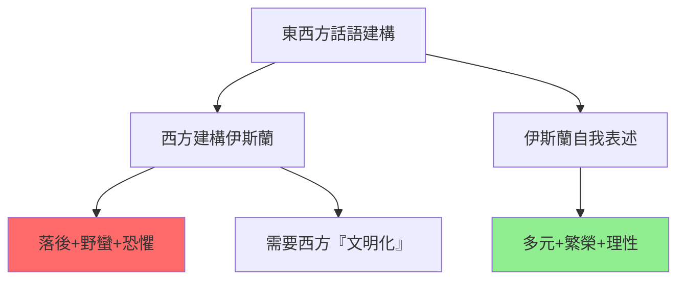
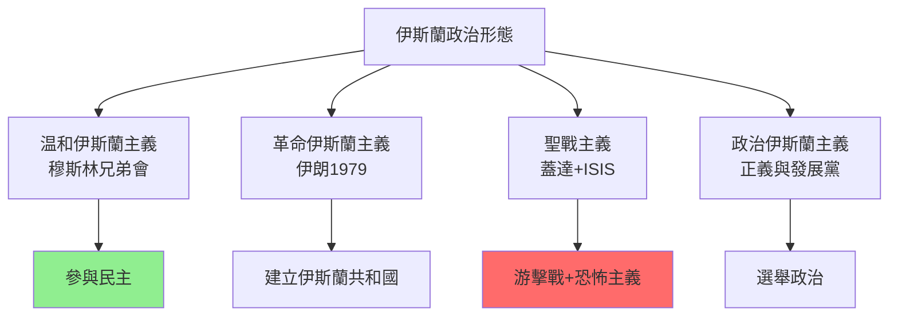
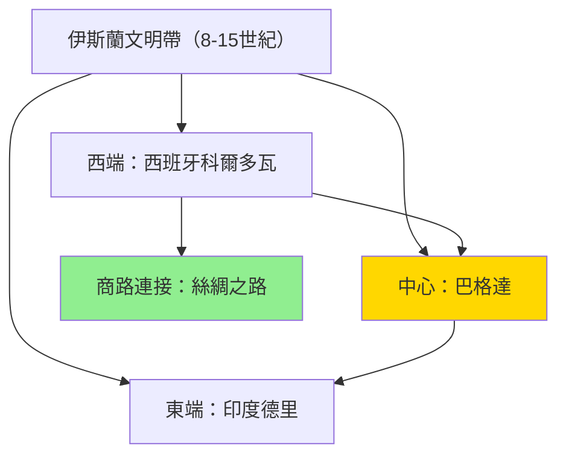
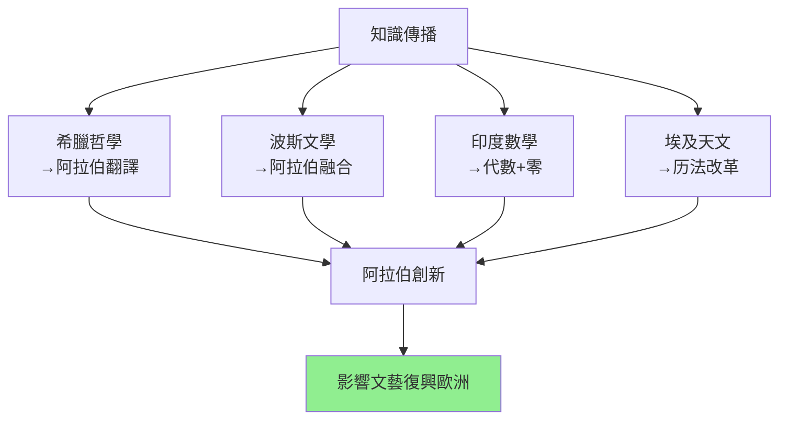
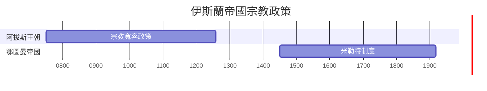
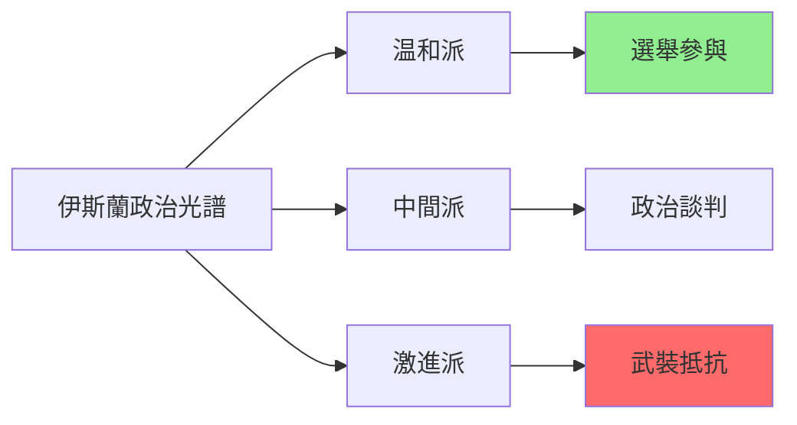
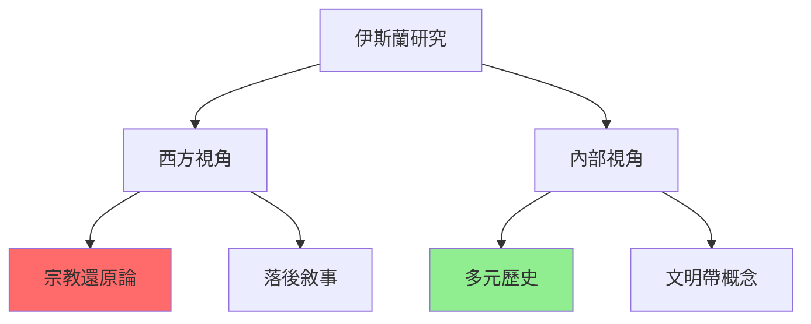

# HIST2170 伊斯蘭世界的形成 / The Making of the Islamic World: The Middle East, 500–1500

**Instructor**: Nargis Nurulla (2024-25)
**Department**: History, HKU
**Official source**: [HKU History Course Description 2024-25](https://history.hku.hk/wp-content/uploads/2024/07/HIST-2425.pdf)
**Style**: research-based — 犀利批判，聚焦伊斯蘭世界點解被西方「神秘化」同「妖魔化」

---

## 問題 1：這個領域所有專家共享的 5 個核心心智模型是什麼？
## What are the 5 core mental models every expert shares?

### 心智模型 1：伊斯蘭世界（Islamic World）唔係單一「伊斯蘭文明」，而係一個多元地理-文化區域
**The "Islamic World" is Not a Single "Islamic Civilization" but a Diverse Geo-Cultural Zone**

學者 **Marshall Hodgson**（芝加哥大學，*The Venture of Islam*, 1977）提出「伊斯蘭文明帶」（Islamicate civilization）概念——呢個唔係單一文明，而係覆蓋西非到東南亞嘅多元文明帶。學者 **Ira Lapidus**（加州大學柏克萊分校，*Islamic Societies to the Nineteenth Century*, 2012）追蹤呢個文明帶嘅內部差異。學者 **Shahab Ahmed**（哈佛，*What is Islam?*, 2015）尖銳挑戰：到底咩嘢係「伊斯蘭」？點解學者從未回答呢個根本問題？

- **570** 穆罕默德出生——但係阿拉伯半島喺此前已有繁榮商業網絡
- **622** 希吉拉（伊斯蘭曆元年）——但係阿拉伯部落在此前已有完整法律系統
- **750** 阿拔斯王朝建立——但係「伊斯蘭黃金時代」其實係多種文化融合
- **1000** 巴格達成為世界最大城市——人口超過100萬，領先欧洲500年
- **1500** 鄂圖曼帝國、薩非伊朗、蒙兀兒帝國——三大「伊斯蘭帝國」同時存在

### 心智模型 2：伊斯蘭黃金時代（Islamic Golden Age）從來唔係「伊斯蘭例外」
**The "Islamic Golden Age" Was Never "Islamic Exceptionalism"**

學者 **Dimitri Gutas**（耶魯大學，*Greek Thought, Arabic Culture*, 1998）指出：所謂「伊斯蘭黃金時代」，其實係「翻譯時代」——阿拉伯學者翻譯希臘、波斯、印度科學文本，然後再創新。呢個時代之所以興旺，係因為阿拔斯王朝從未試圖「伊斯蘭化」科學知識。學者 **George Saliba**（哥倫比亞大學，*Islamic Science and the Making of the Renaissance*, 2007）追蹤阿拉伯天文學點解影響文藝復興歐洲。

- **750-800** 「翻譯運動」——巴格達成為世界知識中心
- **820** 花剌子模（Al-Khwarizmi）發明代數——呢個詞本身就係阿拉伯語
- **1025** 伊本·西那（Avicenna）完成《醫典》——歐洲醫學教材用到17世紀
- **1150** 光學之父伊本·海瑟姆（Alhazen）——影響達文西、笛卡爾
- **1300** 蒙古入侵——中亞知識中心被摧毁，學者西逃

### 心智模型 3：伊斯蘭帝國從來唔係「宗教國家」，而係多元宗教共存帝國
**Islamic Empires Were Never "Religious States" but Multi-Religious Coexistence Empires**

學者 **Richard Bulliet**（哥倫比亞大學，*Islam: The View from the Outside*, 2009）指出：伊斯蘭帝國從阿拔斯王朝開始，就係一個「包容帝國」——猶太人、基督徒、波斯人、印度人喺帝國入面擔任高級官員。學者 **Michael Penn**（富爾頓學院）研究伊斯蘭早期宗教多樣性。學者 **Sanjay Subrahmanyam**（加州大學）提出「連接歷史」（connected history）——伊斯蘭、基督教、印度、中國世界從來就係互聯互通。

- **717-718** 君士坦丁堡圍城——拜占庭帝國（基督教）成功抵禦伊斯蘭軍隊
- **750-900** 猶太黃金時代——伊斯蘭西班牙（Córdoba）成為猶太文化中心
- **900-1200** 巴格達基督教社群——東方教會學者喺伊斯蘭學術界扮演重要角色
- **1200-1500** 鄂圖曼帝國——米勒特制度（宗教社區自治），猶太人、基督徒共存

### 心智模型 4：「伊斯蘭vs西方」呢個二元對立係19世紀殖民主義發明
**The "Islam vs. the West" Binary is a 19th Century Colonial Invention**

學者 **Edward Said**（哥倫比亞大學，*Orientalism*, 1978）提出「東方主義」批判——西方從19世紀開始將「伊斯蘭」建構為落後、野蠻、需要被「文明化」嘅「他者」。學者 **Ussama Makdisi**（萊斯大學）研究「伊斯蘭改革主義」點解係西方殖民主義嘅回應。學者 **Robert Hefner**（波士頓大學）分析「政治伊斯蘭」（political Islam）其實係20世紀現象。

- **1798** 拿破崙入侵埃及——西方「伊斯蘭研究」作為殖民工具誕生
- **1820s-1850s** 英法軍事干預中東——「伊斯蘭落後」話語建立
- **1880s-1900s** 巴勒斯坦錫安主義運動——伊斯蘭/阿拉伯/猶太關係被殖民化
- **1916** Sykes-Picot協議——英法瓜分中東，製造今日衝突

### 心智模型 5：伊斯蘭歷史學必須被「去西方化」
**Islamic History Must Be "De-Westernized"**

學者 **Shahab Ahmed**（*What is Islam?*, 2015）提出：伊斯蘭歷史研究從來就係西方學者主導，佢哋用「伊斯蘭例外主義」框架——假設伊斯蘭同西方係根本不同。學者 **Shadi Hamid**（Brookings Institution）分析：當代伊斯蘭政治（穆斯林兄弟會、ISIS等）唔可以被「宗教還原」理解——呢啲係政治運動，必須用政治學框架分析。

- **1979** 伊朗伊斯蘭革命——伊斯蘭政治化嘅轉折點
- **1989** 魯霍拉·霍梅尼死亡——但係「伊斯蘭共和國」繼續存在
- **2001** 911——西方主流媒體將伊斯蘭「恐怖主義化」
- **2011** 阿拉伯之春——伊斯蘭政黨喺民主選舉中崛起

---

## 問題 2：這個領域 3 個 SPECIFIC 根本分歧

### 分歧 1：「伊斯蘭黃金時代」到底係「伊斯蘭成就」定係「多元文化融合」？
**"Islamic Golden Age": Islamic Achievement or Multi-Cultural Fusion?**

- **A 方（伊斯蘭例外論）**：學者 **John Esposito**（喬治城大學）——伊斯蘭黃金時代係伊斯蘭文明對人類文明嘅獨特貢獻；阿拉伯-伊斯蘭科學有其連貫性
- **B 方（融合論）**：學者 **Dimitri Gutas**——伊斯蘭黃金時代係翻譯+融合時代；阿拉伯學者從希臘、波斯、印度文本中學習；所謂「伊斯蘭例外」係西方學者嘅建構

### 分歧 2：「伊斯蘭vs西方」到底係文明衝突定係政治權力之爭？
**"Islam vs. the West": Clash of Civilizations or Political Power Struggle?**

- **A 方（亨廷頓派）**：學者 **Samuel Huntington**（*Clash of Civilizations*, 1996）——伊斯蘭同西方有根本文化差異；呢個差異構成衝突嘅持久基礎
- **B 方（批判派）**：學者 **Edward Said**、**Fouad Zakariya**——衝突唔係文化，而係政治權力；「伊斯蘭vs西方」話語本身就係19世紀殖民主義發明，為軍事干預提供意識形態基礎

### 分歧 3：「伊斯蘭改革」到底係「內發」定係「外來」？
**"Islamic Reform": Endogenous or Exogenous?**

- **A 方（內發論）**：學者 **Abraham Udovich**——伊斯蘭從8-9世紀開始就有內部改革傳統；改革係伊斯蘭文明內在邏輯
- **B 方（外來論）**：學者 **Ussama Makdisi**——19-20世紀「伊斯蘭改革」係西方殖民主義嘅回應；伊斯蘭改革者往往係喺西方教育體系培養出嚟

---

## 問題 3：10 個 PROBING 深度問題

1. 如果花剌子模發明咗代數，但係呢個詞本身就係阿拉伯語——咁到底係「阿拉伯數學」定係「希臘-阿拉伯數學」？文明到底係邊個嘅？
2. 點解西羅亞（Siraf）——今日霍爾木茲——12世紀時係世界最大港口，但係今日完全消失？海洋城市點解可以瞬間衰落？
3. 蒙古西征（1206-1260）到底係「歷史悲劇」定係「歷史偶然」？如果蒙古軍隊冇消滅巴格達，伊斯蘭文明會點樣？
4. 「伊斯蘭黃金時代」到底係「伊斯蘭例外」定係「全球知識網絡」一部分？印度、中國、波斯知識點解流入阿拉伯？
5. 如果Said《東方主義》係正確——西方將伊斯蘭「他者化」——咁我哋點解今日仲要參考西方學者嘅伊斯蘭研究？
6. 伊斯蘭早期（7-9世紀）對待非穆斯林到底係「寬容」定係「從屬」？米勒特制度到底係宗教自由定係種族歧視？
7. 點解穆罕默德死後百年內，伊斯蘭帝國就分裂成幾十個王朝——呢個分裂到底係「教義衝突」定係「權力鬥爭」？
8. 巴格達蒙古洗劫（1258）——到底係「歷史悲劇」定係「歷史必然」？如果冇蒙古，伊斯蘭帝國會點樣？
9. 伊斯蘭世界今日好多「失敗國家」——阿富汗、伊拉克、叙利亚——呢啲到底係「伊斯蘭文明」問題定係殖民歷史嘅延續？
10. 如果我哋要「去西方化」研究伊斯蘭歷史——到底點解做？有乜替代框架？

---

# 核心心智模型深化（中英對照）

## 1. 伊斯蘭文明帶 / Islamicate Civilization Zone

### 1.1 Bilingual 概念對照
- 伊斯蘭文明帶 (yīsīlán wénmíng dài) = Islamicate Civilization Zone — Hodgson概念
- 伊斯蘭例外主義 = Islamic Exceptionalism — 假設伊斯蘭文明與眾不同
- 翻譯運動 (fānyì yùndòng) = Translation Movement — 8-9世紀阿拉伯翻譯希臘文本
- 東方主義 (dōngfāng zhǔyì) = Orientalism — Said批判西方對伊斯蘭的建構

### 1.2 史料與考據
- **核心史料**：阿拉伯原文史料（伊本·西那、阿威羅伊等）、考古證據
- **多元語言史料**：希臘文、波斯文、拉丁文、希伯來文史料
- **比較方法**：與拜占庭、中國、印度文明比較

### 1.3 犀利觀察
> 「Said話東方主義——西方將伊斯蘭建構為『落後、野蠻、需要文明化』嘅他者。但係我話你知：呢個『建構』到今日仲未消失。西方媒體報道ISIS，唔報道沙特阿拉伯；報道伊朗革命，唔報道以色列佔領。——選擇性報道，就係最新版本嘅東方主義。」

### 1.4 Deep Test Question
**考試題**：用 Hodgson「伊斯蘭文明帶」概念，分析點解「伊斯蘭」從來唔係單一文明，而係覆蓋西非到東南亞嘅多元文明。

### 1.5 圖解

---

## 2. 伊斯蘭黃金時代 / Islamic Golden Age

### 2.1 Bilingual 概念對照
- 黃金時代 (huángjīn shídài) = Golden Age — 8-14世紀伊斯蘭科學文化高峰
- 翻譯運動 (fānyì yùndòng) = Translation Movement — 翻譯希臘、波斯、印度文本
- 代數 (dàishù) = Algebra — 花剌子模發明，詞源阿拉伯語
- 醫典 (yīdiǎn) = Canon of Medicine — 伊本·西那著作

### 2.3 犀利觀察
> 「代數——Algebra，呢個詞本身就係阿拉伯語。但係你知唔知，花剌子模之所以發展代數，係因為伊斯蘭繼承咗印度『零』嘅概念，再融合咗希臘幾何學？——文明從來就係融合產品，唔係純種。」

### 2.4 Deep Test Question
**考試題**：比較「伊斯蘭黃金時代」同「歐洲文藝復興」——兩者都係「翻譯+融合」時代，點解西方歷史書將文藝復興視為『自主創新』，但係唔咁樣描述伊斯蘭黃金時代？

### 2.5 圖解

---

## 3. 多元宗教共存帝國 / Multi-Religious Coexistence Empires

### 3.1 Bilingual 概念對照
- 米勒特制度 (mǐlēitè zhìdù) = Millet System — 鄂圖曼帝國宗教社區自治制度
- 齊米 (zīmǐ) = Zimmis — 伊斯蘭法律下受保護的非穆斯林
- 猶太黃金時代 = Jewish Golden Age — 伊斯蘭西班牙時期
- 宗教寬容 (zōngjiào kuānróng) = Religious Tolerance — 伊斯蘭帝國對待非穆斯林

### 3.3 犀利觀察
> 「米勒特制度——你知唔知，呢個制度喺鄂圖曼帝國延續500年，猶太人、基督徒可以自由信教。但係同一時期歐洲——宗教戰爭燒死異端。如果你要問邊個更『文明』，歷史答案並唔係你想咁簡單。」

### 3.4 Deep Test Question
**考試題**：比較伊斯蘭帝國「米勒特制度」同歐洲中世紀「宗教裁判所」。兩者點解有咁根本差異？呢個差異點解影響日後文明走向？

### 3.5 圖解

---

## 4. 東方主義批判 / Critique of Orientalism

### 4.1 Bilingual 概念對照
- 東方主義 (dōngfāng zhǔyì) = Orientalism — Said對西方伊斯蘭研究的批判
- 他者化 (tāzhě huà) = Othering — 將「伊斯蘭」建構為落後「他者」
- 話語權力 (huàyǔ quánlì) = Discourse/Power — Foucault概念：話語即權力
- 去西方化 (qù xīfāng huà) = De-Westernization — 挑戰西方學術話語霸權

### 4.3 犀利觀察
> 「Said話東方主義——西方『發現』咗伊斯蘭，但係呢個發現本身就係一種權力。你知道點解西方學者要研究伊斯蘭？——因為要殖民佢、控制佢。——知識從來就係權力工具。」

### 4.4 Deep Test Question
**考試題**：用 Said 東方主義批判，分析當代西方媒體點解傾向報道伊斯蘭「負面新聞」（ISIS）而忽視伊斯蘭世界「正面」（科學、文化、經濟）？

### 4.5 圖解

---

## 5. 伊斯蘭政治現代性 / Islamic Political Modernity

### 5.1 Bilingual 概念對照
- 政治伊斯蘭 (zhèngzhì yīsīlán) = Political Islam — 伊斯蘭作為政治運動
- 伊斯蘭主義 (yīsīlán zhǔyì) = Islamism — 政教合一訴求
- 蘇菲主義 (sūfēi zhǔyì) = Sufism — 伊斯蘭神秘主義傳統
- 伊斯蘭改革 (yīsīlán gǎigé) = Islamic Reform — 回應現代性挑戰

### 5.3 犀利觀察
> 「伊朗1979年革命——西方話呢個係『伊斯蘭極端主義』崛起。但係你知唔知，1979年前伊朗係美國盟友，美國情報局支持伊朗國王鎮壓人民？——革命唔係宗教狂熱，而係長期政治壓迫嘅爆發。」

### 5.4 Deep Test Question
**考試題**：比較伊朗伊斯蘭革命（1979）同阿拉伯之春（2011）。兩者點解結局完全不同？伊斯蘭政黨點解可以喺阿拉伯之春後選舉中崛起？

### 5.5 圖解

---

## 深度自測問題詳解

**Q1-Q5**：伊斯蘭黃金時代——呢個時代之所以興旺，因為阿拔斯王朝從未嘗試「伊斯蘭化」科學知識。學者可以自由翻譯、研究、創新——呢個寬容環境就係知識繁榮嘅基礎。但係呢個環境被破壞——蒙古入侵、宗教正統化——就係知識衰落的根源。

**Q6-Q10**：伊朗革命——1979年革命唔係「伊斯蘭極端主義」崛起，而係長期政治壓迫嘅爆發。呢個教訓對理解當代中東政治仍然至關重要。

---

## 5 個 Mermaid 圖解

### 圖解 1：伊斯蘭文明帶地理範圍

### 圖解 2：伊斯蘭黃金時代知識傳播

### 圖解 3：伊斯蘭帝國宗教政策

### 圖解 4：伊斯蘭政治形態光譜

### 圖解 5：東西伊斯蘭研究對比

---

## 總結

**HIST2170 The Making of the Islamic World** 係一堂逼你質問「邊個嘅歷史」嘅課程。呢個 course 嘅核心價值：

1. **去神秘化**：伊斯蘭文明從來唔係「神秘他者」，而係全球歷史嘅核心組成部分
2. **批判性方法**：點解西方學者對伊斯蘭歷史有咁大話語權？呢個權力點解影響我哋點解理解伊斯蘭？
3. **當代相關性**：911、ISIS、伊朗——呢啲當代事件唔可以被脫離歷史語境理解

**research-based金句**：
> 「Said話：西方從來就唔係『發現』伊斯蘭，而係『發明』咗一個佢哋想要嘅伊斯蘭。——呢個『發明』到今日仲未停止。」

---

## 延伸閱讀 / Further Reading

1. Hodgson, Marshall. *The Venture of Islam: Conscience and History in a World Civilization*. Chicago: University of Chicago Press, 1977. 3 vols.
2. Lapidus, Ira. *Islamic Societies to the Nineteenth Century: A Global History*. Cambridge: Cambridge University Press, 2012.
3. Ahmed, Shahab. *What is Islam? The Importance of Being Islamic*. Princeton: Princeton University Press, 2015.
4. Gutas, Dimitri. *Greek Thought, Arabic Culture: The Graeco-Arabic Translation Movement in Baghdad and Early 'Abbasid Society*. London: Routledge, 1998.
5. Saliba, George. *Islamic Science and the Making of the European Renaissance*. Cambridge: MIT Press, 2007.
6. Said, Edward. *Orientalism*. New York: Pantheon, 1978.
7. Bulliet, Richard. *Islam: The View from the Outside*. Princeton: Princeton University Press, 2009.
8. Kennedy, Hugh. *The Caliphate: The History of an Idea*. London: Penguin, 2016.
