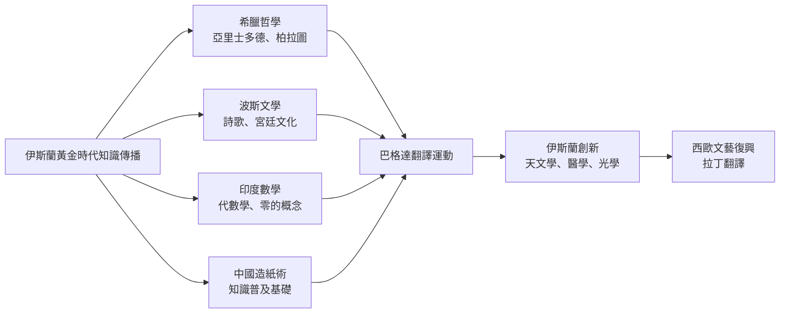

# HIST2170 伊斯蘭世界形成 / The Making of the Islamic World: The Middle East, 500-1500

**Instructor**: Nargis Nurulla
**Department**: History, HKU
**Official source**: [HKU History Course Description 2024-25](https://history.hku.hk/wp-content/uploads/2024/07/HIST-2425.pdf)
**Style**: 袁騰飛式 — 犀利分析：伊斯蘭文明曾經係人類史上最先進文明，但係點解近 500 年落後西方？

---

## 問題 1：5 個核心心智模型

### 心智模型 1：「伊斯蘭黃金時代」——中世紀伊斯蘭文明嘅輝煌
學者 **Hugh Kennedy**（*The Court of the Caliphs*, 2004）記述阿拔斯王朝（750-1258）係人類歷史上文化最繁榮時期之一。學者 **Joel Kraemer**（*Humanism in the Renaissance of Islam*, 1986）分析伊斯蘭黃金時代（8-14 世紀）點樣融合希臘、波斯、印度知識傳統。

- **750-1258** 阿拔斯王朝——伊斯蘭黃金時代
- **830** 智慧之城（Bait al-Hikma）成立——翻譯運動
- **1050-1258** 塞爾柱帝國——突厥-伊斯蘭融合

### 心智模型 2：「伊斯蘭黃金時代終結」——蒙古入侵
學者 **Timothy May**（*The Mongol Conquest in the Islamic World*, 2012）分析：1258 年蒙古攻陷巴格達，屠殺數十萬平民——呢個係伊斯蘭文明史上最大創傷。學者 **Peter Jackson**（*The Delhi Sultanate*, 2003）分析伊斯兰文明向東南亞擴張。

### 心智模型 3：「絲綢之路」——伊斯蘭商人嘅全球網絡
學者 **Richard Bulliet**（*The Case for Islamo-Christian Civilization*, 2004）指出：伊斯蘭商人由摩洛哥延伸至印尼，構成人類最大規模跨文明商業網絡。

### 心智模型 4：「伊斯蘭科學」——點解伊斯蘭黃金時代產生咁多科學創新？
學者 **George Saliba**（*Islamic Science and the Making of the European Renaissance*, 2007）指出：哥白尼天文學其實係改編自伊斯蘭天文學家模型。

### 心智模型 5：「伊斯蘭法學」——沙里亞法點樣塑造穆斯林社會
學者 **John Esposito** 指出：伊斯蘭法學（fiqh）唔單純係宗教法律，而係一套完整嘅社會生活規範。

---

## 問題 2：3 個根本分歧

### 分歧 1：伊斯蘭黃金時代衰落——蒙古入侵定係內部腐敗？
- **A 方（外部論）**：1258 年蒙古入侵係決定性打擊，令伊斯蘭文明元气大傷
- **B 方（內部論）**：阿拔斯王朝晚期已經腐敗，蒙古入侵只係加速衰落

### 分歧 2：伊斯蘭科學——西方文藝復興受益幾多？
- **A 方（大量借用派）**：**George Saliba**——西歐文藝復興大量借鑑伊斯蘭科學
- **B 方（獨立發展派）**：學者認爲西歐文藝復興主要係獨立發展

### 分歧 3：伊斯蘭黃金時代——真實定係神話？
- **A 方（輝煌派）**：伊斯蘭黃金時代確實係人類文明高峰
- **B 方（批判派）**：呢個「黃金時代」神話忽略奴隸制、性別不平等

---

## 問題 3：10 個深度問題

1. 穆罕默德從麥加商人變成宗教領袖——呢個轉變揭示咗乜嘢關於宗教領袖點樣動員群眾？
2. 伊斯蘭黃金時代——巴格達圖書館（智慧之城）點解可以成為世界知識中心？佢哋點解咁願意翻譯其他文明嘅作品？
3. 十字軍東征——點解持續 200 年但係最終失敗？呢個對伊斯蘭世界對西方看法有乜嘢長遠影響？
4. 蒙古入侵巴格達（1258）——人類歷史最殘酷城市屠殺之一。呢個創傷點解塑造伊斯蘭世界對「外部敵人」嘅記憶？
5. 塞爾柱帝國同奥斯曼帝國——點解突厥-伊斯蘭文明可以持續咁耐？而且點解最終又衰落？
6. 伊斯蘭黃金時代科學——伊本·西拿（Avicenna）、伊本·路世德（Ibn Rushd/Averroes）——呢啲人究竟有幾犀利？佢哋嘅作品點解可以流傳到歐洲？
7. 伊斯蘭商人的絲綢之路網絡——點解可以涵蓋範圍咁廣？呢個商業網絡同而家全球化有乜嘢相似？
8. 伊斯蘭法學——點解沙里亞法可以持續演變？而且點解伊斯蘭世界內部對法學解釈差異咁大（遜尼 vs 什葉）？
9. 從歷史角度——點解伊斯蘭世界近 500 年（1500-2000）落後西方？係內因定係外因？
10. 如果你是阿拔斯王朝哈里發——你有世界上最大帝國，但係你知道 300 年後蒙古人會摧毁你的一切。你會點做？

---

# 核心心智模型深化（中英對照）

## 1. 伊斯蘭黃金時代 / Islamic Golden Age

### 1.1 Bilingual 概念對照
- 伊斯蘭黃金時代 (yīsīlán huángjīn shídài) = Islamic Golden Age — 750-1258 年
- 智慧之城 (zhìhuì zhī chéng) = House of Wisdom / Bait al-Hikma — 阿拔斯王朝翻譯中心
- 沙里亞法 (shālǐyàfǎ) = Sharia — 伊斯蘭教法

### 1.3 袁騰飛式犀利觀察
> 「伊斯蘭黃金時代最犀利嘅地方——就係佢哋懂得向所有文明學習！阿拉伯人翻譯希臘哲學、波斯文學、印度數學——然後再創新！但係當佢哋開始覺得自己係最好、最正確，拒絕向外學習，黃金時代就結束了。」

### 1.4 Deep Test Question
**考試題**：比較阿拔斯王朝同同時期西歐文明（加洛林文藝復興）。兩者點解發展方向差異咁大？呢個差異對之後 500 年世界歷史有乜嘢長遠影響？

### 1.5 圖解

---

## 深度自測問題

**Q1-Q10** 精簡版：
- Q1：穆罕默德動員能力——因為佢提供一個超越部落忠誠嘅身份認同（ umma）；呢個方法同現代民族主義動員有相似之處。
- Q2：智慧之城之所以成功——因為阿拔斯王朝需要一個「知識合法性」來鞏固統治；而且當時伊斯蘭帝國係最大嘅跨文明貿易網絡，商人帶嚟多元知識。
- Q3：十字軍失敗——因為伊斯蘭世界有强大抵扰能力；而且十字軍只係外來力量，無法建立持久管治。
- Q4：蒙古創傷——呢個記憶塑造伊斯蘭世界「外部威脅」心理；塞爾柱帝國抵抗蒙古、奥斯曼帝國抵抗西方——持續幾百年外患心理。
- Q5：突厥-伊斯蘭文明——能夠融合突厥武力 + 伊斯蘭宗教 + 波斯文化，三者缺一不可。
- Q6：Avicenna（伊本·西拿）——《Canon of Medicine》成為歐洲醫學標準教材直到 18 世紀；呢個例子說明伊斯蘭科學傳播西方嘅規模。
- Q7：伊斯蘭商業網絡——呢個網絡同而家跨國公司有相似之處：商人跨文化做生意，但係唔需要政治統一。
- Q8：沙里亞法之所以持續演變——因為伊斯蘭法學傳統有「ijtihad」（獨立判斷）原則，允許學者根據變化條件重新解釈法律。
- Q9：衰落原因——多因素：蒙古入侵 + 缺乏持續創新 + 奥斯曼帝國僵化 + 歐洲商業崛起；內外因素缺一不可。
- Q10：歷史假設題——哈里發困境：點解無法預見蒙古威脅？因為蒙古崛起太快、資訊傳遞有限。

---

## 總結

**HIST2170 The Making of the Islamic World** 嘅核心價值：
1. **理解伊斯蘭文明複雜性**——伊斯蘭世界唔係單一整體，而係多元文化、宗教、政治傳統交織
2. **批判性分析**——挑戰「伊斯蘭 vs 西方」呢個錯誤二元對立
3. **全球史視角**——伊斯蘭文明係連接歐亞非嘅橋樑

**袁騰飛金句**：
> 「歷史教會我哋：任何文明都有高峰同衰落——問題唔係邊個文明高峰，而係當你處於高峰之時，你會唔會開始觉得自己唔需要向任何人學習。」

---

## 延伸閱讀

1. Kennedy, Hugh. *The Court of the Caliphs: The Rise and Fall of Islam's Greatest Dynasty*. London: Weidenfeld & Nicolson, 2004.
2. Saliba, George. *Islamic Science and the Making of the European Renaissance*. Cambridge: MIT Press, 2007.
3. Bulliet, Richard W. *The Case for Islamo-Christian Civilization*. New York: Columbia University Press, 2004.
4. May, Timothy. *The Mongol Conquest in the Islamic World*. Cambridge: Cambridge University Press, 2012.
5. Esposito, John L. *The Oxford History of Islam*. Oxford: Oxford University Press, 1999.
6. Hodgson, Marshall G.S. *The Venture of Islam*. 3 vols. Chicago: University of Chicago Press, 1974.
