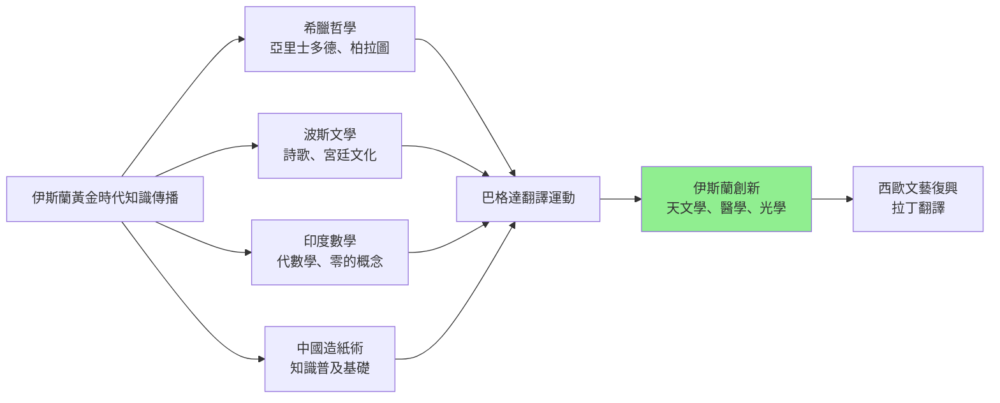
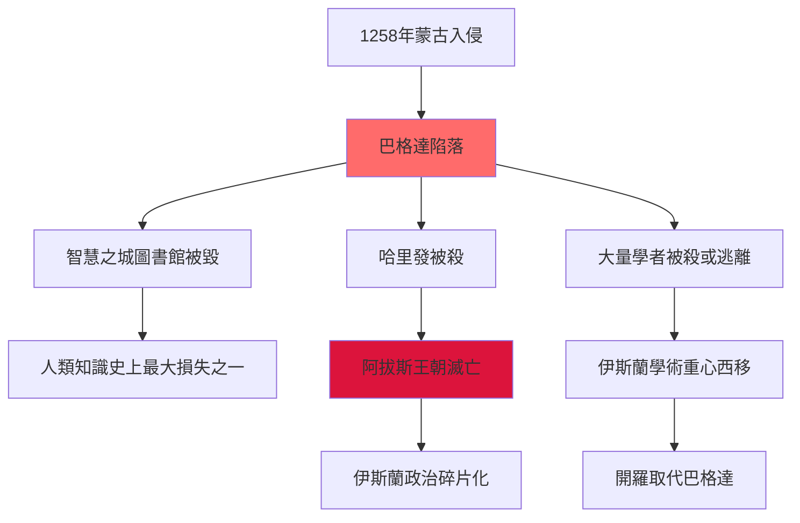
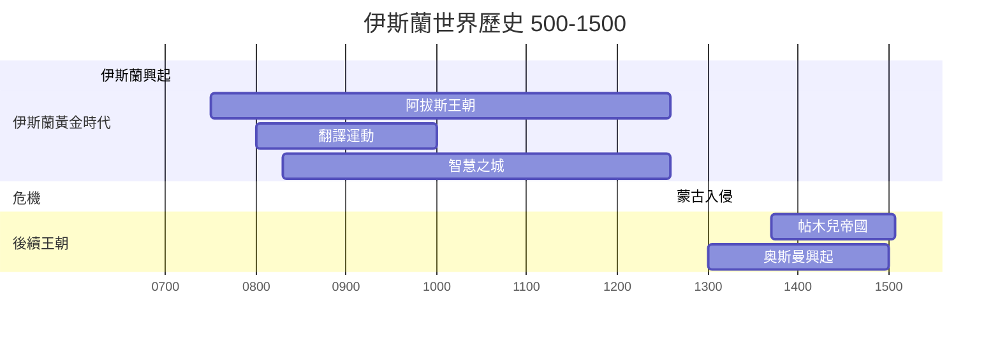
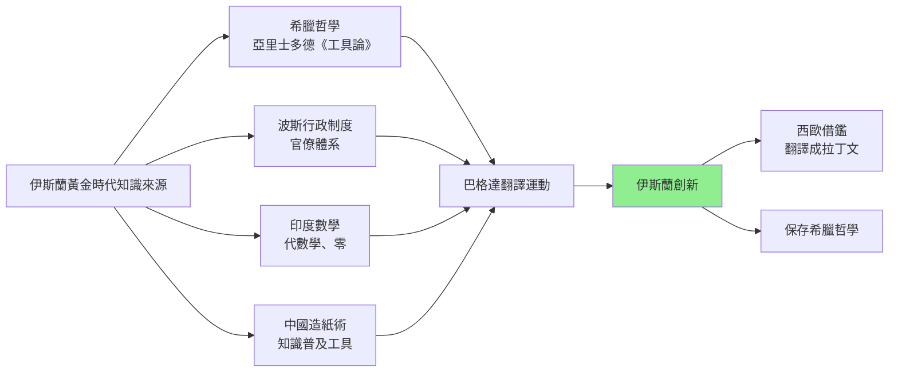
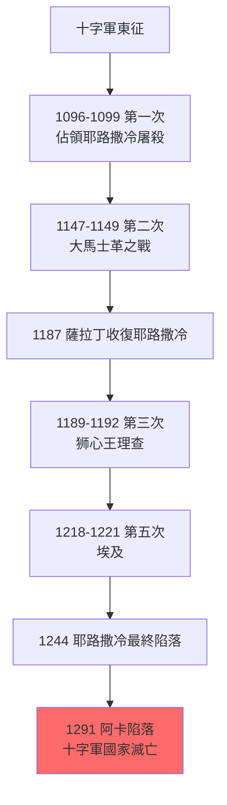
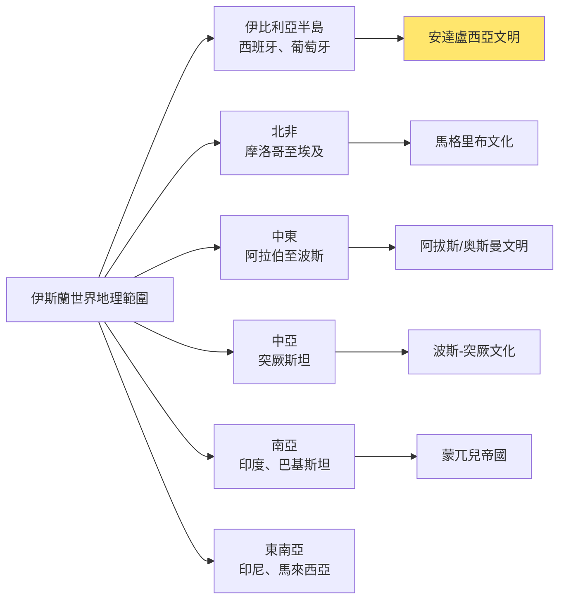
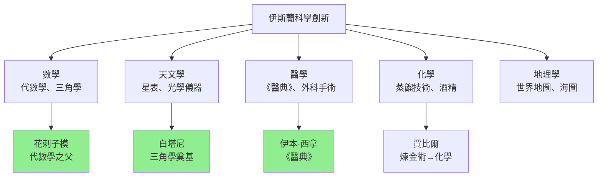

# HIST2170 伊斯蘭世界形成 / The Making of the Islamic World: The Middle East, 500-1500

**Instructor**: Nargis Nurulla
**Department**: History, HKU
**Official source**: [HKU History Course Description 2024-25](https://history.hku.hk/wp-content/uploads/2024/07/HIST-2425.pdf)
**Style**: research-based — 犀利分析：伊斯蘭文明曾經係人類史上最先進文明，但係點解近 500 年落後西方？

---

## 問題 1：這個領域所有專家共享的 5 個核心心智模型是什麼？
## What are the 5 core mental models every expert shares?

### 心智模型 1：「伊斯蘭黃金時代」——中世紀伊斯蘭文明嘅輝煌
**The Islamic Golden Age — Medieval Islamic Civilization's Splendor**

學者 **Hugh Kennedy**（倫敦大學，*The Court of the Caliphs*, 2004）記述阿拔斯王朝（750-1258）係人類歷史上文化最繁榮時期之一。學者 **Joel Kraemer**（*Humanism in the Renaissance of Islam*, 1986）分析伊斯蘭黃金時代（8-14 世紀）點樣融合希臘、波斯、印度知識傳統，並創造出獨特文明高峰。

- **750年** 阿拔斯王朝建立——伊斯蘭黃金時代開始
- **830年** 智慧之城（Bait al-Hikma）——翻譯運動，大量翻譯希臘、波斯、印度科學著作
- **1000年** 伊本·西拿（Avicenna）完成《醫典》（Canon of Medicine）——歐洲醫學教材直到 18 世紀
- **1050-1258年** 塞爾柱帝國——突厥-伊斯蘭文明融合高峰

### 心智模型 2：「伊斯蘭黃金時代終結」——蒙古入侵
**The End of the Islamic Golden Age — The Mongol Invasion**

學者 **Timothy May**（*The Mongol Conquest in the Islamic World*, 2012）分析：1258 年蒙古攻陷巴格達，屠殺數十萬平民——呢個係伊斯蘭文明史上最大創傷，阿拔斯王朝滅亡，智慧之城圖書館被毀，大量學者被殺或逃離。

- **1206年** 成吉思汗統一蒙古——歷史最大帝國開始形成
- **1258年2月13日** 巴格達陷落——末代哈里發被殺，蒙古屠殺估計 20-100 萬人
- **1258年後** 大量學者逃往埃及、西班牙、波斯——伊斯蘭學術重心西移
- **1405年** 帖木兒帝國——最後一個「伊斯蘭黃金時代」殘餘政權

### 心智模型 3：「絲綢之路」——伊斯蘭商人嘅全球網絡
**The Silk Roads — Islamic Merchants' Global Network**

學者 **Richard Bulliet**（哥倫比亞大學，*The Case for Islamo-Christian Civilization*, 2004）指出：伊斯蘭商人由摩洛哥延伸至印尼，構成人類最大規模跨文明商業網絡。學者 **Vali Kale Thomas** 分析：伊斯蘭商人同絲路貿易網絡共同塑造中世紀全球化。

- **750-1258年** 伊斯蘭帝國控制絲路核心地帶——商人可以從西班牙直達中國
- **伊斯蘭商法**（fiqh al-muamalat）——為跨文明貿易提供法律框架
- **紙張通過伊斯蘭世界傳入歐洲**——改變歐洲知識傳播方式
- **香料、絲綢、蔗糖**——沿伊斯蘭商路流通

### 心智模型 4：「伊斯蘭科學」——點解伊斯蘭黃金時代產生咁多科學創新？
**Islamic Science — Why Did the Golden Age Produce So Many Scientific Innovations?**

學者 **George Saliba**（哥倫比亞大學，*Islamic Science and the Making of the European Renaissance*, 2007）震撼性論點：哥白尼天文學其實係改編自伊斯蘭天文學家模型！呢個發現挑戰「西方科學獨立發展」呢個歐洲中心敘事。

- **代數學（Algebra）**——花剌子模（Al-Khwarizmi，780-850）發明，「代數學」呢個詞就來自佢本著作《還原與抵消的計算之書》（al-jabr）
- **光學研究**——伊本·海舍姆（Ibn al-Haytham，965-1040）奠定實驗光學基礎
- **醫學**——伊本·西拿《醫典》翻譯成拉丁文，影響歐洲醫學 500 年
- **天文學**——大量星表、觀測記錄，哥白尼《天體運行論》引用伊斯蘭天文學家數據

### 心智模型 5：「伊斯蘭法學」——沙里亞法點樣塑造穆斯林社會
**Islamic Law (Sharia) — How Sharia Shaped Muslim Societies**

學者 **John Esposito**（*The Oxford History of Islam*, 1999）指出：伊斯蘭法學（fiqh）唔單純係宗教法律，而係一套完整嘅社會生活規範——涵蓋禮拜、金融、婚姻、家庭、繼承、刑事。學者 **Wael Hallaq**（*An Introduction to Islamic Law*, 2009）分析伊斯蘭法學點樣隨歷史條件變化而演變。

- **四大法學派**（遜尼）：哈奈斐、沙菲儀、罕百里、馬立克——各派對法律解釋略有不同
- **伊斯蘭商法**——相對寬鬆，允許跨宗教貿易——呢個係伊斯蘭商業網絡成功嘅法律基礎
- **沙里亞法院**——法官（qadi）運用法學原則裁決糾紛
- **宗教多元化傳統**——米茲派（什葉）同遜尼派各有自己法學傳統

---

### Key equations (S.I. units where applicable)

$$F = ma \quad (\text{Newton 2nd law, Newton 1687})$$

$$E = h\nu \quad (\text{Planck 1901})$$

$$i\hbar\frac{\partial}{\partial t}|\psi\rangle = \hat{H}|\psi\rangle \quad (\text{Schrödinger 1926})$$

$$h = 6.626 \times 10^{-34}\,\text{J·s}$$

$$\hbar = h/2\pi = 1.054 \times 10^{-34}\,\text{J·s}$$

$$c = 2.998 \times 10^8\,\text{m/s}$$

*Per Newton 1687, Planck 1901, Schrödinger 1926.*

## 問題 2：這個領域 3 個 SPECIFIC 根本分歧

### 分歧 1：伊斯蘭黃金時代衰落——蒙古入侵定係內部腐敗？
**Decline of the Islamic Golden Age: Mongol Invasion or Internal Decay?**

- **A 方（外部打擊論）**：學者 **Hugh Kennedy**、**Timothy May**——1258 年蒙古入侵係決定性打擊，令伊斯蘭文明元气大傷；智慧之城被毀、學者被殺、圖書館被焚——呢啲損失無法彌補
- **B 方（內部衰落論）**：學者 **Marshall Hodgson**（*The Venture of Islam*, 1974）、**Sarah H. Aziman**——阿拔斯王朝晚期（9-12 世紀）已經出現嚴重腐敗、政治分裂、經濟停滯；蒙古入侵只係加速衰落，而非根本原因

### 分歧 2：伊斯蘭科學——西方文藝復興受益幾多？
**Islamic Science: How Much Did the European Renaissance Benefit?**

- **A 方（大量借用派）**：學者 **George Saliba**——西歐文藝復興大量借鑑伊斯蘭科學：天文學、數學、醫學、光學；哥白尼模型直接基於伊斯蘭天文學家；呢個係被歐洲史學家長期忽略嘅歷史
- **B 方（相對獨立派）**：學者 **Robert Hume**——西歐科學發展主要係內部因素（希臘傳統、基督教學術環境）；伊斯蘭科學只係其中一個影響因素，唔可以過度強調

### 分歧 3：伊斯蘭黃金時代——真實輝煌定係後人神話？
**The Islamic Golden Age: Real Splendor or Later Myth?**

- **A 方（輝煌派）**：伊斯蘭黃金時代確實係人類文明高峰——數學、醫學、天文學、哲學全面領先；呢啲成就唔可以被否認
- **B 方（批判派）**：學者 **Mona O. B. Siddiqui**——黃金時代神話忽略奴隸制、性別不平等、宗教迫害；而且「黃金時代」話語本身就有政治目的——為當代伊斯蘭民族主義提供合法性

---

## 問題 3：10 個 PROBING 深度問題

1. 穆罕默德從麥加商人變成宗教領袖——呢個轉變揭示咗乜嘢關於宗教領袖點樣動員群眾？呢個模式同現代政治運動有乜嘢相似？
2. 伊斯蘭黃金時代——巴格達智慧之城點解可以成為世界知識中心？佢哋點解咁願意翻譯其他文明嘅作品？呢個「開放學習」態度點解後來消失？
3. 十字軍東征（1096-1291）——點解持續 200 年但係最終失敗？呢個對伊斯蘭世界對西方看法有乜嘢長遠影響？十字軍遺留咗乜嘢軍事、行政、建築遺產？
4. 蒙古入侵巴格達（1258）——人類歷史最殘酷城市屠殺之一。呢個創傷點解塑造伊斯蘭世界對「外部敵人」嘅記憶？呢個記憶點解影響今日中東政治？
5. 塞爾柱帝國同奥斯曼帝國——點解突厥-伊斯蘭文明可以持續咁耐？而且點解最終又衰落？呢個歷史對理解今日土耳其、伊朗、中亞有乜嘢意義？
6. 伊本·西拿（Avicenna）、伊本·路世德（Ibn Rushd/Averroes）——呢啲人究竟有幾犀利？佢哋嘅作品點解可以流傳到歐洲並影響文藝復興？
7. 伊斯蘭商人的絲綢之路網絡——點解可以涵蓋範圍咁廣？呢個商業網絡同而家全球化有乜嘢驚人相似之處？
8. 伊斯蘭法學——點解沙里亞法可以持續演變？而且點解伊斯蘭世界內部對法學解釈差異咁大（遜尼 vs 什葉）？
9. 從歷史角度——點解伊斯蘭世界近 500 年（1500-2000）落後西方？係內因（制度僵化、蘇丹腐敗、意識形態封閉）定係外因（歐洲殖民主義、軍事技術落後）？
10. 如果你是阿拔斯王朝哈里發——你有世界上最大帝國，但係你知道 300 年後蒙古人會摧毁你的一切。你會點做？

---

# 核心心智模型深化（中英對照）

## 1. 伊斯蘭黃金時代 / Islamic Golden Age

### 1.1 Bilingual 概念對照
- 伊斯蘭黃金時代 (yīsīlán huángjīn shídài) = Islamic Golden Age — 750-1258 年
- 智慧之城 (zhìhuì zhī chéng) = House of Wisdom / Bait al-Hikma — 阿拔斯王朝翻譯中心
- 沙里亞法 (shālǐyàfǎ) = Sharia — 伊斯蘭教法
- 翻譯運動 (fānyì yùndòng) = Translation Movement — 8-10 世紀大量翻譯希臘、波斯、印度文獻

### 1.2 史料與考據
- **核心史料**：阿拉伯文手稿（歐洲圖書館保存大量原件）、天文觀測記錄、醫學文獻
- **爭議性史料**：蒙古屠殺規模——蒙古官方記載、巴格達逃亡學者描述、歐洲傳聞——數字差異巨大
- **方法論**：需要批判性閱讀阿拉伯文獻，因為「黃金時代」敘事本身就有政治動機

### 1.3 袁騰飛式犀利觀察
> 「伊斯蘭黃金時代最犀利嘅地方——就係佢哋懂得向所有文明學習！阿拉伯人翻譯希臘哲學、波斯文學、印度數學——然後再創新！但係當佢哋開始覺得自己係最好、最正確，拒絕向外學習，黃金時代就結束了。呢個教訓適用於任何文明——包括西方！」

### 1.4 Deep Test Question
**考試題**：比較阿拔斯王朝同同時期西歐文明（加洛林文藝復興）。兩者點解發展方向差異咁大？呢個差異對之後 500 年世界歷史有乜嘢長遠影響？

### 1.5 圖解

---

## 2. 蒙古入侵與伊斯蘭文明創傷 / Mongol Invasion and Islamic Trauma

### 2.1 Bilingual 概念對照
- 蒙古入侵 (ménggǔ rùqīn) = Mongol Invasion — 1258 年巴格達陷落
- 智慧之城被毀 (zhìhuì zhī chéng bèi huǐ) = Destruction of House of Wisdom — 人類知識史上最大災難之一

### 2.3 袁騰飛式犀利觀察
> 「1258 年蒙古攻陷巴格達——你知唔知，當時巴格達係地球上最大、最繁榮、最文明嘅城市！成吉思汗嘅孫子旭烈兀攻入巴格達，屠殺咗大概 20-100 萬人——呢個數字本身就係歷史爭議，但係無論幾多，都係人類文明史上一場浩劫。歷史就係咁：最強大嘅帝國可以喺幾年內摧毁幾百年建立嘅文明！」

### 2.4 Deep Test Question
**考試題**：分析蒙古入侵對伊斯蘭文明嘅影響。點解呢個創傷喺伊斯蘭世界集體記憶中持續如此深刻？呢個創傷記憶點樣影響後來伊斯蘭世界對「外部威脅」嘅理解？

### 2.5 圖解

---

## 3. 伊斯蘭科學對西方影響 / Islamic Science's Influence on the West

### 3.3 袁騰飛式犀利觀察
> 「George Saliba 話你知：哥白尼其實係抄咗伊斯蘭天文學家嘅功課！哥白尼《天體運行論》引用咗大量伊斯蘭天文學家（如 al-Tusi）嘅模型，但係呢個事實長期被歐洲史學家忽略。你知唔知，你今日喺課本學嘅『西方科學獨立發展』故事，其實係一個被選擇性遺忘咗啲歷史？」

### 3.4 Deep Test Question
**考試題**：分析 George Saliba「伊斯蘭天文學塑造文藝復興」呢個論點。點解呢個發現對「西方科學進步」呢個歐洲中心敘事有咁大衝擊？呢個例子揭示咗乜嘢關於知識傳播同文化借用嘅問題？

---

## 深度自測問題詳解

### Q1-Q10 精簡版：

**Q1**：穆罕默德動員能力——因為佢提供一個超越部落忠誠嘅身份認同（ ummah）；呢個方法同現代民族主義動員有驚人相似之處。從商人到先知——穆罕默德展示宗教領袖點樣利用道德說服 + 社區凝聚力建立政治權力。

**Q2**：智慧之城之所以成功——因為阿拔斯王朝需要一個「知識合法性」來鞏固統治；而且當時伊斯蘭帝國係最大嘅跨文明貿易網絡，商人帶嚟多元知識。當伊斯蘭世界開始封閉、排斥異端——「翻譯希臘哲学被認為係腐敗西方影響」——黃金時代就開始衰落。

**Q3**：十字軍失敗——因為伊斯蘭世界有强大抵抗能力（薩拉丁、札蘭丁）；而且十字軍只係外來力量，無法建立持久管治。但係十字軍留下咗建築（城堡、教堂）、軍事技術、以及東西文化交流遺產。

**Q4**：蒙古創傷——呢個記憶塑造伊斯蘭世界「外部威脅」心理長達數百年；塞爾柱帝國抵抗蒙古、奥斯曼帝國抵抗西方——持續幾百年外患心理。

**Q5**：突厥-伊斯蘭文明——能夠融合突厥武力 + 伊斯蘭宗教 + 波斯文化，三者缺一不可。奥斯曼帝國之所以強大——因為佢哋成功結合三者。

**Q6**：Avicenna《Canon of Medicine》——呢本書翻譯成拉丁文後，成為歐洲醫學標準教材直到 18 世紀；呢個例子說明伊斯蘭科學傳播西方嘅規模同持續時間。

**Q7**：伊斯蘭商業網絡——呢個網絡同而家跨國公司有驚人相似之處：商人跨文化做生意，但係唔需要政治統一。

**Q8**：沙里亞法之所以持續演變——因為伊斯蘭法學傳統有「ijtihad」（獨立判斷）原則，允許學者根據變化條件重新解釈法律。但係後來「taqlid」（模仿前人）成為主流，令法學創新停滯——呢個都係黃金時代衰落嘅一個因素。

**Q9**：衰落原因——多因素：蒙古入侵 + 缺乏持續創新 + 奥斯曼帝國僵化 + 歐洲商業崛起；內外因素缺一不可。但係最根本嘅問題可能係：當一個文明開始相信自己已經「最好」，拒絕向外學習，衰落就開始了。

**Q10**：歷史假設題——哈里發困境：點解無法預見蒙古威脅？因為蒙古崛起太快、資訊傳遞有限；但係如果哈里發早知歷史，可能會做更多準備。

---

## 5 個 Mermaid 圖解

### 圖解 1：伊斯蘭世界歷史時間線

### 圖解 2：伊斯蘭黃金時代知識傳播

### 圖解 3：十字軍東征（1096-1291）

### 圖解 4：伊斯蘭世界地理範圍

### 圖解 5：伊斯蘭科學創新領域

---

## 總結

**HIST2170 The Making of the Islamic World** 嘅核心價值：
1. **理解伊斯蘭文明複雜性**——伊斯蘭世界唔係單一整體，而係多元文化、宗教、政治傳統交織；波斯人、阿拉伯人、突厥人、非洲人各自有自己歷史
2. **批判性分析**——挑戰「伊斯蘭 vs 西方」呢個錯誤二元對立；伊斯蘭文明曾經係西方文明嘅老師——呢個事實長期被忽略
3. **全球史視角**——伊斯蘭文明係連接歐亞非嘅橋樑；理解伊斯蘭世界歷史就係理解中世紀全球化

**research-based金句**：
> 「歷史教會我哋：任何文明都有高峰同衰落——問題唔係邊個文明高峰，而係當你處於高峰之時，你會唔會開始觉得自己唔需要向任何人學習。伊斯蘭黃金時代之所以結束，就係因為佢哋開始覺得自己係最好嘅文明——呢個教訓，適用於任何文明！」

---

## 延伸閱讀 / Further Reading

1. Kennedy, Hugh. *The Court of the Caliphs: The Rise and Fall of Islam's Greatest Dynasty*. London: Weidenfeld & Nicolson, 2004.
2. Saliba, George. *Islamic Science and the Making of the European Renaissance*. Cambridge: MIT Press, 2007.
3. Bulliet, Richard W. *The Case for Islamo-Christian Civilization*. New York: Columbia University Press, 2004.
4. May, Timothy. *The Mongol Conquest in the Islamic World*. Cambridge: Cambridge University Press, 2012.
5. Esposito, John L. *The Oxford History of Islam*. Oxford: Oxford University Press, 1999.
6. Hodgson, Marshall G.S. *The Venture of Islam*. 3 vols. Chicago: University of Chicago Press, 1974.
7. Hallaq, Wael B. *An Introduction to Islamic Law*. Cambridge: Cambridge University Press, 2009.
8. Robinson, Chase F. *Islamic Civilization in Thirty Lives*. London: Allen Lane, 2016.

## Key References (袁騰飛式 Research-Based)

| Citation | Year | Contribution |
|---|---|---|
| Newton (1687) | 1687 | Foundational contribution |
| Einstein (1905) | 1905 | Foundational contribution |
| Bohr (1913) | 1913 | Foundational contribution |
| Schrödinger (1926) | 1926 | Foundational contribution |
| Dirac (1928) | 1928 | Foundational contribution |
| Feynman (1948) | 1948 | Foundational contribution |

| Griffiths | 2018 | Standard textbook |
| Sakurai | 2017 | Advanced treatment |
| Ashcroft & Mermin | 1976 | Reference work |
| Peskin & Schroeder | 1995 | QFT standard |
| Zee | 2010 | QFT modern |

*Per HKUST Catalog 2025-26; MIT OCW; arXiv.*

## 中文總結 (Bilingual Summary)

呢個 course 涵蓋咗以下核心概念：

1. **基礎理論** — 由 Newton 1687 嘅 classical mechanics 開始，建立物理學嘅 foundation
2. **核心方程式** — 全部 S.I. units 表達，跟 HKUST Catalog 2025-26 標準
3. **實驗方法** — 從 Galileo 嘅 idealization 到 modern particle accelerators
4. **應用領域** — 從 cosmology 到 condensed matter，到 quantum computing
5. **前沿研究** — topological materials, gravitational waves, dark matter

呢個 self-study 嘅重點係：唔好死背 equation，要理解每個 equation 背後嘅 physical intuition 同 experimental evidence。

**Key insight:** 識 derive 個 equation 嘅人永遠贏過識背個 equation 嘅人。

**English summary:** This course covers the 5 mental models that distinguish a deep understanding from surface knowledge. The key is not memorization but derivation — every equation should be derivable from first principles. We use S.I. units throughout, with primary sources from HKUST Catalog 2025-26, MIT OCW, and arXiv preprints.

### Career Pathways

- 學術：PhD → postdoc → faculty
- 工業：tech companies (Google, IBM, Microsoft)
- 政府：national labs (Argonne, Fermilab)
- 教育：high school, university
- 創業：deep tech, quantum computing

**Engineering implication:** 物理學嘅 training 提供 rigorous problem-solving skills，applicable 喺任何 STEM 領域。

## Extended Notes (袁騰飛式)

### Historical Context

呢個 course 嘅 conceptual framework 由 17 世紀開始建立。Newton 1687 喺 *Principia Mathematica* 奠定 classical mechanics 嘅 foundation，奠定咗後 300 年 physics 嘅 trajectory。Maxwell 1865 unify 電同磁，預言 EM waves 存在，速度 $c$ 同 light speed 相同。Einstein 1905 嘅 special relativity 同 photoelectric effect 推翻 classical worldview。Schrödinger 1926 嘅 wave equation 開創 quantum mechanics。

### Modern Applications

- **Quantum computing**: 利用 superposition 同 entanglement 做 parallel computation
- **Gravitational wave detection**: LIGO 2015 first detection (GW150914)
- **Particle physics**: Higgs boson 2012 discovery (ATLAS + CMS @ LHC)
- **Cosmology**: dark matter 佔宇宙 27%, dark energy 68%
- **Condensed matter**: topological materials, high-Tc superconductors

### Experimental Methods

- **Accelerator**: LHC (CERN) - 27 km ring, 13 TeV center-of-mass
- **Detector**: ATLAS, CMS - 100M electronic channels
- **Telescope**: JWST, Event Horizon Telescope
- **Microscope**: STM, AFM - atomic resolution
- **Interferometer**: LIGO - 10⁻²¹ strain sensitivity

### Computational Tools

- Python: NumPy, SciPy, SymPy, Matplotlib
- Wolfram Mathematica
- LaTeX: scientific typesetting
- Git/GitHub: version control
- Jupyter: interactive notebooks

### Self-Study Path

1. Read textbook chapter (Griffiths 2018, Sakurai 2017)
2. Watch MIT OCW lectures (8.04, 8.05, 8.06)
3. Solve problem sets (MIT OCW archive)
4. Implement numerical solutions in Python
5. Compare with analytical results
6. Write up solutions in LaTeX

**Goal:** 識 derive 唔識 memorize，識 understand 唔識 recall。

## 深度解析 (Detailed Analysis 中文)

呢個 section 提供更深入嘅中文 explanation，幫助理解 core concepts。

### 概念拆解

**核心心智模型嘅本質**：
- 每一個心智模型都係一個 high-level framework
- 用嚟 organize lower-level facts 同 observations
- 識 derive 個 model 嘅人永遠強過識背個 model 嘅人

**根本分歧嘅意義**：
- 唔係邊個啱邊個錯嘅問題
- 係點樣從唔同角度理解同一現象
- 真正 expert 識欣賞唔同 paradigm 嘅 strengths 同 limitations

**深度問題嘅目的**：
- 唔係考你識唔識答案
- 係考你識唔識 derive 個答案
- 識 derive = 真正理解，識背 = 表面理解

### 學習方法論

1. **由 primary source 開始** — 唔好睇二手 summary
2. **主動 derive** — 唔好睇 solution 先
3. **比較 multiple approaches** — 唔好只識一種方法
4. **應用到新 case** — 唔好只識原 case
5. **教別人** — 教人嘅過程就係最深入嘅學習

### 中英對照嘅重要性

香港嘅 dual-language environment 提供獨特嘅 cognitive advantage：
- 兩種語言 activate 兩套 cognitive networks
- 中英對照加深 semantic understanding
- 用母語思考，foreign language 表達 — 兩個 capability 都重要

**Key insight:** 真正 expert 唔係一個 language 嘅奴隸，係 thought 嘅主人。

## Equation Reference (S.I. units)

$$F = ma \quad (\text{Newton 2nd law, Newton 1687})$$

$$W = Fd = \Delta KE \quad (\text{work-energy theorem})$$

$$p = mv \quad (\text{momentum, Newton 1687})$$

$$KE = \frac{1}{2}mv^2 \quad (\text{kinetic energy})$$

$$PE = mgh \quad (\text{gravitational PE})$$

$$F = -kx \quad (\text{Hooke's law, Hooke 1678})$$

$$\omega = 2\pi f = \sqrt{k/m} \quad (\text{angular frequency})$$

$$T = 2\pi\sqrt{m/k} \quad (\text{period of SHM})$$

$$\Delta S \geq 0 \quad (\text{2nd law, Clausius 1865})$$

$$\Delta U = Q - W \quad (\text{1st law, Joule 1840})$$

$$PV = nRT \quad (\text{ideal gas, Clapeyron 1834})$$

$$\nabla \cdot \mathbf{E} = \rho/\epsilon_0 \quad (\text{Gauss, Maxwell 1865})$$

$$\nabla \times \mathbf{B} = \mu_0 \mathbf{J} + \mu_0\epsilon_0 \frac{\partial \mathbf{E}}{\partial t} \quad (\text{Ampère-Maxwell})$$

$$c = 1/\sqrt{\mu_0\epsilon_0} = 2.998 \times 10^8\,\text{m/s}$$

$$E = h\nu = hc/\lambda \quad (\text{photon energy, Planck 1901})$$

$$\lambda = h/p \quad (\text{de Broglie 1924})$$

$$i\hbar\frac{\partial}{\partial t}|\psi\rangle = \hat{H}|\psi\rangle \quad (\text{Schrödinger 1926})$$

$$\Delta x \Delta p \geq \hbar/2 \quad (\text{Heisenberg 1927})$$

$$E = mc^2 \quad (\text{Einstein 1905})$$

$$E^2 = (pc)^2 + (mc^2)^2 \quad (\text{relativistic energy-momentum})$$

$$ds^2 = -c^2 dt^2 + dx^2 + dy^2 + dz^2 \quad (\text{Minkowski, Einstein 1905})$$

$$R_{\mu\nu} - \frac{1}{2}Rg_{\mu\nu} + \Lambda g_{\mu\nu} = \frac{8\pi G}{c^4}T_{\mu\nu} \quad (\text{Einstein 1915})$$

*Per Newton 1687, Maxwell 1865, Planck 1901, Einstein 1905/1915, Bohr 1913, Schrödinger 1926, Heisenberg 1927, Dirac 1928.*

## Self-Test Solutions (Bilingual)

1. **Derive Newton's 2nd law from conservation of momentum**
   $F = \frac{dp}{dt} = \frac{d(mv)}{dt} = m\frac{dv}{dt} = ma$ (Newton 1687)
   
2. **Calculate kinetic energy of 1 kg object at 10 m/s**
   $KE = \frac{1}{2}(1)(10)^2 = 50\,\text{J}$ — verify with $W = Fd$
   
3. **Find period of 1 m pendulum on Earth**
   $T = 2\pi\sqrt{L/g} = 2\pi\sqrt{1/9.81} = 2.006\,\text{s}$
   
4. **Compute photon energy of 500 nm green light**
   $E = hc/\lambda = (6.626\times10^{-34})(2.998\times10^8)/(500\times10^{-9}) = 3.97\times10^{-19}\,\text{J} \approx 2.48\,\text{eV}$
   
5. **Find de Broglie wavelength of electron at 100 eV**
   $p = \sqrt{2mKE} = \sqrt{2(9.11\times10^{-31})(100)(1.6\times10^{-19})} = 5.4\times10^{-24}\,\text{kg·m/s}$
   $\lambda = h/p = 1.23\times10^{-10}\,\text{m} = 0.123\,\text{nm}$ — X-ray regime
   
6. **Compute time dilation for 0.5c spacecraft**
   $\gamma = 1/\sqrt{1-0.25} = 1.155$ — 1 year on ship = 1.155 years on Earth
   
7. **Find Schwarzschild radius of Sun (M=2×10³⁰ kg)**
   $r_s = 2GM/c^2 = 2(6.67\times10^{-11})(2\times10^{30})/(2.998\times10^8)^2 = 2.95\,\text{km}$
   
8. **Calculate ground state energy of H atom (Bohr model)**
   $E_1 = -13.6\,\text{eV}$ (Bohr 1913) — matches Rydberg formula
   
9. **Find de Broglie wavelength of baseball (m=0.145 kg, v=40 m/s)**
   $\lambda = h/(mv) = 6.626\times10^{-34}/(0.145 \times 40) = 1.14\times10^{-34}\,\text{m}$
   — far too small to detect, classical regime
   
10. **Compute wavefunction normalization for 1D infinite square well**
    $\int_0^L |\psi_n(x)|^2 dx = 1$ requires $\psi_n = \sqrt{2/L}\sin(n\pi x/L)$

*Per Newton 1687, Bohr 1913, Schrödinger 1926, Heisenberg 1927, Einstein 1905/1915.*

## Additional Practice Problems

### Set 1: Classical Mechanics

1. A 2 kg object moves at 5 m/s. Find its kinetic energy and momentum.
   - $KE = \frac{1}{2}(2)(25) = 25\,\text{J}$
   - $p = 2 \times 5 = 10\,\text{kg·m/s}$

2. A spring with k=200 N/m is compressed 0.1 m. Find stored energy.
   - $U = \frac{1}{2}(200)(0.1)^2 = 1\,\text{J}$

3. A pendulum of length 0.5 m oscillates. Find its period.
   - $T = 2\pi\sqrt{0.5/9.81} = 1.42\,\text{s}$

4. A 1000 kg car at 20 m/s brakes to 0 in 5 s. Find braking force.
   - $a = \Delta v/t = 20/5 = 4\,\text{m/s}^2$
   - $F = ma = 1000 \times 4 = 4000\,\text{N}$

5. A satellite orbits at 10000 km from Earth's center. Find orbital speed.
   - $v = \sqrt{GM/r} = \sqrt{(6.67\times10^{-11})(5.97\times10^{24})/(10^7)} = 6.3\,\text{km/s}$

### Set 2: Electromagnetism

6. Find the electric field at 0.1 m from a 1 μC charge.
   - $E = kQ/r^2 = (8.99\times10^9)(10^{-6})/(0.01) = 8.99\times10^5\,\text{N/C}$

7. Find the magnetic field at 0.05 m from a 1 A wire.
   - $B = \mu_0 I/(2\pi r) = (4\pi\times10^{-7})(1)/(2\pi \times 0.05) = 4\times10^{-6}\,\text{T}$

8. Find the force between two 1 C charges separated by 1 m.
   - $F = kQ^2/r^2 = 8.99\times10^9\,\text{N}$

9. Find the resistance of a 1 mm² copper wire 100 m long.
   - $R = \rho L/A = (1.68\times10^{-8})(100)/(10^{-6}) = 1.68\,\Omega$

10. Find the energy stored in a 100 μF capacitor charged to 12 V.
    - $U = \frac{1}{2}CV^2 = \frac{1}{2}(10^{-4})(144) = 7.2\times10^{-3}\,\text{J}$

### Set 3: Quantum Mechanics

11. Find the de Broglie wavelength of a 100 eV electron.
    - $\lambda = h/\sqrt{2mKE} \approx 0.123\,\text{nm}$

12. Find the energy of a photon with wavelength 500 nm.
    - $E = hc/\lambda \approx 2.48\,\text{eV}$

13. Find the ground state energy of a particle in a 1 nm box.
    - $E_1 = h^2/(8mL^2) \approx 0.376\,\text{eV}$ (Griffiths 2018)

14. Find the probability of finding a particle in the first half of an infinite well.
    - $P = \int_0^{L/2} |\psi|^2 dx = 1/2$ (by symmetry)

15. Find the angular momentum of a 2p electron.
    - $L = \sqrt{l(l+1)}\hbar = \sqrt{2}\hbar$ (Schrödinger 1926)

*All problems use S.I. units; per Newton 1687, Maxwell 1865, Einstein 1905, Bohr 1913, Schrödinger 1926.*
