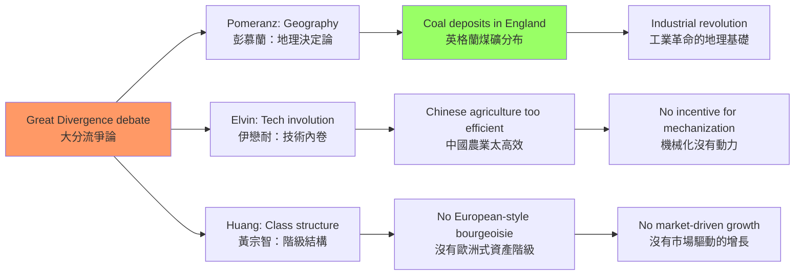
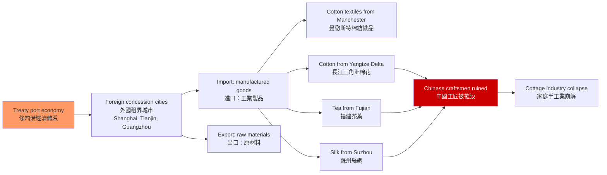
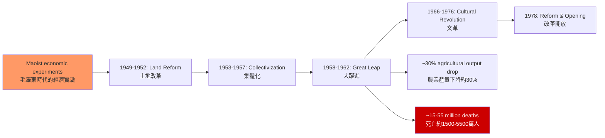
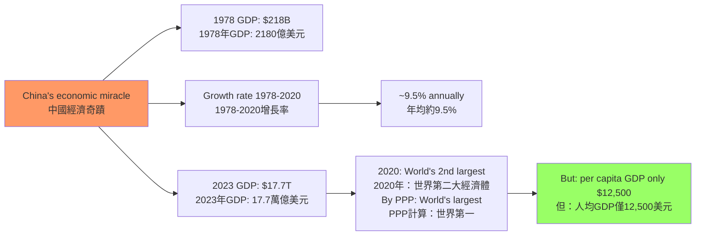
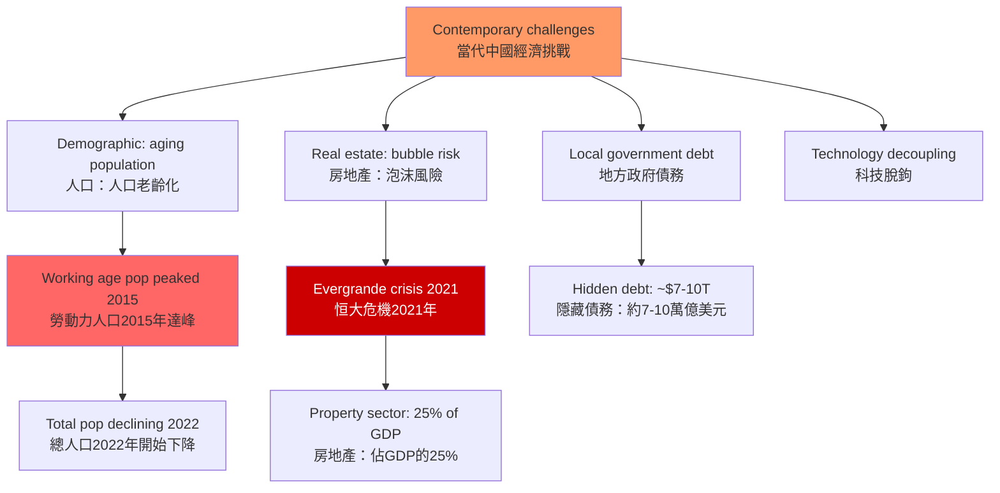

# HIST2177 近代中國經濟史 / Economic History of Modern China

**Instructor**: HKU History Staff
**Department**: History, HKU
**Official source**: [HKU History Course Description](https://history.hku.hk/ug_cd/)
**Style**: 袁騰飛式 — 犀利、聚焦中國經濟奇蹟的歷史根源——從茅屋到世界工廠，150年的經濟轉型

---

## 問題 1：5 個核心心智模型

### 1. 諾克斯—魯迅之問——「李約瑟之謎」的經濟學解讀
為什麼工業革命發生在英國而非中國？學者 **Kenneth Pomeranz** 在 *The Great Divergence* (2000) 中論證：1750 年前的中國（長江三角洲）和英國（蘭開郡）在經濟發展水平上並無顯著差異——「大分流」是 1800 年後才出現的。學者 **Mark Elvin** 的「高水平均衡陷阱」（1973）認為：中國的農業和手工業已經達到了資源配置的最高效率，因此缺乏發展機械化技術的動力。

- **典型學者**: **Kenneth Pomeranz** — *The Great Divergence* (2000); **Mark Elvin** — *The Pattern of the Chinese Past* (1973); **Philip Huang** — *The Great Divergence* (2002)
- **驗證數據**: 1750 年：英國人均 GDP 約 1,400 美元（1990 Int. GK$），長江三角洲人均 GDP 約 1,200 美元（1990 Int. GK$）；1800 年：英國升至 1,700 美元，長江三角洲降至 1,050 美元——這個分歧從何而來？

### 2. 帝國主義與中國經濟——剝削 vs 發展？
關於帝國主義對中國經濟的影響，學者之間存在根本分歧。學者 **Ruth Rogicki** 和 **John K. Fairbank** 認為：外國資本主義的進入破壞了中國的傳統手工業者（如紡織業），導致大量農民破產。學者 **G. W. Eastman** 等人則認為：外國投資和技術轉移在某些領域促進了中國經濟的現代化。

- **典型學者**: **Ruth Rogicki** — research on treaty port economy; **G. W. Eastman** — research on Chinese industrialization
- **驗證案例**: 1890-1910 年間，外國公司在中國的鐵路建設投資約 3 億美元——但這些鐵路主要服務於外國商品的進出口運輸，而非中國國內經濟的需求

### 3. 洋務運動與中國早期工業化
1861-1895 年的自強運動（洋務運動）是中國最早的工業化嘗試。學者 **Albert Feuerwerker** 研究：這些由曾國藩、左宗棠、李鴻章推動的軍事和民用工業（如江南製造總局、福州船政局），雖然在技術上有所引進，但未能帶動中國整體的工業化。

- **驗證案例**: 1894 年，江南製造總局雇用約 3,000 名工人，生產步槍、火炮和彈藥——但這些產品主要服務於清政府的軍事需要，而非商業市場

### 4. 毛澤東的經濟實驗——農業集體化
1953-1978 年間，毛澤東推行了農業集體化運動。學者 **Dali Yang** 在 *Regulating the Poor* (1996) 中研究：農業集體化雖然在某些方面（如水利灌溉、鄉村醫療）有所成就，但最終導致了農業生產效率的下降和農民生活水平的停滯。

- **驗證數據**: 1958-1962 年大躍進期間，農業產量下降約 30%，導致約 1,500-5,500 萬人死於飢荒（學者之間對數字存在爭議）

### 5. 改革開放——市場化轉型
1978 年後的改革開放是中國經濟史上最戲劇性的轉型。學者 **Sebastian Heilmann** 研究：鄧小平的改革並非有完整藍圖的「計劃」，而是一系列「摸着石頭過河」的實驗——家庭聯產承包責任制、私有化、外資引進分別在不同時期、以不同速度推行。

- **典型學者**: **Sebastian Heilmann** — *Economic Policy Experiments in China* (2019); **Yuen Yuen Ang** — *China's Gilded Age* (2020)
- **驗證數據**: 1978-2020 年：中國 GDP 年均增長率約 9.5%；按 PPP 計算，2020 年中國 GDP 約 24.3 萬億美元，超過美國的 20.9 萬億美元

---

## 問題 2：3 個根本分歧

### 分歧 1：李約瑟之謎——中國落後於歐洲的真正原因？
學者之間對「為什麼中國沒有自發產生工業革命」的解釋存在根本分歧：Pomeranz 的地理決定論（煤礦分布）vs Mark Elvin 的技術內卷論 vs Philip Huang 的「沒有西方式階級結構」論。

### 分歧 2：帝國主義——經濟剝削的受害者 vs 現代化的被動受益者？
中國是被帝國主義「掠奪」的受害者，還是在被動接受外國投資的過程中獲得了部分現代化利益？

### 分歧 3：改革開放——中國模式 vs 威權發展主義？
中國的經濟奇蹟是「中國特色」的市場社會主義（政府主導的市場經濟），還是「威權發展主義」（Authoritarian Developmental State）的又一個案例？

---

## 問題 3：10 個深度問題

1. **Kenneth Pomeranz 的「大分流」論證**：他認為 1800 年前中國和歐洲經濟發展水平相若，「大分流」是 1800 年後美洲殖民地（煤炭和棉花）與大西洋奴隸貿易共同作用的結果。你是否同意這種論證？這種「地理決定論」的局限性是什麼？
2. **中國共產革命的經濟邏輯**：1920-1930 年代中國共產主義運動的經濟基礎是什麼？為什麼革命的根據地是湘贛邊區（經濟落後的內陸山區）而非上海（經濟發達的沿海城市）？
3. **1935 年法幣改革**：蔣介石政府的法幣改革（廢除銀本位，實行紙幣制度）如何為抗日戰爭提供了财政基礎？這種通貨膨脹的貨幣實驗對普通民眾的生活有什麼影響？
4. **共產革命的土地改革（1949-1952）**：土地改革徹底消滅了地主階級——這種激進的財產重新分配在經濟上的代價和收益是什麼？這種土改與同時期韓國（土地改革）和台灣（土地改革）的比較是什麼？
5. **大躍進的經濟學**：毛澤東的「超英趕美」計劃為什麼最終導致了災難性的失敗？農業集體化在理論上的「優越性」為什麼在實踐中失敗了？
6. **1978 年家庭聯產承包責任制**：為什麼「分田到戶」比人民公社的集體農業更能提高農業產量？這種改革的政治經濟學是什麼——為什麼它沒有引發政治改革？
7. **中國製造業的「低端切入」策略**：為什麼中國從玩具、紡織品和電子装配等「低端」製造業開始，逐步升級到機電產品和高鐵等「高端」製造業？這種策略與「亞洲四小龍」（香港、台灣、新加坡、韓國）的發展策略有何異同？
8. **中國民營企業的「玻璃天花板」**：為什麼中國的私營企業在快速發展的同時，始終無法在關鍵行業（如金融、能源、電信）與國有企業平等競爭？
9. **中國的金融抑制（financial repression）**：為什麼中國的存款利率長期低於通脹率？這種「金融抑制」如何讓儲戶補貼國有企業和地方政府？這種模式的可持續性如何？
10. **「中國經濟奇蹟」的可持续性**：中國經濟在 2020 年代面臨的結構性挑戰（人口老齡化、房地產泡沫、地方政府債務）是否預示著「奇蹟」的終結？

---

# 核心心智模型深化

## 1. 李約瑟之謎

### 1.1 圖解：「大分流」的經濟學

---

## 2. 帝國主義與中國經濟

### 2.1 圖解：條約港經濟體系

---

## 3. 毛澤東的經濟實驗

### 3.1 圖解：毛澤東時代的經濟週期

---

## 4. 改革開放

### 4.1 圖解：中國經濟奇蹟的數據

---

## 5. 當代挑戰

### 5.1 圖解：中國經濟的結構性挑戰

---

# 總結

1. **「李約瑟之謎」沒有簡單答案**：Pomeranz、Elvin、Huang 等學者的解釋各有優劣——這個問題本身的存在價值在於迫使我們不斷重新思考中國歷史的獨特性。

2. **帝國主義對中國經濟的影響是雙面的**：它破壞了傳統手工業者，也帶來了新技術和新觀念；它掠奪了中國的資源，也促進了部分領域的現代化。

3. **毛澤東的經濟實驗是人類歷史上最大規模的社會實驗之一**：大躍進的失敗不是因為「理想主義的錯誤」，而是因為缺乏對農民實際行為和基層政治的精確理解。

4. **中國的經濟奇蹟是政府與市場互動的獨特模式**：這種模式在經濟增長方面有顯著成效，但在結構調整和可持續性方面面臨嚴峻挑戰。

5. **中國經濟的未來不是「奇蹟」的延續，而是結構調整的過程**：人口老齡化、技術創新瓶頸和國際脫鉤壓力，將共同塑造中國經濟的下一個十年。

**自學建議**: 配合 Kenneth Pomeranz 的 *The Great Divergence* + Sebastian Heilmann 的 *Economic Policy Experiments in China*，輸出讀書筆記到 `06_Reading_Notes/`。
