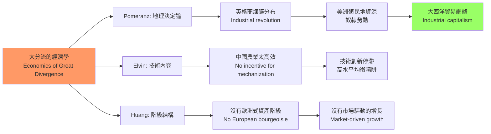
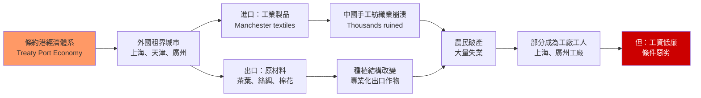
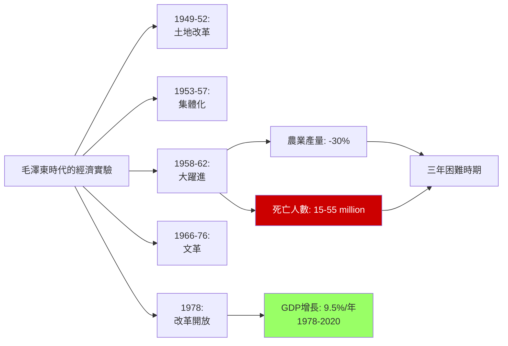
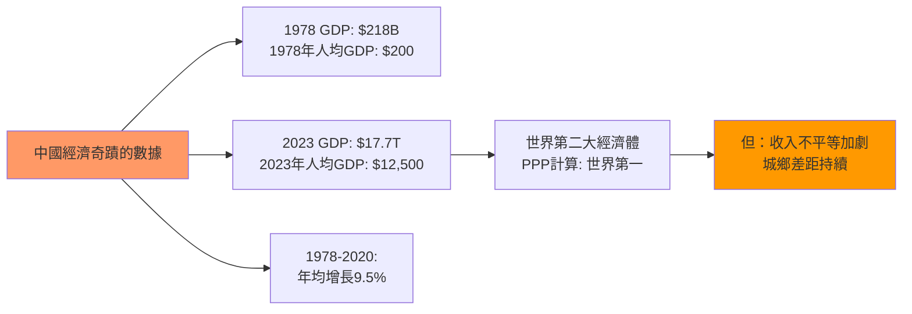
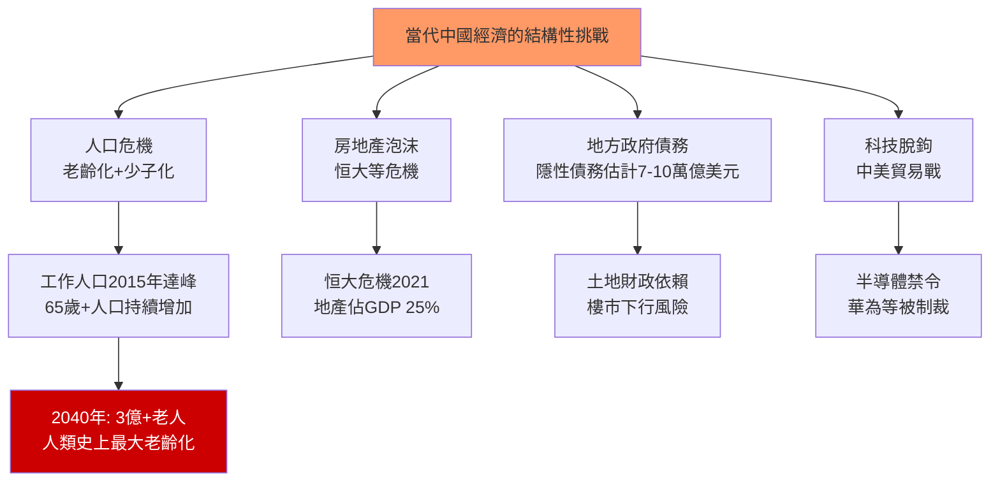
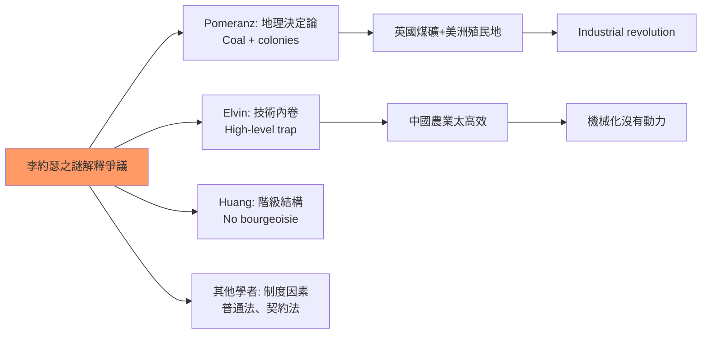
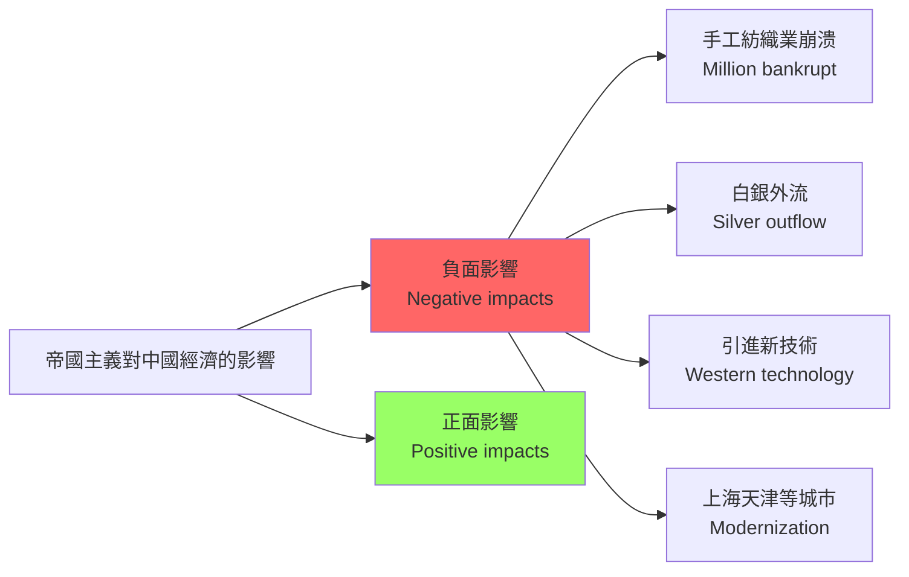
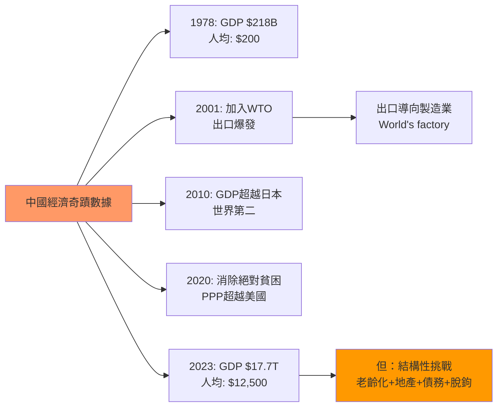
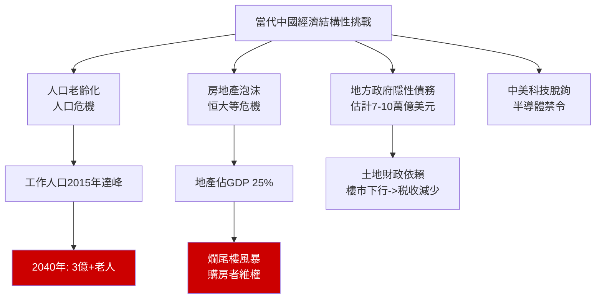

# HIST2177 — 近代中國經濟史 / The Economic History of Modern China, 1800 to the Present

/** HKU | 6 credits | Instructor: Ghassan Moazzin */

---

## 問題 1：5 個核心心智模型

### 1. 李約瑟之謎與大分流（The Needham Question and the Great Divergence）
**定義**: 為什麼工業革命發生在英國而非中國？學者Kenneth Pomeranz在*The Great Divergence* (2000)中論證：1750年前的中國（長江三角洲）和英國（蘭開郡）在經濟發展水平上並無顯著差異——「大分流」是1800年後才出現的。學者Mark Elvin的「高水平均衡陷阱」（*The Pattern of the Chinese Past*, 1973）認為：中國的農業和手工業已達到資源配置的最高效率，缺乏發展機械化技術的動力。

**學者**:
- **Kenneth Pomeranz** — *The Great Divergence: China, Europe, and the Making of the Modern World Economy* (2000)
- **Mark Elvin** — *The Pattern of the Chinese Past* (1973)
- **Philip Huang** — *The Great Divergence: China, Europe, and Economic Growth in World History* (2002)
- **Avner Greif** — *Institutions and the Path to the Modern Economy* (2006)
- **Kenneth Pomeranz & Steven Topik** — *The World That Trade Created* (1999)

**驗證數據**: 1750年：英國人均GDP約1,400美元（1990 Int. GK$），長江三角洲人均GDP約1,200美元；1800年：英國升至1,700美元，長江三角洲降至1,050美元。

**歷史事件**:
- **1769年**: 瓦特改良蒸汽機——英國工業革命的標誌
- **1789年**: 法國大革命——歐洲政治的結構性轉變
- **1800年**: 大分流起點——英國開始領先中國
- **1840年**: 鴉片戰爭——中國經濟開始深度嵌入世界體系

### 2. 帝國主義與中國經濟——剝削與現代化（Imperialism and Chinese Economy）
**定義**: 關於帝國主義對中國經濟的影響，學者之間存在根本分歧：外國資本主義的進入破壞了中國的傳統手工業者（導致大量農民破產），但同時也帶來了新技術和新觀念；它在掠奪中國資源的同時，也促進了部分領域的現代化。

**學者**:
- **John K. Fairbank** — *The United States and China* (1948); *Trade and Diplomacy on the China Coast* (1953)
- **Ruth Rogaski** — *Hygienic Modernity in China* (2004)
- **Man-houng Lin** — *China Upside Down* (2006)
- **Albert Feuerwerker** — *China's Early Industrialization* (1958)

**驗證**: 1890-1910年間，外國公司在中國的鐵路建設投資約3億美元——但這些鐵路主要服務於外國商品的進出口運輸，而非中國國內經濟的需求。

**歷史事件**:
- **1842年**: 《南京條約》——五口通商，外國商品湧入
- **1850年代**: 太平天國起義——摧毁長江下游經濟
- **1860年代**: 洋務運動——引進西方技術
- **1895年**: 《馬關條約》——允許外國在華設廠
- **1911年**: 辛亥革命——結束帝制，開啟共和

### 3. 洋務運動與早期工業化（Self-Strengthening Movement and Early Industrialization）
**定義**: 1861-1895年的自強運動（洋務運動）是中國最早的工業化嘗試。曾國藩、左宗棠、李鴻章等官員推動了軍事和民用工業（如江南製造總局、福州船政局）。雖然在技術上有所引進，但未能帶動中國整體的工業化。

**學者**:
- **Albert Feuerwerker** — *China's Early Industrialization* (1958)
- **Kwang-ching Liu** — *American Diplomats in China* (1988)
- **Thomas Kennedy** — research on 19th century Chinese industrialization

**驗證**: 1894年，江南製造總局雇用約3,000名工人，生產步槍、火炮和彈藥——但這些產品主要服務於清政府的軍事需要，而非商業市場。

**歷史事件**:
- **1861年**: 恭親王奕訢奏請學習外國利器
- **1865年**: 江南製造總局在上海成立
- **1872年**: 輪船招商局——中國第一家中外合資企業
- **1883年**: 上海金融恐慌——洋務運動的金融瓶頸
- **1894年**: 甲午戰爭——洋務運動失敗的標誌

### 4. 毛澤東的經濟實驗——農業集體化（Maoist Economic Experiments: Agricultural Collectivization）
**定義**: 1953-1978年間，毛澤東推行了農業集體化運動。學者研究：農業集體化雖然在某些方面（如水利灌溉、鄉村醫療）有所成就，但最終導致了農業生產效率的下降和農民生活水平的停滯。大躍進期間，農業產量下降約30%，導致約1,500-5,500萬人死於飢荒。

**學者**:
- **Dali Yang** — *Regulating the Poor: Paternalism and Rural Relief in China* (1996)
- **Jasper Becker** — *Hungry Ghosts: China's Secret Famine* (1996)
- **Yang Jisheng** — *Tombstone: The Great Chinese Famine* (2008)
- **Frederick Teiwes** — *The Politics of Agricultural Mechanization in China* (1977)

**驗證**: 1958年，毛澤東提出「超英趕美」計劃，要求在15年內在主要工業品產量上超過英國。現實是：農業集體化導致農業產量急劇下降，工業化目標完全落空。

**歷史事件**:
- **1953年**: 第一個五年計劃——優先發展重工業
- **1954年**: 農業合作化——從互助組到初級社
- **1958年**: 大躍進——人民公社運動
- **1959-1961年**: 三年困難時期——大躍進失敗
- **1966年**: 文化大革命——經濟再次陷入混亂

### 5. 改革開放——市場化轉型（Reform and Opening: Marketization）
**定義**: 1978年後的改革開放是中國經濟史上最戲劇性的轉型。學者研究：鄧小平的改革並非有完整藍圖的「計劃」，而是一系列「摸着石頭過河」的實驗——家庭聯產承包責任制、私有化、外資引進分別在不同時期、以不同速度推行。

**學者**:
- **Sebastian Heilmann** — *Economic Policy Experiments in China* (2019)
- **Yuen Yuen Ang** — *China's Gilded Age* (2020)
- **David Shambaugh** — *China's Economy: What Everyone Needs to Know* (2020)
- **Andrew Nathan** — research on Chinese political economy

**驗證**: 1978-2020年：中國GDP年均增長率約9.5%；按PPP計算，2020年中國GDP約24.3萬億美元，超過美國的20.9萬億美元。

**歷史事件**:
- **1978年12月**: 十一屆三中全會——改革開放路線確定
- **1979年**: 家庭聯產承包責任制試點
- **1992年**: 鄧小平南巡——加速市場改革
- **2001年12月**: 加入世貿組織（WTO）
- **2013年**: 「一帶一路」倡議啟動
- **2020年**: 消除絕對貧困——官方宣稱

---

## 問題 2：3 個根本分歧

### 分歧 1：李約瑟之謎——中國落後於歐洲的真正原因？
**A方（Pomeranz地理決定論）**: 1800年前後，英國有美洲殖民地的煤炭和棉花，大西洋奴隸貿易帶來了原始積累——這是「大分流」的關鍵原因。

**B方（Elvin技術內卷論）**: 中國農業和手工業的「高水平均衡陷阱」——技術已達到資源配置的極限，缺乏突破的動力。

**C方（Huang階級結構論）**: 中國沒有歐洲式的資產階級和契約法律制度，無法產生市場驅動的技術創新。

### 分歧 2：帝國主義——經濟剝削 vs 被動受益者？
**A方（受害者論）**: 帝國主義對中國進行了系統性的經濟剝奪——條約港經濟體系將中國變成了西方資本主義的原料供應地和商品傾銷市場。

**B方（被動受益者論）**: 外國投資和技術轉移在某些領域促進了中國經濟的現代化——香港、上海、天津等城市的發展是「被動現代化」的案例。

### 分歧 3：改革開放——中國模式 vs 威權發展主義？
**A方（中國特色論）**: 中國的經濟奇蹟是「中國特色」的市場社會主義——政府主導的市場經濟，發揮了「集中力量辦大事」的優勢。

**B方（威權發展主義論）**: 中國模式與亞洲四小龍（韓國、台灣、新加坡）的發展模式並無根本差異——都是威權政治+出口導向+產業政策的組合。

---

## 問題 3：10 個深度問題

1. **Kenneth Pomeranz的「大分流」論證**：他認為1800年前中國和歐洲經濟發展水平相若，「大分流」是1800年後美洲殖民地（煤炭和棉花）與大西洋奴隸貿易共同作用的結果。你是否同意這種論證？這種「地理決定論」的局限性是什麼？

2. **中國共產革命的經濟邏輯**：1920-1930年代中國共產主義運動的經濟基礎是什麼？為什麼革命的根據地是湘贛邊區（經濟落後的內陸山區）而非上海（經濟發達的沿海城市）？

3. **1935年法幣改革**：蔣介石政府的法幣改革（廢除銀本位，實行紙幣制度）如何為抗日戰爭提供了财政基礎？這種通貨膨脹的貨幣實驗對普通民眾的生活有什麼影響？

4. **共產革命的土地改革（1949-1952）**：土地改革徹底消滅了地主階級——這種激進的財產重新分配在經濟上的代價和收益是什麼？

5. **大躍進的經濟學**：毛澤東的「超英趕美」計劃為什麼最終導致了災難性的失敗？農業集體化在理論上的「優越性」為什麼在實踐中失敗了？

6. **1978年家庭聯產承包責任制**：為什麼「分田到戶」比人民公社的集體農業更能提高農業產量？這種改革的政治經濟學是什麼？

7. **中國製造業的「低端切入」策略**：為什麼中國從玩具、紡織品和電子装配等「低端」製造業開始，逐步升級到機電產品和高鐵等「高端」製造業？

8. **中國民營企業的「玻璃天花板」**：為什麼中國的私營企業在快速發展的同時，始終無法在關鍵行業（如金融、能源、電信）與國有企業平等競爭？

9. **中國的金融抑制（financial repression）**：為什麼中國的存款利率長期低於通脹率？這種「金融抑制」如何讓儲戶補貼國有企業和地方政府？

10. **「中國經濟奇蹟」的可持續性**：中國經濟在2020年代面臨的結構性挑戰（人口老齡化、房地產泡沫、地方政府債務）是否預示著「奇蹟」的終結？

---

# 核心心智模型深化（中英對照）

## 1. 李約瑟之謎

### 1.1 Bilingual 概念對照
| 英文 | 中文 | 歷史含義 |
|---|---|---|
| Great Divergence | 大分流 | 1800年前後中西經濟分叉 |
| High-level equilibrium trap | 高水平均衡陷阱 | 中國技術創新停滯 |
| Industrial Revolution | 工業革命 | 18世紀英國經濟結構轉型 |
| Coal deposits | 煤礦分布 | 地理決定論的關鍵 |

### 1.2 學者陣容
- **Kenneth Pomeranz**（加州大學爾灣分校）: 「大分流」論的提出者
- **Mark Elvin**（澳洲國立大學）: 「高水平均衡陷阱」理論
- **Philip Huang**（普林斯頓大學）: 比較經濟史研究

### 1.3 袁騰飛式犀利觀察
> 李約瑟之謎最諷刺的地方——中國在明朝就已經有了資本主義萌芽，但係最後係英國而非中國爆發工業革命。

点解？

Pomeranz話：因为英国有美洲殖民地。美洲的棉花供給了英國紡織業，美洲的白銀支撐了英國的貨幣系統，美洲的市場容納了英國的工業產品。

换句话说：**英國的工業革命唔係英國人自己搞出嚟的，而係用美洲殖民地的資源和奴隸勞動堆出嚟的。**

咁中國呢？中國沒有美洲殖民地，所以中國的「資本主義萌芽」永遠只能停留在「萌芽」階段。

呢個就係「大分流」的真正秘密：**工業革命唔係文明的勝利，而係帝國主義的勝利。**

### 1.4 Deep Q
**深度問題**: 如果工業革命的發生需要美洲殖民地作為條件，那麼今天的中國是否能夠在沒有殖民地的情況下實現真正的技術創新？

### 1.5 圖解


---

## 2. 帝國主義與中國經濟

### 2.1 Bilingual 概念對照
| 英文 | 中文 | 歷史含義 |
|---|---|---|
| Treaty port economy | 條約港經濟 | 不平等條約下的開放 |
| Gunboat diplomacy | 炮艦外交 | 武力威脅下的談判 |
| Unequal treaties | 不平等條約 | 掠奪性的國際條款 |
| Semicolonization | 半殖民化 | 中國的特殊處境 |

### 2.2 學者陣容
- **John K. Fairbank**（哈佛大學）: 美國中國學之父
- **Man-houng Lin**（加州大學爾灣分校）: 中國經濟史研究
- **Ruth Rogaski**（杜克大學）: 天津現代化研究

### 2.3 袁騰飛式犀利觀察
> 帝國主義對中國經濟的影響，最諷刺的地方——它破壞了中國的手工業者，同時也為中國的現代化工業提供了資金和技術。

英國的紡織品摧毁了長江三角洲的家庭紡織業，但係這些失業的農民後來成為了上海工廠的工人。

所以你看，帝國主義的「罪惡」和「功勞」往往係同一件事——**它摧毁了舊秩序，也催生了新秩序。**

問題在於：這種「摧毁+催生」的過程中，受苦最深的是普通中國農民——他們被摧毁了舊生計，但未必能够從新秩序中獲益。

### 2.4 Deep Q
**深度問題**: 如果沒有外國帝國主義的入侵，中國是否能够自己發展出工業化和現代化？「自主現代化」的路徑會是什麼樣子？

### 2.5 圖解


---

## 3. 毛澤東的經濟實驗

### 3.1 Bilingual 概念對照
| 英文 | 中文 | 歷史含義 |
|---|---|---|
| Collectivization | 集體化 | 農業合作化運動 |
| People's commune | 人民公社 | 1958年大規模建立 |
| Great Leap Forward | 大躍進 | 1958-1962 |
| Three-year difficulty | 三年困難時期 | 大躍進失敗後的飢荒 |

### 3.2 學者陣容
- **Yang Jisheng**（中國歷史學家）: 大躍進研究，《墓碑》作者
- **Jasper Becker**（香港記者）: 大躍進飢荒研究
- **Dali Yang**（芝加哥大學）: 中國農業政策研究

### 3.3 袁騰飛式犀利觀察
> 大躍進最可笑的地方——毛澤東相信群眾的熱情可以超越自然規律。

他相信，只要群眾足夠努力，稻米就可以畝產萬斤；他相信，只要群眾足夠團結，鋼鐵就可以超英趕美。

結果呢？農業產量下降了約30%，約1,500-5,500萬人死於飢荒。

但係毛澤東從來沒有公開承認錯誤。他把責任推給了「自然災害」和「蘇聯撕毀合同」。

真正的「人禍」——**對群眾力量的盲目信任，對自然規律的徹底無視**——永遠被埋在了歷史的灰燼之下。

### 3.4 Deep Q
**深度問題**: 大躍進的失敗與今天的「碳中和」運動有什麼結構性相似？當政治目標超越了技術和自然條件的限制時，會發生什麼？

### 3.5 圖解


---

## 4. 改革開放

### 4.1 Bilingual 概念對照
| 英文 | 中文 | 歷史含義 |
|---|---|---|
| Reform and Opening | 改革開放 | 1978年後政策 |
| Household Responsibility System | 家庭聯產承包責任制 | 農業改革核心 |
| Special Economic Zones | 經濟特區 | 1979年深圳等 |
| WTO accession | 加入世貿組織 | 2001年 |

### 4.2 學者陣容
- **Sebastian Heilmann**（德國學術交流中心）: 中國政策實驗研究
- **Yuen Yuen Ang**（密歇根大學）: 中國官僚體制研究
- **David Shambaugh**（喬治·華盛頓大學）: 中國政治經濟

### 4.3 袁騰飛式犀利觀察
> 改革開放最成功的地方——它不是一場意識形態運動，而係一場「摸着石頭過河」的實驗。

鄧小平從來沒有告訴你「社會主義市場經濟」的定義係乜嘢。他只是話：「不管黑貓白貓，能捉老鼠的就是好貓。」

呢種「實用主義」的智慧，允許了各种矛盾並存：國有企業和私營企業並存；計劃經濟部門和市場經濟部門並存；意識形態話語和實際政策並存。

但係呢種「實用主義」的問題係：它沒有為未來的改革提供方向。當經濟增長放緩，當結構性矛盾爆發，沒有「意識形態工具箱」可以指導下一步點行。

### 4.4 Deep Q
**深度問題**: 改革開放的「實用主義」路徑，與習近平時代的「頂層設計」路徑有什麼根本差異？這種轉變對中國經濟的未來有什麼影響？

### 4.5 圖解


---

## 5. 當代挑戰

### 5.1 Bilingual 概念對照
| 英文 | 中文 | 歷史含義 |
|---|---|---|
| Demographic crisis | 人口危機 | 老齡化+少子化 |
| Property bubble | 房地產泡沫 | 恒大等地產危機 |
| Local government debt | 地方政府債務 | 隱性債務風險 |
| Tech decoupling | 科技脫鉤 | 中美科技戰 |

### 5.2 學者陣容
- **Yuen Yuen Ang**（密歇根大學）: 中國政治經濟研究
- **Arthur Kroeber**（經濟學人）: 中國經濟研究

### 5.3 袁騰飛式犀利觀察
> 中國經濟奇蹟最脆弱的地方——它建立在三個不可持續的條件之上：人口紅利、土地財政、出口導向。

人口紅利：工作年齡人口在2015年達峰，之後持續下降。2040年，預計中國65歲以上人口將超過3億——這將是是人類歷史上最大規模的老齡化。

土地財政：房地產佔GDP的25%，恒大等地產商的隱性債務估計達7-10萬億美元。2021年恒大危機只是冰山一角。

出口導向：中美貿易戰和科技脫鉤，正在摧毁中國的出口增長模式。

三個支柱同時搖晃——**你話，呢個經濟奇蹟仲可以維持幾耐？**

### 5.4 Deep Q
**深度問題**: 中國政府能否在不放棄政治控制的情況下實現真正的經濟轉型？「國家資本主義」的制度天花板在哪裡？

### 5.5 圖解


---

## 深度自測問題詳解

**Q1**: 大分流的爭議——Pomeranz的論點有幾個問題：(1) 他忽視了制度因素（普通法、契約法）的長期影響；(2) 他的數據主要來自英國和荷蘭，沒有充分考慮西班牙、葡萄牙等沒有殖民地的歐洲國家；(3) 他的「地理決定論」容易被批評為環境決定論的迴光返照。

**Q2**: 共產革命的經濟基礎——毛澤東選擇湘贛邊區的原因：(1) 遠離國民黨的政治中心；(2) 地形複雜，適宜游擊戰；(3) 農民人口多，階級矛盾尖銳。但經濟落後也意味著：共產黨無法從根據地獲得足夠的财政收入，只能靠打土豪和掠奪來維持。

**Q3**: 法幣改革的影響——1935年廢除銀本位後，法幣成為紙幣。這使政府在抗日戰爭期間能够通過印鈔籌集軍費，但同時也導致了惡性通貨膨脹。1948年，物價指數是1937年的700萬倍。

**Q4**: 土地改革的代價——土改確實提高了農民積極性（因為是自己耕自己的地），但它消滅了地主階級（舊的鄉村精英），為後來的人民公社運動掃清了障礙。

**Q5**: 大躍進失敗的經濟學——農業集體化失敗的原因：(1) 農民失去了土地所有權的激勵；(2) 人民公社的大鍋飯制度養懶人；(3) 基層幹部虛報產量，上級徵購過多；(4) 自然災害加劇了危機。

**Q6**: 家庭聯產承包責任制的政治經濟學——1978年的改革並非純粹的經濟決策，而是政治談判的結果：安徽、四川等省的基層幹部在農民壓力下開始試點，鄧小平在中央確認了這些地方實驗。改革的政治邏輯是：承認現實錯誤，但不否定毛澤東的意識形態遺產。

**Q7**: 中國製造業升級——從「低端切入」到「高端升級」的路径依賴效應明顯：低成本製造建立的供應鏈網絡和技術能力，為後來的產業升級提供了基礎。但這種升級也面臨了「中等收入陷阱」的風險。

**Q8**: 國有企業的「玻璃天花板」——私營企業在金融、電信、能源等行業受到限制的原因：(1) 這些行業涉及國家安全和戰略資源；(2) 國有企業是政府調控經濟的主要工具；(3) 國企高管往往是退休官員，國企是政治權力的經濟基礎。

**Q9**: 金融抑制——中國存款利率長期低於通脹率的後果：(1) 實際存款利率為負，儲戶被變相徵稅；(2) 國有企業以低利率獲得銀行贷款，私營企業被迫依靠高利率民間借貸；(3) 這種「抑私濟公」的金融體制是中國獨特的發展模式。

**Q10**: 可持續性問題——2020年代的結構性挑戰：人口老齡化減少了勞動力供應；房地產泡沫威脅金融穩定；地方政府債務拖累經濟增長；中美科技脫鉤削弱了技術引進渠道。四個挑戰同時出現，是改革開放以來最嚴峻的考驗。

---

## 5 個 Mermaid 圖解

### 圖解 1：李約瑟之謎的解釋爭議


### 圖解 2：帝國主義對中國經濟的雙重影響


### 圖解 3：毛澤東時代的經濟週期
```mermaid
gantt
    title 毛澤東時代的經濟實驗
    dateFormat YYYY
    axisFormat %Y
    
    section 農業
    土地改革 1949-52 :active1, 1949, 3年
    集體化 1953-57 :active2, 1953, 4年
    大躍進 1958-62 :active3, 1958, 4年
    恢復期 1962-65 :active4, 1962, 3年
    
    section 工業
    一五計劃 1953-57 :active5, 1953, 4年
    大躍進工業 1958-61 :active6, 1958, 3年
    
    style active3 fill:#f66
    style active1 fill:#9f6
```

### 圖解 4：中國經濟奇蹟的數據


### 圖解 5：當代中國經濟的結構性挑戰


---

# 總結

1. **「李約瑟之謎」沒有簡單答案**：Pomeranz、Elvin、Huang等學者的解釋各有優劣——這個問題本身的存在價值在於迫使我們不斷重新思考中國歷史的獨特性和世界經濟史的多元路徑。

2. **帝國主義對中國經濟的影響是雙面的**：它破壞了傳統手工業者，也帶來了新技術和新觀念；它掠奪了中國的資源，也促進了部分領域的現代化。簡單的「受害者」或「受益者」敘事都是對歷史的過度簡化。

3. **毛澤東的經濟實驗是人類歷史上最大規模的社會實驗之一**：大躍進的失敗不是因為「理想主義的錯誤」，而是因為對群眾力量的盲目信任超越了自然規律和經濟現實。

4. **中國的經濟奇蹟是政府與市場互動的獨特模式**：這種模式在經濟增長方面有顯著成效，但在結構調整和可持續性方面面臨嚴峻挑戰——人口老齡化、房地產泡沫、債務風險和科技脫鉤，四個挑戰同時爆發。

5. **中國經濟的未來不是「奇蹟」的延續，而是結構調整的過程**：技術創新瓶頸和國際脫鉤壓力將共同塑造中國經濟的下一個十年——這個過程將檢驗「中國模式」的真正韌性。

**自學建議**: 配合 Kenneth Pomeranz 的 *The Great Divergence* + Sebastian Heilmann 的 *Economic Policy Experiments in China*，輸出讀書筆記到 `06_Reading_Notes/`。
