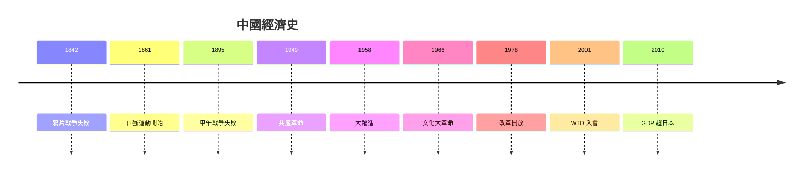
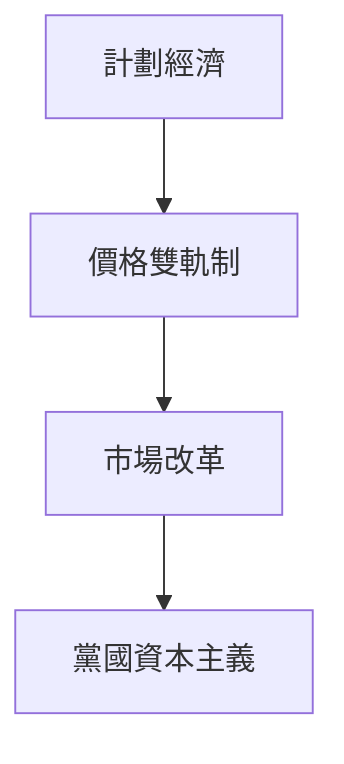
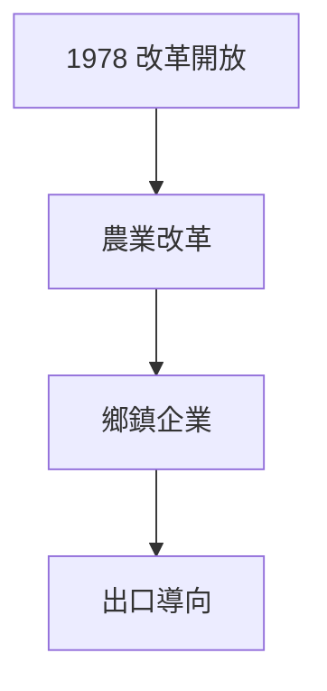
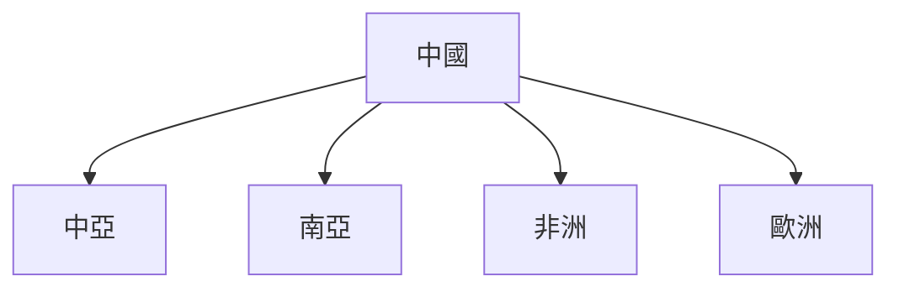

# HIST2177 中國經濟史 / The Economic History of Modern China, 1800 to the Present (6 credits)

**Instructor**: Ghassan Moazzin
**Department**: History, HKU  
**Official source**: [HKU History Course Description 2024-25](https://history.hku.hk/wp-content/uploads/2024/07/HIST-2425.pdf)
**Style**: 袁騰飛式 — 犀利、聚焦中國經濟奇蹟背後

---

## 問題 1：這個領域所有專家共享的 5 個核心心智模型

### 心智模型 1：「大分流」與中國經濟
學者 **Kenneth Pomeranz** (*The Great Divergence*, 2000) 指出：1750 年前長江三角洲同英國生活水平差唔多。「大分流」唔係必然——煤礦分佈同美洲殖民先至造成後嚟差異。

學者 **Robert Allen** (*British Industrial Revolution in Global Perspective*, 2009) 反駁：英國制度優勢先係關鍵。

- 1750 長江三角洲生活水平 ≈ 英國
- 1800 差距開始擴大
- 1900 中國人均 GDP 落後英美 20 倍

### 心智模型 2：自強運動與工業化失敗
學者 **Thomas Kennedy** 研究：自強運動 (1861-1895) 展示中國有能力引進技術——但制度障礙、官員腐敗導致失敗。

學者 **John K. Fairbank** 分析：洋務運動失敗揭示「中學為體、西學為用」唔夠——制度改革必要。

### 心智模型 3：毛澤東時代經濟實驗
學者 **Charles Bil局** (*Mao's Economy*, 1990) 分析：毛澤東時代經濟政策——土地改革、農業集體化、大躍進——最終失敗。

學者 **Kenneth Lieberthal** 研究：大躍進 (1958-1962) 導致數千萬人死亡——人類史上最大規模人為饑荒。

### 心智模型 4：改革開放與經濟起飛
學者 **Dali Yang** (*Remaking the Chinese Leviathan*, 2004) 研究：改革開放 (1978-) 成功關鍵——地方政府的積極角色、渐进式改革、出口導向。

學者 **Sebastian Heilmann** 研究：中國獨特「黨國資本主義」——市場改革結合政治控制。

### 心智模型 5：中國崛起與全球經濟重構
學者 **Giovanni Arrighi** (*Adam Smith in Beijing*, 2007) 分析：中國崛起標誌全球經濟權力東移——西方主宰世界體系終結開始。

學者 **David Shambaugh** 研究：中國「一帶一路」倡議——重新配置全球基礎設施投資。

---

## 問題 2：3 個根本分歧

### 分歧 1：中國崛起——和緩崛起定權力挑戰？
- **A 方**：和緩崛起
  - 和平發展、互利共贏
- **B 方**：權力挑戰
  - 軍事現代化、南海擴張

### 分歧 2：計劃經濟——歷史失敗定歷史實驗？
- **A 方**：歷史失敗
  - 經濟效率低下、大躍進饑荒
- **B 方**：歷史實驗
  - 為工業化奠定基礎

### 分歧 3：改革開放——中國模式定特殊條件？
- **A 方**：中國模式
  - 獨特可複製
- **B 方**：特殊條件
  - 特定歷史條件唔可以複製

---

## 問題 3：10 個深度問題

1. 如果洋務運動成功，今日世界會係點？
2. 點解大躍進導致人類史上最大規模饑荒？
3. 如果你是 1978 年鄧小平，點解要改革開放？
4. 中國經濟奇蹟——點解其他發展中國家複製失敗？
5. 點解中國共產黨可以同時維持經濟增長同政治控制？
6. 如果你是歷史學家，點樣研究計劃經濟時期？
7. 中國模式——可以輸出到其他發展中國家？
8. 點解中國經濟數據長期被質疑？
9. 如果你去 1980 年深圳，你會發現乜嘢？
10. 中國經濟崛起對全球環境有乜嘢影響？

---

## 核心心智模型深化

### 1. 中國經濟發展時間線

### 2. 中國 GDP 增長

---

## 深度自測問題

### 詳解 2: 大躍進饑荒
大躍進 (1958-1962) 導致 1500-5500 萬人死亡——毛澤東為咗快速工業化，強制集體化農業、禁止私有土地。官方數據從未完全公開——呢個揭示極權制度資訊控制。

---

## 5 個 Mermaid 圖解

### 📊 Diagram 1: 中國經濟模式

### 📊 Diagram 2: 中國 vs 其他國家 GDP

### 📊 Diagram 3: 改革開放政策

### 📊 Diagram 4: 中國製造升級

### 📊 Diagram 5: 一帶一路倡議

---

## 總結

1. 中國經濟史揭示大分流、大崛起
2. 計劃經濟實驗失敗教訓深刻
3. 改革開放係歷史轉折點
4. 中國崛起重構全球經濟格局
5. 中國模式對發展中國家有啟示

**最後問題**: 中國經濟可以持續領導世界幾耐？

---
**版權所有 © HKU History Self-Study**
