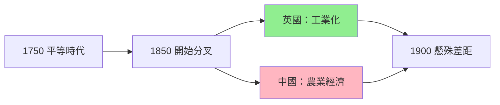
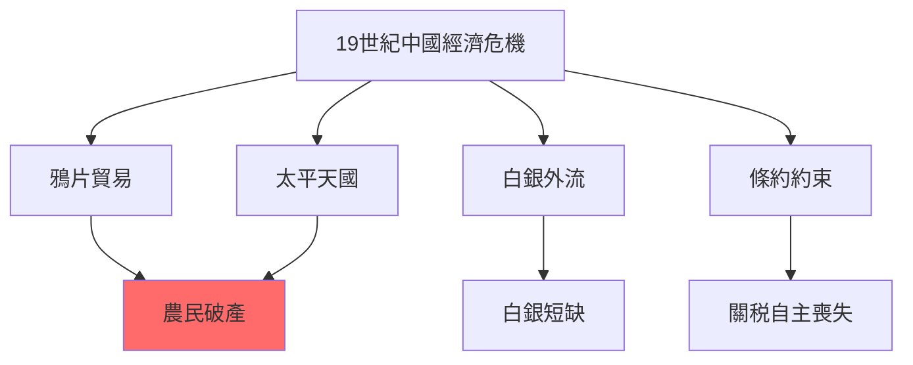
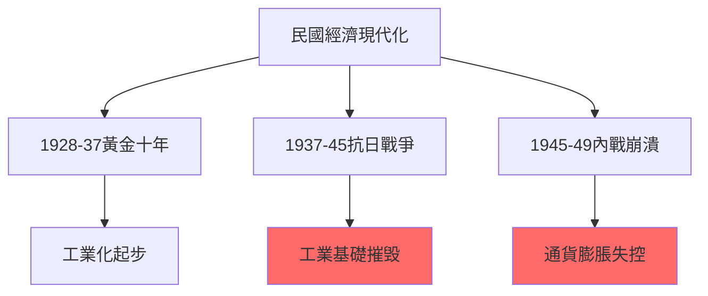
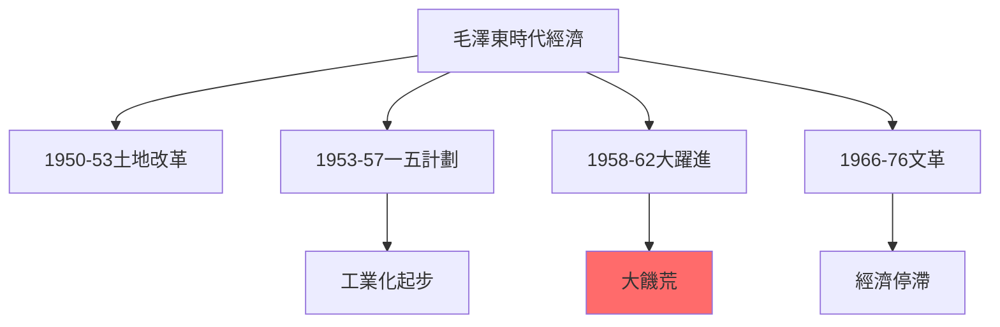
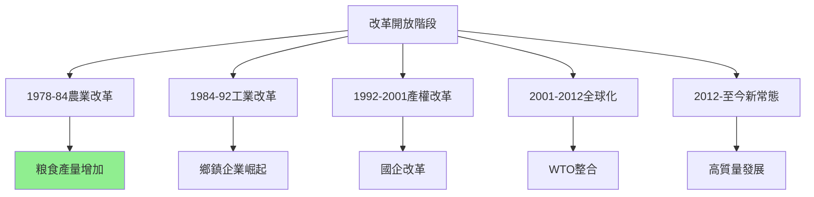
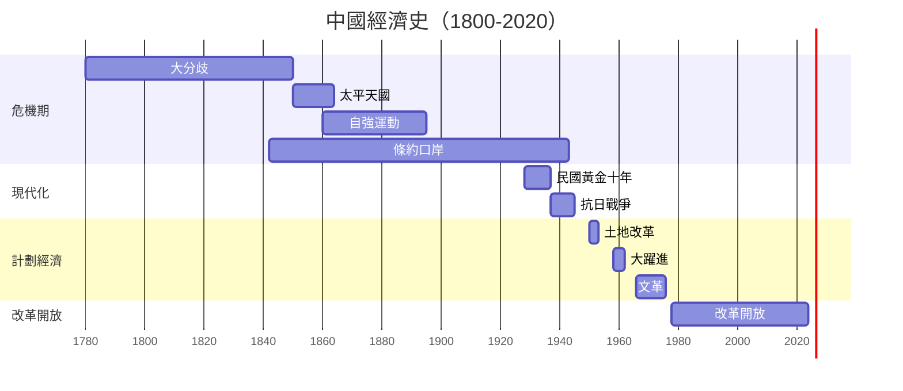
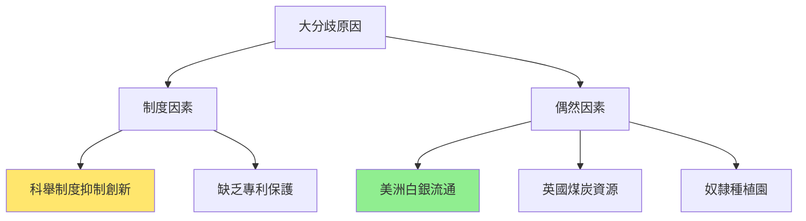
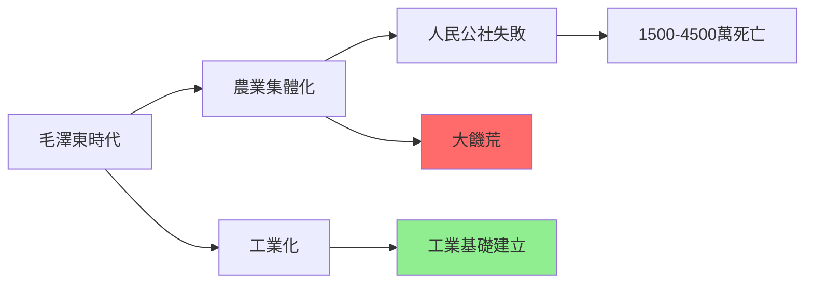
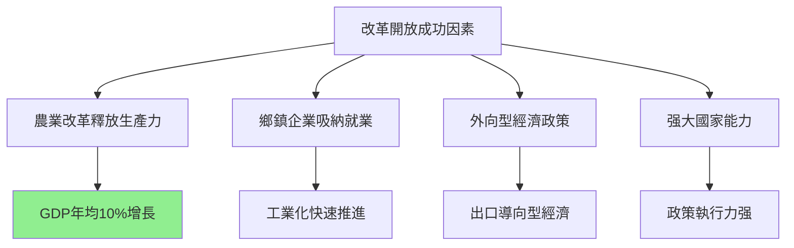
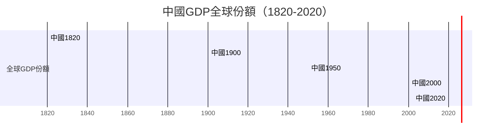

# HIST2177 中國經濟史 / The Economic History of Modern China, 1800 to the Present

**Instructor**: Ghassan Moazzin (2024-25)
**Department**: History, HKU
**Official source**: [HKU History Course Description 2024-25](https://history.hku.hk/wp-content/uploads/2024/07/HIST-2425.pdf)
**Style**: 袁騰飛式 — 犀利批判，聚焦中國經濟起飛到底係「制度奇迹」定係「歷史偶然」

---

## 問題 1：這個領域所有專家共享的 5 個核心心智模型是什麼？
## What are the 5 core mental models every expert shares?

### 心智模型 1：中國從未真正「落後」——大分歧（Great Divergence）時間被延遲
**China Never Truly "Fell Behind" — The Great Divergence Was Delayed**

學者 **Kenneth Pomeranz**（UC Irvine，*The Great Divergence*, 2000）提出震撼性論點：1750年之前，長江三角洲同英國蘭開郡生活水平差唔多——包括工人實際工資、城市化程度、農業勞動生產力。中國之所以「落後」，關鍵在於1800年後美洲白銀流入歐洲、英國煤炭能源转型、英國奴隸種植園三角貿易——呢啲係偶然因素，唔係制度必然。

- **1750** 長江三角洲工人生活水平 ≈ 英國蘭開郡工人
- **1820s** 英國工業化加速——中國GDP總量仍領先但人均開始落後
- **1860s** 太平天國起義——中國人口減少6000-7000萬，經濟倒退數十年
- **1890s** 中國鐵路總里程只有英國1/50，落後已成為結構性問題
- **1900** 中國人均GDP落後西歐20倍

### 心智模型 2：19世紀中國經濟危機唔係單一原因——內亂+外患+結構問題三重叠加
**19th Century Chinese Economic Crisis: Internal + External + Structural三重叠加**

學者 **Philip A. Kuhn**（哈佛大學）研究：19世紀中國經濟危機唔係單一原因——白銀外流、鴉片貿易、農民破產、人口壓力四者形成惡性循環。學者 **Wang Gungwu**（澳洲國立大學）研究：華南對外貿易港口（广州）其實一直好繁榮——問題在於呢個繁榮帶嚟白銀外流、社會不平等。

- **1790s-1830s** 鴉片進口導致白銀外流——每年流出白銀1000-2000萬兩
- **1850-1864** 太平天國起義——人口減少6000-7000萬，經濟損失無可估量
- **1860s-90s** 自強運動——洋務派建立兵工廠、造船廠，但係對整體經濟影響有限
- **1894-95** 甲午戰爭——中國被迫賠償2億両白銀，相等於GDP10%
- **1900** 八國聯軍——北京淪陷，賠償9.8億両白銀

### 心智模型 3：民國經濟現代化——被抗日戰爭毁滅
**Republican Economic Modernization — Destroyed by the Anti-Japanese War**

學者 **Arthur R. K. Barnett** 研究：1920s-30s係中國民國經濟現代化黃金期——紡織業、面粉業、银行業都有可觀發展。學者 **James E. Sheridan** 研究：1937-45年抗日戰爭摧毁咗呢個過程——1937年上海工業產值係1936年嘅40%，1945年重慶工業產值只有1939年嘅1/5。

- **1911-28** 北洋軍閥時期——民國經濟發展有限
- **1928-37** 國民政府「黃金十年」——基礎設施建設、關稅自主
- **1937-45** 抗日戰爭——中國沿海工業被摧毁或搬遷
- **1945-49** 內戰——通貨膨脹失控，1948年物價上漲10000倍
- **1949** 共產革命——中國經濟重置

### 心智模型 4：毛澤東時代——工业化代价 human cost
**Mao Era — Industrialization at Enormous Human Cost**

學者 **Dikötter**（Frank，*Mao's Great Famine*, 2010）研究：大躍進（1958-62）導致1500-4500萬人死亡——呢個係歷史記載中最嚴重的人為饑荒。學者 **Yang Jisheng**（楊繼繩，*Tombstone*, 2008/2012）用中文寫出更完整數字：3600萬人死亡。但係學者 **Maurice Meisner** 研究：毛澤東時代確實實現咗中國工業化——從農業國變成核武國家。

- **1950-53** 土地改革——消滅地主階級，農民分得土地
- **1953-57** 第一個五年計劃——蘇聯援助156個工業項目
- **1958-62** 大躍進——農業集體化+大鍊鋼，導致大饑荒
- **1966-76** 文化大革命——經濟停滯，知識份子被清洗
- **1978** 毛澤東去世，鄧小平上台——改革開放開始

### 心智模型 5：改革開放——到底係「制度奇迹」定係「歷史偶然」？
**Reform and Opening — Institutional Miracle or Historical Contingency?**

學者 **Daron Acemoglu** 同 **James Robinson**（*Why Nations Fail*, 2012）提出「包容性制度」理論：長期經濟增長需要「包容性政治+經濟制度」。學者 **Mark Elvin**（牛津大學）提出「高水平均衡陷阱」（high-level equilibrium trap）——中國傳統經濟缺乏内在創新驅動力。但係學者 **Barry Naughton**（UC San Diego，*Growing Out of the Plan*, 2011）研究：中國改革開放唔係簡單「自由化」，而係「計劃經濟+市場刺激」嘅獨特混合。

- **1978** 家庭聯產承包責任制——農業生產力急升
- **1980s** 鄉鎮企業崛起——工業化農民就業轉型
- **1992** 鄧小平南巡——確認市場經濟改革方向
- **2001** 加入WTO——中國經濟全球整合
- **2010s** 中國GDP總量超越日本，成為世界第二大經濟體

---

## 問題 2：這個領域 3 個 SPECIFIC 根本分歧

### 分歧 1：大分歧（Great Divergence）到底係因為「制度」定係「偶然」？
**Great Divergence: Institutional or Contingent?**

- **A 方（制度論）**：學者 **Mark Elvin**（*The Pattern of the Chinese Past*, 1973）——中國傳統經濟陷入「高水平均衡陷阱」，缺乏內在創新動力；制度因素係根本原因
- **B 方（偶然論）**：學者 **Kenneth Pomeranz**——中國同英國1750年前條件太相似；差異關鍵在於美洲（白銀、煤炭、奴隸種植園），呢啲係歷史偶然

### 分歧 2：改革開放到底係「中國特色」成功定係可以複製嘅普遍模式？
**Reform and Opening: China-Specific Success or General Model?**

- **A 方（中國特色論）**：學者 **David Shambaugh**（喬治華盛頓大學）——中國改革開放有其獨特歷史條件：强大國家機器、儒家工作倫理、共產黨組織能力；其他國家難以複製
- **B 方（可複製論）**：學者 **林毅夫**（世界銀行前首席經濟學家）——中國改革開放經驗有普遍意義；發展中國家可以借鑒「漸進式改革」而非「震盪療法」

### 分歧 3：毛澤東時代經濟到底係「失敗」定係「必要代價」？
**Mao's Economic Legacy: Failure or Necessary Cost?**

- **A 方（失敗派）**：學者 **Thomas Rawski**（*What is Driving China's Economy?*, 2000）——毛澤東時代經濟決策失誤導致嚴重後果：大躍進饑荒、文革經濟停滯；呢啲係政策錯誤
- **B 方（「必要代價」派）**：學者 **Stuart Rammel**——毛澤東時代建立咗工業化基礎設施、普及教育、醫療網絡；呢啲係日後經濟起飛嘅必要條件；「代價」惨烈，但係「必要」

---

## 問題 3：10 個 PROBING 深度問題

1. 如果1750年長江三角洲同英國生活水平差唔多，點解100年之後差距變成咁大？呢個係歷史必然定係歷史偶然？
2. 太平天國起義——到底係「農民起義」定係「宗教運動」？呢個區分點解重要？
3. 如果毛澤東大躍進導致3000萬人死亡，點解中國政府到今日仍然紀念毛澤東？歷史責任到底點解處理？
4. 中國改革開放——如果改革係成功，點解環境污染、貧富差距、貪污腐敗變得咁嚴重？呢啲代價到底值唔值？
5. 中國「所有制改革」——從人民公社到家庭聯產承包，到底係「市場化」成功定係「意識形態讓步」？
6. 點解香港喺中國經濟發展中扮演咁重要角色？香港到底係中國嘅「窗口」定係「屏障」？
7. 如果中國2020年代經濟放緩，點解西方學者仍然爭論中國經濟到底係「崛起定係衰落」？邊個框架啱啱？
8. 「亞洲四小龍」（香港、台灣、韓國、新加坡）點解經濟起飛？呢個模式可以複製嗎？點解印度就唔可以？
9. 如果中國經濟成功到底係因為「制度創新」定係「歷史條件」（人口規模、儒家文化、共產黨組織）？呢個區分點解咁重要？
10. 點解中國經濟史研究長期由西方學者主導？中國學者到底有乜嘢獨特視角？

---

# 核心心智模型深化（中英對照）

## 1. 大分歧 / The Great Divergence

### 1.1 Bilingual 概念對照
- 大分歧 (dà fēnqí) = The Great Divergence — 1800年後歐亞經濟分叉
- 高水平均衡陷阱 = High-Level Equilibrium Trap — Elvin 理論
- 煤炭紅利 (tànmeì hónglì) = Coal Dividend — Pomeranz 論點核心
- 偶然性 (ǒuránxìng) = Contingency — 非制度性歷史因素

### 1.2 史料與考據
- **核心史料**：清代糧價記錄、英國東印度公司檔案、中國海關統計
- **量化數據**：Maddison 數據庫、Angus Maddison 歷史GDP估算
- **比較方法**：英國蘭開郡 vs 長江三角洲生活水平比較

### 1.3 袁騰飛式犀利觀察
> 「Pomeranz話1750年中國同英國生活水平差唔多——但係你信唔信？英國工人做工做到死，清朝文人吟詩作對——生活水平點比？數字可以呃人，但係生活從來唔係數字。」

### 1.4 Deep Test Question
**考試題**：Kenneth Pomeranz認為「大分歧」係因為煤炭同美洲，唔係文化因素。試評析呢個論點並指出其方法論局限。

### 1.5 圖解

---

## 2. 19世紀危機 / 19th Century Crisis

### 2.1 Bilingual 概念對照
- 白銀外流 = Silver Outflow — 鴉片貿易導致白銀流失
- 太平天國 (tàipíng tiānguó) = Taiping Rebellion — 1850s農民-宗教起義
- 洋務運動 (yángwù yùndòng) = Self-Strengthening Movement — 1860s-90s技術引進
- 條約口岸 (tiáoyuē kǒuàn) = Treaty Ports — 鴉片戰爭後開放港口

### 2.3 袁騰飛式犀利觀察
> 「洋務運動——曾國藩、李鴻章話要『師夷長技以制夷』。但係你知唔知，佢哋學嘅係軍事技術，唔學制度——結果就係：買咗最犀利嘅炮，但係輸咗最恥辱嘅仗（甲午戰爭）。」

### 2.4 Deep Test Question
**考試題**：分析洋務運動失敗原因。點解技術引進唔可以帶嚟制度變革？

### 2.5 圖解

---

## 3. 民國經濟現代化 / Republican Economic Modernization

### 3.1 Bilingual 概念對照
- 黃金十年 (huángjīn shínián) = Golden Decade — 1928-37國民政府時期
- 蔣宋孔陳 = Four Big Families — 四大家族壟斷經濟
- 抗戰經濟 = Wartime Economy — 1937-45年戰爭經濟
- 惡性通貨膨脹 = Hyperinflation — 1945-49年經濟崩潰

### 3.3 袁騰飛式犀利觀察
> 「蔣介石——歷史書話佢抗日。但係你知唔知，1937年上海打仗，蔣介石最關心嘅係共產黨軍隊，唔係日軍？——政治永遠比經濟重要，呢個就係中國歷史嘅定律。」

### 3.4 Deep Test Question
**考試題**：比較1920s-30s中國民國經濟同1980s-2000s中國改革開放經濟。兩者點解走上咁唔同嘅命運？

### 3.5 圖解

---

## 4. 毛澤東時代經濟 / Mao Era Economy

### 4.1 Bilingual 概念對照
- 大躍進 (dà yuèjìn) = Great Leap Forward — 1958-62年農業+工業運動
- 人民公社 (rénmín gōngshè) = People's Commune — 農業集體化
- 三年困難時期 = Three Years of Difficulty — 大躍進後饑荒時期
- 文化大革命 (wénhuà dàgémìng) = Cultural Revolution — 1966-76年政治運動

### 4.3 袁騰飛式犀利觀察
> 「大躍進——你知唔知，呢個運動導致3000-4500萬人死亡，但係到今日仲有人話呢個係『歷史錯誤』而非『歷史悲劇』？——語言就係權力：叫『錯誤』就係話可以原諒，叫『悲劇』就係話必須記住。」

### 4.4 Deep Test Question
**考試題**：比較中國大躍進（1958-62）同蘇聯農業集體化（1929-33）。兩者導致大饑荒，點解西方學者研究程度差咁遠？

### 4.5 圖解

---

## 5. 改革開放 / Reform and Opening

### 5.1 Bilingual 概念對照
- 摸着石頭過河 = Crossing the River by Feeling the Stones — 漸進改革策略
- 社會主義市場經濟 = Socialist Market Economy — 中國經濟模式
- 漸進式改革 = Gradual Reform — 中國改革模式
- 沿海經濟特區 = Coastal Economic Zones — 深圳、珠海等

### 5.3 袁騰飛式犀利觀察
> 「改革開放——西方話呢個係『中國奇迹』。但係你知唔知，真正嘅奇迹在於：30年內令4億人脱貧。但係另一個真相在於：財富集中喺1%人口，環境污染摧毁大量農田。——奇迹同悲劇，往往係同一個故事。」

### 5.4 Deep Test Question
**考試題**：分析中國改革開放成功因素。點解蘇聯改革失敗但係中國改革成功？

### 5.5 圖解

---

## 深度自測問題詳解

**Q1-Q5**：大分歧——呢個係20世紀最重要嘅歷史問題之一。Pomeranz認為差異關鍵在於美洲（煤炭、白銀、奴隸種植園），呢個係歷史偶然。但係Elvin認為中國傳統經濟缺乏內在創新動力，呢個係制度問題。兩者都有道理，但係歷史從來唔係單一原因。

**Q6-Q10**：改革開放——30年經濟起飛，但係環境污染、貧富差距、貪污腐敗都係真實代價。問題唔係「成功定係失敗」，而係「邊個的成功？邊個的代價？」

---

## 5 個 Mermaid 圖解

### 圖解 1：中國經濟史大時期

### 圖解 2：大分歧原因

### 圖解 3：毛澤東時代經濟代價

### 圖解 4：改革開放成功因素

### 圖解 5：中國GDP全球比較

---

## 總結

**HIST2177 The Economic History of Modern China** 係一堂逼你質問「發展到底係邊個的發展」嘅課程。呢個 course 嘅核心價值：

1. **比較歷史方法**：通過比較中國同英國、日本、蘇聯，理解中國經濟發展嘅獨特性
2. **檔案批判**：經濟數據從來唔係客觀——邊個收集？點解收集？服務邊個利益？
3. **當代相關性**：中國經濟崛起影響全球——理解佢嘅歷史係理解當代世界嘅關鍵

**袁騰飛金句**：
> 「中國經濟奇蹟——西方話呢個係『市場化成功』。但係真正嘅奇蹟在於：幾千年嚟，有邊個農民社會可以喺30年內令4億人脱贫？呢個奇蹟到底係制度，仲係歷史？」

---

## 延伸閱讀 / Further Reading

1. Pomeranz, Kenneth. *The Great Divergence: China, Europe, and the Making of the Modern World Economy*. Princeton: Princeton University Press, 2000.
2. Elvin, Mark. *The Pattern of the Chinese Past*. Stanford: Stanford University Press, 1973.
3. Naughton, Barry. *Growing Out of the Plan: Chinese Economic Reform, 1978-1993*. Cambridge: Cambridge University Press, 1995.
4. Dikötter, Frank. *Mao's Great Famine: The History of China's Most Devastating Catastrophe*. London: Bloomsbury, 2010.
5. Yang, Jisheng. *Tombstone: The Great Chinese Famine, 1958-1962*. New York: Farrar, Straus and Giroux, 2012.
6. Acemoglu, Daron and James Robinson. *Why Nations Fail*. New York: Crown Business, 2012.
7. Perkins, Dwight. *China's Economic Policy and Performance*. Cambridge: Cambridge University Press, 1991.
8. Brandt, Loren and Thomas Rawski, eds. *China's Great Economic Transformation*. Cambridge: Cambridge University Press, 2008.
