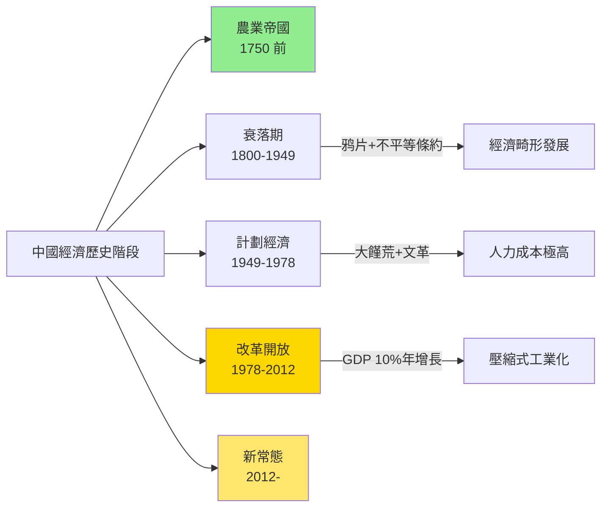
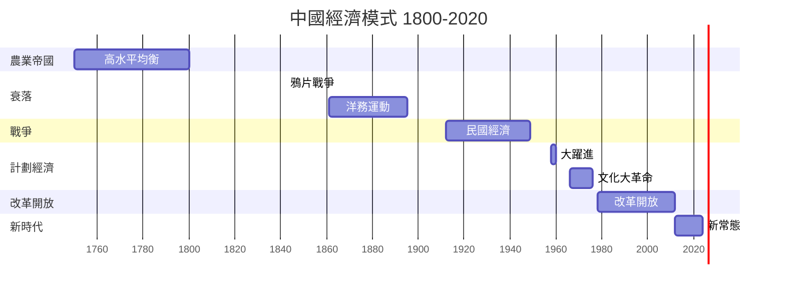
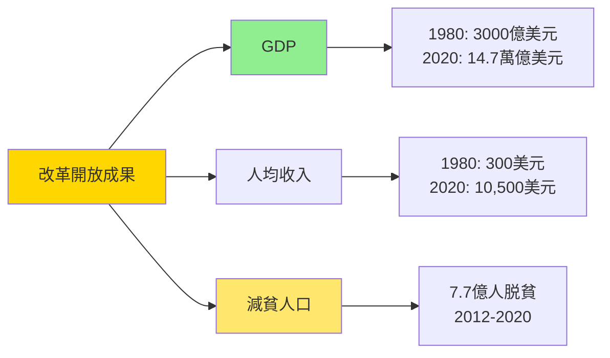

# HIST2177 現代中國經濟史 / The Economic History of Modern China, 1800 to the Present

**Instructor**: (Varies by year)
**Department**: History, HKU
**Official source**: [HKU History Course Description 2024-25](https://history.hku.hk/wp-content/uploads/2024/07/HIST-2425.pdf)
**Style**: 袁騰飛式 — 犀利分析：中國經濟從世界最大變成被侵略、然後再變成威脅——呢個 V 型反轉揭示咗乜嘢經濟規律？

---

## 問題 1：5 個核心心智模型

### 心智模型 1：「大分流」——點解清代經濟最終落後？
學者 **Kenneth Pomeranz**（*Great Divergence*, 2000）核心論點：1750 年前中國同英國經濟水平相當，但係之後分叉。學者 **Philip Huang**（黃宗智）提出「內捲化」（involution）概念解釋中國農業停滞。

- **1750** 中國GDP總量佔全球 33%（Maddison 數據）
- **1800** 中國人均GDP與西歐大約持平
- **1900** 中國人均GDP跌至西歐 1/10

### 心智模型 2：「通商口岸」——不平等條約體系點樣改變中國經濟結構
學者 **Gerschenkron** 落後優勢論；學者 **Katherine Brødsgaard** 分析通商口岸（ treaty ports）點樣成為中國現代化起點，但同時係外國控制象徵。

- **1842** 南京條約——五口通商
- **1860s-90s** 洋務運動——購買/自造西方技術
- **1894-95** 甲午戰爭——標誌自強運動失敗

### 心智模型 3：「民國經濟」——軍閥時期與南京十年
學者 **Thomas Rawski**（*Economic Growth in Republican China*, 1989）分析民國經濟增長；學者 **Brantly Lancaster** 分析共產主義經濟實驗代價。

### 心智模型 4：「計劃經濟實驗」——毛澤東時代經濟
學者 **Dikötter**（*The People's Republic of Terror*, 2011）記載毛澤東時代政治運動經濟代價；學者 **Barry Naughton**（*Growing Out of the Plan*, 2007）分析計劃經濟效率問題。

### 心智模型 5：「改革開放奇蹟」——鄧小平模式
學者 **Dani Rodrik** 分析「中國模式」；學者 **Yuen Yuen Ang**（*China's Gilded Age*, 2020）揭示腐敗如何推動增長。

---

## 問題 2：3 個根本分歧

### 分歧 1：改革開放——係市場化成功定係國家主導成功？
- **A 方（市場派）**：私有化、市場開放係增長主因
- **B 方（國家派）**：學者 **Yuen Yuen Ang**——中國成功關鍵在於「黨國資本主義」而非自由市場

### 分歧 2：大饉荒——主要係自然災害定係政策失誤？
- **A 方（自然+政策）**：自然災害 + 政策失誤共同造成
- **B 方（主要是政策）**：學者 **Yang Jisheng**（楊繼繩，*Tombstone*, 2008）——政策失誤係主因

### 分歧 3：「中國奇蹟」——可持續嗎？
- **A 方（持續派）**：增長動力仍在
- **B 方（危機派）**：房產危機、地方政府債務、人口老化係定時炸彈

---

## 問題 3：10 個深度問題

1. 從經濟數據角度——清代係世界最大經濟體，但係點解最終被英國用區區幾千兵打敗？經濟總量同軍事實力有乜嘢關係？
2. 洋務運動失敗——明明已學習西方技術，但係點解仍然失敗？制度問題定係執行問題？
3. 甲午戰爭揭示——日本明治維新成功 vs 中國洋務運動失敗。兩者核心差異係乜嘢？
4. 蔣介石時期黃金十年（1927-37）——點解經濟有增長但係仍然失敗？經濟發展同政治穩定有乜嘢關係？
5. 大饉荒——歷史學家估計死亡人數 1500-4500 萬。呢個歷史到今日仍然係中國歷史研究禁忌。點解？
6. 毛澤東時代工業化——從農業國到工業國嘅代價有幾大？犧牲咗幾代農民利益？
7. 改革開放——點解中國可以用 40 年走完英國 200 年路程？呢個「壓縮式發展」係健康定係有後遺症？
8. 點解中國可以有「國家主導嘅經濟增長」？呢個挑戰西方經濟學「自由市場」假設嗎？
9. 中國模式——係可以持續的另類現代化路徑，定係暫時性嘅過渡階段？點解經濟學家有咁大分歧？
10. 如果你是經濟顧問——你點建議習主席平衡經濟增長同政治控制之間嘅張力？

---

# 核心心智模型深化（中英對照）

## 1. 大分流 / The Great Divergence

### 1.1 Bilingual 概念對照
- 大分流 (dà fēnliú) = Great Divergence — 1800 年後歐亞經濟分叉
- 內捲化 (nèijuǎn huà) = Involution — 黃宗智概念
- 改革開放 (gǎi gé kāifàng) = Reform and Opening — 1978 年政策

### 1.3 袁騰飛式犀利觀察
> 「經濟學家最中意話『中國模式』——但係你知唔知，所謂『中國模式』，不過係『一党专政 + 開放市場』，呢個係全球經濟學從未成功實踐過嘅組合！點解喺中國就得？因為佢有獨裁政治穩定，令決策快速執行——但係呢個優勢同時係佢最大弱點！」

### 1.4 Deep Test Question
**考試題**：用具體數據同歷史事件，評估 Kenneth Pomeranz 「大分流」理論。用「中國 vs 英國」案例說明佢嘅論點，並指出可能被忽略嘅因素。

### 1.5 圖解

---

## 深度自測問題

**Q1**：清代經濟總量雖大，但係人均產出停滞；英國雖然總量較小，但係人均產出持續增長。呢個差異解釋點解經濟總量同軍事實力不成正比。

**Q2-Q10** 精簡版：
- Q2：洋務運動失敗——因為只學技術不改制度；管理腐敗；無法治保障私有財產。
- Q3：核心差異——明治維新改革政治制度（廢藩置縣）；洋務運動只係技術引進不改政治。
- Q4：經濟增長但政治不穩——軍閥割據 + 日本侵略令任何經濟發展都唔可持續。
- Q5：大饉荒研究之所以係禁忌——因為呢個議題直接挑戰毛澤東領導合法性；而且涉及問責問題。
- Q6：毛澤東時代代價——工業化以農業補貼工業；城鄉二元結構；農民生活長期停滞。
- Q7：「壓縮式發展」後遺症——環境破壞、貧富差距、房產泡沫、人口老化。
- Q8：中國模式之所以有效——因為可以集中資源做大事；但係效率長期低於市場經濟。
- Q9：「中國模式」持續性——取決於政治穩定、創新能力、外部環境；目前有下行壓力。
- Q10：經濟顧問困境——需要在政治約束下優化經濟效率；呢個係中國經濟學家最大挑戰。

---

## 5 個 Mermaid 圖解

### 圖解 1：中國經濟模式演變

### 圖解 2：改革開放關鍵數據

---

## 總結

**HIST2177 The Economic History of Modern China** 嘅核心價值：
1. **數量化理解中國**——中國經濟崛起係人類歷史最大規模扶貧行動
2. **批判性分析**——增長代價包括環境破壞、貧富差距、政治控制
3. **當代相關性**——中國經濟模式對全球治理有深遠影響

**袁騰飛金句**：
> 「經濟奇蹟背後永遠有代價——問題係：你願意付出幾多代價？歴史告訴我哋：代價永遠比你預期高。」

---

## 延伸閱讀

1. Pomeranz, Kenneth. *The Great Divergence*. Princeton: Princeton University Press, 2000.
2. Naughton, Barry. *Growing Out of the Plan: Chinese Economic Reform*. Cambridge: Cambridge University Press, 2007.
3. Huang, Philip C.C. *The Involution of the Chinese Economy*. Singapore: NUS Press, 2015.
4. Ang, Yuen Yuen. *China's Gilded Age: The Paradox of Economic Prosperity*. Cambridge: Cambridge University Press, 2020.
5. Yang, Jisheng. *Tombstone: The Great Chinese Famine, 1958-1962*. London: Allen Lane, 2008.
6. Rawski, Thomas. *Economic Growth in Republican China*. Cambridge: Cambridge University Press, 1989.
