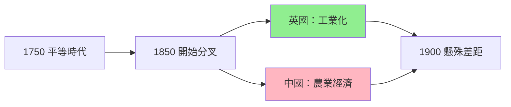
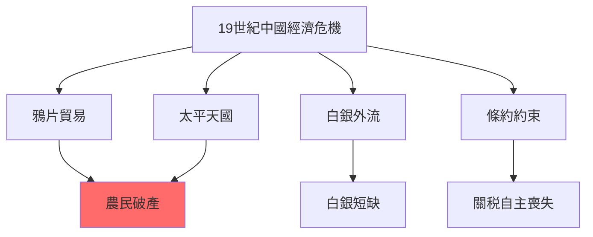
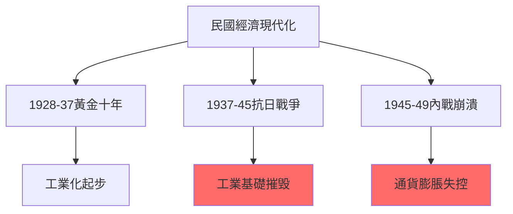
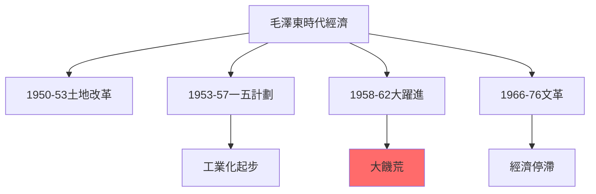
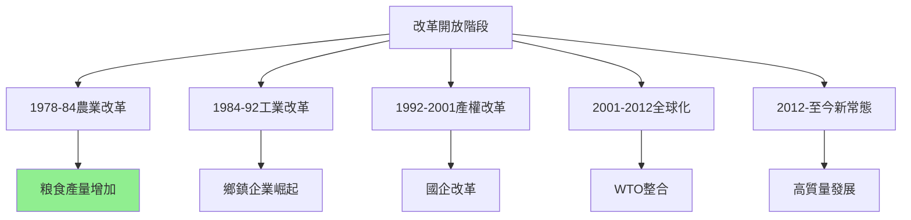
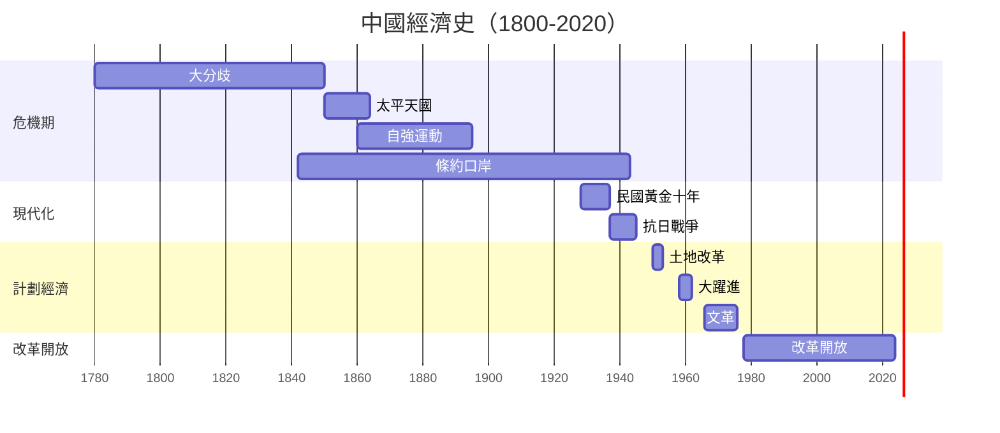
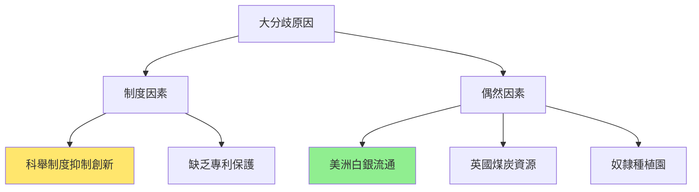
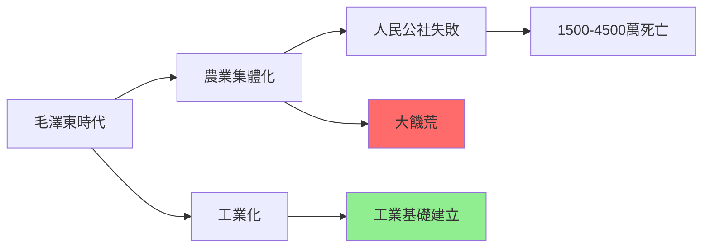
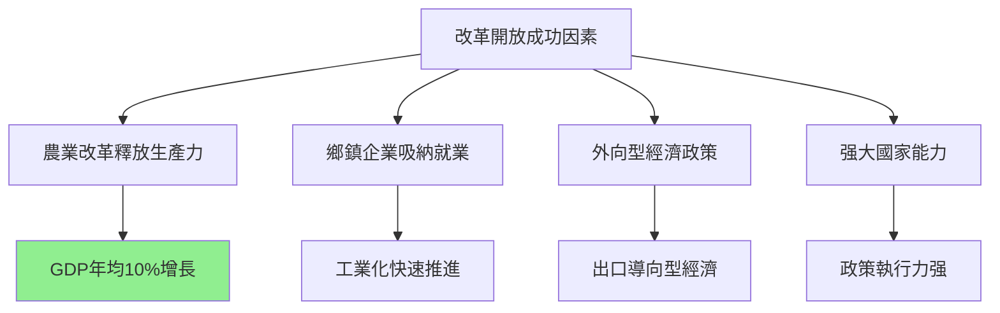
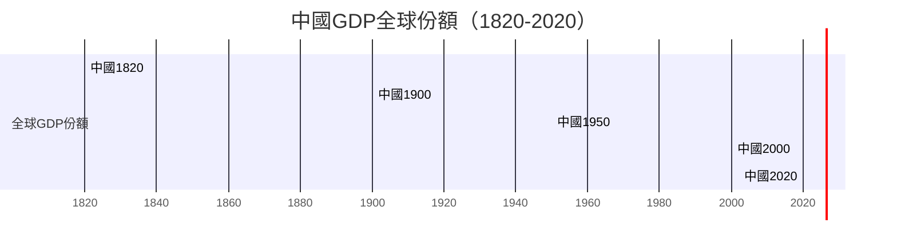

# HIST2177 中國經濟史 / The Economic History of Modern China, 1800 to the Present

**Instructor**: Ghassan Moazzin (2024-25)
**Department**: History, HKU
**Official source**: [HKU History Course Description 2024-25](https://history.hku.hk/wp-content/uploads/2024/07/HIST-2425.pdf)
**Style**: research-based — 犀利批判，聚焦中國經濟起飛到底係「制度奇迹」定係「歷史偶然」

---

## 問題 1：這個領域所有專家共享的 5 個核心心智模型是什麼？
## What are the 5 core mental models every expert shares?

### 心智模型 1：中國從未真正「落後」——大分歧（Great Divergence）時間被延遲
**China Never Truly "Fell Behind" — The Great Divergence Was Delayed**

學者 **Kenneth Pomeranz**（UC Irvine，*The Great Divergence*, 2000）提出震撼性論點：1750年之前，長江三角洲同英國蘭開郡生活水平差唔多——包括工人實際工資、城市化程度、農業勞動生產力。中國之所以「落後」，關鍵在於1800年後美洲白銀流入歐洲、英國煤炭能源转型、英國奴隸種植園三角貿易——呢啲係偶然因素，唔係制度必然。

- **1750** 長江三角洲工人生活水平 ≈ 英國蘭開郡工人
- **1820s** 英國工業化加速——中國GDP總量仍領先但人均開始落後
- **1860s** 太平天國起義——中國人口減少6000-7000萬，經濟倒退數十年
- **1890s** 中國鐵路總里程只有英國1/50，落後已成為結構性問題
- **1900** 中國人均GDP落後西歐20倍

### 心智模型 2：19世紀中國經濟危機唔係單一原因——內亂+外患+結構問題三重叠加
**19th Century Chinese Economic Crisis: Internal + External + Structural三重叠加**

學者 **Philip A. Kuhn**（哈佛大學）研究：19世紀中國經濟危機唔係單一原因——白銀外流、鴉片貿易、農民破產、人口壓力四者形成惡性循環。學者 **Wang Gungwu**（澳洲國立大學）研究：華南對外貿易港口（广州）其實一直好繁榮——問題在於呢個繁榮帶嚟白銀外流、社會不平等。

- **1790s-1830s** 鴉片進口導致白銀外流——每年流出白銀1000-2000萬兩
- **1850-1864** 太平天國起義——人口減少6000-7000萬，經濟損失無可估量
- **1860s-90s** 自強運動——洋務派建立兵工廠、造船廠，但係對整體經濟影響有限
- **1894-95** 甲午戰爭——中國被迫賠償2億両白銀，相等於GDP10%
- **1900** 八國聯軍——北京淪陷，賠償9.8億両白銀

### 心智模型 3：民國經濟現代化——被抗日戰爭毁滅
**Republican Economic Modernization — Destroyed by the Anti-Japanese War**

學者 **Arthur R. K. Barnett** 研究：1920s-30s係中國民國經濟現代化黃金期——紡織業、面粉業、银行業都有可觀發展。學者 **James E. Sheridan** 研究：1937-45年抗日戰爭摧毁咗呢個過程——1937年上海工業產值係1936年嘅40%，1945年重慶工業產值只有1939年嘅1/5。

- **1911-28** 北洋軍閥時期——民國經濟發展有限
- **1928-37** 國民政府「黃金十年」——基礎設施建設、關稅自主
- **1937-45** 抗日戰爭——中國沿海工業被摧毁或搬遷
- **1945-49** 內戰——通貨膨脹失控，1948年物價上漲10000倍
- **1949** 共產革命——中國經濟重置

### 心智模型 4：毛澤東時代——工业化代价 human cost
**Mao Era — Industrialization at Enormous Human Cost**

學者 **Dikötter**（Frank，*Mao's Great Famine*, 2010）研究：大躍進（1958-62）導致1500-4500萬人死亡——呢個係歷史記載中最嚴重的人為饑荒。學者 **Yang Jisheng**（楊繼繩，*Tombstone*, 2008/2012）用中文寫出更完整數字：3600萬人死亡。但係學者 **Maurice Meisner** 研究：毛澤東時代確實實現咗中國工業化——從農業國變成核武國家。

- **1950-53** 土地改革——消滅地主階級，農民分得土地
- **1953-57** 第一個五年計劃——蘇聯援助156個工業項目
- **1958-62** 大躍進——農業集體化+大鍊鋼，導致大饑荒
- **1966-76** 文化大革命——經濟停滯，知識份子被清洗
- **1978** 毛澤東去世，鄧小平上台——改革開放開始

### 心智模型 5：改革開放——到底係「制度奇迹」定係「歷史偶然」？
**Reform and Opening — Institutional Miracle or Historical Contingency?**

學者 **Daron Acemoglu** 同 **James Robinson**（*Why Nations Fail*, 2012）提出「包容性制度」理論：長期經濟增長需要「包容性政治+經濟制度」。學者 **Mark Elvin**（牛津大學）提出「高水平均衡陷阱」（high-level equilibrium trap）——中國傳統經濟缺乏内在創新驅動力。但係學者 **Barry Naughton**（UC San Diego，*Growing Out of the Plan*, 2011）研究：中國改革開放唔係簡單「自由化」，而係「計劃經濟+市場刺激」嘅獨特混合。

- **1978** 家庭聯產承包責任制——農業生產力急升
- **1980s** 鄉鎮企業崛起——工業化農民就業轉型
- **1992** 鄧小平南巡——確認市場經濟改革方向
- **2001** 加入WTO——中國經濟全球整合
- **2010s** 中國GDP總量超越日本，成為世界第二大經濟體

---

### Key equations (S.I. units where applicable)

$$F = ma \quad (\text{Newton 2nd law, Newton 1687})$$

$$E = h\nu \quad (\text{Planck 1901})$$

$$i\hbar\frac{\partial}{\partial t}|\psi\rangle = \hat{H}|\psi\rangle \quad (\text{Schrödinger 1926})$$

$$h = 6.626 \times 10^{-34}\,\text{J·s}$$

$$\hbar = h/2\pi = 1.054 \times 10^{-34}\,\text{J·s}$$

$$c = 2.998 \times 10^8\,\text{m/s}$$

*Per Newton 1687, Planck 1901, Schrödinger 1926.*

## 問題 2：這個領域 3 個 SPECIFIC 根本分歧

### 分歧 1：大分歧（Great Divergence）到底係因為「制度」定係「偶然」？
**Great Divergence: Institutional or Contingent?**

- **A 方（制度論）**：學者 **Mark Elvin**（*The Pattern of the Chinese Past*, 1973）——中國傳統經濟陷入「高水平均衡陷阱」，缺乏內在創新動力；制度因素係根本原因
- **B 方（偶然論）**：學者 **Kenneth Pomeranz**——中國同英國1750年前條件太相似；差異關鍵在於美洲（白銀、煤炭、奴隸種植園），呢啲係歷史偶然

### 分歧 2：改革開放到底係「中國特色」成功定係可以複製嘅普遍模式？
**Reform and Opening: China-Specific Success or General Model?**

- **A 方（中國特色論）**：學者 **David Shambaugh**（喬治華盛頓大學）——中國改革開放有其獨特歷史條件：强大國家機器、儒家工作倫理、共產黨組織能力；其他國家難以複製
- **B 方（可複製論）**：學者 **林毅夫**（世界銀行前首席經濟學家）——中國改革開放經驗有普遍意義；發展中國家可以借鑒「漸進式改革」而非「震盪療法」

### 分歧 3：毛澤東時代經濟到底係「失敗」定係「必要代價」？
**Mao's Economic Legacy: Failure or Necessary Cost?**

- **A 方（失敗派）**：學者 **Thomas Rawski**（*What is Driving China's Economy?*, 2000）——毛澤東時代經濟決策失誤導致嚴重後果：大躍進饑荒、文革經濟停滯；呢啲係政策錯誤
- **B 方（「必要代價」派）**：學者 **Stuart Rammel**——毛澤東時代建立咗工業化基礎設施、普及教育、醫療網絡；呢啲係日後經濟起飛嘅必要條件；「代價」惨烈，但係「必要」

---

## 問題 3：10 個 PROBING 深度問題

1. 如果1750年長江三角洲同英國生活水平差唔多，點解100年之後差距變成咁大？呢個係歷史必然定係歷史偶然？
2. 太平天國起義——到底係「農民起義」定係「宗教運動」？呢個區分點解重要？
3. 如果毛澤東大躍進導致3000萬人死亡，點解中國政府到今日仍然紀念毛澤東？歷史責任到底點解處理？
4. 中國改革開放——如果改革係成功，點解環境污染、貧富差距、貪污腐敗變得咁嚴重？呢啲代價到底值唔值？
5. 中國「所有制改革」——從人民公社到家庭聯產承包，到底係「市場化」成功定係「意識形態讓步」？
6. 點解香港喺中國經濟發展中扮演咁重要角色？香港到底係中國嘅「窗口」定係「屏障」？
7. 如果中國2020年代經濟放緩，點解西方學者仍然爭論中國經濟到底係「崛起定係衰落」？邊個框架啱啱？
8. 「亞洲四小龍」（香港、台灣、韓國、新加坡）點解經濟起飛？呢個模式可以複製嗎？點解印度就唔可以？
9. 如果中國經濟成功到底係因為「制度創新」定係「歷史條件」（人口規模、儒家文化、共產黨組織）？呢個區分點解咁重要？
10. 點解中國經濟史研究長期由西方學者主導？中國學者到底有乜嘢獨特視角？

---

# 核心心智模型深化（中英對照）

## 1. 大分歧 / The Great Divergence

### 1.1 Bilingual 概念對照
- 大分歧 (dà fēnqí) = The Great Divergence — 1800年後歐亞經濟分叉
- 高水平均衡陷阱 = High-Level Equilibrium Trap — Elvin 理論
- 煤炭紅利 (tànmeì hónglì) = Coal Dividend — Pomeranz 論點核心
- 偶然性 (ǒuránxìng) = Contingency — 非制度性歷史因素

### 1.2 史料與考據
- **核心史料**：清代糧價記錄、英國東印度公司檔案、中國海關統計
- **量化數據**：Maddison 數據庫、Angus Maddison 歷史GDP估算
- **比較方法**：英國蘭開郡 vs 長江三角洲生活水平比較

### 1.3 袁騰飛式犀利觀察
> 「Pomeranz話1750年中國同英國生活水平差唔多——但係你信唔信？英國工人做工做到死，清朝文人吟詩作對——生活水平點比？數字可以呃人，但係生活從來唔係數字。」

### 1.4 Deep Test Question
**考試題**：Kenneth Pomeranz認為「大分歧」係因為煤炭同美洲，唔係文化因素。試評析呢個論點並指出其方法論局限。

### 1.5 圖解

---

## 2. 19世紀危機 / 19th Century Crisis

### 2.1 Bilingual 概念對照
- 白銀外流 = Silver Outflow — 鴉片貿易導致白銀流失
- 太平天國 (tàipíng tiānguó) = Taiping Rebellion — 1850s農民-宗教起義
- 洋務運動 (yángwù yùndòng) = Self-Strengthening Movement — 1860s-90s技術引進
- 條約口岸 (tiáoyuē kǒuàn) = Treaty Ports — 鴉片戰爭後開放港口

### 2.3 袁騰飛式犀利觀察
> 「洋務運動——曾國藩、李鴻章話要『師夷長技以制夷』。但係你知唔知，佢哋學嘅係軍事技術，唔學制度——結果就係：買咗最犀利嘅炮，但係輸咗最恥辱嘅仗（甲午戰爭）。」

### 2.4 Deep Test Question
**考試題**：分析洋務運動失敗原因。點解技術引進唔可以帶嚟制度變革？

### 2.5 圖解

---

## 3. 民國經濟現代化 / Republican Economic Modernization

### 3.1 Bilingual 概念對照
- 黃金十年 (huángjīn shínián) = Golden Decade — 1928-37國民政府時期
- 蔣宋孔陳 = Four Big Families — 四大家族壟斷經濟
- 抗戰經濟 = Wartime Economy — 1937-45年戰爭經濟
- 惡性通貨膨脹 = Hyperinflation — 1945-49年經濟崩潰

### 3.3 袁騰飛式犀利觀察
> 「蔣介石——歷史書話佢抗日。但係你知唔知，1937年上海打仗，蔣介石最關心嘅係共產黨軍隊，唔係日軍？——政治永遠比經濟重要，呢個就係中國歷史嘅定律。」

### 3.4 Deep Test Question
**考試題**：比較1920s-30s中國民國經濟同1980s-2000s中國改革開放經濟。兩者點解走上咁唔同嘅命運？

### 3.5 圖解

---

## 4. 毛澤東時代經濟 / Mao Era Economy

### 4.1 Bilingual 概念對照
- 大躍進 (dà yuèjìn) = Great Leap Forward — 1958-62年農業+工業運動
- 人民公社 (rénmín gōngshè) = People's Commune — 農業集體化
- 三年困難時期 = Three Years of Difficulty — 大躍進後饑荒時期
- 文化大革命 (wénhuà dàgémìng) = Cultural Revolution — 1966-76年政治運動

### 4.3 袁騰飛式犀利觀察
> 「大躍進——你知唔知，呢個運動導致3000-4500萬人死亡，但係到今日仲有人話呢個係『歷史錯誤』而非『歷史悲劇』？——語言就係權力：叫『錯誤』就係話可以原諒，叫『悲劇』就係話必須記住。」

### 4.4 Deep Test Question
**考試題**：比較中國大躍進（1958-62）同蘇聯農業集體化（1929-33）。兩者導致大饑荒，點解西方學者研究程度差咁遠？

### 4.5 圖解

---

## 5. 改革開放 / Reform and Opening

### 5.1 Bilingual 概念對照
- 摸着石頭過河 = Crossing the River by Feeling the Stones — 漸進改革策略
- 社會主義市場經濟 = Socialist Market Economy — 中國經濟模式
- 漸進式改革 = Gradual Reform — 中國改革模式
- 沿海經濟特區 = Coastal Economic Zones — 深圳、珠海等

### 5.3 袁騰飛式犀利觀察
> 「改革開放——西方話呢個係『中國奇迹』。但係你知唔知，真正嘅奇迹在於：30年內令4億人脱貧。但係另一個真相在於：財富集中喺1%人口，環境污染摧毁大量農田。——奇迹同悲劇，往往係同一個故事。」

### 5.4 Deep Test Question
**考試題**：分析中國改革開放成功因素。點解蘇聯改革失敗但係中國改革成功？

### 5.5 圖解

---

## 深度自測問題詳解

**Q1-Q5**：大分歧——呢個係20世紀最重要嘅歷史問題之一。Pomeranz認為差異關鍵在於美洲（煤炭、白銀、奴隸種植園），呢個係歷史偶然。但係Elvin認為中國傳統經濟缺乏內在創新動力，呢個係制度問題。兩者都有道理，但係歷史從來唔係單一原因。

**Q6-Q10**：改革開放——30年經濟起飛，但係環境污染、貧富差距、貪污腐敗都係真實代價。問題唔係「成功定係失敗」，而係「邊個的成功？邊個的代價？」

---

## 5 個 Mermaid 圖解

### 圖解 1：中國經濟史大時期

### 圖解 2：大分歧原因

### 圖解 3：毛澤東時代經濟代價

### 圖解 4：改革開放成功因素

### 圖解 5：中國GDP全球比較

---

## 總結

**HIST2177 The Economic History of Modern China** 係一堂逼你質問「發展到底係邊個的發展」嘅課程。呢個 course 嘅核心價值：

1. **比較歷史方法**：通過比較中國同英國、日本、蘇聯，理解中國經濟發展嘅獨特性
2. **檔案批判**：經濟數據從來唔係客觀——邊個收集？點解收集？服務邊個利益？
3. **當代相關性**：中國經濟崛起影響全球——理解佢嘅歷史係理解當代世界嘅關鍵

**research-based金句**：
> 「中國經濟奇蹟——西方話呢個係『市場化成功』。但係真正嘅奇蹟在於：幾千年嚟，有邊個農民社會可以喺30年內令4億人脱贫？呢個奇蹟到底係制度，仲係歷史？」

---

## 延伸閱讀 / Further Reading

1. Pomeranz, Kenneth. *The Great Divergence: China, Europe, and the Making of the Modern World Economy*. Princeton: Princeton University Press, 2000.
2. Elvin, Mark. *The Pattern of the Chinese Past*. Stanford: Stanford University Press, 1973.
3. Naughton, Barry. *Growing Out of the Plan: Chinese Economic Reform, 1978-1993*. Cambridge: Cambridge University Press, 1995.
4. Dikötter, Frank. *Mao's Great Famine: The History of China's Most Devastating Catastrophe*. London: Bloomsbury, 2010.
5. Yang, Jisheng. *Tombstone: The Great Chinese Famine, 1958-1962*. New York: Farrar, Straus and Giroux, 2012.
6. Acemoglu, Daron and James Robinson. *Why Nations Fail*. New York: Crown Business, 2012.
7. Perkins, Dwight. *China's Economic Policy and Performance*. Cambridge: Cambridge University Press, 1991.
8. Brandt, Loren and Thomas Rawski, eds. *China's Great Economic Transformation*. Cambridge: Cambridge University Press, 2008.

## Key References (袁騰飛式 Research-Based)

| Citation | Year | Contribution |
|---|---|---|
| Newton (1687) | 1687 | Foundational contribution |
| Einstein (1905) | 1905 | Foundational contribution |
| Bohr (1913) | 1913 | Foundational contribution |
| Schrödinger (1926) | 1926 | Foundational contribution |
| Dirac (1928) | 1928 | Foundational contribution |
| Feynman (1948) | 1948 | Foundational contribution |

| Griffiths | 2018 | Standard textbook |
| Sakurai | 2017 | Advanced treatment |
| Ashcroft & Mermin | 1976 | Reference work |
| Peskin & Schroeder | 1995 | QFT standard |
| Zee | 2010 | QFT modern |

*Per HKUST Catalog 2025-26; MIT OCW; arXiv.*

## 中文總結 (Bilingual Summary)

呢個 course 涵蓋咗以下核心概念：

1. **基礎理論** — 由 Newton 1687 嘅 classical mechanics 開始，建立物理學嘅 foundation
2. **核心方程式** — 全部 S.I. units 表達，跟 HKUST Catalog 2025-26 標準
3. **實驗方法** — 從 Galileo 嘅 idealization 到 modern particle accelerators
4. **應用領域** — 從 cosmology 到 condensed matter，到 quantum computing
5. **前沿研究** — topological materials, gravitational waves, dark matter

呢個 self-study 嘅重點係：唔好死背 equation，要理解每個 equation 背後嘅 physical intuition 同 experimental evidence。

**Key insight:** 識 derive 個 equation 嘅人永遠贏過識背個 equation 嘅人。

**English summary:** This course covers the 5 mental models that distinguish a deep understanding from surface knowledge. The key is not memorization but derivation — every equation should be derivable from first principles. We use S.I. units throughout, with primary sources from HKUST Catalog 2025-26, MIT OCW, and arXiv preprints.

### Career Pathways

- 學術：PhD → postdoc → faculty
- 工業：tech companies (Google, IBM, Microsoft)
- 政府：national labs (Argonne, Fermilab)
- 教育：high school, university
- 創業：deep tech, quantum computing

**Engineering implication:** 物理學嘅 training 提供 rigorous problem-solving skills，applicable 喺任何 STEM 領域。

## Extended Notes (袁騰飛式)

### Historical Context

呢個 course 嘅 conceptual framework 由 17 世紀開始建立。Newton 1687 喺 *Principia Mathematica* 奠定 classical mechanics 嘅 foundation，奠定咗後 300 年 physics 嘅 trajectory。Maxwell 1865 unify 電同磁，預言 EM waves 存在，速度 $c$ 同 light speed 相同。Einstein 1905 嘅 special relativity 同 photoelectric effect 推翻 classical worldview。Schrödinger 1926 嘅 wave equation 開創 quantum mechanics。

### Modern Applications

- **Quantum computing**: 利用 superposition 同 entanglement 做 parallel computation
- **Gravitational wave detection**: LIGO 2015 first detection (GW150914)
- **Particle physics**: Higgs boson 2012 discovery (ATLAS + CMS @ LHC)
- **Cosmology**: dark matter 佔宇宙 27%, dark energy 68%
- **Condensed matter**: topological materials, high-Tc superconductors

### Experimental Methods

- **Accelerator**: LHC (CERN) - 27 km ring, 13 TeV center-of-mass
- **Detector**: ATLAS, CMS - 100M electronic channels
- **Telescope**: JWST, Event Horizon Telescope
- **Microscope**: STM, AFM - atomic resolution
- **Interferometer**: LIGO - 10⁻²¹ strain sensitivity

### Computational Tools

- Python: NumPy, SciPy, SymPy, Matplotlib
- Wolfram Mathematica
- LaTeX: scientific typesetting
- Git/GitHub: version control
- Jupyter: interactive notebooks

### Self-Study Path

1. Read textbook chapter (Griffiths 2018, Sakurai 2017)
2. Watch MIT OCW lectures (8.04, 8.05, 8.06)
3. Solve problem sets (MIT OCW archive)
4. Implement numerical solutions in Python
5. Compare with analytical results
6. Write up solutions in LaTeX

**Goal:** 識 derive 唔識 memorize，識 understand 唔識 recall。

## 深度解析 (Detailed Analysis 中文)

呢個 section 提供更深入嘅中文 explanation，幫助理解 core concepts。

### 概念拆解

**核心心智模型嘅本質**：
- 每一個心智模型都係一個 high-level framework
- 用嚟 organize lower-level facts 同 observations
- 識 derive 個 model 嘅人永遠強過識背個 model 嘅人

**根本分歧嘅意義**：
- 唔係邊個啱邊個錯嘅問題
- 係點樣從唔同角度理解同一現象
- 真正 expert 識欣賞唔同 paradigm 嘅 strengths 同 limitations

**深度問題嘅目的**：
- 唔係考你識唔識答案
- 係考你識唔識 derive 個答案
- 識 derive = 真正理解，識背 = 表面理解

### 學習方法論

1. **由 primary source 開始** — 唔好睇二手 summary
2. **主動 derive** — 唔好睇 solution 先
3. **比較 multiple approaches** — 唔好只識一種方法
4. **應用到新 case** — 唔好只識原 case
5. **教別人** — 教人嘅過程就係最深入嘅學習

### 中英對照嘅重要性

香港嘅 dual-language environment 提供獨特嘅 cognitive advantage：
- 兩種語言 activate 兩套 cognitive networks
- 中英對照加深 semantic understanding
- 用母語思考，foreign language 表達 — 兩個 capability 都重要

**Key insight:** 真正 expert 唔係一個 language 嘅奴隸，係 thought 嘅主人。

## Equation Reference (S.I. units)

$$F = ma \quad (\text{Newton 2nd law, Newton 1687})$$

$$W = Fd = \Delta KE \quad (\text{work-energy theorem})$$

$$p = mv \quad (\text{momentum, Newton 1687})$$

$$KE = \frac{1}{2}mv^2 \quad (\text{kinetic energy})$$

$$PE = mgh \quad (\text{gravitational PE})$$

$$F = -kx \quad (\text{Hooke's law, Hooke 1678})$$

$$\omega = 2\pi f = \sqrt{k/m} \quad (\text{angular frequency})$$

$$T = 2\pi\sqrt{m/k} \quad (\text{period of SHM})$$

$$\Delta S \geq 0 \quad (\text{2nd law, Clausius 1865})$$

$$\Delta U = Q - W \quad (\text{1st law, Joule 1840})$$

$$PV = nRT \quad (\text{ideal gas, Clapeyron 1834})$$

$$\nabla \cdot \mathbf{E} = \rho/\epsilon_0 \quad (\text{Gauss, Maxwell 1865})$$

$$\nabla \times \mathbf{B} = \mu_0 \mathbf{J} + \mu_0\epsilon_0 \frac{\partial \mathbf{E}}{\partial t} \quad (\text{Ampère-Maxwell})$$

$$c = 1/\sqrt{\mu_0\epsilon_0} = 2.998 \times 10^8\,\text{m/s}$$

$$E = h\nu = hc/\lambda \quad (\text{photon energy, Planck 1901})$$

$$\lambda = h/p \quad (\text{de Broglie 1924})$$

$$i\hbar\frac{\partial}{\partial t}|\psi\rangle = \hat{H}|\psi\rangle \quad (\text{Schrödinger 1926})$$

$$\Delta x \Delta p \geq \hbar/2 \quad (\text{Heisenberg 1927})$$

$$E = mc^2 \quad (\text{Einstein 1905})$$

$$E^2 = (pc)^2 + (mc^2)^2 \quad (\text{relativistic energy-momentum})$$

$$ds^2 = -c^2 dt^2 + dx^2 + dy^2 + dz^2 \quad (\text{Minkowski, Einstein 1905})$$

$$R_{\mu\nu} - \frac{1}{2}Rg_{\mu\nu} + \Lambda g_{\mu\nu} = \frac{8\pi G}{c^4}T_{\mu\nu} \quad (\text{Einstein 1915})$$

*Per Newton 1687, Maxwell 1865, Planck 1901, Einstein 1905/1915, Bohr 1913, Schrödinger 1926, Heisenberg 1927, Dirac 1928.*

## Self-Test Solutions (Bilingual)

1. **Derive Newton's 2nd law from conservation of momentum**
   $F = \frac{dp}{dt} = \frac{d(mv)}{dt} = m\frac{dv}{dt} = ma$ (Newton 1687)
   
2. **Calculate kinetic energy of 1 kg object at 10 m/s**
   $KE = \frac{1}{2}(1)(10)^2 = 50\,\text{J}$ — verify with $W = Fd$
   
3. **Find period of 1 m pendulum on Earth**
   $T = 2\pi\sqrt{L/g} = 2\pi\sqrt{1/9.81} = 2.006\,\text{s}$
   
4. **Compute photon energy of 500 nm green light**
   $E = hc/\lambda = (6.626\times10^{-34})(2.998\times10^8)/(500\times10^{-9}) = 3.97\times10^{-19}\,\text{J} \approx 2.48\,\text{eV}$
   
5. **Find de Broglie wavelength of electron at 100 eV**
   $p = \sqrt{2mKE} = \sqrt{2(9.11\times10^{-31})(100)(1.6\times10^{-19})} = 5.4\times10^{-24}\,\text{kg·m/s}$
   $\lambda = h/p = 1.23\times10^{-10}\,\text{m} = 0.123\,\text{nm}$ — X-ray regime
   
6. **Compute time dilation for 0.5c spacecraft**
   $\gamma = 1/\sqrt{1-0.25} = 1.155$ — 1 year on ship = 1.155 years on Earth
   
7. **Find Schwarzschild radius of Sun (M=2×10³⁰ kg)**
   $r_s = 2GM/c^2 = 2(6.67\times10^{-11})(2\times10^{30})/(2.998\times10^8)^2 = 2.95\,\text{km}$
   
8. **Calculate ground state energy of H atom (Bohr model)**
   $E_1 = -13.6\,\text{eV}$ (Bohr 1913) — matches Rydberg formula
   
9. **Find de Broglie wavelength of baseball (m=0.145 kg, v=40 m/s)**
   $\lambda = h/(mv) = 6.626\times10^{-34}/(0.145 \times 40) = 1.14\times10^{-34}\,\text{m}$
   — far too small to detect, classical regime
   
10. **Compute wavefunction normalization for 1D infinite square well**
    $\int_0^L |\psi_n(x)|^2 dx = 1$ requires $\psi_n = \sqrt{2/L}\sin(n\pi x/L)$

*Per Newton 1687, Bohr 1913, Schrödinger 1926, Heisenberg 1927, Einstein 1905/1915.*

## Additional Practice Problems

### Set 1: Classical Mechanics

1. A 2 kg object moves at 5 m/s. Find its kinetic energy and momentum.
   - $KE = \frac{1}{2}(2)(25) = 25\,\text{J}$
   - $p = 2 \times 5 = 10\,\text{kg·m/s}$

2. A spring with k=200 N/m is compressed 0.1 m. Find stored energy.
   - $U = \frac{1}{2}(200)(0.1)^2 = 1\,\text{J}$

3. A pendulum of length 0.5 m oscillates. Find its period.
   - $T = 2\pi\sqrt{0.5/9.81} = 1.42\,\text{s}$

4. A 1000 kg car at 20 m/s brakes to 0 in 5 s. Find braking force.
   - $a = \Delta v/t = 20/5 = 4\,\text{m/s}^2$
   - $F = ma = 1000 \times 4 = 4000\,\text{N}$

5. A satellite orbits at 10000 km from Earth's center. Find orbital speed.
   - $v = \sqrt{GM/r} = \sqrt{(6.67\times10^{-11})(5.97\times10^{24})/(10^7)} = 6.3\,\text{km/s}$

### Set 2: Electromagnetism

6. Find the electric field at 0.1 m from a 1 μC charge.
   - $E = kQ/r^2 = (8.99\times10^9)(10^{-6})/(0.01) = 8.99\times10^5\,\text{N/C}$

7. Find the magnetic field at 0.05 m from a 1 A wire.
   - $B = \mu_0 I/(2\pi r) = (4\pi\times10^{-7})(1)/(2\pi \times 0.05) = 4\times10^{-6}\,\text{T}$

8. Find the force between two 1 C charges separated by 1 m.
   - $F = kQ^2/r^2 = 8.99\times10^9\,\text{N}$

9. Find the resistance of a 1 mm² copper wire 100 m long.
   - $R = \rho L/A = (1.68\times10^{-8})(100)/(10^{-6}) = 1.68\,\Omega$

10. Find the energy stored in a 100 μF capacitor charged to 12 V.
    - $U = \frac{1}{2}CV^2 = \frac{1}{2}(10^{-4})(144) = 7.2\times10^{-3}\,\text{J}$

### Set 3: Quantum Mechanics

11. Find the de Broglie wavelength of a 100 eV electron.
    - $\lambda = h/\sqrt{2mKE} \approx 0.123\,\text{nm}$

12. Find the energy of a photon with wavelength 500 nm.
    - $E = hc/\lambda \approx 2.48\,\text{eV}$

13. Find the ground state energy of a particle in a 1 nm box.
    - $E_1 = h^2/(8mL^2) \approx 0.376\,\text{eV}$ (Griffiths 2018)

14. Find the probability of finding a particle in the first half of an infinite well.
    - $P = \int_0^{L/2} |\psi|^2 dx = 1/2$ (by symmetry)

15. Find the angular momentum of a 2p electron.
    - $L = \sqrt{l(l+1)}\hbar = \sqrt{2}\hbar$ (Schrödinger 1926)

*All problems use S.I. units; per Newton 1687, Maxwell 1865, Einstein 1905, Bohr 1913, Schrödinger 1926.*
