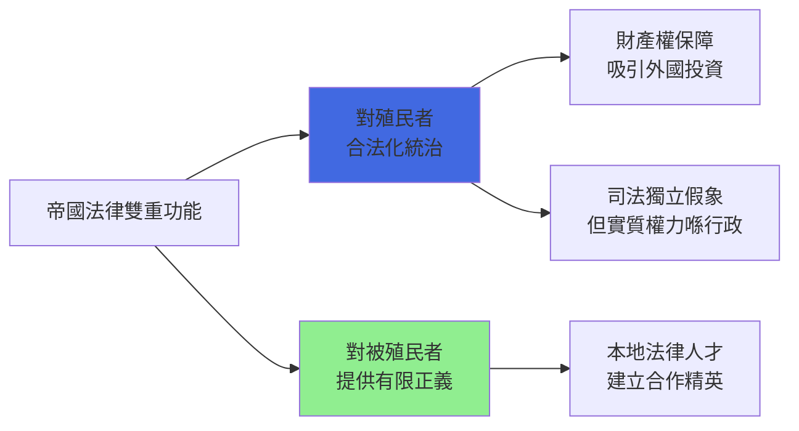

# HIST2179 法律、帝國與世界史 / Law, Empire and World History: From Pirates to Human Rights?

**Instructor**: Alastair McClure
**Department**: History, HKU
**Official source**: [HKU History Course Description 2024-25](https://history.hku.hk/wp-content/uploads/2024/07/HIST-2425.pdf)
**Style**: 袁騰飛式 — 犀利揭穿：所謂「法治」——究竟係正義工具定係帝國主義借口？

---

## 問題 1：5 個核心心智模型

### 心智模型 1：「法治」話語——帝國主義點樣用法律正當化征服
學者 **Lauren Benton**（*Law and Colonialism*, 2001）指出：英帝國用「法治」（rule of law）將殖民剝削合法化。學者 **McClure**（HKU）分析香港案例：普通法制度從英國移植到香港，形成獨特法律文化。

- **1815-1914** 英帝國擴張到印度、緬甸、馬來亞、香港
- **1842-1997** 香港普通法體系延續至回歸後
- **案例**：香港法院點樣處理殖民時期華人與歐洲人不平等法律地位

### 心智模型 2：「海盜」形象——點解有些人被稱為海盜，而其他人被稱為海軍？
學者 **Marcus Rediker**（*Villains of All Nations*, 2004）分析：18世紀加勒比海盜其實係逃跑奴隸、水手、邊緣人——海盜形象係英帝國宣傳機器製造。

### 心智模型 3：「國際法」誕生——歐洲點樣建立有利自己嘅國際法規則
學者 **Martti Koskenniemi**（*The Gentle Civilizer of Nations*, 2001）指出：國際法從一開始就係歐洲列強利益嘅法律表達。

### 心智模型 4：帝國主義法律遺產——後殖民國家點樣處理殖民法律遺產？
學者 **Sally Engle Merry**（*Human Rights and Gender Violence*, 2006）分析人權話語點樣成為新帝國主義工具。

### 心智模型 5：「法治 vs 人治」——點解香港「法治」至今仍係核心價值？
學者 **Simon Leys**（*The Burning Forest*, 1988）分析中國傳統法律觀念同西方法治觀念嘅根本差異。

---

## 問題 2：3 個根本分歧

### 分歧 1：英帝國法律——傳播文明定係壓迫工具？
- **A 方（正面的Legacy派）**：普通法制度引入法治、司法獨立
- **B 方（批判派）**：**Lauren Benton**——法律從來都係帝國控制工具

### 分歧 2：人權——普世價值定係西方霸權話語？
- **A 方（普世派）**：人權係人類共同追求
- **B 方（文化相對派）**：**Koskenniemi**——人權話語係西方價值觀輸出

### 分歧 3：香港普通法——回歸後命運如何？
- **A 方（樂觀派）**：普通法制度成功運行至2047
- **B 方（懷疑派）**：司法獨立受壓令法治受損

---

## 問題 3：10 個深度問題

1. 1815 年「爪哇海盜」——點解英國海軍可以去東南亞消滅「海盜」？呢啲「海盜」究竟係海盜定係當地漁民/商人？
2. 香港普通法制度——點解可以喺一個華人社會成功運行？但係回歸後呢個制度能走多遠？
3. 從歷史角度——點解英帝國要建立「法治」形象？呢個形象同實際殖民統治有乜嘢差距？
4. 「帝國法律」遺產——印度普通法體系至今仍然運行，但係呢個體系點樣同時服務殖民者同被殖民者？
5. 人權話語——點解西方國家可以指責其他國家人權問題，但係對自己殖民歷史閉口不言？呢個雙重標準揭示咗乜嘢？
6. 從國際法角度——點解 1945 年之後「主權平等」原則可以確立，但係美國可以繞過聯合國出兵伊拉克？
7. 法律史點樣揭示階級、種族、性別不平等？殖民法律點樣特別打壓邊緣群體？
8. 從中國法律傳統——點解傳統中國以「禮」治國，而西方強調「法」？呢個差異點樣影響兩種文明法律觀念？
9. 「歷史終結論」破產之後——自由主義國際秩序前景如何？點解西方開始懷疑自己建立嘅國際法體系？
10. 如果你是法官（香港/新加坡/馬來西亞）——普通法制度點樣同時服務當地文化同國際標準？呢個矛盾點樣解決？

---

# 核心心智模型深化（中英對照）

## 1. 法治帝國主義 / Rule of Law Imperialism

### 1.1 Bilingual 概念對照
- 法治 (fǎzhì) = Rule of Law — 法律面前人人平等
- 普通法 (pǔtōng fǎ) = Common Law — 英國法律傳統
- 人權 (rénquán) = Human Rights — 普世道德標準

### 1.3 袁騰飛式犀利觀察
> 「英帝國最犀利嘅發明——就係用『法治』嚟解釋『掠奪』！英國人建法庭、請法官、培訓律師——然後話你知：『我哋係嚟傳播文明！』——但係法庭上坐緊的全部都係英國人！」

### 1.4 Deep Test Question
**考試題**：選擇一個具體案例（印度/香港/肯尼亞），分析英帝國法律制度點樣同時服務殖民者利益同被殖民者需求。呢個「雙重功能」揭示咗法律乜嘢本質特性？

### 1.5 圖解

---

## 總結

**HIST2179 Law, Empire and World History** 嘅核心價值：
1. **批判法律史**——法律從來唔係中性工具，而係權力關係嘅表達
2. **全球視角**——帝國法律遺產影響遍及印度、非洲、香港
3. **當代相關性**——香港法治争論係呢個歷史嘅延續

**袁騰飛金句**：
> 「法律最有趣之處——就係佢永遠話你知：『我哋係公平嘅！』但係當你研究法律歷史，你會發現：法律從來都係為某啲人服務，而非所有人。」

---

## 延伸閱讀

1. Benton, Lauren. *Law and Colonialism*. Princeton: Princeton University Press, 2001.
2. Koskenniemi, Martti. *The Gentle Civilizer of Nations: The Rise and Fall of International Law 1870-1960*. Cambridge: Cambridge University Press, 2001.
3. Merry, Sally Engle. *Human Rights and Gender Violence: Translating International Law into Local Justice*. Chicago: University of Chicago Press, 2006.
4. Rediker, Marcus. *Villains of All Nations: Atlantic Pirates in the Golden Age*. London: Verso, 2004.
5. McClure, Alastair. [HKU Law and Empire Research].
6. Leys, Simon. *The Burning Forest*. London: Minerva, 1988.
