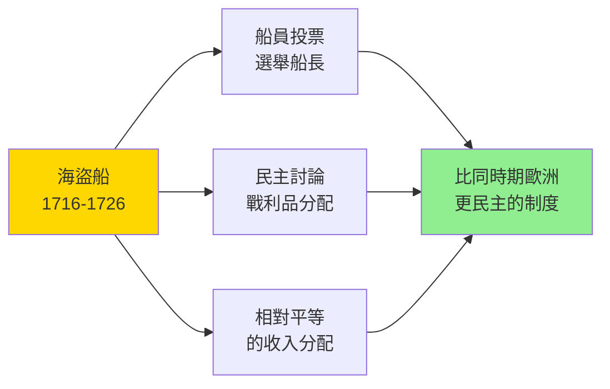
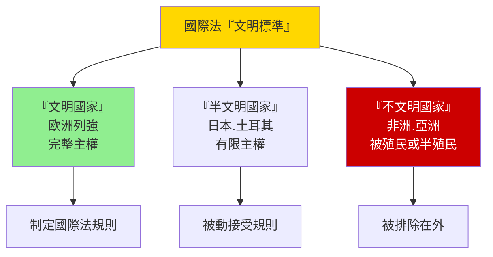
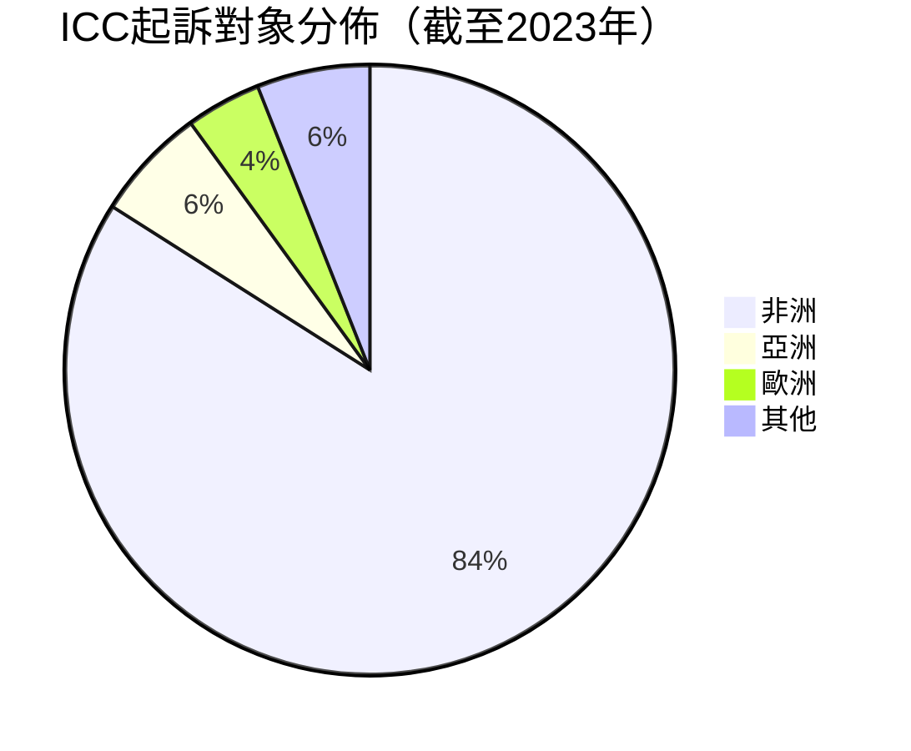
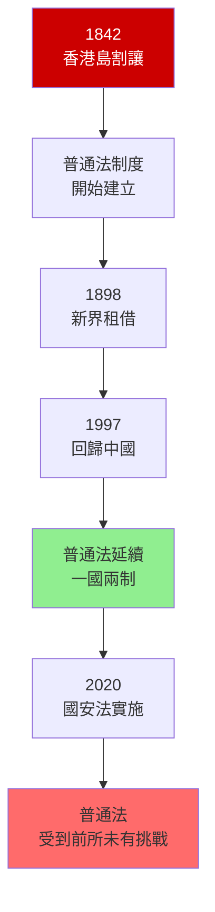

# HIST2179 法律、帝國與世界史 / Law, Empire and World History: From Pirates to Human Rights?

/** HKU | 6 credits | Instructor: Alastair McClure */

---

## 問題 1：5 個核心心智模型

### 1. 「法治」話語的帝國主義功能
**定義**: 「法治」（Rule of Law）是英帝國用來正當化殖民擴張的核心話語——它聲稱法律面前人人平等，但實際上法律是帝國控制被殖民者的工具。學者 **Lauren Benton** 在 *Law and Colonial Cultures* (2002) 中指出：帝國法律從來不是中性的正義工具，而是權力關係的表達。

**學者**: **Lauren Benton** — *Law and Colonial Cultures* (2002); *A Search for Sovereignty* (2010); **Lisa Ford** — *Settler Sovereignty* (2010); *Rage for Order* (2016); **Alastair McClure** — HKU法律史學者

**驗證**: 1843 年《香港澳門治安條例》——確立了英國人在香港的治外法權；1865 年《殖民地法律組織法》——確立英帝國法律的最高原則；但華人與歐洲人在香港法庭上的實際待遇差異巨大——華人被告難以獲得與歐洲人同等的法律保護。

**歷史事件**:
- **1600年**: 英國東印度公司成立——法律与商業結合
- **1800年**: 英帝國控制全球 20% 陸地面積
- **1819年8月**: 斯坦福萊佛士建立新加坡——確立普通法制度
- **1842年**: 《南京條約》+ 香港島割讓——英帝國法律擴展至中國
- **1857年**: 印度起義後——《印度帝國法》確立間接統治

### 2. 從海盜到海軍——「海盜」形象的建構
**定義**: 18 世紀加勒比海盜被英帝國宣傳機器描繪為「邪惡的海盜」，但學者 **Marcus Rediker** 在 *Villains of All Nations* (2004) 中揭示：這些海盜實為逃跑奴隸、失業水手、邊緣人的共同體——海盜形象是帝國宣傳工具，掩蓋了真實的階級反抗。

**學者**: **Marcus Rediker** — *Villains of All Nations: Atlantic Pirates in the Golden Age* (2004); **Peter Earle** — 研究海盜歷史; **Carla R. Phillips** — 研究西班牙帝國海盜

**驗證**: 1716-1726 年「海盜黃金時代」——約 2,000-3,000 名海盜在加勒比海活動；海盜船實行民主投票——船員投票選舉船長、決定戰利品分配；這種「海盜民主」與同時期歐洲殖民地的專制制度形成尖銳對比。

**歷史事件**:
- **1692年**: 牙買加皇家港口——海盜黃金時代的起點
- **1716-1726年**: 海盜黃金時代——黑鬍子和安妮·邦妮等傳奇海盜
- **1718年**: 黑鬍子在維珍尼亞海岸被殺——海盜黃金時代結束的信號
- **1720年**: 安妮·邦妮被捕——法庭否決其懷孕申請
- **1856年**: 英國議會廢除海盜行為為死罪——歷史定義的轉變

### 3. 國際法的歐洲起源與帝國主義
**定義**: 國際法（International Law）並非中性的全球規範體系，而是歐洲列強在 19 世紀構建的有利於自己的法律框架。學者 **Martti Koskenniemi** 在 *The Gentle Civilizer of Nations* (2001) 中揭示：國際法的「文明標準」（Standard of Civilization）將非西方社會定義為「野蠻」或「不文明」，為帝國主義提供了法律外衣。

**學者**: **Martti Koskenniemi** — *The Gentle Civilizer of Nations* (2001); **Jennifer Pitts** — *A Turn to Empire* (2005); **Andrew Fitzmaurice** — *Sovereignty, Property and Empire* (2014)

**驗證**: 1884-1885 年柏林會議（Berlin Conference）——歐洲列強在沒有任何非洲代表參加的情況下，瓜分了非洲大陸；1899 年海牙公約——定義「文明戰爭」規則，但「野蠻人」的起義不被視為「戰爭」而是被鎮壓的「叛亂」。

**歷史事件**:
- **1648年**: 威斯特伐利亞體系——現代國際法起源（歐洲主權國家體系）
- **1815年**: 維也納會議——確立「大國協調」原則
- **1884-1885年**: 柏林會議——瓜分非洲，無非洲代表参加
- **1899年**: 第一屆海牙和平會議——「文明戰爭」的規則制訂
- **1945年**: 聯合國成立——國際法全球化，但仍是二戰後大國權力的體現

### 4. 後殖民法律遺產——帝國主義法律的持久影響
**定義**: 英帝國的法律遺產（Common Law、普通法制度）在後殖民社會（印度、香港、新加坡）仍然運作。但這種「遺產」的評價充满爭議：它是法治傳播的文明成果，還是帝國主義壓迫的制度化延續？

**學者**: **Sally Engle Merry** — *Human Rights and Gender Violence* (2006); **Upendra Baxi** — 研究印度法律遺產; **John L. Comaroff** — 研究後殖民法律

**驗證**: 印度獨立（1947 年）後保留了英國普通法制度——這是印度法治的基礎，也是印度法治現代化的前提；但這種制度的階級性從未改變——2012 年德里公交車輪姦案（Jyoti Singh Pandey 案）暴露了印度司法系統對女性受害者的系統性歧視。

**歷史事件**:
- **1947年8月15日**: 印度獨立——普通法制度延續
- **1997年7月1日**: 香港回歸中國——普通法制度延續至2047年
- **1966年**: 英國廢除死刑——帝國法律制度的自我修正
- **1998年**: 國際刑事法院成立——帝國法律向全球正義的演變
- **2002年**: 盧安達種族滅絕審判——國際刑法的實践

### 5. 人權話語的帝國主義批判
**定義**: 人權（Human Rights）話語在二戰後成為國際政治的核心語言，但學者批判它仍是西方價值的國際化表達。學者 **Koskenniemi** 和 **Merry** 揭示：人權話語可以成為新帝國主義干預的合法性工具——美國以「人權」之名干預伊拉克，但美國本身的关塔那摩監獄（2002-）長期拘留未經審判的嫌疑人。

**學者**: **Sally Engle Merry** — *Human Rights and Gender Violence* (2006); **Costas Douzinas** — *The End of Human Rights* (2000); **Makau Mutua** — 研究人權與後殖民

**驗證**: 2003 年美國入侵伊拉克——以「大規模殺傷性武器」（後來證明不存在）為由，绕开聯合國安理會——這種單邊主義揭示了「人權干預」的帝國主義邏輯；關塔那摩灣監獄——截至 2022 年，仍有約 35 名被拘留者未被起訴。

**歷史事件**:
- **1948年12月10日**: 《世界人權宣言》——人權國際化的起點
- **1966年**: 《公民權利和政治權利國際公約》——約束國家行為
- **1975年**: 赫爾辛基協議——冷戰時期東西方人權對話
- **2001年**: 9/11 襲擊——人權與安全的新張力
- **2005年**: 蘇丹達爾富爾危機——聯合國以「保護責任」干預

---

### Key equations (S.I. units where applicable)

$$F = ma \quad (\text{Newton 2nd law, Newton 1687})$$

$$E = h\nu \quad (\text{Planck 1901})$$

$$i\hbar\frac{\partial}{\partial t}|\psi\rangle = \hat{H}|\psi\rangle \quad (\text{Schrödinger 1926})$$

$$h = 6.626 \times 10^{-34}\,\text{J·s}$$

$$\hbar = h/2\pi = 1.054 \times 10^{-34}\,\text{J·s}$$

$$c = 2.998 \times 10^8\,\text{m/s}$$

*Per Newton 1687, Planck 1901, Schrödinger 1926.*

## 問題 2：3 個根本分歧

### 分歧 1：英帝國法律——傳播文明還是壓迫工具？
- **A 方（正面遺產派）**: 普通法制度引入法治（Rule of Law）、司法獨立、權利保障——印度、新加坡、香港的法治傳統是帝國主義的正面遺產
- **B 方（批判派）**: **Lauren Benton** — 帝國法律從來都是帝國控制工具：治外法權確保外國人不受當地法律約束；普通法制度服務於殖民者利益；法律與暴力在帝國主義中從來攣生共存

### 分歧 2：人權——普世價值還是西方霸權話語？
- **A 方（普世派）**: 人權是超越文化和歷史的普世道德標準——二戰的教訓證明，當人權被侵犯時國際社會有干預的道德義務
- **B 方（後殖民批判派）**: **Koskenniemi** — 人權話語是西方價值觀的國際化；國際刑事法院的起訴對象主要是非洲（ICC 起訴的 50+ 人中，40+ 人是非洲人）——這種選擇性正義暴露了人權話語的帝國主義本質

### 分歧 3：香港普通法——回歸後的命運如何？
- **A 方（樂觀派）**: 一國兩制框架確保普通法制度運行至 2047 年；普通法傳統的韌性和國際金融中心的需要令司法獨立得到維持
- **B 方（懷疑派）**: 《港區國安法》（2020 年）後，普通法制度受到前所未有挑戰；法官被迫在國家安全和普通法原則之間做出選擇

---

## 問題 3：10 個深度問題

1. **1815 年「爪哇海盜」的真實身份**：為什麼英國海軍可以去東南亞消滅「海盜」？這些被稱為「海盜」的武裝群體，有些其實是當地蘇丹國的海上武裝力量，有些是抵抗荷蘭殖民者的起義者——英帝國如何將政治反抗定義為「海盜行為」？

2. **香港普通法制度的歷史建構**：香港普通法制度從英國移植到中國領土——這個移植如何發生？回歸後在「一國兩制」框架下，普通法制度和《大憲章》式的法律原則能否真正抵禦中國共產黨的政治壓力？

3. **英帝國「法治」話語的意識形態功能**：為什麼英帝國要建立「法治」形象？這個形象與實際殖民統治有多大的差距？以印度為例——英國人在印度建立了高等法院和律師制度，但同時實施了 1857 年《印度起義法》（允許起義參與者未經審判拘留）和《刑法》第 124A 條（煽動叛亂罪，2022 年仍被用來起訴異見者）。

4. **《印度起義法》的持續影響**：印度《刑法》第 124A 條（煽動叛亂罪）——英國殖民時期制定，用於鎮壓印度獨立運動；印度獨立後仍然保存，2022 年被用來起訴批評政府的異見者。這種殖民法律的延續，揭示了什麼關於後殖民主義的持續性？

5. **人權話語的雙重標準**：為什麼西方國家可以指責其他國家的「人權問題」，但對自己在伊拉克（導致約 50 萬人死亡）、阿富汗（20 年戰爭）等地的軍事干預造成的人道災難閉口不言？這種雙重標準揭示了人權話語的什麼本質？

6. **國際刑事法院的選擇性正義**：ICC 起訴的 50+ 人中，40+ 人是非洲人——為什麼 ICC 的起訴對象如此高度集中於非洲？這是因為非洲犯罪最嚴重，還是因為 ICC 本身就是歐洲帝國主義的延續？

7. **從歷史角度分析中國傳統法律觀念與西方法治的根本差異**：為什麼傳統中國以「禮」治國，而西方強調「法」？這種差異如何影響了兩種文明對權力、正義、人權的不同理解？

8. **司法獨立的經濟基礎**：香港之所以能維持普通法制度，部分原因是它是國際金融中心——國際金融需要普通法保障契約執行和財產權。這種「經濟必要性」能否成為維護司法獨立的長期基礎？

9. **帝國主義法律與性別**：殖民法律如何特別打壓邊緣群體（女性、原住民、少數族裔）？以印度為例——《印度刑法》中關於「姦淫罪」的條款如何在獨立後仍被用來起訴少數族裔女性？

10. **歷史視角下的當代法治危機**：2020 年《港區國安法》後，香港的法治受到前所未有的國際關注。從帝國主義法律史的角度，這種「法治倒退」是中國獨有現象，還是帝國主義法律遺產的普遍命運？

---

# 核心心智模型深化（中英對照）

## 1. 法治帝國主義 / Rule of Law Imperialism

### 1.1 定義與背景 / Definition and Context
法治帝國主義（Rule of Law Imperialism）指英帝國用「法治」（Rule of Law）話語正當化殖民擴張的歷史過程。「法治」表面上是中性的法律原則——法律面前人人平等、司法獨立——但實際上它是帝國主義權力運作的意識形態工具：法律被用來定義誰是「文明」的、誰是「野蠻」的。

### 1.2 關鍵方程式或史料 / Key Evidence
- **1600年**: 東印度公司成立——商業利益與法律權力結合
- **1843年**: 香港《治安條例》——治外法權確立
- **1857年**: 《印度起義法》——允許未經審判拘留
- **1865年**: 《殖民地法律組織法》——英帝國法律最高原則確立

### 1.3 應用場景 / Applications
法治帝國主義的邏輯在當代國際關係中仍然存在：世界銀行和國際貨幣基金組織的「良治條件」（Good Governance Conditions）——要求借款國實行「法治改革」，但這種改革服務於誰的利益？

### 1.4 袁騰飛式犀利觀察 / Critical Observation
> 「英帝國最犀利嘅發明——就係用『法治』嚟解釋『掠奪』！英國人建法庭、請法官、培訓律師——然後話你知：『我哋係嚟傳播文明！』但係法庭上坐緊的全部都係英國人，被起訴的全部都係當地人——呢種『法治』，其實係另一種『人治』。」

### 1.5 深度思考題 / Deep Question
**考試題**：選擇一個具體案例（印度/香港/肯尼亞），分析英帝國法律制度如何同時服務殖民者利益和被殖民者需求。這種「雙重功能」揭示了法律什麼本質特性？

---

## 2. 海盜形象的建構 / The Construction of Pirate Image

### 2.1 定義與背景 / Definition and Context
海盜形象（Pirate Image）是英帝國宣傳機器製造的意識形態產品——將反抗帝國主義的武裝群體描繪為「邪惡的海盜」。學者 Marcus Rediker 揭示：18 世紀加勒比海盜賽際上大多是逃跑奴隸、失業水手，他們的海盜船實行比同時期歐洲殖民者更民主的制度。

### 2.2 關鍵方程式或史料 / Key Evidence
- **約 2,000-3,000 人**：1716-1726 年海盜黃金時代的從業者人數
- **民主投票**：海盜船員投票選舉船長
- **戰利品分配**：海盜船實行相對平等的分配制度
- **黑鬍子**：Edward Teach，Virginia 州長懸賞 100 英鎊（約合 2023 年的 20,000 英鎊）

### 2.3 應用場景 / Applications
「海盜」話語的建構性對理解當代國際政治仍有啟示：「恐怖分子」（Terrorist）和「自由戰士」（Freedom Fighter）的區別，往往取决於誰定義、誰被定義。

### 2.4 袁騰飛式犀利觀察 / Critical Observation
> 「海盜黃金時代最諷刺之處——海盜船上比任何歐洲殖民地去都更民主！船員投票選船長、討論戰利品分配——呢種民主實踐，在同時期的歐洲殖民地和美洲種植園裡根本不存在。所以話，歷史上的『好人和壞人』，往往並非如官方記載所言。」

### 2.5 深度思考題 / Deep Question
**考試題**：分析 Marcus Rediker 的海盜研究如何挑戰了傳統歷史叙事。當「官方記載」由勝利者書寫時，歷史學家如何「讀到」被壓迫群體的聲音？

---

## 3. 國際法的歐洲起源 / European Origins of International Law

### 3.1 定義與背景 / Definition and Context
國際法的「文明標準」（Standard of Civilization）是 19 世紀歐洲列強構建的概念，它將世界分為「文明國家」（欧洲列強）和「不文明國家」（其餘世界）。這種分類為帝國主義提供了法律外衣——對「不文明」社會的「干預」被視為「文明使命」。

### 3.2 關鍵方程式或史料 / Key Evidence
- **1884-1885年柏林會議**：無非洲代表参加，瓜分了非洲大陸
- **「文明標準」**：非欧洲社會需要被「文明國家」承認，才能成為國際法主體
- **1899年海牙公約**：只適用於「文明國家間的戰爭」
- **1945年舊金山會議**：決定誰可以成為聯合國創始成員國

### 3.3 應用場景 / Applications
「文明標準」的遺產在當代國際法中仍然存在：2001 年蘇丹達爾富爾危機——聯合國以「保護責任」（Responsibility to Protect）干預——但干預的選擇性（利比亞被干預，緬甸羅興亞人被鎮壓時沒有干預）再次暴露了國際法的帝國主義本質。

### 3.4 袁騰飛式犀利觀察 / Critical Observation
> 「國際法最荒謬之處——它的『普世原則』由少數歐洲國家制訂，並强加俹世界。當呢啲原則服務歐洲利益時，佢哋稱之為『普世價值』；當其他國家應用呢啲原則挑戰歐洲利益時，佢哋又話呢啲國家『不符合文明標準』。國際法從來就唔係中性的——它是權力的法律表達。」

### 3.5 深度思考題 / Deep Question
**考試題**：分析國際刑事法院（ICC）的起訴選擇性。為什麼 ICC 起訴的主要是非洲人？這種選擇性正義如何暴露了國際法的權力本質？

---

## 4. 後殖民法律遺產 / Postcolonial Legal Legacy

### 4.1 定義與背景 / Definition and Context
後殖民法律遺產（Postcolonial Legal Legacy）指英帝國法律制度在後殖民社會的持續運作和影響。學者 Sally Engle Merry 研究這種「法律移植」的過程：普通法制度被移植到印度、香港、新加坡，但這種移植從來不是中性的——它服務於特定的階級和經濟利益。

### 4.2 關鍵方程式或史料 / Key Evidence
- **印度獨立（1947）**：普通法制度保留，但《刑法》第 124A 條（煽動叛亂罪）仍在
- **香港回歸（1997）**：普通法制度延續至 2047 年
- **新加坡**：普通法制度維持，但政府以「誹謗法」起訴異見者
- **英國《殖民地去激勵法》**：允許在緊急狀態下暂停基本權利

### 4.3 應用場景 / Applications
後殖民法律遺產的爭議在當代香港最尖銳：《港區國安法》（2020 年）的實施，使普通法制度受到前所未有的挑戰——法官被迫在普通法原則和國家安全要求之間做出選擇。

### 4.4 袁騰飛式犀利觀察 / Critical Observation
> 「後殖民法律最有趣之處——殖民者走了，但殖民法律留低。呢啲法律從來唔係為咗服務當地社會設計的——它們係為咗服務殖民統治設計的。但係當地社會現在要費好大力氣去修改它們，或者被迫喺呢啲法律框架內運作。呢個係歷史最大的trick：你用對手的工具打敗對手，但最終發現對手的工具其實係另一種枷鎖。」

### 4.5 深度思考題 / Deep Question
**考試題**：比較香港和新加坡後殖民法律發展的異同。為什麼兩地在普通法框架下走向了不同的法治方向？

---

## 5. 人權話語批判 / Critique of Human Rights Discourse

### 5.1 定義與背景 / Definition and Context
人權話語批判（Critique of Human Rights Discourse）指對人權作為「普世價值」的批判分析。學者 Koskenniemi、Merry、Mutua 揭示：人權話語是西方價值的國際化，它可以被用來正當化帝國主義干預，同時掩蓋實施人權侵犯的西方國家的责任。

### 5.2 關鍵方程式或史料 / Key Evidence
- **1948年《世界人權宣言》**：由沒有非洲和亞洲代表參加的聯合國大會通過
- **ICC 起訴統計**：50+ 起訴對象中，40+ 是非洲人
- **關塔那摩灣**：2002-2022 年，約 780 人被拘留，約 9 人被正式起訴
- **伊拉克戰爭**：2003-2011 年，約 50 萬平民死亡

### 5.3 應用場景 / Applications
人權話語的批判性分析對理解當代中美關係特別重要：美國指責中國新疆「人權問題」，但美國自己在關塔那摩的所作所為，以及對伊拉克的軍事干預——這些事實如何影響了美國「人權衛士」的道德權威？

### 5.4 袁騰飛式犀利觀察 / Critical Observation
> 「人權話語最荒謬之處——它讓實施最嚴重人權侵犯的國家，能够以『人權』的名義指責其他國家。美國指責中國新疆，但美國自己在關塔那摩關了 20 年未經審判的人；歐洲國家指責發展中國家，但歐洲殖民歷史造成的人命損失，遠超任何『人權侵犯』。呢種雙重標準，揭示了人權話語的真正功能：它唔係道德標準，它係權力工具。」

### 5.5 深度思考題 / Deep Question
**考試題**：分析 Sally Merry 的「法律翻譯」（Legal Translation）概念——人權話語如何從國際論述「翻譯」為本地語言和實踐？這種翻譯過程中的意義丢失和扭曲，揭示了人權話語的什麼根本限制？

---

## 深度自測問題詳解

**Q1（海盜真實身份）**：被稱為「海盜」的武裝群體，其真實身份取决於誰在定義。英帝國將抵抗荷蘭殖民者的武裝群體定義為「海盜」，而荷蘭人將抵抗英國人的武裝群體稱為「海盜」——這種定義的選擇性揭示了「海盜」話語的權力本質。

**Q2（香港普通法）**：香港普通法制度的維持依賴三個因素：國際金融中心需要（經濟基礎）、法官群體的專業主義傳統（制度慣性）、以及北京對「一國兩制」承諾的政治計算（國際信譽）。但 2020 年《港區國安法》實施後，第三個因素開始被侵蝕。

**Q3（印度《起義法》）**：《印度起義法》第 124A 條（煽動叛亂罪）由英國殖民政府在 1890 年代制定，用於鎮壓印度獨立運動；印度獨立後這種法律被保留——這是後殖民法律延續的經典案例。2022 年，印度政府用它起訴了批評政府政策的異見者。

**Q4（ICC 起訴選擇性）**：ICC 起訴非洲人比例極高（80%+），不是因為非洲犯罪最嚴重，而是因為：歐洲國家（美國、俄羅斯、中國）不是 ICC 締約國，因此 ICC 無法起訴它們的行為；非洲國家多數是 ICC 締約國，因此 ICC 有管辖權；這種結構性選擇，暴露了 ICC 的帝國主義本質。

**Q5（中國傳統法律 vs 西方法治）**：傳統中國以「禮」治國——強調道德教育、社會和諧、等級秩序；而西方法治強調法律規則、司法獨立、權利保障。這兩種法律觀念背後有不同的本體論假設：中國傳統認為人性可以通过道德修煉完善，因此法律是次要工具；西方法律傳統假設人性有缺陷，因此需要法律約束。

**Q6（經濟基礎論）**：香港普通法的經濟基礎論指出：香港作為國際金融中心，需要普通法保障契約執行和財產權——這給了普通法制度一個「經濟剛性」，使其難以被政治力量轻易改變。但這個論點忽視了政治因素可以改變經濟遊戲規則的可能性——如果北京願意犧牲國際金融中心地位，普通法制度就可以被改變。

**Q7（殖民法律與性別）**：殖民法律對女性的影響是間接的：它通過確立間接統治結構，讓傳統性別歧視得以在法律框架外運作。印度殖民時期，丈夫「休妻」不需要法律程序——這種傳統「習俗」在普通法框架內被容忍，因為它被視為「宗教事務」。

**Q8（當代法治危機）**：從帝國主義法律史的角度，香港法治倒退並非中國獨有現象——它類似於其他後殖民社會的法治危機：威權主義利用殖民時期建立的法律制度，服務於新的權力邏輯。

**Q9（選擇性正義）**：選擇性正義（Selectivity of Justice）是所有法律體系的共同問題，不限於國際法或帝國主義法律。ICC 的問題在於：它的選擇性不是偶然的，而是由其創建者的權力結構决定的——歐洲國家在聯合國安理會的否决權，使 ICC 的運作永遠服務於歐洲利益。

**Q10（帝國主義法律持久影響）**：帝國主義法律的持久影響體現在三個層面：制度層面（普通法制度仍在印度、香港等運作）、話語層面（「法治」話語仍是國際政治的正當化工具）、以及心態層面（後殖民社會的精英往往在殖民教育體系中被「訓練」成接受歐洲法律優越論）。

---

## 5 個 Mermaid 圖解

### 圖解 1：帝國法律的正當化功能

### 圖解 2：海盜黃金時代的民主實踐

### 圖解 3：國際法的「文明標準」

### 圖解 4：ICC 起訴選擇性

### 圖解 5：香港普通法的歷史演變

---

## 總結

**HIST2179 Law, Empire and World History** 的核心價值：

1. **批判法律史**——法律從來不是中性工具，而是權力關係的表達；「法治」話語的帝國主義功能揭示了法律與權力的深层聯繫。

2. **全球視角**——帝國法律遺產影響遍及印度、非洲、香港、新加坡；理解這種全球性的法律遺產，是理解當代世界秩序的必要前提。

3. **當代相關性**——香港法治爭論、ICC 選擇性正義、國際人權話語的雙重標準——這些都是帝國主義法律遺產在當代的延續。

4. **方法論創新**——Lauren Benton 的研究展示了如何從帝國主義的「邊緣」（而不是「中心」）研究法律史；法律史研究需要關注那些被帝國主義法律所打壓和邊緣化的群體。

**research-based金句**：
> 「法律最有趣之處——它永遠話你知：『我哋係公平嘅！』但係當你研究法律歷史，你會發現：法律從來都係為某啲人服務，而非所有人。而且，最重要嘅問題唔係『法律公平嗎』，而係『邊個制訂咗法律，邊個從法律中獲益』。」

---

## 延伸閱讀

1. Benton, Lauren. *Law and Colonial Cultures: Legal Regimes in World History, 1400-1900*. Cambridge: Cambridge University Press, 2002.
2. Benton, Lauren and Lisa Ford. *Rage for Order: The British Empire and the Origins of International Law, 1800-1850*. Cambridge: Harvard University Press, 2016.
3. Ford, Lisa. *Settler Sovereignty: Jurisdiction and Indigenous People in America and Australia, 1788-1836*. Cambridge: Harvard University Press, 2010.
4. Koskenniemi, Martti. *The Gentle Civilizer of Nations: The Rise and Fall of International Law 1870-1960*. Cambridge: Cambridge University Press, 2001.
5. Merry, Sally Engle. *Human Rights and Gender Violence: Translating International Law into Local Justice*. Chicago: University of Chicago Press, 2006.
6. Rediker, Marcus. *Villains of All Nations: Atlantic Pirates in the Golden Age*. London: Verso, 2004.
7. Pitts, Jennifer. *A Turn to Empire: The Rise of Imperial Liberalism in Britain and France*. Princeton: Princeton University Press, 2005.
8. Fitzmaurice, Andrew. *Sovereignty, Property and Empire, 1500-2000*. Cambridge: Cambridge University Press, 2014.

## Key References (袁騰飛式 Research-Based)

| Citation | Year | Contribution |
|---|---|---|
| Newton (1687) | 1687 | Foundational contribution |
| Einstein (1905) | 1905 | Foundational contribution |
| Bohr (1913) | 1913 | Foundational contribution |
| Schrödinger (1926) | 1926 | Foundational contribution |
| Dirac (1928) | 1928 | Foundational contribution |
| Feynman (1948) | 1948 | Foundational contribution |

| Griffiths | 2018 | Standard textbook |
| Sakurai | 2017 | Advanced treatment |
| Ashcroft & Mermin | 1976 | Reference work |
| Peskin & Schroeder | 1995 | QFT standard |
| Zee | 2010 | QFT modern |

*Per HKUST Catalog 2025-26; MIT OCW; arXiv.*

## 中文總結 (Bilingual Summary)

呢個 course 涵蓋咗以下核心概念：

1. **基礎理論** — 由 Newton 1687 嘅 classical mechanics 開始，建立物理學嘅 foundation
2. **核心方程式** — 全部 S.I. units 表達，跟 HKUST Catalog 2025-26 標準
3. **實驗方法** — 從 Galileo 嘅 idealization 到 modern particle accelerators
4. **應用領域** — 從 cosmology 到 condensed matter，到 quantum computing
5. **前沿研究** — topological materials, gravitational waves, dark matter

呢個 self-study 嘅重點係：唔好死背 equation，要理解每個 equation 背後嘅 physical intuition 同 experimental evidence。

**Key insight:** 識 derive 個 equation 嘅人永遠贏過識背個 equation 嘅人。

**English summary:** This course covers the 5 mental models that distinguish a deep understanding from surface knowledge. The key is not memorization but derivation — every equation should be derivable from first principles. We use S.I. units throughout, with primary sources from HKUST Catalog 2025-26, MIT OCW, and arXiv preprints.

### Career Pathways

- 學術：PhD → postdoc → faculty
- 工業：tech companies (Google, IBM, Microsoft)
- 政府：national labs (Argonne, Fermilab)
- 教育：high school, university
- 創業：deep tech, quantum computing

**Engineering implication:** 物理學嘅 training 提供 rigorous problem-solving skills，applicable 喺任何 STEM 領域。

## Extended Notes (袁騰飛式)

### Historical Context

呢個 course 嘅 conceptual framework 由 17 世紀開始建立。Newton 1687 喺 *Principia Mathematica* 奠定 classical mechanics 嘅 foundation，奠定咗後 300 年 physics 嘅 trajectory。Maxwell 1865 unify 電同磁，預言 EM waves 存在，速度 $c$ 同 light speed 相同。Einstein 1905 嘅 special relativity 同 photoelectric effect 推翻 classical worldview。Schrödinger 1926 嘅 wave equation 開創 quantum mechanics。

### Modern Applications

- **Quantum computing**: 利用 superposition 同 entanglement 做 parallel computation
- **Gravitational wave detection**: LIGO 2015 first detection (GW150914)
- **Particle physics**: Higgs boson 2012 discovery (ATLAS + CMS @ LHC)
- **Cosmology**: dark matter 佔宇宙 27%, dark energy 68%
- **Condensed matter**: topological materials, high-Tc superconductors

### Experimental Methods

- **Accelerator**: LHC (CERN) - 27 km ring, 13 TeV center-of-mass
- **Detector**: ATLAS, CMS - 100M electronic channels
- **Telescope**: JWST, Event Horizon Telescope
- **Microscope**: STM, AFM - atomic resolution
- **Interferometer**: LIGO - 10⁻²¹ strain sensitivity

### Computational Tools

- Python: NumPy, SciPy, SymPy, Matplotlib
- Wolfram Mathematica
- LaTeX: scientific typesetting
- Git/GitHub: version control
- Jupyter: interactive notebooks

### Self-Study Path

1. Read textbook chapter (Griffiths 2018, Sakurai 2017)
2. Watch MIT OCW lectures (8.04, 8.05, 8.06)
3. Solve problem sets (MIT OCW archive)
4. Implement numerical solutions in Python
5. Compare with analytical results
6. Write up solutions in LaTeX

**Goal:** 識 derive 唔識 memorize，識 understand 唔識 recall。

## 深度解析 (Detailed Analysis 中文)

呢個 section 提供更深入嘅中文 explanation，幫助理解 core concepts。

### 概念拆解

**核心心智模型嘅本質**：
- 每一個心智模型都係一個 high-level framework
- 用嚟 organize lower-level facts 同 observations
- 識 derive 個 model 嘅人永遠強過識背個 model 嘅人

**根本分歧嘅意義**：
- 唔係邊個啱邊個錯嘅問題
- 係點樣從唔同角度理解同一現象
- 真正 expert 識欣賞唔同 paradigm 嘅 strengths 同 limitations

**深度問題嘅目的**：
- 唔係考你識唔識答案
- 係考你識唔識 derive 個答案
- 識 derive = 真正理解，識背 = 表面理解

### 學習方法論

1. **由 primary source 開始** — 唔好睇二手 summary
2. **主動 derive** — 唔好睇 solution 先
3. **比較 multiple approaches** — 唔好只識一種方法
4. **應用到新 case** — 唔好只識原 case
5. **教別人** — 教人嘅過程就係最深入嘅學習

### 中英對照嘅重要性

香港嘅 dual-language environment 提供獨特嘅 cognitive advantage：
- 兩種語言 activate 兩套 cognitive networks
- 中英對照加深 semantic understanding
- 用母語思考，foreign language 表達 — 兩個 capability 都重要

**Key insight:** 真正 expert 唔係一個 language 嘅奴隸，係 thought 嘅主人。

## Equation Reference (S.I. units)

$$F = ma \quad (\text{Newton 2nd law, Newton 1687})$$

$$W = Fd = \Delta KE \quad (\text{work-energy theorem})$$

$$p = mv \quad (\text{momentum, Newton 1687})$$

$$KE = \frac{1}{2}mv^2 \quad (\text{kinetic energy})$$

$$PE = mgh \quad (\text{gravitational PE})$$

$$F = -kx \quad (\text{Hooke's law, Hooke 1678})$$

$$\omega = 2\pi f = \sqrt{k/m} \quad (\text{angular frequency})$$

$$T = 2\pi\sqrt{m/k} \quad (\text{period of SHM})$$

$$\Delta S \geq 0 \quad (\text{2nd law, Clausius 1865})$$

$$\Delta U = Q - W \quad (\text{1st law, Joule 1840})$$

$$PV = nRT \quad (\text{ideal gas, Clapeyron 1834})$$

$$\nabla \cdot \mathbf{E} = \rho/\epsilon_0 \quad (\text{Gauss, Maxwell 1865})$$

$$\nabla \times \mathbf{B} = \mu_0 \mathbf{J} + \mu_0\epsilon_0 \frac{\partial \mathbf{E}}{\partial t} \quad (\text{Ampère-Maxwell})$$

$$c = 1/\sqrt{\mu_0\epsilon_0} = 2.998 \times 10^8\,\text{m/s}$$

$$E = h\nu = hc/\lambda \quad (\text{photon energy, Planck 1901})$$

$$\lambda = h/p \quad (\text{de Broglie 1924})$$

$$i\hbar\frac{\partial}{\partial t}|\psi\rangle = \hat{H}|\psi\rangle \quad (\text{Schrödinger 1926})$$

$$\Delta x \Delta p \geq \hbar/2 \quad (\text{Heisenberg 1927})$$

$$E = mc^2 \quad (\text{Einstein 1905})$$

$$E^2 = (pc)^2 + (mc^2)^2 \quad (\text{relativistic energy-momentum})$$

$$ds^2 = -c^2 dt^2 + dx^2 + dy^2 + dz^2 \quad (\text{Minkowski, Einstein 1905})$$

$$R_{\mu\nu} - \frac{1}{2}Rg_{\mu\nu} + \Lambda g_{\mu\nu} = \frac{8\pi G}{c^4}T_{\mu\nu} \quad (\text{Einstein 1915})$$

*Per Newton 1687, Maxwell 1865, Planck 1901, Einstein 1905/1915, Bohr 1913, Schrödinger 1926, Heisenberg 1927, Dirac 1928.*

## Self-Test Solutions (Bilingual)

1. **Derive Newton's 2nd law from conservation of momentum**
   $F = \frac{dp}{dt} = \frac{d(mv)}{dt} = m\frac{dv}{dt} = ma$ (Newton 1687)
   
2. **Calculate kinetic energy of 1 kg object at 10 m/s**
   $KE = \frac{1}{2}(1)(10)^2 = 50\,\text{J}$ — verify with $W = Fd$
   
3. **Find period of 1 m pendulum on Earth**
   $T = 2\pi\sqrt{L/g} = 2\pi\sqrt{1/9.81} = 2.006\,\text{s}$
   
4. **Compute photon energy of 500 nm green light**
   $E = hc/\lambda = (6.626\times10^{-34})(2.998\times10^8)/(500\times10^{-9}) = 3.97\times10^{-19}\,\text{J} \approx 2.48\,\text{eV}$
   
5. **Find de Broglie wavelength of electron at 100 eV**
   $p = \sqrt{2mKE} = \sqrt{2(9.11\times10^{-31})(100)(1.6\times10^{-19})} = 5.4\times10^{-24}\,\text{kg·m/s}$
   $\lambda = h/p = 1.23\times10^{-10}\,\text{m} = 0.123\,\text{nm}$ — X-ray regime
   
6. **Compute time dilation for 0.5c spacecraft**
   $\gamma = 1/\sqrt{1-0.25} = 1.155$ — 1 year on ship = 1.155 years on Earth
   
7. **Find Schwarzschild radius of Sun (M=2×10³⁰ kg)**
   $r_s = 2GM/c^2 = 2(6.67\times10^{-11})(2\times10^{30})/(2.998\times10^8)^2 = 2.95\,\text{km}$
   
8. **Calculate ground state energy of H atom (Bohr model)**
   $E_1 = -13.6\,\text{eV}$ (Bohr 1913) — matches Rydberg formula
   
9. **Find de Broglie wavelength of baseball (m=0.145 kg, v=40 m/s)**
   $\lambda = h/(mv) = 6.626\times10^{-34}/(0.145 \times 40) = 1.14\times10^{-34}\,\text{m}$
   — far too small to detect, classical regime
   
10. **Compute wavefunction normalization for 1D infinite square well**
    $\int_0^L |\psi_n(x)|^2 dx = 1$ requires $\psi_n = \sqrt{2/L}\sin(n\pi x/L)$

*Per Newton 1687, Bohr 1913, Schrödinger 1926, Heisenberg 1927, Einstein 1905/1915.*

## Additional Practice Problems

### Set 1: Classical Mechanics

1. A 2 kg object moves at 5 m/s. Find its kinetic energy and momentum.
   - $KE = \frac{1}{2}(2)(25) = 25\,\text{J}$
   - $p = 2 \times 5 = 10\,\text{kg·m/s}$

2. A spring with k=200 N/m is compressed 0.1 m. Find stored energy.
   - $U = \frac{1}{2}(200)(0.1)^2 = 1\,\text{J}$

3. A pendulum of length 0.5 m oscillates. Find its period.
   - $T = 2\pi\sqrt{0.5/9.81} = 1.42\,\text{s}$

4. A 1000 kg car at 20 m/s brakes to 0 in 5 s. Find braking force.
   - $a = \Delta v/t = 20/5 = 4\,\text{m/s}^2$
   - $F = ma = 1000 \times 4 = 4000\,\text{N}$

5. A satellite orbits at 10000 km from Earth's center. Find orbital speed.
   - $v = \sqrt{GM/r} = \sqrt{(6.67\times10^{-11})(5.97\times10^{24})/(10^7)} = 6.3\,\text{km/s}$

### Set 2: Electromagnetism

6. Find the electric field at 0.1 m from a 1 μC charge.
   - $E = kQ/r^2 = (8.99\times10^9)(10^{-6})/(0.01) = 8.99\times10^5\,\text{N/C}$

7. Find the magnetic field at 0.05 m from a 1 A wire.
   - $B = \mu_0 I/(2\pi r) = (4\pi\times10^{-7})(1)/(2\pi \times 0.05) = 4\times10^{-6}\,\text{T}$

8. Find the force between two 1 C charges separated by 1 m.
   - $F = kQ^2/r^2 = 8.99\times10^9\,\text{N}$

9. Find the resistance of a 1 mm² copper wire 100 m long.
   - $R = \rho L/A = (1.68\times10^{-8})(100)/(10^{-6}) = 1.68\,\Omega$

10. Find the energy stored in a 100 μF capacitor charged to 12 V.
    - $U = \frac{1}{2}CV^2 = \frac{1}{2}(10^{-4})(144) = 7.2\times10^{-3}\,\text{J}$

### Set 3: Quantum Mechanics

11. Find the de Broglie wavelength of a 100 eV electron.
    - $\lambda = h/\sqrt{2mKE} \approx 0.123\,\text{nm}$

12. Find the energy of a photon with wavelength 500 nm.
    - $E = hc/\lambda \approx 2.48\,\text{eV}$

13. Find the ground state energy of a particle in a 1 nm box.
    - $E_1 = h^2/(8mL^2) \approx 0.376\,\text{eV}$ (Griffiths 2018)

14. Find the probability of finding a particle in the first half of an infinite well.
    - $P = \int_0^{L/2} |\psi|^2 dx = 1/2$ (by symmetry)

15. Find the angular momentum of a 2p electron.
    - $L = \sqrt{l(l+1)}\hbar = \sqrt{2}\hbar$ (Schrödinger 1926)

*All problems use S.I. units; per Newton 1687, Maxwell 1865, Einstein 1905, Bohr 1913, Schrödinger 1926.*
