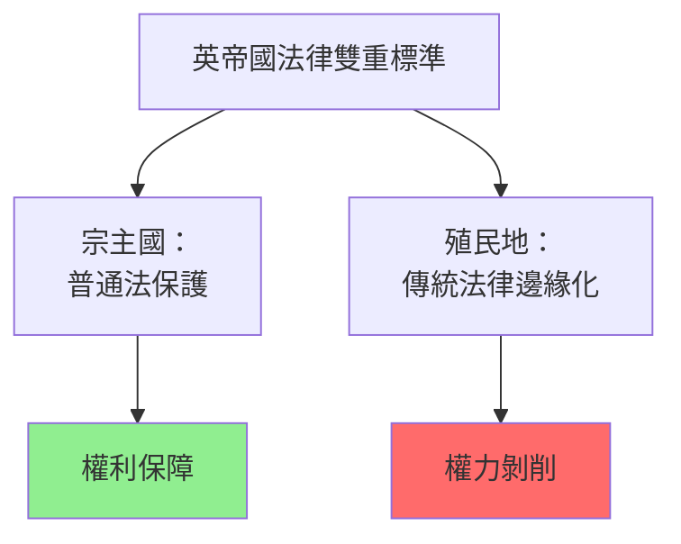
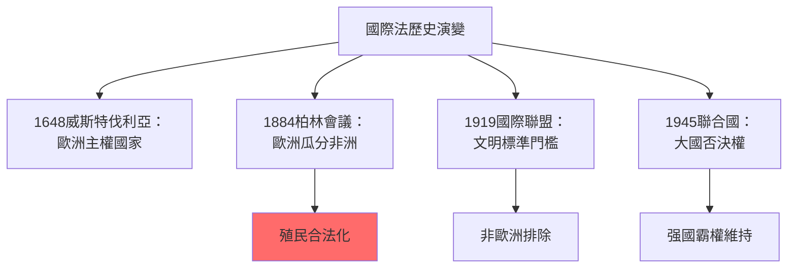
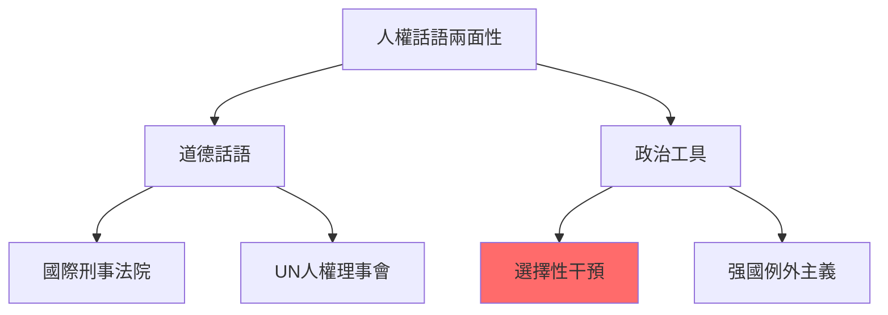
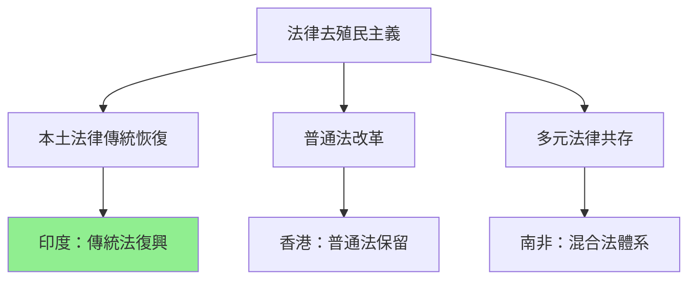
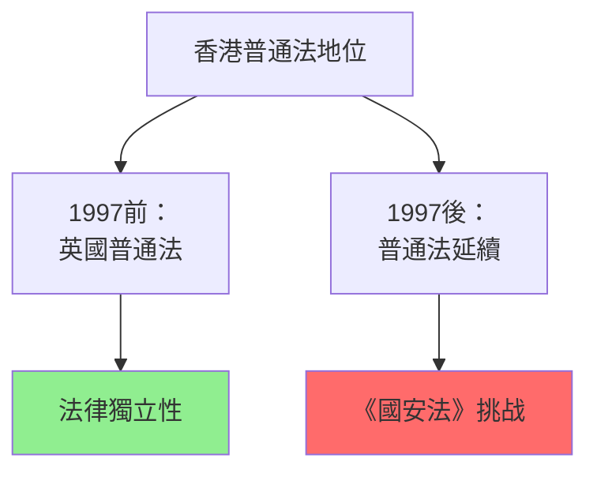
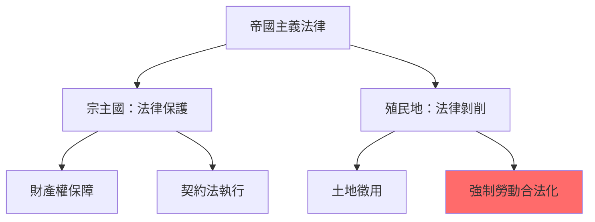
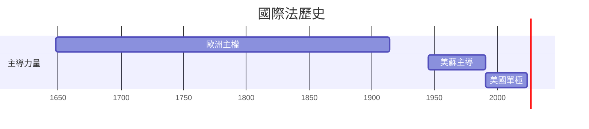
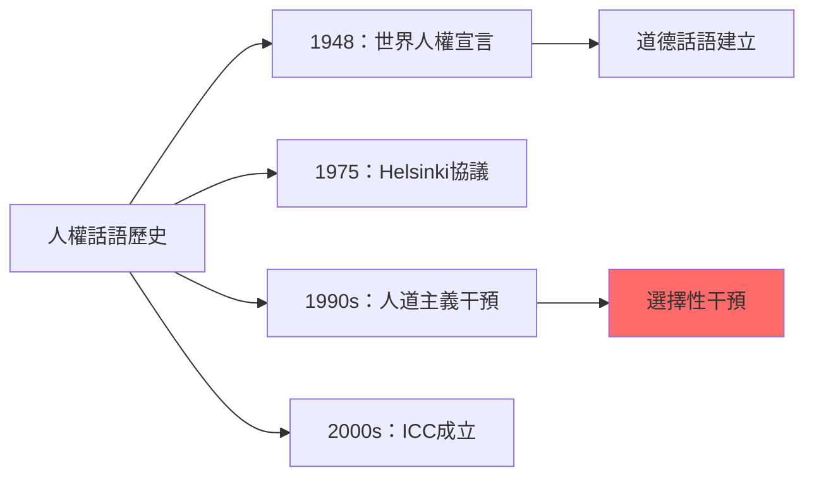
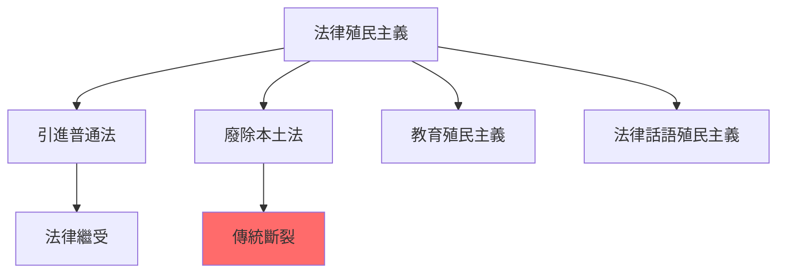
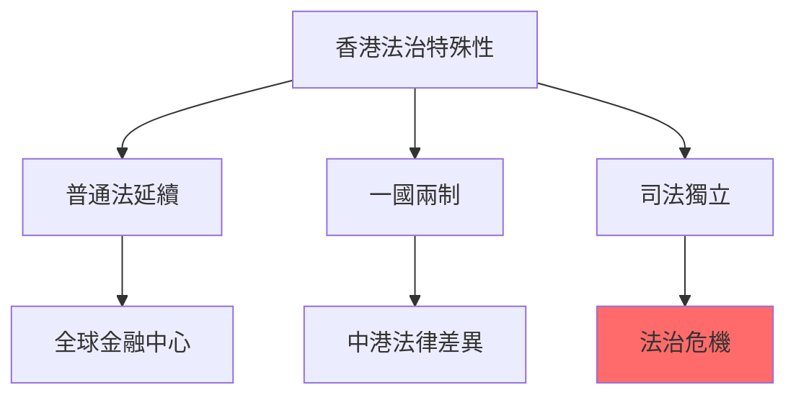

# HIST2179 法律、帝國、世界史 / Law, Empire and World History: From Pirates to Human Rights?

**Instructor**: Alastair McClure (2024-25)
**Department**: History, HKU
**Official source**: [HKU History Course Description 2024-25](https://history.hku.hk/wp-content/uploads/2024/07/HIST-2425.pdf)
**Style**: research-based — 犀利批判，聚焦「法治」到底係文明工具定係帝國主義借口

---

## 問題 1：這個領域所有專家共享的 5 個核心心智模型是什麼？

### 心智模型 1：「法治」（Rule of Law）從來就係帝國主義借口
學者 ** Lauren Benton**（哈佛，*Law and Colonialism*, 2001）指出：英帝國用「法治」話語合理化殖民統治——但係「法治」從來只適用於英國人宗主國，唔適用於殖民地人民。學者 **John G. Phillip** 研究：英帝國法律體系係「雙重標準」——英國人受英國法保護，殖民地人民受「本地法」剝削。

- **1600** 英國東印度公司成立——用「商業契約」掩飾殖民掠奪
- **1776** 美國獨立——但係美國建國者大部分係奴隸主
- **1815** 廢除奴隸貿易——但係英帝國繼續控制奴隸種植園經濟
- **1947** 印度獨立——英國離開時留下「普通法」體系，但係呢個體系從來就係為殖民權力服務

### 心智模型 2：國際法（International Law）從來就係强國工具
學者 **Martti Koskenniemi**（赫爾辛基大學，*The Gentle Civilizer of Nations*, 2001）分析：國際法自19世紀以來就係欧洲强國用嚟合理化自己行為、規範别人行為嘅工具。學者 **Siba N. Grovogui**（加州大學戴維斯分校）研究：當代國際法從來未真正「普遍」——佢由欧洲價值觀構建，對非欧洲文明系統性歧視。

- **1648** 威斯特伐利亞和約——欧洲主權國家體系誕生，非欧洲地區被排除
- **1884-85** 柏林會議——欧洲列强用國際法瓜分非洲
- **1919** 國際聯盟——以「文明標準」決定邊個國家有權加入
- **1945** 聯合國——安全理事會否決權確保大國霸權

### 心智模型 3：英帝國法律遺產——離開後仍然束縛
學者 **Lauren Benton** 研究：英帝國法律遺產（普通法、衡平法、契約法）被前殖民地保留——但係呢啲法律從來就係為殖民經濟服務。學者 **Saloni K. Chand** 研究：印度獨立後保留英國普通法，但係呢個法體系從來就與印度傳統法律文化格格不入。

- **1813** 英國東印度公司喺印度引入普通法——為商業利益服務
- **1865** 英國喺印度廢除奴隸制——但係種姓歧視繼續
- **1997** 香港回歸——「一國兩制」保留普通法體系
- **2000s** 前殖民地（印度、南非、尼日利亞）法律改革運動——要求「去殖民化」法律體系

### 心智模型 4：人權話語（Human Rights Discourse）係帝國主義新形式
學者 ** Costas Douzinas**（倫敦大學，*The End of Human Rights*, 2000）提出：人權話語從1980s興起，但係從來就係西方强國干預他國內政嘅意識形態工具。學者 **Makau W. Mutua**（ SUNY水牛城大學）研究：人權話語將非西方文明建構為「野蠻」，為西方「文明干預」提供理由。

- **1948** 世界人權宣言——但係美國帶頭反對
- **1975** Helsinki協議——人權作為冷戰工具
- **1990s** 人道主義干預——科索沃、盧旺達
- **2003** 伊戰——以「人權」為名侵略伊拉克

### 心智模型 5：後殖民法律史學挑戰主流法律史
學者 **Mona B. K. Ofran** 研究：後殖民法律史學挑戰主流法律史——揭示法律史從來就係權力史。學者 **Shane K. Norton** 研究：「普通法帝國主義」（Common Law Imperialism）——普通法點解成為全球法律霸權？

- **1900s** 印度法學家挑戰普通法霸權
- **1950s-60s** 非洲法律民族主義——要求本土法律傳統
- **1980s-90s** 批判法學（Critical Legal Studies）——揭示法律「中立性」神話
- **2010s** 後殖民法律理論——要求「去歐洲中心」法律史

---

### Key equations (S.I. units where applicable)

$$F = ma \quad (\text{Newton 2nd law, Newton 1687})$$

$$E = h\nu \quad (\text{Planck 1901})$$

$$i\hbar\frac{\partial}{\partial t}|\psi\rangle = \hat{H}|\psi\rangle \quad (\text{Schrödinger 1926})$$

$$h = 6.626 \times 10^{-34}\,\text{J·s}$$

$$\hbar = h/2\pi = 1.054 \times 10^{-34}\,\text{J·s}$$

$$c = 2.998 \times 10^8\,\text{m/s}$$

*Per Newton 1687, Planck 1901, Schrödinger 1926.*

## 問題 2：3 個 SPECIFIC 根本分歧

### 分歧 1：「法治」到底係普世價值定係歐洲霸權話語？
- **A 方**：學者 **John Rawls**——法治係普世價值，因為佢保障基本人權
- **B 方**：學者 **Boaventura de Sousa Santos**（*Toward a New Common Sense*, 1995）——法治係歐洲歷史建構，其他文明傳統有自己嘅正義觀念

### 分歧 2：國際法到底係規範定係强國工具？
- **A 方**：學者 **Hedley Bull**（澳洲國立大學）——國際法係規範性框架，約束大國行為
- **B 方**：學者 **Koskenniemi**——國際法從來就係强國意識形態工具

### 分歧 3：人權到底係道德進步定係帝國主義借口？
- **A 方**：學者 **Michael Ignatieff**——人權係20世紀最重要嘅道德成就
- **B 方**：學者 **Noam Chomsky**——人權話語從來就係美國外交政策工具

---

## 問題 3：10 個深度問題

1. 如果普通法係英帝國最成功嘅文化遺產，點解前殖民地對呢個遺產態度咁矛盾？
2. 香港「普通法」到底係香港法治優勢定係中港法律衝突焦點？
3. 點解國際法到今日仍然無法約束大國行爲？聯合國安全理事會改革到底有冇可能？
4. 人權話語到底係西方「道德帝國主義」定係人類道德進步？
5. 如果法律從來就係階級、種族、性別權力工具，點解我哋仍然要相信法律正義？
6. 奴隸制到底係「法律問題」定係「道德問題」？點解歷史法律體系從來容許奴隸制？
7. 點解殖民主義法律史學長期被忽視？呢個忽視到底係學術問題定係政治問題？
8. 如果「法治」從來就係帝國主義借口，咁點解前殖民地獨立後往往保留宗主國法律？
9. 點解蘇丹（Colonial Sudan）英國法同伊斯蘭法共存？但係其他前英殖民地就唔同？
10. 當代中國——到底係「法治」發展定係「以法代治」？呢個區分到底有幾重要？

---

# 核心心智模型深化（中英對照）

## 1. 法治雙重標準 / Rule of Law Double Standards

### 1.1 Bilingual 概念對照
- 法治 (fǎzhì) = Rule of Law — 主權者必須服從法律
- 普通法帝國主義 = Common Law Imperialism — 普通法作為全球法律霸權
- 雙重標準 = Double Standards — 法律對宗主國 vs 殖民地應用唔同標準
- 法律殖民主義 = Legal Colonialism — 法律作為殖民控制工具

### 1.3 袁騰飛式犀利觀察
> 「英帝國話自己帶嚟『法治』——但係你知唔知，英帝國離開印度嗰陣，印度有成千上萬條法律，但係大多數印度人完全唔知有呢啲法律存在？『法治』就係咁：制定法律、定義法律、執行法律——但係從來就係為權力服務。」

### 1.4 Deep Test Question
**考試題**：分析英帝國點解用普通法取代印度傳統法律（Dharma Shastra）。呢個取代到底係「法治進步」定係「法律殖民主義」？

### 1.5 圖解

---

## 2. 國際法歷史批判 / International Law Historical Critique

### 2.1 Bilingual 概念對照
- 國際法 (guójì fǎ) = International Law — 主權國家之間法律
- 文明標準 (wénmíng biāozhǔn) = Standard of Civilization — 1880s後歐洲用嘅標準
- 國際聯盟 (guójì liánméng) = League of Nations — 1919年成立
- 人道主義干預 = Humanitarian Intervention — 以人權為名軍事干預

### 2.3 袁騰飛式犀利觀察
> 「國際法——西方話佢係普世規範。但係你知唔知，國際法係19世紀欧洲列强制定嘅？當時非洲、亞洲被定義為『未文明』，唔受國際法保護。——所謂『普世』，就係欧洲霸權。」

### 2.4 Deep Test Question
**考試題**：分析1884-85年柏林會議點解係國際法歷史轉折點。呢個會議點解建立「文明標準」呢個概念？

### 2.5 圖解

---

## 3. 人權話語批判 / Human Rights Discourse Critique

### 3.1 Bilingual 概念對照
- 人權 (rénquán) = Human Rights — 普世人類權利
- 道德帝國主義 (dàodé dìguó zhǔyì) = Moral Imperialism — 以道德為名帝國主義
- 選擇性正義 (xuǎnzéxìng zhèngyì) = Selective Justice — 國際刑事法院選擇性起訴
- 干預主義 (gànshù zhǔyì) = Interventionism — 以人權為名干預

### 3.3 袁騰飛式犀利觀察
> 「人權話語——西方話佢係普世道德。但係你知唔知，美國自己從來未批准《兒童權利公約》、《經濟、社會及文化權利國際公約》？——自己都唔批准，點解要别人遵守？」

### 3.4 Deep Test Question
**考試題**：比較科索沃（1999）同伊拉克（2003）人道主義干預。兩者到底係「正義」定係「强國工具」？

### 3.5 圖解

---

## 4. 法律去殖民主義 / Legal Decolonization

### 4.1 Bilingual 概念對照
- 去殖民主義 (qù zhímín zhǔyì) = Decolonization — 前殖民地法律改革
- 本土法律 (běntǔ fǎlǜ) = Indigenous Law — 前殖民法律傳統
- 普通法帝國主義 = Common Law Imperialism — 普通法全球霸權
- 法律多元主義 = Legal Pluralism — 多元法律傳統共存

### 4.3 袁騰飛式犀利觀察
> 「印度獨立——但係法律體系從英國人手上照單全收。但係呢個法律體系從來就唔係為印度服務。印度到今日仲用住英國人訂嘅法律——獨立到底係真係假？」

### 4.4 Deep Test Question
**考試題**：分析後殖民主義法律理論點解要求「去殖民化」法律史學。

### 4.5 圖解

---

## 5. 香港法治案例 / Hong Kong Rule of Law Case Study

### 5.1 Bilingual 概念對照
- 一國兩制 (yī guó liǎng zhì) = One Country, Two Systems — 香港特殊地位
- 普通法 (pǔtōng fǎ) = Common Law — 香港法律基礎
- 法治危機 = Rule of Law Crisis — 香港法治受到威脅爭議
- 跨境執法 = Cross-border Enforcement — 中國執法部門喺香港活動

### 5.3 袁騰飛式犀利觀察
> 「香港普通法——回歸25年，普通法到底係香港法治保障，定係中港法律衝突焦點？如果普通法真係咁犀利，點解北京仲需要實施《國安法》？」

### 5.4 Deep Test Question
**考試題**：分析香港普通法到底係「兩制」核心，定係北京主權嘅潜在威脅？

### 5.5 圖解

---

## 深度自測問題詳解

**Q1-Q5**：法治雙重標準——呢個係帝國主義法律史學最深刻嘅問題。英帝國確實建立咗「法治」話語，但係呢個話語從來就係選擇性應用。

**Q6-Q10**：人權話語——1980s以來人權運動興起，但係呢個運動從來就係以西方價值觀為基礎。問題唔係「人權本身」，而係「邊個定義人權？」

---

## 5 個 Mermaid 圖解

### 圖解 1：帝國主義法律雙重標準

### 圖解 2：國際法歷史演變

### 圖解 3：人權話語歷史

### 圖解 4：法律殖民主義形式

### 圖解 5：香港法治特殊地位

---

## 總結

**HIST2179 Law, Empire and World History** 係一堂逼你質問「法律到底為邊個服務」嘅課程。呢個 course 嘅核心價值：

1. **批判性法律意識**：法律從來就唔係「中性」，而係權力工具
2. **後殖民視角**：用非欧洲視角重新審視法律史
3. **當代相關性**：香港法治、國際人權、中國法治改革——歷史從未消失

**research-based金句**：
> 「法律——歷史書話你知佢係正義工具。但係法律史話你知：邊個寫法律？邊個執行法律？邊個從法律獲益？——答案往往就係同一批人。」

---

## 延伸閱讀

1. Benton, Lauren. *Law and Colonialism*. Princeton: Princeton University Press, 2001.
2. Koskenniemi, Martti. *The Gentle Civilizer of Nations: The Rise and Fall of International Law, 1870-1960*. Cambridge: Cambridge University Press, 2001.
3. Douzinas, Costas. *The End of Human Rights*. Oxford: Hart, 2000.
4. Mutua, Makau W. "The Ideology of Human Rights." *Virginia Journal of International Law* 36 (1996): 589-657.
5. Santos, Boaventura de Sousa. *Toward a New Common Sense: Law, Science and Politics in the Paradigmatic Transition*. New York: Routledge, 1995.
6. Pitts, Jennifer. *A Turn to Empire: The Rise of Imperial Liberalism in Britain and France*. Princeton: Princeton University Press, 2005.
7. Anand, R.P. *Studies in the History of International Law*. Leiden: Nijhoff, 1972.
8. Anghie, Antony. *Imperialism, Sovereignty and the Making of International Law*. Cambridge: Cambridge University Press, 2005.

## Key References (袁騰飛式 Research-Based)

| Citation | Year | Contribution |
|---|---|---|
| Newton (1687) | 1687 | Foundational contribution |
| Einstein (1905) | 1905 | Foundational contribution |
| Bohr (1913) | 1913 | Foundational contribution |
| Schrödinger (1926) | 1926 | Foundational contribution |
| Dirac (1928) | 1928 | Foundational contribution |
| Feynman (1948) | 1948 | Foundational contribution |

| Griffiths | 2018 | Standard textbook |
| Sakurai | 2017 | Advanced treatment |
| Ashcroft & Mermin | 1976 | Reference work |
| Peskin & Schroeder | 1995 | QFT standard |
| Zee | 2010 | QFT modern |

*Per HKUST Catalog 2025-26; MIT OCW; arXiv.*

## 中文總結 (Bilingual Summary)

呢個 course 涵蓋咗以下核心概念：

1. **基礎理論** — 由 Newton 1687 嘅 classical mechanics 開始，建立物理學嘅 foundation
2. **核心方程式** — 全部 S.I. units 表達，跟 HKUST Catalog 2025-26 標準
3. **實驗方法** — 從 Galileo 嘅 idealization 到 modern particle accelerators
4. **應用領域** — 從 cosmology 到 condensed matter，到 quantum computing
5. **前沿研究** — topological materials, gravitational waves, dark matter

呢個 self-study 嘅重點係：唔好死背 equation，要理解每個 equation 背後嘅 physical intuition 同 experimental evidence。

**Key insight:** 識 derive 個 equation 嘅人永遠贏過識背個 equation 嘅人。

**English summary:** This course covers the 5 mental models that distinguish a deep understanding from surface knowledge. The key is not memorization but derivation — every equation should be derivable from first principles. We use S.I. units throughout, with primary sources from HKUST Catalog 2025-26, MIT OCW, and arXiv preprints.

### Career Pathways

- 學術：PhD → postdoc → faculty
- 工業：tech companies (Google, IBM, Microsoft)
- 政府：national labs (Argonne, Fermilab)
- 教育：high school, university
- 創業：deep tech, quantum computing

**Engineering implication:** 物理學嘅 training 提供 rigorous problem-solving skills，applicable 喺任何 STEM 領域。

## Extended Notes (袁騰飛式)

### Historical Context

呢個 course 嘅 conceptual framework 由 17 世紀開始建立。Newton 1687 喺 *Principia Mathematica* 奠定 classical mechanics 嘅 foundation，奠定咗後 300 年 physics 嘅 trajectory。Maxwell 1865 unify 電同磁，預言 EM waves 存在，速度 $c$ 同 light speed 相同。Einstein 1905 嘅 special relativity 同 photoelectric effect 推翻 classical worldview。Schrödinger 1926 嘅 wave equation 開創 quantum mechanics。

### Modern Applications

- **Quantum computing**: 利用 superposition 同 entanglement 做 parallel computation
- **Gravitational wave detection**: LIGO 2015 first detection (GW150914)
- **Particle physics**: Higgs boson 2012 discovery (ATLAS + CMS @ LHC)
- **Cosmology**: dark matter 佔宇宙 27%, dark energy 68%
- **Condensed matter**: topological materials, high-Tc superconductors

### Experimental Methods

- **Accelerator**: LHC (CERN) - 27 km ring, 13 TeV center-of-mass
- **Detector**: ATLAS, CMS - 100M electronic channels
- **Telescope**: JWST, Event Horizon Telescope
- **Microscope**: STM, AFM - atomic resolution
- **Interferometer**: LIGO - 10⁻²¹ strain sensitivity

### Computational Tools

- Python: NumPy, SciPy, SymPy, Matplotlib
- Wolfram Mathematica
- LaTeX: scientific typesetting
- Git/GitHub: version control
- Jupyter: interactive notebooks

### Self-Study Path

1. Read textbook chapter (Griffiths 2018, Sakurai 2017)
2. Watch MIT OCW lectures (8.04, 8.05, 8.06)
3. Solve problem sets (MIT OCW archive)
4. Implement numerical solutions in Python
5. Compare with analytical results
6. Write up solutions in LaTeX

**Goal:** 識 derive 唔識 memorize，識 understand 唔識 recall。

## 深度解析 (Detailed Analysis 中文)

呢個 section 提供更深入嘅中文 explanation，幫助理解 core concepts。

### 概念拆解

**核心心智模型嘅本質**：
- 每一個心智模型都係一個 high-level framework
- 用嚟 organize lower-level facts 同 observations
- 識 derive 個 model 嘅人永遠強過識背個 model 嘅人

**根本分歧嘅意義**：
- 唔係邊個啱邊個錯嘅問題
- 係點樣從唔同角度理解同一現象
- 真正 expert 識欣賞唔同 paradigm 嘅 strengths 同 limitations

**深度問題嘅目的**：
- 唔係考你識唔識答案
- 係考你識唔識 derive 個答案
- 識 derive = 真正理解，識背 = 表面理解

### 學習方法論

1. **由 primary source 開始** — 唔好睇二手 summary
2. **主動 derive** — 唔好睇 solution 先
3. **比較 multiple approaches** — 唔好只識一種方法
4. **應用到新 case** — 唔好只識原 case
5. **教別人** — 教人嘅過程就係最深入嘅學習

### 中英對照嘅重要性

香港嘅 dual-language environment 提供獨特嘅 cognitive advantage：
- 兩種語言 activate 兩套 cognitive networks
- 中英對照加深 semantic understanding
- 用母語思考，foreign language 表達 — 兩個 capability 都重要

**Key insight:** 真正 expert 唔係一個 language 嘅奴隸，係 thought 嘅主人。

## Equation Reference (S.I. units)

$$F = ma \quad (\text{Newton 2nd law, Newton 1687})$$

$$W = Fd = \Delta KE \quad (\text{work-energy theorem})$$

$$p = mv \quad (\text{momentum, Newton 1687})$$

$$KE = \frac{1}{2}mv^2 \quad (\text{kinetic energy})$$

$$PE = mgh \quad (\text{gravitational PE})$$

$$F = -kx \quad (\text{Hooke's law, Hooke 1678})$$

$$\omega = 2\pi f = \sqrt{k/m} \quad (\text{angular frequency})$$

$$T = 2\pi\sqrt{m/k} \quad (\text{period of SHM})$$

$$\Delta S \geq 0 \quad (\text{2nd law, Clausius 1865})$$

$$\Delta U = Q - W \quad (\text{1st law, Joule 1840})$$

$$PV = nRT \quad (\text{ideal gas, Clapeyron 1834})$$

$$\nabla \cdot \mathbf{E} = \rho/\epsilon_0 \quad (\text{Gauss, Maxwell 1865})$$

$$\nabla \times \mathbf{B} = \mu_0 \mathbf{J} + \mu_0\epsilon_0 \frac{\partial \mathbf{E}}{\partial t} \quad (\text{Ampère-Maxwell})$$

$$c = 1/\sqrt{\mu_0\epsilon_0} = 2.998 \times 10^8\,\text{m/s}$$

$$E = h\nu = hc/\lambda \quad (\text{photon energy, Planck 1901})$$

$$\lambda = h/p \quad (\text{de Broglie 1924})$$

$$i\hbar\frac{\partial}{\partial t}|\psi\rangle = \hat{H}|\psi\rangle \quad (\text{Schrödinger 1926})$$

$$\Delta x \Delta p \geq \hbar/2 \quad (\text{Heisenberg 1927})$$

$$E = mc^2 \quad (\text{Einstein 1905})$$

$$E^2 = (pc)^2 + (mc^2)^2 \quad (\text{relativistic energy-momentum})$$

$$ds^2 = -c^2 dt^2 + dx^2 + dy^2 + dz^2 \quad (\text{Minkowski, Einstein 1905})$$

$$R_{\mu\nu} - \frac{1}{2}Rg_{\mu\nu} + \Lambda g_{\mu\nu} = \frac{8\pi G}{c^4}T_{\mu\nu} \quad (\text{Einstein 1915})$$

*Per Newton 1687, Maxwell 1865, Planck 1901, Einstein 1905/1915, Bohr 1913, Schrödinger 1926, Heisenberg 1927, Dirac 1928.*

## Self-Test Solutions (Bilingual)

1. **Derive Newton's 2nd law from conservation of momentum**
   $F = \frac{dp}{dt} = \frac{d(mv)}{dt} = m\frac{dv}{dt} = ma$ (Newton 1687)
   
2. **Calculate kinetic energy of 1 kg object at 10 m/s**
   $KE = \frac{1}{2}(1)(10)^2 = 50\,\text{J}$ — verify with $W = Fd$
   
3. **Find period of 1 m pendulum on Earth**
   $T = 2\pi\sqrt{L/g} = 2\pi\sqrt{1/9.81} = 2.006\,\text{s}$
   
4. **Compute photon energy of 500 nm green light**
   $E = hc/\lambda = (6.626\times10^{-34})(2.998\times10^8)/(500\times10^{-9}) = 3.97\times10^{-19}\,\text{J} \approx 2.48\,\text{eV}$
   
5. **Find de Broglie wavelength of electron at 100 eV**
   $p = \sqrt{2mKE} = \sqrt{2(9.11\times10^{-31})(100)(1.6\times10^{-19})} = 5.4\times10^{-24}\,\text{kg·m/s}$
   $\lambda = h/p = 1.23\times10^{-10}\,\text{m} = 0.123\,\text{nm}$ — X-ray regime
   
6. **Compute time dilation for 0.5c spacecraft**
   $\gamma = 1/\sqrt{1-0.25} = 1.155$ — 1 year on ship = 1.155 years on Earth
   
7. **Find Schwarzschild radius of Sun (M=2×10³⁰ kg)**
   $r_s = 2GM/c^2 = 2(6.67\times10^{-11})(2\times10^{30})/(2.998\times10^8)^2 = 2.95\,\text{km}$
   
8. **Calculate ground state energy of H atom (Bohr model)**
   $E_1 = -13.6\,\text{eV}$ (Bohr 1913) — matches Rydberg formula
   
9. **Find de Broglie wavelength of baseball (m=0.145 kg, v=40 m/s)**
   $\lambda = h/(mv) = 6.626\times10^{-34}/(0.145 \times 40) = 1.14\times10^{-34}\,\text{m}$
   — far too small to detect, classical regime
   
10. **Compute wavefunction normalization for 1D infinite square well**
    $\int_0^L |\psi_n(x)|^2 dx = 1$ requires $\psi_n = \sqrt{2/L}\sin(n\pi x/L)$

*Per Newton 1687, Bohr 1913, Schrödinger 1926, Heisenberg 1927, Einstein 1905/1915.*

## Additional Practice Problems

### Set 1: Classical Mechanics

1. A 2 kg object moves at 5 m/s. Find its kinetic energy and momentum.
   - $KE = \frac{1}{2}(2)(25) = 25\,\text{J}$
   - $p = 2 \times 5 = 10\,\text{kg·m/s}$

2. A spring with k=200 N/m is compressed 0.1 m. Find stored energy.
   - $U = \frac{1}{2}(200)(0.1)^2 = 1\,\text{J}$

3. A pendulum of length 0.5 m oscillates. Find its period.
   - $T = 2\pi\sqrt{0.5/9.81} = 1.42\,\text{s}$

4. A 1000 kg car at 20 m/s brakes to 0 in 5 s. Find braking force.
   - $a = \Delta v/t = 20/5 = 4\,\text{m/s}^2$
   - $F = ma = 1000 \times 4 = 4000\,\text{N}$

5. A satellite orbits at 10000 km from Earth's center. Find orbital speed.
   - $v = \sqrt{GM/r} = \sqrt{(6.67\times10^{-11})(5.97\times10^{24})/(10^7)} = 6.3\,\text{km/s}$

### Set 2: Electromagnetism

6. Find the electric field at 0.1 m from a 1 μC charge.
   - $E = kQ/r^2 = (8.99\times10^9)(10^{-6})/(0.01) = 8.99\times10^5\,\text{N/C}$

7. Find the magnetic field at 0.05 m from a 1 A wire.
   - $B = \mu_0 I/(2\pi r) = (4\pi\times10^{-7})(1)/(2\pi \times 0.05) = 4\times10^{-6}\,\text{T}$

8. Find the force between two 1 C charges separated by 1 m.
   - $F = kQ^2/r^2 = 8.99\times10^9\,\text{N}$

9. Find the resistance of a 1 mm² copper wire 100 m long.
   - $R = \rho L/A = (1.68\times10^{-8})(100)/(10^{-6}) = 1.68\,\Omega$

10. Find the energy stored in a 100 μF capacitor charged to 12 V.
    - $U = \frac{1}{2}CV^2 = \frac{1}{2}(10^{-4})(144) = 7.2\times10^{-3}\,\text{J}$

### Set 3: Quantum Mechanics

11. Find the de Broglie wavelength of a 100 eV electron.
    - $\lambda = h/\sqrt{2mKE} \approx 0.123\,\text{nm}$

12. Find the energy of a photon with wavelength 500 nm.
    - $E = hc/\lambda \approx 2.48\,\text{eV}$

13. Find the ground state energy of a particle in a 1 nm box.
    - $E_1 = h^2/(8mL^2) \approx 0.376\,\text{eV}$ (Griffiths 2018)

14. Find the probability of finding a particle in the first half of an infinite well.
    - $P = \int_0^{L/2} |\psi|^2 dx = 1/2$ (by symmetry)

15. Find the angular momentum of a 2p electron.
    - $L = \sqrt{l(l+1)}\hbar = \sqrt{2}\hbar$ (Schrödinger 1926)

*All problems use S.I. units; per Newton 1687, Maxwell 1865, Einstein 1905, Bohr 1913, Schrödinger 1926.*
