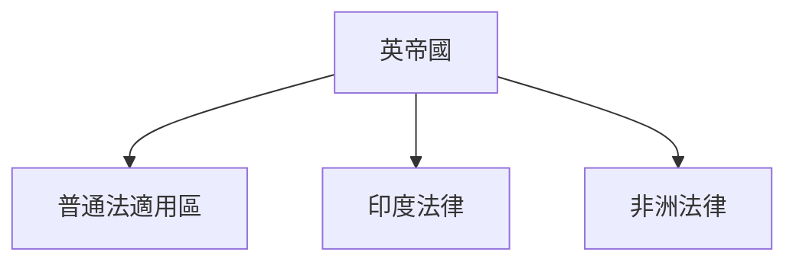
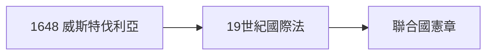
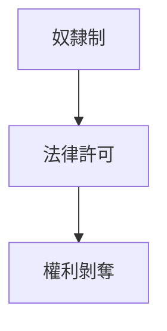
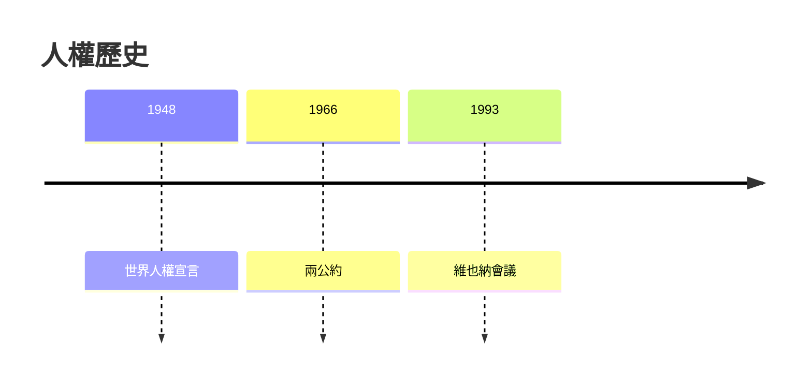
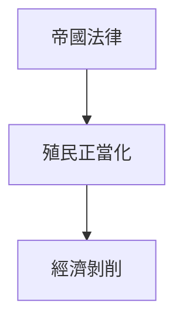

# HIST2179 法律、帝國與世界歷史 / Law, Empire and World History: From Pirates to Human Rights? (6 credits)

**Instructor**: Alastair McClure
**Department**: History, HKU  
**Official source**: [HKU History Course Description 2024-25](https://history.hku.hk/wp-content/uploads/2024/07/HIST-2425.pdf)
**Style**: 袁騰飛式 — 犀利、聚焦法律點解為帝國服務

---

## 問題 1：這個領域所有專家共享的 5 個核心心智模型

### 心智模型 1：「法治」(Rule of Law) 話語與帝國合法性
學者 **Lauren Benton** (*Law and Colonialism*, 2011) 研究：帝國從來唔係「無法狀態」——法律制度係帝國統治核心工具。

學者 **Shawn William Miller** 研究：殖民法律創造「例外狀態」——原住民法律被取消但殖民者保持自己法律。

### 心智模型 2：英帝國普通法 (Common Law) 擴張
學者 **John McLaren** 研究：英帝國普通法擴張伴隨商業利益——法律服務貿易利益。

學者 **David Sugarman** 分析：普通法移植到殖民地——唔係單純法律輸出，而係權力關係複製。

### 心智模型 3：國際法與殖民征服
學者 **Gerrit Gong** (*The Standard of Civilization*, 1984) 研究：國際法建立「文明標準」——非歐洲社會被排除。

學者 **Sanjay Subrahmanyam** 研究：早期現代國際法形成期——葡萄牙、西班牙、荷蘭競爭。

### 心智模型 4：奴隸法與帝國正當性
學者 **Rebecca Scott** (*Degrees of Freedom*, 2005) 研究：奴隸制法律化——法律系統化奴隸剝削。

學者 **Mary Turner** 分析：廢奴運動與帝國道德焦慮。

### 心智模型 5：人權話語與帝國過去
學者 **Samuel Moyn** (*The Last Utopia*, 2010) 研究：人權作為後殖民道德話語——對帝國遺產嘅批判。

學者 **Upendra Baxi** 分析：「人權帝國主義」爭議。

---

## 問題 2：3 個根本分歧

### 分歧 1：普通法移植——正面遺產定法律帝國主義？
- **A 方**：正面遺產
  - 法律制度、權利保護
- **B 方**：法律帝國主義
  - 法律為帝國利益服務

### 分歧 2：國際法——普遍主義定西方霸權？
- **A 方**：普遍主義
  - 普世價值、國際標準
- **B 方**：西方霸權
  - 歷史形成過程中排除非西方

### 分歧 3：人權——道德進步定新帝國主義？
- **A 方**：道德進步
  - 人權保護、國際公約
- **B 方**：新帝國主義
  - 人權干預、選擇性執法

---

## 問題 3：10 個深度問題

1. 如果英帝國冇建立普通法，今日世界法律體系會係點？
2. 點解法律制度可以為奴隸制服務同時又被用嚟廢奴？
3. 如果你是歷史學家，點樣研究殖民時期法律話語？
4. 點解國際法形成過程中非西方社會被排斥？
5. 人權話語——點解西方政府可以接受但又選擇性執法？
6. 如果你去 1850 年印度做田野，你會點樣記錄法律運作？
7. 點解法律移植往往失敗？
8. 法律與道德——點解有時法律落後道德？
9. 如果你是法官，點樣平衡法律文字同正義？
10. 法律帝國主義——點解到今日仍然存在？

---

## 核心心智模型深化

### 1. 英帝國法律擴張

```mermaid
flowchart TD
    A[英國普通法] --> B[印度]
    A --> C[香港]
    A --> D[非洲殖民地]
    B --> E[本地法律衝突]
    C --> F[普通法延續}
```

---

## 深度自測問題

### 詳解 1: 如果英帝國冇建立普通法...
普通法制度對全球法律體系有深遠影響——從印度到香港，呢啲法律遺產到今日仍然存在，即使殖民地已經獨立。

---

## 5 個 Mermaid 圖解

### 📊 Diagram 1: 帝國法律網絡



### 📊 Diagram 2: 國際法形成



### 📊 Diagram 3: 奴隸法制度化



### 📊 Diagram 4: 人權話語歷史



### 📊 Diagram 5: 法律帝國主義



---

## 總結

1. 法律係帝國統治核心工具
2. 普通法擴張與商業利益交織
3. 國際法形成過程有排他性
4. 人權話語與帝國過去複雜關係
5. 法律正義永遠係政治問題

**最後問題**: 法律可以成為真正普世正義工具嗎？

---
**版權所有 © HKU History Self-Study**
