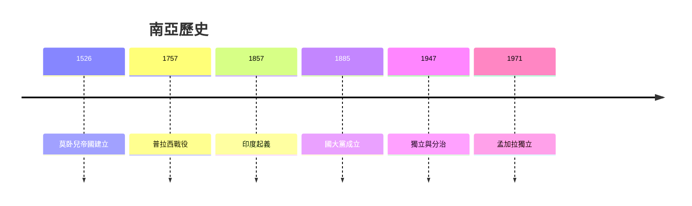
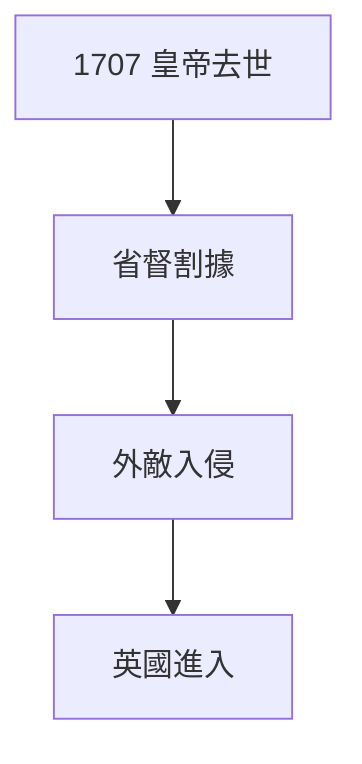
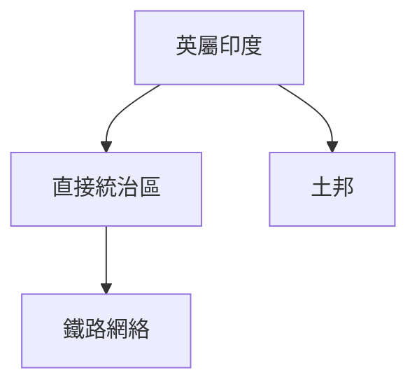
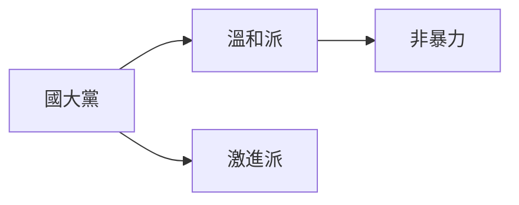
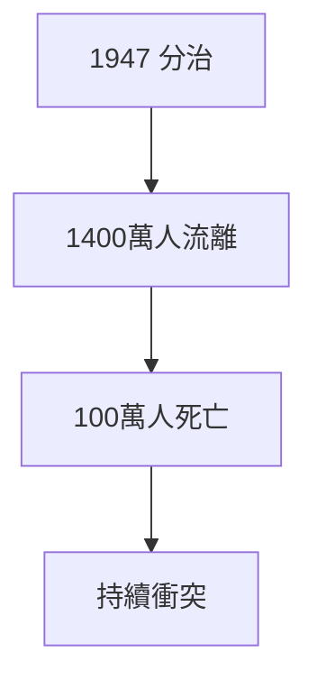

# HIST2188 南亞形成 / The Making of Modern South Asia (6 credits)

**Instructor**: Devika Shankar
**Department**: History, HKU  
**Official source**: [HKU History Course Description 2024-25](https://history.hku.hk/wp-content/uploads/2024/07/HIST-2425.pdf)
**Style**: 袁騰飛式 — 犀利、聚焦南亞點解被殖民

---

## 問題 1：這個領域所有專家共享的 5 個核心心智模型

### 心智模型 1：莫卧兒帝國衰落
學者 **Stephen Blake** (*Time on Time*, 1991) 研究：莫卧兒帝國 1707 年後分裂——王朝內鬥、地方省督割據、農民起義。

學者 **Muzaffar Alam** 分析：18 世紀南亞政治碎片化——為英國東印度公司進入提供機會。

- 1707 奧朗則布皇帝去世
- 1739 波斯國王納迪爾沙入侵
- 1757 普拉西戰役——英國控制孟加拉

### 心智模型 2：英屬印度殖民剝削
學者 **Utsa Patnaik** (德里大學) 量化研究：1757-1947 年英國從印度轉移财富——超過 45 萬億美元 (以 1990 年美元計算)。

學者 **Madhav Gadgil** 研究：殖民税收制度導致環境退化。

### 心智模型 3：印度民族主義運動
學者 **Bipan Chandra** (*India's Colonial Encounter*, 1988) 研究：印度民族主義唔係單一現象——國大黨、甘地、激進派各自路線。

學者 **Partha Chatterjee** (*Nationalist Thought and the Colonial World*, 1986) 分析：民族主義話語建構。

### 心智模型 4：印巴分治悲劇
學者 **Yasmin Khan** (*The Great Partition*, 2007) 研究：1947 年印巴分治——1400 萬人流離失所、100 萬人死亡。

學者 **Gyanendra Pandey** 分析：分治暴力持續影響南亞政治。

### 心智模型 5：後殖民發展困境
學者 **Dipesh Chakrabarty** (*Provincializing Europe*, 2000) 指出：後殖民國家被迫用歐洲框架理解自己歷史。

學者 **Ranajit Guha** 研究：印度庶民 (subaltern) 歷史聲音。

---

## 問題 2：3 個根本分歧

### 分歧 1：殖民剝削程度——英國係開發定剝削？
- **A 方**：開發論
  - 鐵路、教育、現代制度遺產
- **B 方**：剝削論
  - 财富轉移、經濟落後

### 分歧 2：甘地主義——歷史成功定失敗？
- **A 方**：成功
  - 非暴力贏得獨立
- **B 方**：失敗
  - 未解決的土地、階級問題

### 分歧 3：分治——領袖決定定結構因素？
- **A 方**：領袖決定
  - 甘地、 真納談判失敗
- **B 方**：結構因素
  - 宗教動員、階級利益

---

## 問題 3：10 個深度問題

1. 如果莫卧兒帝國冇衰落，英國東印度公司可以進入南亞嗎？
2. 點解印度獨立運動可以團結不同宗教但分治就分裂？
3. 如果你是英國東印度公司官員，點解要控制孟加拉？
4. 甘地非暴力——點解有效又無效？
5. 如果你是 1947 年旁遮普農民，你點樣選擇？
6. 點解印度民族主義係印度教特性？
7. 如果英國冇離開，印度會點樣？
8. 點解後殖民南亞民主仍然脆弱？
9. 如果你去 1857 年做印度起義田野，你會發現乜嘢？
10. 南亞區域主義——點解巴基斯坦、孟加拉、斯里蘭卡命運差異咁大？

---

## 核心心智模型深化

### 1. 南亞歷史時間線

### 2. 殖民剝削量化

---

## 深度自測問題

### 詳解 1: 如果莫卧兒帝國冇衰落...
歷史學家分析：即使莫卧兒帝國冇衰落，南亞仍然面對內部分裂、經濟問題。英國進入係外部因素，唔係唯一原因。

---

## 5 個 Mermaid 圖解

### 📊 Diagram 1: 莫卧兒帝國衰落

### 📊 Diagram 2: 英屬印度

### 📊 Diagram 3: 印度民族主義

### 📊 Diagram 4: 分治悲劇

### 📊 Diagram 5: 後殖民發展

---

## 總結

1. 莫卧兒衰落與英國進入南亞
2. 殖民剝削程度歷史爭議
3. 印度民族主義複雜多樣
4. 分治悲劇持續影響
5. 後殖民發展困境

**最後問題**: 南亞民主可以持續嗎？

---
**版權所有 © HKU History Self-Study**
