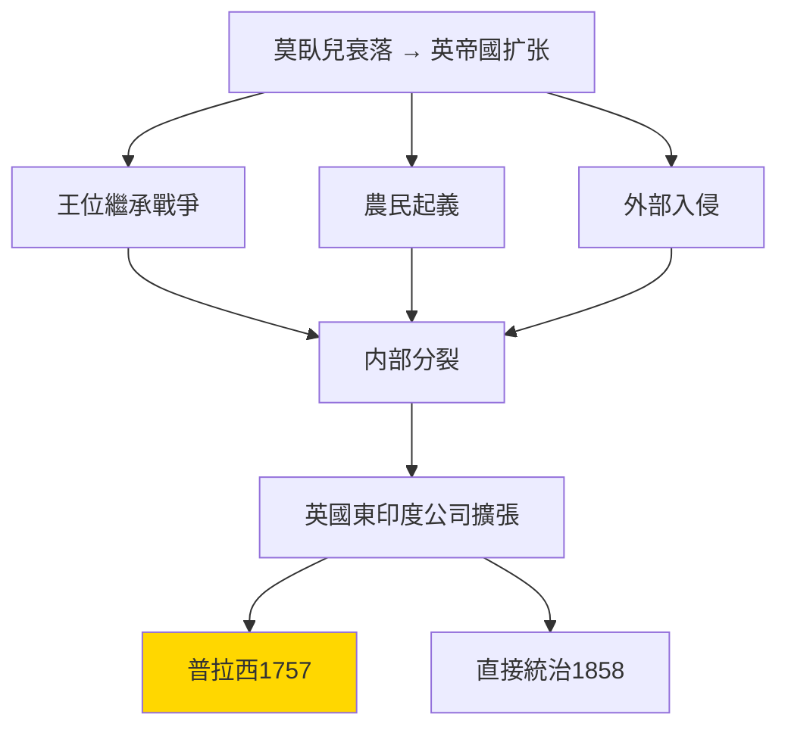
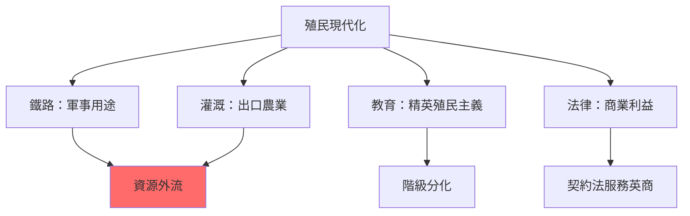
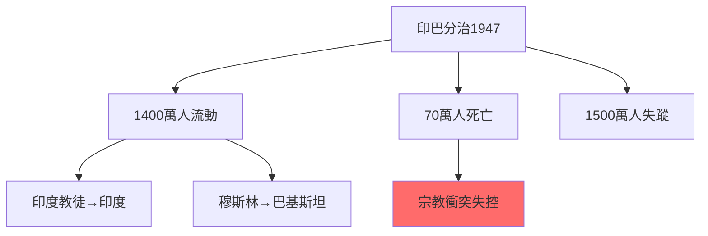
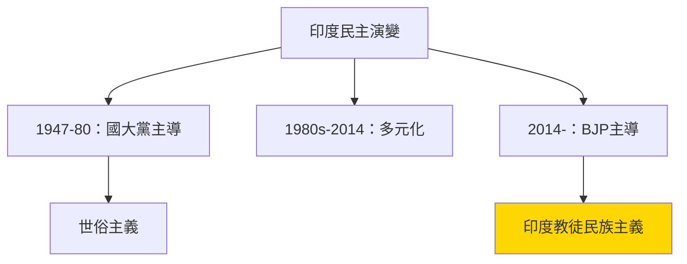
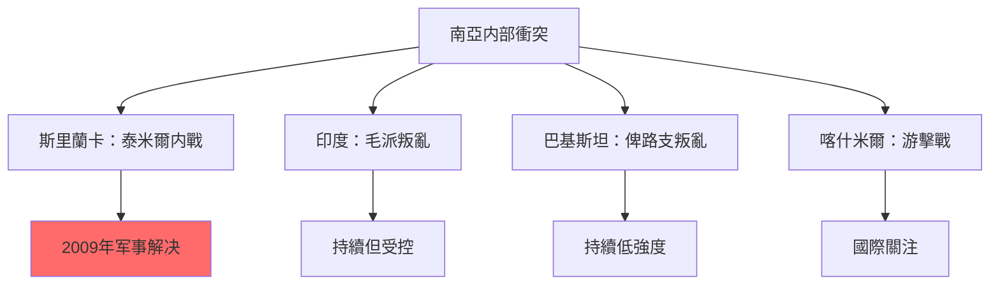
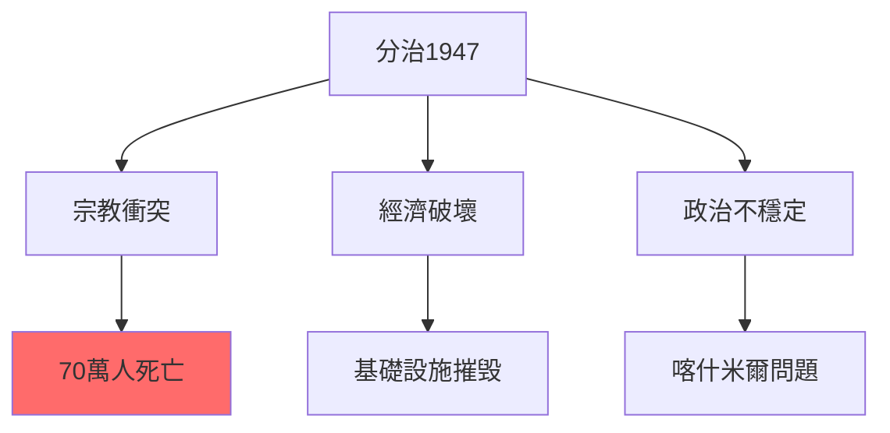
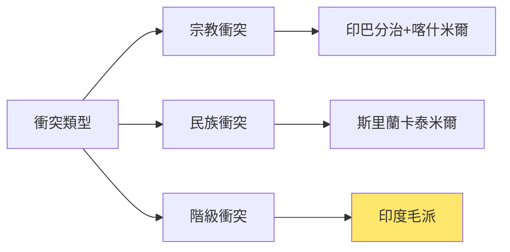
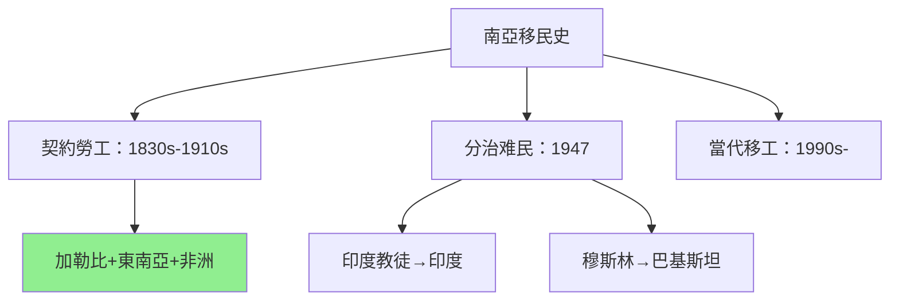
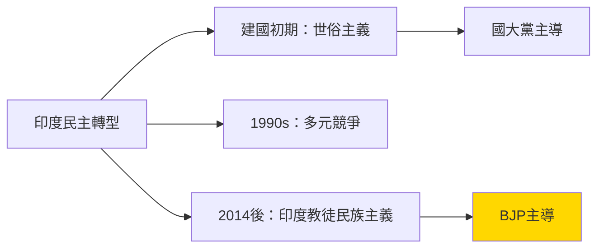

# HIST2188 南亞的塑造 / The Making of Modern South Asia

**Instructor**: Devika Shankar (2024-25)
**Department**: History, HKU
**Official source**: [HKU History Course Description 2024-25](https://history.hku.hk/wp-content/uploads/2024/07/HIST-2425.pdf)
**Style**: 袁騰飛式 — 犀利批判，聚焦南亞點解成為帝國主義最大受害者之一——但係又點解有咁多內部衝突

---

## 問題 1：這個領域所有專家共享的 5 個核心心智模型是什麼？

### 心智模型 1：莫臥兒帝國衰落 = 英帝國扩张機會
學者 **C.A. Bayly**（劍橋大學，*Indian Society and the Making of the British Empire*, 1988）研究：莫臥兒帝國衰落唔係因為「內部腐敗」，而係因為多重危機（王位繼承戰爭、農民起義、宗教衝突）。英帝國利用呢啲危機扩张——但係英帝國扩张唔係必然，而係歷史偶然。

- **1707** 奧朗則布皇帝去世——莫臥兒帝國開始分裂
- **1739** 波斯國王納迪爾沙入侵——德里被洗劫
- **1757** 普拉西戰役——英國東印度公司喺 Bengal 打贏——殖民轉折點
- **1764** 布克沙瓦爾戰役——英國開始控制孟加拉
- **1857** 印度民族起義——英國直接接管印度統治

### 心智模型 2：殖民「分而治之」（Divide and Rule）唔係外加，而係內部衝突嘅放大
學者 **Partha Chatterjee**（加爾各答，*The Nation and Its Fragments*, 1993）提出：「分而治之」唔係英國人發明嘅策略，而係利用同放大咗南亞社會本身存在嘅宗教、社群差異。學者 **Gyanendra Pandey** 研究：印度教-伊斯蘭衝突從來就唔係英國人「製造」出嚟，而係被「動員」。

- **1857** 起義——印度教徒同穆斯林第一次大規模聯手抗英
- **1885** 印度國大黨成立——但係代表印度教徒精英
- **1906** 全印穆斯林聯盟成立——英國成功分化
- **1947** 印巴分治——70萬人死亡，1500萬人流離失所

### 心智模型 3：「印度民族主義」從來就唔係單一
學者 **Benedict Anderson**（康奈爾大學）研究：「民族」係被「想像」嘅——印度民族主義從來就唔係單一話語，而係印度教徒民族主義、穆斯林民族主義、賤民民族主義、錫克教民族主義等多元話語競爭。

- **1885-1947** 印度國大黨——代表印度教徒精英
- **1947** 巴基斯坦建國——穆斯林民族主義
- **1966** 馬哈拉施特拉邦、旁遮普邦語言邦運動
- **1984** 藍星行動——印度政府攻擊阿姆利則金廟
- **1992** 巴布里清真寺被毁——印度教徒-穆斯林衝突升級

### 心智模型 4：巴基斯坦/孟加拉/斯里蘭卡——三個「印度」嘅不同命運
學者 **Sugata Bose** 同 **Ayesha Jalal**（*Modern South Asia*, 2017）研究：巴基斯坦、孟加拉、斯里蘭卡三個「後殖民」國家有完全不同嘅歷史命運——呢個差異揭示殖民歷史傷痕幾種唔同形態。

- **1947** 巴基斯坦建國——穆斯林民族主義勝利
- **1971** 孟加拉國成立——巴基斯坦内部穆斯林衝突
- **1948** 斯里蘭卡獨立——錫蘭佛教民族主義
- **1983-2009** 斯里蘭卡內戰——泰米爾猛虎游擊戰
- **1947-48** 喀什米爾衝突——至今未解決

### 心智模型 5：南亞移民史揭示帝國主義到底幾殘酷
學者 **Adam M. McKeane**（*The World of the Indian Ocean*, 2018）研究：南亞從來就係全球移民輸出地——但係呢個移民從來就係被强迫。學者 **Mariam S. Attia** 研究：英帝國主義令數百萬南亞工人、農民被輸出到馬來西亞、新加坡、斐濟、毛里裘斯、南非——佢哋嘅歷史從未被好好記録。

- **1830s-1910s** 「契約勞工」（Indentured Labour）——印度人被輸出到加勒比海、非洲、東南亞
- **1947-48** 印巴分治——1400萬人流離失所
- **1971** 孟加拉戰爭——1000萬难民逃往印度
- **1990s-2000s** 南亞海外移民——新形式移工

---

## 問題 2：3 個根本分歧

### 分歧 1：英帝國殖民到底係「現代化」定係「剝削」？
- **A 方**：學者 **Niall Ferguson**（*Empire*, 2002）——英帝國帶嚟鐵路、法院、義務教育；殖民係「現代化」
- **B 方**：學者 **Utsa Patnaik**（德里大學）——量化研究顯示英帝國從印度轉移財富高達45萬億美元；殖民係剝削

### 分歧 2：印巴分治到底係「穆斯林選擇」定係「英帝國分而治之」結果？
- **A 方**：學者 **Ismail K. Poonawala**——巴基斯坦建國符合穆斯林政治利益
- **B 方**：學者 **Gyanendra Pandey**——分治係英帝國最後嘅「分而治之」策略

### 分歧 3：印度民主到底係「成功樣板」定係「印度教徒多數暴政」？
- **A 方**：學者 **Sunil Khilnani**（*The Idea of India*, 1997）——印度民主係多元社會成功治理典範
- **B 方**：學者 **Christophe Jaffrelot**（*The Hindu Nationalist Movement*, 1999）——印度民主倒退為印度教徒多數暴政

---

## 問題 3：10 個深度問題

1. 如果英帝國確實带嚟咗鐵路、醫院、義務教育——點解印度經濟學家話殖民時期印度人均GDP下降？
2. 印巴分治到底係「民族自決」定係「帝國主義最後一刀」？點解有甘多人死亡？
3. 點解斯里蘭卡1978-2009年内戰導致8萬-10萬人死亡，但係國際媒體從來未好好關注？
4. 如果「分而治之」係英帝國策略，點解分治後印度教徒-穆斯林衝突仍然持續？
5. 印度民主到底係「成功」定係「印度教徒民主」？2019年《公民身份法》點解引發大規模抗議？
6. 巴基斯坦——點解從建國開始就陷入軍人政變同民主之間嘅掙扎？
7. 點解南亞共產主義運動（印度共產黨、尼泊爾毛派）最終失敗，但係中國共產主義成功？
8. 錫金、不丹、尼泊爾——點解呢啲小國命運完全唔同？
9. 如果南亞係全球最多人口居住區域之一，點解南亞史學長期被西方學術邊緣化？
10. 喀什米爾——到底係「印度-巴基斯坦領土爭端」定係「當地人民自決權」問題？

---

# 核心心智模型深化（中英對照）

## 1. 莫臥兒帝國衰落與英帝國扩张

### 1.1 Bilingual 概念對照
- 莫臥兒帝國 (mòwòér dìguó) = Mughal Empire — 1526-1858年南亞帝國
- 分而治之 (fēn ér zhìzhī) = Divide and Rule — 帝國主義分化策略
- 普拉西戰役 (pǔlāxī zhànyì) = Battle of Plassey — 1757年英帝國轉折點
- 印度起義 (yìndù qǐyì) = Indian Rebellion — 1857年民族起義

### 1.3 袁騰飛式犀利觀察
> 「英帝國话自己带嚟『文明』——但係你知唔知，1757年普拉西戰役，英國用900士兵打贏10000人軍隊？靠嘅唔係武力，而係賄賂咗當地王公。——殖民就係咁：從來唔係靠大炮，而係靠金錢同分裂。」

### 1.4 Deep Test Question
**考試題**：比較莫臥兒帝國衰落同英帝國扩张——點解英帝國可以成功取代莫臥兒成為南亞統治者？

### 1.5 圖解

---

## 2. 殖民現代化與剝削

### 2.1 Bilingual 概念對照
- 鐵路現代化 (tiělù xiàndàihuà) = Railway Modernization — 英帝國建設
- 殖民剝削 (zhímín bōxuē) = Colonial Exploitation — 財富轉移
- 契約勞工 (qìyuē láogōng) = Indentured Labour — 印度人被輸出
- 經濟停滞 (jīngjì tíngzhì) = Economic Stagnation — 殖民經濟影響

### 2.3 袁騰飛式犀利觀察
> 「英帝國話自己建咗鐵路——但係你知唔知，呢啲鐵路係為咗運兵、運資源，而非服務印度人民？英帝國離開嗰陣，印度人均GDP比1900年更低。」

### 2.4 Deep Test Question
**考試題**：分析殖民時期印度經濟發展到底係「停滯」定係「衰退」。用量化證據支持你嘅分析。

### 2.5 圖解

---

## 3. 印巴分治

### 3.1 Bilingual 概念對照
- 印巴分治 (yìn bā fēnzhì) = Partition of India — 1947年印巴分治
- 蒙巴頓方案 (méng bā dùn fāng'àn) = Mountbatten Plan — 分治方案
- 宗教衝突 (zōngjiào chōngtū) = Communal Violence — 印度教-穆斯林衝突
- 难民危機 (nànmín wēijī) = Refugee Crisis — 1400萬人流離失所

### 3.3 袁騰飛式犀利觀察
> 「印巴分治——你知唔知，1947年幾十萬人死嗰陣，英國軍隊就企喺旁邊眼白白睇？——英帝國執行『分而治之』，但係從來就冇準備分治後穩定。混亂本身就係策略。」

### 3.4 Deep Test Question
**考試題**：分析印巴分治到底係「宗教衝突」定係「權力鬥爭」。點解宗教衝突可以如此快速動員大量群眾？

### 3.5 圖解

---

## 4. 印度民主與印度教徒民族主義

### 4.1 Bilingual 概念對照
- 印度教徒民主 (yìndù jiào mínzhǔ) = Hindu Democracy — 印度教徒多數民主
- 印度人民党 (yìndù rénmín dǎng) = BJP — 印度教徒民族主義政黨
- 公民身份法 (gōngmín shēnfèn fǎ) = CAA — 2019年爭議性法律
- 喀什米爾問題 (kāshímǐěr wèntí) = Kashmir Issue — 爭端持續

### 4.3 袁騰飛式犀利觀察
> 「印度民主——西方話佢係『世界最大民主』。但係你知唔知，印度民主從建國開始就係印度教徒民主？穆斯林、賤民、部落民——佢哋嘅聲音從來就係次要。」

### 4.4 Deep Test Question
**考試題**：分析印度人民党（BJP）上台標誌住印度民主點解轉向「印度教徒多數主義」（Hindu Majoritarianism）。

### 4.5 圖解

---

## 5. 南亞内部衝突多樣性

### 5.1 Bilingual 概念對照
- 泰米爾猛虎 (tàimǐ'ěr měnghǔ) = LTTE — 斯里蘭卡泰米爾猛虎游擊隊
- 喀什米爾武裝 (kāshímǐěr wǔzhuāng) = Kashmir Armed Conflict — 游擊戰
- 毛派叛亂 (máoopài pànluàn) = Naxalite Insurgency — 印度共產武裝運動
- 僧伽羅-泰米爾衝突 (sēngjiāluó-tàimǐ'ěr) = Sinhala-Tamil Conflict — 斯里蘭卡衝突

### 5.3 袁騰飛式犀利觀察
> 「斯里蘭卡内戰——你知唔知，呢個内戰殺死咗8萬-10萬人，但係西方媒體從來未好好關注？——因為内戰受害者係『南亞人』，唔係『歐洲人』。」

### 5.4 Deep Test Question
**考試題**：比較斯里蘭卡泰米爾衝突同印度毛派叛亂。兩者點解結局完全唔同？

### 5.5 圖解

---

## 深度自測問題

**Q1-Q5**：殖民剝削——呢個係南亞歷史學最深刻嘅問題。英帝國確實建咗基礎設施，但係呢啲設施從來就係為殖民利益服務。

**Q6-Q10**：内部衝突——南亞内部衝突從來就唔係單一原因，而係宗教、民族、階級、帝國主義遺產多重因素叠加。

---

## 5 個 Mermaid 圖解

### 圖解 1：英帝國南亞扩张時間線

### 圖解 2：印巴分治影響

### 圖解 3：南亞内部衝突比較

### 圖解 4：南亞移民歷史

### 圖解 5：印度民主轉型

---

## 總結

**HIST2188 The Making of Modern South Asia** 係一堂關於殖民傷痕、民族主義、内部衝突點解塑造南亞嘅課程。核心價值：

1. **去歐洲中心**：南亞歷史唔係英帝國史，而係南亞人民嘅歷史
2. **比較方法**：印度、巴基斯坦、斯里蘭卡、孟加拉——四個「後殖民」國家，四種完全唔同命運
3. **當代相關性**：喀什米爾、印度教徒民族主義——歷史問題從未消失

**袁騰飛金句**：
> 「南亞——歷史書話你知帝國主義幾邪惡。但係你知唔知，真正嘅悲劇喺分治後先開始：宗教衝突、軍事政變、民族壓迫——歷史傷痕從來就唔會因為獨立而自動愈合。」

---

## 延伸閱讀

1. Bayly, C.A. *Indian Society and the Making of the British Empire*. Cambridge: Cambridge University Press, 1988.
2. Chatterjee, Partha. *The Nation and Its Fragments: Colonial and Postcolonial Histories*. Princeton: Princeton University Press, 1993.
3. Bose, Sugata and Ayesha Jalal. *Modern South Asia: History, Culture, Political Economy*. London: Routledge, 2017.
4. Pandey, Gyanendra. *The Construction of Communalism in Colonial North India*. Delhi: Oxford University Press, 1990.
5. Jaffrelot, Christophe. *The Hindu Nationalist Movement and Indian Politics*. London: Hurst, 1999.
6. Talbot, Ian. *Pakistan: A New History*. London: Hurst, 2012.
7. DeVotta, Neil. *Concise Encyclopedia of South Asian Intrigue and Satire*. Boulder: Lynne Rienner, 2004.
8. Patnaik, Utsa. "The Colonial Drain." *Review of Indian Economy* 49, no. 1 (2019).
