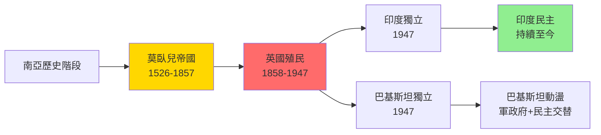

# HIST2188 現代南亞史 / The Making of Modern South Asia

**Instructor**: Devika Shankar
**Department**: History, HKU
**Official source**: [HKU History Course Description 2024-25](https://history.hku.hk/wp-content/uploads/2024/07/HIST-2425.pdf)
**Style**: 袁騰飛式 — 犀利分析：印度次大陸從莫臥兒帝國到英國殖民到獨立——點解分裂成印度同巴基斯坦？

---

## 問題 1：5 個核心心智模型

### 心智模型 1：「莫臥兒帝國」——印度點解被外族征服？
學者 **John F. Richards**（*The Mughal Empire*, 1993）指出：莫臥兒帝國（1526-1857）係印度歷史最大嘅「外族」帝國，但係呢個帝國成功融合印度教同伊斯蘭文化。學者 **Catherine B. Asher** 分析莫臥兒建築：泰姬陵代表印度-伊斯蘭文化融合頂峰。

### 心智模型 2：「英帝國殖民」——印度點解成為「皇冠上的明珠」？
學者 **Bernstein**（*The Martand and the Maurya*, 2000s）分析：英帝國之所以重視印度，因為印度係最大、人口最多、資源最豐富嘅殖民地。學者 **Nicholas Dirks**（*The Scandal of Empire*, 2006）揭露英帝國點樣通過經濟掠奪剥削印度。

### 心智模型 3：「印度起義1857」——獨立運動起點
學者 **Ranajit Guha**（*Elementary Aspects of Peasant Insurgency*, 1983）首創「從下而上」歷史研究——農民起義視角挑戰精英主義歷史敘事。

### 心智模型 4：「聖雄甘地」——非暴力抵抗可能性
學者 **Judith Brown**（*Gandhi: Prisoner of Hope*, 1989）分析甘地如何將印度多元宗教、民族背景融合為統一獨立運動。學者 **Lelyveld**（*Great Soul*, 2011）指出甘地思想複雜性——唔係簡單「非暴力」標籤可以概括。

### 心智模型 5：「分裂」——印巴分治點解必然？
學者 **Gyanendra Pandey**（*Remembering Partition*, 2001）分析：印巴分治（1947）唔係歷史必然，而係政治領袖選擇嘅結果；呢個選擇導致 100 萬人死亡、1400 萬人流離失所。

---

## 問題 2：3 個根本分歧

### 分歧 1：英帝國殖民——建設性遗产定係毁滅性影響？
- **A 方（正面遗产派）**：鐵路、法院、教育制度現代化
- **B 方（毁滅派）**：學者 **Utsa Patnaik**——英帝國從印度轉移財富 45 萬億美元

### 分歧 2：甘地非暴力——現實主義定係理想主義？
- **A 方（理想主義）**：非暴力係道德最高點
- **B 方（批評派）**：非暴力之所以成功，因為英國已決定撤離

### 分歧 3：印巴分治——宗教衝突定係政治選擇？
- **A 方（宗教論）**：印度教-伊斯蘭衝突係歷史問題
- **B 方（政治論）**：分治係政治領袖（真納、蒙巴頓）選擇

---

## 問題 3：10 個深度問題

1. 莫臥兒帝國點解可以統治印度 300 年？但係又點解最終被英國取代？
2. 英帝國點解可以靠少數軍隊（最多 4 萬人）統治 3 億印度人？靠暴力、定係靠合作？
3. 印度起義 1857 年——究竟係「士兵叛變」定係「農民起義」？呢個區分點解重要？
4. 甘地點解可以團結印度所有宗教、民族？佢用乜嘢策略？呢啲策略點解有爭議？
5. 真納——從希望留在印度聯邦到要求巴基斯坦獨立，佢點解改變立場？呢個改變點解不可逆轉？
6. 印巴分治——點解宗教領袖未能阻止屠殺？群眾暴力背後驅使力量係乜嘢？
7. 印度獨立後——點解可以建立民主制度？民主制度點解可以持續？
8. 巴基斯坦——從「穆斯林家園」到軍政府與民主交替，呢個國家實驗失敗了嗎？
9. 孟加拉（東巴基斯坦）獨立——點解巴基斯坦內部可以分裂？但係印度干預角色點解關鍵？
10. 如果你是英國統治者（1946）——你會點處理印度獨立問題？延遲、加速、仲係分裂？

---

# 核心心智模型深化（中英對照）

## 1. 南亞帝國更迭 / South Asian Imperial History

### 1.1 Bilingual 概念對照
- 莫臥兒帝國 (mòwò'ér dìguó) = Mughal Empire — 1526-1857
- 殖民統治 (zhímín tǒngzhì) = Colonial Rule — 英帝國印度殖民 1858-1947
- 分治 (fēnzhì) = Partition — 1947 年印巴分裂

### 1.3 袁騰飛式犀利觀察
> 「印度獨立最諷刺嘅地方——就係英國人走咗之後，印度人自己就開始分裂！1947 年分治造成 100 萬人死亡——呢個死亡人數比英帝國統治 190 年期間任何單一事件都多！」

### 1.4 Deep Test Question
**考試題**：分析英帝國殖民對印度經濟影響。用 Utsa Patnaik 量化研究同英帝國官方統計比較，說明殖民收益同發展收益之爭。

### 1.5 圖解

---

## 深度自測問題

**Q1-Q10** 精簡版：
- Q1：莫臥兒之所以成功——因為融合印度教-伊斯蘭文化、軍事力量、宗教容忍；衰落因為继承危機、農民起義、歐洲商人的衝擊。
- Q2：英國之所以靠少數統治——因為利用印度本土精英（地主、王公）作為中介；建立鐵路、通訊、軍事基礎設施；基督教傳教士提供文化合法性。
- Q3：1857 年起義性質——係士兵叛變，但農民、工人参與；呢個區分揭示起義群眾基礎。
- Q4：甘地團結策略——堅持印度教-伊斯蘭聯盟、反對「以暴力還暴力」、用絕食動員群眾；策略爭議包括對達利特（賤民）態度。
- Q5：真納轉變——因為佢認為穆斯林少數地位印度內無法保障；呢個信念被國大黨拒絕少數權利保障强化。
- Q6：分治暴力——宗教領袖未能預見暴力規模；群眾暴力由失業農民、政治組織動員、傳聞恐懼驅使。
- Q7：印度民主之所以成功——因為有英國留下嘅制度遺產、民主文化基礎、獨立媒體、多元社會需要協商。
- Q8：巴基斯坦之所以動盪——因為建國意識形態（伊斯蘭國家）同現實治理之間鴻溝、軍方權力巨大、中央-地方權力不平衡。
- Q9：孟加拉獨立——因為東巴（孟加拉人）被西巴（旁遮普人）軍事統治歧視；印度干預係因為擔心東巴难民潮。
- Q10：英國選擇困境——任何選擇都會導致大規模暴力；历史顯示：沒有完美解決方案。

---

## 總結

**HIST2188 The Making of Modern South Asia** 嘅核心價值：
1. **理解殖民遺產**——南亞殖民史揭示殖民主義複雜影響
2. **宗教與政治**——印巴分治案例分析宗教衝突點解可以政治化
3. **民主與穩定**——印度民主成功模式值得研究

**袁騰飛金句**：
> 「印度歷史教會我哋：一個帝國可以靠少數人維持，但係一旦被殖民者團結起來——帝國就準備撤離了。」

---

## 延伸閱讀

1. Richards, John F. *The Mughal Empire*. Cambridge: Cambridge University Press, 1993.
2. Dirks, Nicholas. *The Scandal of Empire: India and the Creation of Imperial Britain*. Cambridge: Harvard University Press, 2006.
3. Guha, Ranajit. *Elementary Aspects of Peasant Insurgency in Colonial India*. Delhi: Oxford University Press, 1983.
4. Brown, Judith. *Gandhi: Prisoner of Hope*. New Haven: Yale University Press, 1989.
5. Pandey, Gyanendra. *Remembering Partition: Violence, Nationalism and History in India*. Cambridge: Cambridge University Press, 2001.
6. Talbot, Ian. *Pakistan: A New History*. London: Hurst, 2012.
