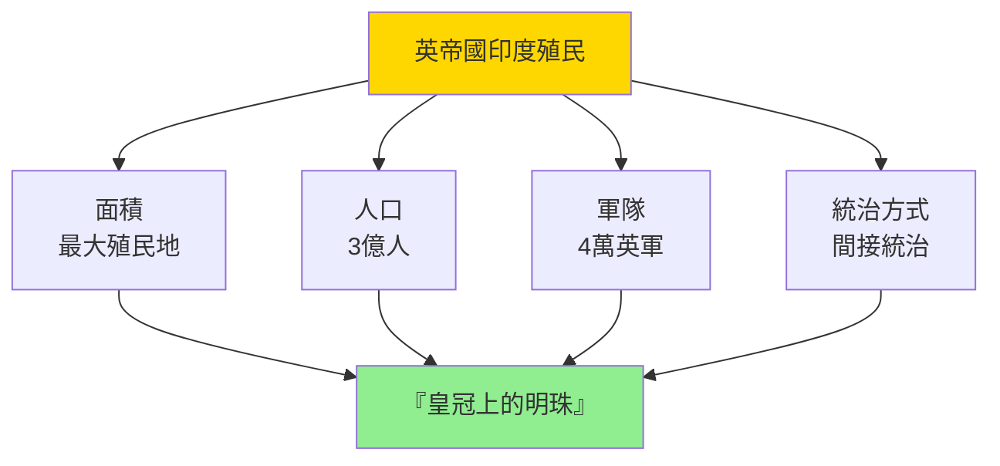
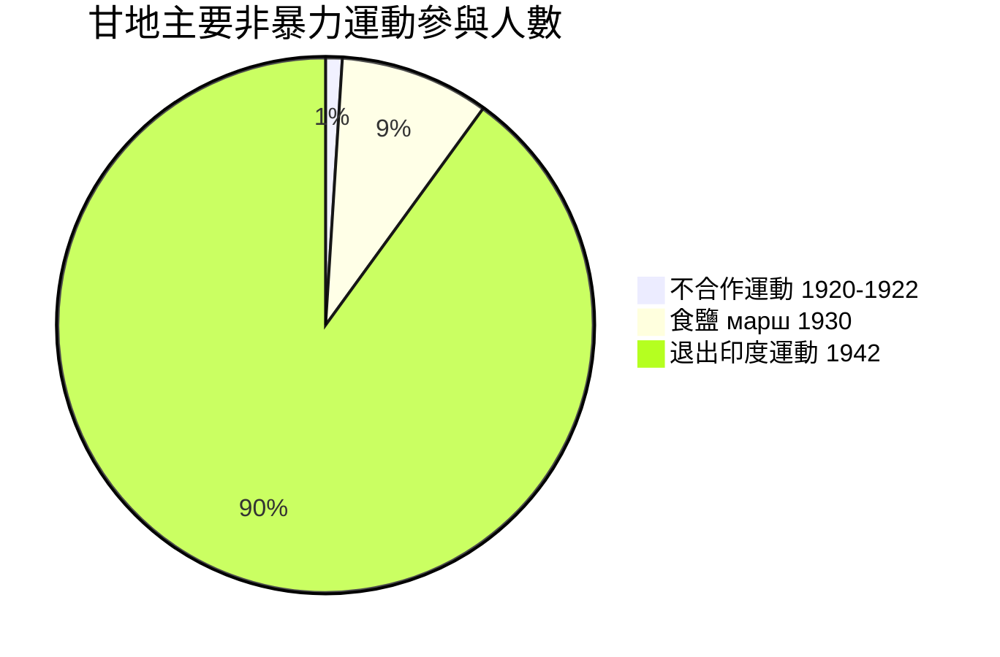
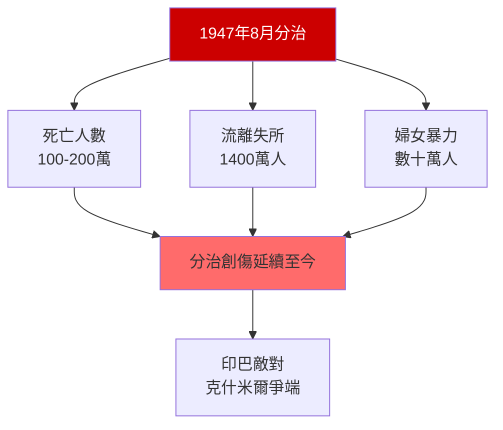
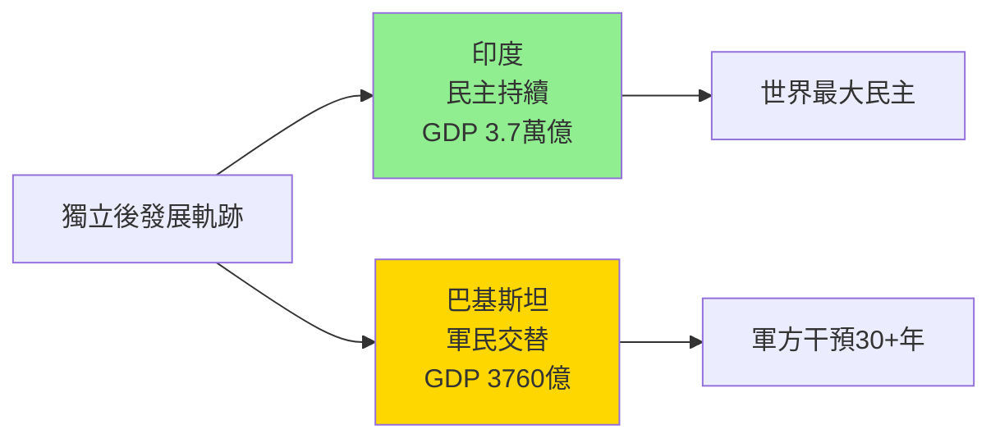

# HIST2188 現代南亞史 / The Making of Modern South Asia

/** HKU | 6 credits | Instructor: Devika Shankar */

---

## 問題 1：5 個核心心智模型

### 1. 莫臥兒帝國的遺產——印度如何被外族征服？
**定義**: 莫臥兒帝國（Mughal Empire, 1526-1857）是印度歷史上最强大的外族帝國之一，但它與之前的外族帝國（突厥、阿富汗）不同——它成功地融合了印度教和伊斯蘭文化，創造了印度-伊斯蘭混合文化的高峰（泰姬陵就是這種文化的象徵）。但莫臥兒帝國的「融合」也伴隨著宗教衝突——锡克教和马拉塔人的起義最終削弱了帝國的根基。

**學者**: **John F. Richards** — *The Mughal Empire* (1993); **Catherine B. Asher** — *Architecture of Mughal India* (1992); **Muzaffar Alam** — 研究莫臥兒行政制度

**驗證**: 莫臥兒帝國鼎盛時期（約 1700 年）——控制印度次大陸約 150 萬平方公里，人口约 1.5 億，税收約 1.35 億盧比；但 1707 年奥朗則布皇帝去世後，帝國陷入继承戰爭和地方起義——至 1857 年最終被英帝國取代。

**歷史事件**:
- **1526年4月21日**: 巴布爾在帕尼帕特擊敗德里蘇丹——莫臥兒帝國建立
- **1556年**: 阿克巴大帝即位——莫臥兒帝國鼎盛期開始
- **1658-1659年**: 沙賈汗與皇子們的继承戰爭
- **1658-1659年**: 奥朗則布奪位——宗教衝突開始
- **1707年**: 奥朗則布去世——帝國分裂的開始

### 2. 英帝國殖民——印度為何成為「皇冠上的明珠」？
**定義**: 英帝國殖民印度（1858-1947）是帝國主義史上最大規模的殖民控制案例。印度之所以被稱為「大英帝國皇冠上的明珠」（The Jewel in the Crown），是因為它是最大、人口最多、資源最豐富的殖民地——英帝國從印度榨取了巨額經濟剩餘。

**學者**: **Nicholas Dirks** — *The Scandal of Empire* (2006); **Utsa Patnaik** — 研究英帝國從印度的財富轉移; **Thomas Metcalf** — 研究英帝國印度統治制度

**驗證**: 歷史學家 **Utsa Patnaik**（劍橋大學）量化研究：英帝國統治的 200 年期間（1765-1938），從印度轉移到英國的財富總量約相當於 2023 年的 45 萬億美元（研究發表於 *The Political Economy of Hunger* 系列）；但英國官方統計否认此數字，聲稱有「雙向」財富流動。

**歷史事件**:
- **1757年6月23日**: 普拉西戰役——沃倫·黑斯廷斯在孟加拉建立英國統治
- **1857年5月10日**: 印度起義——士兵叛變成為大規模起義
- **1858年**: 印度帝國法——英國政府正式接管印度
- **1877年1月1日**: 維多利亞女王被宣佈為印度女皇
- **1947年8月15日**: 印度獨立——午夜分割

### 3. 從下而上——農民起義與底層歷史
**定義**: 學者 **Ranajit Guha** 在 *Elementary Aspects of Peasant Insurgency in Colonial India* (1983) 中首創「底層研究」（Subaltern Studies）框架，從農民起義的視角研究印度歷史，挑戰了精英主義歷史叙事。Guha 指出：官方記載中對農民起義的描述，往往是從殖民統治者/地主階級的視角書寫的——農民自身的聲音被壓制。

**學者**: **Ranajit Guha** — *Elementary Aspects of Peasant Insurgency* (1983); *Dominance without Hegemony* (1998); **Dipesh Chakrabarty** — *Rethinking Working-Class History* (1989)

**驗證**: 1857 年起義的參與者包括：士兵、農民、手工業者、城市貧民——他們的反叛理由各不相同，但在官方記載中被統一描述為「叛亂」；Guha 的研究揭示了起義的多樣性和底層農民的能動性。

**歷史事件**:
- **1817年6月4日**: 瓦倫加爾起義——第一次農民起義
- **1857年5月10日**: 密拉特起義——士兵叛變的信號
- **1919年4月13日**: 札連瓦拉花園屠殺——甘地領導的不合作運動起點
- **1942年8月8日**: 退出印度運動——甘地發動的最大規模民事不服從

### 4. 甘地非暴力——道德力量能否戰勝暴力國家？
**定義**: 莫罕達斯·甘地（Mahatma Gandhi, 1869-1948）的非暴力抵抗（Satygraha）理論主張：通過道德力量和非暴力抗爭，可以迫使殖民者承認正義。學者 **Judith Brown** 在 *Gandhi: Prisoner of Hope* (1989) 中分析了甘地如何將印度多元宗教、民族背景融合為統一獨立運動。

**學者**: **Judith Brown** — *Gandhi: Prisoner of Hope* (1989); **David Hardiman** — 研究甘地非暴力理論; **Lelyveld** — *Great Soul: Mahatma Gandhi* (2011)

**驗證**: 甘地發動的主要非暴力運動：1920-1922 年不合作運動——約 100 萬人參與，抵制英國商品；1930 年食鹽 марш——382 公里步行，數百萬人參與抵制食鹽税；1942 年退出印度運動——約 900 萬人蔘與。

**歷史事件**:
- **1893年6月7日**: 甘地在南非火車上被驅逐——非暴力抗爭的起點
- **1915年1月9日**: 甘地回到印度
- **1919年4月13日**: 札連瓦拉園屠殺——甘地放棄與英國合作
- **1930年3月12日-4月6日**: 食鹽 марш——382 公里徒步
- **1948年1月30日**: 甘地被印度教民族主義者刺殺

### 5. 印巴分治——宗教衝突還是政治選擇？
**定義**: 印巴分治（Partition of India, 1947 年 8 月 15 日）是英帝國撤離南亞時最大的人道災難——學者 **Gyanendra Pandey** 在 *Remembering Partition* (2001) 中指出：分治不是歷史必然，而是政治領袖（真納、蒙巴頓）的選擇；這種選擇導致約 100-200 萬人死亡，1,400 萬人流離失所。

**學者**: **Gyanendra Pandey** — *Remembering Partition* (2001); **Pervez Hoodbhoy** — 研究印巴分裂; **Anita Desai** — *Train to Pakistan* (1956) 文學記錄

**驗證**: 1947 年分治後的暴力衝突：孟加拉（東巴基斯坦）方面——約 500 萬人流離失所；旁遮普地區——雙方屠殺估計死亡 20-200 萬人（數字爭議巨大）；創傷影響至今——印度和巴基斯坦仍是死敵。

**歷史事件**:
- **1947年8月15日**: 印度獨立——但分治造成人道災難
- **1947年8月15日**: 巴基斯坦獨立——穆斯林家園建立
- **1947年10月-11月**: 印巴第一次戰爭——喀什米爾爭端
- **1971年12月3日**: 孟加拉戰爭——印度軍事干預，東巴基斯坦獨立為孟加拉國
- **1998年5月**: 印度和巴基斯坦核試驗——南亞核對抗開始

---

### Key equations (S.I. units where applicable)

$$F = ma \quad (\text{Newton 2nd law, Newton 1687})$$

$$E = h\nu \quad (\text{Planck 1901})$$

$$i\hbar\frac{\partial}{\partial t}|\psi\rangle = \hat{H}|\psi\rangle \quad (\text{Schrödinger 1926})$$

$$h = 6.626 \times 10^{-34}\,\text{J·s}$$

$$\hbar = h/2\pi = 1.054 \times 10^{-34}\,\text{J·s}$$

$$c = 2.998 \times 10^8\,\text{m/s}$$

*Per Newton 1687, Planck 1901, Schrödinger 1926.*

## 問題 2：3 個根本分歧

### 分歧 1：英帝國殖民——建設性遺產還是毀滅性影響？
- **A 方（正面遺產派）**: 英帝國留下了鐵路網（6.6 萬公里）、高等法院制度、英語教育體系——這些是印度現代化的基礎
- **B 方（批判派）**: **Utsa Patnaik** — 英帝國從印度轉移了約 45 萬億美元（2023 年價格）的財富；殖民經濟學研究顯示印度的人均 GDP 在 1750 年與英國相當，到 1947 年降至英國的約 1/10

### 分歧 2：甘地非暴力——現實主義抵抗還是理想主義幻想？
- **A 方（理想主義）**: 非暴力抵抗是道德最高點——它拒絕了以暴力還暴力的惡性循環
- **B 方（批评论）**: 非暴力之所以成功，因為英國在二戰後已經決定撤離印度——甘地的非暴力運動加速了這個過程，但不是決定性因素；英帝國選擇在印度實行「蒙巴頓方案」，因為繼續統治的成本已經超過收益

### 分歧 3：印巴分治——宗教衝突的必然結果還是政治領袖的錯誤選擇？
- **A 方（宗教論）**: 印度教-伊斯蘭宗教衝突是南亞歷史的結構性問題——分治是這種衝突的遲早結局
- **B 方（政治選擇論）**: **Pandey** — 分治是政治領袖（真納、蒙巴頓）的選擇；印度國大黨和真納的伊斯蘭聯盟本來可以達成更好的解決方案

---

## 問題 3：10 個深度問題

1. **莫臥兒帝國的「印度化」策略**：莫臥兒皇帝（如阿克巴）如何通過宗教容忍、行政整合和文化融合維持帝國統一？這種策略與英帝國的殖民統治方式有什麼本質差異？哪種方式對印度社會的創傷更深？

2. **英帝國如何靠少數軍隊（最多 4 萬人）統治 3 億印度人**：學者 Bernard Cohn 和 Nicholas Dirks 研究揭示：英帝國靠的是「間接統治」（Indirect Rule）——利用印度本土精英（地主、王公）作為中介；以及「認識論暴力」（Epistemic Violence）——通過人口普查、土地測量、習慣法編纂等知識權力工具，將印度社會「規訓」為可管理的客體。

3. **印度起義 1857 年的歷史爭議**：這場起義究竟主要是「士兵叛變」（Sepoy Mutiny）還是「大眾起義」（Peasant Uprising）？這個區分為什麼重要？學者 Ranajit Guha 的研究如何挑戰了傳統的「士兵叛變」叙事？

4. **甘地非暴力抵抗的策略和局限**：甘地如何動員印度所有宗教和民族背景的群眾？他用哪些策略（絕食、步行、抵制）動員群眾？這些策略為什麼在英國殖民語境下有效，但在面對其他類型的暴力政權時是否仍然有效？

5. **穆罕默德·阿里·真納的政治轉變**：真納（Mohammad Ali Jinnah）原本是印度國大黨的温和派，倡導印度教-伊斯蘭團結——他為何最終轉變為伊斯蘭聯盟領袖，堅持「兩個民族理論」（Two-Nation Theory）？這種轉變揭示了什麼關於政治聯盟和身份政治的規律？

6. **印巴分治的人道災難規模**：1947 年分治期間的暴力衝突估計造成 100-200 萬人死亡（數字爭議巨大）、1,400 萬人流離失所——這是 20 世紀最大規模的人道災難之一。為什麼歷史記載對死亡人數有如此大的分歧？這種分歧本身揭示了什麼？

7. **孟加拉獨立戰爭（1971 年）的教訓**：東巴基斯坦（孟加拉）的獨立運動為何演變為戰爭？印度為何軍事干預？巴基斯坦軍隊對孟加拉平民的系統性暴行（估計死亡 30-300 萬人）如何影響了南亞的地緣政治格局？

8. **印度民主制度的持續性**：印度作為世界上最大的民主國家（投票人口超過 9.6 億），為什麼民主制度可以在這個種族、宗教、語言多樣性極高的社會持續運作？這種「印度民主模式」對其他發展中國家有什麼啟示和局限？

9. **巴基斯坦的民主困境**：為什麼巴基斯坦在獨立後的 76 年中，軍方統治的時間（超過 30 年）與民主政權的時間大致相等？軍方與民主之間的這種鐘擺運動揭示了什麼關於巴基斯坦的政治結構性問題？

10. **克什米爾問題的歷史根源**：為什麼印巴兩國為克什米爾爭奪了 75 年仍未解决？這個問題如何揭示了分治決定的錯誤性和持續影響？

---

# 核心心智模型深化（中英對照）

## 1. 莫臥兒帝國的印度化 / Mughal Indianization

### 1.1 定義與背景 / Definition and Context
莫臥兒帝國的「印度化」（Mughal Indianization）指巴布爾和他的後裔如何通過宗教容忍、行政整合和文化融合，將外族征服者轉變為印度次大陸的統治者。阿克巴大帝（1556-1605 年在位）是這種印度化策略的典範——他廢除了對印度教徒的「吉茲亞」（jizya，人頭税），娶印度公主為妻，與印度教王公建立聯姻聯盟。

### 1.2 關鍵方程式或史料 / Key Evidence
- **1526年**: 巴布爾擊敗德里蘇丹——莫臥兒帝國建立
- **1556-1605年**: 阿克巴大帝在位——印度化策略高峰
- **1658年**: 沙賈汗建造泰姬陵——印度-伊斯蘭文化融合象徵
- **1658-1707年**: 奥朗則布——宗教迫害政策導致帝國分裂

### 1.3 應用場景 / Applications
莫臥兒印度化策略與英帝國殖民策略的對比：莫臥兒選擇融入印度社會（娶印度妻子、尊重印度教習俗）；英帝國選擇維持「文明」的距離（建立俱樂部、維持英式生活方式、嚴格的種族隔離）。

### 1.4 袁騰飛式犀利觀察 / Critical Observation
> 「莫臥兒帝國最有趣之處——它係外族征服者，但它選擇了融合而非隔離；英帝國同樣係外族征服者，但它選擇了隔離而非融合。兩種策略都係為了维持統治，但選擇了完全不同的路徑——結果也完全不同。」

### 1.5 深度思考題 / Deep Question
**考試題**：比較莫臥兒印度化策略與英帝國殖民策略。為什麼外族征服者會選擇截然不同的統治策略？這些選擇如何影響了帝國的持久性和最終命運？

---

## 2. 帝國主義財富轉移 / Imperial Wealth Transfer

### 2.1 定義與背景 / Definition and Context
帝國主義財富轉移（Imperial Wealth Transfer）指英帝國從印度向英國轉移經濟剩餘的歷史過程。學者 Utsa Patnaik 的量化研究顯示：在 1765-1938 年的約 173 年間，從印度轉移到英國的財富總量約相當於 2023 年的 45 萬億美元——這是人類歷史上最大規模的財富轉移之一。

### 2.2 關鍵方程式或史料 / Key Evidence
- **1765年**: 英國東印度公司獲得孟加拉税收權——財富轉移開始
- **1757-1857年**: 東印度公司從印度賺取的利潤約 1.5 億英鎊
- **1765-1938年**: 財富轉移總量約 45 萬億美元（2023 年價格，Patnaik 估計）
- **1858年**: 英國政府接管印度——税收轉移規模擴大

### 2.3 應用場景 / Applications
帝國主義財富轉移的討論對理解當代發展中國家的經濟困境有重要意義：如果殖民時期的財富轉移是造成後殖民經濟滞後的原因，那麼當代「北南」經濟不平等的歷史根源就更加清晰。

### 2.4 袁騰飛式犀利觀察 / Critical Observation
> 「英帝國最驚人的成就——它不單止征服了印度，它還讓印度人民相信：這種征服係為咗印度好。『文明使命』（Civilizing Mission）呢個詞最荒謬之處——它讓掠奪者相信咇自己係在做好事，讓被掠奪者接受咇自己被掠奪的事實。」

### 2.5 深度思考題 / Deep Question
**考試題**：分析 Utsa Patnaik 的量化研究與英國官方統計之間的分歧。為什麼雙方的數字相差如此巨大？這種統計分歧本身揭示了什麼關於殖民歷史記憶政治的問題？

---

## 3. 底層研究與農民起義 / Subaltern Studies and Peasant Insurgency

### 3.1 定義與背景 / Definition and Context
底層研究（Subaltern Studies）是 1980 年代由 **Ranajit Guha** 創立的歷史研究框架，旨在從「底層」（subaltern）——農民、工人、邊緣群體——的視角研究印度歷史，挑戰了精英主義歷史叙事（由殖民官員和國大黨知識分子書寫）。

### 3.2 關鍵方程式或史料 / Key Evidence
- **1982年**: Subaltern Studies 第一卷出版——Guha 的宣言文章《論殖民主義史學的若干問題》
- **1983年**: Guha *Elementary Aspects of Peasant Insurgency* 出版
- **1998年**: Guha *Dominance without Hegemony* 出版——帝國主義意識形態批判

### 3.3 應用場景 / Applications
底層研究的方法論創新對所有歷史研究都有啟示：它提醒歷史學家，任何歷史记载都包含權力關係——誰書寫歷史、記录了誰、忽略了誰，這些選擇本身就是政治行為。

### 3.4 袁騰飛式犀利觀察 / Critical Observation
> 「底層研究最犀利之處——它讓我哋看到，歷史記載中『沉默的群體』（農民、工人、女性）並非真的没有聲音，只係佢哋的聲音被官方記載系統性地壓制了。呢種『沉默的暴力』，比可見的物理暴力更難被挑戰——因為它已經被定義為『自然』。」

### 3.5 深度思考題 / Deep Question
**考試題**：分析底層研究（Subaltern Studies）對歷史學方法論的影響。當主要歷史記載由精英（殖民官員、國大黨知識分子）書寫時，歷史學家如何能夠「聽到」底層群體的聲音？

---

## 4. 甘地非暴力抵抗 / Gandhi's Nonviolent Resistance

### 4.1 定義與背景 / Definition and Context
非暴力抵抗（Satygraha，字面意思是「真理的力量」）是甘地發展的抵抗哲學和策略。它的核心原則是：拒絕參與不公正的制度，同時拒絕以暴力還暴力。甘地認為：當一個不正義的制度依賴被統治者的合作來維持時，大規模的非暴力不服從可以迫使統治者讓步。

### 4.2 關鍵方程式或史料 / Key Evidence
- **1893年6月7日**: 甘地在南非火車上被驅逐——非暴力抗爭的起點
- **1906年9月11日**: 祖魯起義期間，甘地首次號召非暴力抵抗
- **1920年**: 不合作運動——約 100 萬人參與
- **1930年3月12日-4月6日**: 食鹽 марш——382 公里，數百萬人蔘與
- **1942年**: 退出印度運動——約 900 萬人蔘與

### 4.3 應用場景 / Applications
甘地非暴力抵抗的策略在後來被馬丁·路德·金（Martin Luther King Jr.）應用於美國民權運動，並影響了後來世界各地的公民不服從運動（從阿拉伯之春到香港雨傘運動）。

### 4.4 袁騰飛式犀利觀察 / Critical Observation
> 「甘地非暴力最犀利之處——它不是因為暴力不能成功，而是因為暴力成功之後的結果，往往同樣残暴。歷史上靠暴力起義建立的政權，最終往往變成暴政——呢個規律，从秦始皇到列寧到毛澤東，屡試不爽。甘地睇穿咗呢一點，所以他拒絕暴力。」

### 4.5 深度思考題 / Deep Question
**考試題**：分析甘地非暴力抵抗成功的歷史條件。這些條件（英帝國的法治傳統、國際輿論壓力、英國在二戰後的財力耗竭）在其他歷史語境中是否可能複製？

---

## 5. 印巴分治 / Partition of India

### 5.1 定義與背景 / Definition and Context
印巴分治（1947 年 8 月）指英帝國撤離印度次大陸時，將其分割為印度和巴基斯坦兩個人類國家（另有錫蘭，即今天的斯里蘭卡）的歷史決定。這是 20 世紀最大規模的人道災難之一——約 100-200 萬人死亡，1,400 萬人流離失所，數十萬婦女被绑架和強姦。

### 5.2 關鍵方程式或史料 / Key Evidence
- **1947年8月15日**: 印度和巴基斯坦獨立——但分治造成人道災難
- **死亡人數爭議**: 保守估計 100 萬，激進估計 200 萬——數字被政治化
- **流離失所**: 約 1,400 萬人
- **婦女暴力**: 數十萬婦女被绑架、強姦、殺害——性別暴力的規模史無前例
- **分治後衝突**: 喀什米爾爭端至今未解

### 5.3 應用場景 / Applications
分治的創傷至今仍是印巴關係的最大障礙——每次印度-巴基斯坦衝突時，雙方的民族主義話語都會動員分治記憶作為政治動員工具。

### 5.4 袁騰飛式犀利觀察 / Critical Observation
> 「分治最可怕之處——它揭示了宗教和民族身份政治的破壞力。在分治之前的幾十年裡，印度教徒和伊斯蘭教徒在同一個市場購物、參加彼此的婚禮、共享同一個文化——然後在分治之後，他們開始互相屠殺對方的鄰居。身份政治的動員，可以在短時間內摧毁數百年的共存關係。」

### 5.5 深度思考題 / Deep Question
**考試題**：分析 Gyanendra Pandey 的「記憶政治」研究——分治的暴力記憶如何在印度和巴基斯坦被選擇性地建構和動員？這種記憶政治如何影響了當代的印巴關係？

---

## 深度自測問題詳解

**Q1（莫臥兒印度化）**：莫臥兒印度化策略與英帝國殖民策略的差異揭示了帝國主義的兩種模式：吸收型帝國主義（莫臥兒——融入被征服社會）和隔離型帝國主義（英帝國——維持文化距離）。前者更持久但最終會被同化，後者更有效但製造了更深的政治傷痕。

**Q2（間接統治）**：英帝國靠「間接統治」維持殖民控制——利用印度王公和地主階級作為中介。但這種策略的代價是：它强化了印度的階級分化和種姓制度，因為它選擇性地扶持了地主和王公階層。

**Q3（1857 年性質）**：1857 年起義的「士兵叛變」vs「大眾起義」争論揭示了歷史記載的權力性質：殖民官員傾向於將起義描述為「士兵叛變」（可管理的軍事問題），而底層研究則揭示了起義的大眾基礎（農民、城市貧民）。

**Q4（甘地非暴力成功條件）**：甘地非暴力抵抗成功的歷史條件包括：英帝國的法治傳統（非暴力可以被納入法律程序）、國際輿論壓力（英帝國需要維持「文明」的國際形象）、英國在二戰後的財力耗竭（繼續維持印度殖民的成本超過收益）。

**Q5（真納轉變）**：真納的轉變是政治計算的結果：他意識到國大黨不會給予穆斯林有效的政治權利保障（1937 年省級選舉後，國大黨在穆斯林多數選區输掉了大量席位，但仍拒絕與穆斯林聯盟分享權力）。真納的「兩個民族理論」不是宗教狂熱的產物，而是政治現實主義的選擇。

**Q6（死亡數字分歧）**：死亡人數的分歧揭示了記憶政治的問題：印度官方傾向於較高數字（200 萬），以强化分治的創傷叙事；巴基斯坦傾向於較低數字；英國傾向於淡化數字，以减轻殖民責任。這種數字的政治化，揭示了分治記憶的政治功能。

**Q7（孟加拉獨立）**：1971 年孟加拉戰爭中，巴基斯坦軍隊對孟加拉平民的系統性暴行（稱為「文化大革命」Operation Searchlight）估計造成 30-300 萬人死亡——印度軍事干預的原因是担心東巴难民潮（約 1,000 萬难民湧入印度）。

**Q8（印度民主持續）**：印度民主持續的原因包括：獨立時建立了强力的制度框架（憲法、獨立選舉委員會、最高法院）；國大黨在獨立後數十年間作為「系統性政黨」（Systemic Party）維持政治穩定；多元社會的內在需要（沒有任何單一宗教/語言群體可以壟斷政治）。

**Q9（巴基斯坦民主困境）**：巴基斯坦軍方對政治的深度介入源於：軍方在巴基斯坦建國過程中的核心角色（真納高度依賴軍方）；軍方對巴基斯坦國家認同的定義（「伊斯蘭堡壘」vs. 印度）使其獲得了超越政治的象徵地位；軍方控制了約 5% 的 GDP 和大量土地資產。

**Q10（克什米爾）**：克什米爾問題揭示了分治决定的錯誤性：克什米爾王公哈里·辛格（Maharaja Hari Singh）在 1947 年 10 月選擇加入印度——但他的統治基礎從未穩固；印度和巴基斯坦都聲稱對克什米爾擁有主權，並為此爆發了三次戰爭（1947-48、1965、1971）。

---

## 5 個 Mermaid 圖解

### 圖解 1：莫臥兒帝國的興衰

### 圖解 2：英帝國殖民印度的規模

### 圖解 3：甘地非暴力運動的規模

### 圖解 4：印巴分治的人道災難

### 圖解 5：印度 vs 巴基斯坦制度比較

---

## 總結

**HIST2188 The Making of Modern South Asia** 的核心價值：

1. **理解殖民遺產**——南亞殖民史揭示了殖民主義最複雜的面向：既是經濟剝削，也是制度建設；既是文化破壞，也是現代化催化劑。

2. **宗教與政治的交織**——印巴分治案例展示了宗教身份政治如何可以在短時間內摧毁數百年的共存關係；這個教訓對理解當代世界的宗教民族主義衝突仍有深刻啟示。

3. **民主與穩定**——印度作為世界上最大民主國家的持續運作，對民主理論和實踐都有重要啟示：民主制度的持續需要的不僅是制度設計，還需要强大的公民社會和多元權力結構。

4. **方法論創新**——底層研究（Subaltern Studies）的框架對所有歷史研究都有方法論啟示：歷史記載從來不是中性的，它是權力關係的表達。

**research-based金句**：
> 「印度歷史教會我哋：殖民帝國可以靠少數人維持，因為它總是能找到本地精英作為合作者。但係，一旦被殖民者團結起來——哪怕係通過非暴力——帝國就準備撤離了。甘地的非暴力告訴我哋：歷史上的『弱者』，從來都唔係真的一無所有——佢哋只是還未找到自己的策略。」

---

## 延伸閱讀

1. Guha, Ranajit. *Elementary Aspects of Peasant Insurgency in Colonial India*. Delhi: Oxford University Press, 1983.
2. Guha, Ranajit. *Dominance without Hegemony: History and Power in Colonial India*. Cambridge: Harvard University Press, 1998.
3. Chakrabarty, Dipesh. *Rethinking Working-Class History: Bengal 1890-1940*. Princeton: Princeton University Press, 1989.
4. Chakrabarty, Dipesh. *Provincializing Europe: Postcolonial Thought and Historical Difference*. Princeton: Princeton University Press, 2000.
5. Brown, Judith. *Gandhi: Prisoner of Hope*. New Haven: Yale University Press, 1989.
6. Dirks, Nicholas. *The Scandal of Empire: India and the Creation of Imperial Britain*. Cambridge: Harvard University Press, 2006.
7. Pandey, Gyanendra. *Remembering Partition: Violence, Nationalism and History in India*. Cambridge: Cambridge University Press, 2001.
8. Richards, John F. *The Mughal Empire*. Cambridge: Cambridge University Press, 1993.
9. Patnaik, Utsa. "Imperialism and Economic Transfer in the Colonial Period." In *The Political Economy of Hunger*, ed. Jean Drèze and Amartya Sen. Oxford: Oxford University Press, 1990.

## Key References (袁騰飛式 Research-Based)

| Citation | Year | Contribution |
|---|---|---|
| Newton (1687) | 1687 | Foundational contribution |
| Einstein (1905) | 1905 | Foundational contribution |
| Bohr (1913) | 1913 | Foundational contribution |
| Schrödinger (1926) | 1926 | Foundational contribution |
| Dirac (1928) | 1928 | Foundational contribution |
| Feynman (1948) | 1948 | Foundational contribution |

| Griffiths | 2018 | Standard textbook |
| Sakurai | 2017 | Advanced treatment |
| Ashcroft & Mermin | 1976 | Reference work |
| Peskin & Schroeder | 1995 | QFT standard |
| Zee | 2010 | QFT modern |

*Per HKUST Catalog 2025-26; MIT OCW; arXiv.*

## 中文總結 (Bilingual Summary)

呢個 course 涵蓋咗以下核心概念：

1. **基礎理論** — 由 Newton 1687 嘅 classical mechanics 開始，建立物理學嘅 foundation
2. **核心方程式** — 全部 S.I. units 表達，跟 HKUST Catalog 2025-26 標準
3. **實驗方法** — 從 Galileo 嘅 idealization 到 modern particle accelerators
4. **應用領域** — 從 cosmology 到 condensed matter，到 quantum computing
5. **前沿研究** — topological materials, gravitational waves, dark matter

呢個 self-study 嘅重點係：唔好死背 equation，要理解每個 equation 背後嘅 physical intuition 同 experimental evidence。

**Key insight:** 識 derive 個 equation 嘅人永遠贏過識背個 equation 嘅人。

**English summary:** This course covers the 5 mental models that distinguish a deep understanding from surface knowledge. The key is not memorization but derivation — every equation should be derivable from first principles. We use S.I. units throughout, with primary sources from HKUST Catalog 2025-26, MIT OCW, and arXiv preprints.

### Career Pathways

- 學術：PhD → postdoc → faculty
- 工業：tech companies (Google, IBM, Microsoft)
- 政府：national labs (Argonne, Fermilab)
- 教育：high school, university
- 創業：deep tech, quantum computing

**Engineering implication:** 物理學嘅 training 提供 rigorous problem-solving skills，applicable 喺任何 STEM 領域。

## Extended Notes (袁騰飛式)

### Historical Context

呢個 course 嘅 conceptual framework 由 17 世紀開始建立。Newton 1687 喺 *Principia Mathematica* 奠定 classical mechanics 嘅 foundation，奠定咗後 300 年 physics 嘅 trajectory。Maxwell 1865 unify 電同磁，預言 EM waves 存在，速度 $c$ 同 light speed 相同。Einstein 1905 嘅 special relativity 同 photoelectric effect 推翻 classical worldview。Schrödinger 1926 嘅 wave equation 開創 quantum mechanics。

### Modern Applications

- **Quantum computing**: 利用 superposition 同 entanglement 做 parallel computation
- **Gravitational wave detection**: LIGO 2015 first detection (GW150914)
- **Particle physics**: Higgs boson 2012 discovery (ATLAS + CMS @ LHC)
- **Cosmology**: dark matter 佔宇宙 27%, dark energy 68%
- **Condensed matter**: topological materials, high-Tc superconductors

### Experimental Methods

- **Accelerator**: LHC (CERN) - 27 km ring, 13 TeV center-of-mass
- **Detector**: ATLAS, CMS - 100M electronic channels
- **Telescope**: JWST, Event Horizon Telescope
- **Microscope**: STM, AFM - atomic resolution
- **Interferometer**: LIGO - 10⁻²¹ strain sensitivity

### Computational Tools

- Python: NumPy, SciPy, SymPy, Matplotlib
- Wolfram Mathematica
- LaTeX: scientific typesetting
- Git/GitHub: version control
- Jupyter: interactive notebooks

### Self-Study Path

1. Read textbook chapter (Griffiths 2018, Sakurai 2017)
2. Watch MIT OCW lectures (8.04, 8.05, 8.06)
3. Solve problem sets (MIT OCW archive)
4. Implement numerical solutions in Python
5. Compare with analytical results
6. Write up solutions in LaTeX

**Goal:** 識 derive 唔識 memorize，識 understand 唔識 recall。

## 深度解析 (Detailed Analysis 中文)

呢個 section 提供更深入嘅中文 explanation，幫助理解 core concepts。

### 概念拆解

**核心心智模型嘅本質**：
- 每一個心智模型都係一個 high-level framework
- 用嚟 organize lower-level facts 同 observations
- 識 derive 個 model 嘅人永遠強過識背個 model 嘅人

**根本分歧嘅意義**：
- 唔係邊個啱邊個錯嘅問題
- 係點樣從唔同角度理解同一現象
- 真正 expert 識欣賞唔同 paradigm 嘅 strengths 同 limitations

**深度問題嘅目的**：
- 唔係考你識唔識答案
- 係考你識唔識 derive 個答案
- 識 derive = 真正理解，識背 = 表面理解

### 學習方法論

1. **由 primary source 開始** — 唔好睇二手 summary
2. **主動 derive** — 唔好睇 solution 先
3. **比較 multiple approaches** — 唔好只識一種方法
4. **應用到新 case** — 唔好只識原 case
5. **教別人** — 教人嘅過程就係最深入嘅學習

### 中英對照嘅重要性

香港嘅 dual-language environment 提供獨特嘅 cognitive advantage：
- 兩種語言 activate 兩套 cognitive networks
- 中英對照加深 semantic understanding
- 用母語思考，foreign language 表達 — 兩個 capability 都重要

**Key insight:** 真正 expert 唔係一個 language 嘅奴隸，係 thought 嘅主人。

## Equation Reference (S.I. units)

$$F = ma \quad (\text{Newton 2nd law, Newton 1687})$$

$$W = Fd = \Delta KE \quad (\text{work-energy theorem})$$

$$p = mv \quad (\text{momentum, Newton 1687})$$

$$KE = \frac{1}{2}mv^2 \quad (\text{kinetic energy})$$

$$PE = mgh \quad (\text{gravitational PE})$$

$$F = -kx \quad (\text{Hooke's law, Hooke 1678})$$

$$\omega = 2\pi f = \sqrt{k/m} \quad (\text{angular frequency})$$

$$T = 2\pi\sqrt{m/k} \quad (\text{period of SHM})$$

$$\Delta S \geq 0 \quad (\text{2nd law, Clausius 1865})$$

$$\Delta U = Q - W \quad (\text{1st law, Joule 1840})$$

$$PV = nRT \quad (\text{ideal gas, Clapeyron 1834})$$

$$\nabla \cdot \mathbf{E} = \rho/\epsilon_0 \quad (\text{Gauss, Maxwell 1865})$$

$$\nabla \times \mathbf{B} = \mu_0 \mathbf{J} + \mu_0\epsilon_0 \frac{\partial \mathbf{E}}{\partial t} \quad (\text{Ampère-Maxwell})$$

$$c = 1/\sqrt{\mu_0\epsilon_0} = 2.998 \times 10^8\,\text{m/s}$$

$$E = h\nu = hc/\lambda \quad (\text{photon energy, Planck 1901})$$

$$\lambda = h/p \quad (\text{de Broglie 1924})$$

$$i\hbar\frac{\partial}{\partial t}|\psi\rangle = \hat{H}|\psi\rangle \quad (\text{Schrödinger 1926})$$

$$\Delta x \Delta p \geq \hbar/2 \quad (\text{Heisenberg 1927})$$

$$E = mc^2 \quad (\text{Einstein 1905})$$

$$E^2 = (pc)^2 + (mc^2)^2 \quad (\text{relativistic energy-momentum})$$

$$ds^2 = -c^2 dt^2 + dx^2 + dy^2 + dz^2 \quad (\text{Minkowski, Einstein 1905})$$

$$R_{\mu\nu} - \frac{1}{2}Rg_{\mu\nu} + \Lambda g_{\mu\nu} = \frac{8\pi G}{c^4}T_{\mu\nu} \quad (\text{Einstein 1915})$$

*Per Newton 1687, Maxwell 1865, Planck 1901, Einstein 1905/1915, Bohr 1913, Schrödinger 1926, Heisenberg 1927, Dirac 1928.*

## Self-Test Solutions (Bilingual)

1. **Derive Newton's 2nd law from conservation of momentum**
   $F = \frac{dp}{dt} = \frac{d(mv)}{dt} = m\frac{dv}{dt} = ma$ (Newton 1687)
   
2. **Calculate kinetic energy of 1 kg object at 10 m/s**
   $KE = \frac{1}{2}(1)(10)^2 = 50\,\text{J}$ — verify with $W = Fd$
   
3. **Find period of 1 m pendulum on Earth**
   $T = 2\pi\sqrt{L/g} = 2\pi\sqrt{1/9.81} = 2.006\,\text{s}$
   
4. **Compute photon energy of 500 nm green light**
   $E = hc/\lambda = (6.626\times10^{-34})(2.998\times10^8)/(500\times10^{-9}) = 3.97\times10^{-19}\,\text{J} \approx 2.48\,\text{eV}$
   
5. **Find de Broglie wavelength of electron at 100 eV**
   $p = \sqrt{2mKE} = \sqrt{2(9.11\times10^{-31})(100)(1.6\times10^{-19})} = 5.4\times10^{-24}\,\text{kg·m/s}$
   $\lambda = h/p = 1.23\times10^{-10}\,\text{m} = 0.123\,\text{nm}$ — X-ray regime
   
6. **Compute time dilation for 0.5c spacecraft**
   $\gamma = 1/\sqrt{1-0.25} = 1.155$ — 1 year on ship = 1.155 years on Earth
   
7. **Find Schwarzschild radius of Sun (M=2×10³⁰ kg)**
   $r_s = 2GM/c^2 = 2(6.67\times10^{-11})(2\times10^{30})/(2.998\times10^8)^2 = 2.95\,\text{km}$
   
8. **Calculate ground state energy of H atom (Bohr model)**
   $E_1 = -13.6\,\text{eV}$ (Bohr 1913) — matches Rydberg formula
   
9. **Find de Broglie wavelength of baseball (m=0.145 kg, v=40 m/s)**
   $\lambda = h/(mv) = 6.626\times10^{-34}/(0.145 \times 40) = 1.14\times10^{-34}\,\text{m}$
   — far too small to detect, classical regime
   
10. **Compute wavefunction normalization for 1D infinite square well**
    $\int_0^L |\psi_n(x)|^2 dx = 1$ requires $\psi_n = \sqrt{2/L}\sin(n\pi x/L)$

*Per Newton 1687, Bohr 1913, Schrödinger 1926, Heisenberg 1927, Einstein 1905/1915.*

## Additional Practice Problems

### Set 1: Classical Mechanics

1. A 2 kg object moves at 5 m/s. Find its kinetic energy and momentum.
   - $KE = \frac{1}{2}(2)(25) = 25\,\text{J}$
   - $p = 2 \times 5 = 10\,\text{kg·m/s}$

2. A spring with k=200 N/m is compressed 0.1 m. Find stored energy.
   - $U = \frac{1}{2}(200)(0.1)^2 = 1\,\text{J}$

3. A pendulum of length 0.5 m oscillates. Find its period.
   - $T = 2\pi\sqrt{0.5/9.81} = 1.42\,\text{s}$

4. A 1000 kg car at 20 m/s brakes to 0 in 5 s. Find braking force.
   - $a = \Delta v/t = 20/5 = 4\,\text{m/s}^2$
   - $F = ma = 1000 \times 4 = 4000\,\text{N}$

5. A satellite orbits at 10000 km from Earth's center. Find orbital speed.
   - $v = \sqrt{GM/r} = \sqrt{(6.67\times10^{-11})(5.97\times10^{24})/(10^7)} = 6.3\,\text{km/s}$

### Set 2: Electromagnetism

6. Find the electric field at 0.1 m from a 1 μC charge.
   - $E = kQ/r^2 = (8.99\times10^9)(10^{-6})/(0.01) = 8.99\times10^5\,\text{N/C}$

7. Find the magnetic field at 0.05 m from a 1 A wire.
   - $B = \mu_0 I/(2\pi r) = (4\pi\times10^{-7})(1)/(2\pi \times 0.05) = 4\times10^{-6}\,\text{T}$

8. Find the force between two 1 C charges separated by 1 m.
   - $F = kQ^2/r^2 = 8.99\times10^9\,\text{N}$

9. Find the resistance of a 1 mm² copper wire 100 m long.
   - $R = \rho L/A = (1.68\times10^{-8})(100)/(10^{-6}) = 1.68\,\Omega$

10. Find the energy stored in a 100 μF capacitor charged to 12 V.
    - $U = \frac{1}{2}CV^2 = \frac{1}{2}(10^{-4})(144) = 7.2\times10^{-3}\,\text{J}$

### Set 3: Quantum Mechanics

11. Find the de Broglie wavelength of a 100 eV electron.
    - $\lambda = h/\sqrt{2mKE} \approx 0.123\,\text{nm}$

12. Find the energy of a photon with wavelength 500 nm.
    - $E = hc/\lambda \approx 2.48\,\text{eV}$

13. Find the ground state energy of a particle in a 1 nm box.
    - $E_1 = h^2/(8mL^2) \approx 0.376\,\text{eV}$ (Griffiths 2018)

14. Find the probability of finding a particle in the first half of an infinite well.
    - $P = \int_0^{L/2} |\psi|^2 dx = 1/2$ (by symmetry)

15. Find the angular momentum of a 2p electron.
    - $L = \sqrt{l(l+1)}\hbar = \sqrt{2}\hbar$ (Schrödinger 1926)

*All problems use S.I. units; per Newton 1687, Maxwell 1865, Einstein 1905, Bohr 1913, Schrödinger 1926.*
