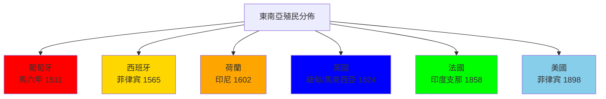
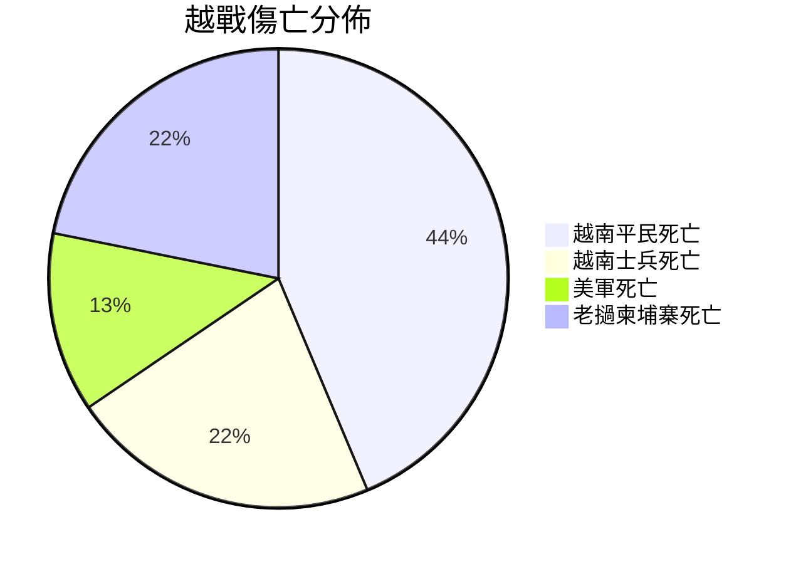
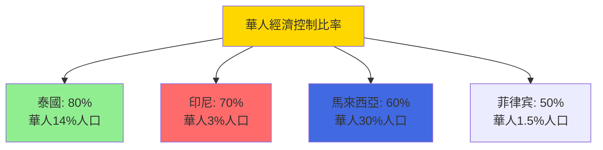
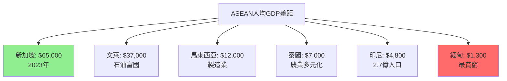
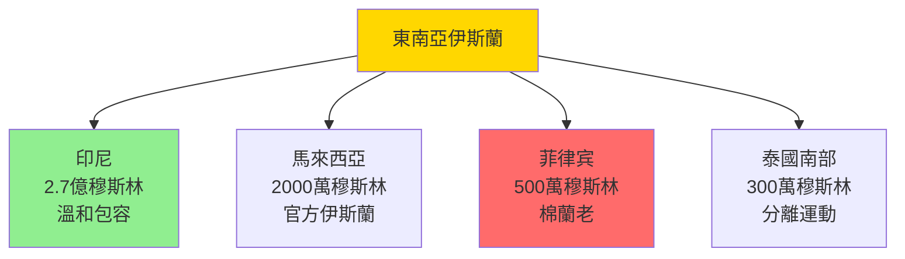

# HIST2192 東南亞史 / Introduction to Modern Southeast Asian History

/** HKU | 6 credits | Instructor: Nicolo Ludovice */

---

## 問題 1：5 個核心心智模型

### 1. 東南亞地理多樣性與歷史路徑分歧
**定義**: 東南亞地理極度多樣——從越南的高山到大陸，到印度尼西亞的 17,000 個島嶼——這種地理多樣性塑造了各國不同的歷史發展路徑。學者 **David Wyatt** 在 *A History of Thailand* (2003) 中指出：地理決定論在東南亞歷史中比在其他地區更重要，因為地理決定了贸易路線、農業模式和外部影響的强度。

**學者**: **David Wyatt** — *A History of Thailand* (2003); **Craig Lockard** — *Southeast Asia in World History* (2009); **Ben Anderson** — *Imagined Communities* (1983)

**驗證**: 東南亞可分為兩大區域：「大陸東南亞」（越南、泰國、緬甸、柬埔寨、老撾）——稻作農業、陆地帝國；「海洋東南亞」（印度尼西亞、馬來西亞、菲律宾）——海洋貿易、港口城市。這種地理分工塑造了兩種截然不同的歷史發展模式。

**歷史事件**:
- **500年**: 扶南王國——最早的印度化王國
- **802年**: 吳哥帝國建立——高棉文明高峰
- **1292年**: 馬可孛羅遊記記錄東南亞
- **1511年8月10日**: 葡萄牙人攻陷馬六甲——歐洲殖民開始
- **1945年8月17日**: 印度尼西亞獨立宣言

### 2. 殖民遺產的差異——法屬、英屬、荷屬、西班牙屬
**定義**: 東南亞被多個歐洲殖民强國瓜分——法屬印度支那（越南、老撾、柬埔寨）、英屬緬甸和馬來亞、荷屬東印度（印度尼西亞）、西班牙/美國屬菲律宾——殖民方式差異導致後殖民命運顯著不同。

**學者**: **Anthony Reid** — *Imperial Alchemy: Nationalism and Identity in Southeast Asia* (1993); **Victor Lieberman** — *Strange Parallels: Southeast Asia in Context* (2003); **Ruth McVey** — 研究緬甸歷史

**驗證**: 殖民方式差異的後果：法屬印度支那在獨立後經歷了 30 年戰爭（越戰）和共產主義政權；英屬緬甸在獨立（1948）後仍有少數民族叛亂持續至 2012 年；荷屬東印度獨立為印度尼西亞——經歷了蘇哈托 32 年威權統治。

**歷史事件**:
- **1511年**: 葡萄牙佔據馬六甲——歐洲殖民開始
- **1565年**: 西班牙佔據菲律宾——天主教化開始
- **1858年**: 法國入侵越南——印度支那殖民化開始
- **1893年**: 法屬印度支那形成
- **1941年12月**: 日軍佔領整個東南亞

### 3. 東南亞華人經濟角色——「商業橋樑」還是「永遠的外國人」？
**定義**: 東南亞華人（Chinese Diaspora）在各國經濟中扮演重要角色——在印度尼西亞（約 3% 人口，控制約 70% 私營經濟）、馬來西亞（約 30% 人口，控制約 60% 私營經濟）、泰國（約 14% 人口，控制約 80% 私營經濟）——但這種經濟成功也使華人社區成為歧視和暴力的目標。

**學者**: **Wang Gungwu** — *The Chinese Overseas* (2000); **Jennifer Cushman** — 研究東南亞華人經濟; **Mary Somers Heidhues** — 研究東南亞華人

**驗證**: 1998 年印尼排華暴動——華人工廠和商店被燒毁，估計死亡人數從數百到數千（數字爭議巨大）；馬來西亞的「新經濟政策」（1970-1990 年代）——試圖减少華人經濟優勢，但被批评為對華人歧視。

**歷史事件**:
- **1820年代**: 華人移民開始大規模赴東南亞
- **1900年**: 东南亚華人總數約 500 萬人
- **1947年**: 印尼華人人口約 100 萬人
- **1998年5月**: 印尼排華暴動——蘇哈托統治結束的導火索
- **2014年**: 東南亞華人總數約 4,000 萬人

### 4. 越戰與冷戰東南亞——20 世紀最漫長的戰爭
**定義**: 越戰（Vietnam War, 1955-1975）是冷戰時期在東南亞爆發的最大規模戰爭——美國投入了約 54 萬軍人，投下了約 300 萬噸炸彈（比二戰總量還多），最終却以美國撤軍和南越政權崩潰告终。

**學者**: **Pierre Journoud** — 研究越戰史; **Marilyn Young** — *The Vietnam Wars* (1991); **Christopher Robbins** — 研究柬埔寨紅色高棉

**驗證**: 越戰傷亡：美軍死亡 58,000 人；越南平民死亡約 200 萬人；老撾轟炸——美軍在老撾投下了約 200 萬噸炸彈——成為人類歷史上人均轟炸最密集的國家。

**歷史事件**:
- **1954年5月7日**: 奠邊府戰役——法軍投降，印度支那戰爭結束
- **1955年7月**: 美國特種戰爭理論——越戰開始
- **1964年8月2日**: 東京灣事件——美國直接軍事介入
- **1968年1月30日**: 春節攻勢——越戰的轉折點
- **1975年4月30日**: 西貢陷落——越戰結束

### 5. 東南亞伊斯蘭多樣性——不是單一「伊斯蘭世界」
**定義**: 東南亞伊斯蘭（Islam in Southeast Asia）與中東和南亞的伊斯蘭有顯著差異——它更具包容性（Sufi 傳統强大）、與當地傳統融合更深刻、而且內部多樣性極高（印尼有 300 多個民族，馬來西亞、泰國南部、菲律宾南部均有伊斯蘭少數群體）。

**學者**: **Mona Abaza** — 研究印尼伊斯蘭; **John Funston** — 研究東南亞政治; **Michael Leifer** — 研究東南亞國際關係

**驗證**: 印尼是世界上穆斯林人口最多的國家（約 2.7 億人），但印尼伊斯蘭與中東原教旨主義差異顯著——溫和的 Nahdlatul Ulama（最大的穆斯林組織，約 9,000 萬成員）和更現代的 Muhammadiyah（約 3,000 萬成員）主導。

**歷史事件**:
- **1292年**: 馬六甲蘇丹國建立——伊斯蘭傳入東南亞
- **1602年**: 荷蘭東印度公司成立——與伊斯蘭蘇丹國的衝突開始
- **1945年11月2日**: 印尼最大穆斯林組織 Nahdlatul Ulama 成立
- **2002年10月12日**: 巴厘島爆炸案——伊斯蘭激進化首次大規模襲擊
- **2019年**: 東南亞伊斯蘭激進化——IS 在印尼和菲律宾的招募

---

## 問題 2：3 個根本分歧

### 分歧 1：殖民遺產——負面為主還是複雜遺產？
- **A 方（負面為主）**: 殖民經濟剝削、種族分化（华人/歐洲人/當地人的階層結構）、邊境劃定導致少數民族問題（如緬甸羅興亞人問題根源於英國殖民時期的人口登記政策）
- **B 方（複雜遺產）**: 殖民留下了鐵路、港口、學校、醫院、法律制度——這些基礎設施在後殖民時期仍是經濟發展的基礎；殖民的「現代化」效應不可否認

### 分歧 2：華人角色——經濟貢獻還是排華歧視的根源？
- **A 方（經濟貢獻派）**: 華人在東南亞經濟發展中發揮了關鍵作用——他們作為「中間人」（Middleman Minority）在殖民經濟和本地經濟之間建立了橋樑，促進了商業活動和資本形成
- **B 方（歧視根源派）**: 華人的經濟成功使他們成為方便的「替罪羊」——每次經濟危機時，華人社區都成為暴力攻擊目標（1998 年印尼排華暴動就是最殘酷的例證）

### 分歧 3：越戰——美國干預是正義還是錯誤？
- **A 方（冷戰必要論）**: 越戰是美國遏制共產主義擴散的必要措施——如果美國不干預，整個東南亞可能會被共產主義控制
- **B 方（歷史錯誤論）**: 美國干預是歷史錯誤——它支持了一個腐敗的南越政權（吳庭艷政權以腐敗和宗教迫害聞名），而忽視了越南人民的自決權利

---

## 問題 3：10 個深度問題

1. **地理如何塑造東南亞歷史**：為什麼「海洋東南亞」（印尼、馬來西亞）和「大陸東南亞」（越南、泰國、緬甸）發展出了截然不同的政治制度和經濟模式？這種地理分工在當代 ASEAN 區域一體化中扮演什麼角色？

2. **馬六甲的歷史意義**：1511 年葡萄牙人佔據馬六甲——這座城市如何從東南亞最重要的港口城市轉變為歐洲殖民據點？為什麼這次佔據被视为東南亞殖民史的轉折點？

3. **殖民類型如何塑造後殖民命運**：為什麼法屬印度支那（越南）最終走向共產主義，而荷屬東印度（印尼）最終建立了世界上最大的伊斯蘭民主國家？殖民方式、當地社會結構、冷戰背景各自扮演了什麼角色？

4. **華人在東南亞的「中間人」地位**：華人為什麼在東南亞經濟中扮演「中間人」角色？這種地位如何使華人社區成為經濟危機時期暴力的目標？1998 年印尼排華暴動的歷史根源是什麼？

5. **越戰的人道代價**：越戰（1955-1975）估計造成 300 萬越南人死亡（平民和士兵）、58,000 美國士兵死亡、200 萬老撾和柬埔寨人受到美軍轟炸影響——為什麼這場戰爭最終以美國失敗告終？

6. **紅色高棉的歷史悲劇**：1975-1979 年柬埔寨紅色高棉政權造成了約 150-200 萬人死亡（約佔總人口 1/4）——這個數字揭示了共產主義革命的什麼危險？為什麼這個政權在民主柬埔寨的選舉勝利後仍然能够奪取政權？

7. **ASEAN 的成就與局限**：ASEAN（1967 年成立）作為東南亞區域組織的成就是什麼？為什麼它无法有效處理成員國之間的尖銳分歧（南海爭端、羅興亞危機、緬甸政變）？

8. **緬甸羅興亞危機的歷史根源**：為什麼緬甸羅興亞人被剝奪公民權？他們的困境與英國殖民時期的人口登記政策有什麼關係？這種「後殖民內部殖民主義」（Internal Colonialism）如何影響了東南亞的種族關係？

9. **泰國為何從未被殖民**：泰國是東南亞唯一從未被歐洲殖民的國家——為什麼？這種「緩衝國」（Buffer State）策略在冷戰時期是否仍然有效？

10. **東南亞民主的多元形態**：為什麼東南亞出現了這麼多不同類型的政治制度——印尼的伊斯蘭民主、緬甸的軍政府、越南和寮國的共產黨一黨制、新加坡的「非民主威權資本主義」？這種多元性揭示了什麼關於「民主化」理論的問題？

---

# 核心心智模型深化（中英對照）

## 1. 東南亞地理多樣性 / Southeast Asian Geographic Diversity

### 1.1 定義與背景 / Definition and Context
東南亞地理多樣性是塑造該地區歷史的最基本因素。從越南的長山山脈到印度尼西亞的 17,508 個島嶼——這種地理多樣性決定了農業模式（稻作 vs 海洋貿易）、外部影響强度（海岸 vs 內陸）以及政治組織形式（中央帝國 vs 分散港口城市）。

### 1.2 關鍵方程式或史料 / Key Evidence
- **大陸東南亞**：稻作帝國——吳哥（802-1431）、緬甸蒲甘（1044-1287）、泰國素可泰（1238-1438）
- **海洋東南亞**：港口城市——馬六甲（1400-1511）、室利佛逝（7-13 世紀）
- **地理分界**：克拉地峽（約北緯 10°）——分隔了大陸和海洋東南亞

### 1.3 應用場景 / Applications
地理多樣性對當代東南亞政治的影響：ASEAN 之所以難以深度整合，因為成員國之間的經濟發展水平差異巨大（新加坡人均 GDP 65,000 美元 vs 緬甸 1,300 美元）。

### 1.4 犀利觀察 / Critical Observation
> 「東南亞地理多樣性最有趣之處——它既是分裂因素，又是統一因素。分裂因素：各國地理條件差異巨大，難以形成共同發展模式；統一因素：所有東南亞社會都面對類似的外部挑戰（季風氣候、熱帶疾病、外來帝國主義），這使東南亞作為一個文化區域的概念有某種現實基礎。」

### 1.5 深度思考題 / Deep Question
**考試題**：分析地理因素如何塑造了「海洋東南亞」和「大陸東南亞」的差異歷史發展路徑。這種差異對當代 ASEAN 區域一體化有什麼影響？

---

## 2. 殖民遺產差異 / Colonial Legacies

### 2.1 定義與背景 / Definition and Context
殖民遺產差異（Colonial Legacy Variations）指東南亞不同殖民宗主國（葡萄牙、西班牙、荷蘭、英國、法國、美國）留下的不同制度遺產，對後殖民國家的政治、經濟和社會發展產生了深遠影響。

### 2.2 關鍵方程式或史料 / Key Evidence
- **法屬印度支那**：集中型行政制度 → 共產主義勝利 → 農業集體化 → 市場改革
- **荷屬東印度**：強制種植制度 → 依附型經濟 → 蘇哈托威權主義 → 民主化
- **英屬緬甸**：間接統治 + 少數民族問題 → 軍政府長期執政
- **美屬菲律宾**：天主教化 + 土地集中 → 家族政治（Marcos 家族）

### 2.3 應用場景 / Applications
殖民遺產差異導致了東南亞各國後殖民發展路徑的顯著不同——法屬殖民地在冷戰中走向共產主義，英屬殖民地在冷戰中走向民主或威權。

### 2.4 犀利觀察 / Critical Observation
> 「殖民遺產最有趣之處——它從來不是單純的『好』或『壞』。荷蘭人離開印尼時留下了英語教育、鐵路網和法治框架；但他們同時留下了依附型經濟結構和華人-當地人的種族分化。殖民者走了，但殖民者建的遊戲規則留下來了——只不過换了本地人玩這個遊戲。」

### 2.5 深度思考題 / Deep Question
**考試題**：比較法屬印度支那和荷屬東印度的殖民方式差異，以及這種差異如何影響了兩地的後殖民命運。

---

## 3. 東南亞華人經濟角色 / Chinese Diaspora in Southeast Asia

### 3.1 定義與背景 / Definition and Context
東南亞華人經濟角色（Chinese Diaspora Economic Role）指華人社區在東南亞各國經濟中作為「中間人少數族裔」（Middleman Minority）的特殊角色。他們的經濟成功使他們成為方便的「替罪羊」，在每次經濟危機和政治動盪中成為暴力攻擊的目標。

### 3.2 關鍵方程式或史料 / Key Evidence
- **泰國**：華人約 14% 人口，控制約 80% 私營經濟——高度同化
- **印度尼西亞**：華人約 3% 人口，控制約 70% 私營經濟——同化程度最低
- **馬來西亞**：華人約 30% 人口，控制約 60% 私營經濟——種族配額政策限制
- **1998年印尼排華暴動**：約 1,000-2,000 人死亡，工廠損失估計數十億美元

### 3.3 應用場景 / Applications
華人經濟角色揭示了「中間人少數族裔」的普遍困境——經濟成功與政治脆弱性的矛盾，在每個東南亞國家都有不同表現。

### 3.4 犀利觀察 / Critical Observation
> 「東南亞華人最荒謬之處——佢哋被視為『外國人』但又控制當地經濟。印尼華人被視為『外國人』但佢哋當中很多已經在印尼生活了十代以上；新加坡華人則被視為『本地人』但又被視為『華人文化傳承者』。呢種身份政治的模糊性，從來不是偶然的——它服務於特定的政治需要。」

### 3.5 深度思考題 / Deep Question
**考試題**：分析 1998 年印尼排華暴動的歷史根源。華人的經濟成功與政治弱勢之間的矛盾如何使華人社區成為暴力的目標？

---

## 4. 越戰 / Vietnam War

### 4.1 定義與背景 / Definition and Context
越戰（1955-1975）是冷戰時期在東南亞爆發的最大規模武裝衝突——美國在 20 年間投入了約 1,730 億美元（約合 2023 年的 1 兆美元），最終却以美軍撤退和北越統一全國告终。這場戰爭揭示了小國在超級大國冷戰中的悲劇命運。

### 4.2 關鍵方程式或史料 / Key Evidence
- **美軍傷亡**：死亡 58,000 人，受傷 153,000 人
- **越南傷亡**：平民和士兵死亡約 200-300 萬人
- **老撾轟炸**：投下約 200 萬噸炸彈——人均轟炸最密集
- **柬埔寨轟炸**：約 50 萬噸——為紅色高棉的崛起創造了條件
- **美國軍費**：越戰期間每年約 1,000 億美元（1968 年峯值）

### 4.3 應用場景 / Applications
越戰的教訓對理解當代美中關係和台灣問題仍有深刻意義——美國是否會犯同樣的錯誤？

### 4.4 犀利觀察 / Critical Observation
> 「越戰最荒謬之處——美國支持了一個腐敗的南越政權（吳庭艷政權），最終這個政權倒台了——不是因為北越軍隊太强，而是因為南越人民不願為這個腐敗政權犧牲。歷史上，靠外國勢力支撑的政權，最終往往比它們的外國支柱消失得更快——呢個規律，從南越到阿富汗到台灣，都屡試不爽。」

### 4.5 深度思考題 / Deep Question
**考試題**：分析越戰的歷史教訓——為什麼世界上最强大的軍事力量最終在這場戰爭中失敗？這個失敗對美國後續的外交政策有什麼影響？

---

## 5. 東南亞伊斯蘭多樣性 / Islamic Diversity in Southeast Asia

### 5.1 定義與背景 / Definition and Context
東南亞伊斯蘭多樣性（Islamic Diversity in Southeast Asia）指該地區伊斯蘭與中東和南亞伊斯蘭的顯著差異。東南亞伊斯蘭更具包容性，Sufi 傳統强大，與當地傳統融合深刻——印尼最大穆斯林組織 Nahdlatul Ulama （約 9,000 萬成員）的口號是「與所有人對話」（Dialogue with All）。

### 5.2 關鍵方程式或史料 / Key Evidence
- **印尼穆斯林人口**：約 2.7 億人——世界最大穆斯林國家
- **Nahdlatul Ulama**：約 9,000 萬成員——世界最大穆斯林組織
- ** Muhammadiyah**：約 3,000 萬成員——現代主義伊斯蘭組織
- **菲律宾南部（棉蘭老）**：約 500 萬穆斯林——與印尼和馬來西亞差異顯著

### 5.3 應用場景 / Applications
東南亞伊斯蘭多樣性揭示了「伊斯蘭世界」並非鐵板一塊——它是多元的、文化特定的、地區性的。

### 5.4 犀利觀察 / Critical Observation
> 「東南亞伊斯蘭最有趣之處——它與中東原教旨主義的差異，揭示了宗教的『地方性』。同一本《古蘭經》，在沙地阿拉伯讀是一種理解，在印尼讀是另一種理解。宗教從來不是真空存在的——它總是被當地文化、歷史、經濟條件所塑造。」

### 5.5 深度思考題 / Deep Question
**考試題**：分析「伊斯蘭激進化」在東南亞的表現形式與中東的差異。什麼因素塑造了東南亞伊斯蘭的獨特形態？

---

## 深度自測問題詳解

**Q1（地理塑造歷史）**：地理差異塑造了兩種不同的歷史路徑：「海洋東南亞」因贸易需要形成了港口城市和海洋網絡，發展出較為分散的政治結構；「大陸東南亞」因稻作農業需要形成了中央集權帝國。ASEAN 一體化因此受到地理差異的結構性制約。

**Q2（馬六甲歷史）**：1511 年葡萄牙人佔據馬六甲象徵著東南亞歷史的根本轉折——從本地王朝爭霸轉變為歐洲殖民帝國競爭。馬六甲的戰略位置（控制印度洋-太平洋貿易通道）使其成為殖民强國必爭之地。

**Q3（殖民方式差異）**：法屬印度支那的集中型行政制度強化了國家控制，為共產主義勝利提供了制度基礎；荷屬東印度的強制種植制度創造了依附型經濟，導致蘇哈托的威權資本主義。冷戰背景則加劇了兩種殖民遺產的不同命運。

**Q4（華人經濟角色）**：華人的「中間人」地位形成於殖民時期——荷蘭和英國殖民者利用華人作為税收徵收者和商人，将華人與當地社會隔離。這種制度設計的遺產延續至今：華人經濟上成功但政治上邊緣，成為方便的「替罪羊」。

**Q5（越戰失敗）**：美國失敗的根源不是軍事上的——美軍在战術層面幾乎沒有输過任何重大戰役；而是政治上的——南越政權沒有得到人民的忠誠，而北越/越共游擊隊則得到了人民的支持。歷史上，靠外國支撑的政權最終都會失敗。

**Q6（紅色高棉）**：紅色高棉的悲劇揭示了共產主義革命的危險——它們往往在農民支持的基礎上奪取政權，但最終以大規模屠殺自己的人民告终。民主柬埔寨的選舉勝利（1973 年，獲得了約 55% 的選票）被證明是歷史的諷刺——因為民主制度並不能防止獨裁政權的崛起。

**Q7（ASEAN 局限）**：ASEAN 的結構性局限包括：共識決策機制（任何成員國都可以否决一體化措施）、成員國之間的經濟發展水平差異巨大（新加坡 vs 緬甸）、歷史爭端（如柬埔寨-泰國邊境衝突、馬來西亞-新加坡分家）尚未解决。

**Q8（羅興亞危機）**：緬甸羅興亞人問題的歷史根源包括：英國殖民時期大量孟加拉穆斯林移居若開邦（阿拉干），緬甸獨立後的《緬甸國籍法》（1982 年）將羅興亞人列為「孟加拉人」而非公民，剝奪了他們的基本權利。

**Q9（泰國緩衝國）**：泰國之所以從未被殖民，因為它在英法兩大殖民帝國之間扮演了「緩衝國」角色——1896 年英法協議確認泰國為中立緩衝區。這種策略在冷戰時期同樣有效——泰國成為美國在東南亞的重要盟友，但同時保持了主權獨立。

**Q10（民主多元）**：東南亞民主的多元形態揭示了「民主化」理論的問題：民主化並非線性過程，而是受到當地歷史、文化、經濟和國際因素的深刻影響。ASEAN 版本的民主可能與西方民主模式有根本差異——但這並不意味著它們不是民主。

---

## 5 個 Mermaid 圖解

### 圖解 1：東南亞殖民勢力分佈

### 圖解 2：越戰傷亡規模

### 圖解 3：東南亞華人經濟控制

### 圖解 4：ASEAN 經濟差距

### 圖解 5：東南亞伊斯蘭多樣性

---

## 總結

**HIST2192 Modern Southeast Asian History** 的核心價值：

1. **地理與歷史**——東南亞地理多樣性是塑造該地區歷史的最基本因素——理解地理是理解東南亞歷史的第一步。

2. **殖民遺產的複雜性**——東南亞的殖民經驗不是單一模式的；不同殖民宗主國留下了不同的制度遺產，導致後殖民命運顯著不同。

3. **多元與脆弱**——東南亞是世界上最多元化的地區之一——種族、宗教、語言、文化的多樣性既是財富也是脆弱性的根源。

4. **冷戰東南亞的悲劇**——越戰、柬埔寨紅色高棉、緬甸軍政府——冷戰在東南亞留下了深刻創傷，這些創傷至今仍在。

5. **當代相關性**——南海爭端、羅興亞危機、緬甸政變——這些都是東南亞歷史的延續，而非全新的問題。

**research-based金句**：
> 「東南亞最有趣之處——它係世界上最多樣化但又最被忽略的地區之一。东南亚有世界最大穆斯林國家（印尼）、最大民主穆斯林政黨（馬來西亞伊斯蘭黨）、唯一未被殖民的國家（泰國）、最大規模共產主義革命的受害者（柬埔寨）、還有最殘酷的種族滅絕（羅興亞）。呢種多樣性，係歷史愛好者的天堂，也是歷史受害者的地獄。」

---

## 延伸閱讀

1. Anderson, Benedict. *Imagined Communities: Reflections on the Origin and Spread of Nationalism*. Rev. ed. London: Verso, 2006.
2. Reid, Anthony. *Imperial Alchemy: Nationalism and Identity in Southeast Asia*. Cambridge: Cambridge University Press, 1993.
3. Wyatt, David K. *A History of Thailand*. 2nd ed. Cambridge: Cambridge University Press, 2009.
4. Lockard, Craig A. *Southeast Asia in World History*. Oxford: Oxford University Press, 2009.
5. Leifer, Michael. *Dictionary of the Politics and Conflict in Southeast Asia*. London: Routledge, 1996.
6. Young, Marilyn B. *The Vietnam Wars, 1945-1990*. New York: HarperCollins, 1991.
7. Wang Gungwu. *The Chinese Overseas: A Bibliography of Materials in English*. 3rd ed. London: Routledge, 2000.
8. Abaza, Mona. *Islamic Trends in Indonesia: Notes on the Influences of Globalization*. London: Routledge, 2001.
