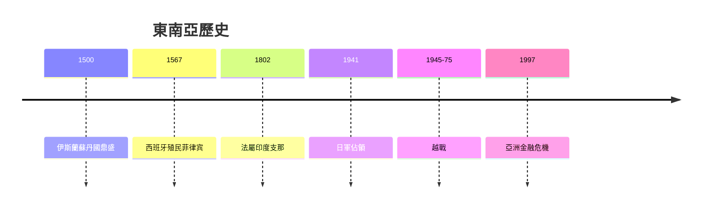
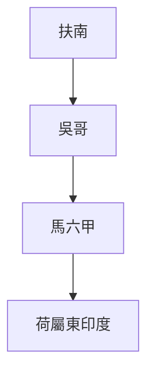
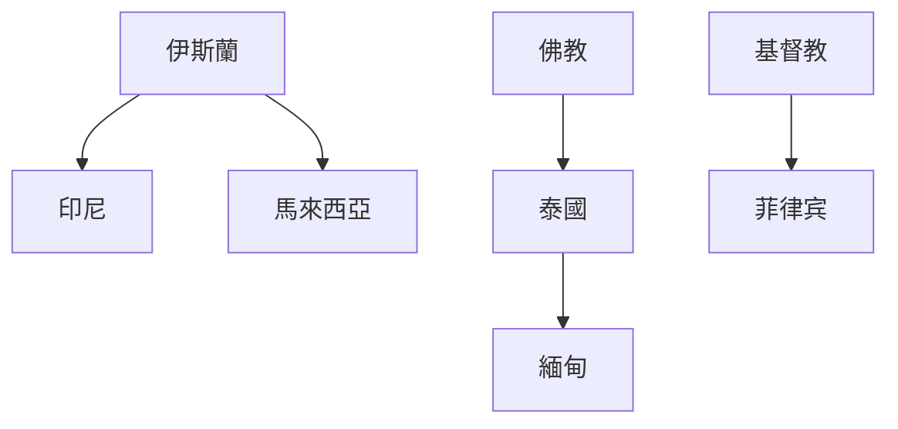
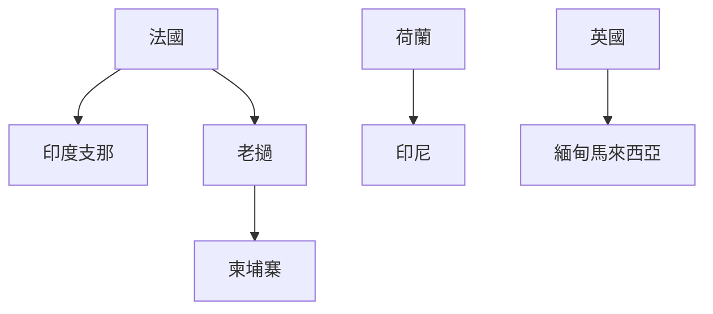
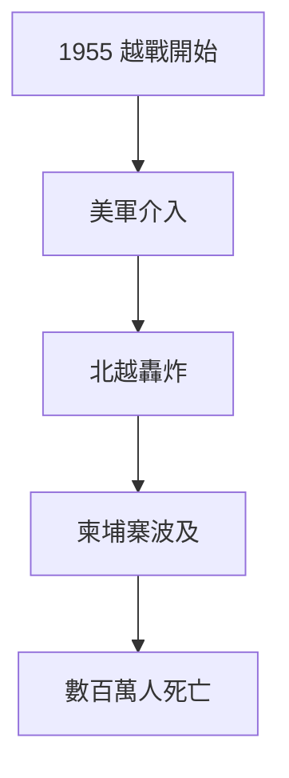
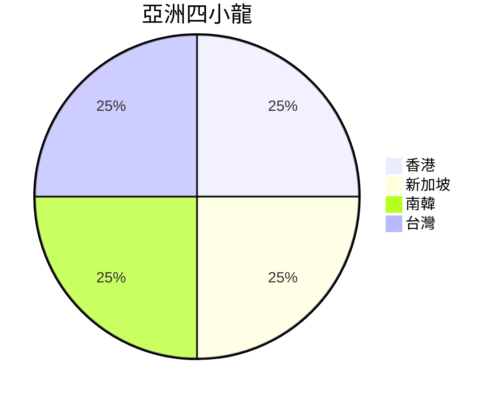

# HIST2192 東南亞史 / Introduction to Modern Southeast Asian History (6 credits)

**Instructor**: Nicolo Ludovice
**Department**: History, HKU  
**Official source**: [HKU History Course Description 2024-25](https://history.hku.hk/wp-content/uploads/2024/07/HIST-2425.pdf)
**Style**: 袁騰飛式 — 犀利、聚焦東南亞點解多元

---

## 問題 1：這個領域所有專家共享的 5 個核心心智模型

### 心智模型 1：東南亞地理多樣性
學者 **David Wyatt** (*A History of Thailand*, 2003) 研究：東南亞地理多樣——從高山到群島——塑造各國發展路徑。

學者 **Craig Lockard** (*Southeast Asia*, 2018) 分析：海洋東南亞同大陸東南亞差異巨大。

- 印度化王國 (Funan, Srivijaya)
- 伊斯蘭蘇丹國 (馬六甲)
- 中國影響 (越南)

### 心智模型 2：殖民遺產差異
學者 **Anthony Reid** (*Imperial alchemy*, 1993) 研究：法屬印度支那、英屬緬甸、荷屬東印度——殖民方式差異導致後殖民命運不同。

學者 **Ruth McVey** 研究：伊斯蘭蘇丹國制度延續。

### 心智模型 3：東南亞華人經濟角色
學者 **Wang Gungwu** (*The Chinese Overseas*, 2000) 研究：華人 diaspora 經濟網絡——商業橋樑定少數群體歧視？

學者 **Jennifer Cushman** 分析：華人商業網絡與當地經濟關係。

### 心智模型 4：越戰與東南亞冷戰
學者 **Pierre Journoud** 研究：越戰 (1955-1975) 摧毁越南、影響整個東南亞。

學者 **Christopher Robbins** 分析：柬埔寨紅色高棉悲劇。

### 心智模型 5：東南亞伊斯蘭多樣性
學者 **Mona Abaza** 研究：印尼、馬來西亞、泰國伊斯蘭差異巨大——唔係單一「伊斯蘭世界」。

學者 **John Funston** 分析：東南亞民主多元形態。

---

## 問題 2：3 個根本分歧

### 分歧 1：殖民遺產——負面為主定複雜遺產？
- **A 方**：負面
  - 經濟剝削、種族分化
- **B 方**：複雜
  - 留下現代制度

### 分歧 2：華人角色——經濟貢獻定排華歧視？
- **A 方**：經濟貢獻
  - 商業網絡、資金
- **B 方**：歧視問題
  - 1998 印尼排華

### 分歧 3：越戰——美國干預正義定錯誤？
- **A 方**：錯誤
  - 導致數百萬人死亡
- **B 方**：冷戰必要性
  - 防止共產主義擴散

---

## 問題 3：10 個深度問題

1. 如果東南亞冇被殖民，會發展出自己現代性嗎？
2. 點解東南亞可以容納伊斯蘭、佛教、基督教？
3. 如果你是 1945 年印尼人，獨立對你有乜嘢意義？
4. 點解越戰主要喺越南、老撾、柬埔寨打？
5. 如果你去 1965 年做田野，點樣記錄越戰？
6. 東南亞華人——點解被視為「外來者」但又經濟成功？
7. 點解緬甸羅興亞危機被國際關注？
8. 如果你是歷史學家，點樣研究東南亞多元歷史？
9. 泰國點解係東南亞唯一從未被殖民國家？
10. 東南亞區域合作——點解 ASEAN 咁難統一？

---

## 核心心智模型深化

### 1. 東南亞歷史時間線

---

## 5 個 Mermaid 圖解

### 📊 Diagram 1: 東南亞帝國

### 📊 Diagram 2: 東南亞宗教分佈

### 📊 Diagram 3: 殖民勢力分佈

### 📊 Diagram 4: 越戰影響

### 📊 Diagram 5: 東南亞經濟

---

## 總結

1. 東南亞多元地理文化塑造獨特歷史
2. 殖民遺產複雜
3. 華人角色爭議持續
4. 越戰創傷仍未癒合
5. 東南亞民主多元但脆弱

**最後問題**: 東南亞點解係全球最重要又最少被理解嘅地區之一？

---
**版權所有 © HKU History Self-Study**
