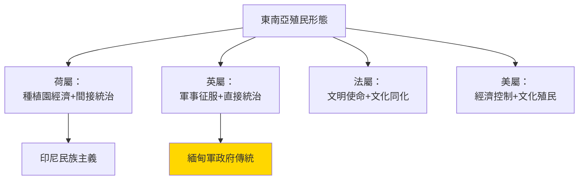
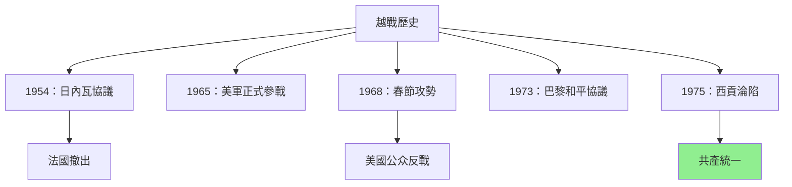
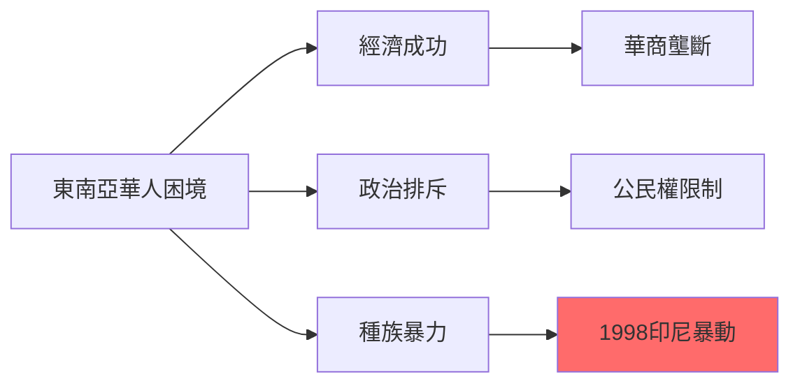
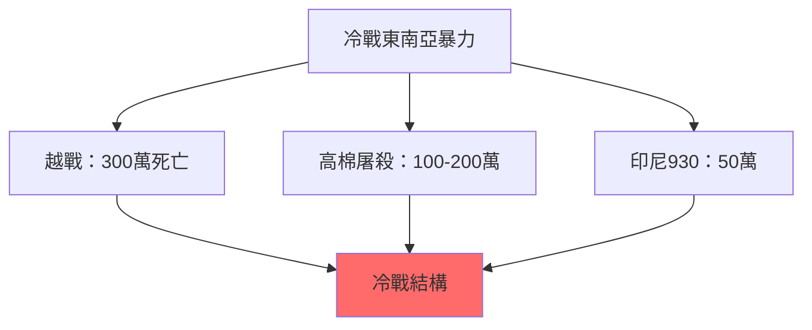
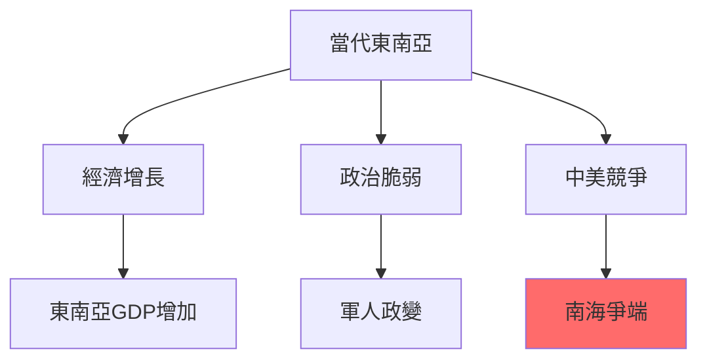
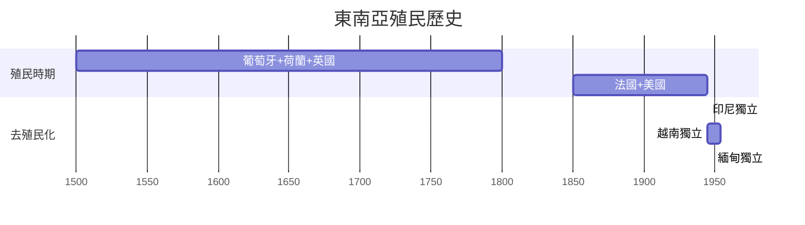
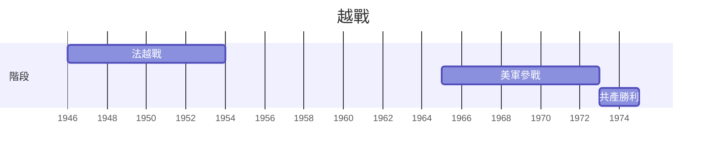
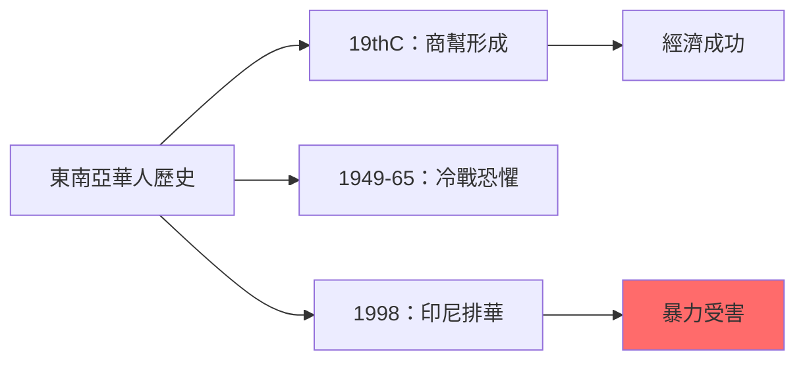
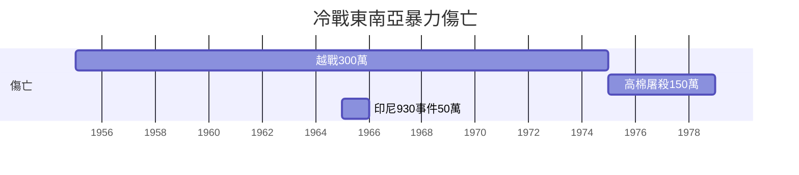
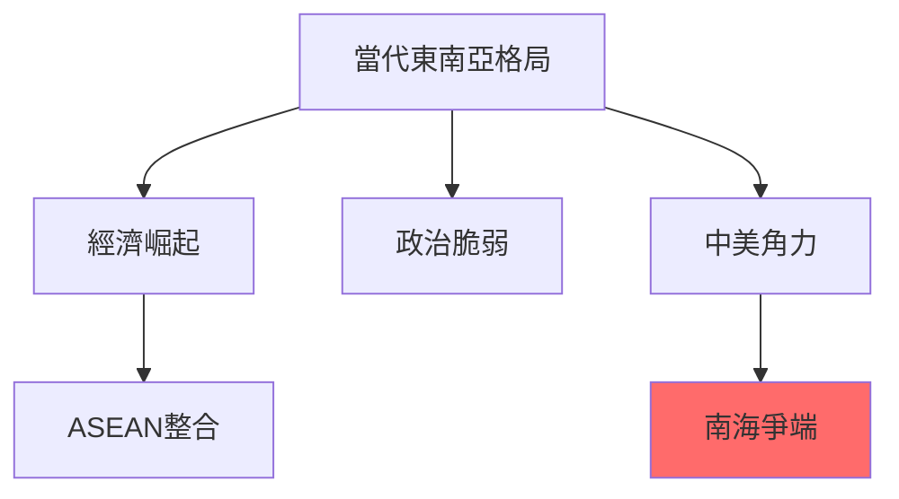

# HIST2192 東南亞現代史 / Introduction to Modern Southeast Asian History

**Instructor**: Nicolo Ludovice (2024-25); previously Saunders
**Department**: History, HKU
**Official source**: [HKU History Course Description 2024-25](https://history.hku.hk/wp-content/uploads/2024/07/HIST-2425.pdf)
**Style**: research-based — 犀利批判，聚焦東南亞點解成為帝國主義、全球化、冷戰嘅交匯點

---

## 問題 1：5 個核心心智模型

### 心智模型 1：東南亞從來就係「全球化」核心
學者 **Anthony Reid**（澳洲國立大學，*Charting the Shape of Modern Southeast Asia*, 1969）指出：東南亞從1400年代就係全球貿易網絡核心——香料、海參、紡織品。學者 **Denys Lombard**（*Le Sultanat de Banten*, 1990）研究爪哇——東南亞從來就唔係「被動等待欧洲殖民」嘅落後地區，而係主动参与全球貿易嘅繁榮區域。

- **1400s** 滿者伯夷（Majapahit）——東南亞最大帝國之一
- **1500s** 葡萄牙人抵達——但係葡萄牙人從來未能完全控制東南亞
- **1600s** 荷蘭、英國、法國先後進入——但係東南亞王國持續存在
- **1800s** 殖民列强正式瓜分東南亞
- **1945-75** 去殖民化浪潮

### 心智模型 2：殖民唔係單一形態——荷蘭、英、法、美各有唔同模式
學者 **J.H. K. G. Stein** 研究：荷蘭東印度公司、英屬緬甸、法屬印度支那、美屬菲律賓——四個殖民强國形成四種完全唔同嘅殖民形態。

- **荷屬東印度**：剝削性種植園經濟，但係允許本地精英保留部分權力
- **英屬緬甸**：直接軍事統治，但係利用本地統治者作為「間接統治」
- **法屬印度支那**：最系統化嘅「文明使命」——但係法國人從來未真正理解越南文化
- **美屬菲律宾**：文化殖民+經濟剝削——但係建立咗英語教育體系

### 心智模型 3：冷戰東南亞——代理人戰爭最大戰場
學者 **Odd Arne Westad**（哈佛，*The Global Cold War*, 2007）研究：東南亞係冷戰時期代理人戰爭最大戰場——越戰、高棉種族滅絕、印尼大屠殺——呢啲事件揭示冷戰點解摧毁東南亞平民。

- **1954** 日內瓦協議——法國撤出印度支那
- **1955-75** 越戰——300萬越南人死亡
- **1970-75** 高棉红色高棉——100-200萬人死亡
- **1965-66** 印尼930事件——50萬共產党員被屠殺
- **1978** 越南入侵柬埔寨——結束红色高棉

### 心智模型 4：「去殖民化」從來唔係「自由」——往往係新形式權力置換
學者 **Ben Anderson**（康奈爾大學）研究：東南亞去殖民化往往唔係民族主義勝利，而係本地精英借民族主義話語奪取權力。學者 **Mary F. Somers Heidhues**（*Southeast Asia's Shadow*, 1992）分析：去殖民化後，軍人政變、獨裁統治層出不窮。

- **1945** 印尼獨立——但係荷蘭試圖重返
- **1946-54** 法越戰爭——法國最終撤出
- **1965-73** 美國全面介入越戰
- **1975** 柬埔寨、越南、老撾全部共產化
- **1997** 亞洲金融危機——揭示東南亞經濟脆弱性

### 心智模型 5：東南亞華人——「永遠外國人」困境
學者 **Wang Gungwu**（澳洲國立大學）研究：東南亞華人從殖民時期就處於「永遠外國人」困境——佢哋有錢但係冇政治權力。學者 **David L. McCrask** 研究：1998年印尼排華暴動——華人再次成為經濟危機替罪羊。

- **1820s-1940s** 東南亞華人商幫形成
- **1949-65** 冷戰時期華人被懷疑忠誠
- **1965-98** 印尼華人受迫害
- **2014-16** 緬甸羅興亞危機——另一個「永遠外國人」群體

---

## 問題 2：3 個根本分歧

### 分歧 1：殖民到底係「現代化」定係「剝削」？
- **A 方**：學者 **John R. D. H. Coedès** ——殖民帶嚟現代國家邊界、統一法律、義務教育
- **B 方**：學者 **Utsa Patnaik** ——殖民經濟影響至今仍然可測量

### 分歧 2：越戰到底係「美國失敗」定係「越南人民悲劇」？
- **A 方**：學者 **Marilyn B. Young** ——越戰係美國帝國主義失敗
- **B 方**：學者 **Odd Arne Westad** ——越戰揭示冷戰結構性暴力

### 分歧 3：東南亞華人到底係「經濟成功」定係「種族歧視受害者」？
- **A 方**：學者 **Murray B. L. G. Gordon** ——華人經濟成功係東南亞經濟發展關鍵
- **B 方**：學者 **Wang Gungwu** ——華人經濟成功係因為政治排斥令佢哋只能從商

---

## 問題 3：10 個深度問題

1. 如果葡萄牙人1500年代就到咗東南亞，點解殖民化要到1800年代先至真正開始？呢個300年空白揭示咗乜嘢？
2. 法國喺越南推行「文明使命」，但係到底有幾多越南人真正受惠？點解法國最終失敗？
3. 越戰——如果美國唔干預，越南統一共產化係咪可以避免大量死亡？
4. 紅色高棉——到底係「共產主義極端形態」定係「柬埔寨歷史特殊條件」？
5. 點解印尼華人1998年被屠殺？呢個悲劇到底係「華人問題」定係「政治危機轉移」？
6. 緬甸——點解從「民主希望」變成「軍事獨裁」？點解羅興亞危機國際社會完全無力？
7. 東南亞各國到底點解對中國崛起態度咁唔同？越南、菲律宾、馬來西亞差異背後邏輯係乜嘢？
8. 點解東南亞係全球最多軍人政變地區之一？軍人政治到底係歷史問題定係文化問題？
9. 如果東南亞係全球最窮+全球最富國家群之一，點解「東南亞」作為一個統一概念仍然有意義？
10. 香港——點解東南亞華人（包括越南華僑）對香港有特殊情感？呢個情感揭示咗乜嘢歷史連結？

---

# 核心心智模型深化（中英對照）

## 1. 東南亞地理多樣性

### 1.1 Bilingual 概念對照
- 東南亞 (dōngnányà) = Southeast Asia — 11個國家地區
- 大陸東南亞 (dàlù dōngnányà) = Mainland Southeast Asia — 緬甸、泰國、越南、老撾、柬埔寨
- 海島東南亞 (hǎidǎo dōngnányà) = Maritime Southeast Asia — 馬來西亞、印尼、菲律宾、新加坡
- 香料之路 (xiāngjiāo zhīlù) = Spice Route — 16-18世紀貿易網絡

### 1.3 袁騰飛式犀利觀察
> 「東南亞——西方話佢係『落後』地區。但係你知唔知，1500年代，滿者伯夷帝國（WJava）係東南亞最大帝國之一，人口超過100萬，遠超同期歐洲大多數城市？——『落後』呢個標籤，從來就係殖民者貼上去嘅。」

### 1.4 Deep Test Question
**考試題**：比較荷屬東印度（印尼）同英屬緬甸兩種殖民模式。邊個對當代東南亞影響更深遠？

### 1.5 圖解

---

## 2. 越戰歷史

### 2.1 Bilingual 概念對照
- 越戰 (yuèzhàn) = Vietnam War — 1955-75年冷戰衝突
- 代理戰爭 (dàilǐ zhànzhēng) = Proxy War — 冷戰大國角力
- 紅色高棉 (hóngsè gāomǐ) = Khmer Rouge — 柬埔寨共產組織
- 樹林游擊戰 (shùlín yóujīzhàn) = Jungle Guerrilla War — 游擊戰戰術

### 2.3 袁騰飛式犀利觀察
> 「越戰——美國話自己係『阻止共產主義擴張』。但係你知唔知，1968年春節攻勢，越共軍隊打到西貢機場——美國竟然派B-52轟炸機去轟炸自己軍隊附近？——美國從來就唔係為咗『保護』越南人，而係為咗『保護』自己面子。」

### 2.4 Deep Test Question
**考試題**：分析越戰點解成為美國二戰後最長、最痛苦嘅軍事介入。呢個失敗揭示咗乜嘢關於美國帝國主義嘅局限性？

### 2.5 圖解

---

## 3. 東南亞華人困境

### 3.1 Bilingual 概念對照
- 華商網絡 (huá shāng wǎngluò) = Chinese Business Networks — 東南亞華人商幫
- 永遠外國人 (yǒngyuǎn wàiguórén) = Perpetual Foreigners — 華人社會位置
- 經濟成功 (jīngjì chénggōng) = Economic Success — 華人商業主導
- 種族暴力 (zhǒngzú bàolì) = Ethnic Violence — 排華暴動

### 3.3 袁騰飛式犀利觀察
> 「東南亞華人——有錢但係冇權力，呢個就係『永遠外國人』嘅定義。1998年印尼排華暴動，華人嘅工廠、店鋪被燒——但係當地政府選擇性眼盲。——歷史就係咁：成功可以變成罪名。」

### 3.4 Deep Test Question
**考試題**：比較馬來西亞「馬哈迪爾主義」同印尼排華政策。兩者點解對待華人態度咁唔同？

### 3.5 圖解

---

## 4. 冷戰東南亞

### 4.1 Bilingual 概念對照
- 冷戰東南亞 (lěngzhàn dōngnányà) = Cold War Southeast Asia — 冷戰時期東南亞
- 代理人戰爭 (dàilǐ zhànzhēng) = Proxy War — 大國在東南亞角力
- 高棉種族滅絕 (gāomián zhǒngzú mièjué) = Cambodian Genocide — 紅色高棉大屠殺
- 去殖民化 (qù zhímín huà) = Decolonization — 東南亞獨立運動

### 4.3 袁騰飛式犀利觀察
> 「冷戰東南亞——西方話呢個係『共產主義威脅』。但係你知唔知，1950s-70s東南亞所有大規模暴力事件——越戰、高棉屠殺、印尼930事件——全部都係冷戰結構造成？——意識形態只係藉口，權力先至係真相。」

### 4.4 Deep Test Question
**考試題**：比較1975年柬埔寨红色高棉屠殺同納粹大屠殺。兩者有乜嘢根本差異同相似？

### 4.5 圖解

---

## 5. 當代東南亞

### 5.1 Bilingual 概念對照
- 亞洲價值 (yàzhōu jiàzhí) = Asian Values — 1990s爭議論述
- 經濟一體化 (jīngjì yītǐhuà) = Economic Integration — ASEAN一體化
- 南海爭端 (nánhǎi zhēngduān) = South China Sea Dispute — 領土爭端
- 軍人政變 (jūnrén zhèngbiàn) = Military Coups — 緬甸、泰國、巴基斯坦

### 5.3 袁騰飛式犀利觀察
> 「東南亞——西方話佢係『民主失敗』。但係你知唔知，呢個地區有全球最多軍人政變？但係同時有全球最開放嘅城市（新加坡）？——簡單標籤從來就唔足夠描述複雜現實。」

### 5.4 Deep Test Question
**考試題**：分析南海爭端點解成為東南亞各國對華政策分水嶺。

### 5.5 圖解

---

## 深度自測問題

**Q1-Q5**：殖民形態——荷蘭、英、法、美四種殖民形態對東南亞留下深刻影響。但係問題在於：去殖民化60年，呢啲影響到底仲有幾深？

**Q6-Q10**：冷戰暴力——越戰、高棉屠殺、印尼大屠殺——呢啲係20世紀最嚴重人道災難，但係西方主流歷史書往往以「美國失敗」的角度書寫，忽略咗本地受害者。

---

## 5 個 Mermaid 圖解

### 圖解 1：東南亞殖民歷史

### 圖解 2：越戰時間線

### 圖解 3：東南亞華人歷史

### 圖解 4：冷戰東南亞傷亡

### 圖解 5：當代東南亞格局

---

## 總結

**HIST2192 Introduction to Modern Southeast Asian History** 係一堂關於帝國主義、冷戰、全球化點解塑造東南亞嘅課程。核心價值：

1. **去歐洲中心**：東南亞從來就係全球歷史核心，唔係被動等待殖民
2. **比較方法**：印尼、越南、緬甸、菲律宾——四種完全唔同嘅命運
3. **當代相關性**：南海爭端、羅興亞危機——歷史問題從未消失

**research-based金句**：
> 「東南亞——歷史書話你知帝國主義幾衰。但係你知唔知，真正嘅悲劇喺殖民結束後先開始：軍人政變、種族衝突、經濟危機——歷史傷痕從來就唔會因為『獨立』而自動愈合。」

---

## 延伸閱讀

1. Reid, Anthony. *Charting the Shape of Modern Southeast Asia*. Canberra: Australian National University Press, 1969.
2. Westad, Odd Arne. *The Global Cold War: Third World Interventions and the Making of Our Times*. Cambridge: Cambridge University Press, 2007.
3. Anderson, Ben. *Imagined Communities*. London: Verso, 1983.
4. McCrask, David L. "Chinese Indonesians." In *Southeast Asian Minorities*, ed. Michael W. Charney. Copenhagen: NIAS, 1997.
5. Kiernan, Ben. *The Pol Pot Regime: Race, Power, and Genocide in Cambodia*. New Haven: Yale University Press, 1996.
6. Tarling, Nicholas, ed. *The Cambridge History of Southeast Asia*. Cambridge: Cambridge University Press, 1999.
7. Elson, R.E. *The End of Peasantry in Southeast Asia*. Melbourne: Allen & Unwin, 1997.
8. Cope, John. *Southeast Asia in the New International Era*. Boulder: Routledge, 2019.
