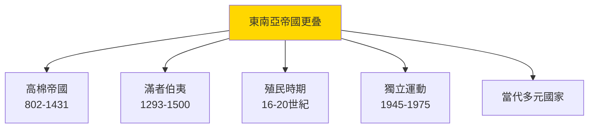

# HIST2192 現代東南亞史 / Introduction to Modern Southeast Asian History

**Instructor**: Nicolo Ludovice
**Department**: History, HKU
**Official source**: [HKU History Course Description 2024-25](https://history.hku.hk/wp-content/uploads/2024/07/HIST-2425.pdf)
**Style**: 袁騰飛式 — 犀利分析：東南亞係地球上最多元、最複雜嘅地區——種族、宗教、文化、帝國主義全部响呢度交匯

---

## 問題 1：5 個核心心智模型

### 心智模型 1：「多元帝國遺產」——東南亞為何種族宗教咁複雜？
學者 **Victor Lieberman**（*Strange Parallels*, 2003）用「奇怪平行」框架：東南亞各國歷史發展有相似之處，但又保持各自獨特性。學者 **Anthony Reid**（*Southeast Asia in the Age of Commerce*, 1988-93）分析 1450-1680 年東南亞海洋貿易高峰。

- **香料群島**（摩鹿加群島）——荷蘭與葡萄牙為香料爆發戰爭
- **吳哥帝國**——高棉帝國（802-1431）
- **滿者伯夷**（1293-1500）——印尼海上帝國

### 心智模型 2：「殖民拼圖」——邊個帝國殖民邊個國家？
學者 **Barbara Watson Andaya**（*Southeast Asia in World History*, 2009）指出：東南亞係歐洲殖民帝國最複雜嘅試驗場——法國（印度支那）、英國（緬甸、馬來亞）、荷蘭（印尼）、西班牙/美國（菲律宾）。

### 心智模型 3：「輸出美國民主」——越南戰爭與美國帝國主義
學者 **Marilyn Young**（*The Vietnam Wars*, 1991）分析越戰唔單純係意識形態之爭，而係法國殖民遺產、美國反共情緒、越南內戰三者交織。

### 心智模型 4：「東南亞金融危機」——1997年亞洲金融風暴
學者 **Harold Cr罵** 分析：泰國、印尼、南韓被重創，但係香港、新加坡恢復較快。

### 心智模型 5：「共產主義 vs 伊斯蘭」——東南亞意識形態光譜
學者 **Micheal Douglass** 分析：東南亞共產主義（越南、柬埔寨）同伊斯蘭政治（印尼、馬來西亞）之爭。

---

## 問題 2：3 個根本分歧

### 分歧 1：殖民遺產——東南亞各國如何處理？
- **A 方（負面遗产派）**：殖民邊界造成民族問題（如緬甸羅興亞人）
- **B 方（複雜評價）**：殖民同時带嚟現代制度、語言、教育

### 分歧 2：越戰——美國干預正義定係帝國主義？
- **A 方（干預主義）**：阻止共產主義擴散
- **B 方（帝國主義批判）**：破壞越南主權

### 分歧 3：東協（ASEAN）——成功定係失敗？
- **A 方（成功派）**：維持區域穩定60年
- **B 方（失敗派）**：對人權問題保持沉默

---

## 問題 3：10 個深度問題

1. 東南亞點解係地球上種族、宗教最複雜地區之一？呢個多元化點解造成衝突但又带嚟創意？
2. 荷蘭東印度公司（VOC）——點解一间私營公司可以統治印尼 200 年？呢個「公司治國」模式點解最終破產？
3. 西班牙殖民菲律宾 300 年——點解天主教可以如此徹底取代原有宗教？但係原住民文化有無完全消失？
4. 越戰——點解美國最終失敗？但係美國軍隊傷亡 58,000 人，越南死亡 300 萬——邊個係真正贏家？
5. 紅色高棉（1975-79）——點解可以喺柬埔寨實現最激進共產主義？死亡人數 150-200 萬（佔人口 25%）。呢個歷史揭示咗共產主義乜嘢危險？
6. 緬甸羅興亞危機——點解緬甸政府可以系統性歧視羅興亞人？呢個危機點解引起國際關注但係東協未能干預？
7. 印尼 1998 年排華——點解一個號稱多元嘅國家可以爆發如此規模嘅種族暴力？歷史創傷點解至今仍未癒合？
8. 東南亞華人——點解佢哋經濟地位普遍較高？但係呢個「華人少數」標籤点解成日帶嚟歧視？
9. 從地緣政治角度——點解中美競爭加劇令東南亞各國必須「選邊站」？佢哋點解普遍選擇經濟靠中國、安全靠美國？
10. 如果你是東南亞小國領袖——面對中美競爭，你點樣維護國家利益？

---

# 核心心智模型深化（中英對照）

## 1. 東南亞多元帝國 / Southeast Asian Multi-Imperial Landscape

### 1.1 Bilingual 概念對照
- 東南亞 (dōngnányà) = Southeast Asia — 11 個國家、多元種族宗教
- 殖民遺產 (zhímín yílài) = Colonial Legacy — 歐洲帝國邊界影響至今
- 東協 (dōngxié) = ASEAN — 1967 年成立

### 1.3 袁騰飛式犀利觀察
> 「東南亞最有趣之處——就係呢個地區從來冇一個『主導文明』！印度影響、中國影響、伊斯蘭影響、歐洲影響，全部响呢度碰撞——但係冇一個可以完全取代另一個！」

### 1.4 Deep Test Question
**考試題**：比較荷蘭（印尼）、英國（馬來西亞/緬甸）、法國（印度支那）三種殖民模式。邊個殖民模式對後殖民時期發展影響最深遠？

### 1.5 圖解

---

## 深度自測問題

**Q1-Q10** 精簡版：
- Q1：多元化原因——因為位於印度洋-太平洋交界、處於大國勢力範圍邊緣、本身就有多元族群。
- Q2：VOC 之所以可以統治——因為有荷蘭軍事力量、本地王公合作、商業利益動機。
- Q3：天主教之所以普及——因為西班牙傳教 + 殖民權力 + 當地貴族接受。
- Q4：越戰美國失敗原因——因為當地群眾基礎、游擊戰術、國際輿論壓力。
- Q5：紅色高棉之所以激進——因為紅色高棉領導人波爾布特以為可以一步跳入社會主義。
- Q6：緬甸羅興亞危機——因為佛教民族主義 + 軍方利用宗教動員。
- Q7：印尼排華原因——因為 1997 年金融危機 + 蘇哈托政權利用華人作為經濟代罪羔羊。
- Q8：東南亞華人經濟地位——因為華人移民網絡 + 荷蘭/英國殖民者歧視政策令華人只能從商。
- Q9：東南亞選邊站——因為各國都需要中國市場 + 美國安全保障。
- Q10：東南亞小國領袖困境——需要在兩大國之間保持平衡。

---

## 總結

**HIST2192 Modern Southeast Asian History** 嘅核心價值：
1. **理解東南亞獨特性**——東南亞唔係任何大國嘅附庸，而係有自己的歷史邏輯
2. **批判殖民主義**——東南亞殖民史揭示殖民複雜遺產
3. **當代相關性**——南海爭端、羅興亞危機、緬甸政變都係呢個歷史嘅延伸

**袁騰飛金句**：
> 「東南亞歷史教會我哋：多元化唔係弱點——只要你懂得利用多元，就係最大優勢！」

---

## 延伸閱讀

1. Reid, Anthony. *Southeast Asia in the Age of Commerce, 1450-1680*. 2 vols. New Haven: Yale University Press, 1988-1993.
2. Lieberman, Victor. *Strange Parallels: Southeast Asia in Global Context, c. 800-1830*. Cambridge: Cambridge University Press, 2003.
3. Andaya, Barbara Watson, and Leonard Y. Andaya. *A History of Early Modern Southeast Asia*. Cambridge: Cambridge University Press, 2015.
4. Young, Marilyn. *The Vietnam Wars, 1945-1990*. New York: HarperCollins, 1991.
5. Kiernan, Ben. *How Pol Pot Came to Power*. New Haven: Yale University Press, 2004.
6. Tarling, Nicholas, ed. *The Cambridge History of Southeast Asia*. Cambridge: Cambridge University Press, 1992.
