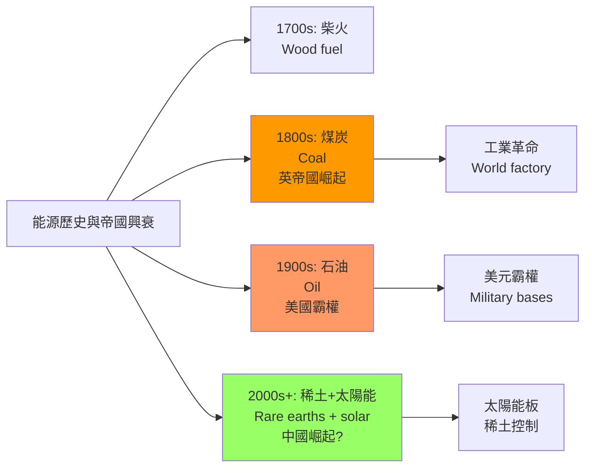
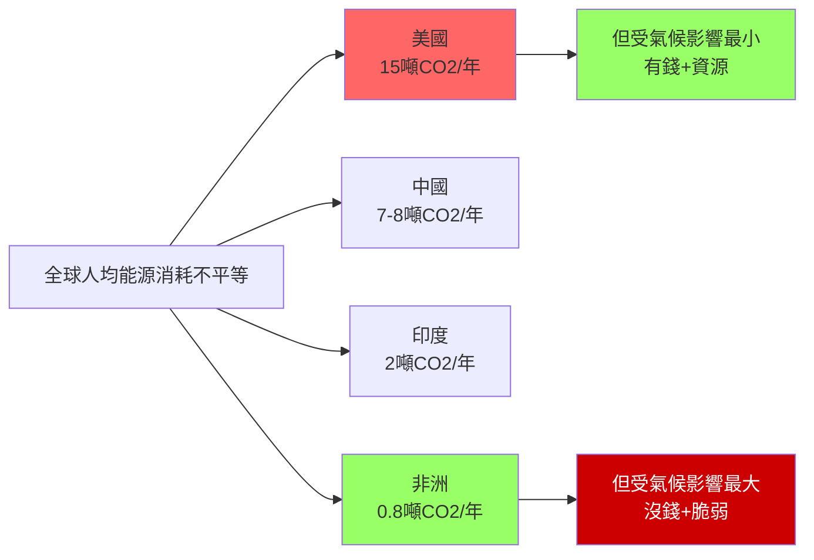
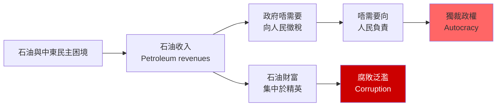
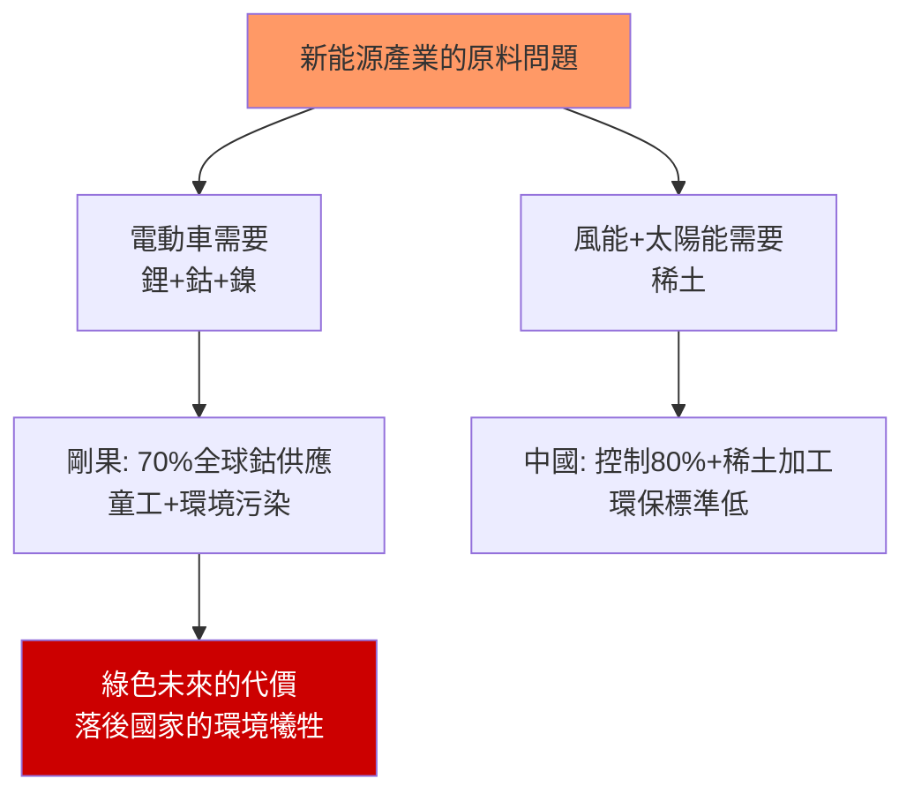
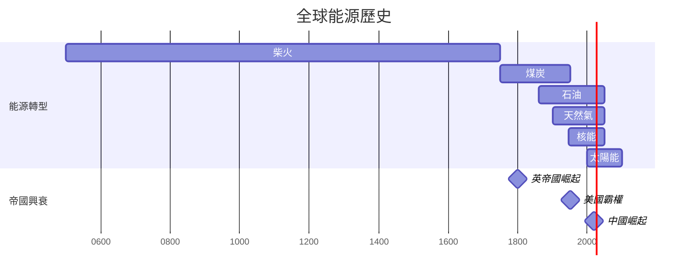
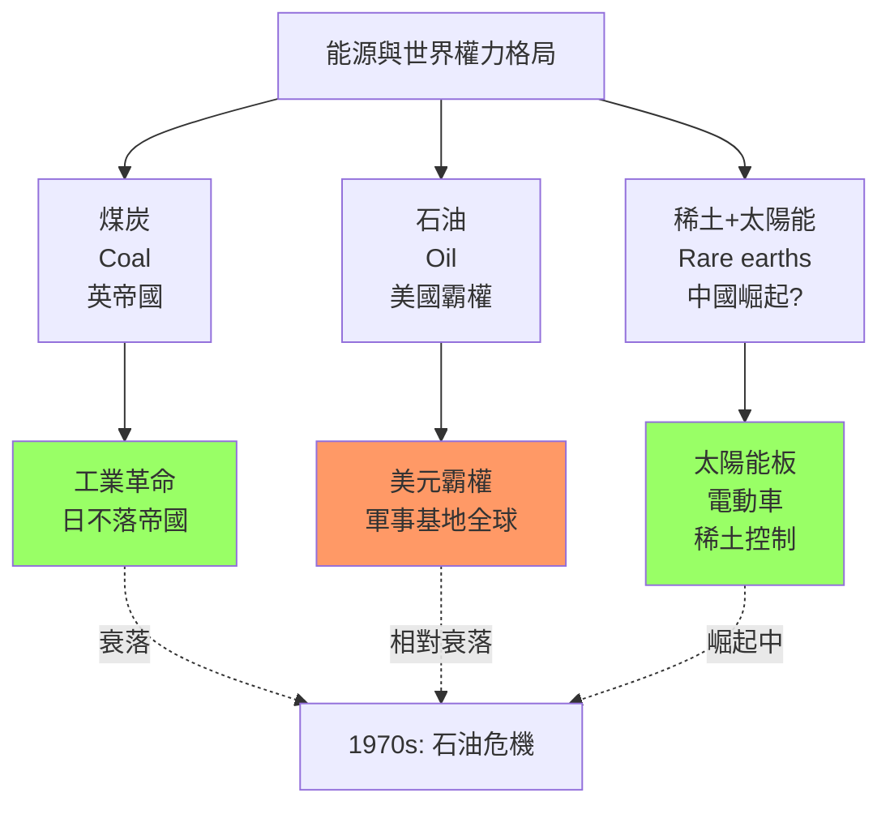
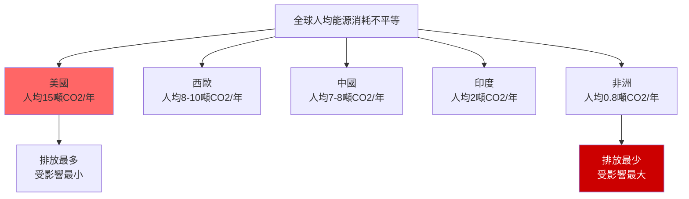
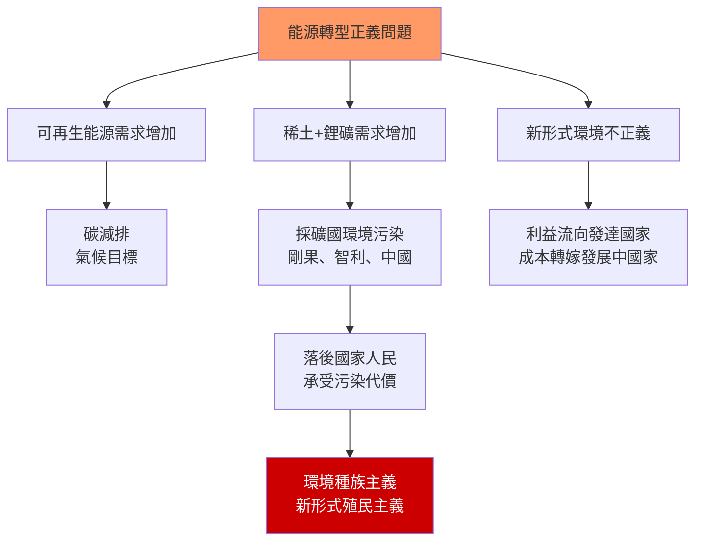

# HIST2193 — 能量與人類歷史 / A History of Energy and Humankind: From Deep History to the Present

/** HKU | 6 credits | Instructor: Oscar Sanchez-Sibony */

---

## 問題 1：5 個核心心智模型

### 1. 能源轉型——權力轉型的歷史（Energy Transitions as Power Transitions）
**定義**: 能源從來就不僅僅是「燃料」——它是權力的載體。每一種能源的主導地位，都對應著一種政治經濟秩序的興起和衰落。從柴火到煤炭、從煤炭到石油、從石油到可再生能源——每一次能源轉型，都伴隨著帝國興衰和權力重構。

**學者**:
- **Timothy Mitchell** — *Carbon Democracy: Political Power in the Age of Oil* (2011, 2013)
- **Andreas Malm** — *Fossil Capital: The Rise of Steam Power and the Roots of Global Warming* (2016)
- **Vaclav Smil** — *Energy and Civilization: A History* (2017); *Should We Eat Meat?* (2013)
- **Richard Rhodes** — *The Making of the Atomic Bomb* (1986)

**驗證**: 1750年代煤炭取代柴火——英國工廠主開始用機器取代工人，降低了工人的談判能力；1859年石油取代鯨油——標準石油托拉斯誕生，石油巨頭開始控制美國政治；1973年石油危機——OPEC展示能源作為政治武器的力量。

**歷史事件**:
- **1709年**: 焦炭冶煉法發明——英國工業革命的燃料基礎
- **1807年**: 第一艘蒸汽船——能源革命的先聲
- **1859年**: 德雷克油井——美國石油時代的開始
- **1973年10月**: OPEC石油禁運——油價飆升400%
- **2022年2月24日**: 俄烏戰爭——能源再次成為地緣政治武器

### 2. 「現代化」等於能源消耗增加（Modernization = Increasing Energy Consumption）
**定義**: 學者Vaclav Smil用數據證明：人類文明進步歷史就是能源消耗歷史——從每日人力2,000卡路里，到今日西方社會每日400,000卡路里。「現代化」的實質不是能源效率提升，而是能源消耗量的直線上升。

**學者**:
- **Vaclav Smil**（曼尼托巴大學）: 能源史研究的標杆學者
- **William Cronon** — *Nature's Metropolis: Chicago and the Great West* (1991)
- **Richard Florida** — research on energy and urbanization

**驗證數據**:
- 1800年：全球能源消耗以人力+動物+柴火為主
- 1900年：煤礦主導，石油開始崛起
- 1950年：石油取代煤，成為主導能源
- 2000年：石油+天然氣+煤炭三足鼎立
- 2020年：全球能源消耗80%仍是化石燃料

**歷史事件**:
- **1800年**: 全球能源消耗：人力+動物+柴火
- **1850年**: 煤炭佔全球能源消耗的50%以上
- **1950年**: 石油取代煤炭成為最主要能源
- **2015年**: 巴黎氣候協定——承諾控制升溫1.5°C
- **2023年**: 全球CO2排放420ppm——創歷史新高

### 3. 能源帝國主義——石油如何塑造中東命運（Energy Imperialism: How Oil Shaped the Middle East）
**定義**: 學者Timothy Mitchell研究：中東石油財富造成「資源詛咒」（resource curse）——石油財富令本地統治者不需要向人民徵稅，因此發展出「非稅收」政治體制，民主化失敗。同時，石油控制權成為外國干預中東的主要動機。

**學者**:
- **Timothy Mitchell**（哥倫比亞大學）: 石油政治研究
- **Robert Vitalis**（賓州大學）: 中東石油政治研究
- **Melanie Brands** — research on oil and authoritarianism
- **Matt Andrews** — research on resource curse

**驗證**: 1908年伊朗首次商業石油發現；1920年代石油公司「七姐妹」（Seven Sisters）控制了中東石油開採和定價權；1973年OPEC石油禁運展示石油政治武器力量；2003年美國入侵伊拉克——石油控制是戰爭動機之一。

**歷史事件**:
- **1908年5月26日**: 伊朗首次商業石油發現
- **1928年**: 「紅線協議」——七姐妹瓜分中東石油
- **1951年**: 伊朗石油國有化——摩薩台政府
- **1973年10月17日**: OPEC石油禁運
- **2003年3月20日**: 美國入侵伊拉克

### 4. 環境危機等於能源危機等於文明危機（Environmental Crisis = Energy Crisis = Civilization Crisis）
**定義**: 學者Naomi Klein和Jason W. Moore指出：氣候變化不是「環境問題」，而是資本主義制度問題。化石燃料公司為了利潤，長期否認氣候變化的科學證據並阻撓氣候立法。人類世（Anthropocene）的概念掩蓋了資本主義制度的責任。

**學者**:
- **Naomi Klein** — *This Changes Everything: Capitalism vs. the Climate* (2014)
- **Jason W. Moore** — *Capitalism in the Web of Life: Ecology and the Accumulation of Capital* (2015)
- **Andreas Malm** — *Fossil Capital* (2016)
- **Greta Thunberg** — 青年氣候運動象徵

**驗證**: 1850年全球CO2排放：280ppm；1950年：310ppm；2023年：420ppm。工業革命以來，人類燃燒了約1.5兆噸煤炭、約5,000億桶石油、約3兆立方米天然氣。

**歷史事件**:
- **1824年**: 傅立葉提出「溫室效應」概念
- **1958年**: 基林曲線——首次連續測量大氣CO2
- **1992年**: 聯合國氣候框架公約（UNFCCC）
- **2015年12月12日**: 巴黎氣候協定
- **2023年**: 全球平均氣溫比工業革命前高1.4°C

### 5. 能源轉型正義——從化石燃料到可再生能源的公正轉型（Just Energy Transition）
**定義**: 學者Giles研究：太陽能、風能項目往往在非洲、亞洲興建，但當地人民並未受益——這是「新形式能源帝國主義」。可再生能源需要稀土、鋰、鈷等礦物，這些礦物的開採往往造成環境污染和侵犯人權。

**學者**:
- **Giles** — *Green Colonialism* (2022)
- **Peter Dauvergne**（UBC）: 環保消費主義批判
- **Harri Englund** — research on resource extraction ethics

**驗證**: 2000年代中國成為全球最大太陽能板生產國；2015年非洲太陽能發電項目增加300%；2022年全球能源轉型投資超過1萬億美元；2023年電動車銷售超過1,000萬輛。

**歷史事件**:
- **2000年代**: 中國太陽能板製造業爆發式增長
- **2010年**: 德國決定全面退出核能
- **2015年**: 巴黎氣候協定——各國承諾減排
- **2021年11月**: COP26——格拉斯哥氣候協議
- **2023年**: 全球電動車銷量突破1,000萬輛

---

## 問題 2：3 個根本分歧

### 分歧 1：「現代化」到底等於能源效率提升還是能源消耗增加？
**A方（Smil等學者）**: 現代化等於能源消耗增加，能源效率提升只是因為技術進步，但總消耗量從未減少——人均能源消耗持續上升是現代化的鐵律。

**B方（主流經濟學）**: 現代化可以通過提高能源效率來實現可持續發展——技術進步可以讓我們用更少的能源做更多的事。

### 分歧 2：氣候危機到底是「人類世」還是「資本ocenes」？
**A方（地質學界）**: 人類活動造成地質層改變，這是客觀的地質事實——人類世的命名是科學共識。

**B方（批判政治經濟學）**: 人類世概念掩蓋了資本主義制度的責任——不是「人類」造成氣候危機，而是1%的資本家為了利潤燃燒化石燃料。

### 分歧 3：能源轉型到底是「綠色革命」還是「新能源帝國主義」？
**A方（綠色轉型支持者）**: 可再生能源轉型可以帶來能源民主化，擺脫化石燃料依賴，讓窮國也能獲得清潔能源。

**B方（批判論者）**: 能源轉型往往令非洲、南美成為稀土和鋰礦的原料供應地，而非受益者——所謂「綠色革命」只是將污染轉移到窮人。

---

## 問題 3：10 個深度問題

1. 如果能源消耗歷史就是文明進步歷史，點解能源消耗增加往往帶來環境危機？進步同破壞到底係一體兩面？

2. 點解OPEC石油禁運（1973）可以令美國經濟倒退，但今日美國頁岩油革命令美國成為石油出口國？能源權力格局到底點解變化？

3. 如果能源從來就係階級問題——工廠主用機器取代工人——咁今日AI自動化到底係另一種階級替代？

4. 中東石油到底係當地人民的福气定係詛咒？點解石油豐富國家往往經濟發展不平衡？

5. 如果石油煤炭造成氣候危機，咁點解全球能源消耗仍然80%化石燃料？道德責任到底點分配？

6. 中國成為全球最大太陽能板生產國——呢個到底係「中國環保奇蹟」定係另一種「能源帝國主義」？

7. 點解歷史上能源轉型（柴火→煤→石油→天然氣）從來都係漸進式，但今日氣候危機要求「快速轉型」？呢個要求到底係現實定係願望？

8. 如果能源從來就係帝國主義工具（英帝國控制煤炭，美國控制石油），咁新能源（鋰、鈷、稀土）到底係點解嘅新帝國主義形式？

9. 點解香港能源消耗咁高——但係香港能源幾乎完全依賴進口？呢個依賴性到底係經濟優選定係歷史依賴？

10. 如果歷史係預言——能源危機、氣候危機、戰爭——呢三個危機到底係偶然定係互為因果？

---

# 核心心智模型深化（中英對照）

## 1. 能源史是文明史

### 1.1 Bilingual 概念對照
| 英文 | 中文 | 歷史含義 |
|---|---|---|
| Energy transition | 能源轉型 | 從一種能源到另一種 |
| Energy geopolitics | 能源地緣政治 | 能源控制等於權力 |
| Carbon democracy | 碳民主 | 石油時代的政治形式 |
| Energy justice | 能源正義 | 誰有權使用能源 |

### 1.2 學者陣容
- **Vaclav Smil**（曼尼托巴大學）: 能源史研究全球標杆
- **Timothy Mitchell**（哥倫比亞大學）: 石油政治研究
- **Andreas Malm**（隆德大學）: 化石燃料批判研究

### 1.3 袁騰飛式犀利觀察
> Smil話：歷史書話你知邊個帝國擴張、邊個王朝更替。但係歷史書唔話你知，每一次帝國擴張背後，都有能源消耗量增加。石油就係現代帝國主義的血液。

英帝國控制煤炭，所以控制了19世紀的世界工廠；美國控制石油，所以控制了20世紀的世界秩序。

但係你要知道：呢種能源控制從來唔係免費的。英帝國為煤炭打仗，美國為石油打仗——能源戰爭打死的人，比宗教戰爭打死的人還要多。

### 1.4 Deep Q
**深度問題**: 如果能源控制是帝國主義的核心，那麼中國對新能源（太陽能板、電動車、稀土）的控制，是否預示著新的能源帝國主義的興起？

### 1.5 圖解


---

## 2. 能源階級問題

### 2.1 Bilingual 概念對照
| 英文 | 中文 | 歷史含義 |
|---|---|---|
| Energy consumption inequality | 能源消耗不平等 | 全球南北差距 |
| Carbon footprint | 碳足跡 | 個人/國家排放量 |
| Just transition | 公正轉型 | 綠色轉型的公平性 |
| Carbon colonialism | 碳殖民主義 | 污染轉移 |

### 2.2 學者陣容
- **Andreas Malm**（隆德大學）: 化石燃料與階級鬥爭研究
- **Naomi Klein**（獨立記者+學者）: 氣候變化政治經濟學

### 2.3 袁騰飛式犀利觀察
> 能源消耗從來就係階級問題：西方人均能源消耗係非洲人10倍。但係氣候危機就係所有人共同承受——呢個就係環境正義最深刻嘅矛盾。

美國人均每年排放約15噸CO2；印度人均約2噸；非洲人均約0.8噸。

但係邊個受氣候變化影響最大？唔係排放最多的發達國家，而係排放最少的發展中國家——佢哋沒有能力應對洪水、乾旱和颱風。

呢個就係環境種族主義的最赤裸表現：**有錢人排放，窮人承受。**

### 2.4 Deep Q
**深度問題**: 在全球氣候談判中，發達國家是否應該為歷史排放承担更多責任？「碳預算」概念如何在各國之間分配？

### 2.5 圖解


---

## 3. 能源帝國主義

### 3.1 Bilingual 概念對照
| 英文 | 中文 | 歷史含義 |
|---|---|---|
| Resource curse | 資源詛咒 | 石油財富阻碍民主化 |
| Seven Sisters | 七姐妹 | 1928年石油卡特尔 |
| OPEC | 石油輸出國組織 | 1960年成立 |
| Petrostate | 石油國家 | 依賴石油的獨裁政權 |

### 3.2 學者陣容
- **Robert Vitalis**（賓州大學）: 中東石油政治
- **Timothy Mitchell**（哥倫比亞大學）: 石油與民主研究

### 3.3 袁騰飛式犀利觀察
> 石油——西方話佢係「黑色黃金」。但係你知唔知，中東石油就係中東悲劇的根源：石油財富令獨裁者有錢，獨裁者有錢就唔需要向人民徵稅，唔徵稅就唔需要民主。

沙地阿拉伯、伊朗、伊拉克——呢啲石油豐富的國家，民主程度點解都咁低？

答案好簡單：**石油收入唔需要向納稅人交代。** 當政府唔需要向人民徵稅，政府就唔需要向人民負責。

所以你看，民主從來唔係一個文化問題——它係一個經濟問題。沒有納稅人，就沒有民主。

### 3.4 Deep Q
**深度問題**: 如果石油財富是民主化的障礙，那麼可再生能源的發展是否會促進中東民主化？「後石油時代」的中東會是什麼樣子？

### 3.5 圖解


---

## 4. 環境危機是文明危機

### 4.1 Bilingual 概念對照
| 英文 | 中文 | 歷史含義 |
|---|---|---|
| Anthropocene | 人類世 | 人類活動造成地質改變 |
| Carbon budget | 碳預算 | 剩餘排放配額 |
| 1.5°C target | 1.5°C目標 | 巴黎協定目標 |
| Tipping point | 臨界點 | 不可逆轉的氣候閾值 |

### 4.2 學者陣容
- **Jason W. Moore**（賓州大學）: 資本ocenes理論
- **Naomi Klein**（獨立學者）: 氣候正義運動

### 4.3 袁騰飛式犀利觀察
> 人類世——西方學者話呢個係地質新紀元。但係我話你知：人類世唔係人類造成嘅，而係資本主義造成嘅。

燒煤、工廠、化石燃料——呢啲唔係人類整體造成嘅，而係1%人口造成嘅。

全球最富有的10%人口，排放了約50%的全球CO2；最貧窮的50%人口，只排放了約13%的全球CO2。

所以當你聽到「人類活動造成氣候危機」時，你要記住：**這裡的「人類」唔包括你自己——它指的是那些燒掉全球80%化石燃料的1%人口。**

### 4.4 Deep Q
**深度問題**: 氣候變化的「臨界點」（tipping points）——當全球變暖超過某一閾值後，氣候系統會發生不可逆轉的變化。科學家已經識別了哪些臨界點？它們何時會被觸發？

### 4.5 圖解
```mermaid
gantt
    title 全球CO2排放歷史
    dateFormat YYYY
    axisFormat %Y
    
    section 排放量
    工業革命前 280ppm    :active1, 1800, 1800
    煤炭時代 1850-1950    :active2, 1850, 100年
    石油時代 1950-2023    :active3, 1950, 73年
    
    2023年: 420ppm    :milestone, 2023, 0年
    
    style active3 fill:#f66
```

---

## 5. 能源轉型正義

### 5.1 Bilingual 概念對照
| 英文 | 中文 | 歷史含義 |
|---|---|---|
| Green colonialism | 綠色殖民主義 | 環保項目剥削窮國 |
| Just transition | 公正轉型 | 考慮公平的轉型 |
| Rare earths | 稀土 | 風能+電動車的關鍵原料 |
| Lithium triangle | 鋰三角 | 智利+阿根廷+玻利維亞 |

### 5.2 學者陣容
- **Giles**（獨立學者）: 綠色殖民主義研究
- **Peter Dauvergne**（UBC）: 環保消費主義批判

### 5.3 袁騰飛式犀利觀察
> 能源轉型——西方話呢個係環保革命。但係你知唔知，太陽能板需要稀土，稀土需要採礦，採礦往往喺非洲？所謂「綠色革命」，有時只不過係將污染轉移到窮人。

剛果的鈷礦——你知道嗎？世界上約70%的鈷來自剛果民主共和國，而鈷是電動車電池的關鍵原料。剛果的童工在危險的礦井中工作，每天掙幾美元——這就是「綠色未來」的代價。

所以你看，「環保」從來就唔係一個道德問題——它係一個階級問題和帝國主義問題。

### 5.4 Deep Q
**深度問題**: 「能源轉型正義」運動在全球南方國家的發展情況如何？這些國家的普通人如何參與或抵抗這種新形式的能源帝國主義？

### 5.5 圖解


---

## 深度自測問題詳解

**Q1**: 進步vs破壞——歷史上的能源轉型（柴火→煤→石油）從來都係漸進式的，每次轉型都需要幾十年到上百年的時間。但係今天科學家告訴我們，如果要在2100年前控制全球變暖在1.5°C以內，我們需要在2050年前實現碳中和——呢個「快速轉型」的要求在歷史上從來沒有先例。

**Q2**: OPEC危機vs頁岩油革命——1973年石油禁運期間，美國經濟嚴重衰退，失業率上升。但係2020年代，美國因為頁岩油技術革命，已經成為石油淨出口國。呢個轉變預示著能源權力格局的根本重構。

**Q3**: 能源階級vs AI自動化——歷史上，工廠主用機器取代工人，是因為工人組織起來要求更高工資。今天的AI自動化浪潮，面臨著同樣的邏輯：用AI取代白領工作（會計、法律、醫療診斷等）。這將如何影響未來的階級結構？

**Q4**: 中東資源詛咒——沙地阿拉伯的人均GDP很高，但民主程度很低；挪威的人均GDP也很高，民主程度也很高。差異在於：挪威的石油收入通過社會福利制度惠及全民，而沙地阿拉伯的石油收入主要流向王室和精英。

**Q5**: 道德責任分配——歷史排放責任：從工業革命到1950年，美國和歐洲排放了全球約80%的CO2；從1950年到2020年，美國和中國合計排放了全球約50%的CO2。發展中國家是否有權利要求發達國家承担歷史責任？

**Q6**: 中國太陽能霸權——中國控制著全球約80%的太陽能板製造能力。呢個「綠色霸權」與歷史上石油霸權有什麼本質差異？中國的太陽能板出口到歐洲，幫助歐洲實現減排目標——這算不算一種新的能源帝國主義？

**Q7**: 快速轉型的可行性——1970年代石油危機後，美國花了約10年時間才降低石油依賴（通過提高汽車能效、開發替代能源）。但係今天的脫碳轉型需要在30年內完成，而能源消耗總量比1970年代增加了約3倍。

**Q8**: 新能源帝國主義——電動車需要鋰（主要來自智利、阿根廷、玻利維亞的「鋰三角」）、鈷（主要來自剛果）、稀土（主要在中國加工）。呢啲礦物的開採和加工，往往造成嚴重的環境污染和人權侵犯。

**Q9**: 香港能源依賴——香港幾乎100%的能源依賴進口（石油、天然氣、煤炭全部進口）。呢個高度依賴性使香港極度容易受到國際能源價格波動的影響。2019年反修例運動期間，燃料價格波動直接影響了交通和物流成本。

**Q10**: 三大危機的聯繫——能源危機（OPEC石油禁運）、氣候危機（CO2排放）和戰爭（伊拉克戰爭）並非偶然——它們共享同一個結構性原因：化石燃料作為帝國主義工具的歷史。解决其中任何一個危機，都需要面對這個結構性問題。

---

## 5 個 Mermaid 圖解

### 圖解 1：全球能源歷史時間線


### 圖解 2：能源與權力


### 圖解 3：CO2排放歷史
```mermaid
gantt
    title 全球CO2排放歷史
    dateFormat YYYY
    axisFormat %Y
    
    section 排放量
    工業革命前    :active1, 1800, 1850
    煤炭時代    :active2, 1850, 1950
    石油時代    :active3, 1950, 2023
    
    section 排放量
    280ppm    :milestone, 1850, 0
    310ppm    :milestone, 1950, 0
    420ppm    :milestone, 2023, 0
    
    style active3 fill:#f66
```

### 圖解 4：能源階級不平等


### 圖解 5：能源轉型正義問題


---

# 總結

1. **能源從來就是權力問題**：從煤炭時代的英帝國到石油時代的美帝國，再到稀土時代的中國控制，每一次能源轉型都伴隨著帝國興衰和權力重構——了解能源史，就是了解權力史。

2. **「現代化」的實質是能源消耗增加**：Vaclav Smil的數據告訴我們：人類文明進步歷史就是能源消耗增加的歷史——這個「進步」是有代價的，而這個代價往往由窮人和落後國家承擔。

3. **環境危機是階級危機和帝國主義危機**：氣候變化不是「人類」造成的，而是1%的資本家為了利潤燃燒化石燃料造成的——環境正義和階級正義是同一場鬥爭的兩面。

4. **「綠色革命」可能成為新形式能源帝國主義**：可再生能源需要的稀土、鋰、鈷等礦物，往往在非洲和南美開採，這些礦物的開採往往造成環境污染和人權侵犯——公正的能源轉型必須考慮原料來源的公正性。

5. **香港能源依賴揭示了全球能源權力結構**：香港幾乎完全依賴進口能源，這種依賴性使香港極度容易受到國際能源價格波動和地緣政治衝突的影響——理解能源史，就是理解香港在全球體系中的位置。

**自學建議**: 配合 Vaclav Smil 的 *Energy and Civilization* + Timothy Mitchell 的 *Carbon Democracy* + Naomi Klein 的 *This Changes Everything*，輸出讀書筆記到 `06_Reading_Notes/`。
