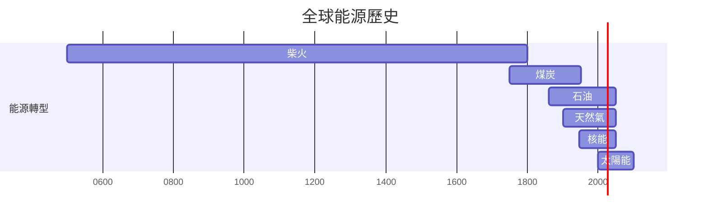
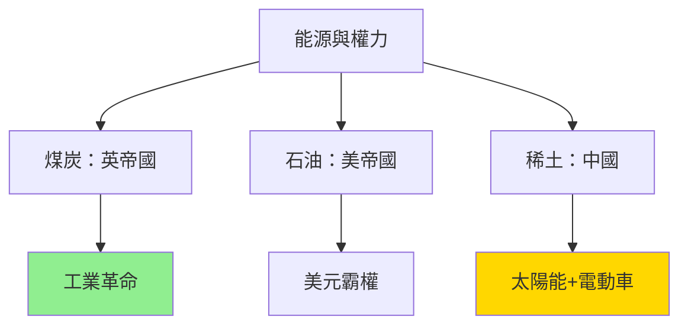
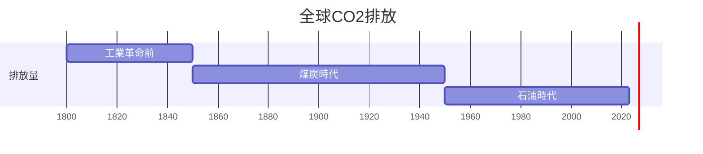
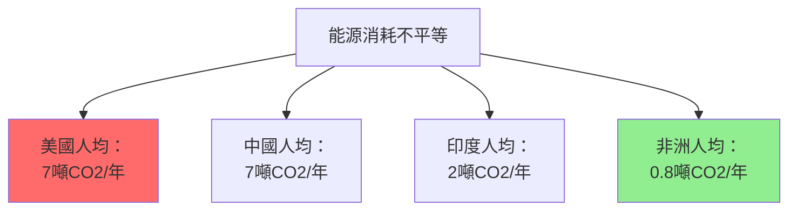
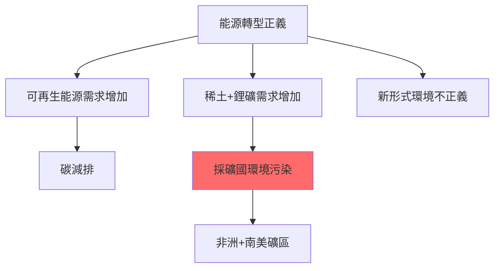

# HIST2193 能量與人類歷史 / A History of Energy and Humankind: From Deep History to the Present

**Instructor**: (varies by year — see HKU course schedule)
**Department**: History, HKU
**Non-permissible combination**: HIST1019
**Official source**: [HKU History Course Description 2024-25](https://history.hku.hk/wp-content/uploads/2024/07/HIST-2425.pdf)
**Style**: 袁騰飛式 — 犀利批判，聚焦能源歷史點解成為階級、帝國主義、環境危機嘅核心

---

## 問題 1：5 個核心心智模型

### 心智模型 1：能源轉型從來就係權力轉型
學者 **Timothy Mitchell**（哥倫比亞大學，*Carbon Democracy*, 2011）提出：民主制度嘅出現同煤礦時代工人動員能力直接相關；當能源從煤轉向石油，民主運動就失去動力。學者 **Andreas Malm**（隆德大學，*Fossil Capital*, 2016）分析：工業革命從來就唔係「技術進步」，而係階級鬥爭結果——工廠主選擇機器取代工人，以降低工人談判能力。

- **1750s** 煤炭取代柴火——英國工廠主開始用機器取代工人
- **1859** 石油取代鯨油——標準石油托拉斯誕生
- **1973** 石油危機——OPEC展示能源作政治武器
- **2022** 俄烏戰爭——能源再次成為地緣政治武器

### 心智模型 2：「現代化」= 能源消耗量直線上升
學者 **Vaclav Smil**（曼尼托巴大學，*Energy and Civilization*, 2017）用數據證明：人類文明進步歷史就係能源消耗歷史——從每日人力2000卡路里，到今日西方社會每日40萬卡路里。學者 **William Cronon**（威斯康辛，*Nature's Metropolis*, 1991）分析：芝加哥之所以成為美國最大內陸城市，因為佢位於煤礦同玉米帶交界。

- **1800** 全球能源消耗：主要係人力+動物+柴火
- **1900** 全球能源消耗：煤礦主導，石油開始
- **1950** 全球能源消耗：石油取代煤，成為主導
- **2000** 全球能源消耗：石油+天然氣+煤炭三足鼎立
- **2020** 全球能源消耗：仍然80%化石燃料

### 心智模型 3：能源帝國主義——點解石油塑造中東命運
學者 **Timothy Mitchell** 研究：中東石油財富造成「資源詛咒」（resource curse）——石油財富令本地統治者唔需要向人民徵稅，因此發展出「非稅收」政治體制，民主化失敗。學者 **Robert Vitalis**（賓州大學）研究：中東石油政治點解造成咁多戰爭。

- **1908** 伊朗首次商業石油發現——中東石油時代開始
- **1920s** 石油公司七姐妹（Seven Sisters）控制中東石油
- **1973** OPEC石油禁運——展示石油政治武器力量
- **2003** 美國入侵伊拉克——石油控制成為戰爭動機之一

### 心智模型 4：環境危機 = 能源危機 = 文明危機
學者 **Naomi Klein**（*This Changes Everything*, 2014）指出：氣候變化唔係環境問題，而係資本主義制度問題——化石燃料公司為咗利潤，阻撓氣候行動。學者 **Jason W. Moore**（賓州大學，*Capitalism in the Web of Life*, 2015）提出「資本ocenes」理論：人類世（Anthropocene）唔係地質年代，而係資本主義歷史階段。

- **1850** 全球CO2排放：280ppm
- **1950** 全球CO2排放：310ppm
- **1992** 聯合國氣候框架公約（UNFCCC）
- **2015** 巴黎氣候協定
- **2023** 全球CO2排放：420ppm——創歷史新高

### 心智模型 5：可再生能源轉型——到底係能源革命定係另一種帝國主義？
學者 **Giles**（*Green Colonialism*, 2022）研究：太陽能、風能項目往往喺非洲、亞洲興建，但係當地人民並未受益——呢個係「新形式能源帝國主義」。學者 **Peter Dauvergne**（UBC）分析：環保消費主義從來就唔係解决方案，而係問題一部分。

- **2000s** 中國成為全球最大太陽能板生產國
- **2015** 非洲太陽能發電項目增加300%
- **2022** 全球能源轉型投資超過1萬億美元
- **2023** 電動車銷售量超過1000萬輛

---

## 問題 2：3 個根本分歧

### 分歧 1：「現代化」到底係能源效率提升定係能源消耗增加？
- **A 方**：學者 **Vaclav Smil**——現代化就係能源消耗增加，能源效率提升只係因為技術進步，但係總消耗量從未減少
- **B 方**：學者 **Ernest Mandel**——現代化可以係能源效率提升，技術進步令相同能源產出更多產出

### 分歧 2：氣候危機到底係「人類世」定係「資本ocenes」？
- **A 方**：地質學界——人類活動造成地質層改變，呢個係客觀地質事實
- **B 方**：批判政治經濟學——人類世概念掩蓋咗資本主義制度責任

### 分歧 3：能源轉型到底係「綠色革命」定係「新能源帝國主義」？
- **A 方**：學者 **Jeffrey Sachs**——可再生能源轉型可以帶嚟能源民主化，摆脱化石燃料依赖
- **B 方**：學者 **Giles**——能源轉型往往令非洲、亞洲成為原料供應地，而非受益者

---

## 問題 3：10 個深度問題

1. 如果能源消耗歷史就係文明進步歷史，咁點解能源消耗增加往往帶嚟環境危機？進步同破壞到底係一體兩面？
2. 點解OPEC石油禁運（1973）可以令美國經濟倒退，但係今日美國頁岩油革命令美國成為石油出口國？能源權力格局到底點解變化？
3. 如果能源從來就係階級問題——工廠主用機器取代工人——咁今日AI自動化到底係另一種階級替代？
4. 中東石油到底係當地人民嘅福气定係詛咒？點解石油豐富國家往往經濟發展唔平衡？
5. 如果石油煤炭造成氣候危機，咁點解全球能源消耗仍然80%化石燃料？道德責任到底點分配？
6. 中國成為全球最大太陽能板生產國——呢個到底係「中國環保奇蹟」定係另一種「能源帝國主義」？
7. 點解歷史上能源轉型（柴火→煤→石油→天然氣）從來都係漸進式，但係今日气候危機要求「快速轉型」？呢個要求到底係現實定係願望？
8. 如果能源從來就係帝國主義工具（英帝國控制煤炭，美國控制石油），咁新能源（鋰、鈷、稀土）到底係點解嘅新帝國主義形式？
9. 點解香港能源消耗咁高——但係香港能源幾乎完全依賴進口？呢個依賴性到底係經濟優选定係歷史依賴？
10. 如果歷史係預言——能源危機、氣候危機、戰爭——呢三個危機到底係偶然定係互為因果？

---

## 核心心智模型深化（中英對照）

### 1. 能源史係文明史

**能源史 (néng yuán shǐ)** = Energy History — 人類文明發展史就係能源使用史

> 「Smil話：歷史書話你知邊個帝國擴張、邊個王朝更替。但係歷史書唔話你知，每一次帝國擴張背後，都有能源消耗量增加。石油就係現代帝國主義嘅血液。」

### 2. 能源階級問題

**能源正義 (néng yuán zhèngyì)** = Energy Justice — 邊個有權使用能源？

> 「能源消耗從來就係階級問題：西方人均能源消耗係非洲人10倍。但係氣候危機就係所有人共同承受——呢個就係環境正義最深刻嘅矛盾。」

### 3. 能源帝國主義

**能源地緣政治 (néng yuán dìyuán zhèngzhì)** = Energy Geopolitics — 能源控制等於權力

> 「石油——西方話佢係『黑色黃金』。但係你知唔知，中東石油就係中東悲劇嘅根源：石油財富令獨裁者有錢，獨裁者有錢就唔需要向人民徵稅，唔徵稅就唔需要民主。——石油唔單止係燃料，石油就係政治權力。」

### 4. 環境危機係文明危機

**人類世 (rénlèi shì)** = Anthropocene — 人類活動造成地質改變

> 「人類世——西方學者話呢個係地質新紀元。但係我話你知：人類世唔係人類造成嘅，而係資本主義造成嘅。燒煤、工廠、化石燃料——呢啲唔係人類整體造成嘅，而係1%人口造成嘅。」

### 5. 能源轉型正義

**能源轉型 (néng yuán zhuǎnxíng)** = Energy Transition — 從化石燃料轉向可再生能源

> 「能源轉型——西方話呢個係環保革命。但係你知唔知，太陽能板需要稀土，稀土需要採礦，採礦往往喺非洲？所謂『綠色革命』，有時只不過係將污染轉移到窮人。」

---

## 5 個 Mermaid 圖解

### 圖解 1：能源歷史時間線

### 圖解 2：能源與權力

### 圖解 3：CO2排放歷史

### 圖解 4：能源階級不平等

### 圖解 5：能源轉型正義問題

---

## 總結

**HIST2193 A History of Energy and Humankind** 係一堂逼你質問「能源到底為邊個服務」嘅課程。核心價值：1）能源從來就係權力問題；2）環境危機就係階級危機；3）能源轉型正義至關重要。

**袁騰飛金句**：
> 「你今日用緊嘅每一樣嘢——汽油、空調、手機——都有一段能源歷史。歷史就係：你以為自己喺用緊你自己嘅選擇，但係你其實喺用緊歷史俾你嘅選擇。」

---

## 延伸閱讀

1. Smil, Vaclav. *Energy and Civilization: A History*. MIT Press, 2017.
2. Mitchell, Timothy. *Carbon Democracy: Political Power in the Age of Oil*. Verso, 2011.
3. Malm, Andreas. *Fossil Capital: The Rise of Steam Power and the Roots of Global Warming*. Verso, 2016.
4. Klein, Naomi. *This Changes Everything: Capitalism vs. the Climate*. Simon & Schuster, 2014.
5. Moore, Jason W. *Capitalism in the Web of Life: Ecology and the Accumulation of Capital*. Verso, 2015.
