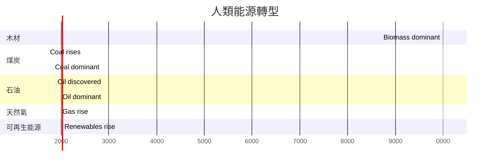
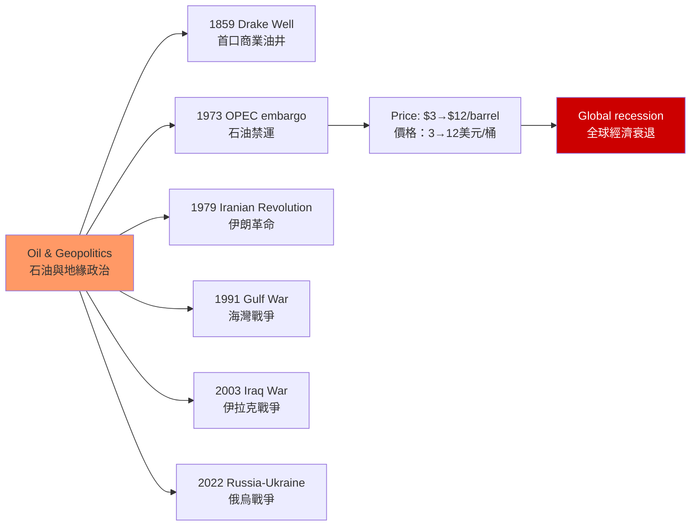
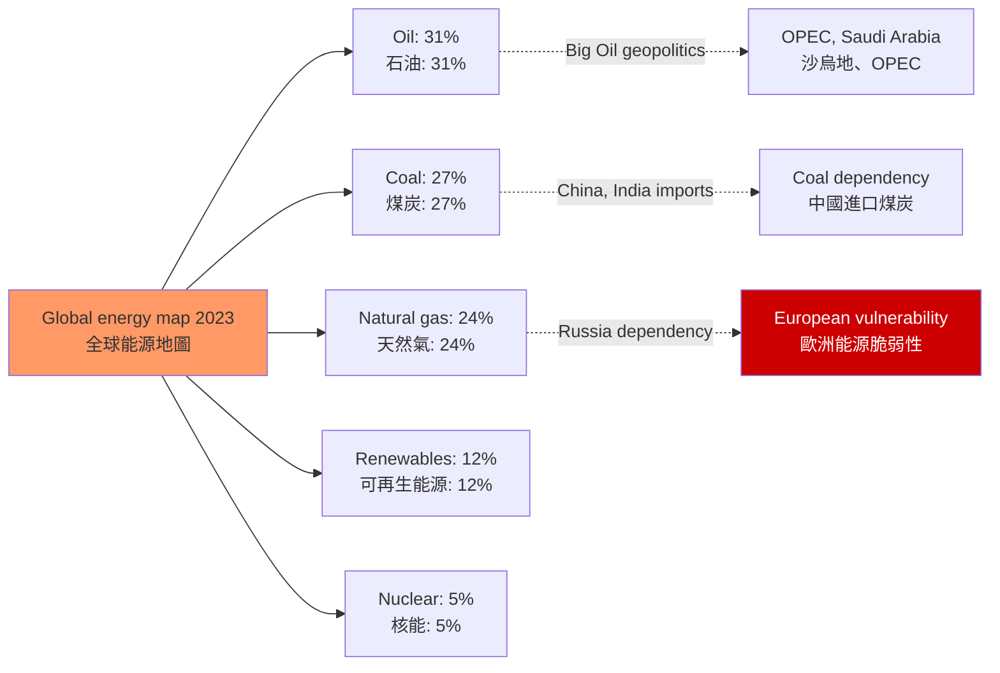

# HIST2193 能源史 / History of Energy

**Instructor**: HKU History Staff
**Department**: History, HKU
**Official source**: [HKU History Course Description](https://history.hku.hk/ug_cd/)
**Style**: 袁騰飛式 — 犀利、聚焦能源與權力的歷史——誰控制了能源，誰就控制了世界

---

## 問題 1：5 個核心心智模型

### 1. 能源轉型（Energy Transitions）
人類歷史上的能源轉型：木材 → 煤炭 → 石油 → 天然氣 → 可再生能源。學者 **Vaclav Smil** 在 *Energy Transitions: History, Requirements, Prospects* (2017) 中論證：每次能源轉型都需要數十年的基礎設施建設，「能源轉型」從來不是一夜之間可以完成的。

- **典型學者**: **Vaclav Smil** — *Energy Transitions* (2017); **Roger Fouquet** — research on energy history
- **驗證案例**: 石油從發現到成為主導能源用了約 60 年（1859 年首口商業油井到 1920 年超過煤炭）；當前太陽能和風能的普及速度約為石油的兩倍

### 2. 石油與地緣政治（Oil and Geopolitics）
石油是 20 世紀帝國主義的核心商品。學者 **Daniel Yergin** 在 *The Prize* (1990) 中揭示：石油與戰爭、革命和政治陰謀緊密交織。

- **典型學者**: **Daniel Yergin** — *The Prize* (1990); **Michael Levi** — research on energy security
- **驗證案例**: 1973 年石油禁運（OPEC）：石油價格從每桶 3 美元暴漲至 12 美元，引發全球經濟衰退

### 3. 煤炭與工業革命（Coal and Industrial Revolution）
煤炭是工業革命的燃料基礎。學者 **Neil Wrigley** 和 **E.A. Wrigley** 研究：英格蘭煤礦的地理分布決定了工業革命在英國而非中國發生的地理條件。

### 4. 能源與帝國主義（Energy and Imperialism）
學者 **Timothy Mitchell** 在 *Carbon Democracy* (2011) 中論證：石油不僅是燃料，更是政治權力的來源——控制了石油供應，就控制了現代經濟的命脈。

### 5. 當代能源轉型——可持續能源的挑戰
學者 **Ruth Blakeley** 和 **Vaclav Smil** 研究：當前的能源轉型（從化石燃料到可再生能源）面臨的挑戰不僅是技術問題，更是政治經濟和國際關係問題。

---

## 問題 2：3 個根本分歧

### 分歧 1：能源轉型——市場力量 vs 政治意志？
### 分歧 2：石油——歷史的祝福 vs 歷史的詛咒？
### 分歧 3：中國能源——合作 vs 競爭？

---

## 問題 3：10 個深度問題

1. **煤炭與工業革命**：為什麼工業革命發生在英國而非中國？Kenneth Pomeranz 的「煤炭分布」論點是否充分？
2. **1973 年石油危機**：OPEC 的石油禁運如何暴露了西方經濟對中東石油的結構性依賴？這次危機對全球政治格局有什麼長遠影響？
3. **頁岩氣革命**：美國的水力壓裂（fracking）技術如何改變了全球能源格局？美國從最大的石油進口國變成石油和天然氣出口國，這種轉變對國際關係有什麼影響？
4. **2022 年俄烏戰爭與歐洲能源危機**：德國對俄羅斯天然氣的依賴（2021 年：55% 的天然氣來自俄羅斯）如何成為了戰爭的軟肋？歐洲的能源轉型加速（可再生能源投資激增）是否是这场危機的「意外收益」？
5. **中國的能源安全戰略**：中國如何在中美貿易戰背景下保障能源安全？中俄天然氣管道建設（Power of Siberia，2019 年通氣）與俄烏戰爭後的中俄能源合作升級說明了什麼？
6. **石油美元（Petrodollar）**：1974 年美國與沙特的「石油換安全」協議如何奠定了石油美元體系？這個體系的穩定性在 2020 年代受到什麼挑戰？
7. **能源貧困**：全球仍有約 7.75 億人（2021 年）缺乏電力供應——這些人口主要集中在撒哈拉以南非洲和南亞。能源貧困與經濟發展、氣候正義之間的關係是什麼？
8. **電動汽車與鋰資源**：電動汽車的普及對石油需求的影響，與對鋰、鈷等關鍵礦產資源需求的影響——這種新的「資源競賽」會帶來什麼樣的地緣政治風險？
9. **核能與能源安全**：在碳減排壓力下，核能作為「低碳能源」的角色重新受到關注——但核事故（切爾諾貝利 1986， Fukushima 2011）的安全風險如何影響了公眾對核能的支持？
10. **能源史與帝國主義**：控制了石油就控制了帝國——這句話在 20 世紀的能源史中如何得到驗證？美國在 1973 年石油危機後建立「戰略石油儲備」（Strategic Petroleum Reserve）的政策決定，如何體現了這種認識？

---

# 核心心智模型深化（中英對照）

## 1. 能源轉型

### 1.1 圖解：人類能源使用的歷史轉型

---

## 2. 石油與地緣政治

### 2.1 圖解：石油與重大歷史事件

---

## 3. 當代能源轉型

### 3.1 圖解：當代能源地圖

---

# 總結

1. **能源轉型不是技術問題，是權力問題**：誰控制了新的能源技術和資源，誰就將在下一個時代擁有權力——這與煤炭時代的英國和石油時代的美國沒有區別。

2. **1973 年石油危機是現代能源地緣政治的誕生日**：OPEC 的禁運讓西方世界第一次意識到，石油不僅是商品，更是政治武器。

3. **當前的能源轉型正面臨多重張力**：碳減排的緊迫性 vs 能源安全的必要性 vs 經濟發展的需要——這三個目標之間存在根本的緊張關係。

4. **中國的能源轉型是全球能源史的最重要變量之一**：作為世界上最大的能源消費國和最大的可再生能源投資國，中国的選擇將決定全球能源轉型的速度和方向。

5. **能源史研究的是人類如何把地球的能量轉化為權力**：這段歷史告訴我們：能源從來不是中性的——它與帝國主義、階級剝削、環境破壞緊密交織。

**自學建議**: 配合 Vaclav Smil 的 *Energy Transitions* + Daniel Yergin 的 *The Prize*，輸出讀書筆記到 `06_Reading_Notes/`。
