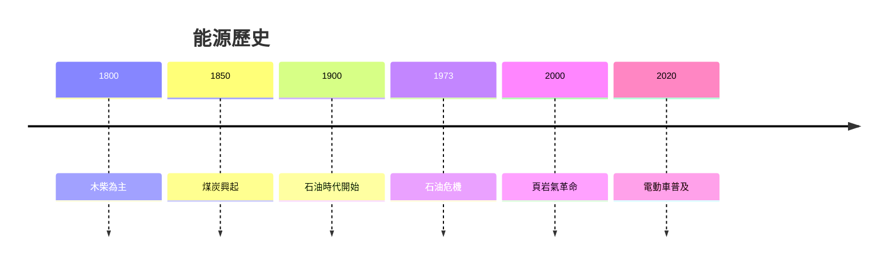
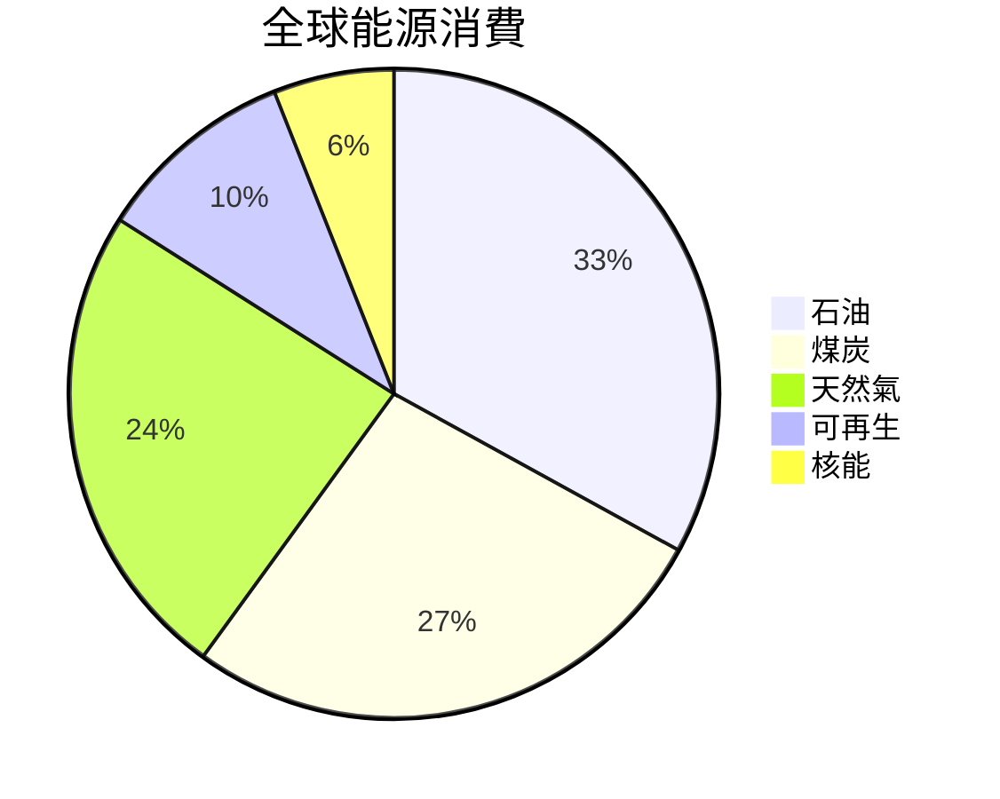
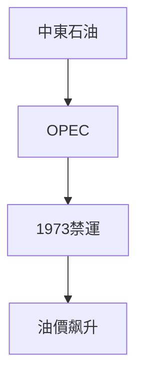
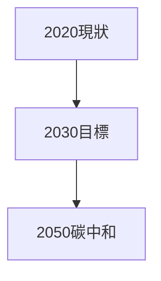

# HIST2193 能源史 / A History of Energy and Humankind: From Deep History to the Present (6 credits)

**Instructor**: Oscar Sanchez-Sibony
**Department**: History, HKU  
**Official source**: [HKU History Course Description 2024-25](https://history.hku.hk/wp-content/uploads/2024/07/HIST-2425.pdf)
**Style**: 袁騰飛式 — 犀利、聚焦能源點解塑造歷史

---

## 問題 1：這個領域所有專家共享的 5 個核心心智模型

### 心智模型 1：能源轉型與文明進步
學者 **Vaclav Smil** (*Energy and Civilization*, 2017) 研究：人類文明史就係能源使用進化史——從肌肉到化石燃料。

學者 **Daniel Yergin** (*The Prize*, 1991) 分析：石油如何塑造 20 世紀地緣政治。

- 木柴 → 煤炭 → 石油 → 天然氣 → 可再生能源
- 每次轉型都重構社會

### 心智模型 2：化石燃料與帝國主義
學者 **Timothy Mitchell** (*Carbon Democracy*, 2011) 研究：石油政治——化石燃料如何塑造民主與獨裁。

學者 **Ian Morris** (*Foragers, Farmers, and Fossil Fuels*, 2015) 分析：能源獲取方式決定社會複雜程度。

### 心智模型 3：能源安全與國家權力
學者 **Peter Victor** 研究：能源安全等於國家安全——呢個係 20 世紀战爭核心邏輯。

學者 **Alessandro Monge** 分析：中東石油點解成為戰爭目標。

### 心智模型 4：環境危機與能源轉型
學者 **Naomi Klein** (*This Changes Everything*, 2014) 研究：氣候危機要求能源轉型——但系統阻力巨大。

學者 **Jason Ford** 分析：可再生能源技術發展史。

### 心智模型 5：能源正義問題
學者 **Dipesh Chakrabarty** 研究：氣候正義——發達國家歷史排放造成環境負擔。

學者 **Harriet Evans** 分析：中國能源政策與環境危機。

---

## 問題 2：3 個根本分歧

### 分歧 1：核能——清潔未來定危險遺產？
- **A 方**：清潔未來
  - 低碳電力
- **B 方**：危險遺產
  - 核廢料、核事故

### 分歧 2：石油峰值——點解石油唔會用盡？
- **A 方**：技術進步
  - 新技術擴展儲量
- **B 方**：經濟因素
  - 價格決定經濟可用性

### 分歧 3：氣候行動——道德責任定經濟利益？
- **A 方**：道德責任
  - 歷史排放者負責
- **B 方**：經濟利益
  - 發展中國家需要發展空間

---

## 問題 3：10 個深度問題

1. 如果工業革命冇發生，會有環境危機嗎？
2. 點解石油塑造中東命運？
3. 如果你去 1900 年，你會點估計能源未來？
4. 點解中國成為最大能源消費國？
5. 如果你是政策制定者，點樣平衡經濟發展同環境保護？
6. 點解核能爭議咁大？
7. 如果你去 1973 年做石油危機田野，你會發現乜嘢？
8. 能源正義——邊個應該負責？
9. 點解 Tesla 等電動車改變能源版圖？
10. 如果你去 2050 年，能源系統會係點？

---

## 核心心智模型深化

### 1. 能源歷史時間線

---

## 5 個 Mermaid 圖解

### 📊 Diagram 1: 全球能源消費

### 📊 Diagram 2: 能源轉型

### 📊 Diagram 3: 石油政治

### 📊 Diagram 4: 氣候危機

### 📊 Diagram 5: 能源未來

---

## 總結

1. 能源使用塑造文明形態
2. 每次能源轉型重構社會
3. 化石燃料政治塑造地緣政治
4. 環境危機要求根本轉型
5. 能源正義係全球挑戰

**最後問題**: 人類可以及時轉型能源系統嗎？

---
**版權所有 © HKU History Self-Study**
