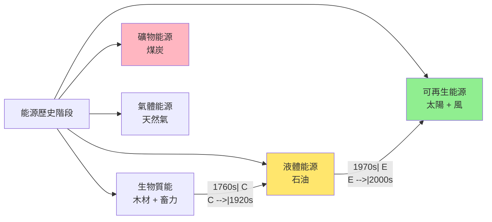

# HIST2193 能源與人類史 / A History of Energy and Humankind: From Deep History to the Present

**Instructor**: Oscar Sanchez-Sibony
**Department**: History, HKU
**Official source**: [HKU History Course Description 2024-25](https://history.hku.hk/wp-content/uploads/2024/07/HIST-2425.pdf)
**Style**: 袁騰飛式 — 犀利揭穿：能源歷史就係人類文明史——邊個控制能源，邊個就控制世界

---

## 問題 1：5 個核心心智模型

### 心智模型 1：「能源轉型」——歷史從燒柴到燒油到用太陽能
學者 **Vaclav Smil**（*Energy and Civilization*, 2017）系統分析人類文明同能源使用之間嘅互動：從木材到煤炭到石油到可再生能源，每次能源轉型都造成社會結構根本改變。

- **1700s 以前**：人力、畜力、風力、水力——95% 人從事農業
- **1760s 煤炭**：英國工業革命——煤炭驅動蒸氣機
- **1920s 石油**：內燃機革命——石油取代煤炭
- **2000s 可再生能源**：太陽能、風能興起

### 心智模型 2：「石油政治」——點解中東變成世界火藥桶？
學者 **Daniel Yergin**（*The Prize*, 1990）分析石油點解成為 20 世紀最重要嘅戰略物資。

- **1973 石油危機**：OPEC 阿拉伯國家對西方國家實施石油禁運，油價升 4 倍
- **1990-91 海灣戰爭**：伊拉克入侵科威特，美國軍事干預
- **2022 俄烏戰爭**：歐洲能源危機，俄羅斯天然氣斷供

### 心智模型 3：「能源帝國主義」——點解能源資源豐富嘅國家往往落後？
學者 **Paul Collier**（*The Bottom Billion*, 2007）提出「資源詛咒」（resource curse）概念：石油財富往往令政府腐敗、經濟單一化、民主倒退。

- **尼日利亞**：石油出口但係 60% 人口每日收入低於 1 美元
- **委內瑞拉**：石油儲備世界最大，但係經濟崩潰
- **沙特阿拉伯**：石油財富令王室權力穩固，但係經濟高度依賴石油

### 心智模型 4：「能源不平等」——點解窮國用能源少、富國用能源多？
學者 **Vaclav Smil** 數據顯示：2023 年美國人均能源消耗係印度 10 倍、中國 4 倍。

### 心智模型 5：「碳足跡與氣候正義」——歷史排放責任點樣分配？
學者 **Dipesh Chakrabarty**（*The Climate of History*, 2009）指出：氣候危機揭示人類共同命運，但係歷史排放責任點樣分配係道德難題。

---

## 問題 2：3 個根本分歧

### 分歧 1：能源轉型——市場驅動定係政府補貼？
- **A 方（市場派）**：技術進步自然推動轉型
- **B 方（干預派）**：政府補貼係關鍵（德國太陽能、中國電動車補貼）

### 分歧 2：石油財富——係祝福定係詛咒？
- **A 方（祝福派）**：石油財富可以為人民帶嚟繁榮
- **B 方（詛咒派）**：**Paul Collier**——石油導致腐敗、衝突、「資源詛咒」

### 分歧 3：氣候責任——歷史排放點樣分配正義？
- **A 方（歷史責任派）**：西方國家歷史排放最多，責任最大
- **B 方（發展權派）**：發展中國家有權發展，排放權應該平等

---

## 問題 3：10 個深度問題

1. 點解工業革命首先喺英國發生？英國有煤礦——但係荷蘭都有煤礦，但係點解荷蘭未能工業化？真正關鍵差異係乜嘢？
2. 石油點解成為「黑金」？石油貿易點解塑造中東政治命運？OPEC 點解有咁大影響力？
3. 點解「頁岩革命」可以令美國由石油輸入國變成輸出國？呢個轉變點解改變全球能源格局？
4. 中國點解大力投資太陽能、風能？係環保原因定係經濟原因？中國係環保領袖定係最大污染國？
5. 點解能源貧窮（energy poverty）仍然影響全球 30 億人？呢啲人用能源太少定係太多？
6. 核能——點解人類發明咗核能但係又咁恐懼？三里島、切爾諾貝爾、福島——三次核事故影響有幾深遠？
7. 印度同中國——兩個加埋 28 億人口嘅國家，點解兩國能源政策差異咁大？印度點解唔跟中國模式發展可再生能源？
8. 如果能源係免費——世界會變成點？邊啲問題會消失，邊啲問題會出現？
9. 「碳中和」——2050 年全球碳中和究竟係可達到目標定係政治公關？邊個國家最可能無法達標？
10. 如果你是全球能源政策制定者——點樣平衡經濟發展、氣候行動、能源公平三者之間嘅張力？

---

# 核心心智模型深化（中英對照）

## 1. 能源轉型歷史 / History of Energy Transitions

### 1.1 Bilingual 概念對照
- 能源轉型 (néngyuán zhuǎnxíng) = Energy Transition — 從一種能源到另一種
- 資源詛咒 (zīyuán zhòuzhòu) = Resource Curse — 資源豐富反而經濟落後
- 碳中和 (tàn zhōnghé) = Carbon Neutral — 2060 年中國目標

### 1.3 袁騰飛式犀利觀察
> 「能源歷史就係人類最大嘅矛盾故事——我哋發明能源令我哋生活更好，但係能源燃燒正在摧毁我哋自己！你知唔知，人類每年燒掉嘅能源相等於 400 萬年前所有原始人一年能量消耗總和？」

### 1.4 Deep Test Question
**考試題**：用 Vaclav Smil 能源歷史框架，分析中國當前能源轉型（煤炭→天然氣→可再生能源）可以從英國煤炭時代歷史學到乜嘢教訓。

### 1.5 圖解

---

## 深度自測問題

**Q1-Q10** 精簡版：
- Q1：英國之所以成功——因為煤礦靠近海岸、紡織業市場需求、專利制度、法治保障投資者回報。
- Q2：石油之所以成為黑金——因為內燃機發明令石油成為交通燃料、軍事設備能源；OPEC 之所以有影響力因為石油替代品少。
- Q3：頁岩革命——因為水力壓裂技術令美國可以開採以前無法開採嘅頁岩油氣，改變全球能源格局。
- Q4：中國之所以投資可再生能源——因為空氣污染問題 + 經濟動機（太陽能板製造）+ 能源安全（减少石油進口依賴）。
- Q5：能源貧窮之所以持續——因為全球能源分配不均、基础设施缺乏、貧窮國家缺乏資金投資能源系統。
- Q6：核能恐懼之所以存在——因為核事故恐懼 + 核廢料處理問題 + 核武器擴散風險。
- Q7：印度能源政策之所以不同——因為印度經濟實力落後中國、煤炭資源豐富、能源需求快速增長優先煤炭。
- Q8：免費能源後果——如果能源免費，大量能源使用將導致環境災難；但係貧窮問題可能減少。
- Q9：碳中和可行性——取決於技術進步、政策力度、國際合作；目前看來 1.5°C 目標難以達到。
- Q10：能源政策困境——需要在經濟發展（需要能源）、環境（减少碳排放）、公平（窮國也有發展權）三者之間平衡。

---

## 總結

**HIST2193 A History of Energy** 嘅核心價值：
1. **理解文明根本**——能源使用方式決定社會形態
2. **批判性能源政策**——能源從來都係政治問題
3. **當代緊迫性**——氣候危機係人類最大生存威脅

**袁騰飛金句**：
> 「能源歷史就係一場大規模嘅化學實驗——我哋整個人類文明就係靠燃燒化石燃料維持；而家我哋知道燒燃料正在摧毁我哋自己，但係我又停唔落嚟！」

---

## 延伸閱讀

1. Smil, Vaclav. *Energy and Civilization: A History*. Cambridge: MIT Press, 2017.
2. Yergin, Daniel. *The Prize: The Epic Quest for Oil, Money and Power*. New York: Free Press, 1990.
3. Smil, Vaclav. * المحرکات الدنيا: Energy Transitions: Global and National Perspectives*. Cambridge: MIT Press, 2017.
4. Collier, Paul. *The Bottom Billion: Why the Poorest Countries Are Failing and What Can Be Done About It*. Oxford: Oxford University Press, 2007.
5. Chakrabarty, Dipesh. "The Climate of History in a Planetary Age." *Critical Inquiry* 35, no. 2 (2009): 197-222.
6. Mitchell, Timothy. *Carbon Democracy: Political Power in the Age of Oil*. London: Verso, 2011.
