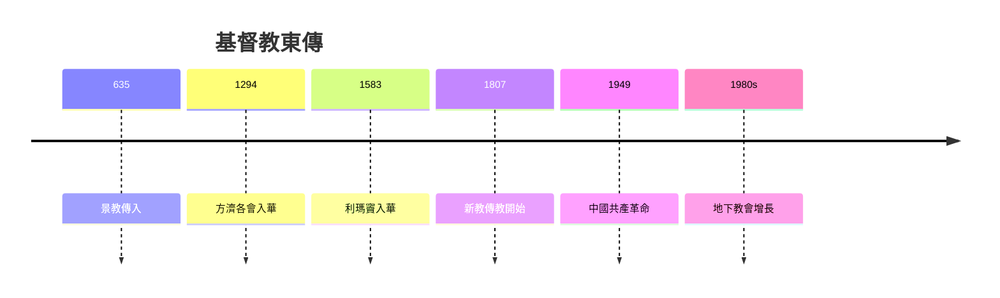
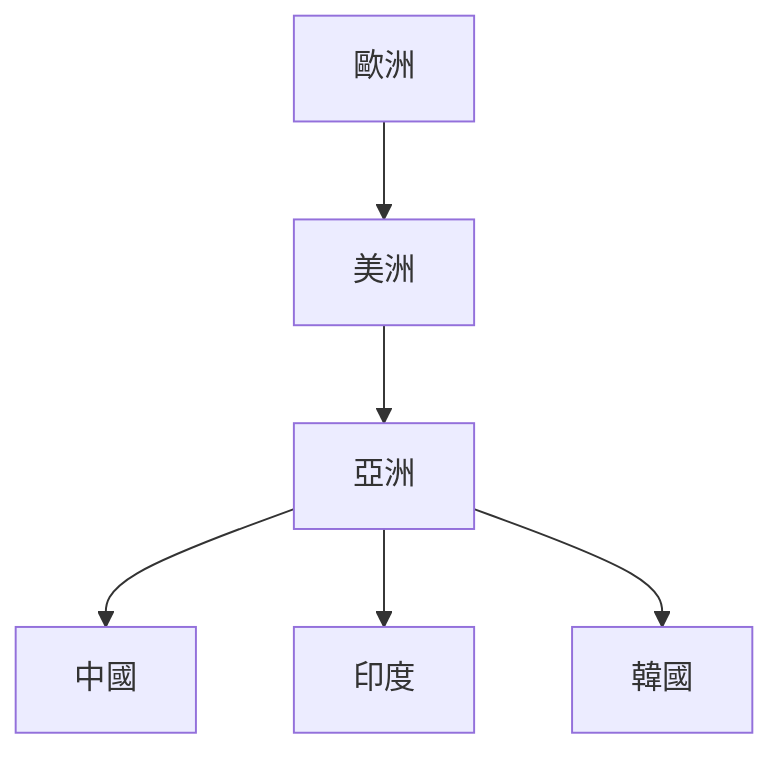
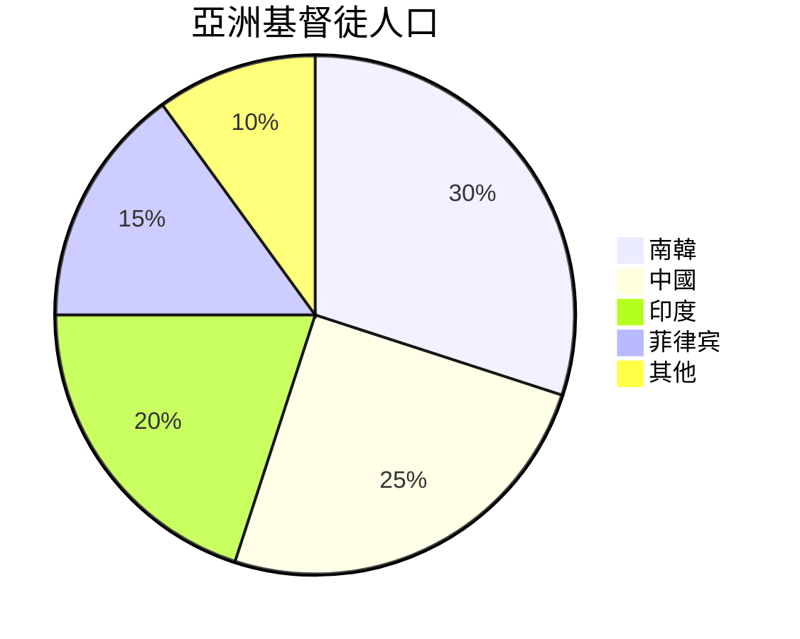
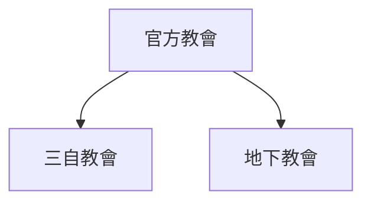
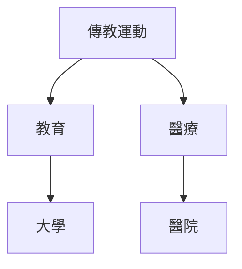
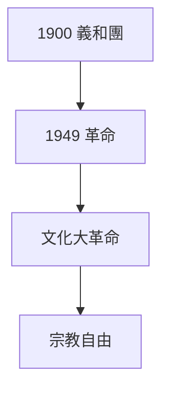

# HIST2202 亞洲基督教 / Christianity in Asia (6 credits)

**Instructor**: Tim Yung
**Department**: History, HKU  
**Official source**: [HKU History Course Description 2024-25](https://history.hku.hk/wp-content/uploads/2024/07/HIST-2425.pdf)
**Style**: 袁騰飛式 — 犀利、聚焦宗教傳播與權力

---

## 問題 1：這個領域所有專家共享的 5 個核心心智模型

### 心智模型 1：基督教東傳歷史
學者 **Daniel Bays** (*A New History of Christianity in China*, 2012) 研究：基督教東傳從唐代景教到今日——充滿誤解、迫害、對話。

學者 **John W. Carrier** 分析：傳教士角色複雜——文化橋樑定帝國主義先驅？

- 635 年景教傳入中國
- 1583 利瑪竇入華
- 19 世紀新教傳教運動

### 心智模型 2：傳教運動與帝國主義
學者 **Andrew Porter** (*Religion versus Empire*, 2004) 研究：傳教運動與帝國主義關係——無法分割。

學者 **Brian Stanley** 分析：傳教士往往成為殖民剝削批評者。

### 心智模型 3：亞洲基督教多樣性
學者 **John C. England** 研究：亞洲基督教從來都唔係西方基督教複製品——有自己傳統、實踐。

學者 **Julius K. Kim** 分析：韓國基督教爆炸性增長——亞洲最大基督教群體。

### 心智模型 4：宗教與現代化
學者 **Katherine R. J. Hammond** 研究：基督教與亞洲現代化——教育、醫療、社會服務。

學者 **E. H. S. Yeo** 分析：香港基督教歷史。

### 心智模型 5：宗教迫害與地下教會
學者 **Murray Rubinstein** 研究：台灣、中國地下教會——宗教自由問題。

學者 **David Aikman** 分析：中國基督教管理爭議。

---

## 問題 2：3 個根本分歧

### 分歧 1：傳教運動——文化橋樑定帝國主義？
- **A 方**：文化橋樑
  - 教育、醫療貢獻
- **B 方**：帝國主義
  - 文化帝國主義

### 分歧 2：中國基督教——愛國守法定地下抗爭？
- **A 方**：愛國守法
  - 三自教會
- **B 方**：地下教會
  - 宗教自由

### 分歧 3：亞洲基督教——本土化定西方化？
- **A 方**：本土化
  - 適應當地文化
- **B 方**：西方化
  - 跟隨西方模式

---

## 問題 3：10 個深度問題

1. 如果你去 1600 年做利瑪竇，你會點樣傳教？
2. 點解基督教喺韓國發展最快？
3. 如果你是 19 世紀傳教士，點解要去中國？
4. 傳教運動與鴉片戰爭——乜嘢關係？
5. 點解中國政府對基督教咁警惕？
6. 如果你去 1900 年義和團時期做田野，你會點樣記錄？
7. 亞洲基督教點解本土化成功？
8. 如果基督教從未傳入亞洲，會有乜嘢影響？
9. 點解香港教會歷史重要？
10. 如果你去 2050 年，亞洲基督教會點樣？

---

## 核心心智模型深化

### 1. 基督教東傳時間線

---

## 5 個 Mermaid 圖解

### 📊 Diagram 1: 傳教運動擴張

### 📊 Diagram 2: 基督教地圖

### 📊 Diagram 3: 中國基督教

### 📊 Diagram 4: 傳教遺產

### 📊 Diagram 5: 宗教迫害

---

## 總結

1. 基督教東傳歷史充滿複雜性
2. 傳教運動與帝國主義關係爭議
3. 亞洲基督教本土化成功
4. 宗教迫害問題持續
5. 亞洲基督教將塑造全球基督教未來

**最後問題**: 亞洲基督教點解越來越重要？

---
**版權所有 © HKU History Self-Study**
