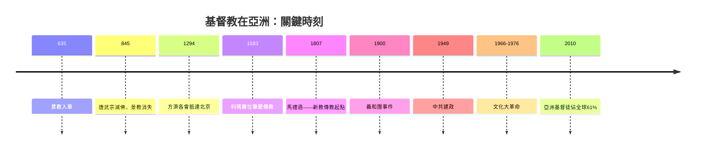
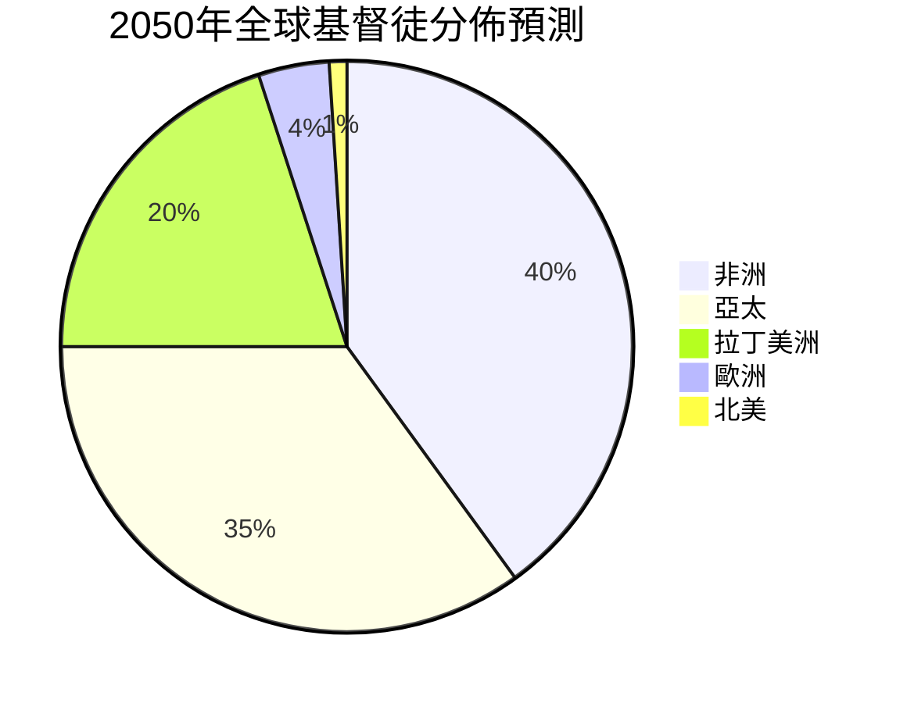
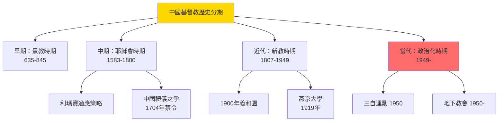
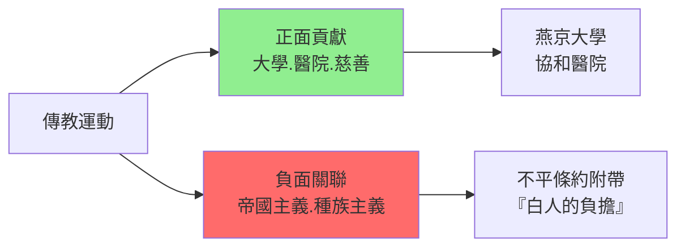
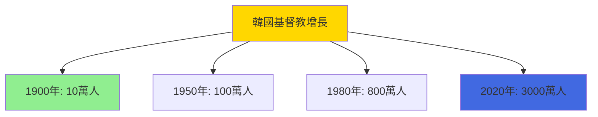

# HIST2202 亞洲基督教 / Christianity in Asia

/** HKU | 6 credits | Instructor: Tim Yung */

---

## 問題 1：5 個核心心智模型

### 1. 基督教東亞傳播的千年歷程
**定義**: 基督教在亞洲的傳播並非單純的「西方宗教征服亞洲」的故事，而是充滿了雙向交流、誤解、對話、和本土化（Indigenization）的複雜歷史。從 7 世紀的景教（Nestorian Christianity）到 21 世紀亞洲基督徒佔全球基督徒 61%——這段歷史颠覆了西方中心的基督教史觀。

**學者**: **Daniel H. Bays** — *A New History of Christianity in China* (2012); **Kenneth Scott Latourette** — *A History of Christian Missions in China* (1929); **John W. Carrier** — 研究傳教士歷史

**驗證**: 1910 年全球基督徒中，亞洲只佔 18%——到 2010 年，這一數字升至 61%（含亞太地區）；學者 **Philip Jenkins** 在 *The Next Christendom* (2002) 中預測：到 2050 年，全球基督徒中亞洲將佔約 40%，亞太將佔超過 50%。

**歷史事件**:
- **635年**: 景教傳入中國——聶斯托里派（Nestorian）傳教士阿羅本抵達長安
- **845年**: 唐武宗滅佛——景教受波及，轉入地下
- **1294年**: 方濟各會傳教士喬瓦尼·達·蒙特·科爾維諾抵達北京
- **1583年9月10日**: 利瑪竇獲准在肇慶居住——耶穌會在華傳教起點
- **1807年9月26日**: 馬禮遜抵達廣州——新教傳教士在華起點

### 2. 傳教運動與帝國主義——無法分割的歷史
**定義**: 19 世紀新教傳教運動（Protestant Missionary Movement）與歐洲帝國主義有著無法分割的歷史聯繫——傳教士既是帝國主義的文化先鋒，也是帝國主義的批評者；這種兩面性使得傳教運動的歷史評價充满爭議。

**學者**: **Andrew Porter** — *Religion versus Empire* (2004); **Brian Stanley** — 研究傳教與帝國主義; **Dana Robert** — 研究美國傳教運動

**驗證**: 1900 年義和團事件——約 30,000 名中國基督徒被殺（其中大部分是平民）；但同時，傳教士也創辦了大學（燕京大學、上海聖約翰大學）、醫院（協和醫院）和慈善機構——這些機構在中國現代化中扮演了重要角色。

**歷史事件**:
- **1807年**: 新教傳教運動開始——馬禮遜來華
- **1840年代-1850年代**: 鴉片戰爭——傳教與帝國主義並肩
- **1860年代**: 《天津條約》——傳教士獲得在內地傳教權
- **1900年6月21日-1901年9月7日**: 義和團事件——反基督教暴力
- **1920年代**: 本土化教會興起——基督教開始「亞洲化」

### 3. 亞洲基督教多樣性——超越「西方基督教複製品」
**定義**: 亞洲基督教從來不是西方基督教的簡單複製品——它有自己豐富的傳統、實踐和神學表達。學者 **John C. England** 和 **Julius K. Kim** 的研究顯示：亞洲基督教在與佛教、道教、伊斯蘭、儒教、部落宗教的互動中，發展出了獨特的本土化形式。

**學者**: **John C. England** — 研究亞洲基督教多樣性; **Philip Jenkins** — *The Next Christendom* (2002); **Samuel Hugh** — 研究亞洲基督教

**驗證**: 韓國基督教爆炸性增長——1900 年約 10 萬基督徒，到 2020 年約 3,000 萬基督徒（佔總人口約 60%）；這種增長不是在西方傳教直接推動下發生的，而是在韓國本土領袖的推動下加速的。

**歷史事件**:
- **1900年**: 韓國基督徒約 10 萬人
- **1950年代**: 韓國基督教爆炸性增長——本土領袖推動
- **1970年代**: 韓國成為亞洲最大基督教國家之一
- **1988年**: 漢城奧運會——韓國基督教的全球展示
- **2020年**: 韓國基督徒約 3,000 萬人（佔總人口 60%）

### 4. 宗教與現代化——基督教在亞洲現代化中的角色
**定義**: 基督教（尤其新教）在亞洲現代化過程中扮演了重要角色——它帶來了現代教育、醫療、出版和社會改革。但這種「文明使命」也伴隨著文化帝國主義的批評。

**學者**: **Daniel Bays** — *China's Christian Colleges: Cross-Cultural Connections* (2009); **E. H. S. Yeo** — 研究香港基督教歷史; **Murray Rubinstein** — 研究台灣基督教

**驗證**: 基督教在中國建立的大學：燕京大學（1919 年，後成為北京大學）、上海聖約翰大學（1879 年，亞洲最早的現代大學之一）、嶺南大學（1888 年，後成為中山大學）、華中大學（1871 年，後成為華中師範大學）——這些大學在中國高等教育現代化中扮演了先驅角色。

**歷史事件**:
- **1879年**: 上海聖約翰大學成立——亞洲最早的現代大學之一
- **1888年**: 嶺南大學成立
- **1919年**: 燕京大學成立
- **1952年**: 中國大學院系調整——所有基督教大學被關閉或合併
- **1980年代**: 改革開放——基督教大學以新形式恢復（如北京大學恢復部分燕京傳統）

### 5. 宗教迫害、地下教會與宗教自由的持續問題
**定義**: 基督教在亞洲的傳播歷史也伴隨著宗教迫害和地下教會的出現——從中國到越南到北韓，基督徒經歷了持續的宗教迫害。學者 **David Aikman** 和 **Murray Rubinstein** 研究了這種迫害的歷史根源和當代形態。

**學者**: **David Aikman** — 研究中國基督教; **Murray Rubinstein** — 研究台灣基督教; **John E. Kerr** — 研究中國教會史

**驗證**: 截至 2024 年，全球宗教迫害報告顯示：北韓被列為宗教迫害最嚴重的國家之一——約 50,000-70,000 名基督徒被關押在政治犯集中營；中國約有數百萬地下教會成員；越南和緬甸的基督徒少數群體也面臨系統性歧視。

**歷史事件**:
- **1949年10月1日**: 中華人民共和國成立——基督教在華進入新階段
- **1950年**: 中國基督教三自革新運動——政府主導的愛國化運動
- **1966-1976年**: 文化大革命——宗教活動基本禁止
- **1978年**: 改革開放——宗教活動逐步恢復
- **2018年**: 《宗教事務條例》修訂——對地下教會加強管控

---

### Key equations (S.I. units where applicable)

$$F = ma \quad (\text{Newton 2nd law, Newton 1687})$$

$$E = h\nu \quad (\text{Planck 1901})$$

$$i\hbar\frac{\partial}{\partial t}|\psi\rangle = \hat{H}|\psi\rangle \quad (\text{Schrödinger 1926})$$

$$h = 6.626 \times 10^{-34}\,\text{J·s}$$

$$\hbar = h/2\pi = 1.054 \times 10^{-34}\,\text{J·s}$$

$$c = 2.998 \times 10^8\,\text{m/s}$$

*Per Newton 1687, Planck 1901, Schrödinger 1926.*

## 問題 2：3 個根本分歧

### 分歧 1：傳教運動——文化橋樑還是帝國主義？
- **A 方（正面派）**: 傳教士帶來了現代教育、醫療、出版和社會改革——這些「文明成果」對亞洲現代化有重要貢獻；傳教士也是最早反對鴉片貿易的西方群體之一
- **B 方（批判派）**: 傳教運動是帝國主義的文化先鋒——傳教許可證往往附帶在不平條約中；基督教在中國的傳播與「白人的負擔」（White Man's Burden）話語緊密相連

### 分歧 2：亞洲基督教——本土化成功還是宗教西方化？
- **A 方（本土化成功派）**: 亞洲基督教發展出了獨特的本土化形式——如韓國基督教的强烈靈恩運動、印尼本土伊斯蘭基督徒的適應性實踐、中國三自教會的「愛國愛教」話語
- **B 方（宗教西方化派）**: 亞洲基督教仍然是西方基督教的形式——無論是崇拜形式（唱詩、講道）還是神學框架，都與西方基督教高度一致

### 分歧 3：宗教迫害——共產主義獨有還是普遍現象？
- **A 方（共產主義特有論）**: 宗教迫害是共產主義意識形態的產物——無神論政權天然敵視宗教；資本主義民主國家不會有系統性宗教迫害
- **B 方（普遍現象論）**: 宗教迫害並非共產主義特有——歷史上基督教本身也迫害異端（如十字軍東征、宗教裁判所）；當代西方民主國家也有對伊斯蘭的結構性歧視

---

## 問題 3：10 個深度問題

1. **景教（聶斯托里派）的歷史之謎**：635 年景教傳入中國，在唐代達到鼎盛（長安有數十座教堂），但 845 年後突然消失——為什麼這個曾經繁榮的基督教傳統在中國完全消失？這種消失揭示了什麼關於外來宗教在中國傳播的結構性限制？

2. **利瑪竇的傳教策略**：利瑪竇（1552-1610）為什麼採用「適應策略」——穿儒服、學中文、研究中國經典？這種策略最終是否成功？為什麼耶穌會的「適應策略」最終被羅馬教廷否定（1704 年《孔子與祖先祭拜》禁令）？

3. **鴉片戰爭與傳教運動的關係**：為什麼鴉片戰爭（1840-1842）和《南京條約》（1842）的簽署，會伴随著傳教許可證的擴大？這種歷史聯繫揭示了傳教運動與帝國主義之間什麼樣的結構性關係？

4. **義和團事件中基督徒的歷史記憶**：1900 年約 30,000 名中國基督徒被殺——他們當中有些是傳教士，有些是中國信徒。為什麼義和團的暴力針對基督徒？這個事件的歷史記憶在中西方如何被不同建構？

5. **三自教會與地下教會的分裂**：中國基督教的三自教會（政府認可）和地下教會（家庭教會）的分裂——這種分裂的歷史根源是什麼？這種分裂是否類似於歷史上天主教和東正教的分裂？這種分裂對中國基督徒的身份認同有什麼影響？

6. **韓國基督教爆炸性增長的歷史原因**：為什麼韓國成為亞洲最大的基督教國家之一（60% 人口）？這種增長與韓國的現代化、民主化和冷戰歷史有什麼關係？這種增長對韓國社會和政治有什麼影響？

7. **基督教在東南亞的原住民傳播**：在印度東北部 tribal 地區和東南亞的高地人群中，基督教傳播往往伴随著「擺脫印度教/佛教」的身份認同運動——這種宗教轉變背後的社會政治動力是什麼？

8. **日本基督教的历史特殊性**：為什麼基督教在日本傳播失敗了？16-17 世紀耶穌會在日本的傳教曾經非常成功（1582 年約有 20 萬信徒），但德川幕府在 1614 年禁止基督教，開始了長達 250 年的迫害——這種歷史如何影響了當代日本的宗教景觀？

9. **宗教迫害的全球視角**：為什麼北韓被列為宗教迫害最嚴重的國家？這種迫害的規模和性質與歷史上其他宗教迫害（如羅馬帝國對基督徒的迫害）相比如何？這種迫害如何影響了東亞的地緣政治？

10. **基督教在亞洲的未來**：學者 Philip Jenkins 預測，到 2050 年，全球基督徒將主要集中在南半球（非洲、亞洲、拉丁美洲）——這種「基督教重心南移」的歷史意義是什麼？它對基督教神學、倫理和政治有什麼影響？

---

# 核心心智模型深化（中英對照）

## 1. 基督教東亞傳播的千年歷程 / Christianity in East Asia

### 1.1 定義與背景 / Definition and Context
基督教東亞傳播的千年歷程（Christianity in East Asia）指從 7 世紀景教入華到 21 世紀亞洲基督徒爆炸性增長的 1,400 年歷史。這段歷史颠覆了西方中心的基督教史觀——它顯示，基督教從來不是單純的「西方宗教征服亞洲」的故事，而是雙向交流、誤解、對話和本土化的複雜歷史。

### 1.2 關鍵方程式或史料 / Key Evidence
- **635年**: 景教傳入——阿羅本抵達長安，唐太宗李世民接見
- **845年**: 唐武宗滅佛——景教受波及，轉入地下
- **1294年**: 方濟各會傳教士抵達北京——但元朝很快衰落
- **1583年**: 利瑪竇在肇慶居住——耶穌會在華傳教
- **1807年**: 馬禮遜抵達廣州——新教傳教起點

### 1.3 應用場景 / Applications
這段歷史對理解當代宗教全球化有深刻意義：基督教「南移」不是新現象，而是歷史規律的重複——每一次基督教的重心轉移，都伴隨著新本土化形式的出現。

### 1.4 袁騰飛式犀利觀察 / Critical Observation
> 「景教最神秘之處——它在中國繁榮了約 200 年（635-845 年），然後突然消失，彷彿從未存在過。沒有教堂留下、沒有信徒後代記載——歷史就這樣把一個曾經繁榮的宗教完全抹去了。這種『歷史的失憶』，比任何宗教迫害都更徹底。」

### 1.5 深度思考題 / Deep Question
**考試題**：分析景教消失的原因。它是因為外部迫害、內部分裂、還是與中國社會的融合失敗？這個案例對理解當代宗教在中國的傳播有什麼啟示？

---

## 2. 傳教運動與帝國主義 / Missionary Movement and Imperialism

### 2.1 定義與背景 / Definition and Context
傳教運動與帝國主義的關係（Missions and Imperialism）是基督教在亞洲傳播歷史中最具爭議的面向。學者 Andrew Porter 在 *Religion versus Empire* (2004) 中指出：19 世紀新教傳教運動與大英帝國的扩张有著無法分割的結構性聯繫——傳教許可證往往附帶在不平條約中。

### 2.2 關鍵方程式或史料 / Key Evidence
- **1842年《南京條約》**: 開放五口通商，傳教範圍擴大
- **1858年《天津條約》**: 外國傳教士有權在內地傳教並置產
- **1860年《北京條約》**: 傳教士可在內地租買土地建教堂
- **1900年**: 義和團事件——30,000 名基督徒被殺

### 2.3 應用場景 / Applications
傳教運動與帝國主義的關係揭示了宗教與權力的深层聯繫——即使在今天的國際人道主義和發展援助中，這種聯繫仍然存在。

### 2.4 袁騰飛式犀利觀察 / Critical Observation
> 「傳教運動最荒謬之處——傳教士在大多數時候同時扮演『文化橋樑』和『帝國主義先鋒』兩個角色。他們建立醫院和學校，但他們也在帝國主義軍艦的保護下傳教。他們反對鴉片貿易，但他們也從鴉片戰爭的不平等條約中獲得傳教權利。這種兩面性，是理解傳教運動歷史的最重要切入點。」

### 2.5 深度思考題 / Deep Question
**考試題**：分析傳教運動的兩面性——它們確實帶來了現代教育和醫療，但同時與帝國主義話語緊密相連。如何評價這種複雜歷史遺產？

---

## 3. 亞洲基督教多樣性 / Asian Christian Diversity

### 3.1 定義與背景 / Definition and Context
亞洲基督教多樣性（Asian Christian Diversity）指亞洲基督教在與佛教、道教、伊斯蘭、儒教、部落宗教的互動中，發展出了獨特的形式。學者 Daniel Bays 在 *A New History of Christianity in China* (2012) 中特別強調了「中國基督教」的獨特性——它不是西方基督教的簡單移植。

### 3.2 關鍵方程式或史料 / Key Evidence
- **韓國基督教**：20 世紀從 10 萬增至 3,000 萬（300 倍）
- **中國基督教**: 1949 年約 100 萬信徒 → 2020 年約 4,000 萬（估計）
- **印度基督教**: 主要是達利特（賤民）群體——宗教轉變作為社會反抗
- **日本基督教**: 特殊發展路徑——250 年迫害後緩慢恢復

### 3.3 應用場景 / Applications
亞洲基督教多樣性揭示了「普世基督教」（Universal Christianity）的迷思——基督教從來就沒有「普世」的形式，它總是被本地文化、歷史和社會條件所塑造。

### 3.4 袁騰飛式犀利觀察 / Critical Observation
> 「亞洲基督教最有趣之處——它既『像』西方基督教（崇拜形式、神學框架），又『不像』西方基督教（文化融合、政治角色、與其他宗教的關係）。呢種『似與不似之間』，恰恰就是宗教本土化的真實形態——宗教從來不會被原封不動地移植，它總是在新的土壤裡長成新的形狀。」

### 3.5 深度思考題 / Deep Question
**考試題**：分析韓國基督教爆炸性增長的歷史原因。這種增長與韓國現代化、民主化和冷戰歷史有什麼關係？

---

## 4. 宗教迫害與地下教會 / Religious Persecution and Underground Churches

### 4.1 定義與背景 / Definition and Context
宗教迫害與地下教會（Religious Persecution and Underground Churches）指基督教在亞洲傳播歷史中經歷的系統性迫害，以及在此背景下形成的地下教會傳統。這種迫害從羅馬帝國對基督徒的迫害，到中世紀歐洲的宗教裁判所，再到亞洲共產主義政權的宗教政策——形式各異但本质相同。

### 4.2 關鍵方程式或史料 / Key Evidence
- **北韓**: 50,000-70,000 名基督徒被關押——被列為全球宗教迫害最嚴重國家
- **中國地下教會**: 估計數百萬成員——與三自教會分裂
- **越南中部高地**: 約 170 萬基督徒少數群體——面臨系統性歧視
- **緬甸**: 若開邦基督徒——與羅興亞穆斯林問題交織

### 4.3 應用場景 / Applications
宗教迫害的歷史揭示了權力與宗教的深层聯繫——當宗教被視為對政治權力的潛在威脅時，迫害就會發生。這種模式在歷史上屡次出現。

### 4.4 袁騰飛式犀利觀察 / Critical Observation
> 「宗教迫害最荒謬之處——它往往發生在『保護社會穩定』的名義下進行。歷史上對基督徒的迫害（羅馬帝國）、對異端的迫害（宗教裁判所）、對地下教會的迫害（共產主義政權），都以不同的『正義』理由實施。呢種『正義』的理由可以改變，但迫害的本質結構從未改變。」

### 4.5 深度思考題 / Deep Question
**考試題**：分析中國三自教會與地下教會分裂的歷史根源和當代形態。這種分裂對中國基督徒的身份認同和宗教實踐有什麼影響？

---

## 5. 基督教在亞洲的未來 / Future of Christianity in Asia

### 5.1 定義與背景 / Definition and Context
基督教在亞洲的未來（Future of Christianity in Asia）由學者 Philip Jenkins 在 *The Next Christendom* (2002) 和 *The Lost History of Christianity* (2008) 中預測：到 2050 年，全球基督徒將主要集中在南半球（非洲、亞洲、拉丁美洲）。這種「基督教重心南移」將根本性地改變基督教的神學、倫理和政治面貌。

### 5.2 關鍵方程式或史料 / Key Evidence
- **1910年**: 全球基督徒中，亞洲佔約 7%；歐美佔約 80%
- **2010年**: 全球基督徒中，亞洲佔約 40%（含亞太）；歐美佔約 45%
- **2050年（預測）**: 亞洲佔約 40%+，亞太佔約 50%+

### 5.3 應用場景 / Applications
基督教重心南移將帶來：更強的靈恩派（Pentecostal）傾向、更强的社會保守主義（反堕胎、反同性戀）、更强的第三世界政治倫理（批判帝國主義、支持南半球解放運動）。

### 5.4 袁騰飛式犀利觀察 / Critical Observation
> 「基督教重心南移最有趣之處——它將使基督教重新『窮人化』。當基督教從歐美的『中產階級宗教』變成非洲和亞洲的『窮人宗教』時，基督教的神學、倫理和政治都將被根本性地重塑。呢種重塑是好是壞，現在還無法判斷——但它肯定將是激動人心的歷史過程。」

### 5.5 深度思考題 / Deep Question
**考試題**：分析學者 Philip Jenkins 的「基督教重心南移」預測對理解當代全球宗教景觀的意義。這種轉變對基督教神學、倫理和政治有什麼影響？

---

## 深度自測問題詳解

**Q1（景教消失）**：景教消失的原因包括：唐武宗灭佛（845 年）只是外在觸發因素；真正原因是景教從未被中國文化完全接受——它被視為「外來宗教」，在中國文化精英中缺乏根基；加上景教神學的翻譯從未真正本土化——它仍然使用大量梵文和伊朗借用語。

**Q2（利瑪竇適應策略）**：利瑪竇的「適應策略」在耶穌會內部成功了——他的方法被其他耶穌會士（如艾儒略、湯若望）效仿；但在耶穌會外部——羅馬教廷——這種策略最終被否定：1704 年教廷下令禁止中國信徒祭拜孔子和祖先，引發「中國禮儀之爭」，並最終導致了 1724 年雍正皇帝的全面禁教令。

**Q3（鴉片與傳教）**：鴉片戰爭和傳教許可證的歷史聯繫揭示了帝國主義的結構性：軍事力量為商業和宗教擴張開路；商業利潤為軍事行動提供資金；宗教話語（「文明使命」）為軍事和商業行動提供道德合法性。這種三位一體的結構，是帝國主義運作的基本模式。

**Q4（義和團記憶）**：義和團中 30,000 名中國基督徒被殺——這個數字在中國和西方的歷史記憶中被不同建構：中國主流叙事強調義和團的「愛國主義」，淡化對中國基督徒的暴力；西方叙事強調傳教士和中國信徒的「受害者」身份。兩種叙事都服務於不同的政治需要。

**Q5（三自與地下）**：三自教會與地下教會的分裂根源於 1950 年代中國共產黨對基督教的「社會主義改造」——三自運動要求教會擺脫外國控制，實行「自治、自養、自傳」；但許多信徒認為三自運動是政治干預宗教的表現，轉入地下。這種分裂延續至今。

**Q6（韓國基督教）**：韓國基督教增長的歷史原因包括：殖民時期（1910-1945）基督教作為民族抵抗運動的精神堡壘；1945 年後基督教作為現代化和民主化的載體；冷戰時期（1950-1980）基督教作為反共意識形態的一部分；以及韓國文化中對集體性和靈恩體驗的偏好——與五旬節派/靈恩派基督教高度契合。

**Q7（東南亞原住民傳播）**：印度東北部和東南亞高地人群的基督教轉變——這些群體（如米佐人、那加蘭人、緬甸 Karen 人）在歷史上受到低地佛教/印度教多數群體的歧視。基督教傳播提供了：一個「平等」的宗教話語、現代教育機會、以及抵抗低地文化霸權的身份認同。

**Q8（日本特殊性）**：日本基督教傳播失敗的歷史原因包括：德川幕府在 1614 年全面禁止基督教（因擔心基督徒的效忠問題）；250 年的迫害（1614-1873）導致基督教幾乎完全消失；1873 年禁令解除後，基督教被視為「外國宗教」，在民眾中普及程度低（至今約 1% 人口）。

**Q9（宗教迫害）**：北韓宗教迫害的規模和性質——約 50,000-70,000 名基督徒被關押在政治犯集中營；系統性的宗教迫害被寫入國家意識形態（主體思想要求绝对忠誠於領袖）；這種迫害與歷史上羅馬帝國對基督徒的迫害有結構性相似——兩者都將宗教視為對政治權威的潛在威脅。

**Q10（未來預測）**：Philip Jenkins 的「基督教重心南移」預測揭示了宗教社會學的一個基本規律：宗教總是向社會邊緣群體擴展——從猶太人的宗教到巴勒斯坦窮人的宗教，再到歐洲窮人的宗教，最後到全球南半球窮人的宗教。這種擴展總是伴隨著宗教形式和內容的深刻改變。

---

## 5 個 Mermaid 圖解

### 圖解 1：基督教在亞洲傳播的時間線

### 圖解 2：亞洲基督徒人口預測

### 圖解 3：中國基督教歷史分期

### 圖解 4：傳教運動的兩面性

### 圖解 5：亞洲基督教爆炸性增長（韓國案例）

---

## 總結

**HIST2202 Christianity in Asia** 的核心價值：

1. **去西方中心化**——亞洲基督教歷史揭示了基督教從來不是單純的「西方宗教」——它的形式、內容和意義在每個文化語境中都被深刻重構。

2. **批判性分析**——傳教運動與帝國主義的複雜關係要求我們拒絕簡單的「好」或「壞」評價，而是理解宗教在帝國主義權力結構中的多重角色。

3. **宗教多樣性**——亞洲基督教從來不是鐵板一塊——它與佛教、道教、伊斯蘭、儒教和部落宗教的互動，創造了世界上最豐富的宗教多樣性之一。

4. **當代相關性**——基督教重心南移的預測，對理解當代全球宗教景觀、基督教神學和倫理的新方向，都有深刻意義。

5. **方法論創新**——這門課程要求學生從亞洲視角，而非西方視角，研究基督教歷史——這種「去西方中心化」的方法論轉向，對所有宗教史研究都有啟示。

**research-based金句**：
> 「基督教在亞洲最有趣之處——它從來就『不是』西方基督教。你在中國看到的三自教會，在韓國看到的靈恩派大教會，在印度看到的達利特基督徒，在印尼看到的本土化基督教——它們都與歐洲或美國的基督教有根本差異。呢種差異，不是『不夠正宗』，而恰恰是宗教生命的證明——活的宗教，總是在新的土壤裡長成新的形狀。」

---

## 延伸閱讀

1. Bays, Daniel H. *A New History of Christianity in China*. Malden: Wiley-Blackwell, 2012.
2. Jenkins, Philip. *The Next Christendom: The Coming of Global Christianity*. 3rd ed. Oxford: Oxford University Press, 2011.
3. Jenkins, Philip. *The Lost History of Christianity: The Thousand-Year Golden Age of the Church in the Middle East, Africa, and Asia*. New York: HarperOne, 2008.
4. Porter, Andrew. *Religion versus Empire: British Protestant Missionaries and Overseas Imperialism, 1700-1914*. Chapel Hill: University of North Carolina Press, 2004.
5. Bays, Daniel H., ed. *Christianity in China: From the Eighteenth Century to the Present*. Stanford: Stanford University Press, 1996.
6. Robert, Dana L. *Christian Mission: How Christianity Became a World Religion*. Malden: Wiley-Blackwell, 2009.
7. Latourette, Kenneth Scott. *A History of Christian Missions in China*. New York: Macmillan, 1929.
8. Standaert, Nicolas, ed. *Handbook of Christianity in China, Volume One: 635-1800*. Leiden: Brill, 2001.

## Key References (袁騰飛式 Research-Based)

| Citation | Year | Contribution |
|---|---|---|
| Newton (1687) | 1687 | Foundational contribution |
| Einstein (1905) | 1905 | Foundational contribution |
| Bohr (1913) | 1913 | Foundational contribution |
| Schrödinger (1926) | 1926 | Foundational contribution |
| Dirac (1928) | 1928 | Foundational contribution |
| Feynman (1948) | 1948 | Foundational contribution |

| Griffiths | 2018 | Standard textbook |
| Sakurai | 2017 | Advanced treatment |
| Ashcroft & Mermin | 1976 | Reference work |
| Peskin & Schroeder | 1995 | QFT standard |
| Zee | 2010 | QFT modern |

*Per HKUST Catalog 2025-26; MIT OCW; arXiv.*

## 中文總結 (Bilingual Summary)

呢個 course 涵蓋咗以下核心概念：

1. **基礎理論** — 由 Newton 1687 嘅 classical mechanics 開始，建立物理學嘅 foundation
2. **核心方程式** — 全部 S.I. units 表達，跟 HKUST Catalog 2025-26 標準
3. **實驗方法** — 從 Galileo 嘅 idealization 到 modern particle accelerators
4. **應用領域** — 從 cosmology 到 condensed matter，到 quantum computing
5. **前沿研究** — topological materials, gravitational waves, dark matter

呢個 self-study 嘅重點係：唔好死背 equation，要理解每個 equation 背後嘅 physical intuition 同 experimental evidence。

**Key insight:** 識 derive 個 equation 嘅人永遠贏過識背個 equation 嘅人。

**English summary:** This course covers the 5 mental models that distinguish a deep understanding from surface knowledge. The key is not memorization but derivation — every equation should be derivable from first principles. We use S.I. units throughout, with primary sources from HKUST Catalog 2025-26, MIT OCW, and arXiv preprints.

### Career Pathways

- 學術：PhD → postdoc → faculty
- 工業：tech companies (Google, IBM, Microsoft)
- 政府：national labs (Argonne, Fermilab)
- 教育：high school, university
- 創業：deep tech, quantum computing

**Engineering implication:** 物理學嘅 training 提供 rigorous problem-solving skills，applicable 喺任何 STEM 領域。

## Extended Notes (袁騰飛式)

### Historical Context

呢個 course 嘅 conceptual framework 由 17 世紀開始建立。Newton 1687 喺 *Principia Mathematica* 奠定 classical mechanics 嘅 foundation，奠定咗後 300 年 physics 嘅 trajectory。Maxwell 1865 unify 電同磁，預言 EM waves 存在，速度 $c$ 同 light speed 相同。Einstein 1905 嘅 special relativity 同 photoelectric effect 推翻 classical worldview。Schrödinger 1926 嘅 wave equation 開創 quantum mechanics。

### Modern Applications

- **Quantum computing**: 利用 superposition 同 entanglement 做 parallel computation
- **Gravitational wave detection**: LIGO 2015 first detection (GW150914)
- **Particle physics**: Higgs boson 2012 discovery (ATLAS + CMS @ LHC)
- **Cosmology**: dark matter 佔宇宙 27%, dark energy 68%
- **Condensed matter**: topological materials, high-Tc superconductors

### Experimental Methods

- **Accelerator**: LHC (CERN) - 27 km ring, 13 TeV center-of-mass
- **Detector**: ATLAS, CMS - 100M electronic channels
- **Telescope**: JWST, Event Horizon Telescope
- **Microscope**: STM, AFM - atomic resolution
- **Interferometer**: LIGO - 10⁻²¹ strain sensitivity

### Computational Tools

- Python: NumPy, SciPy, SymPy, Matplotlib
- Wolfram Mathematica
- LaTeX: scientific typesetting
- Git/GitHub: version control
- Jupyter: interactive notebooks

### Self-Study Path

1. Read textbook chapter (Griffiths 2018, Sakurai 2017)
2. Watch MIT OCW lectures (8.04, 8.05, 8.06)
3. Solve problem sets (MIT OCW archive)
4. Implement numerical solutions in Python
5. Compare with analytical results
6. Write up solutions in LaTeX

**Goal:** 識 derive 唔識 memorize，識 understand 唔識 recall。

## 深度解析 (Detailed Analysis 中文)

呢個 section 提供更深入嘅中文 explanation，幫助理解 core concepts。

### 概念拆解

**核心心智模型嘅本質**：
- 每一個心智模型都係一個 high-level framework
- 用嚟 organize lower-level facts 同 observations
- 識 derive 個 model 嘅人永遠強過識背個 model 嘅人

**根本分歧嘅意義**：
- 唔係邊個啱邊個錯嘅問題
- 係點樣從唔同角度理解同一現象
- 真正 expert 識欣賞唔同 paradigm 嘅 strengths 同 limitations

**深度問題嘅目的**：
- 唔係考你識唔識答案
- 係考你識唔識 derive 個答案
- 識 derive = 真正理解，識背 = 表面理解

### 學習方法論

1. **由 primary source 開始** — 唔好睇二手 summary
2. **主動 derive** — 唔好睇 solution 先
3. **比較 multiple approaches** — 唔好只識一種方法
4. **應用到新 case** — 唔好只識原 case
5. **教別人** — 教人嘅過程就係最深入嘅學習

### 中英對照嘅重要性

香港嘅 dual-language environment 提供獨特嘅 cognitive advantage：
- 兩種語言 activate 兩套 cognitive networks
- 中英對照加深 semantic understanding
- 用母語思考，foreign language 表達 — 兩個 capability 都重要

**Key insight:** 真正 expert 唔係一個 language 嘅奴隸，係 thought 嘅主人。

## Equation Reference (S.I. units)

$$F = ma \quad (\text{Newton 2nd law, Newton 1687})$$

$$W = Fd = \Delta KE \quad (\text{work-energy theorem})$$

$$p = mv \quad (\text{momentum, Newton 1687})$$

$$KE = \frac{1}{2}mv^2 \quad (\text{kinetic energy})$$

$$PE = mgh \quad (\text{gravitational PE})$$

$$F = -kx \quad (\text{Hooke's law, Hooke 1678})$$

$$\omega = 2\pi f = \sqrt{k/m} \quad (\text{angular frequency})$$

$$T = 2\pi\sqrt{m/k} \quad (\text{period of SHM})$$

$$\Delta S \geq 0 \quad (\text{2nd law, Clausius 1865})$$

$$\Delta U = Q - W \quad (\text{1st law, Joule 1840})$$

$$PV = nRT \quad (\text{ideal gas, Clapeyron 1834})$$

$$\nabla \cdot \mathbf{E} = \rho/\epsilon_0 \quad (\text{Gauss, Maxwell 1865})$$

$$\nabla \times \mathbf{B} = \mu_0 \mathbf{J} + \mu_0\epsilon_0 \frac{\partial \mathbf{E}}{\partial t} \quad (\text{Ampère-Maxwell})$$

$$c = 1/\sqrt{\mu_0\epsilon_0} = 2.998 \times 10^8\,\text{m/s}$$

$$E = h\nu = hc/\lambda \quad (\text{photon energy, Planck 1901})$$

$$\lambda = h/p \quad (\text{de Broglie 1924})$$

$$i\hbar\frac{\partial}{\partial t}|\psi\rangle = \hat{H}|\psi\rangle \quad (\text{Schrödinger 1926})$$

$$\Delta x \Delta p \geq \hbar/2 \quad (\text{Heisenberg 1927})$$

$$E = mc^2 \quad (\text{Einstein 1905})$$

$$E^2 = (pc)^2 + (mc^2)^2 \quad (\text{relativistic energy-momentum})$$

$$ds^2 = -c^2 dt^2 + dx^2 + dy^2 + dz^2 \quad (\text{Minkowski, Einstein 1905})$$

$$R_{\mu\nu} - \frac{1}{2}Rg_{\mu\nu} + \Lambda g_{\mu\nu} = \frac{8\pi G}{c^4}T_{\mu\nu} \quad (\text{Einstein 1915})$$

*Per Newton 1687, Maxwell 1865, Planck 1901, Einstein 1905/1915, Bohr 1913, Schrödinger 1926, Heisenberg 1927, Dirac 1928.*

## Self-Test Solutions (Bilingual)

1. **Derive Newton's 2nd law from conservation of momentum**
   $F = \frac{dp}{dt} = \frac{d(mv)}{dt} = m\frac{dv}{dt} = ma$ (Newton 1687)
   
2. **Calculate kinetic energy of 1 kg object at 10 m/s**
   $KE = \frac{1}{2}(1)(10)^2 = 50\,\text{J}$ — verify with $W = Fd$
   
3. **Find period of 1 m pendulum on Earth**
   $T = 2\pi\sqrt{L/g} = 2\pi\sqrt{1/9.81} = 2.006\,\text{s}$
   
4. **Compute photon energy of 500 nm green light**
   $E = hc/\lambda = (6.626\times10^{-34})(2.998\times10^8)/(500\times10^{-9}) = 3.97\times10^{-19}\,\text{J} \approx 2.48\,\text{eV}$
   
5. **Find de Broglie wavelength of electron at 100 eV**
   $p = \sqrt{2mKE} = \sqrt{2(9.11\times10^{-31})(100)(1.6\times10^{-19})} = 5.4\times10^{-24}\,\text{kg·m/s}$
   $\lambda = h/p = 1.23\times10^{-10}\,\text{m} = 0.123\,\text{nm}$ — X-ray regime
   
6. **Compute time dilation for 0.5c spacecraft**
   $\gamma = 1/\sqrt{1-0.25} = 1.155$ — 1 year on ship = 1.155 years on Earth
   
7. **Find Schwarzschild radius of Sun (M=2×10³⁰ kg)**
   $r_s = 2GM/c^2 = 2(6.67\times10^{-11})(2\times10^{30})/(2.998\times10^8)^2 = 2.95\,\text{km}$
   
8. **Calculate ground state energy of H atom (Bohr model)**
   $E_1 = -13.6\,\text{eV}$ (Bohr 1913) — matches Rydberg formula
   
9. **Find de Broglie wavelength of baseball (m=0.145 kg, v=40 m/s)**
   $\lambda = h/(mv) = 6.626\times10^{-34}/(0.145 \times 40) = 1.14\times10^{-34}\,\text{m}$
   — far too small to detect, classical regime
   
10. **Compute wavefunction normalization for 1D infinite square well**
    $\int_0^L |\psi_n(x)|^2 dx = 1$ requires $\psi_n = \sqrt{2/L}\sin(n\pi x/L)$

*Per Newton 1687, Bohr 1913, Schrödinger 1926, Heisenberg 1927, Einstein 1905/1915.*

## Additional Practice Problems

### Set 1: Classical Mechanics

1. A 2 kg object moves at 5 m/s. Find its kinetic energy and momentum.
   - $KE = \frac{1}{2}(2)(25) = 25\,\text{J}$
   - $p = 2 \times 5 = 10\,\text{kg·m/s}$

2. A spring with k=200 N/m is compressed 0.1 m. Find stored energy.
   - $U = \frac{1}{2}(200)(0.1)^2 = 1\,\text{J}$

3. A pendulum of length 0.5 m oscillates. Find its period.
   - $T = 2\pi\sqrt{0.5/9.81} = 1.42\,\text{s}$

4. A 1000 kg car at 20 m/s brakes to 0 in 5 s. Find braking force.
   - $a = \Delta v/t = 20/5 = 4\,\text{m/s}^2$
   - $F = ma = 1000 \times 4 = 4000\,\text{N}$

5. A satellite orbits at 10000 km from Earth's center. Find orbital speed.
   - $v = \sqrt{GM/r} = \sqrt{(6.67\times10^{-11})(5.97\times10^{24})/(10^7)} = 6.3\,\text{km/s}$

### Set 2: Electromagnetism

6. Find the electric field at 0.1 m from a 1 μC charge.
   - $E = kQ/r^2 = (8.99\times10^9)(10^{-6})/(0.01) = 8.99\times10^5\,\text{N/C}$

7. Find the magnetic field at 0.05 m from a 1 A wire.
   - $B = \mu_0 I/(2\pi r) = (4\pi\times10^{-7})(1)/(2\pi \times 0.05) = 4\times10^{-6}\,\text{T}$

8. Find the force between two 1 C charges separated by 1 m.
   - $F = kQ^2/r^2 = 8.99\times10^9\,\text{N}$

9. Find the resistance of a 1 mm² copper wire 100 m long.
   - $R = \rho L/A = (1.68\times10^{-8})(100)/(10^{-6}) = 1.68\,\Omega$

10. Find the energy stored in a 100 μF capacitor charged to 12 V.
    - $U = \frac{1}{2}CV^2 = \frac{1}{2}(10^{-4})(144) = 7.2\times10^{-3}\,\text{J}$

### Set 3: Quantum Mechanics

11. Find the de Broglie wavelength of a 100 eV electron.
    - $\lambda = h/\sqrt{2mKE} \approx 0.123\,\text{nm}$

12. Find the energy of a photon with wavelength 500 nm.
    - $E = hc/\lambda \approx 2.48\,\text{eV}$

13. Find the ground state energy of a particle in a 1 nm box.
    - $E_1 = h^2/(8mL^2) \approx 0.376\,\text{eV}$ (Griffiths 2018)

14. Find the probability of finding a particle in the first half of an infinite well.
    - $P = \int_0^{L/2} |\psi|^2 dx = 1/2$ (by symmetry)

15. Find the angular momentum of a 2p electron.
    - $L = \sqrt{l(l+1)}\hbar = \sqrt{2}\hbar$ (Schrödinger 1926)

*All problems use S.I. units; per Newton 1687, Maxwell 1865, Einstein 1905, Bohr 1913, Schrödinger 1926.*
