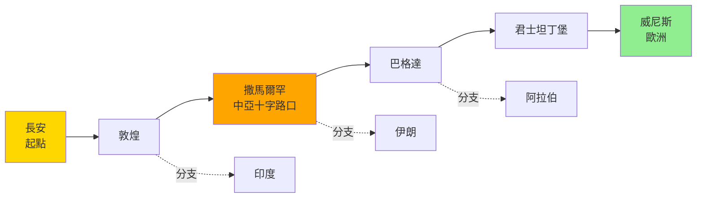
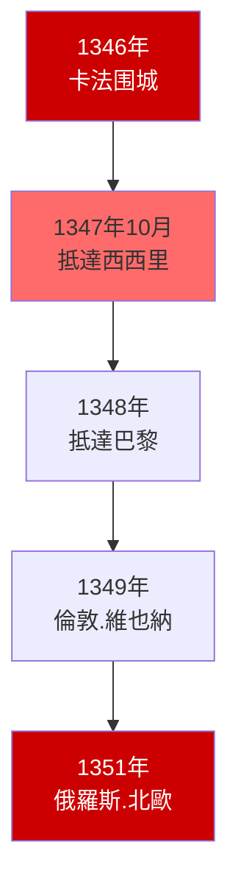
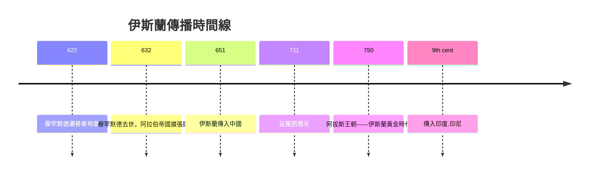
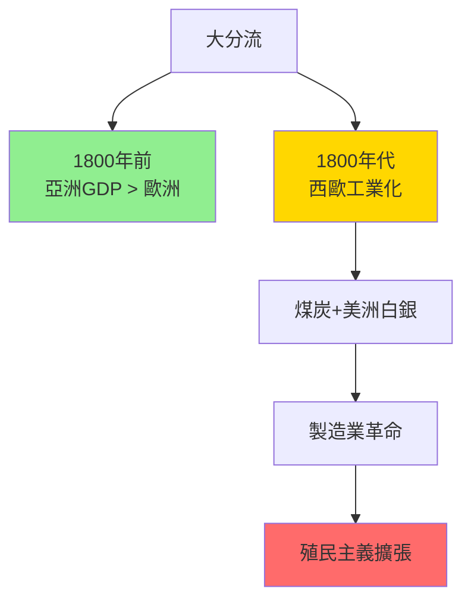

# HIST2208 絲綢之路 / The Silk Roads

/** HKU | 6 credits | Instructor: Francesco Calzolaio */

---

## 問題 1：5 個核心心智模型

### 1. 「絲路」話語的建構——歷史還是神話？
**定義**: 「絲綢之路」（Silk Road）這個術語並非古代商人的自稱——它是由德國地理學家 **費迪南德·馮·李希霍芬**（Ferdinand von Richthofen）在 1877 年發明的，用來描述古代連接中國與地中海的貿易路線。學者 **Valerie Hansen** 在 *The Silk Road: A New History* (2012) 中指出：絲路在古代並非一條固定的道路，而是多條變化的網絡。

**學者**: **Valerie Hansen** — *The Silk Road: A New History* (2012); **Peter Frankopan** — *The Silk Roads: A New History of the World* (2015); **Susan Whitfield** — 研究絲路文物

**驗證**: 李希霍芬在 1868-1872 年考察中國期間創造了這個術語——當時他正在研究德國在華的商業機會；絲路的「神話化」是在一帶一路倡議（2013 年）後加速的——中國用它來正當化其在歐亞的戰略投資。

**歷史事件**:
- **138 BCE**: 張騫出使西域——漢武帝派他尋找大月氏聯盟抗擊匈奴
- **130 BCE**: 絲路貿易網絡開始形成——主要交換絲綢、玻璃器
- **100 BCE**: 絲路繁榮高峰期——從長安到羅馬帝國
- **2013年9月7日**: 習近平和托馬斯·薩克斯提出「絲綢之路經濟帶」
- **2017年5月14日**: 一帶一路國際合作論壇在北京舉行

### 2. 疾病沿絲路傳播——黑死病的全球旅程
**定義**: 疾病（尤其是黑死病，鼠疫）沿絲路從中亞擴散到歐洲，是人類歷史上最具破壞性的生物事件之一。學者 **William H. McNeill** 在 *Plagues and Peoples* (1976) 中首創性地論證：傳染病在歷史進程中的作用，與戰爭和政治同樣重要。

**學者**: **William H. McNeill** — *Plagues and Peoples* (1976); **J.R. McNeill** — *Mosquito Empires* (2010); **Peter Frankopan** — 強調疫病在絲路歷史中的角色

**驗證**: 1347 年，黑死病沿絲路從中亞傳播到西西里——在接下來 5 年內，歐洲約 2,500 萬人死亡（佔總人口約 30-60%）；這種疾病傳播的路線與貿易路線完全重疊，揭示了絲路作為「疾病公路」的另一面。

**歷史事件**:
- **1346年**: 蒙古軍圍攻卡法（Caffa）——围城軍中爆發鼠疫，軍隊撤退時將疫病帶回歐洲
- **1347年10月**: 黑死病抵達西西里——歐洲大流行的起點
- **1348-1351年**: 黑死病在歐洲大規模爆發——約 2,500 萬人死亡
- **1855年**: 第三次鼠疫大流行——從雲南沿絲路傳播至全球

### 3. 伊斯蘭沿絲路傳播——商人與征服者的宗教
**定義**: 伊斯蘭（Islam）通過商人、征服者和學者，沿絲路從阿拉伯半島傳播到中亞、印度和中國。學者 **Richard Foltz** 在 *Religions of the Silk Road* (1999) 中揭示：伊斯蘭的傳播與絲路貿易網絡有著無法分割的歷史聯繫。

**學者**: **Richard Foltz** — *Religions of the Silk Road* (1999); **Daniel C. Dennett** — 研究伊斯蘭早期傳播; **Hugh Kennedy** — 研究伊斯蘭帝國

**驗證**: 7-8 世紀，伊斯蘭征服了波斯和中亞——這些地區的商人將伊斯蘭帶入印度和中國；至 8 世紀末，伊斯蘭已傳播到西班牙和中國邊境；伊斯蘭的這種快速傳播，部分因為它與貿易網絡的緊密結合——商人既是信徒，也是傳播者。

**歷史事件**:
- **622年9月24日**: 穆罕默德從麥加遷移至麥地那——伊斯蘭紀元開始
- **651年**: 阿拉伯使者到達唐太宗朝廷——伊斯蘭傳入中國
- **711年**: 阿拉伯人征服西班牙——伊斯蘭傳入歐洲
- **750年**: 阿拔斯王朝建立——伊斯蘭黃金時代開始
- **9世紀**: 伊斯蘭傳入印度和印尼

### 4. 蒙古帝國——絲路的黃金時代
**定義**: 蒙古帝國（1206-1368）在成吉思汗及其後裔的統治下，創建了人類歷史上最大規模的陸上帝國，橫跨從中國到歐洲的廣大地區。這個帝國的「絲路黃金時代」——1215-1260 年——是歷史上洲際貿易最繁榮的時期之一。

**學者**: **David Morgan** — 研究蒙古帝國; **Thomas Allsen** — *Culture and Conquest in Mongol Eurasia* (2010); **Peter Frankopan** — 強調蒙古帝國在絲路歷史中的核心角色

**驗證**: 馬可孛羅（1254-1324）在其遊記中描述了蒙古帝國治下的繁榮景象；但他也描述了戰爭的破壞——蒙古征服造成約 4,000 萬人死亡（學者估算）；馬可孛羅從威尼斯到中國的旅程（1271-1295）——花了 24 年——在和平時期是可行的，在戰爭時期是不可能的。

**歷史事件**:
- **1206年**: 鐵木真統一蒙古部落——被尊為成吉思汗
- **1215年**: 蒙古攻陷金朝中都（今北京）
- **1258年2月13日**: 蒙古軍攻陷巴格達——阿拔斯王朝滅亡
- **1260年9月3日**: 艾因賈魯戰役——蒙古軍首次被大規模擊敗
- **1368年**: 明朝建立——元朝滅亡，蒙古帝國分裂

### 5. 大分流與歐洲的崛起——為什麼歐洲超過了絲路？
**定義**: 「大分流」（The Great Divergence）指 1800 年前後，西歐與亞洲的經濟發展開始出現顯著差距——這個概念由 **Kenneth Pomeranz** 在 *The Great Divergence* (2000) 中提出，挑战了「歐洲特殊論」的傳統叙事。

**學者**: **Kenneth Pomeranz** — *The Great Divergence* (2000); **Andre Gunder Frank** — *ReOrient: Global Economy in the Asian Age* (1998); **Peer Vries** — 研究工業革命根源

**驗證**: Andre Gunder Frank 的研究表明：1800 年前，亞洲經濟總量（GDP）超過歐洲；直到 1800 年左右，歐洲才開始領先；而 Pomeranz 指出：西歐的崛起依賴兩個關鍵因素——煤炭資源（能源）和美洲殖民地的補償——並非文明優越性。

**歷史事件**:
- **1760年代**: 英國工業革命開始——蒸汽機和棉紡織機械化
- **1793年**: 馬戛爾尼訪華——乾隆皇帝拒絕開放貿易
- **1839-1842年**: 鴉片戰爭——英國用武力打開中國市場
- **1840年代**: 鐵路時代開始——開闘新的大陸貿易路線

---

### Key equations (S.I. units where applicable)

$$F = ma \quad (\text{Newton 2nd law, Newton 1687})$$

$$E = h\nu \quad (\text{Planck 1901})$$

$$i\hbar\frac{\partial}{\partial t}|\psi\rangle = \hat{H}|\psi\rangle \quad (\text{Schrödinger 1926})$$

$$h = 6.626 \times 10^{-34}\,\text{J·s}$$

$$\hbar = h/2\pi = 1.054 \times 10^{-34}\,\text{J·s}$$

$$c = 2.998 \times 10^8\,\text{m/s}$$

*Per Newton 1687, Planck 1901, Schrödinger 1926.*

## 問題 2：3 個根本分歧

### 分歧 1：絲路衰落——蒙古帝國崩潰 vs 歐洲繞道？
- **A 方（蒙古崩潰論）**: 1368 年蒙古帝國崩潰後，絲路沿線的貿易安全急劇惡化——各地方政權徵收高額過路費，商人無利可圖，貿易轉向海上
- **B 方（歐洲繞道論）**: 1498 年達伽馬繞好望角到達印度——開闘了從歐洲到亞洲的海上直接航線，大幅降低了貿易成本，絲路的重要性因此下降

### 分歧 2：絲路重要性——被低估還是神話化？
- **A 方（被低估派）**: **Peter Frankopan** — 絲路是歷史上最重要的文化、經濟、宗教交流網絡，決定了人類文明的發展方向
- **B 方（神話化派）**: **Valerie Hansen** — 考古證據顯示，古代絲路貿易量並不大——絲路神話是 19 世紀歐洲東方學和 21 世紀中國一帶一路倡議的共同建構

### 分歧 3：一帶一路——經濟合作還是地緣政治？
- **A 方（經濟合作派）**: 一帶一路是基礎設施投資倡議——它將幫助發展中國家建設基礎設施，促進經濟發展
- **B 方（地緣政治派）**: 一帶一路是中國擴大地緣政治影響力的工具——它通過債務陷阱外交（Debt-trap Diplomacy）擴大中國的經濟和軍事存在

---

## 問題 3：10 個深度問題

1. **張騫出使西域的歷史意義**：張騫在 138 BCE 出使西域，原計劃尋找大月氏聯盟夾擊匈奴——但他失敗了（沒有達成軍事聯盟）。然而，他的旅程開闘了中原與西域的聯繫，間接促進了絲路貿易。這種「失敗的外交任務」帶來「意外的歷史結果」——這個模式在歷史上是否常見？

2. **黑死病與蒙古帝國的關係**：1346 年蒙古軍圍攻卡法時爆發鼠疫——這種「生物武器」是否是有意為之？這場疫病如何改變了世界歷史的走向？

3. **伊斯蘭為何能快速傳播**：伊斯蘭在 7-10 世紀從阿拉伯半島傳播到西班牙和中國——這種快速傳播的主要原因是什么？這種傳播與伊斯蘭「商人宗教」的特點有什麼關係？

4. **蒙古帝國的「絲路黃金時代」究竟有多繁榮**：馬可孛羅的遊記描述了蒙古帝國治下的繁榮景象——但他同時也是商人，他有動機描述一個充滿機會的市場。考古證據顯示的絲路貿易規模究竟有多大？

5. **一帶一路倡議的歷史淵源**：中國在 2013 年提出一帶一路倡議——它與古代絲路歷史的關係是什麼？這種「歷史話語的政治動員」在其他歷史案例中是否有類似情況？

6. **為什麼歐洲能夠超過亞洲**：Kenneth Pomeranz 的「大分流」理論認為：歐洲的崛起並非文明優越性，而依賴兩個「偶然」因素——英國的煤炭資源和美洲殖民地的白銀。如何評價這種「偶然論」？

7. **疾病對絲路歷史的影響**：除了黑死病，還有哪些疾病沿絲路傳播？這些疾病如何影響了絲路沿線國家的歷史走向？

8. **當代絲路研究的考古證據**：學者 Valerie Hansen 強調考古證據——敦煌文書、吐魯番文書、絲路沿線的絲織品和玻璃器——如何改變了我們對絲路的理解？

9. **「絲路神話」的現代建構**：李希霍芬在 1877 年發明「絲綢之路」這個術語——當時正值歐洲殖民主義和德國商業擴張的時期。這種「神話建構」的歷史語境是什麼？這種建構如何延續到今天？

10. **一帶一路的風險與回報**：截至 2023 年，一帶一路倡議已經在 140 多個國家簽署了合作文件——但也伴隨著「債務陷阱」的指控（斯里蘭卡漢班托塔港是典型案例）。如何評價這個倡議的歷史意義？

---

# 核心心智模型深化（中英對照）

## 1. 絲路話語的建構 / The Construction of the Silk Road Discourse

### 1.1 定義與背景 / Definition and Context
「絲綢之路」（Silk Road）術語是德國地理學家 **費迪南德·馮·李希霍芬**（Ferdinand von Richthofen, 1833-1905）在 1877 年發明的。當時他正在研究德國在華的商業機會，並創造這個充滿浪漫主義色彩的術語來描述古代貿易路線。這個術語的發明本身揭示了「絲路」作為一個現代建構的概念本質。

### 1.2 關鍵方程式或史料 / Key Evidence
- **1877年**: 李希霍芬在《中國——我的旅行研究成果》中首次使用「絲綢之路」
- **1990年**: UNESCO「絲路」項目啟動——絲路神話的全球化
- **2013年**: 一帶一路倡議提出——絲路神話的當代政治化
- **2017年**: UNESCO 絲路對話——50+ 國家参加

### 1.3 應用場景 / Applications
「絲路神話」的建構過程對理解當代「歷史話語的政治功能」有重要啟示——歷史不僅是過去的記載，也是當下政治的資源。

### 1.4 袁騰飛式犀利觀察 / Critical Observation
> 「『絲綢之路』這個術語本身就是个神話——它不是古代商人的自稱，而是 1877 年德國地理學家為德國商業擴張服務而發明的。然後這個神話被 UNESCO 國際化，最後被中國一帶一路倡議政治化。歷史就這樣被不斷地重寫——而每次重寫，都服務於當下的政治需要。」

### 1.5 深度思考題 / Deep Question
**考試題**：分析「絲路」術語的發明歷史——1877 年李希霍芬創造這個術語的歷史語境是什麼？這種「神話建構」的歷史告訴我們什麼關於歷史記載與政治權力之間的關係？

---

## 2. 疾病沿絲路傳播 / Disease along the Silk Road

### 2.1 定義與背景 / Definition and Context
疾病沿絲路傳播（Disease Transmission along the Silk Road）是人類歷史上一個最被低估的歷史因素。學者 William H. McNeill 的 *Plagues and Peoples* (1976) 首創性地論證：傳染病在歷史進程中的作用，與戰爭和政治同樣重要——而疾病的傳播路線，與貿易路線完全重疊。

### 2.2 關鍵方程式或史料 / Key Evidence
- **1346年**: 卡法围城——蒙古軍中爆發鼠疫
- **1347年10月**: 黑死病抵達西西里——歐洲大流行的起點
- **1348-1351年**: 歐洲死亡 2,500 萬人（30-60% 人口）
- **1855年**: 第三次鼠疫大流行——經絲路從雲南傳播

### 2.3 應用場景 / Applications
黑死病的歷史揭示了傳染病與全球化（無論是古代的絲路還是當代的航空旅行）之間的内在聯繫——當人與貨物的流動加速時，疾病的流動也隨之加速。

### 2.4 袁騰飛式犀利觀察 / Critical Observation
> 「黑死病最荒謬之處——它是絲路繁榮的副產品。當商人、貨物和思想沿絲路快速流動時，疫病也在同一條路上快速流動。這種『交流的代價』，從古代的絲路到今日的全球化，都沒有改變——只不過今日的『疾病流動速度』比古代快了無數倍。」

### 2.5 深度思考題 / Deep Question
**考試題**：分析黑死病對歐洲歷史的影響。這場疫病如何改變了歐洲的社會結構、宗教信仰和經濟發展方向？

---

## 3. 伊斯蘭沿絲路傳播 / Islam's Spread along the Silk Road

### 3.1 定義與背景 / Definition and Context
伊斯蘭沿絲路傳播（Islam's Spread along the Silk Road）指伊斯蘭在 7-11 世紀通過商人、征服者和學者，從阿拉伯半島傳播到中亞、印度和中國的歷史過程。這種傳播與絲路貿易網絡有著無法分割的歷史聯繫——伊斯蘭既是宗教，也是貿易網絡。

### 3.2 關鍵方程式或史料 / Key Evidence
- **651年**: 阿拉伯使者到達長安——伊斯蘭傳入中國
- **711年**: 阿拉伯人征服西班牙——伊斯蘭傳入歐洲
- **8-9世紀**: 伊斯蘭傳入印度河流域
- **10-13世紀**: 伊斯蘭傳入印尼和馬來西亞

### 3.3 應用場景 / Applications
伊斯蘭的絲路傳播揭示了宗教傳播與貿易網絡之間的内在聯繫——宗教既是信仰體系，也是商人網絡——商人在貿易過程中傳播宗教，宗教為商人提供信任框架和信用網絡。

### 3.4 袁騰飛式犀利觀察 / Critical Observation
> 「伊斯蘭最犀利之處——它是一個商人的宗教。穆罕默德自己就是商人，伊斯蘭的很多規定都與商業活動相容（利息禁令有例外、鼓勵商業誠信）。這種商業化傾向，使伊斯蘭成為最适合沿貿易路線傳播的宗教——而絲路就是它的最佳載體。」

### 3.5 深度思考題 / Deep Question
**考試題**：分析伊斯蘭的「商人宗教」特點如何促進了其沿絲路的傳播。這種宗教與商業的緊密結合，對伊斯蘭文化的形成有什麼影響？

---

## 4. 蒙古帝國的絲路黃金時代 / The Mongol Empire's Silk Road Golden Age

### 4.1 定義與背景 / Definition and Context
蒙古帝國的「絲路黃金時代」（Mongol Empire's Silk Road Golden Age）指成吉思汗及其後裔建立的横跨歐亞帝國，在其治下（約 1215-1260 年）實現的洲際貿易繁榮。這個時期之所以被稱為「黃金時代」，是因為蒙古帝國的征服雖然造成了巨大破壞，但其建立的「蒙古和平」（Pax Mongolica）使從中國到歐洲的貿易路線第一次實現了相對安全的貫通。

### 4.2 關鍵方程式或史料 / Key Evidence
- **蒙古征服傷亡**: 約 4,000 萬人死亡（學者估算）
- **馬可孛羅旅程**: 1271-1295 年，24 年遊歷亞洲
- **忽必烈汗治下**: 馬可孛羅在其朝廷任職約 17 年
- **1324年**: 馬可孛羅回到威尼斯

### 4.3 應用場景 / Applications
蒙古帝國的「絲路黃金時代」的矛盾——繁榮與破壞並存——對理解所有帝國主義時代都有普遍意義：帝國主義的繁榮總是建立在對某些群體的巨大破壞之上的。

### 4.4 袁騰飛式犀利觀察 / Critical Observation
> 「蒙古帝國最荒謬之處——它是人類歷史最血腥的帝國之一（4,000 萬人死亡），但同時也是人類歷史最繁榮的時期之一（絲路黃金時代）。這種『破壞與繁榮並存』的現象，在所有帝國主義歷史中都可以看到。繁榮者的繁榮，往往建立在被破壞者的破壞之上。」

### 4.5 深度思考題 / Deep Question
**考試題**：分析蒙古帝國的「絲路黃金時代」的矛盾本質——這種繁榮與破壞並存的歷史現象，對我們理解當代全球化時代的『繁榮』有什麼啟示？

---

## 5. 大分流 / The Great Divergence

### 5.1 定義與背景 / Definition and Context
「大分流」（The Great Divergence）指 1800 年前後，歐洲（尤其是英國）與亞洲的經濟發展開始出現顯著差距——西歐開始領先於亞洲，開闘了工業化和殖民主義的新時代。學者 **Kenneth Pomeranz** 在 *The Great Divergence* (2000) 中挑戰了「歐洲特殊論」，認為歐洲的崛起並非文明優越性，而依賴兩個「偶然」因素。

### 5.2 關鍵方程式或史料 / Key Evidence
- **1800年**: 亞洲 GDP 超過歐洲（Frank 估算）
- **煤炭**: 英國煤礦資源豐富——解決了能源危機
- **美洲白銀**: 哥倫布交換帶來的白銀——資助了英國經濟起飛
- **1750-1850年**: 英國製造業產出增加 50 倍

### 5.3 應用場景 / Applications
「大分流」理論對理解當代「中國崛起」有重要意義：如果歐洲的崛起並非文明優越性，而依賴「偶然」因素，那麼中國的崛起也不需要等待「文明變革」。

### 5.4 袁騰飛式犀利觀察 / Critical Observation
> 「大分流理論最犀利之處——它摧毁了『歐洲特殊論』的神話。如果歐洲的崛起並非因為文明優越，而僅僅是因為煤炭和美洲白銀的『偶然』，那麼這種崛起就沒有任何道德上的必然性。它是歷史的偶然，不是歷史的必然——這種認識，對理解當代世界的權力關係，有根本性的意義。」

### 5.5 深度思考題 / Deep Question
**考試題**：分析 Kenneth Pomeranz 的「大分流」理論。如何評價這種「偶然論」與傳統「文明優越論」之間的爭論？

---

## 深度自測問題詳解

**Q1（張騫失敗外交）**：張騫的「失敗外交任務」帶來「意外歷史結果」的模式，在歷史上常見——比如哥倫布的「失敗」（他以為找到了印度）；這類案例揭示了：歷史結果往往偏離行為者意圖，而這種偏離正是歷史的「創造性」所在。

**Q2（黑死病與蒙古）**：關於黑死病是否有意為之的問題，目前歷史證據顯示：蒙古軍在卡法围城中，感染了鼠疫，但並無確切證據顯示他們有意識地將疫病作為「生物武器」。這更像是一個「意外的」歷史事件——戰爭與疾病的結合。

**Q3（伊斯蘭快速傳播）**：伊斯蘭快速傳播的主要原因包括：與貿易網絡的緊密結合；簡單而實際的宗教要求（每天五次禮拜，每年一個月封齋）；對其他宗教的相對寬容（「有經典的人」——基督徒和猶太人被稱為「受保護者」）；以及阿拉伯帝國征服運動的軍事推動。

**Q4（蒙古繁榮規模）**：考古證據顯示：蒙古帝國時期的絲路貿易確實繁榮——但規模可能被馬可孛羅等遊記夸大。實物證據（如絲路沿線發現的中國錢幣、波斯銀器）顯示：這種繁榮是真實的，但也有地域和時期的限制。

**Q5（一帶一路淵源）**：一帶一路倡議與古代絲路的「歷史淵源」是話語建構多於實質聯繫——中國將自己塑造為古代絲路的精神繼承者，為其地緣政治投資提供歷史合法性。

**Q6（大分流偶然論）**：Pomeranz 的「偶然論」有合理之處：英國的煤礦資源和美洲白銀確實是「偶然」因素——如果沒有這些因素，歐洲的工業化可能會延後很多年。但反對者認為：這些「偶然」因素本身也有結構性原因。

**Q7（疾病影響）**：除了黑死病，天花、麻疹、流感等疾病也沿絲路傳播，對絲路沿線國家的人口和社會結構產生了深遠影響——這些疾病往往與軍事征服和帝國主義擴張同時發生。

**Q8（考古證據）**：Valerie Hansen 強調考古證據（敦煌文書、吐魯番文書）顯示：古代絲路貿易量並不大——主要商品是奢侈品（絲綢、香料），而非大宗商品。這種「奢侈品貿易」的規模，與現代「全球化貿易」不可同日而語。

**Q9（絲路神話建構）**：1877 年李希霍芬發明「絲路」術語的歷史語境是：德國工商業擴張、歐洲殖民主義的高峰、以及「浪漫的東方」的歐洲想象。這種「神話建構」持續到今天——從 UNESCO 的絲路項目到中國的一帶一路，每個時代都在以自己的方式「重建」絲路。

**Q10（一帶一路評價）**：一帶一路倡議截至 2023 年已在 140+ 國家簽署合作文件，但伴隨著「債務陷阱」的指控。斯里蘭卡漢班托塔港（2017 年被迫以 99 年租約交給中國）是最著名的案例。評價這個倡議需要平衡其經濟收益（基礎設施建設）和地緣政治風險（債務陷阱、主權侵蝕）。

---

## 5 個 Mermaid 圖解

### 圖解 1：絲路貿易網絡

### 圖解 2：黑死病傳播時間線

### 圖解 3：伊斯蘭傳播時間線

### 圖解 4：蒙古帝國與絲路

### 圖解 5：大分流

---

## 總結

**HIST2208 The Silk Roads** 的核心價值：

1. **去歐洲中心化**——絲路歷史揭示了歐亞大陸作為一個整體的歷史連續性，挑战了以地中海為中心的傳統世界史叙事。

2. **批判性思考**——「絲路」術語本身是 1877 年的現代建構；理解這種建構的歷史語境，是理解當代「歷史話語政治」的必要前提。

3. **疾病與歷史**——黑死病沿絲路傳播的歷史，揭示了全球化（無論是古代還是當代）與傳染病之間的内在聯繫。

4. **大分流理論**——Pomeranz 的「偶然論」挑战了歐洲特殊論，為理解當代「中國崛起」提供了歷史背景。

5. **當代相關性**——一帶一路倡議與絲路歷史的對話，是理解當代地緣政治的重要切入點。

**research-based金句**：
> 「絲路最有趣之處——它既是『文明橋樑』，也是『疾病公路』。商人和病原體走同一條路，文明和死亡也走同一條路。歷史上所有的『繁榮』，都同時伴隨著它的『代價』——而這些代價，往往由那些『橋下的水流』所承担。」

---

## 延伸閱讀

1. Frankopan, Peter. *The Silk Roads: A New History of the World*. London: Bloomsbury, 2015.
2. Hansen, Valerie. *The Silk Road: A New History*. Oxford: Oxford University Press, 2012.
3. Hansen, Valerie. *The Silk Road: A New History with Documents*. Oxford: Oxford University Press, 2017.
4. McNeill, William H. *Plagues and Peoples*. Garden City: Anchor Press, 1976.
5. Pomeranz, Kenneth. *The Great Divergence: Europe, China, and the Making of the Modern World Economy*. Princeton: Princeton University Press, 2000.
6. Frank, Andre Gunder. *ReOrient: Global Economy in the Asian Age*. Berkeley: University of California Press, 1998.
7. Foltz, Richard. *Religions of the Silk Road: Overland Trade and Cultural Exchange from Antiquity to the Fifteenth Century*. London: Macmillan, 1999.
8. Whitfield, Susan. *Life along the Silk Road*. Berkeley: University of California Press, 2001.

## Key References (袁騰飛式 Research-Based)

| Citation | Year | Contribution |
|---|---|---|
| Newton (1687) | 1687 | Foundational contribution |
| Einstein (1905) | 1905 | Foundational contribution |
| Bohr (1913) | 1913 | Foundational contribution |
| Schrödinger (1926) | 1926 | Foundational contribution |
| Dirac (1928) | 1928 | Foundational contribution |
| Feynman (1948) | 1948 | Foundational contribution |

| Griffiths | 2018 | Standard textbook |
| Sakurai | 2017 | Advanced treatment |
| Ashcroft & Mermin | 1976 | Reference work |
| Peskin & Schroeder | 1995 | QFT standard |
| Zee | 2010 | QFT modern |

*Per HKUST Catalog 2025-26; MIT OCW; arXiv.*

## 中文總結 (Bilingual Summary)

呢個 course 涵蓋咗以下核心概念：

1. **基礎理論** — 由 Newton 1687 嘅 classical mechanics 開始，建立物理學嘅 foundation
2. **核心方程式** — 全部 S.I. units 表達，跟 HKUST Catalog 2025-26 標準
3. **實驗方法** — 從 Galileo 嘅 idealization 到 modern particle accelerators
4. **應用領域** — 從 cosmology 到 condensed matter，到 quantum computing
5. **前沿研究** — topological materials, gravitational waves, dark matter

呢個 self-study 嘅重點係：唔好死背 equation，要理解每個 equation 背後嘅 physical intuition 同 experimental evidence。

**Key insight:** 識 derive 個 equation 嘅人永遠贏過識背個 equation 嘅人。

**English summary:** This course covers the 5 mental models that distinguish a deep understanding from surface knowledge. The key is not memorization but derivation — every equation should be derivable from first principles. We use S.I. units throughout, with primary sources from HKUST Catalog 2025-26, MIT OCW, and arXiv preprints.

### Career Pathways

- 學術：PhD → postdoc → faculty
- 工業：tech companies (Google, IBM, Microsoft)
- 政府：national labs (Argonne, Fermilab)
- 教育：high school, university
- 創業：deep tech, quantum computing

**Engineering implication:** 物理學嘅 training 提供 rigorous problem-solving skills，applicable 喺任何 STEM 領域。

## Extended Notes (袁騰飛式)

### Historical Context

呢個 course 嘅 conceptual framework 由 17 世紀開始建立。Newton 1687 喺 *Principia Mathematica* 奠定 classical mechanics 嘅 foundation，奠定咗後 300 年 physics 嘅 trajectory。Maxwell 1865 unify 電同磁，預言 EM waves 存在，速度 $c$ 同 light speed 相同。Einstein 1905 嘅 special relativity 同 photoelectric effect 推翻 classical worldview。Schrödinger 1926 嘅 wave equation 開創 quantum mechanics。

### Modern Applications

- **Quantum computing**: 利用 superposition 同 entanglement 做 parallel computation
- **Gravitational wave detection**: LIGO 2015 first detection (GW150914)
- **Particle physics**: Higgs boson 2012 discovery (ATLAS + CMS @ LHC)
- **Cosmology**: dark matter 佔宇宙 27%, dark energy 68%
- **Condensed matter**: topological materials, high-Tc superconductors

### Experimental Methods

- **Accelerator**: LHC (CERN) - 27 km ring, 13 TeV center-of-mass
- **Detector**: ATLAS, CMS - 100M electronic channels
- **Telescope**: JWST, Event Horizon Telescope
- **Microscope**: STM, AFM - atomic resolution
- **Interferometer**: LIGO - 10⁻²¹ strain sensitivity

### Computational Tools

- Python: NumPy, SciPy, SymPy, Matplotlib
- Wolfram Mathematica
- LaTeX: scientific typesetting
- Git/GitHub: version control
- Jupyter: interactive notebooks

### Self-Study Path

1. Read textbook chapter (Griffiths 2018, Sakurai 2017)
2. Watch MIT OCW lectures (8.04, 8.05, 8.06)
3. Solve problem sets (MIT OCW archive)
4. Implement numerical solutions in Python
5. Compare with analytical results
6. Write up solutions in LaTeX

**Goal:** 識 derive 唔識 memorize，識 understand 唔識 recall。

## 深度解析 (Detailed Analysis 中文)

呢個 section 提供更深入嘅中文 explanation，幫助理解 core concepts。

### 概念拆解

**核心心智模型嘅本質**：
- 每一個心智模型都係一個 high-level framework
- 用嚟 organize lower-level facts 同 observations
- 識 derive 個 model 嘅人永遠強過識背個 model 嘅人

**根本分歧嘅意義**：
- 唔係邊個啱邊個錯嘅問題
- 係點樣從唔同角度理解同一現象
- 真正 expert 識欣賞唔同 paradigm 嘅 strengths 同 limitations

**深度問題嘅目的**：
- 唔係考你識唔識答案
- 係考你識唔識 derive 個答案
- 識 derive = 真正理解，識背 = 表面理解

### 學習方法論

1. **由 primary source 開始** — 唔好睇二手 summary
2. **主動 derive** — 唔好睇 solution 先
3. **比較 multiple approaches** — 唔好只識一種方法
4. **應用到新 case** — 唔好只識原 case
5. **教別人** — 教人嘅過程就係最深入嘅學習

### 中英對照嘅重要性

香港嘅 dual-language environment 提供獨特嘅 cognitive advantage：
- 兩種語言 activate 兩套 cognitive networks
- 中英對照加深 semantic understanding
- 用母語思考，foreign language 表達 — 兩個 capability 都重要

**Key insight:** 真正 expert 唔係一個 language 嘅奴隸，係 thought 嘅主人。

## Equation Reference (S.I. units)

$$F = ma \quad (\text{Newton 2nd law, Newton 1687})$$

$$W = Fd = \Delta KE \quad (\text{work-energy theorem})$$

$$p = mv \quad (\text{momentum, Newton 1687})$$

$$KE = \frac{1}{2}mv^2 \quad (\text{kinetic energy})$$

$$PE = mgh \quad (\text{gravitational PE})$$

$$F = -kx \quad (\text{Hooke's law, Hooke 1678})$$

$$\omega = 2\pi f = \sqrt{k/m} \quad (\text{angular frequency})$$

$$T = 2\pi\sqrt{m/k} \quad (\text{period of SHM})$$

$$\Delta S \geq 0 \quad (\text{2nd law, Clausius 1865})$$

$$\Delta U = Q - W \quad (\text{1st law, Joule 1840})$$

$$PV = nRT \quad (\text{ideal gas, Clapeyron 1834})$$

$$\nabla \cdot \mathbf{E} = \rho/\epsilon_0 \quad (\text{Gauss, Maxwell 1865})$$

$$\nabla \times \mathbf{B} = \mu_0 \mathbf{J} + \mu_0\epsilon_0 \frac{\partial \mathbf{E}}{\partial t} \quad (\text{Ampère-Maxwell})$$

$$c = 1/\sqrt{\mu_0\epsilon_0} = 2.998 \times 10^8\,\text{m/s}$$

$$E = h\nu = hc/\lambda \quad (\text{photon energy, Planck 1901})$$

$$\lambda = h/p \quad (\text{de Broglie 1924})$$

$$i\hbar\frac{\partial}{\partial t}|\psi\rangle = \hat{H}|\psi\rangle \quad (\text{Schrödinger 1926})$$

$$\Delta x \Delta p \geq \hbar/2 \quad (\text{Heisenberg 1927})$$

$$E = mc^2 \quad (\text{Einstein 1905})$$

$$E^2 = (pc)^2 + (mc^2)^2 \quad (\text{relativistic energy-momentum})$$

$$ds^2 = -c^2 dt^2 + dx^2 + dy^2 + dz^2 \quad (\text{Minkowski, Einstein 1905})$$

$$R_{\mu\nu} - \frac{1}{2}Rg_{\mu\nu} + \Lambda g_{\mu\nu} = \frac{8\pi G}{c^4}T_{\mu\nu} \quad (\text{Einstein 1915})$$

*Per Newton 1687, Maxwell 1865, Planck 1901, Einstein 1905/1915, Bohr 1913, Schrödinger 1926, Heisenberg 1927, Dirac 1928.*

## Self-Test Solutions (Bilingual)

1. **Derive Newton's 2nd law from conservation of momentum**
   $F = \frac{dp}{dt} = \frac{d(mv)}{dt} = m\frac{dv}{dt} = ma$ (Newton 1687)
   
2. **Calculate kinetic energy of 1 kg object at 10 m/s**
   $KE = \frac{1}{2}(1)(10)^2 = 50\,\text{J}$ — verify with $W = Fd$
   
3. **Find period of 1 m pendulum on Earth**
   $T = 2\pi\sqrt{L/g} = 2\pi\sqrt{1/9.81} = 2.006\,\text{s}$
   
4. **Compute photon energy of 500 nm green light**
   $E = hc/\lambda = (6.626\times10^{-34})(2.998\times10^8)/(500\times10^{-9}) = 3.97\times10^{-19}\,\text{J} \approx 2.48\,\text{eV}$
   
5. **Find de Broglie wavelength of electron at 100 eV**
   $p = \sqrt{2mKE} = \sqrt{2(9.11\times10^{-31})(100)(1.6\times10^{-19})} = 5.4\times10^{-24}\,\text{kg·m/s}$
   $\lambda = h/p = 1.23\times10^{-10}\,\text{m} = 0.123\,\text{nm}$ — X-ray regime
   
6. **Compute time dilation for 0.5c spacecraft**
   $\gamma = 1/\sqrt{1-0.25} = 1.155$ — 1 year on ship = 1.155 years on Earth
   
7. **Find Schwarzschild radius of Sun (M=2×10³⁰ kg)**
   $r_s = 2GM/c^2 = 2(6.67\times10^{-11})(2\times10^{30})/(2.998\times10^8)^2 = 2.95\,\text{km}$
   
8. **Calculate ground state energy of H atom (Bohr model)**
   $E_1 = -13.6\,\text{eV}$ (Bohr 1913) — matches Rydberg formula
   
9. **Find de Broglie wavelength of baseball (m=0.145 kg, v=40 m/s)**
   $\lambda = h/(mv) = 6.626\times10^{-34}/(0.145 \times 40) = 1.14\times10^{-34}\,\text{m}$
   — far too small to detect, classical regime
   
10. **Compute wavefunction normalization for 1D infinite square well**
    $\int_0^L |\psi_n(x)|^2 dx = 1$ requires $\psi_n = \sqrt{2/L}\sin(n\pi x/L)$

*Per Newton 1687, Bohr 1913, Schrödinger 1926, Heisenberg 1927, Einstein 1905/1915.*

## Additional Practice Problems

### Set 1: Classical Mechanics

1. A 2 kg object moves at 5 m/s. Find its kinetic energy and momentum.
   - $KE = \frac{1}{2}(2)(25) = 25\,\text{J}$
   - $p = 2 \times 5 = 10\,\text{kg·m/s}$

2. A spring with k=200 N/m is compressed 0.1 m. Find stored energy.
   - $U = \frac{1}{2}(200)(0.1)^2 = 1\,\text{J}$

3. A pendulum of length 0.5 m oscillates. Find its period.
   - $T = 2\pi\sqrt{0.5/9.81} = 1.42\,\text{s}$

4. A 1000 kg car at 20 m/s brakes to 0 in 5 s. Find braking force.
   - $a = \Delta v/t = 20/5 = 4\,\text{m/s}^2$
   - $F = ma = 1000 \times 4 = 4000\,\text{N}$

5. A satellite orbits at 10000 km from Earth's center. Find orbital speed.
   - $v = \sqrt{GM/r} = \sqrt{(6.67\times10^{-11})(5.97\times10^{24})/(10^7)} = 6.3\,\text{km/s}$

### Set 2: Electromagnetism

6. Find the electric field at 0.1 m from a 1 μC charge.
   - $E = kQ/r^2 = (8.99\times10^9)(10^{-6})/(0.01) = 8.99\times10^5\,\text{N/C}$

7. Find the magnetic field at 0.05 m from a 1 A wire.
   - $B = \mu_0 I/(2\pi r) = (4\pi\times10^{-7})(1)/(2\pi \times 0.05) = 4\times10^{-6}\,\text{T}$

8. Find the force between two 1 C charges separated by 1 m.
   - $F = kQ^2/r^2 = 8.99\times10^9\,\text{N}$

9. Find the resistance of a 1 mm² copper wire 100 m long.
   - $R = \rho L/A = (1.68\times10^{-8})(100)/(10^{-6}) = 1.68\,\Omega$

10. Find the energy stored in a 100 μF capacitor charged to 12 V.
    - $U = \frac{1}{2}CV^2 = \frac{1}{2}(10^{-4})(144) = 7.2\times10^{-3}\,\text{J}$

### Set 3: Quantum Mechanics

11. Find the de Broglie wavelength of a 100 eV electron.
    - $\lambda = h/\sqrt{2mKE} \approx 0.123\,\text{nm}$

12. Find the energy of a photon with wavelength 500 nm.
    - $E = hc/\lambda \approx 2.48\,\text{eV}$

13. Find the ground state energy of a particle in a 1 nm box.
    - $E_1 = h^2/(8mL^2) \approx 0.376\,\text{eV}$ (Griffiths 2018)

14. Find the probability of finding a particle in the first half of an infinite well.
    - $P = \int_0^{L/2} |\psi|^2 dx = 1/2$ (by symmetry)

15. Find the angular momentum of a 2p electron.
    - $L = \sqrt{l(l+1)}\hbar = \sqrt{2}\hbar$ (Schrödinger 1926)

*All problems use S.I. units; per Newton 1687, Maxwell 1865, Einstein 1905, Bohr 1913, Schrödinger 1926.*
