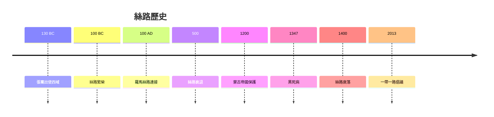
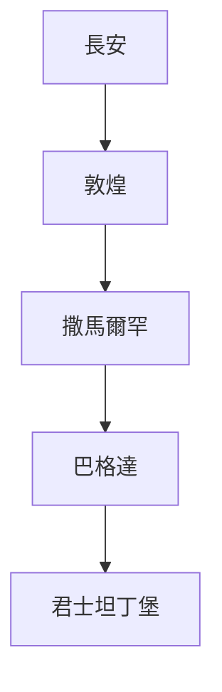
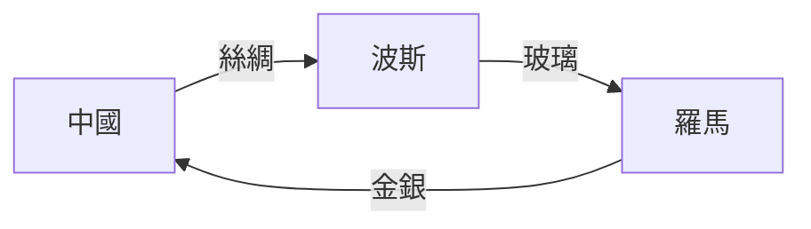
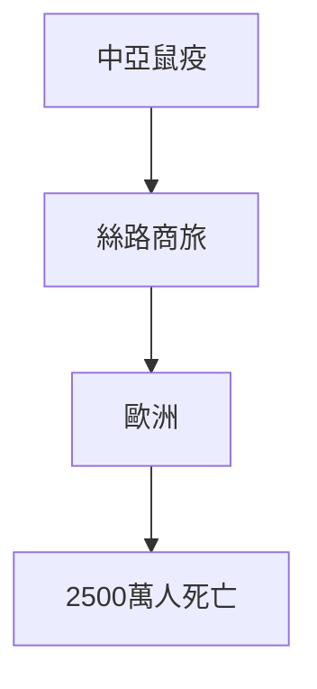
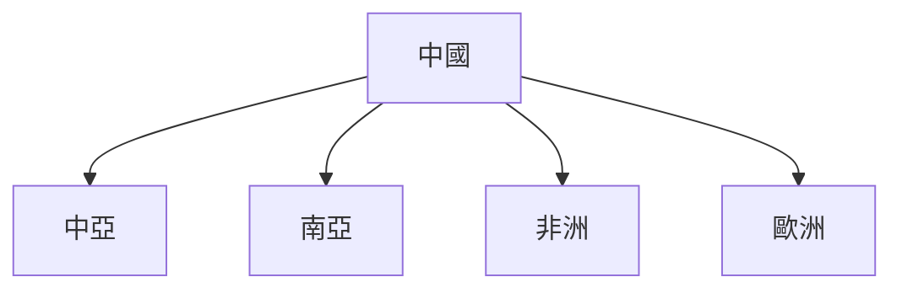

# HIST2208 絲綢之路 / The Silk Roads (6 credits)

**Instructor**: Francesco Calzolaio
**Department**: History, HKU  
**Official source**: [HKU History Course Description 2024-25](https://history.hku.hk/wp-content/uploads/2024/07/HIST-2425.pdf)
**Style**: 袁騰飛式 — 犀利、聚焦絲路點解塑造全球化

---

## 問題 1：這個領域所有專家共享的 5 個核心心智模型

### 心智模型 1：絲路作爲早期全球化
學者 **Peter Frankopan** (*The Silk Roads*, 2015) 研究：絲路唔係地理現象，而係權力關係——谁控制絲路，誰就控制世界。

學者 **Vali Kale Thomas** 分析：絲路商人促進宗教、知識、疾病跨境傳播。

- 張騫出使西域 (138 BC)
- 絲路貿易網絡巠達羅馬
- 瘟疫沿絲路傳播

### 心智模型 2：絲路與伊斯蘭傳播
學者 **Richard Foltz** (*Religions of the Silk Road*, 1999) 研究：伊斯蘭通過商路快速傳播——商人係最早信徒。

學者 **Khwaja M. Khan** 分析：伊斯蘭傳播與商路不可分割。

### 心智模型 3：絲路與黑死病
學者 **William H. McNeill** (*Plagues and Peoples*, 1976) 研究：黑死病 (1347-1353) 沿絲路從中亞擴散到歐洲——導致 2500 萬人死亡。

學者 **John H. Rosser** 分析：瘟疫如何改變歐洲歷史。

### 心智模型 4：絲路衰落與歐洲興起
學者 **Andre Gunder Frank** (*ReOrient*, 1998) 研究：1800 年前，亞洲經濟總量超過歐洲——絲路衰落與歐洲崛起同步。

學者 **Kenneth Pomeranz** (*The Great Divergence*, 2000) 分析：煤礦同美洲令歐洲超越。

### 心智模型 5：當代絲路與中國崛起
學者 **David Shambaugh** 研究：一帶一路倡議——21 世紀版絲路。

學者 **Jean L. G. Gondin** 分析：中國地緣經濟戰略。

---

## 問題 2：3 個根本分歧

### 分歧 1：絲路衰落——蒙古帝國崩潰定歐洲繞道？
- **A 方**：蒙古崩潰
  - 14 世紀鼠疫摧毁商路
- **B 方**：歐洲繞道
  - 大航海時代改變貿易路線

### 分歧 2：絲路重要性——被低估定被高估？
- **A 方**：被低估
  - 塑造歐亞歷史
- **B 方**：被高估
  - 主要商路仍然係海上

### 分歧 3：一帶一路——經濟合作定地緣政治？
- **A 方**：經濟合作
  - 基礎設施投資
- **B 方**：地緣政治
  - 中國擴張工具

---

## 問題 3：10 個深度問題

1. 如果你去 1000 年做絲路商人，你會發現乜嘢？
2. 點解黑死病沿絲路傳播？
3. 如果蒙古帝國冇崩潰，會發生乜嘢？
4. 點解絲路商人往往係宗教傳播者？
5. 如果你去絲路做田野考察，點樣準備？
6. 點解「一帶一路」被西方擔憂？
7. 如果你是歷史學家，點樣研究古代商路？
8. 絲路與大航海時代——點解同期發生但命運相反？
9. 點解中國重新發現絲路神話？
10. 如果你去 2050 年，一帶一路會點樣？

---

## 核心心智模型深化

### 1. 絲路歷史時間線



---

## 5 個 Mermaid 圖解

### 📊 Diagram 1: 絲路路線



### 📊 Diagram 2: 絲路貿易



### 📊 Diagram 3: 疾病傳播



### 📊 Diagram 4: 一帶一路



### 📊 Diagram 5: 絲路遺產

```mermaid
flowchart TD
    A[絲路] --> B[伊斯蘭傳播]
    A --> C[絲綢之路}
    A --> D[文化交換]
```

---

## 總結

1. 絲路塑造歐亞交流歷史
2. 疾病沿商路傳播影響全球
3. 絲路衰落與歐洲興起同步
4. 一帶一路重新發現絲路神話
5. 古代絲路對今日有重要啟示

**最後問題**: 歷史絲路可以教我哋關於全球化乜嘢？

---
**版權所有 © HKU History Self-Study**
