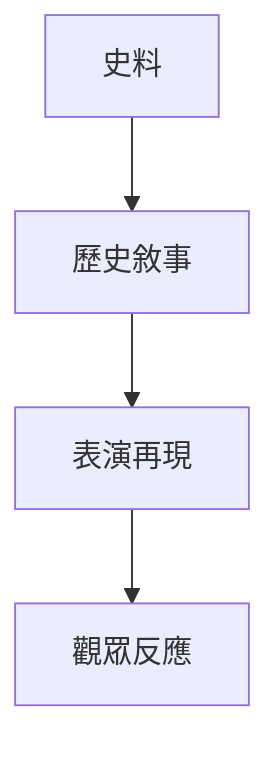

# HIST2212 表演歷史 / Performing History (6 credits)

**Instructor**: Crystal Kwok
**Department**: History, HKU  
**Official source**: [HKU History Course Description 2024-25](https://history.hku.hk/wp-content/uploads/2024/07/HIST-2425.pdf)
**Style**: 袁騰飛式 — 犀利、聚焦表演點解塑造歷史記憶

---

## 問題 1：這個領域所有專家共享的 5 個核心心智模型

### 心智模型 1：表演作爲歷史媒介
學者 **Richard Schechner** (*Performance Theory*, 1977) 研究：表演唔係單純再現，而係「再次行動」(restored behavior)。

學者 **Diana Taylor** (*The Archive and the Repertoire*, 2003) 分析：表演記憶與文獻檔案同樣重要。

### 心智模型 2：歷史表演與權力
學者 **Erika Fischer-Lichte** (*Theatre of the World*, 2009) 研究：歷史表演揭示權力運作——邊個有權表演，邊個被表演。

學者 **Joseph Roach** (*Cities of the Dead*, 1996) 分析：表演與記憶政治。

### 心智模型 3：身份表演性
學者 **Judith Butler** (*Gender Trouble*, 1990) 指出：身份唔係固定本質，而係持續表演過程。

學者 **Stuart Hall** 分析：文化身份永遠係「變成」(becoming)。

### 心智模型 4：表演研究方法論
學者 **Susan Sontag** 研究：解讀表演需要批判視角。

學者 **Philip Zarilli** 分析：表演作爲田野考察方法。

### 心智模型 5：公眾歷史與表演
學者 **David Dean** 研究：博物館、紀念館表演歷史記憶。

學者 **Annie E. Coombes** 分析：殖民記憶表演爭議。

---

## 問題 2：3 個根本分歧

### 分歧 1：表演與歷史真實——表演可以真實嗎？
- **A 方**：可以
  - 捕捉情感真相
- **B 方**：有限制
  - 歷史事實壓縮

### 分歧 2：表演研究——藝術方法定歷史方法？
- **A 方**：藝術方法
  - 美學標準
- **B 方**：歷史方法
  - 史料批判

### 分歧 3：歷史表演——教育功能定政治工具？
- **A 方**：教育功能
  - 公眾歷史
- **B 方**：政治工具
  - 記憶政治

---

## 問題 3：10 個深度問題

1. 如果歷史係表演，邊個決定點演？
2. 點解某些歷史被表演，某些被忽視？
3. 如果你去歷史博物館，點解要表演？
4. 表演研究點解挑戰傳統歷史方法？
5. 如果你是歷史演員，點樣平衡準確同娛樂？
6. 點解香港歷史表演特別敏感？
7. 如果你去 2049 年做香港回歸田野，你會表演乜嘢？
8. 表演研究點解對後殖民研究重要？
9. 如果你是導演，點樣表演「歴史」？
10. 歷史表演——點解香港大學要學？

---

## 核心心智模型深化

### 1. 表演研究框架

```mermaid
flowchart TD
    A[表演] --> B[身份]
    B --> C[權力]
    C --> D[記憶]
    D --> E[歷史}
```

---

## 深度自測問題

### 詳解 1: 如果歷史係表演...
歷史從來都唔係「客觀再現」——所有歷史敘事都係選擇性建構。表演只係將呢個過程變得更加明顯。

---

## 5 個 Mermaid 圖解

### 📊 Diagram 1: 表演與歷史



### 📊 Diagram 2: 表演研究方法

```mermaid
flowchart TD
    A[表演田野] --> B[身體知識]
    A --> C[檔案]
    B --> D[歷史理解}
```

### 📊 Diagram 3: 身份表演

```mermaid
flowchart TD
    A[性別] --> B[表演]
    B --> C[權力}
    C --> D[社會規範}
```

### 📊 Diagram 4: 記憶政治

```mermaid
flowchart TD
    A[官方記憶] --> B[表演]
    B --> C[權力}
    C --> D[歷史爭議}
```

### 📊 Diagram 5: 公眾歷史

```mermaid
flowchart TD
    A[博物館] --> B[表演]
    B --> C[公眾參與]
    C --> D[歷史教育}
```

---

## 總結

1. 表演係重要歷史媒介
2. 表演揭示身份、權力、記憶
3. 表演研究挑戰傳統歷史方法
4. 公眾歷史通過表演教育
5. 表演研究對理解當下社會重要

**最後問題**: 如果你去歷史表演，你最想演邊個歷史？

---
**版權所有 © HKU History Self-Study**
